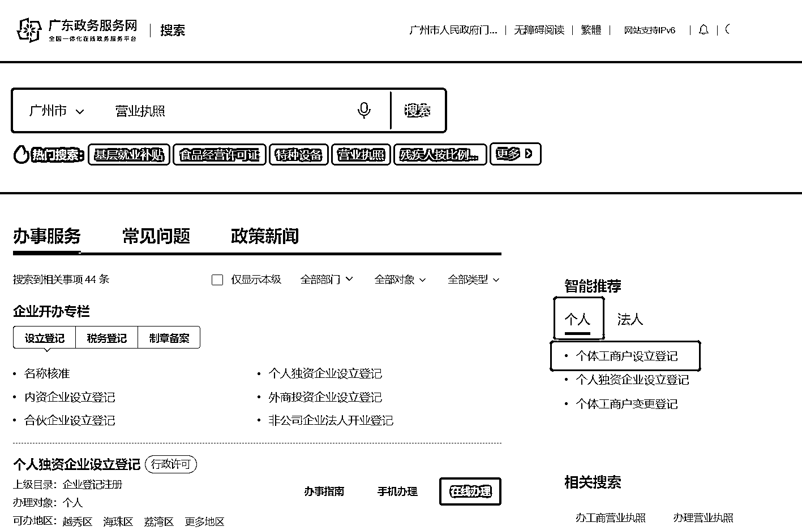
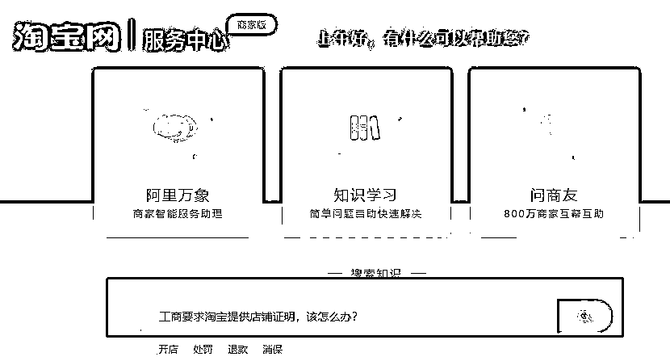
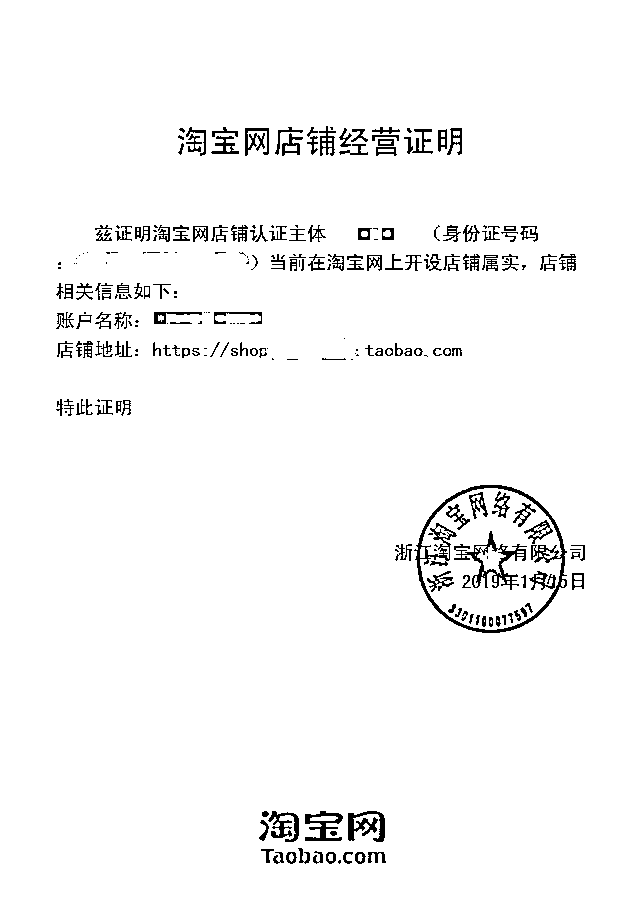

# 手把手教你办理无地址的电商营业执照

> 原文：[`www.yuque.com/for_lazy/thfiu8/au6wcixcgypglml4`](https://www.yuque.com/for_lazy/thfiu8/au6wcixcgypglml4)

## (74 赞)手把手教你办理无地址的电商营业执照 

作者： 广深莞注册公司@山歌 

日期：2023-07-24 

最近两天很多圈友私我都想问无地址的电商营业执照具体的操作方式，因为之前在淘宝买的两三百的执照批量出问题了。所以特地整理出一份操作手册给圈友们。整理不易，如有收获，感恩点赞！交个朋友！ 

这里不建议大家去找那些网上几百块钱甚至几十块钱待办营业执照的人，后续的安全隐患较大，这种待办的注册地址一般十分偏远。 

如果后期不做网店了需要闭店，想要注销，那成本是要好几千块钱的。如果不去注销，就会变成工商黑户甚至面临税务罚款。 

今天就来教大家用一分钟学会自己去线上申办营业执照。 

（广州的圈友朋友们可以直接从跳转至第 5 步。或者微信搜索：广州市一网通企业开办平台，登录最下面一栏选中间的个体户业务） 

第一步，打开浏览器，输入“政务服务网”，选择自己所在省份的平台。 

  

第二步，登录 - 个人登录。 

 

 

第三步，站内搜索“营业执照”，选择“个体工商户设立登记”。 

 

第四步，选择“在线办理”。 

 

第五步，微信扫码。 

 

第六步，点击开业登记 - 选择“电商经营” 。 

 

接下来就是填写好自己的资料信息了，非常简单方便。 

注意：每个省份的政务服务平台都有这个功能，只是界面不一样，但是操作起来都是大同小异的，按照文章的方法去找就行了。 

当然，可能有点商家不太熟悉线上操作，怕出错了，也可以去线下去工商所办理，工作人员会耐心教你的。 

申请前需要准备： 

  1、个体户名字（2-6 个字），准备 2-3 个名字备选 

  主营项目类别: 根据名称相关行业确定 

  2、地址资料（看后面有不同平台的网络经营地址证明下载方式） 

  3、注册资金 

  4、经营范围（对标行业参考） 

  5、个体户自然人身份证正反面照片（拍正、四边可见、不反光，清晰发原图）及电话和邮箱 

拼多多 

1.1 打开拼多多商家后台，点击左边栏的“店铺信息”。 

 

1.2 点击“主体信息”，选择“开具开店证明”，可以把这个证明下载下来。打印出来后去当地的税务局就可以进行线下申办营业执照了。 

 

淘宝 

2.1 进入淘宝网首页，点击右上方的“联系客服”选择“卖家客服”。（淘宝的路径：卖家中心——店铺——经营证明；） 

 

2.2 进入淘宝网服务中心，在搜索框上输入“工商要求淘宝提供店铺证明，该怎么办？” 

 

2.3 登陆以下链接：[https://openshop.taobao.com/tools/certificate.htm#](https://openshop.taobao.com/tools/certificate.htm) 直接点击下载证明即可。 

 

淘宝开具的“淘宝网店铺经营证明”样例↓ 

 

另外，大部分淘宝卖家也可以通过淘宝小镇[https://taobao.yuntrial.com/app/](https://taobao.yuntrial.com/app)在线申请电子营业执照。电子营业执照是从工商部门系统发出，真实有效且具有法律效应，后续可查询全国企业信用公示系统。 

重要提示 

① 适用范围：通过淘宝小镇申请的电子营业执照只能适用于淘宝网平台，且只适用于自然人经营者。 

② 不支持在线办理的类目有哪些：许可经营项目（如食品，药品，二类、三类医疗器械，危险化学品），虚拟产品（如游戏，虚拟币）、金融类服务等经营类别。这些淘宝商家可在当地工商局自主办理营业执照。 

微店 

3.1 在微店经营的个体老板们，咱们直接进入微店网站，在页面右上方的“帮助中心”点击“我是卖家”栏目，在常见问题列表中找到“电商法出台，如何合规经营”这一问题。 

 

 

3.2 点击这问题后，往下拉，就可以看到如下图提示，这时登录商家账户，经过实名认证，就可以开具证明了！ 

 

3.3 微店开具的“微店平台店铺经营证明”样例↓ 

 

已登记的微店平台营业执照↓ 

 

小红书 

4.1 进入商家管理后台-店铺-店铺账号信息-小红书开店证明 

 

 

抖音 

  注意啦：有说法说抖店不认这种执照但是我们还是有在网上找到相关路径，大家可以去试试回来给我答复哈哈哈。 

  1、进入经营号网页的商家后台申请，此时系统会自动弹出，营业执照登记尝试选择通知。 

  2、然后点击，下载开店证明。 

  3、网页自动弹出，开具开店证明须知，在此界面点击，下载开店证明即可。抖音平台网络经营场所证明如下首先打开抖音在我的界面点击【创作者服务中心】进入。 

  2/3 然后在功能列表里点击【商品橱柜】进入。 

  3/3 最后点击【联系运营】进行提交申请。具体证明还需要线下找相关单位开通哟。 

Q&A 

01 营业执照有什么类型？怎么分辨自己需要办理的类型？ 

营业执照分为个体工商户营业执照和企业法人营业执照。 

个体工商户主要适合于个人经营的小型商铺，注册简单，税收负担相对较低。如果办理的是网店的营业执照，甚至还用不到实体地址注册，只需用网店网址就可以成功注册电商营业执照。 

而企业法人主要适用于有多名合伙人或准备把企业做大做强的情况，注册相对繁琐，税收负担较高，但风险较小，企业的财产不受个人的行为而受到损失。企业后续的财务和行政事务也较多。 

02 注册要写地址吗？ 

实体店的营业执照申办是要真实地址的，需要用到租赁合同或产权证明。电商经营营业执照就不用，电商经营营业执照只需要填写网店网址。 

03 申办营业执照要钱吗？ 

自己申办是免费的，找人线下代办 600-1000 都有人做，注意这种和那种 200 买一张的不一样的哈。 

网上 200-300 买一张的，虽然前期办理较为方便，但后期如果需要注销店铺会很麻烦且有较大的风险，不建议网上找代办。自己网上申办也是很简单的，可以阅读这篇文章进行参考。 

04 不止一个网店，要注册多个营业执照吗？ 

不用注册多个的，申请电商营业执照时点击“添加多个经营场所”即可添加多个网店和平台。 

05 找不到电商营业执照申办入口怎么办？ 

目前电商营业执照是可以进行线上申办的，各个地区的线上业务可能存在差异。如果找不到入口，建议打电话问一下当地的工商局，确认一下是否需要到线下办理。 

06 申办营业执照后就要做账交税了吗？ 

是的，一旦申办营业执照成功，就需要开始做账和缴纳税款了。 

（当然如果你没有做税务报道就可以先不记账报税，不过可能会有一定风险哦，注意每年必须要工商填写工商年报，年报的操作指引下次发出来，欢迎持续关注） 

评论区： 

韵味🍭 : 太详细啦 紫色的彩虹 : 注销有什么风险？ 雨烟 : 感谢分享！ 广深莞注册公司@山歌 : 有些 200/300 一张执照用了虚假地址，注销不掉需要面临罚款。所以还是自己地址很香 向前飞奔 : 在广州办网店用的营业执照，还需要居住证的 广深莞注册公司@山歌 : 感谢补充 路人乙 : 🙋🏻‍♀️刚交楼的公寓还没房产证可以挂靠吗？ 广深莞注册公司@山歌 : 在哪个城市，例如深圳能查到 25 位房产编码可以，广州要看哪个区 

 