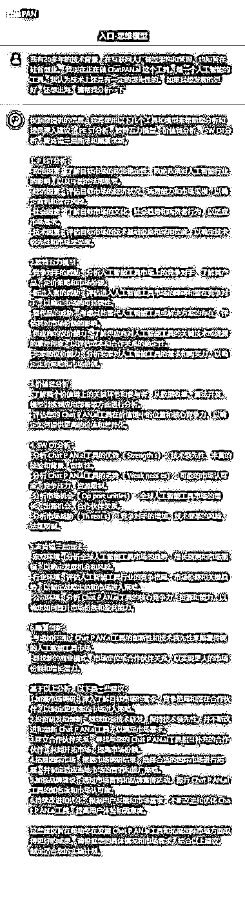
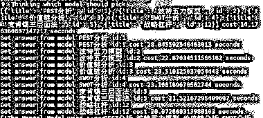

# 如何利用 AI 助手选择最优模型解决问题

> 原文：[`www.yuque.com/for_lazy/thfiu8/fxg8l2ua8qvg1q1s`](https://www.yuque.com/for_lazy/thfiu8/fxg8l2ua8qvg1q1s)

## (29 赞)如何利用 AI 助手选择最优模型解决问题 

作者： 大铭🍀 

日期：2023-07-27 

如何利用 AI 助手选择最优模型解决问题 

事情的缘起是大家在群里讨论思维模型，说有没有一个办法，当我提一个问题的时候，让 AI 来判断从众多的思维模型中选择合适的模型对问题进行分析 

我们来梳理一下从用户提问到拿到结果的流程，然后就很容易设计出来通路了 <ne-oli index-type="0">1.  用户提出问题 <ne-oli index-type="0">2.  模型分析助手根据问题进行分析，分析出有哪些模型适用这个问题 

+   分析助手首先拥有所有备选模型的说明 

+   分析助手结合用户问题和模型说明，选择合适的模型 <ne-oli index-type="0">3.  用选中的模型去对用户的问题进行解答 <ne-oli index-type="0">4.  把多个选中模型的解答，统一整理，然后作为对用户的回答 

这里面就用到了分析助手和工作助手的的协同 

使用  进行二次开发。 花了 6 小时完成了原型搭建。 

现在已经上传了 17 个模型，下图是一些回答的效果。 还有很多的改进空间。 

具体的实现请见 [https://chatpan.ai](https://chatpan.ai)[https://doq0dv37ak.feishu.cn/docx/RRL5d8EphoW3XNxlQpEcT3L0nmc](https://doq0dv37ak.feishu.cn/docx/RRL5d8EphoW3XNxlQpEcT3L0nmc) 

 

 

评论区： 

良辰美 : 本来想做个产品，大概类似用户一次性输入，GPT 产出各种模型下的答案，这个应该在各行业都有垂直场景可以挖掘 大铭🍀 : 可以细聊，这个我这边技术上已经搞定了 

  