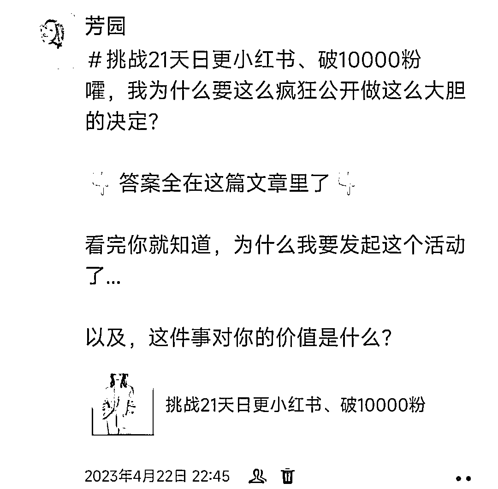

# 我如何做到 399 元的 21 天围观群，一个月变现 7w+？

> 原文：[`www.yuque.com/for_lazy/thfiu8/undrm31v8hdydxs9`](https://www.yuque.com/for_lazy/thfiu8/undrm31v8hdydxs9)

<ne-h2 id="a9346a66" data-lake-id="a9346a66"><ne-heading-ext><ne-heading-anchor></ne-heading-anchor><ne-heading-fold></ne-heading-fold></ne-heading-ext><ne-heading-content><ne-text id="ube7061ed">(47 赞)我如何做到 399 元的 21 天围观群，一个月变现 7w+？</ne-text></ne-heading-content></ne-h2> <ne-p id="u5571f842" data-lake-id="u5571f842"><ne-text id="u1ae9a596">作者： 芳园朋友圈</ne-text></ne-p> <ne-p id="u8a51c2b3" data-lake-id="u8a51c2b3"><ne-text id="ud260d82b">日期：2023-07-26</ne-text></ne-p> <ne-p id="ue3046ecd" data-lake-id="ue3046ecd"><ne-text id="u6461d811">今年 4 月份，我做了一个“进步可视化”的产品，发起了一个“挑战 21 天日更小红书、破 10000 粉”的计划，并公开让大家围观，用户花 399 元门票费，即可进我的 21 天围观群，围观我做小红书和私域变现，我会在群里每天分享我对小红书、私域变现的思考，</ne-text><ne-text id="u829276cc" ne-bold="true">1 个月的时间，仅这个群为我变现了 7w+</ne-text><ne-text id="ua54f1088">，我是如何做到的？</ne-text></ne-p> <ne-p id="ufe571abf" data-lake-id="ufe571abf"><ne-text id="u369ce814">大家好，我是芳园，6 年私域操盘手，之前在大厂带领近 10 人团队负责私域业务，去年从某互联网大厂裸辞创业做 IP，实现第一个月变现 10w，3 个月变现 20w+，目前专注帮想在线上做 IP 的创业者提供私域变现和精准引流辅导</ne-text></ne-p> <ne-p id="ua73c08ee" data-lake-id="ua73c08ee"><ne-text id="u82f4f644">接下来我会结合这次的自身案例，以“如何做一场批量发售”、“如何实现低客单转高客单”这两个维度和大家分享我的变现经验，以下内容</ne-text><ne-text id="u27ad8fdd" ne-bold="true">3121</ne-text><ne-text id="ue4d907f0">个字，预计阅读时间</ne-text><ne-text id="u33d4e49a" ne-bold="true">3min</ne-text></ne-p> <ne-p id="u20f48432" data-lake-id="u20f48432"><ne-text id="u231d044e" ne-bold="true">一、如何做一场批量发售</ne-text></ne-p> <ne-p id="u6e69d6dd" data-lake-id="u6e69d6dd"><ne-text id="u429d6b70">先来分享下，我是如何卖 399 元 21 天围观群的门票，花 5 天时间卖了近 60 张，变现 2w+的</ne-text></ne-p> <ne-p id="uda54cf97" data-lake-id="uda54cf97"><ne-text id="u9a5a4047">3 个关键因素：老学员预售、日常社群预售、朋友圈提前释放信号</ne-text></ne-p> <ne-p id="u1a580aa9" data-lake-id="u1a580aa9"><ne-text id="u15a563f6" ne-bold="true">1、老学员预售</ne-text></ne-p> <ne-p id="ufbea9670" data-lake-id="ufbea9670"><ne-text id="u4c78b745">没有人喜欢第一个吃螃蟹，人都是有从众心理的，只有先看到别人买了，他才更容易产生购买，所以，当你要做一场发售，一定要先从最信任你的用户这里先转化一波，让他们成为你的种子用户，帮你积攒势能，然后你再对外去做发售</ne-text></ne-p> <ne-p id="u9660f53b" data-lake-id="u9660f53b"><ne-text id="u0f539be6">第一波势能有了，后续才会更好转化</ne-text></ne-p> <ne-p id="u45a3b10e" data-lake-id="u45a3b10e"><ne-text id="u02c091c4">4 月 18 号，我在我一个训练营的群里先发起了预售福利的活动，这些学员此前体验过我的交付，他们是最信任我的</ne-text></ne-p> <ne-p id="uccc3d13e" data-lake-id="uccc3d13e"><ne-text id="ucc89cb9c">当然，既然是给老学员的预售，我肯定要给他们特殊的福利，对外 399 的门票，他们能享有 200 的福利价，且完成全部课程复盘，即可返还 200 学费</ne-text></ne-p> <ne-p id="u607679f5" data-lake-id="u607679f5"><ne-text id="u6c426ac0">20 多个学员中报名了 13 个，基本上活跃的、时间不冲突的学员都报名了</ne-text></ne-p> <ne-p id="u0ca8b4d4" data-lake-id="u0ca8b4d4"><ne-text id="uc8891eef">他们成为了我的第一批种子用户</ne-text></ne-p> <ne-p id="u2ed1c21f" data-lake-id="u2ed1c21f"><ne-text id="u5c76510e" ne-bold="true">2、日常社群预售</ne-text></ne-p> <ne-p id="u1d7ce4bf" data-lake-id="u1d7ce4bf"><ne-text id="udb8a877c">我有 2 个 200+人的免费社群。这里得检讨下，平时没太多时间精力维护，活跃度不算高</ne-text></ne-p> <ne-p id="uff11246e" data-lake-id="uff11246e"><ne-text id="u526b4bd8">尽管如此，这两个群还是为我带来了近 5000 的门票费变现，成交 12 个，具体怎么做的？</ne-text></ne-p> <ne-p id="u7dc23f47" data-lake-id="u7dc23f47"><ne-text id="u7cdcae7d">4 月 18 号晚上，我先在群里做了一波干货分享，算是先把群激活，吸引用户注意力</ne-text></ne-p> <ne-p id="u9d5f1ed4" data-lake-id="u9d5f1ed4"><ne-card data-card-name="image" data-card-type="inline" id="kL1RT" data-event-boundary="card"></ne-card></ne-p> <ne-p id="u38891789" data-lake-id="u38891789"><ne-text id="u2b64b16e">4 月 20 号下午，我在群里做了一波群公告预热，预告今晚 9 点发放福利</ne-text></ne-p> <ne-p id="u744612ee" data-lake-id="u744612ee"><ne-card data-card-name="image" data-card-type="inline" id="WSNZ1" data-event-boundary="card"></ne-card></ne-p> <ne-p id="u2d8e0b93" data-lake-id="u2d8e0b93"><ne-text id="ue1a645e1">4 月 20 号晚上，我在群里做了一波文字的发售，原价 599 元的门票，群里的人优先享有 399 元早鸟价，仅限前 30 个名额</ne-text></ne-p> <ne-p id="u5d8e5610" data-lake-id="u5d8e5610"><ne-card data-card-name="image" data-card-type="inline" id="HGObS" data-event-boundary="card"></ne-card></ne-p> <ne-p id="u1ae1f2b1" data-lake-id="u1ae1f2b1"><ne-text id="u225b539b">（讲到这里，如果让我复盘优化，群里的用户，除了享有 399 元的早鸟价以外，我会再额外送别的福利，比如一份价值很高的、他们很需要的资料，这样成交转化率会更高。</ne-text><ne-text id="u198fd70f" style="color: rgb(216, 57, 49);">如果成交主张没有给到位，会直接影响转化效果</ne-text><ne-text id="u1a8a3418">）</ne-text></ne-p> <ne-p id="ucba7fc94" data-lake-id="ucba7fc94"><ne-text id="u68ddcdf0">一旦有用户成交了，我就把付款截图发在群里，并让已付款的人接龙，形成从众心理</ne-text></ne-p> <ne-p id="u792c580f" data-lake-id="u792c580f"><ne-text id="u368010d1" ne-bold="true">3、朋友圈提前释放信号</ne-text></ne-p> <ne-p id="u9d7035cf" data-lake-id="u9d7035cf"><ne-text id="u28b411a3">注意，这里我说的是，要在朋友圈提前释放信号，而不是直接就开始发海报卖课。为啥？</ne-text></ne-p> <ne-p id="u1f39f39c" data-lake-id="u1f39f39c"><ne-text id="ua03bec3d">因为一方面，现在的朋友圈打开率下滑、营销类容易被折叠、限流等原因，你靠朋友圈直接发广告触达的用户量较为有限</ne-text></ne-p> <ne-p id="u459f20fe" data-lake-id="u459f20fe"><ne-text id="uc11df3a3">另一方面，你直接发广告海报，太过于生硬了，直接发广告，没有任何铺垫，就会有很强的推销感，人本能会对推销感很强的东西有排斥感</ne-text></ne-p> <ne-p id="ufa133482" data-lake-id="ufa133482"><ne-text id="u91333ea6">前期做好铺垫，埋下钩子和噱头，用户会更有好奇心被你吸引</ne-text></ne-p> <ne-p id="u5d5ccdc6" data-lake-id="u5d5ccdc6"><ne-text id="ufcd5d623">用户是需要有充足的关注理由的</ne-text></ne-p> <ne-p id="ud47e26ef" data-lake-id="ud47e26ef"><ne-text id="ua8805e60">所以需要先埋个钩子，吸引一部分用户关注，再发海报，这样就能触达到更多潜在用户</ne-text></ne-p> <ne-p id="u86195805" data-lake-id="u86195805"><ne-text id="ud23759c8">具体怎么做呢？拿我举例子</ne-text></ne-p> <ne-p id="u8dff3102" data-lake-id="u8dff3102"><ne-text id="ucbdb6c14">4 月 21 号，我滚动式发了 3 条类似内容的朋友圈，让感兴趣的用户点赞关注</ne-text></ne-p> <ne-p id="u63eb936e" data-lake-id="u63eb936e"><ne-card data-card-name="image" data-card-type="inline" id="LUzOQ" data-event-boundary="card"></ne-card></ne-p> <ne-p id="ud634151b" data-lake-id="ud634151b"><ne-text id="u6112ad5d">为了得到更多曝光，类似的内容每过 1 小时就发一遍，然后把前一条隐藏起来（这里额外给个小技巧：发美美的自拍照更能获取关注点赞，哈哈）</ne-text></ne-p> <ne-p id="ue6b5c943" data-lake-id="ue6b5c943"><ne-text id="u0b57ebea">3 条圈我一共收获了 60+个点赞</ne-text></ne-p> <ne-p id="ud8715283" data-lake-id="ud8715283"><ne-text id="u6d0d314f">4 月 22 号，我在公众号发布了 21 天围观群的销售信，同时在朋友圈公布</ne-text></ne-p> <ne-p id="u4556918c" data-lake-id="u4556918c"><ne-card data-card-name="image" data-card-type="inline" id="UY4YS" data-event-boundary="card"></ne-card></ne-p> <ne-p id="uf4977816" data-lake-id="uf4977816"><ne-text id="uf52cc6cc">4 月 23 号—25 号，开始在朋友圈滚动式营销，主要内容包括：</ne-text></ne-p> <ne-p id="u7b88a63b" data-lake-id="u7b88a63b"><ne-text id="u152d58f9">① 课程销售文案、课程海报、销售信（活动官宣）</ne-text></ne-p> <ne-p id="u5ed6a165" data-lake-id="u5ed6a165"><ne-text id="u419383da">② 此前已购买的一批种子用户的晒单（从众心理）</ne-text></ne-p> <ne-p id="u90adfdce" data-lake-id="u90adfdce"><ne-text id="u95f1205a">③ 新成交用户晒单（从众心理）</ne-text></ne-p> <ne-p id="ub7cfde3a" data-lake-id="ub7cfde3a"><ne-text id="ufbc38307">④ 我发起活动的初心（价值观共鸣）</ne-text></ne-p> <ne-p id="u0d8e2b18" data-lake-id="u0d8e2b18"><ne-text id="u7ae018ee">⑤ 不得不买的购买理由（戳痛点，放大需求）</ne-text></ne-p> <ne-p id="u89642abd" data-lake-id="u89642abd"><ne-text id="ue001fbb1">⑥ 我做 IP 的个人故事连环圈（用故事引发共鸣）</ne-text></ne-p> <ne-p id="u83ad45ba" data-lake-id="u83ad45ba"><ne-text id="u63cac032">⑦ 优惠名额、报名时间倒计时（稀缺、紧迫感）</ne-text></ne-p> <ne-p id="ue24fccc6" data-lake-id="ue24fccc6"><ne-text id="ue488c1d2">4 月 24 号我还做了一件事情，还记得我 4 月 21 号埋钩子吸引了 60+个点赞吗？</ne-text></ne-p> <ne-p id="u41d91160" data-lake-id="u41d91160"><ne-text id="u4475f709">然后我一一私信提醒他们该活动，这波私信提醒成交了近 10 个</ne-text></ne-p> <ne-p id="u505c8c35" data-lake-id="u505c8c35"><ne-text id="u680dd902">通过朋友圈滚动，我一共卖了 33 个，变现 13000+，门票共计卖了 58 个，变现 20000+</ne-text></ne-p> <ne-p id="u726b1cf0" data-lake-id="u726b1cf0"><ne-text id="u07e1204b">其实本来可以卖得更多，但当时我觉得这是个小活动，没有定太高目标，就不想动静搞太大，比较克制，朋友圈几乎只卖了 3 天，且发圈数量并不多，社群后来也几乎没有做追销动作，不想过度打扰用户</ne-text></ne-p> <ne-p id="uf7477d83" data-lake-id="uf7477d83"><ne-text id="uc196c041">一场活动的营销力度取决于你对它的目标和预期，不是所有活动都非得要很用力，</ne-text><ne-text id="u85cbcd30" style="color: rgb(216, 57, 49);">在私域，过度用力有时对你对用户，反而是种消耗</ne-text></ne-p> <ne-p id="uf8ce6a60" data-lake-id="uf8ce6a60"><ne-text id="ub7f00d14">如果我当时把它的重要级再往上提，我会优化调整策略，比如：</ne-text></ne-p> <ne-p id="ue62c5dab" data-lake-id="ue62c5dab"><ne-text id="ubbf72ba4">①在我日常社群里的预售送给用户额外福利，且后续增加追销动作</ne-text></ne-p> <ne-p id="uaad893e0" data-lake-id="uaad893e0"><ne-text id="uc560c8e8">②朋友圈卖门票的时间周期再拉长至 5-7 天，且发圈数量再多些</ne-text></ne-p> <ne-p id="u5d52d2d3" data-lake-id="u5d52d2d3"><ne-text id="u834cd4eb">③筛选潜在客户，定向 1v1 邀约……那至少能再多卖 20-30 张</ne-text></ne-p> <ne-p id="u68fbdc48" data-lake-id="u68fbdc48"><ne-text id="udea85296" ne-bold="true">二、如何实现低客单转高客单</ne-text></ne-p> <ne-p id="ufbf4bb91" data-lake-id="ufbf4bb91"><ne-text id="u5b5627a2">这场活动最主要的目的并不是为了卖门票，而是</ne-text><ne-text id="ud8b9201b" style="color: rgb(216, 57, 49);">用 399 的低门槛，筛选出潜在客户，然后通过超值交付，给到用户超预期体验，最终转化高客单产品</ne-text></ne-p> <ne-p id="u31e9f6a7" data-lake-id="u31e9f6a7"><ne-text id="u219cb2b4">这 53 个用户中（后来有 5 个用户觉得内容不适合他们，就退了，我的课支持无理由退款），我又在 21 天交付时间里转化变现了 5w+，我是怎么做到的？</ne-text></ne-p> <ne-p id="u9baa8d8e" data-lake-id="u9baa8d8e"><ne-text id="u6be1e89c">3 个关键词：超值交付、释放信号、预售转化</ne-text></ne-p> <ne-p id="u9ba6ca3c" data-lake-id="u9ba6ca3c"><ne-text id="u960b8104" ne-bold="true">1、超值交付</ne-text></ne-p> <ne-p id="ubc9f6f64" data-lake-id="ubc9f6f64"><ne-text id="u83dff2fc">很多学员都在群里说我的交付太超值了</ne-text></ne-p> <ne-p id="u0bed591b" data-lake-id="u0bed591b"><ne-text id="ub35b950e">这是让用户升单、复购最最最关键的部分！</ne-text></ne-p> <ne-p id="u076aaeb8" data-lake-id="u076aaeb8"><ne-card data-card-name="image" data-card-type="inline" id="OSunX" data-event-boundary="card"></ne-card><ne-card data-card-name="image" data-card-type="inline" id="XGGQD" data-event-boundary="card"></ne-card></ne-p> <ne-p id="u9dab953b" data-lake-id="u9dab953b"><ne-text id="u6afdca86">我如何在 399 元的 21 天围观群里，让用户有一种 3999 元的超值感？</ne-text></ne-p> <ne-p id="uc390d688" data-lake-id="uc390d688"><ne-text id="u97760161">①开营仪式我公布了彩蛋福利：完成全部课程的复盘，将返还 200 元学费；每天在群里输出所学收获，将得到价值不少于 1000 元的神秘大礼包</ne-text></ne-p> <ne-p id="uc106128e" data-lake-id="uc106128e"><ne-text id="uf32e1bca">用户在报名前，并不知道有这两项福利，当他们报名后我再公布彩蛋福利，就有种“赚到了”的感觉</ne-text></ne-p> <ne-p id="u0e9f04ec" data-lake-id="u0e9f04ec"><ne-text id="u96edf457">此外，我设计彩蛋福利，不只是为了给用户超值感，更是为了加强用户的参与感</ne-text></ne-p> <ne-p id="u7f3ca61f" data-lake-id="u7f3ca61f"><ne-text id="u8d92085f">越参与越收获，只有调动用户充分参与进来，他才会觉得更有收获，因此才会更认可你的交付</ne-text></ne-p> <ne-p id="u9e828d06" data-lake-id="u9e828d06"><ne-text id="u03ff690d" style="color: rgb(216, 57, 49);">如果用户没有参与感，你的内容再干货，他的收获也是很有限的</ne-text></ne-p> <ne-p id="u786d7f0f" data-lake-id="u786d7f0f"><ne-text id="u118195b7">② 开营仪式我是用直播形式的，除了公布彩蛋福利和基本规则外，我还额外给大家分享了做小红书的干货，相当于是加餐分享</ne-text></ne-p> <ne-p id="u9446cea9" data-lake-id="u9446cea9"><ne-text id="u0b4c927f">用户会觉得，开营仪式居然能听到额外加餐的分享，且还是如此重磅的干货，就更别提正式交付的价值有多高了</ne-text></ne-p> <ne-p id="u68939df8" data-lake-id="u68939df8"><ne-text id="u4808fdee">于是他们会有种“来对了”的感觉，并对接下来的交付内容充满期待</ne-text></ne-p> <ne-p id="uf647d6c7" data-lake-id="uf647d6c7"><ne-text id="uadde4a33">③ 第一天的正式交付时间是在晚上，但我下午又做了一场文字的加餐分享，相当于用户又额外得到了价值，甚至有学员直接感慨“还没正式交付，就已经觉得值回票价了”</ne-text></ne-p> <ne-p id="u622bea67" data-lake-id="u622bea67"><ne-card data-card-name="image" data-card-type="inline" id="q3C4x" data-event-boundary="card"></ne-card></ne-p> <ne-p id="uddf117d2" data-lake-id="uddf117d2"><ne-text id="u6b6786d2">④ 正式交付期间，除了交付我基础承诺的小红书、私域变现的内容外，我还会分享其他内容，如做 IP 的底层心法、我参加线下游学闭门会的收获 4 小时直播分享等等，学员花 399，就能学到很多东西，觉得很超值</ne-text></ne-p> <ne-p id="uffbf88cd" data-lake-id="uffbf88cd"><ne-text id="u6bc05a5d">这里有个关键：</ne-text><ne-text id="ue9285e52" style="color: rgb(216, 57, 49);">你要在用户关注度最高的时候</ne-text><ne-text id="u94f9f5a4">（比如开营、第一场分享），</ne-text><ne-text id="u83f4ecfe" style="color: rgb(216, 57, 49);">就给到用户超预期体验</ne-text><ne-text id="uabdb5719">，那他会有很高的评价，并对接下来的交付充满期待</ne-text></ne-p> <ne-p id="ub06f6046" data-lake-id="ub06f6046"><ne-text id="uf5811c03">如果在他关注度最高的时候，你给他的体验是“也就那样”、“不过如此”，没有惊喜感，那他对接下来的交付就可能不会很重视，若不重视、不参与，就更别提他的收获感了</ne-text></ne-p> <ne-p id="u8267ecf9" data-lake-id="u8267ecf9"><ne-text id="udbf3628f">毕竟现在信息爆炸，用户的注意力都很稀缺，</ne-text><ne-text id="ue08a16ef" style="color: rgb(216, 57, 49);">只有他足够重视、足够期待，才会足够关注和参与</ne-text></ne-p> <ne-p id="u0d5d82de" data-lake-id="u0d5d82de"><ne-text id="ufa74c47f" ne-bold="true">2、释放信号</ne-text></ne-p> <ne-p id="u7106293d" data-lake-id="u7106293d"><ne-text id="uee88de35">提倡大家阳谋营销，你有什么产品，就大大方方卖，无需遮遮掩掩。成交的本质是成就对方，如果你的发心是为了帮助别人，那就没啥不好意思卖的</ne-text></ne-p> <ne-p id="udbb464a2" data-lake-id="udbb464a2"><ne-text id="u9a31977e">我在给学员上直播课的时候，合适的时机会提到，欢迎大家来报我的 xx 课，有些学员就会主动来咨询课程</ne-text></ne-p> <ne-p id="u467d7642" data-lake-id="u467d7642"><ne-text id="u9444c51b" ne-bold="true">3、预售转化</ne-text></ne-p> <ne-p id="u5e2a43b3" data-lake-id="u5e2a43b3"><ne-text id="u54a93233">结营仪式时，趁大家的关注度还在，我立马在结营仪式的末尾给大家介绍我的 2 个新课程（100 天私教和年度私教），同样给到了内部预售福利，比我正式对外的价格要便宜，且除了价格优惠，还有赠品福利</ne-text></ne-p> <ne-p id="uc442b17a" data-lake-id="uc442b17a"><ne-text id="ub2100fc5">通过以上这 3 个关键词，我转化了 4 个 100 天私教，2 个年度私教，变现 50000+</ne-text></ne-p> <ne-p id="u815c94d4" data-lake-id="u815c94d4"><ne-text id="u6fa6b8f2">这里我需要特别说明下：</ne-text></ne-p> <ne-p id="ud08fdf80" data-lake-id="ud08fdf80"><ne-text id="u4981ad4d">其实我的这个预售转化率不算高，差不多只有 11%的转化率，为啥呢？</ne-text></ne-p> <ne-p id="u50c0ee9f" data-lake-id="u50c0ee9f"><ne-text id="u9a16d158">主要有 4 个原因：</ne-text></ne-p> <ne-p id="uaba3c7d5" data-lake-id="uaba3c7d5"><ne-text id="u452359e8">① 我当时的活动主题重点是小红书围观，所以很多用户是冲着小红书来的，但后来 21 天跑下来，我日更的小红书笔记数据并不是很好（和我在小红书讲私域的选题敏感性有关），所以，我的新课程就没有教小红书的部分（毕竟要以做到为知道），有些用户就觉得需求匹配度不高</ne-text></ne-p> <ne-p id="uc15f957f" data-lake-id="uc15f957f"><ne-text id="u6108ce7f">② 在 21 天交付的过程中，我阳了一个礼拜，所以中途就停滞了一个礼拜往后延，这么一来，用户的注意力就受影响，容易被分散，所以当一个礼拜停滞后我再重新开始交付，就明显感觉到用户的关注度不如之前了，自然也会影响后续转化</ne-text></ne-p> <ne-p id="u0fa1d59a" data-lake-id="u0fa1d59a"><ne-text id="ua9fe0fbc">③ 在初期阶段，用户关注度最高、评价最高的时候，由于我当时新产品的定位还没清晰，所以我释放信号就很克制，没有抓住用户热度最高的这波机会转化，后续等用户关注度下来了，再去做转化，就会吃力很多</ne-text></ne-p> <ne-p id="u64c2c890" data-lake-id="u64c2c890"><ne-text id="u11a81607">④ 我当时发布的 100 天私教价格是 4980，年度私教价格是 16800，且年度私教权益要值很多，有些用户一对比，觉得年度私教会更划算，但是费用门槛又高了，导致两个产品都没买</ne-text></ne-p> <ne-p id="u6c2eb4eb" data-lake-id="u6c2eb4eb"><ne-text id="u6ed92d74" ne-bold="true">所以，最后给大家 4 个建议：</ne-text></ne-p> <ne-p id="u5c269715" data-lake-id="u5c269715"><ne-text id="u07fb0dc8">① 给潜在用户验货的入门级产品的定位，最好和你后续的高客单产品定位相关联，若没有关联性，会影响升单转化效果</ne-text></ne-p> <ne-p id="uc8a90c45" data-lake-id="uc8a90c45"><ne-text id="u508130a1">② 如今用户注意力很稀缺，验货的入门级产品交付周期不要拉太长，尽量控制在 7-21 天是最好的，超过 21 天，用户的关注度下滑很快，影响后续转化效果</ne-text></ne-p> <ne-p id="u8efa5ccb" data-lake-id="u8efa5ccb"><ne-text id="uddb6bd88">③ 在用户关注度最高、对你评价最高的时候，你就要加强主动释放信号，在用户热度最高的时候，是最有可能为你买单的，越往后，热度越下降，转化就越难</ne-text></ne-p> <ne-p id="u1be99d1c" data-lake-id="u1be99d1c"><ne-text id="ub2d8f82b">④ 一定要想清楚你最希望用户升单的、主推的产品是什么，最好聚焦只推这一个产品，如果一定要推两个产品，那给用户的感觉应该是：主推品比次推品更划算，而不是反过来</ne-text></ne-p> <ne-p id="ub99fe9c8" data-lake-id="ub99fe9c8"><ne-text id="uaa174f09">ok，以上就是我的这次 21 天围观群，一个月变现 7w+的复盘分享啦，有做得好的地方，也有不够完善的地方，我全都做了复盘，希望对你有启发帮助</ne-text></ne-p> <ne-hole id="u23891e19" data-lake-id="u23891e19"><ne-card data-card-name="hr" data-card-type="block" id="ULq1K" data-event-boundary="card"><ne-p id="u6fea3807" data-lake-id="u6fea3807"><ne-text id="u81eaf74a">评论区：</ne-text></ne-p> <ne-p id="u5ed96d59" data-lake-id="u5ed96d59"><ne-text id="uf30ad885">拾悦说 : 宝藏级别的内容[爱心][爱心][爱心]</ne-text> <ne-text id="u9dbfbb5d">书豪 : [呲牙][呲牙]</ne-text> <ne-text id="u1650e3f8">老风 : 详细</ne-text> <ne-text id="ubaa0714b">火了个火 : 太秀了</ne-text></ne-p> <ne-p id="ud2f61db2" data-lake-id="ud2f61db2"><ne-card data-card-name="image" data-card-type="inline" id="Ezxqf" data-event-boundary="card"></ne-card></ne-p> <ne-hole id="u49b19308" data-lake-id="u49b19308"><ne-card data-card-name="hr" data-card-type="block" id="CB1F0" data-event-boundary="card"></ne-card></ne-hole></ne-card></ne-hole>