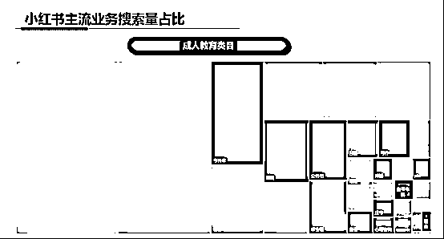
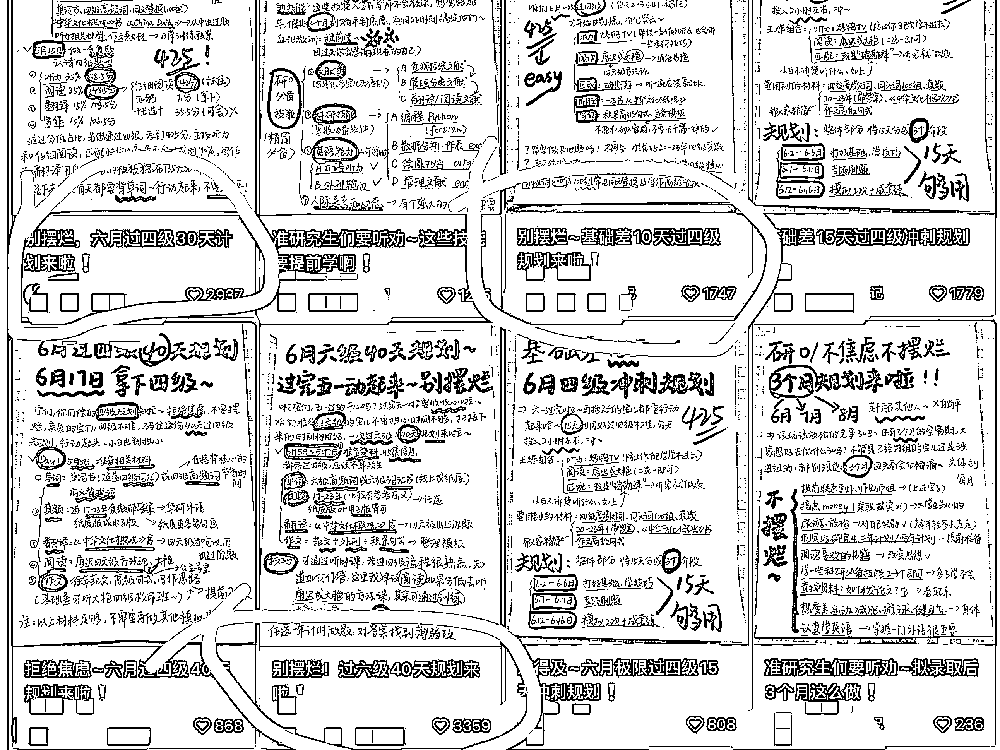
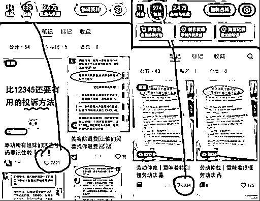
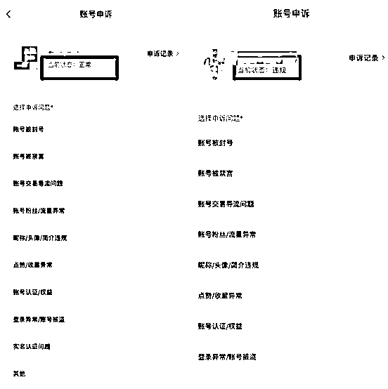
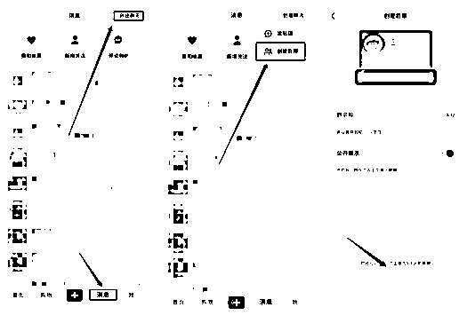
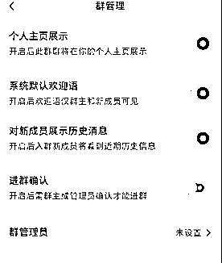
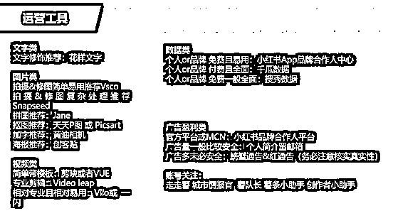

# 小红书流量变现项目《大学生资料粉》

> 原文：[`www.yuque.com/for_lazy/thfiu8/pldbqhqu1ltyxu5g`](https://www.yuque.com/for_lazy/thfiu8/pldbqhqu1ltyxu5g)

<ne-h2 id="019a62cf" data-lake-id="019a62cf"><ne-heading-ext><ne-heading-anchor></ne-heading-anchor><ne-heading-fold></ne-heading-fold></ne-heading-ext><ne-heading-content><ne-text id="u30fcfba7">(62 赞)小红书流量变现项目《大学生资料粉》</ne-text></ne-heading-content></ne-h2> <ne-p id="uf28aa6ad" data-lake-id="uf28aa6ad"><ne-text id="u16659408">作者： 步言</ne-text></ne-p> <ne-p id="u71c84a0a" data-lake-id="u71c84a0a"><ne-text id="u45fe7587">日期：2023-07-25</ne-text></ne-p> <ne-h1 id="01ac18fc" data-lake-id="01ac18fc"><ne-heading-ext><ne-heading-anchor></ne-heading-anchor><ne-heading-fold></ne-heading-fold></ne-heading-ext><ne-heading-content><ne-text id="u72445bda" ne-bold="true">小红书流量变现项目《大学生资料粉》</ne-text></ne-heading-content></ne-h1> <ne-h1 id="a061538c" data-lake-id="a061538c"><ne-heading-ext><ne-heading-anchor></ne-heading-anchor><ne-heading-fold></ne-heading-fold></ne-heading-ext><ne-heading-content><ne-text id="u87607dfa">一、</ne-text><ne-text id="u96fe21db" ne-bold="true">公司介绍</ne-text></ne-heading-content></ne-h1> <ne-h2 id="c8c29d16" data-lake-id="c8c29d16"><ne-heading-ext><ne-heading-anchor></ne-heading-anchor><ne-heading-fold></ne-heading-fold></ne-heading-ext><ne-heading-content><ne-text id="u17ad3621" ne-bold="true">1、公司简介</ne-text></ne-heading-content></ne-h2> <ne-p id="u991dffa3" data-lake-id="u991dffa3"><ne-text id="uf92b6c31">我们是一家基于“阿米巴”模式下独立出来的专注前端私域流量的公司，因此我们的流量项目大多是建立在其它兄弟“阿米巴”公司已经把我们流量的中端销售以及后端交付跑通的基础上，为大家带来能够持续回收私域并且直接变现的业务。</ne-text></ne-p> <ne-p id="u71882495" data-lake-id="u71882495"><ne-text id="u62e4318f">第一：我们是一家纯前端流量公司，深耕公域转私域。</ne-text></ne-p> <ne-p id="u0ab679e1" data-lake-id="u0ab679e1"><ne-text id="uc7611651">第二：我们有自己 80+人的精准私域运营团队，日引流精准私域 7000+</ne-text></ne-p> <ne-p id="u5dfaff37" data-lake-id="u5dfaff37"><ne-text id="u0676015a">第三：我们打通了线上互联网创业者流量 0-1 的路径，建立了流量生产到变现的无缝衔接闭环，实现了轻资产私域运营的迭代升级</ne-text></ne-p> <ne-h2 id="407d6e2a" data-lake-id="407d6e2a"><ne-heading-ext><ne-heading-anchor></ne-heading-anchor><ne-heading-fold></ne-heading-fold></ne-heading-ext><ne-heading-content><ne-text id="u1bfe4516" ne-bold="true">2、个人介绍</ne-text></ne-heading-content></ne-h2> <ne-p id="u7fe32ce2" data-lake-id="u7fe32ce2"><ne-text id="uc0890ba1" ne-bold="true">“步言”介绍</ne-text></ne-p> <ne-p id="u6697de17" data-lake-id="u6697de17"><ne-text id="u466119f9">名称：步言（步步为营，言信行直）</ne-text></ne-p> <ne-p id="u7123fa5a" data-lake-id="u7123fa5a"><ne-text id="u89a2208d" ne-bold="true">简介：</ne-text><ne-text id="udb0f40d9">一个连续创业者，挣过快钱，也跌落谷底，20 年新媒体赛道重新出发，现管理 100+人员的私域流量公司，日引流 7000+私域，战略投资一家私域变现公司。</ne-text></ne-p> <ne-p id="ua74c7153" data-lake-id="ua74c7153"><ne-text id="u60d83560" ne-bold="true">坐标：</ne-text><ne-text id="uba42743d">武汉</ne-text></ne-p> <ne-h2 id="12cfc39b" data-lake-id="12cfc39b"><ne-heading-ext><ne-heading-anchor></ne-heading-anchor><ne-heading-fold></ne-heading-fold></ne-heading-ext><ne-heading-content><ne-text id="uc234b111" ne-bold="true">3、业务架构</ne-text></ne-heading-content></ne-h2> <ne-p id="u7f59d54c" data-lake-id="u7f59d54c"><ne-text id="u35eab0f5">公司的业务架构分为 3 个端口，S 端、B 端、C 端，逻辑是“S”to“B”to“C”</ne-text></ne-p> <ne-p id="u3bc1259a" data-lake-id="u3bc1259a"><ne-text id="ub9a2c715">S 端：S 端是流量平台，为 B 端业务输送精准流量，为 C 端用户提供价值赋能并打通流量变现闭环。</ne-text></ne-p> <ne-p id="udcd457cb" data-lake-id="udcd457cb"><ne-text id="ucccaf912">B 端：主要指合作伙伴，不自建流量团队的变现项目，由我们提供前端流量支持，合作共赢。</ne-text></ne-p> <ne-p id="u9951c99d" data-lake-id="u9951c99d"><ne-text id="ufdd5f30a">C 端：主要指互联网创业人群，由我们提供具体私域流量项目新媒体账号实战运营方法和技术，解决从 0-1 的私域生产环节，并且长期稳定回收私域，让私域直接变现。同时筛选优秀创业者为其赋能，帮助打造自己的流量团队。</ne-text></ne-p> <ne-h1 id="ab4217ea" data-lake-id="ab4217ea"><ne-heading-ext><ne-heading-anchor></ne-heading-anchor><ne-heading-fold></ne-heading-fold></ne-heading-ext><ne-heading-content><ne-text id="u597b8e9f" ne-bold="true">二、项目前景</ne-text></ne-heading-content></ne-h1> <ne-p id="uec59731d" data-lake-id="uec59731d"><ne-text id="uf01d5707" ne-bold="true">操作难，上手慢的项目不适合作为进入互联网行业的前期操作项目（可能会浪费时间打击信心）；持续变现能力较弱的项目适合短平快打法的专业级玩家（互联网项目大多是有生命周期的，且不会太长）</ne-text></ne-p> <ne-p id="u0c0ec1d0" data-lake-id="u0c0ec1d0"><ne-text id="u909f2dfb" ne-bold="true">基于以上两点的考虑，我们为大家带来了上手快，持续变现能力强的《大学生资料粉》项目。</ne-text></ne-p> <ne-h2 id="debafcce" data-lake-id="debafcce"><ne-heading-ext><ne-heading-anchor></ne-heading-anchor><ne-heading-fold></ne-heading-fold></ne-heading-ext><ne-heading-content><ne-text id="ud89f3038" ne-bold="true">1、项目规模</ne-text></ne-heading-content></ne-h2> <ne-p id="u4af14e9a" data-lake-id="u4af14e9a"><ne-text id="u50413aba" ne-bold="true">社会面规模：</ne-text></ne-p> <ne-p id="ub42a23de" data-lake-id="ub42a23de"><ne-text id="u3d31ee93">这个项目是围绕大学生群体去做的，我们先看看大学生群体的数量有多大，自 2000 年以来高考逐年扩招，大学毕业生从 2001 年的 114 万到 2023 年的 1158 万。1158 万大学生都是我们的目标客户，而且是每年都会有新的一批，也就意味着《大学生资料粉》市场规模足够大、周期不是足够久，而是永久。那这就是我们可以去做的项目！</ne-text></ne-p> <ne-p id="u5ec43307" data-lake-id="u5ec43307"><ne-card data-card-name="image" data-card-type="inline" id="ZbVDL" data-event-boundary="card"></ne-card></ne-p> <ne-p id="ufb5ddef4" data-lake-id="ufb5ddef4"><ne-text id="uef9112d3" ne-bold="true">小红书平台教育类规模</ne-text></ne-p> <ne-p id="u4719fa00" data-lake-id="u4719fa00"><ne-text id="u351d2217" ne-bold="true">教育类目小红书平台占比 70%</ne-text></ne-p> <ne-p id="ub77a61f3" data-lake-id="ub77a61f3"><ne-card data-card-name="image" data-card-type="inline" id="LByQ6" data-event-boundary="card"></ne-card></ne-p> <ne-p id="u5f910763" data-lake-id="u5f910763"><ne-text id="uc517377e" ne-bold="true">成人教育 TOP 热词：下图</ne-text></ne-p> <ne-p id="u5975f908" data-lake-id="u5975f908"><ne-card data-card-name="image" data-card-type="inline" id="q4bZD" data-event-boundary="card"></ne-card></ne-p> <ne-p id="u780bd3c3" data-lake-id="u780bd3c3"><ne-text id="u337be1ec" ne-bold="true">高等教育 TOP 热词：下图</ne-text></ne-p> <ne-p id="ub4052f12" data-lake-id="ub4052f12"><ne-card data-card-name="image" data-card-type="inline" id="jrzO5" data-event-boundary="card"></ne-card></ne-p> <ne-p id="u4a010d2a" data-lake-id="u4a010d2a"><ne-text id="u76bdcd5c" ne-bold="true">细分业务 TOP 检索词：下图</ne-text></ne-p> <ne-p id="u4fe2cd5d" data-lake-id="u4fe2cd5d"><ne-card data-card-name="image" data-card-type="inline" id="Eaayg" data-event-boundary="card"></ne-card></ne-p> <ne-p id="u03b3f75f" data-lake-id="u03b3f75f"><ne-text id="u7d7b1375" ne-bold="true">总结：由此可见，不管是社会群体客户数量还是小红书平台行业规模数量对我们开展大学生资料粉业务都有强大的用户群体支撑。</ne-text></ne-p> <ne-h2 id="cc700bea" data-lake-id="cc700bea"><ne-heading-ext><ne-heading-anchor></ne-heading-anchor><ne-heading-fold></ne-heading-fold></ne-heading-ext><ne-heading-content><ne-text id="u541b1012" ne-bold="true">2、可持续性操作</ne-text></ne-heading-content></ne-h2> <ne-p id="uf38b1432" data-lake-id="uf38b1432"><ne-text id="ude0622f5" ne-bold="true">这个项目的可操作性本质是客户基数大，流量获取容易，上手快。</ne-text></ne-p> <ne-p id="u25dda243" data-lake-id="u25dda243"><ne-text id="uf8215678" ne-bold="true">客户基数：</ne-text><ne-text id="u47150d65" ne-bold="true">在第 1 部分“项目介绍”里面我们可以确认无误的知道大学生资料粉业务在小红书平台有强大的客户基数。</ne-text></ne-p> <ne-p id="u8c21f7d9" data-lake-id="u8c21f7d9"><ne-text id="u944b8ccc" ne-bold="true">流量获取容易：</ne-text><ne-text id="u2be5dbb6" ne-bold="true">本质上我们是通过送学习资料去获取目标客户加到我们微信，首先学习资料是我们目标客户的刚需，而且我们是免费提供资料解决客户的刚需，所以客户有充足的理由去加到我们微信，从而变成我们的私域。</ne-text></ne-p> <ne-p id="u6167d4da" data-lake-id="u6167d4da"><ne-text id="u905727ef" ne-bold="true">上手快：</ne-text><ne-text id="ua296e068" ne-bold="true">逻辑是通过快速打造爆文获取流量，我们会提供爆款模板，创业者只需要通过爆款模板制作内容图片，然后输出图文内容，剩下的就是持续输出然后承接好爆文所带来的流量就可以了。</ne-text></ne-p> <ne-p id="u9dae158a" data-lake-id="u9dae158a"><ne-text id="u5c2fb382" ne-bold="true">《大学生资料粉》为什么可以持续性操作，我们先看看下面的图片：</ne-text></ne-p> <ne-p id="u148af368" data-lake-id="u148af368"><ne-card data-card-name="image" data-card-type="inline" id="Sqd4d" data-event-boundary="card"></ne-card><ne-card data-card-name="image" data-card-type="inline" id="rj3BT" data-event-boundary="card"></ne-card><ne-card data-card-name="image" data-card-type="inline" id="Ib8W9" data-event-boundary="card"></ne-card></ne-p> <ne-h2 id="77ff3894" data-lake-id="77ff3894"><ne-heading-ext><ne-heading-anchor></ne-heading-anchor><ne-heading-fold></ne-heading-fold></ne-heading-ext><ne-heading-content><ne-text id="uc08725fa" ne-bold="true">3、为什么可以赚到钱</ne-text></ne-heading-content></ne-h2> <ne-p id="uc08f1121" data-lake-id="uc08f1121"><ne-text id="ufb9c0a5e" ne-bold="true">为什么可以赚到钱从两方面说一下这个问题：</ne-text></ne-p> <ne-p id="ud8a14734" data-lake-id="ud8a14734"><ne-text id="u7c37899e" ne-bold="true">第一是商业逻辑：</ne-text><ne-text id="ub36dfc24">这里要说一下术业有专攻，整个互联网项目的变现闭环有三部分组成</ne-text></ne-p> <ne-p id="ua1e9009d" data-lake-id="ua1e9009d"><ne-text id="ue56c0a52">前端流量、中端销售、后端交付</ne-text></ne-p> <ne-p id="u29eeaa11" data-lake-id="u29eeaa11"><ne-text id="ua2a0ac82">很少有公司既能把前端流量玩明白，又能把中端销售玩好，还能把后端交付处理妥善</ne-text></ne-p> <ne-p id="u222dbd8f" data-lake-id="u222dbd8f"><ne-text id="u7101ec97">所以我们做的是最前端的流量部分，专攻一个板块做好就能赚钱这是商业逻辑，毋庸置疑。</ne-text></ne-p> <ne-p id="u097ee1f3" data-lake-id="u097ee1f3"><ne-text id="u5da3af29" ne-bold="true">第二是实际数据：</ne-text><ne-text id="uef376d19">通过我们公司在这个项目 3 年的升级和沉淀，以及 2 年的新媒体流量实战打法。</ne-text></ne-p> <ne-p id="u6d41c093" data-lake-id="u6d41c093"><ne-text id="u315cd29b" ne-bold="true">上图：</ne-text></ne-p> <ne-p id="u119321d4" data-lake-id="u119321d4"><ne-card data-card-name="image" data-card-type="inline" id="fmxWE" data-event-boundary="card"></ne-card><ne-card data-card-name="image" data-card-type="inline" id="B7Ug3" data-event-boundary="card"></ne-card><ne-card data-card-name="image" data-card-type="inline" id="NrZGe" data-event-boundary="card"></ne-card></ne-p> <ne-p id="u87bec8e7" data-lake-id="u87bec8e7"><ne-card data-card-name="image" data-card-type="inline" id="Zv4hj" data-event-boundary="card"></ne-card><ne-card data-card-name="image" data-card-type="inline" id="pAmJg" data-event-boundary="card"></ne-card><ne-card data-card-name="image" data-card-type="inline" id="qO1Y7" data-event-boundary="card"></ne-card></ne-p> <ne-p id="ue6ae0fb7" data-lake-id="ue6ae0fb7"><ne-text id="u32d3130b" ne-bold="true">目前数据：</ne-text><ne-text id="u638bd8d1">单个优秀账号可以做到日引流到私域 300+，我们已经沉淀了 150+的认证专业号，和 100+的素人号，月引流私域已经突破 20W+</ne-text></ne-p> <ne-p id="u7585993c" data-lake-id="u7585993c"><ne-text id="u3280214f" ne-bold="true">总结：为什么能赚钱，因为有足够的流量可以获取，简单粗暴一点：流量=金钱</ne-text></ne-p> <ne-h1 id="541c24de" data-lake-id="541c24de"><ne-heading-ext><ne-heading-anchor></ne-heading-anchor><ne-heading-fold></ne-heading-fold></ne-heading-ext><ne-heading-content><ne-text id="ueb9a4040" ne-bold="true">三、前期准备</ne-text></ne-heading-content></ne-h1> <ne-h3 id="af8155df" data-lake-id="af8155df"><ne-heading-ext><ne-heading-anchor></ne-heading-anchor><ne-heading-fold></ne-heading-fold></ne-heading-ext><ne-heading-content><ne-text id="ub6d43b44" ne-bold="true">1、硬件设备准备</ne-text></ne-heading-content></ne-h3> <ne-p id="uf8242e72" data-lake-id="uf8242e72"><ne-text id="u228278f5">手机 1-5 台；手机卡 1-5 张；营业执照 1 个；注册 3 个企业号</ne-text></ne-p> <ne-p id="u7526503a" data-lake-id="u7526503a"><ne-text id="ua77cc0db" ne-bold="true">注意：</ne-text></ne-p> <ne-p id="ub17b9e2a" data-lake-id="ub17b9e2a"><ne-text id="u8829b0b5">一机一卡一号，不要频繁切换账号</ne-text></ne-p> <ne-p id="udbefae9b" data-lake-id="udbefae9b"><ne-text id="u7e88a85b">使用账号的时候使用数据网络，不要多台手机连接同一个 wifi，不要连接 wifi！</ne-text></ne-p> <ne-p id="ud383acf5" data-lake-id="ud383acf5"><ne-text id="u790106dc" ne-bold="true">重点：</ne-text></ne-p> <ne-p id="u64bde689" data-lake-id="u64bde689"><ne-text id="ueb6f1890">前面的话可以专注的做 1-2 个就可以，从 0 到 1 把账号做起来后，可以再从 1 到 5 复制，这也是天道精神，落到实处先做好一个点。</ne-text></ne-p> <ne-h3 id="d1adbfbc" data-lake-id="d1adbfbc"><ne-heading-ext><ne-heading-anchor></ne-heading-anchor><ne-heading-fold></ne-heading-fold></ne-heading-ext><ne-heading-content><ne-text id="ubd676662" ne-bold="true">2、建立小红书账号</ne-text></ne-heading-content></ne-h3> <ne-p id="ua8748ad0" data-lake-id="ua8748ad0"><ne-text id="udb692236">注册小红书账号</ne-text></ne-p> <ne-p id="ua1c17973" data-lake-id="ua1c17973"><ne-text id="ucdda16b9">头像：符合定位、可卡通、可真人头像</ne-text></ne-p> <ne-p id="ub93eebf3" data-lake-id="ub93eebf3"><ne-text id="u3a544bc0">昵称：你的昵称+定位</ne-text></ne-p> <ne-p id="u2321e563" data-lake-id="u2321e563"><ne-text id="u690159fa">简介：个人特定、展示专业、一句话介绍自己</ne-text></ne-p> <ne-p id="u5efa7f67" data-lake-id="u5efa7f67"><ne-text id="ua7077e03">背景：强化定位</ne-text></ne-p> <ne-p id="ue9ab5381" data-lake-id="ue9ab5381"><ne-text id="u9e13b36d">封面：统一突出</ne-text></ne-p> <ne-h3 id="c5cf2945" data-lake-id="c5cf2945"><ne-heading-ext><ne-heading-anchor></ne-heading-anchor><ne-heading-fold></ne-heading-fold></ne-heading-ext><ne-heading-content><ne-text id="u24123a70" ne-bold="true">3、小红书养号</ne-text></ne-heading-content></ne-h3> <ne-p id="udfc9cd45" data-lake-id="udfc9cd45"><ne-text id="u932f8066">首先，在小红书，真存在养号一说。因为我团队几百个号测下来，养过号的和没养过的，权重就是会不同，存活期也会不同。</ne-text></ne-p> <ne-p id="u944a7973" data-lake-id="u944a7973"><ne-text id="uae5ef0d6" ne-bold="true">企业号养号方法:</ne-text></ne-p> <ne-p id="ua0157a80" data-lake-id="ua0157a80"><ne-text id="u29223fbe">因为企业号有一定的营销权重，基本不用养号，可以直接用。我们需要先发容易爆的文章，建立账号的活跃度，之后再来发引流文案。</ne-text></ne-p> <ne-p id="u40b4fe77" data-lake-id="u40b4fe77"><ne-text id="ud603b8df" ne-bold="true">素人号养号方法:</ne-text></ne-p> <ne-p id="u1324c182" data-lake-id="u1324c182"><ne-text id="u6c34118d">素人号刚开始是必须要有养号的，在注册的前三天我们是不发文章，模拟一个正常用户的行为，在你感兴趣的领域里面来进行浏览，每天浏览 30-60 分钟，在第二天开始做点赞评论留言。</ne-text></ne-p> <ne-p id="u557c5193" data-lake-id="u557c5193"><ne-text id="udc2f9f61">第 3 天开始来做更新养号文章，每天也都要正常来刷新浏览，不能发了文章就不管了。</ne-text></ne-p> <ne-h1 id="c126d258" data-lake-id="c126d258"><ne-heading-ext><ne-heading-anchor></ne-heading-anchor><ne-heading-fold></ne-heading-fold></ne-heading-ext><ne-heading-content><ne-text id="u7c1fe3c7" ne-bold="true">四、小红书流量打法</ne-text></ne-heading-content></ne-h1> <ne-h2 id="09b06505" data-lake-id="09b06505"><ne-heading-ext><ne-heading-anchor></ne-heading-anchor><ne-heading-fold></ne-heading-fold></ne-heading-ext><ne-heading-content><ne-text id="ub6d0df26" ne-bold="true">1、小红书流量入口</ne-text></ne-heading-content></ne-h2> <ne-p id="u4aaa2086" data-lake-id="u4aaa2086"><ne-text id="u5ae45914" ne-bold="true">小红书常见有三大流量入口：分别是关注页、搜索页、发现页</ne-text></ne-p> <ne-p id="u434937c5" data-lake-id="u434937c5"><ne-text id="u01d7b160" ne-bold="true">1）关注页</ne-text></ne-p> <ne-p id="ua9b2e57f" data-lake-id="ua9b2e57f"><ne-text id="uf2ebfeba">小红书最左侧就是关注的页面，只要用户关注了你的笔记就会通过这个页面直接浏览到你的笔记。流量占比最低，且不影响流量层级的数据结果，所以有用但不多</ne-text></ne-p> <ne-p id="ua4c04408" data-lake-id="ua4c04408"><ne-text id="u88760146" ne-bold="true">2）搜索页</ne-text></ne-p> <ne-p id="uaf908cac" data-lake-id="uaf908cac"><ne-text id="ucec3f3e2">流量增长最快的的板块，有非常高占比的用户打开小红书直接进行搜索，把小红书当成搜索引擎用。虽然搜索页的流量数据并不能影响笔记的流量层级测试，但搜索页的流量非常长尾，只要关键词配置得当，可以在非常长的周期获得最精准的搜索流量</ne-text></ne-p> <ne-p id="u6e7c23ef" data-lake-id="u6e7c23ef"><ne-text id="u7a9fd839" ne-bold="true">3）发现页</ne-text></ne-p> <ne-p id="u660dd767" data-lake-id="u660dd767"><ne-text id="u2d631eec">发现页是笔记的主要流量来源，也是流量层级测试的主阵地，一篇笔记能获得多大量级的曝光，就看笔记在发现页的用户反馈测试了</ne-text></ne-p> <ne-h2 id="ed7e589d" data-lake-id="ed7e589d"><ne-heading-ext><ne-heading-anchor></ne-heading-anchor><ne-heading-fold></ne-heading-fold></ne-heading-ext><ne-heading-content><ne-text id="ue4a15f84" ne-bold="true">2、小红书流量推荐机制</ne-text></ne-heading-content></ne-h2> <ne-p id="u6c947aea" data-lake-id="u6c947aea"><ne-text id="u0c4a8d34">这是一张小红书流量分发逻辑图，大家可以对照看一下。</ne-text></ne-p> <ne-p id="ub8d0dbdf" data-lake-id="ub8d0dbdf"><ne-card data-card-name="image" data-card-type="inline" id="u7DE5" data-event-boundary="card"></ne-card></ne-p> <ne-p id="ua5975524" data-lake-id="ua5975524"><ne-card data-card-name="image" data-card-type="inline" id="eEia6" data-event-boundary="card"></ne-card></ne-p> <ne-h2 id="4be8a285" data-lake-id="4be8a285"><ne-heading-ext><ne-heading-anchor></ne-heading-anchor><ne-heading-fold></ne-heading-fold></ne-heading-ext><ne-heading-content><ne-text id="u71d1b48a" ne-bold="true">3、如何打造爆款匹配系统推荐</ne-text></ne-heading-content></ne-h2> <ne-p id="u40503650" data-lake-id="u40503650"><ne-text id="uabfbb92e" ne-bold="true">爆款的三驾马车：封面、标题、选题：掌握了以上三点就相当于掌握了流量密码</ne-text></ne-p> <ne-p id="u090b643e" data-lake-id="u090b643e"><ne-text id="u72b0f9a6" ne-bold="true">1）笔记封面决定拿到的初始流量</ne-text></ne-p> <ne-p id="u4bb2223b" data-lake-id="u4bb2223b"><ne-text id="ufc47cece">封面的场景是搜索结果出现页，也就是列表页，同样在用户的手机屏幕上，用户为什么点我的呢？</ne-text></ne-p> <ne-p id="uc151f8a5" data-lake-id="uc151f8a5"><ne-text id="uef46da48">01.差异性：要和相同的封面区别开来，更吸引目光</ne-text></ne-p> <ne-p id="u8c5e010f" data-lake-id="u8c5e010f"><ne-text id="u64187a82">02.内容提示：提供打开理由、有点兼顾标题的作用</ne-text></ne-p> <ne-p id="u558f2f05" data-lake-id="u558f2f05"><ne-text id="ua1d8a753">03.兼具美感：旅行本身需要兼具设计和美感，提高吸引力</ne-text></ne-p> <ne-p id="u1908949b" data-lake-id="u1908949b"><ne-card data-card-name="image" data-card-type="inline" id="Gz1SP" data-event-boundary="card"></ne-card></ne-p> <ne-p id="u6461b8ce" data-lake-id="u6461b8ce"><ne-text id="u0fca4b93" ne-bold="true">2）笔记爆款标题</ne-text></ne-p> <ne-p id="u501e2ee8" data-lake-id="u501e2ee8"><ne-text id="ub0946d28">小红书账号标题是 20 个字，最好的方法是结合大关键词+小关键词，或者罗列你的领域，关键词排名前 10 的爆款标题记录提取，然后组合成新的标题。</ne-text></ne-p> <ne-p id="ue0045bc8" data-lake-id="ue0045bc8"><ne-text id="ucec5ea4e">爆款标题可重新组合再用一遍，看图：</ne-text></ne-p> <ne-p id="u633317ba" data-lake-id="u633317ba"><ne-card data-card-name="image" data-card-type="inline" id="CSzF2" data-event-boundary="card"></ne-card></ne-p> <ne-p id="u000530b1" data-lake-id="u000530b1"><ne-text id="ueae2aecd" ne-bold="true">3）笔记选题的藏宝图</ne-text></ne-p> <ne-p id="u1826a817" data-lake-id="u1826a817"><ne-text id="u3ec34c4c" ne-bold="true">选题就是对标同行，火过的内容会再火</ne-text><ne-text id="ub0231887">。实际操作过程中我们要做选题的藏宝图，对每个选题的成功性打分，最终来确定优先做哪个。</ne-text></ne-p> <ne-p id="u6fac8a33" data-lake-id="u6fac8a33"><ne-card data-card-name="image" data-card-type="inline" id="HQrMX" data-event-boundary="card"></ne-card></ne-p> <ne-p id="u35509b0f" data-lake-id="u35509b0f"><ne-text id="uc68d7f5d">这个时候要适当的放弃自己的特色和想法，也就是说前期拒绝原创。很多时候你忙了一下午的原创抵不上一个火过的爆款再发一次。</ne-text></ne-p> <ne-p id="u5556bb90" data-lake-id="u5556bb90"><ne-text id="u3f0dff22">所以制定爆款选题的藏宝图，把火过的内容、容易引流的内容排着顺序发。模仿+微创新就可以了。</ne-text></ne-p> <ne-h2 id="fe5fee44" data-lake-id="fe5fee44"><ne-heading-ext><ne-heading-anchor></ne-heading-anchor><ne-heading-fold></ne-heading-fold></ne-heading-ext><ne-heading-content><ne-text id="u40b0e89f" ne-bold="true">4、内容创作</ne-text></ne-heading-content></ne-h2> <ne-p id="uab995d27" data-lake-id="uab995d27"><ne-text id="u10759058" ne-bold="true">找到对标账号、一比一的模仿、一定比率原创</ne-text></ne-p> <ne-p id="u2aea9931" data-lake-id="u2aea9931"><ne-text id="ue4bdec6f" ne-bold="true">1）找到对标账号</ne-text></ne-p> <ne-p id="uda7a8d0a" data-lake-id="uda7a8d0a"><ne-text id="u33f0d6bc" ne-bold="true">要素一: 低粉高赞、粉丝低于 1W 以下 (最好 1000 内)</ne-text></ne-p> <ne-p id="u8142d0db" data-lake-id="u8142d0db"><ne-text id="ua63af0f2">从要对标的账号角度来说，对标账号的粉丝越少越好。简单的说就是低粉高赞类，像那种几百几千的粉丝量的号是最好的。</ne-text></ne-p> <ne-p id="u520287da" data-lake-id="u520287da"><ne-text id="u0039be32" ne-bold="true">要素二:点赞比粉丝多、单篇点赞比总粉丝数多的笔记</ne-text></ne-p> <ne-p id="uc959a750" data-lake-id="uc959a750"><ne-text id="u238bc80e">笔记视角需要从 2 个角度来看: 一个是账号的粉丝数，一个是笔记的点赞数。</ne-text></ne-p> <ne-p id="u286d3e6d" data-lake-id="u286d3e6d"><ne-text id="uff3852e4">找到笔记的点赞数大于账号粉丝数的笔记，就像下面这个样子，这种笔记值得借鉴：</ne-text></ne-p> <ne-p id="u34353840" data-lake-id="u34353840"><ne-card data-card-name="image" data-card-type="inline" id="nM4nP" data-event-boundary="card"></ne-card></ne-p> <ne-p id="u7dd84c47" data-lake-id="u7dd84c47"><ne-text id="u240fcc99">分享一个小技巧:</ne-text></ne-p> <ne-p id="ube8ba4b3" data-lake-id="ube8ba4b3"><ne-text id="ud1ee29be">在刷对标的时候要多留意一些点赞数据看起来不是那么火的笔记 (100-1000)一定要点进去看看他的账号粉丝量。而不是只看到那些点赞 5k 1w 的笔记才进去看。很多笔记 5000 1w 点赞，粉丝 10w 8w 的，这种数据参考意义不大。把这些低粉高赞的笔记收藏起来 或者专门建立自己的选题库，这些都是自己源源不断的爆款素材。</ne-text></ne-p> <ne-p id="ub5557205" data-lake-id="ub5557205"><ne-text id="uc25b7891" ne-bold="true">要素三: 最近一个月做起来的笔记/账号</ne-text></ne-p> <ne-p id="ue2b06c74" data-lake-id="ue2b06c74"><ne-text id="ubcb5ba0e">这个就要说到热度这个词了，在自媒体平台热度比什么都重要，你会发现不同时间段的热度词都是不一样的，所以要找最近最热的账号或者笔记来做对标。</ne-text></ne-p> <ne-p id="uf123d677" data-lake-id="uf123d677"><ne-text id="u34251c0a">学习领域举例: 清华学习法 睡觉学习法 摆烂学习法</ne-text></ne-p> <ne-p id="ud6a5837a" data-lake-id="ud6a5837a"><ne-text id="u1f18c1d6">你会发现最近清华学习法有流量 其它表现平平，过段时间可能又换成了摆烂学习法。</ne-text></ne-p> <ne-p id="ua745039e" data-lake-id="ua745039e"><ne-text id="uba64d96e">发现了是爆款模板那就看他们火的时间，哪个距离现在最近、哪个效果最好，我们需要关注的是最近火起来的，尽量迎合平台当下的推流。</ne-text></ne-p> <ne-p id="u146896bd" data-lake-id="u146896bd"><ne-text id="uae81819c">一个月是大概时间，也不是那么绝对，原则就是最好是近期爆发起来的，一周内是最好的，如果是 3 天内的那就更好了，还热乎呢！</ne-text></ne-p> <ne-p id="u76910219" data-lake-id="u76910219"><ne-text id="u3be6bcd4" ne-bold="true">2）一比一模仿对标+微创新</ne-text></ne-p> <ne-p id="u862b0fa9" data-lake-id="u862b0fa9"><ne-text id="u87087a7a">参考借鉴是最快，也是最有效的方式做爆文方式（不要全部抄袭）</ne-text></ne-p> <ne-p id="uf64cf0bd" data-lake-id="uf64cf0bd"><ne-text id="u55062ed6" ne-bold="true">记住这个公式：新爆文=70%旧爆文 + 30%差异化</ne-text></ne-p> <ne-p id="u453b1b82" data-lake-id="u453b1b82"><ne-text id="u32aa6354" ne-bold="true">拆解爆文：选题</ne-text></ne-p> <ne-p id="u1ef05b53" data-lake-id="u1ef05b53"><ne-text id="u71d48408">好的选题=行业关键词+用户需求</ne-text></ne-p> <ne-p id="ua855ebff" data-lake-id="ua855ebff"><ne-text id="uc5834a14">行业关键词：可以通过数据监测软件查询、也可在多篇爆文笔记中选取</ne-text></ne-p> <ne-p id="ueb01832a" data-lake-id="ueb01832a"><ne-text id="u346f5b69">用户需求：是知识干货？是情绪价值？具体到什么问题？</ne-text></ne-p> <ne-p id="u62c8180e" data-lake-id="u62c8180e"><ne-text id="u1b15e666">进阶技巧：统计细分领域 10 个以上爆文内容。</ne-text></ne-p> <ne-p id="uced0d320" data-lake-id="uced0d320"><ne-text id="ud4ef0ce4" ne-bold="true">拆解爆文：标题拆解</ne-text></ne-p> <ne-p id="u904d9660" data-lake-id="u904d9660"><ne-text id="u4a123ec4">好的标题=爆文高频词+爆文句式</ne-text></ne-p> <ne-p id="uac305dcd" data-lake-id="uac305dcd"><ne-text id="ue8e203a7">常见的爆文标题因素：</ne-text></ne-p> <ne-p id="uda6fb82d" data-lake-id="uda6fb82d"><ne-text id="uf96c4323">1、利益前置、利益承诺；</ne-text></ne-p> <ne-p id="u47a7e27b" data-lake-id="u47a7e27b"><ne-text id="u39be43f7">2、引发好奇（反差、冲突）；</ne-text></ne-p> <ne-p id="uc5152df0" data-lake-id="uc5152df0"><ne-text id="udece246d">3、引发从众（背书、数据）</ne-text></ne-p> <ne-p id="u6c79cfd6" data-lake-id="u6c79cfd6"><ne-text id="u8add1048" ne-bold="true">拆解爆文：封面拆解</ne-text></ne-p> <ne-p id="ua8f55209" data-lake-id="ua8f55209"><ne-text id="u3cbabcc1">爆文封面的要素：</ne-text></ne-p> <ne-p id="uce042e0f" data-lake-id="uce042e0f"><ne-text id="u5eb7c67d">1、清晰、有设计感；</ne-text></ne-p> <ne-p id="u7fc8624a" data-lake-id="u7fc8624a"><ne-text id="u614deb7c">2、主题突出，包含内容关键词、核心利益。</ne-text></ne-p> <ne-p id="u42f7b5c4" data-lake-id="u42f7b5c4"><ne-text id="u2856c251">推荐工具：</ne-text></ne-p> <ne-p id="u49eddb02" data-lake-id="u49eddb02"><ne-text id="u06e5a4f2">创可贴、搞定设计、黄油相机（内含各平台封面模版）</ne-text></ne-p> <ne-h2 id="f532b91f" data-lake-id="f532b91f"><ne-heading-ext><ne-heading-anchor></ne-heading-anchor><ne-heading-fold></ne-heading-fold></ne-heading-ext><ne-heading-content><ne-text id="ud82442cc" ne-bold="true">5、矩阵放量</ne-text></ne-heading-content></ne-h2> <ne-p id="ube80e98c" data-lake-id="ube80e98c"><ne-text id="u5b307c1e" ne-bold="true">怎么用矩阵号批量获取流量</ne-text></ne-p> <ne-p id="u1da61d36" data-lake-id="u1da61d36"><ne-text id="u9d2f076d" style="background-color: rgb(255, 255, 255); color: rgb(47, 48, 52);">1）低成本生产优质内容</ne-text></ne-p> <ne-p id="uca75e2c0" data-lake-id="uca75e2c0"><ne-text id="uc62347c0" style="background-color: rgb(255, 255, 255); color: rgb(47, 48, 52);">低成本生产优质内容的关键是要找到对标,模仿封面形式,收集爆文选题和标题,形成一个选题标题库</ne-text></ne-p> <ne-p id="u90c7e3f2" data-lake-id="u90c7e3f2"><ne-text id="u451579e9" style="background-color: rgb(255, 255, 255); color: rgb(47, 48, 52);">第一步：找爆文图片模板</ne-text></ne-p> <ne-p id="ub6dfc7cb" data-lake-id="ub6dfc7cb"><ne-text id="u1b3c8d75" style="background-color: rgb(255, 255, 255); color: rgb(47, 48, 52);">第二步：收集爆文选题和标题</ne-text></ne-p> <ne-p id="ud02e9838" data-lake-id="ud02e9838"><ne-text id="ucdfce626" style="background-color: rgb(255, 255, 255); color: rgb(47, 48, 52);">2）矩阵式复制内容提高爆文概率</ne-text></ne-p> <ne-p id="u880bba3f" data-lake-id="u880bba3f"><ne-text id="ue59c8f87" style="background-color: rgb(255, 255, 255); color: rgb(47, 48, 52);">注册 3 个企业号</ne-text></ne-p> <ne-p id="u3171d9e5" data-lake-id="u3171d9e5"><ne-text id="u8bcb023a" style="background-color: rgb(255, 255, 255); color: rgb(47, 48, 52);">当选好一个账号的封面模板之后，用同样方法选另外 2 个号的封面模板，这样一来同选题可以给 3 个号共用。</ne-text></ne-p> <ne-p id="u5298154b" data-lake-id="u5298154b"><ne-text id="u3dcc37a1" style="background-color: rgb(255, 255, 255); color: rgb(47, 48, 52);">3）怼量，大力出奇迹</ne-text></ne-p> <ne-p id="u2d2f8506" data-lake-id="u2d2f8506"><ne-text id="uda393aa9" style="background-color: rgb(255, 255, 255); color: rgb(47, 48, 52);">一天 2-3 条，日更，量变产生质变</ne-text></ne-p> <ne-h2 id="298daed1" data-lake-id="298daed1"><ne-heading-ext><ne-heading-anchor></ne-heading-anchor><ne-heading-fold></ne-heading-fold></ne-heading-ext><ne-heading-content><ne-text id="u894c34c4" ne-bold="true">6、账号诊断</ne-text></ne-heading-content></ne-h2> <ne-p id="ucde00030" data-lake-id="ucde00030"><ne-text id="ubc1770ce" ne-bold="true">1）什么是限流</ne-text></ne-p> <ne-p id="u54ae08c1" data-lake-id="u54ae08c1"><ne-text id="u093cfa4d" style="color: rgb(31, 35, 41);">其实小红书官方没有限流这个说法，而是叫做“流量异常”，那既然是异常，就是和正常情况有一个比较的过程。</ne-text></ne-p> <ne-p id="u13bbfe79" data-lake-id="u13bbfe79"><ne-text id="u615466c5" style="color: rgb(31, 35, 41);">所以，有的新人博主刚发了一两篇笔记，然后发现数据不好就开始怀疑自己被限流了，这个是不合理的。</ne-text></ne-p> <ne-p id="u70995182" data-lake-id="u70995182"><ne-text id="u0b953db1" style="color: rgb(31, 35, 41);">流量异常分为两种情况：一种是单篇笔记异常，一种是整个账号异常。</ne-text></ne-p> <ne-p id="ue9f65a16" data-lake-id="ue9f65a16"><ne-text id="u21526fdc" ne-bold="true">2）如何判断有没有限流</ne-text></ne-p> <ne-p id="ua82973e3" data-lake-id="ua82973e3"><ne-text id="u71673e75" ne-bold="true">单篇笔记限流</ne-text></ne-p> <ne-p id="u96e8a6ca" data-lake-id="u96e8a6ca"><ne-text id="u7849eb47" style="color: rgb(31, 35, 41);">某篇笔记和其他笔记相比，流量明显下降。比如说，你其他笔记平均阅读量是 1000+，但这篇笔记突然降到了四五十个。</ne-text></ne-p> <ne-p id="ude34a1cc" data-lake-id="ude34a1cc"><ne-text id="uc30554dc" style="color: rgb(31, 35, 41);">或者你这篇笔记一开始流量很正常，持续有一些点赞收藏，但突然某一刻互动量就停了，笔记阅读量呈现断崖式下滑。</ne-text></ne-p> <ne-p id="u97270868" data-lake-id="u97270868"><ne-text id="u31c43f22" style="color: rgb(31, 35, 41);">这两种情况都有可能是被限流的表现。</ne-text></ne-p> <ne-p id="ufc8e07bf" data-lake-id="ufc8e07bf"><ne-text id="u350cd107" ne-bold="true">账号限流</ne-text></ne-p> <ne-p id="u0b2967c9" data-lake-id="u0b2967c9"><ne-text id="u3b480bdd" style="color: rgb(31, 35, 41);">如果你之前的笔记流量很不错，但是近期发布的笔记阅读量都很差，或者，无法给自己或他人的笔记点赞评论，疑似账号被禁言，限制互动。</ne-text></ne-p> <ne-p id="u34058e9c" data-lake-id="u34058e9c"><ne-text id="u9be5f379" style="color: rgb(31, 35, 41);">当然，如果禁言或者被人举报，官方一般会直接给你发站内信提醒：</ne-text></ne-p> <ne-p id="uc58e55fa" data-lake-id="uc58e55fa"><ne-card data-card-name="image" data-card-type="inline" id="SdHX9" data-event-boundary="card"></ne-card></ne-p> <ne-p id="uebabbed5" data-lake-id="uebabbed5"><ne-text id="udf6b6801" style="color: rgb(31, 35, 41);">但也有很多时候，平台只会悄咪咪给你限流，根本没有任何通知。</ne-text></ne-p> <ne-p id="u0c78da11" data-lake-id="u0c78da11"><ne-text id="ub94375e3" ne-bold="true">3）笔记/账号申诉</ne-text></ne-p> <ne-p id="u57559882" data-lake-id="u57559882"><ne-text id="uc9304313" style="color: rgb(31, 35, 41);">在创作中心，选择页面下方的“帮助与客服”，点进去后可以看到“笔记申诉”和“账号申诉”。</ne-text></ne-p> <ne-p id="uac456044" data-lake-id="uac456044"><ne-text id="u07ed7a8f" style="color: rgb(31, 35, 41);">我们点开“账号申诉”，在昵称下方可以看到有一行“当前状态”显示，如果账号异常，就会有“违规”字样。</ne-text></ne-p> <ne-p id="u857d6b39" data-lake-id="u857d6b39"><ne-card data-card-name="image" data-card-type="inline" id="kLUKY" data-event-boundary="card"></ne-card></ne-p> <ne-p id="u27764cac" data-lake-id="u27764cac"><ne-text id="u41dfdeec" style="color: rgb(31, 35, 41);">但是这一步只能看到账号有没有异常，不能看到具体什么地方违规，如果想要了解更详细的情况，就需要选择下方相应的问题去申诉。</ne-text></ne-p> <ne-p id="ua3ed0bbe" data-lake-id="ua3ed0bbe"><ne-text id="u768013d3" ne-bold="true">4）限流后怎么办</ne-text></ne-p> <ne-p id="uba99b375" data-lake-id="uba99b375"><ne-text id="ub90b7e12" ne-bold="true">笔记限流怎么办</ne-text></ne-p> <ne-p id="u8fe9e376" data-lake-id="u8fe9e376"><ne-text id="u9c429ca7" style="color: rgb(31, 35, 41);">如果你知道笔记哪里违规，就修改一下笔记，会重新进入审核。</ne-text></ne-p> <ne-p id="uc11e2e2c" data-lake-id="uc11e2e2c"><ne-text id="udebe7b90" style="color: rgb(31, 35, 41);">如果不知道哪里有问题，那不要轻易修改，直接删除就好了，因为改得不对容易触发二次违规。</ne-text></ne-p> <ne-p id="u29638abd" data-lake-id="u29638abd"><ne-text id="u14293b02" ne-bold="true">账号违规怎么办</ne-text></ne-p> <ne-p id="ub86fd465" data-lake-id="ub86fd465"><ne-text id="u69f8e08e" style="color: rgb(31, 35, 41);">不管是哪种形式的违规，处理的原则其实都差不多，就是找到违规原因，并立即停止违规行为。</ne-text></ne-p> <ne-p id="ud4403793" data-lake-id="ud4403793"><ne-text id="uad5510bc" style="color: rgb(31, 35, 41);">比如，你因为导流或软广违规了，那正确的做法就是暂时不要引流和接广了，老老实实发点正常的笔记，养养号。</ne-text></ne-p> <ne-p id="ufc555886" data-lake-id="ufc555886"><ne-text id="ufb40f0e0" style="color: rgb(31, 35, 41);">只要违规不是特别严重，一般 7 天左右就可以恢复。</ne-text></ne-p> <ne-h1 id="66c7b329" data-lake-id="66c7b329"><ne-heading-ext><ne-heading-anchor></ne-heading-anchor><ne-heading-fold></ne-heading-fold></ne-heading-ext><ne-heading-content><ne-text id="u7bf82640" ne-bold="true">五、如何安全引流私域</ne-text></ne-heading-content></ne-h1> <ne-h2 id="69d35016" data-lake-id="69d35016"><ne-heading-ext><ne-heading-anchor></ne-heading-anchor><ne-heading-fold></ne-heading-fold></ne-heading-ext><ne-heading-content><ne-text id="ue6d2cb2a" ne-bold="true">1、私聊引流</ne-text></ne-heading-content></ne-h2> <ne-p id="u10e6a70c" data-lake-id="u10e6a70c"><ne-text id="u6f3374d6">私聊引流：就是在内容上放钩子来告诉你，这个内容没有结束或者说你想要这个东西来找我拿；在评论区引导说：你需要的这些资料，在评论区里留下评论即可领取这一行为。</ne-text></ne-p> <ne-p id="u7e280f94" data-lake-id="u7e280f94"><ne-text id="u95a1cba6" style="color: rgb(216, 57, 49);">优势</ne-text><ne-text id="ua5c99de7">:转化率高，一次转化。</ne-text></ne-p> <ne-p id="u686fee70" data-lake-id="u686fee70"><ne-text id="u16066d54" style="color: rgb(216, 57, 49);">缺点</ne-text><ne-text id="u02d08bb1">:风险大，容易被钓鱼举报。容易被系统监测导流违规导致禁言</ne-text></ne-p> <ne-p id="u3770e5aa" data-lake-id="u3770e5aa"><ne-text id="u7391554c" ne-bold="true">文字形式</ne-text><ne-text id="u0e2fa119">:私聊转化能少说就少说，尽量一句话说全。</ne-text></ne-p> <ne-p id="u870ebdaa" data-lake-id="u870ebdaa"><ne-text id="u2f46ff95" ne-bold="true">需要注意的地方：</ne-text></ne-p> <ne-p id="u97e855f9" data-lake-id="u97e855f9"><ne-text id="u285a59bd">小红书的私信需要注意一些误区。比如重复发相同的内容 3 次，就很容易被判定</ne-text></ne-p> <ne-p id="ue8c06c6c" data-lake-id="ue8c06c6c"><ne-text id="ue4f4e025">为营销推广信息，文字图片都一样；遇到咨询联系方式就马上给的，别急，先点</ne-text></ne-p> <ne-p id="u061deddd" data-lake-id="u061deddd"><ne-text id="u1a841f73">开这个用户的主页，判断下他是不是同行和营销号，免得被人恶意举报都不知道。在进行私信时的正确操作：</ne-text></ne-p> <ne-p id="u4a912dab" data-lake-id="u4a912dab"><ne-text id="u3be73dc2">（1）不能连续集中回复，否则会被禁言。回复不同的用户，间隔 3 分钟再回复。</ne-text></ne-p> <ne-p id="u687b7fb8" data-lake-id="u687b7fb8"><ne-text id="ud5a37d11">（2）提前准备好带联系方式的图片，用图片代替文字进行回复，最好一个用户</ne-text></ne-p> <ne-p id="ue646e833" data-lake-id="ue646e833"><ne-text id="u8f3558b3">对应一张图</ne-text></ne-p> <ne-p id="u74401156" data-lake-id="u74401156"><ne-text id="ub6269c3c">此外，不要在评论区直接回复联系方式，哪怕有人咨询也不行，因为看到的人多，</ne-text></ne-p> <ne-p id="u3c13e45f" data-lake-id="u3c13e45f"><ne-text id="udb217a77">容易被举报。最好是多聊几句，确定有意向之后给发私信。</ne-text></ne-p> <ne-p id="ubaa5981a" data-lake-id="ubaa5981a"><ne-text id="u3cbcb97e">如果担心私信容易被忽略，对方看不到，可以提示下，不能说“私”之类的话，</ne-text></ne-p> <ne-p id="u102433ba" data-lake-id="u102433ba"><ne-text id="ua0be5956">建议可以说“我单独发你”这样的，或者用聊天框符号代替。</ne-text></ne-p> <ne-h2 id="c1de742b" data-lake-id="c1de742b"><ne-heading-ext><ne-heading-anchor></ne-heading-anchor><ne-heading-fold></ne-heading-fold></ne-heading-ext><ne-heading-content><ne-text id="ub02bbaef" ne-bold="true">2、粉丝群引流</ne-text></ne-heading-content></ne-h2> <ne-p id="u71d104fb" data-lake-id="u71d104fb"><ne-text id="u7af491b3">目前粉丝群是最安全的方法，一个号可以创建 5 粉丝群，设置成在主页展示，粉丝点击进入主页就可以看到，如果没有粉丝群的可以让有粉丝群的账号帮忙建，然后把你拉进去，创建人再退出来，你就会自动变成群主。</ne-text></ne-p> <ne-p id="u56339a67" data-lake-id="u56339a67"><ne-text id="u7009804b">至于群名，可以是资料群，成长群等有一些诱饵性质的，让用户想加群。加群之后，可操作的地方就太多了，群公告，群内消息，都可以用来做引流。</ne-text></ne-p> <ne-p id="u4d841b65" data-lake-id="u4d841b65"><ne-text id="u1170b623">在群管理中，设置成自动通过，后续用</ne-text><ne-text id="u5903d06b" style="background-color: rgb(255, 246, 122);">小号在群里</ne-text><ne-text id="ueb3c4c82">发想要打卡和领取资料，把群主给到小号，大号从群里退出来了，降低风险。+薇:XX，这样就可以引流到微信号。</ne-text></ne-p> <ne-p id="u3ac34968" data-lake-id="u3ac34968"><ne-text id="u35fafc1b" ne-bold="true">创建群聊：</ne-text></ne-p> <ne-p id="ub7f30168" data-lake-id="ub7f30168"><ne-card data-card-name="image" data-card-type="inline" id="UgtnN" data-event-boundary="card"></ne-card></ne-p> <ne-p id="u964c13f7" data-lake-id="u964c13f7"><ne-text id="uf32c107e" ne-bold="true">展示群聊：</ne-text></ne-p> <ne-p id="ue9cec549" data-lake-id="ue9cec549"><ne-card data-card-name="image" data-card-type="inline" id="Nqj1e" data-event-boundary="card"></ne-card></ne-p> <ne-p id="u6d68a650" data-lake-id="u6d68a650"><ne-card data-card-name="image" data-card-type="inline" id="fUFEU" data-event-boundary="card"></ne-card></ne-p> <ne-p id="u1fa9667f" data-lake-id="u1fa9667f"><ne-text id="u62c6b40c" ne-bold="true">评论区引导进入群聊：</ne-text></ne-p> <ne-p id="u4f703a00" data-lake-id="u4f703a00"><ne-card data-card-name="image" data-card-type="inline" id="lylRn" data-event-boundary="card"></ne-card></ne-p> <ne-h1 id="c8528d2a" data-lake-id="c8528d2a"><ne-heading-ext><ne-heading-anchor></ne-heading-anchor><ne-heading-fold></ne-heading-fold></ne-heading-ext><ne-heading-content><ne-text id="ufe5a49f2" ne-bold="true">六、注意事项</ne-text></ne-heading-content></ne-h1> <ne-h2 id="11416320" data-lake-id="11416320"><ne-heading-ext><ne-heading-anchor></ne-heading-anchor><ne-heading-fold></ne-heading-fold></ne-heading-ext><ne-heading-content><ne-text id="ufe7bb6e8" ne-bold="true">1、平台注意事项</ne-text></ne-heading-content></ne-h2> <ne-p id="ud05674bf" data-lake-id="ud05674bf"><ne-text id="u6f416848" ne-bold="true">1）检测规则</ne-text></ne-p> <ne-p id="u12efadba" data-lake-id="u12efadba"><ne-text id="u518148a7">①账号资料、笔记内容、私信、评论等；</ne-text></ne-p> <ne-p id="u68cb8b6d" data-lake-id="u68cb8b6d"><ne-text id="u1de4bf9d">不得含有微信号、二维码、水印</ne-text></ne-p> <ne-p id="ub7d67bcb" data-lake-id="ub7d67bcb"><ne-text id="u51b5d973">②检测手机设备；</ne-text></ne-p> <ne-p id="ueaa181fc" data-lake-id="ueaa181fc"><ne-text id="u1ef07f29">一机一卡一号</ne-text></ne-p> <ne-p id="u5c48642c" data-lake-id="u5c48642c"><ne-text id="ue061b653">③笔记内容不得诱导用户关注领奖，点赞抽奖等</ne-text></ne-p> <ne-p id="u81f50bf5" data-lake-id="u81f50bf5"><ne-text id="u634007e1" ne-bold="true">2）推荐规则</ne-text></ne-p> <ne-p id="uaa05883b" data-lake-id="uaa05883b"><ne-text id="uc331d143">和抖音、头条平台逻辑一样；</ne-text></ne-p> <ne-p id="ua211fc0e" data-lake-id="ua211fc0e"><ne-text id="ubca5e62c">发布的笔记都会进行机器审核，检测内容中是否有违规</ne-text></ne-p> <ne-p id="u539d5b0e" data-lake-id="u539d5b0e"><ne-text id="u04432491" ne-bold="true">3）搜索规则</ne-text></ne-p> <ne-p id="uf00e9ba5" data-lake-id="uf00e9ba5"><ne-text id="u334a373c">①点赞收藏评论量越多，排名越靠前</ne-text></ne-p> <ne-p id="u9ee3328c" data-lake-id="u9ee3328c"><ne-text id="uf0504c2c">②账号权重越高，内容更容易被搜索到</ne-text></ne-p> <ne-p id="u1c69208f" data-lake-id="u1c69208f"><ne-text id="uf2b9d849">③关键词布局越多，更容易被搜索到</ne-text></ne-p> <ne-p id="uada84345" data-lake-id="uada84345"><ne-text id="u788baec1">相关关键词的一个扩展，可以是两三个词组成，也可以是短语</ne-text></ne-p> <ne-p id="u72190cd5" data-lake-id="u72190cd5"><ne-text id="ud41ca469" ne-bold="true">4）账号降权规则</ne-text></ne-p> <ne-p id="ueb4ffb12" data-lake-id="ueb4ffb12"><ne-text id="ua4cec7f9">①昵称涉嫌广告和违规</ne-text></ne-p> <ne-p id="uf3048e9a" data-lake-id="uf3048e9a"><ne-text id="u7d5bf89b">②个人签名设置微信号（可设置邮箱）</ne-text></ne-p> <ne-p id="uee9e797e" data-lake-id="uee9e797e"><ne-text id="ued7833a0">③头像不清晰，带有二维码</ne-text></ne-p> <ne-p id="u69235a02" data-lake-id="u69235a02"><ne-text id="u117f26af">④多个账号公用相同网络</ne-text></ne-p> <ne-p id="ub9723445" data-lake-id="ub9723445"><ne-text id="ua69469f4">⑤多个账号一个手机登录</ne-text></ne-p> <ne-h2 id="4436ff23" data-lake-id="4436ff23"><ne-heading-ext><ne-heading-anchor></ne-heading-anchor><ne-heading-fold></ne-heading-fold></ne-heading-ext><ne-heading-content><ne-text id="u6a8e0c59" ne-bold="true">2、笔记注意事项</ne-text></ne-heading-content></ne-h2> <ne-p id="ud9daabaf" data-lake-id="ud9daabaf"><ne-text id="u9afaf332" ne-bold="true">1）禁硬广</ne-text></ne-p> <ne-p id="u30797996" data-lake-id="u30797996"><ne-text id="u2fe504f1">任何推广笔记，一定要做软文营销；</ne-text></ne-p> <ne-p id="ueecd7cf4" data-lake-id="ueecd7cf4"><ne-text id="u10a05520">站在用户的角度去发笔记，提高转化率。</ne-text></ne-p> <ne-p id="u63814838" data-lake-id="u63814838"><ne-text id="u3ee4b7f7" ne-bold="true">2）禁触犯平台规则</ne-text></ne-p> <ne-p id="uf7e089af" data-lake-id="uf7e089af"><ne-text id="u7b66538d">千万不要触碰小红书平台的规则；</ne-text></ne-p> <ne-p id="ufbea3031" data-lake-id="ufbea3031"><ne-text id="u1e892b32">会被限流或严重封号</ne-text></ne-p> <ne-p id="ud6dd7e9d" data-lake-id="ud6dd7e9d"><ne-text id="u4d761258" ne-bold="true">3）禁与他人笔记重复</ne-text></ne-p> <ne-p id="ubc974caa" data-lake-id="ubc974caa"><ne-text id="ubb8acfab">模板化的图片；</ne-text></ne-p> <ne-p id="ue61cb4d5" data-lake-id="ue61cb4d5"><ne-text id="u1ce98099">文字；</ne-text></ne-p> <ne-p id="u26125f5e" data-lake-id="u26125f5e"><ne-text id="u61383dd9" ne-bold="true">4）禁笔记大量互动</ne-text></ne-p> <ne-p id="u6c75e955" data-lake-id="u6c75e955"><ne-text id="u32a8cf73">这种造假操作平台能检测出来</ne-text></ne-p> <ne-p id="u00d2240e" data-lake-id="u00d2240e"><ne-text id="uc6357a1f" ne-bold="true">5）禁机器刷赞</ne-text></ne-p> <ne-p id="ua80db63f" data-lake-id="ua80db63f"><ne-text id="ubd67afbc">坚决不机器刷赞不作弊</ne-text></ne-p> <ne-p id="u8572a468" data-lake-id="u8572a468"><ne-text id="u0514ed16" ne-bold="true">6）笔记里或评论区中不能出现明确的引流话术</ne-text></ne-p> <ne-p id="ufc3f3dcd" data-lake-id="ufc3f3dcd"><ne-text id="ued68c5ac">比如:请联系我、到我店里看看、来找我买、可以帮你代购、招代理、加我 V、卫星等。</ne-text></ne-p> <ne-p id="u00ba7150" data-lake-id="u00ba7150"><ne-text id="u011a276d" ne-bold="true">7）注意及时回复私信</ne-text></ne-p> <ne-p id="u17adf8c6" data-lake-id="u17adf8c6"><ne-text id="ud6367c4b">小红书不像微信，微信天天会打开，小红书可能是用户无聊或者有需求刷到，等他们下次打开就不知道何时了，所以如果回复不够及时的话，通常就会遗漏掉很多引流的机会，最好是在三分钟内回复用户。</ne-text></ne-p> <ne-h2 id="dca6d1bf" data-lake-id="dca6d1bf"><ne-heading-ext><ne-heading-anchor></ne-heading-anchor><ne-heading-fold></ne-heading-fold></ne-heading-ext><ne-heading-content><ne-text id="ub5873136" ne-bold="true">3、常用工具</ne-text></ne-heading-content></ne-h2> <ne-p id="ubea2dfa8" data-lake-id="ubea2dfa8"><ne-text id="u89b3f6df" ne-bold="true">1、零克查词</ne-text></ne-p> <ne-p id="u72a9ca14" data-lake-id="u72a9ca14"><ne-text id="uc6a55b25">很多新人刚开始做小红书，辛辛苦苦创作的笔记但是小眼睛只有几十，连基础流量都没有达到，这个时候很可能不是你内容问题，而是你不小心使用了敏感词。</ne-text></ne-p> <ne-p id="ua76a36f1" data-lake-id="ua76a36f1"><ne-text id="u0b666895">所以大家在发布笔记之前一定要对标题和文案内容进行敏感词检测，养成发布笔记前检测敏感词的习惯！学姐这里给大家推荐的敏感词检测工具是零克查词：这个主要是覆盖小红书、B 站、抖音等平台的敏感词检测。</ne-text></ne-p> <ne-p id="u4c6e9403" data-lake-id="u4c6e9403"><ne-text id="u205f5bc7" ne-bold="true">2、黄油相机和醒图</ne-text></ne-p> <ne-p id="ud6bfe961" data-lake-id="ud6bfe961"><ne-text id="uf04f5680">我的图文笔记的图片、视频封面都是用它们两个搞定的。</ne-text></ne-p> <ne-p id="u332de82b" data-lake-id="u332de82b"><ne-text id="u229b8565">拍完的照片，先用</ne-text><ne-text id="u91ac1525" ne-bold="true">醒图来调节光感、亮度、饱和度、等参数</ne-text><ne-text id="uc4648555">使图片等更加清晰好看；里面还有一个局部调整的功能，拍摄的图有的地方如果有补光不足可以用这个功能进行局部调节，图片调色这个 APP 简直 yyds</ne-text></ne-p> <ne-p id="ud7e1e6ac" data-lake-id="ud7e1e6ac"><ne-text id="ucb87d2c4" ne-bold="true">3、小红书创作中心</ne-text></ne-p> <ne-p id="ud0c76904" data-lake-id="ud0c76904"><ne-text id="ub437e90d">小红书创作中心，是博主经常用的数据分析工具。</ne-text></ne-p> <ne-p id="u630ebd30" data-lake-id="u630ebd30"><ne-text id="u02c2add5">位置：我——左上角三道杠——创作中心。</ne-text></ne-p> <ne-p id="uc1255b58" data-lake-id="uc1255b58"><ne-text id="u9472e755">比较直观一些，进入这个界面，可以看到最近七日数据新增粉丝、主页访客、观看数、互动数。</ne-text></ne-p> <ne-p id="u9f389df6" data-lake-id="u9f389df6"><ne-text id="u5c838680">数据中心有：账号概览、笔记分析、粉丝数据。</ne-text></ne-p> <ne-p id="u2c147787" data-lake-id="u2c147787"><ne-text id="ueb5ffbb7">账号概览：7 日、30 日，观看互动转化，以及 8 小时总时长，都能看到。</ne-text></ne-p> <ne-p id="u7916b8fa" data-lake-id="u7916b8fa"><ne-card data-card-name="image" data-card-type="inline" id="rbDmK" data-event-boundary="card"></ne-card></ne-p> <ne-p id="ub98e3886" data-lake-id="ub98e3886"><ne-text id="u61c780da" ne-bold="true">内容部分展示，相关视频已经录制好，欢迎对前端私域流量运营感兴趣的圈友链接~~</ne-text></ne-p> <ne-hole id="u3a5e5f2b" data-lake-id="u3a5e5f2b"><ne-card data-card-name="hr" data-card-type="block" id="D8BgR" data-event-boundary="card"><ne-p id="uc8375d3f" data-lake-id="uc8375d3f"><ne-text id="ud075a4c7">评论区：</ne-text></ne-p> <ne-p id="uee4f839f" data-lake-id="uee4f839f"><ne-text id="uc1e9e439">平凡小吴 : 之前的帖子咋被删掉了[捂脸]</ne-text> <ne-text id="u0106b019">步言 : 评论区不能留联系方式😂</ne-text> <ne-text id="ub2c69318">幼稚园的居老师 : 不错，学习了</ne-text> <ne-text id="uc4b9565e">罗建议 : 很好的文章，大学生通过论文变现吗？</ne-text> <ne-text id="u4d1dbf0f">步言 : 谢谢</ne-text> <ne-text id="ud549139c">步言 : 感谢大佬认可，这是第一道变现路径，后期转购物了。</ne-text> <ne-text id="u73e35c55">啊薇 : 购物变现走的是大学生周边的产品？还是日用食品类型</ne-text> <ne-text id="ubdfb3003">步言 : 快团团</ne-text></ne-p> <ne-p id="u03601dad" data-lake-id="u03601dad"><ne-card data-card-name="image" data-card-type="inline" id="Mjukx" data-event-boundary="card"></ne-card></ne-p> <ne-hole id="uf79fd3e8" data-lake-id="uf79fd3e8"><ne-card data-card-name="hr" data-card-type="block" id="HJivl" data-event-boundary="card"></ne-card></ne-hole></ne-card></ne-hole>