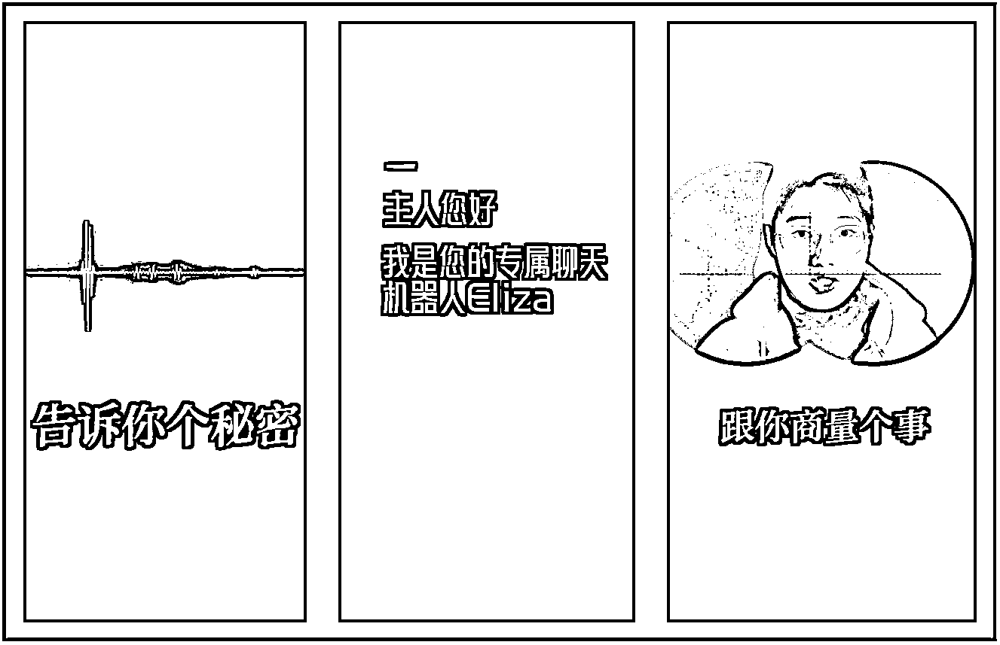

# 3 发 3 爆，适合普通人的小红书口播视频爆款公式

> 原文：[`www.yuque.com/for_lazy/thfiu8/bax4lng4g5box33m`](https://www.yuque.com/for_lazy/thfiu8/bax4lng4g5box33m)

<ne-h2 id="357b5f7c" data-lake-id="357b5f7c"><ne-heading-ext><ne-heading-anchor></ne-heading-anchor><ne-heading-fold></ne-heading-fold></ne-heading-ext><ne-heading-content><ne-text id="uf4872924">(52 赞)3 发 3 爆，适合普通人的小红书口播视频爆款公式</ne-text></ne-heading-content></ne-h2> <ne-p id="ua18c8d8e" data-lake-id="ua18c8d8e"><ne-text id="u597bee57">作者： 李子木</ne-text></ne-p> <ne-p id="u7e1460e9" data-lake-id="u7e1460e9"><ne-text id="u92f4572b">日期：2023-07-24</ne-text></ne-p> <ne-p id="uf4074c7e" data-lake-id="uf4074c7e"><ne-text id="u4b54c111" style="color: rgb(0, 0, 0);">最近子木新起了一个知识类的口播账号，摸索出一种数据反馈还不错的内容结构。第一次用这种结构做笔记，在粉丝不到 100 时爆了，单视频播放 7.9w+，点赞 1.2w+，转粉 5600+。后面又用这种结构做了两次，用的并不是爆款选题，一次单视频播放 3.3w+，点赞 2.6k+，涨粉 600+，一次单视频播放 7.1w+，点赞 4.6k+，涨粉 260+。</ne-text></ne-p> <ne-p id="u8359c838" data-lake-id="u8359c838"><ne-card data-card-name="image" data-card-type="inline" id="cvixG" data-event-boundary="card"></ne-card></ne-p> <ne-p id="u9c3ce7ab" data-lake-id="u9c3ce7ab"><ne-text id="u4db572a4" style="color: rgb(0, 0, 0);">至此，我认为这是一个有总结价值、可以拿出来被检验的口播视频爆款公式，所以总结出来与大家分享。</ne-text></ne-p> <ne-p id="ub9fd4794" data-lake-id="ub9fd4794"><ne-text id="u2592b493" style="color: rgb(0, 0, 0);">它解决了我的两个问题，或许对你也能有启发：</ne-text></ne-p> <ne-p id="uda03ec1a" data-lake-id="uda03ec1a"><ne-text id="u8dd1d07e">1、 </ne-text><ne-text id="uf7f19291" style="color: rgb(0, 0, 0);">作为镜头表现力一般的普通人，怎么才能提高视频的吸引力？</ne-text></ne-p> <ne-p id="u03e62119" data-lake-id="u03e62119"><ne-text id="u61d39993">2、 </ne-text><ne-text id="u5335a3f8" style="color: rgb(0, 0, 0);">如何用一种有效的内容结构，降低内容输出的难度？</ne-text></ne-p> <ne-h3 id="87706434" data-lake-id="87706434"><ne-heading-ext><ne-heading-anchor></ne-heading-anchor><ne-heading-fold></ne-heading-fold></ne-heading-ext><ne-heading-content><ne-text id="u586aac31" ne-bold="true">内容设计思路</ne-text></ne-heading-content></ne-h3> <ne-p id="u92fdb53c" data-lake-id="u92fdb53c"><ne-text id="u06d98dda" style="color: rgb(51, 51, 51);">短视频领域的竞争越来越激烈，前 5 秒没有抓住观众停留、15 秒没有互动，就算后面的内容讲得再精彩，也很难被推到更大的流量池、也就不会被看到，所以，对短视频内容而言，“怎么讲“比“讲什么“更重要。</ne-text></ne-p> <ne-p id="u50ffcc15" data-lake-id="u50ffcc15"><ne-text id="ua206dffd" style="color: rgb(51, 51, 51);">另外我们还会发现，就算是同样的内容，不同的人讲出来，可能有人几万赞、有人只有几个赞，这是因为人物的表现力不同、与镜头的互动性不同，对观众的吸引力完全不同。</ne-text></ne-p> <ne-p id="ucf1b95ca" data-lake-id="ucf1b95ca"><ne-text id="uc1e125e9" style="color: rgb(51, 51, 51);">作为没有任何视频录制经验、镜头表现力一般的素人，该怎么弥补自己的弱势？怎么让观众有兴趣点进来、愿意看下去、跟我互动？这是我思考的主要问题。</ne-text></ne-p> <ne-p id="u2ed31e4b" data-lake-id="u2ed31e4b"><ne-text id="ubd973046" style="color: rgb(51, 51, 51);">当表现不够时，可以用形式来凑，所以，我主要从形式、结构出发来做设计：</ne-text></ne-p> <ne-p id="u24347108" data-lake-id="u24347108"><ne-card data-card-name="image" data-card-type="inline" id="XS3Kf" data-event-boundary="card"></ne-card></ne-p> <ne-p id="uab73f9f5" data-lake-id="uab73f9f5"><ne-text id="u8486e1a9">1、 </ne-text><ne-text id="uf3481cc1" style="color: rgb(51, 51, 51);">与刷视频的人相关</ne-text></ne-p> <ne-p id="u2257a68d" data-lake-id="u2257a68d"><ne-text id="udd31979e" style="color: rgb(51, 51, 51);">各大平台的内容这么多，为什么看你的，不看别人的？除了对你讲的话题感兴趣之外，很重要的一点：你讲的东西与 ta 相关。</ne-text></ne-p> <ne-p id="u5d7d38f8" data-lake-id="u5d7d38f8"><ne-text id="u31725889" style="color: rgb(51, 51, 51);">常见的方法是，在封面、开头、标题指出你内容针对的人群，比如“长沙打工人注意”、“考四级的同学听好了”、“小个子女生要知道”……这种方法，需要明确你内容针对的具体人群，流量相对比较精准。</ne-text></ne-p> <ne-p id="u66a72f93" data-lake-id="u66a72f93"><ne-text id="uea1230cc" style="color: rgb(51, 51, 51);">而我在做笔记时，不确定该内容吸引的具体人群，所以采用的是“对话式”封面和标题，模拟直接跟镜头前的人互动的形式。具体如何操作后面再讲。</ne-text></ne-p> <ne-p id="u27126a23" data-lake-id="u27126a23"><ne-text id="u69bcc8b1">2、 </ne-text><ne-text id="uee07bb7b" style="color: rgb(51, 51, 51);">用新鲜的镜头表达</ne-text></ne-p> <ne-p id="ue5f6b685" data-lake-id="ue5f6b685"><ne-text id="u1fb53094" style="color: rgb(51, 51, 51);">人们对于新鲜稀奇的东西，总是愿意多看看，所以，摒弃普通的口播式开头，采用一些新鲜的特效、新鲜的画面，能够增加平均观看时长，数据自己也会相对更好。</ne-text></ne-p> <ne-p id="ua51b3562" data-lake-id="ua51b3562"><ne-text id="u6dca092f">3、 </ne-text><ne-text id="ud011d184" style="color: rgb(51, 51, 51);">15 秒内引导互动</ne-text></ne-p> <ne-p id="uf8914de6" data-lake-id="uf8914de6"><ne-text id="ub9d9de13" style="color: rgb(51, 51, 51);">无论在哪个平台，赞、藏、评、关注等互动数据，都是平台判断你的内容是否优质、是否要推往更大流量池的重要依据，所以，一定要在 15 秒内引导互动，不然等到后面，看的人变少、互动数据也会降低。</ne-text></ne-p> <ne-p id="u5d855f38" data-lake-id="u5d855f38"><ne-text id="u6d5d9ce8" style="color: rgb(51, 51, 51);">常见的是“点赞收藏，避免以后找不到了”，但我觉得，肯定还有更有趣的玩法，所以在做互动时，参考了一些电影剧情的设计，后面具体讲。</ne-text></ne-p> <ne-p id="u80c5626a" data-lake-id="u80c5626a"><ne-text id="u56b5567c">4、 </ne-text><ne-text id="u0f05ddb1" style="color: rgb(51, 51, 51);">用当下热度更高的选题</ne-text></ne-p> <ne-p id="u5359662b" data-lake-id="u5359662b"><ne-text id="ud6e955ad" style="color: rgb(51, 51, 51);">这是加分项。我的 3 个内容，只有第一个用了爆款选题，虽然 3 个都爆了，但在后期，确实是使用爆款选题的笔记长尾流量更多、搜索流量更高，过了一个多月还能源源不断地给我带来关注。</ne-text></ne-p> <ne-h3 id="9087ef32" data-lake-id="9087ef32"><ne-heading-ext><ne-heading-anchor></ne-heading-anchor><ne-heading-fold></ne-heading-fold></ne-heading-ext><ne-heading-content><ne-text id="u0cc7563f" ne-bold="true">具体操作方法</ne-text></ne-heading-content></ne-h3> <ne-h4 id="ff795e72" data-lake-id="ff795e72"><ne-heading-ext><ne-heading-anchor></ne-heading-anchor><ne-heading-fold></ne-heading-fold></ne-heading-ext><ne-heading-content><ne-text id="ub6d7392f">1、 </ne-text><ne-text id="u37ca1f70" style="color: rgb(0, 0, 0);">选题：当下热门话题</ne-text></ne-heading-content></ne-h4> <ne-p id="u58642414" data-lake-id="u58642414"><ne-text id="u853673be" style="color: rgb(0, 0, 0);">子木做的这个赛道非常小众，相关内容大多数据一般，通过在平台直接搜索的方式，不容易找到热门话题，所以，我是通过数据分析平台来寻找热门话题的。</ne-text></ne-p> <ne-p id="u890b4043" data-lake-id="u890b4043"><ne-card data-card-name="image" data-card-type="inline" id="cGnpZ" data-event-boundary="card"></ne-card></ne-p> <ne-p id="u6a7b07c4" data-lake-id="u6a7b07c4"><ne-text id="ue0a32340" style="color: rgb(0, 0, 0);">以 5118 为例，可以查看抖音暴涨词、百度暴涨词，搜索自己领域相关的关键词，然后选择移动端从高到低排序，就能看出近段时间需求量变大的词，用它们作为内容的选题、标题都是不错的。</ne-text></ne-p> <ne-p id="u7150f849" data-lake-id="u7150f849"><ne-text id="ua571a882" style="color: rgb(0, 0, 0);">赛道稍微大众一点的，还可以直接在平台搜索相关关键词，找到 3 个月内的低粉爆款内容，如果同一个选题出了 3 个低粉爆款，就值得吸收成为自己的下一个选题。</ne-text></ne-p> <ne-h4 id="4dcb7e3f" data-lake-id="4dcb7e3f"><ne-heading-ext><ne-heading-anchor></ne-heading-anchor><ne-heading-fold></ne-heading-fold></ne-heading-ext><ne-heading-content><ne-text id="u70bdca98">2、 </ne-text><ne-text id="u2b0fdf0d" style="color: rgb(0, 0, 0);">标题：互动式封面和标题</ne-text></ne-heading-content></ne-h4> <ne-p id="u742e8596" data-lake-id="u742e8596"><ne-text id="ubb4d87ae" style="color: rgb(0, 0, 0);">先确定封面和标题的用词，有两种方法：一是用暴涨词，会让长尾流量更多，比如我的第一条就用了“数字生命”这个当时的热词；二是在各个短视频平台搜索相关作品，找到一年内数据表现最好的 3 个内容，从它们的标题或开头中抽取关键词。</ne-text></ne-p> <ne-p id="u293219ba" data-lake-id="u293219ba"><ne-text id="u4fa87d9e" style="color: rgb(0, 0, 0);">然后，确定封面和标题的形式。我用的是对话式互动，封面用大字报：“你是 xx 吗”、“我们 xx 吧？”，标题与封面相配合：“你怎么确定自己不是 xx 呢？”“xx 向你发出邀请，是否接受？”，这种形式除了提高点击率之外，还能提高点进来之后的互动。</ne-text></ne-p> <ne-h4 id="918729a1" data-lake-id="918729a1"><ne-heading-ext><ne-heading-anchor></ne-heading-anchor><ne-heading-fold></ne-heading-fold></ne-heading-ext><ne-heading-content><ne-text id="u90e72347">3、 </ne-text><ne-text id="u58d2d506" style="color: rgb(0, 0, 0);">前 3 秒：互动式内容+新鲜的镜头表达</ne-text></ne-heading-content></ne-h4> <ne-p id="uf7cef1d0" data-lake-id="uf7cef1d0"><ne-text id="u9139724c" style="color: rgb(0, 0, 0);">模拟生活中出现过、但是不常见的形式，来与用户做互动。</ne-text></ne-p> <ne-p id="ua64642d8" data-lake-id="ua64642d8"><ne-text id="uababbe53" style="color: rgb(0, 0, 0);">比如我用到的形式分别是：</ne-text></ne-p> <ne-p id="uc3fc74ea" data-lake-id="uc3fc74ea"><ne-text id="u065a56bb" style="color: rgb(0, 0, 0);">①模拟老式收音机，屏幕中只出现电波，直接与屏幕前的人对话；</ne-text></ne-p> <ne-p id="udbdfe5a3" data-lake-id="udbdfe5a3"><ne-text id="u318377f5" style="color: rgb(0, 0, 0);">②模拟旧式电脑，屏幕中只出现跳动的光标和文字，与电脑屏幕前的人对话；</ne-text></ne-p> <ne-p id="u874465fd" data-lake-id="u874465fd"><ne-text id="u096c8748" style="color: rgb(0, 0, 0);">③模拟望远镜，看起来是在用望远镜看我，直接与望远镜这边的人喊话。</ne-text></ne-p> <ne-p id="ua9cf897a" data-lake-id="ua9cf897a"><ne-text id="u45ab60f4" style="color: rgb(0, 0, 0);">做这种设计的原则就是，用不常见的特效吸引停留，表达的内容与封面和标题一脉相承，直接对屏幕前的人喊话，发出邀请、或提出问题，吸引他思考。</ne-text></ne-p> <ne-p id="u7e353bcc" data-lake-id="u7e353bcc"><ne-card data-card-name="image" data-card-type="inline" id="XyBHk" data-event-boundary="card"></ne-card></ne-p> <ne-h4 id="2badcb7e" data-lake-id="2badcb7e"><ne-heading-ext><ne-heading-anchor></ne-heading-anchor><ne-heading-fold></ne-heading-fold></ne-heading-ext><ne-heading-content><ne-text id="uba92b5a6">4、 </ne-text><ne-text id="u9468e1f8" style="color: rgb(0, 0, 0);">前 15 秒：巧妙引导赞评</ne-text></ne-heading-content></ne-h4> <ne-p id="u4e913571" data-lake-id="u4e913571"><ne-text id="u4ccde8b7" style="color: rgb(0, 0, 0);">一般的“觉得有用就点赞收藏”见效并不高，我做了 3 种还算有趣的互动，效果都还不错，可以顺着这个思路继续做延伸：</ne-text></ne-p> <ne-p id="uceab785f" data-lake-id="uceab785f"><ne-text id="u26678978" style="color: rgb(0, 0, 0);">①参考电影《黑客帝国》中红蓝药丸的形式，在视屏中设置了红蓝两个按钮，让观众双击不同按钮、做出不同的选择。这个互动也是跟我的标题、开头内容的提问相关的，所以很多人双击——多一个人双击，我就多获得一个赞，结果是，这个视频的点赞率超过了 15%。</ne-text></ne-p> <ne-p id="u766aa2e6" data-lake-id="u766aa2e6"><ne-text id="u2f884e19" style="color: rgb(0, 0, 0);">②引导粉丝在评论区留言告诉我他的选择。无论观众双击红色还是蓝色，我们都看不到，所以这个引导很自然。</ne-text></ne-p> <ne-p id="u5b657732" data-lake-id="u5b657732"><ne-text id="u34702506" style="color: rgb(0, 0, 0);">③在内容埋一个具体的槽点，让人忍不住留言。比如我说“你今天吃的排骨是假的”，就有上百条针对它的留言：“你怎么知道我吃了排骨”、“我今天没吃排骨”……留言多了，数据自然会更好。要用无伤大雅的小细节，一旦你说对了，他会惊讶：你怎么知道？而如果你说错了，他能得瑟：嘿嘿，你说错了吧，但并不会质疑你内容的正确性。</ne-text></ne-p> <ne-h4 id="b56b5edc" data-lake-id="b56b5edc"><ne-heading-ext><ne-heading-anchor></ne-heading-anchor><ne-heading-fold></ne-heading-fold></ne-heading-ext><ne-heading-content><ne-text id="ud5147c95">5、 </ne-text><ne-text id="u1dfa9c89" style="color: rgb(0, 0, 0);">正片内容完整，尽量在 2 分钟以内</ne-text></ne-heading-content></ne-h4> <ne-p id="uddff5aca" data-lake-id="uddff5aca"><ne-text id="u39953499" style="color: rgb(0, 0, 0);">如果时长太长，前面这些设计所拉长的平均播放时长，对完播率的影响会降低，效果也会变差。</ne-text></ne-p> <ne-p id="uae6d3722" data-lake-id="uae6d3722"><ne-text id="uc301819c" style="color: rgb(0, 0, 0);">此外，我这几个内容转粉率还不错，第一条涨粉/观看到了 7%，主要有 2 个原因：</ne-text></ne-p> <ne-h4 id="ccfa2f72" data-lake-id="ccfa2f72"><ne-heading-ext><ne-heading-anchor></ne-heading-anchor><ne-heading-fold></ne-heading-fold></ne-heading-ext><ne-heading-content><ne-text id="u2fb64a56" style="color: rgb(0, 0, 0);">1、账号内容垂直</ne-text></ne-heading-content></ne-h4> <ne-p id="u90312194" data-lake-id="u90312194"><ne-text id="u72ae495a" style="color: rgb(0, 0, 0);">在第一条爆款之前，我发布了 18 条垂直内容，主页内容比较丰富、垂直度高；</ne-text></ne-p> <ne-h4 id="10924804" data-lake-id="10924804"><ne-heading-ext><ne-heading-anchor></ne-heading-anchor><ne-heading-fold></ne-heading-fold></ne-heading-ext><ne-heading-content><ne-text id="u66490efc" style="color: rgb(0, 0, 0);">2、人群以学生为主</ne-text></ne-heading-content></ne-h4> <ne-p id="u97e9af89" data-lake-id="u97e9af89"><ne-text id="u3466f9fa" style="color: rgb(0, 0, 0);">之前做游戏类、学习类账号就发现，学生人群的转粉率极高，这次的视频观看人群也主要是学生，许多甚至没有点进主页，直接就加了关注。</ne-text></ne-p> <ne-p id="u5e3b639c" data-lake-id="u5e3b639c"><ne-text id="ue40f6097" style="color: rgb(0, 0, 0);">最后总结一下，万变不离其宗，内容设计的根本原则其实只有三个：用热点选题、与看的人相关、加强互动，在此基础上，多找跨界参考，从电影、电视、综艺、生活中找到合适的、有意思的形式，挪用到你的视频里，给人新鲜的感觉，点击、停留的概率就容易增加，数据自然也会起来。</ne-text></ne-p> <ne-hole id="ua431876d" data-lake-id="ua431876d"><ne-card data-card-name="hr" data-card-type="block" id="BIBeO" data-event-boundary="card"><ne-p id="uf93ecdf9" data-lake-id="uf93ecdf9"><ne-text id="ue7b02074">评论区：</ne-text></ne-p> <ne-p id="udc97de3b" data-lake-id="udc97de3b"><ne-text id="ua778770a">暂无评论</ne-text></ne-p> <ne-p id="u4efa9075" data-lake-id="u4efa9075"><ne-card data-card-name="image" data-card-type="inline" id="HhEHH" data-event-boundary="card">  <ne-hole id="ua99e897d" data-lake-id="ua99e897d"><ne-card data-card-name="hr" data-card-type="block" id="dEMLC" data-event-boundary="card"></ne-card></ne-hole></ne-card></ne-p></ne-card></ne-hole>