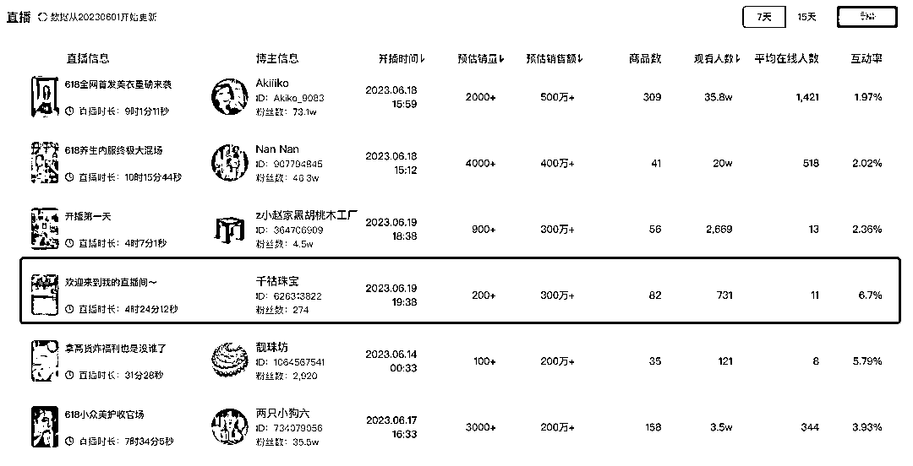
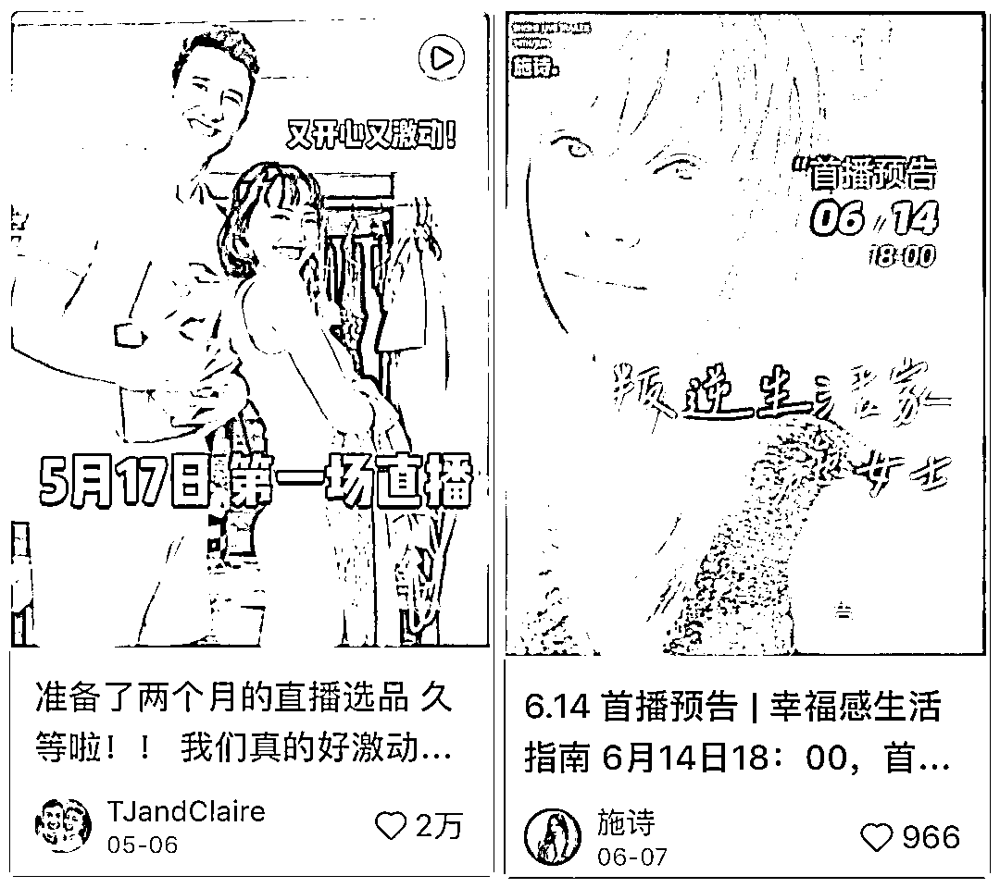

# 小红书直播底层逻辑

> 原文：[`www.yuque.com/for_lazy/thfiu8/qz9wigzkzo4rmbcg`](https://www.yuque.com/for_lazy/thfiu8/qz9wigzkzo4rmbcg)

<ne-h2 id="67994122" data-lake-id="67994122"><ne-heading-ext><ne-heading-anchor></ne-heading-anchor><ne-heading-fold></ne-heading-fold></ne-heading-ext><ne-heading-content><ne-text id="u3ffa84ac">(35 赞)小红书直播底层逻辑</ne-text></ne-heading-content></ne-h2> <ne-p id="ufbcde1e3" data-lake-id="ufbcde1e3"><ne-text id="uf544d521">作者： Sherry💎谢无敌</ne-text></ne-p> <ne-p id="u5a5feb95" data-lake-id="u5a5feb95"><ne-text id="u6048f9b4">日期：2023-07-26</ne-text></ne-p> <ne-p id="u4513874c" data-lake-id="u4513874c"><ne-text id="u4f6caa30" style="background-color: rgb(255, 255, 255); color: rgb(47, 48, 52);">Hi～生财的朋友们大家好~我是你们的老朋友-谢无敌，小红书 MCN 闪亮猫传媒创始人。</ne-text></ne-p> <ne-p id="u816eac84" data-lake-id="u816eac84"><ne-text id="ub951352f">大家最近刷小红书，不知道有没有发现开直播的人越来越多了，尤其是晚上，每隔几篇笔记，就会有一个博主正在直播。</ne-text></ne-p> <ne-p id="u84c8c640" data-lake-id="u84c8c640"><ne-card data-card-name="image" data-card-type="inline" id="Z0pZ4" data-event-boundary="card"></ne-card></ne-p> <ne-p id="ude97a404" data-lake-id="ude97a404"><ne-text id="u89b71058">有人说：宇宙的尽头是直播带货！</ne-text></ne-p> <ne-p id="uabfe5bcc" data-lake-id="uabfe5bcc"><ne-text id="u3e819896">虽然是句玩笑话，但不可否认，这两年直播带货的热度是一路高涨啊，连一向“矜持”的小红书今年也开始往直播方向发力了。</ne-text></ne-p> <ne-p id="u27d86854" data-lake-id="u27d86854"><ne-text id="ufe6bcc66">首先表现在直播入口上，今年的入口更加丰富多样，除了可以收到关注的博主开播的系统提醒外，还有三个常见的直播入口：</ne-text></ne-p> <ne-p id="uf4d2b94a" data-lake-id="uf4d2b94a"><ne-text id="u9e93d45c">一是在关注页面会有直播字样；二是在推荐页和搜索页，正在直播的博主头像上会有一圈红色+直播的字样；三是在发现页的顶部工具栏处，有一个独立的直播入口，点击进去就可以到达小红书的直播广场。</ne-text></ne-p> <ne-p id="ub0d2740e" data-lake-id="ub0d2740e"><ne-card data-card-name="image" data-card-type="inline" id="vmD2H" data-event-boundary="card"></ne-card></ne-p> <ne-p id="ue7017e9c" data-lake-id="ue7017e9c"><ne-text id="u640a2aaf">直播广场里的主题五花八门，几乎囊括了各种你想得到和想不到的内容。</ne-text></ne-p> <ne-p id="u6ecfb967" data-lake-id="u6ecfb967"><ne-text id="u0bd88417">有服饰类的带货直播，有沉浸式的学习直播，有家居展示类的直播，还有助眠、冥想类直播，甚至还有开摄像头让大家帮忙照看宠物的直播。</ne-text></ne-p> <ne-p id="u887a1433" data-lake-id="u887a1433"><ne-card data-card-name="image" data-card-type="inline" id="vs5qA" data-event-boundary="card"></ne-card></ne-p> <ne-p id="uea1a0791" data-lake-id="uea1a0791"><ne-text id="ub5e7c5ec">其次，由于有官方的流量支持，今年小红书直播的场观明显提升。</ne-text></ne-p> <ne-p id="u88532eb4" data-lake-id="u88532eb4"><ne-text id="ue3d6c8a1">下面是我在某个周五中午随机截取的直播带货榜单，可以看到，即使是在工作时间，直播间的场观也非常可观，而且很多直播间的客单价都相对较高。</ne-text></ne-p> <ne-p id="ub8f4e753" data-lake-id="ub8f4e753"><ne-card data-card-name="image" data-card-type="inline" id="uj3Gz" data-event-boundary="card"></ne-card></ne-p> <ne-p id="ua0056e4c" data-lake-id="ua0056e4c"><ne-text id="u4faaae86">说实话，与其他平台相比，小红书直播起步相对较晚，但凭借着高净值用户的优势，小红书直播实现了其他平台羡慕的“三高一低”：高转化率、高客单价、高复购率和低退货率。</ne-text></ne-p> <ne-p id="u6850a586" data-lake-id="u6850a586"><ne-text id="ua2571b9f">今年上半年，董洁和章小蕙这两匹黑马的出圈就充分验证了这一点，她们单场直播的 GMV 都达到了千万级别，并且一次比一次更高。</ne-text></ne-p> <ne-p id="u708adf35" data-lake-id="u708adf35"><ne-text id="uf5fb5c35">两位都采用了轻松聊天的直播风格，她们的直播间里没有价格战，也没有逼单，但是上千元的单品经常还没介绍就卖光了。</ne-text></ne-p> <ne-p id="uc28c75bd" data-lake-id="uc28c75bd"><ne-card data-card-name="image" data-card-type="inline" id="ukSXI" data-event-boundary="card"></ne-card></ne-p> <ne-p id="u8efd006b" data-lake-id="u8efd006b"><ne-text id="uea800b7b">随着董洁和章小蕙的爆红，更多的明星入局小红书直播，这也逐渐培养了用户在小红书上购物的习惯。</ne-text></ne-p> <ne-p id="u8665f9fd" data-lake-id="u8665f9fd"><ne-text id="uae635c3f">当然，为了避免流量独占的现象，小红书一定会扶持更多普通人崛起，毕竟大量的素人博主才是小红书的核心力量。</ne-text></ne-p> <ne-p id="u382a6378" data-lake-id="u382a6378"><ne-text id="u3e32a075">对于普通人来说，平台助推+用户质量高+用户习惯养成，三个因素好比天时地利人和，所以，今年的小红书直播非常值得大家去尝试。</ne-text></ne-p> <ne-p id="u0f3b4776" data-lake-id="u0f3b4776"><ne-text id="u07b8a192" ne-bold="true">▍小红书直播的底层逻辑</ne-text></ne-p> <ne-p id="ub4306bd0" data-lake-id="ub4306bd0"><ne-text id="u54a60080">众所周知，直播需要具备三大要素：人、货、场。和其他平台相比，小红书直播在这三个方面都有自己的特点。</ne-text></ne-p> <ne-h3 id="74a3c889" data-lake-id="74a3c889"><ne-heading-ext><ne-heading-anchor></ne-heading-anchor><ne-heading-fold></ne-heading-fold></ne-heading-ext><ne-heading-content><ne-text id="ub3028810">1、</ne-text><ne-text id="ud5feda0b" ne-bold="true">人：以人带货，人设统一</ne-text></ne-heading-content></ne-h3> <ne-p id="uab26e46b" data-lake-id="uab26e46b"><ne-text id="ub325a278">目前，小红书出圈的几位主播都有自己代表性的特征，并且与他们推荐的产品高度契合。例如，章小蕙优雅贵气，专注于推荐优质的护肤和美妆产品；董洁温柔恬淡，主推舒适时尚单品和实用家居好物。</ne-text></ne-p> <ne-p id="u35920c5d" data-lake-id="u35920c5d"><ne-card data-card-name="image" data-card-type="inline" id="Ize0i" data-event-boundary="card"></ne-card></ne-p> <ne-p id="u3d436012" data-lake-id="u3d436012"><ne-text id="ubffa22f8">用户在很大程度上是因为她们的生活方式和生活品味而被种草，属于以人带货的模式，货跟着人走。</ne-text></ne-p> <ne-p id="ued1d16f8" data-lake-id="ued1d16f8"><ne-text id="u958e4dd5">而在其他平台，通常是人跟着货走，用户更关注商品本身，对博主本身的粘性较低。</ne-text></ne-p> <ne-h3 id="d26fc4fb" data-lake-id="d26fc4fb"><ne-heading-ext><ne-heading-anchor></ne-heading-anchor><ne-heading-fold></ne-heading-fold></ne-heading-ext><ne-heading-content><ne-text id="u1ecdf18e">2、</ne-text><ne-text id="u1b2b6f8f" ne-bold="true">货：注重品质，客单价高</ne-text></ne-heading-content></ne-h3> <ne-p id="u0fb07844" data-lake-id="u0fb07844"><ne-text id="u77523a32">董洁和章小蕙推荐的很多产品都是小众品牌和设计师作品，价格普遍较高，但具有独特的卖点，主打高级感、实用性和质感，与小红书用户追求高品质生活的调性完全契合。</ne-text></ne-p> <ne-p id="uc76dd1dd" data-lake-id="uc76dd1dd"><ne-text id="ua0d4efda">而在传统直播间，低价是最主要的卖点，用户更关注性价比，所以也导致直播间的客单价低，用户难留存。</ne-text></ne-p> <ne-h3 id="a8a38cc3" data-lake-id="a8a38cc3"><ne-heading-ext><ne-heading-anchor></ne-heading-anchor><ne-heading-fold></ne-heading-fold></ne-heading-ext><ne-heading-content><ne-text id="uf2098e71">3、</ne-text><ne-text id="u4e548d0d" ne-bold="true">场：聊天式分享，强信任感</ne-text></ne-heading-content></ne-h3> <ne-p id="ua4673425" data-lake-id="ua4673425"><ne-text id="ue0fc06bc">“不吵不闹，很舒服”</ne-text></ne-p> <ne-p id="u2fa109dc" data-lake-id="u2fa109dc"><ne-text id="ue550344e">“有种花钱得到尊重的感觉”</ne-text></ne-p> <ne-p id="ub5f2b971" data-lake-id="ub5f2b971"><ne-text id="u9f9d09c9">............</ne-text></ne-p> <ne-p id="uaca74544" data-lake-id="uaca74544"><ne-text id="ub07628ab">这些是董洁直播出圈时，很多人对她的评价，她的直播风格颠覆了传统的叫卖式直播，符合小红书主流用户的需求。</ne-text></ne-p> <ne-p id="uaaf65c00" data-lake-id="uaaf65c00"><ne-text id="u42468f5f">后面开播的章小蕙、张俪等也采用类似的直播风格，不是为了卖产品而卖产品，而是真诚地、自用式地分享。因此，用户在直播中体验感好，建立起强烈的信任感。</ne-text></ne-p> <ne-p id="u6bec5d49" data-lake-id="u6bec5d49"><ne-text id="ubb866b98">所以，想做好小红书直播，你需要做到：</ne-text><ne-text id="ufbcd3932" ne-bold="true">在“人”上做差异化和垂直细分的定位；在“货”上做小众、实用、创新的产品；在“场”上搭建符合小红书审美的场景，并且真诚分享。</ne-text></ne-p> <ne-p id="ub9238054" data-lake-id="ub9238054"><ne-text id="u98ff9db9">比如你做穿搭，你是小个子，极简风还是微胖型，你的定位越清晰，就越能吸引到同样审美、身材的用户，粉丝精准，转化率也高。</ne-text></ne-p> <ne-p id="uf6e5d44a" data-lake-id="uf6e5d44a"><ne-text id="ucffeed80">我在蝉小红近七天的直播数据分析中，就看到了一位只有 200+粉丝的珠宝博主，销售额却高达 300w+。</ne-text></ne-p> <ne-p id="u2f4ae757" data-lake-id="u2f4ae757"><ne-card data-card-name="image" data-card-type="inline" id="nQ20d" data-event-boundary="card"></ne-card></ne-p> <ne-h2 id="9039450f" data-lake-id="9039450f"><ne-heading-ext><ne-heading-anchor></ne-heading-anchor><ne-heading-fold></ne-heading-fold></ne-heading-ext> <ne-heading-content></ne-heading-content></ne-h2> <ne-p id="u745a40f0" data-lake-id="u745a40f0"><ne-text id="u82467c5b" ne-bold="true">▍如何提升小红书直播间流量</ne-text></ne-p> <ne-p id="u9344fec6" data-lake-id="u9344fec6"><ne-text id="u98d41563">在前面我们提到，小红书直播的入口主要有三个：粉丝关注页、推荐/搜索页的博主头像和直播广场。那么，怎么提升这三个入口的直播流量呢？</ne-text></ne-p> <ne-h3 id="b4c43d6c" data-lake-id="b4c43d6c"><ne-heading-ext><ne-heading-anchor></ne-heading-anchor><ne-heading-fold></ne-heading-fold></ne-heading-ext><ne-heading-content><ne-text id="u8691f7eb" ne-bold="true">1、关注页流量</ne-text></ne-heading-content></ne-h3> <ne-p id="uffb89f0b" data-lake-id="uffb89f0b"><ne-text id="ub1c5473e" ne-bold="true">1）发布直播预告</ne-text></ne-p> <ne-p id="u1e3c1fd7" data-lake-id="u1e3c1fd7"><ne-text id="u0db0a166">在开播前发布直播预告，特别是首次直播，让粉丝知道你有直播计划。预告的时间一般在开播前 2-3 天左右，目的是告诉用户你的直播主题、时间和福利活动等，让大家提前预约。</ne-text></ne-p> <ne-p id="u727b9ec5" data-lake-id="u727b9ec5"><ne-text id="u7aea3555">预约进来的这波流量，对直播间的留存率、互动率和转化率都有重要影响。</ne-text></ne-p> <ne-p id="ub19edd72" data-lake-id="ub19edd72"><ne-card data-card-name="image" data-card-type="inline" id="YyJST" data-event-boundary="card"></ne-card></ne-p> <ne-p id="u895a5901" data-lake-id="u895a5901"><ne-text id="uc84e1a7c" ne-bold="true">2）固定直播时间</ne-text></ne-p> <ne-p id="u04f5cf95" data-lake-id="u04f5cf95"><ne-text id="uc89150b1">当你熟练了以后，可以选择固定的直播时间，把直播时间添加到个人简介中，例如每周三晚上 8 点直播，可以培养粉丝的观看习惯。</ne-text></ne-p> <ne-h3 id="afd9ae0a" data-lake-id="afd9ae0a"><ne-heading-ext><ne-heading-anchor></ne-heading-anchor><ne-heading-fold></ne-heading-fold></ne-heading-ext><ne-heading-content><ne-text id="ue2b03c52" ne-bold="true">2、推荐/搜索页流量</ne-text></ne-heading-content></ne-h3> <ne-p id="u6236188b" data-lake-id="u6236188b"><ne-text id="uf2ee7d34" ne-bold="true">1）打磨笔记质量</ne-text></ne-p> <ne-p id="uf13501d6" data-lake-id="uf13501d6"><ne-text id="u794bc441">小红书首页的笔记信息流暂时没有单独的直播间推荐，只有在博主头像上有一个直播标记，点击头像就可以进入直播间。</ne-text></ne-p> <ne-p id="u7b9cea8d" data-lake-id="u7b9cea8d"><ne-text id="u0842e40c">所以，推荐/搜索页直播的流量很大程度上取决于你的笔记质量，需要你平时好好打磨自己的笔记。</ne-text></ne-p> <ne-p id="u36de22f8" data-lake-id="u36de22f8"><ne-text id="u87c0420c" ne-bold="true">2）关键词布局</ne-text></ne-p> <ne-p id="ubff97610" data-lake-id="ubff97610"><ne-text id="ubb5dbc6f">红书宝的老宝友们应该都知道，搜索页面是一个非常重要的笔记流量入口，而在小红书搜索页，头像上同样会有直播标记，所以搜索页面也是一个很重要的直播流量入口。</ne-text></ne-p> <ne-p id="ue9a88111" data-lake-id="ue9a88111"><ne-card data-card-name="image" data-card-type="inline" id="N17Fw" data-event-boundary="card"></ne-card></ne-p> <ne-p id="u322d4ced" data-lake-id="u322d4ced"><ne-text id="ud311d648">而提升搜索流量的关键是布局关键词，所以想要提升搜索页直播流量，同样也要重视日常笔记的关键词布局。</ne-text></ne-p> <ne-p id="u121c91e5" data-lake-id="u121c91e5"><ne-text id="ua0415fb9">关于关键词布局，之前有写过一篇详细的文章，没看过的朋友可以去回顾一下：</ne-text>[<ne-text id="ubd89e67f" ne-underline="true">做对小红书关键词布局，拿捏消息 99+的流量密码！</ne-text>](https://t.zsxq.com/0eLiWlm9B)</ne-p> <ne-h3 id="7a2b56d7" data-lake-id="7a2b56d7"><ne-heading-ext><ne-heading-anchor></ne-heading-anchor><ne-heading-fold></ne-heading-fold></ne-heading-ext><ne-heading-content><ne-text id="u44ad35d0" ne-bold="true">3、直播广场流量</ne-text></ne-heading-content></ne-h3> <ne-p id="ubbd44ca7" data-lake-id="ubbd44ca7"><ne-text id="u7134224f" ne-bold="true">1）封面和标题设计</ne-text></ne-p> <ne-p id="u8c133413" data-lake-id="u8c133413"><ne-text id="uff0530bf">直播广场内的展现方式类似于普通笔记，也是封面和标题。</ne-text></ne-p> <ne-p id="u02fe9ddf" data-lake-id="u02fe9ddf"><ne-card data-card-name="image" data-card-type="inline" id="BlOLq" data-event-boundary="card"></ne-card></ne-p> <ne-p id="uc6b4003e" data-lake-id="uc6b4003e"><ne-text id="u8d673b40">所以，封面和标题的设计非常重要。要从用户痛点和需求出发，挖掘你的亮点和吸睛点，但是要注意，封面必须和你的直播内容相关，否则会被判违规。</ne-text></ne-p> <ne-p id="u9bbc9991" data-lake-id="u9bbc9991"><ne-card data-card-name="image" data-card-type="inline" id="UeeTU" data-event-boundary="card"></ne-card></ne-p> <ne-p id="u4346bf79" data-lake-id="u4346bf79"><ne-text id="ubb017aae" ne-bold="true">2）做好冷启动</ne-text></ne-p> <ne-p id="u6475de70" data-lake-id="u6475de70"><ne-text id="ud866c037">直播广场的流量推送逻辑，也类似于笔记的推送机制，会先推送给一小波用户测试反应。如果反馈良好，系统会认为你的直播间内容优质，继续推送给更多用户，反之就会停止推送。</ne-text></ne-p> <ne-p id="u423092d1" data-lake-id="u423092d1"><ne-text id="u5400a877">所以吸引用户进直播间后，下一步就是做好冷启动，冷启动的数据指标包括点赞量、评论量、关注率、停留时长和下单转化率等。</ne-text></ne-p> <ne-p id="ud5a4e217" data-lake-id="ud5a4e217"><ne-text id="ud4539af8">做好冷启动的核心是要满足小红书直播的底层逻辑，你需要在人、货、场三个方面挖掘适合自己的风格，并符合小红书的调性。</ne-text></ne-p> <ne-p id="ud1a8c112" data-lake-id="ud1a8c112"><ne-text id="ud00317a9" ne-bold="true">3）蹭平台直播话题</ne-text></ne-p> <ne-p id="u99fdbadd" data-lake-id="u99fdbadd"><ne-text id="ua41acf9f">为了支持直播，小红书官方会定期推出一些直播计划和活动，和写笔记带话题的逻辑一样。有适合自己的直播话题，大家可以积极参加，提升曝光度。</ne-text></ne-p> <ne-p id="u2ce8419c" data-lake-id="u2ce8419c"><ne-card data-card-name="image" data-card-type="inline" id="vZnOi" data-event-boundary="card"></ne-card></ne-p> <ne-p id="uf018c253" data-lake-id="uf018c253"><ne-text id="ufed22d6f" ne-bold="true">▍小红书直播避坑指南</ne-text></ne-p> <ne-p id="ud1e87cde" data-lake-id="ud1e87cde"><ne-text id="u6e55d5f5">新人做小红书直播，容易误触雷区，以下是一些需要避免的陷阱和注意事项。</ne-text></ne-p> <ne-h3 id="f6019cf8" data-lake-id="f6019cf8"><ne-heading-ext><ne-heading-anchor></ne-heading-anchor><ne-heading-fold></ne-heading-fold></ne-heading-ext><ne-heading-content><ne-text id="ua2f538f0" ne-bold="true">1、不要盲目造数据</ne-text></ne-heading-content></ne-h3> <ne-p id="u24650aa7" data-lake-id="u24650aa7"><ne-text id="uaec46cce">很多新人开播时会担心没有流量，就拉了一堆亲朋好友来助兴，但系统会给每个直播间打标签，如果你找的人标签很混乱，就会间接影响你的直播间标签，导致系统不知道接下来要把你推给哪些用户。</ne-text></ne-p> <ne-h3 id="61de589d" data-lake-id="61de589d"><ne-heading-ext><ne-heading-anchor></ne-heading-anchor><ne-heading-fold></ne-heading-fold></ne-heading-ext><ne-heading-content><ne-text id="u168e8dca" ne-bold="true">2、禁止进行站外导流</ne-text></ne-heading-content></ne-h3> <ne-p id="uab6994da" data-lake-id="uab6994da"><ne-text id="uab0c55cd">和普通笔记一样，小红书直播间是不允许有站外导流行为的。微信、淘宝链接、二维码、手机号等都属于敏感信息，一旦系统检测到这些行为，轻则会收到警告，严重的情况下会停播，甚至限制你的开播权限。</ne-text></ne-p> <ne-h3 id="ac59160f" data-lake-id="ac59160f"><ne-heading-ext><ne-heading-anchor></ne-heading-anchor><ne-heading-fold></ne-heading-fold></ne-heading-ext><ne-heading-content><ne-text id="u26e18a94" ne-bold="true">3、没必要讨好所有人</ne-text></ne-heading-content></ne-h3> <ne-p id="u3e7bcd4d" data-lake-id="u3e7bcd4d"><ne-text id="u949d37f8">有些博主为了吸引流量，会使用一些与自己领域不相关的福利来吸引眼球。但是这样吸引来的流量很可能不是精准流量，也会影响到你的直播间标签。</ne-text></ne-p> <ne-p id="ub3bae360" data-lake-id="ub3bae360"><ne-text id="uf0b7afe4">我们只需要吸引和留下目标人群，因为只有精准的人群才能带来更高的转化率。</ne-text></ne-p> <ne-h3 id="49fb9f6b" data-lake-id="49fb9f6b"><ne-heading-ext><ne-heading-anchor></ne-heading-anchor><ne-heading-fold></ne-heading-fold></ne-heading-ext><ne-heading-content><ne-text id="uf5272286" ne-bold="true">4、场观少也不要摆烂</ne-text></ne-heading-content></ne-h3> <ne-p id="u76889739" data-lake-id="u76889739"><ne-text id="ua0ef5daf">直播间的用户流动性非常大，随时可能有人进入。当新人进入直播间时，她们不一定知道你的直播间有多少人，她们首先感受到的是你的状态和直播氛围。</ne-text></ne-p> <ne-p id="u88a7ed74" data-lake-id="u88a7ed74"><ne-text id="u30bb0581">如果你能留住他们，系统会识别到你的留存率和互动率，然后将你推送给更多相似的人群，慢慢地就形成了正循环，反之就是负循环，人只会越来越少。</ne-text></ne-p> <ne-p id="u0f4796e1" data-lake-id="u0f4796e1"><ne-text id="ud296cc3a">所以不管场观如何，你都要拿出自己最好的状态，保持自己的直播节奏。</ne-text></ne-p> <ne-p id="ub5a9099f" data-lake-id="ub5a9099f"><ne-text id="u948abf63">总之，小红书直播会有挑战，但更多的是机遇，有开播想法的朋友可以尽快提上日程了，期待大家的好消息。</ne-text></ne-p> <ne-p id="u7a7b754c" data-lake-id="u7a7b754c"><ne-text id="u24f53c6f" ne-bold="true">更多分享：</ne-text></ne-p> <ne-p id="uae6b473f" data-lake-id="uae6b473f">[<ne-text id="ue1538c2a" ne-underline="true">博主必看！2023 年小红书八大运营趋势解读</ne-text>](https://t.zsxq.com/0eFBeisHS)</ne-p> <ne-p id="u9e6a42e8" data-lake-id="u9e6a42e8">[<ne-text id="ua7f6dd13" ne-underline="true">做对小红书关键词布局，拿捏消息 99+的流量密码！</ne-text>](https://t.zsxq.com/0eLiWlm9B)</ne-p> <ne-p id="ude1dbd88" data-lake-id="ude1dbd88">[<ne-text id="u8fab91ca" ne-underline="true">客单价 4 位数的玄学博主，教你一个公式写出高转化笔记</ne-text>](https://t.zsxq.com/0eMdKqJbg)</ne-p> <ne-p id="ua383753a" data-lake-id="ua383753a">[<ne-text id="u2d2114c1" ne-underline="true">（附选品清单）如何选择小红书蓝海赛道和产品？3 个方法搞定！</ne-text>](https://t.zsxq.com/0eUR5OYuT)</ne-p> <ne-p id="ua1910247" data-lake-id="ua1910247">[<ne-text id="uf70d0dd8" ne-underline="true">一晚涨粉 400+、引流 80+，人人都可以复制小红书群聊引流法</ne-text>](https://t.zsxq.com/0eG1wH8d5)</ne-p> <ne-p id="ue3c0415b" data-lake-id="ue3c0415b">[<ne-text id="u22f4e098" ne-underline="true">船长复盘：小红书小航海 ｜乘风破浪会有时，直挂云帆济沧海</ne-text>](https://t.zsxq.com/0e63wt9Iw)</ne-p> <ne-p id="u9f12f515" data-lake-id="u9f12f515">[<ne-text id="u34474bc3" ne-underline="true">1 篇笔记引流 200+精准客，破解小红书真正的流量密码</ne-text>](https://t.zsxq.com/0eKZ3bNvk)</ne-p> <ne-p id="uec767c13" data-lake-id="uec767c13">[<ne-text id="u739fbba1" ne-underline="true">《0 基础新手，如何在 1 个月内通过小红书快速变现？（附 10 种变现渠道整理）</ne-text>](https://t.zsxq.com/0eeQyLczW)</ne-p> <ne-p id="uc5a34c21" data-lake-id="uc5a34c21">[<ne-text id="u968e2073" ne-underline="true">粉丝 10 万变现为 0？劝你千万不要做这三种账号！</ne-text>](https://articles.zsxq.com/id_6xqmwjmugnxe.html)</ne-p> <ne-hole id="u10f29839" data-lake-id="u10f29839"><ne-card data-card-name="hr" data-card-type="block" id="Nc4cw" data-event-boundary="card"><ne-p id="u8378126d" data-lake-id="u8378126d"><ne-text id="u3dd0e609">评论区：</ne-text></ne-p> <ne-p id="u558984c1" data-lake-id="u558984c1"><ne-text id="u9c3ca829">书豪 : 无敌超棒[爱心][爱心][爱心][爱心]</ne-text> <ne-text id="u98d4b51a">曜文 : 最近开始测直播 小红书官方流量一直推送到用户发现页</ne-text></ne-p> <ne-p id="u4af35bac" data-lake-id="u4af35bac"><ne-card data-card-name="image" data-card-type="inline" id="DkDqp" data-event-boundary="card"></ne-card></ne-p> <ne-hole id="ufa353b90" data-lake-id="ufa353b90"><ne-card data-card-name="hr" data-card-type="block" id="DjJnj" data-event-boundary="card"></ne-card></ne-hole></ne-card></ne-hole>