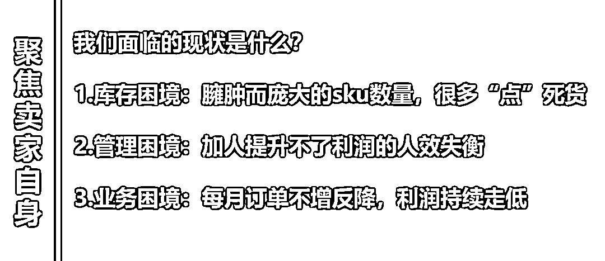
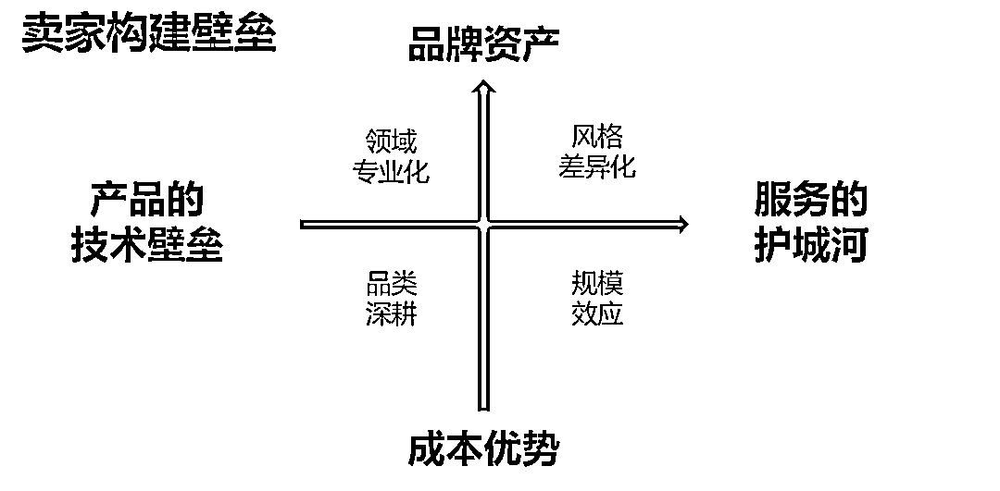
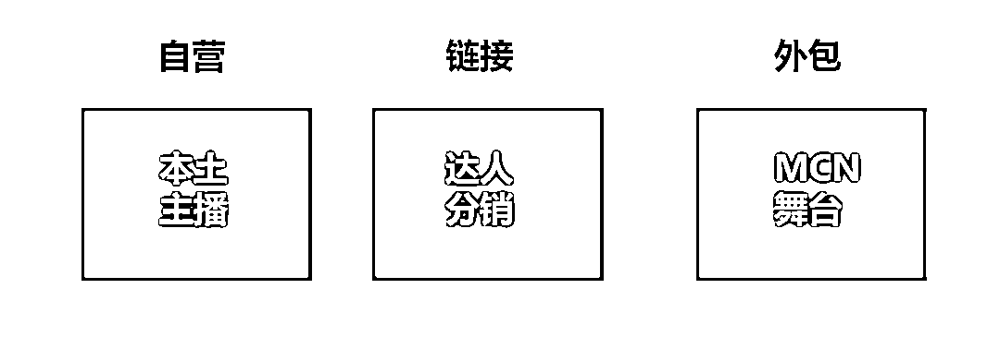

# 2023 年东南亚的跨境电商，一个出海的时代序幕正在进行

> 原文：[`www.yuque.com/for_lazy/thfiu8/vvghqr530sa2bu0f`](https://www.yuque.com/for_lazy/thfiu8/vvghqr530sa2bu0f)

## (41 赞)2023 年东南亚的跨境电商，一个出海的时代序幕正在进行 

作者： 夏冰雹 

日期：2023-07-25 

大家好，我是夏冰雹，一个做东南亚跨境电商的卖家。 

作为早期分享东南亚电商创业经历和资讯的一员，在持续深耕东南亚电商行业 3 年之后， 

希望通过自己的 2 篇演讲分享内容，给生财的伙伴，带来出海尤其是东南亚电商出海的一些信息更新。 

(因为个人时间的原因，并未将其进行重新整编，还请谅解。) 

以下内容我将其更新为 2 部分： 

在上半部分，《穿越寒冬，东南亚卖家的增长困局与自我跃迁》中，我将为大家分享，在东南亚红利期的电商平台下，我因为选取模式的不同，所遭遇的困境与突破方向。 

在下半部分，《拥抱变革：东南亚卖家的持续增长与创新之路》中， 我将通过跨境电商底层的变化和卖家的成长之路，分享【卖货人】需要跨过的几个门槛。 

其中，我认为对生财圈友有核心价值的是： 

1.在国内增速滞缓的情况下，在中国跨越中等规模陷阱的过程中，势必会带来大量就业的不饱和，中国人会越来越多的往外走，东南亚是必争之地，早出海，早吃肉。 

2.在东南亚地区，中国对印度尼西亚、菲律宾、越南，这三个人口过亿且发展落后、具备产业转移潜力的国家，有巨大的时光机效应，仍是未来 3-5 年的出海热地，要出海，先去这三地。 

3.在东南亚地区，虽然电商已经不像前几年拥有大量小白玩家可以入场捞金的机会，但另一种本地化的机遇也在出现。 

以下正文。 

##   

## 上半部分：《穿越寒冬，东南亚卖家的增长困局与自我跃迁》 

（2022 年 11 月 26 日） 

大家好，作为一个暂时还没有被市场卷死掉的小卖家。 

站在这里，是希望跟大家探讨，一个不能够完全称之为寒冬， 

却也是陷入在增长困境的泥潭中的我， 

为什么会这样，应该怎么办，将来往哪去的思考。 

 

我们先来看一组媒体的数据： 

shopee 在 2021 全年的订单增长是 116%，这意味着，只要在 2021 年初，卖家在 shopee 上开店，就有机会吃到年增速 116%的“平台红利”。 

也是在去年，我看到太多“几个人”的团队，在半年到 1 年的时间，在东南亚的任意一个市场，迅速做起来一个月营几百万的项目， 

包括我们自己的团队。 

而在 2022 年，纵观全年，我无法给大家一个确切的数字，但我们自己的团队体感是 0-20%。增长很慢甚至没有增长，但却也没有死掉。 

所以，不能够称之为寒冬，因为没有发生大范围的卖家死掉，相比于亚马逊 2021 的大规模封店潮与限制库容，相比于国内的电商卖家几个月都发不出货。东南亚的卖家，只能说是陷入了增长的困境。 

增长的困境来源于哪里？ 

我们先看整体的市场空间，我们首先得承认的是： 

第一个，东南亚相对于欧美、中国，整体的市场空间有限，尤其是单个市场，体量更小。整个东南亚市场前三名（印尼+泰国+菲律宾）的 GDP 加起来，堪堪够我们一个广东省。 

第二名泰国，还没有我们湖南省 GDP 高。 

 

我曾在群里看过这样一则对话：什么？你在做印度尼西亚的电商？ 

那地方的交易量还没坂田多！ 

话粗理不糙，其实东南亚尤其是单个市场的天花板，是非常有限的。 

在有限的市场空间里，大多数会且只会出现一种结局： 

强者越强，弱者越弱。最终，赢家通吃。 

我们再看电商市场，2014 年、15 年，在移动互联网的浪潮下，lazada、shopee 在东南亚的市场快速兴起。 

 

直到疫情开始，线下交易接近冻结，以 shopee 为核心的平台电商，在疫情下快速发展，提高了东南亚电商市场占零售总市场的份额。 

所谓的东南亚的市场红利，其实是线上电商对传统线下零售的侵蚀。 

2022 年上半年，东南亚多国宣布疫情全面结束，线下零售全面恢复，线上的发展进入相对瓶颈，电商的机会也减缓了。 

与此同时，Shopee 股价开始大跌，很难以高市值向市场拿钱。 

在线下市场恢复，平台电商减少砸钱买量之时，电商份额的增长不再由平台电商驱动，以 TIKTOK Shop 的内容电商成为新的领头羊。 

“红利期”电商平台的势能开始转变。 

第三，Shopee 正式进入成熟期，具体的表现是， 

在东南亚市场，产品的供给开始大于用户需求，在大多数的“关键词”下，都有超过几十甚至几百上千的产品。 

卖家亦然，从疫情下，卖家可以通过更低价格、更快时效的本土模式（物流省下的成本），享受市场和平台的双重红利。 

到疫情后全面放开，市场红利消失，需求红利消失。 

潮水退去，我们在裸泳。这个时候拼的不是谁游的快，而是谁更有肌肉，谁更有性价比。既然大家产品大差不差，只要你价格更低，你就可以获得用户。 

东南亚市场，已经全面进入了本土供应链的竞争态势。 

在市场空间有限、平台增速有限、市场内卷严重的三重大前提下， 

我们卖家怎么办？ 

 

必须要正视自己的是：过去的发展，好像也不全是自己的实力，更多就是时代的运气。 

潮水褪去之后，发现自己只有： 

    1.称不上正规军的团队：内部团队并不够专业化，人才稀缺，且运营上也十分粗犷。典型 shopee 卖家特征是，老板作为一头牛，干全公司 40%、50%、60%的业绩，拉着公司一起跑。 

2\. 算不上有竞争力的供应链：Shopee 的客单价大多在 30-50 块钱，这个客单的产品，大多数都是 1688 采购的，能便宜几块钱？很难与竞争对手拉开明显的竞争优势。 

3\. 不够性感的投资回报和躺在仓库的一堆死货，除中国台湾外，东南亚卖家的订单利润率其实很高，但是客单价和周转率非常低。 

4.以及面对未来增长的深深的无力感。 

我们卖家怎么办？ 

我想讲一个我们自己的故事。 

我是一个本土精铺型卖家。什么叫做精铺，就是在 2021 年，精选产品，挑一挑，然后本土备货过去。在市场和模式的双重红利下，在 shopee 的任何一个站点，都有 30%利润以上的产品，都卖得好，都好卖。 

 

于是，今年上半年，我干 shopee 一年半，团队选了超过 3000 个品。 

好消息是，陆陆续续淘汰了 1000 个。 

坏消息是，还有 1500 个不动销，不动销的品，剩几个、十几个、二十几个，不算不知道，一算吓一跳。 

感觉自己赚钱了，结果钱都在货里，货不卖了、成了“死货”。 

不仅如此，随着不断增加的 SKU，每周还在产生新的选品，总要人来管吧？于是团队不断加人，利润一算，全发工资了。 

人效失衡开始成为严重的问题。平台没有增长，内部管不过来，销量不增反降，利润持续走低。 

我在想公司是不是要倒闭了。 

1.定方向：得转型做精品 

作为卖家，我们不是来东南亚市场扶贫的，如果有朴素的使命，就是赚钱，朴素的愿景，就是在东南亚电商里赚到 1 个亿，朴素的价值观，只要赚到钱就是好猫。 

但实际上，原有的商业模式已经支持不了我们赚钱了。 

必须转型，不能只卖货，要做精品，要搞品牌。怎么搞？ 

目前，shopee80%的卖家都在朴素的抄作业，包括我自己。只有极少数的卖家在搞开发。这些卖家辛辛苦苦搞的开发，自己还没赚几天钱，马上又被跟卖的盯上了。 

 

我这里不是在讲开发和跟卖的区别，我是在讲我的做法： 

在电商市场的产品，都是有生命周期的，我把所有在衰退期、没有利润的产品全部砍掉，全场 7 折。（当然，部分有供应链资源的伙伴，可以从工厂端再次降低成本，继续内卷。） 

我把所有在饱和期的产品，让我的小伙伴全面开启价格战，你降一块，我就降 2 块，直到没有利润就砍掉。 

在成长期的产品怎么办呢？他是我们的宝贝，我把他从我剩下的 500 个 sku 里找出来，未来 1 到 3 个月，70%的利润都是这些宝贝们贡献的。 

我尤其重视，在我聚焦的方向上，引入东南亚市场中，还没有的 20%的产品，把他做起来。他们能支持我们未来 6 个月甚至 1 年的利润。 

既然，平台上绝大多数的卖家在偷懒，在轻而易举的跟卖，而不是往重了做分析，理解用户，挖掘和打造属于这个市场的产品，我们得做做产品开发了。 

这就来到了第二个环节：算账。 

2.算清帐，把有限的资源集中到最有产出的事情上 

 

这里的帐，指的不是财务的帐，是业务的帐。 

每个企业的资源都是有限的，你的精力是，你的员工的精力是，你的资金也是，包括平台的资源包、你的广告预算也是， 

要把最好的资源放到最好的产品上，不能分散。 

所以，你看你的项目，投资回报比怎么样？（要不要做东南亚电商？） 

你看你的市场，那个市场的资金周转率更高？（选择哪个站点？） 

你看你的产品，那个产品比较好，比较有潜力，比较能帮你赚钱？（怎么挑选类目和产品？） 

也就是在算完账之后，我暂时性放弃了印尼，全面主攻泰国。 

也是在算完账之后，才能快刀斩乱麻的把那些产品都清掉。 

 

3.理库存：进行产品分级，加快库存周转 

这里的库存，不是那堆死货的库存，东南亚本身就是全球清货的市场。 

我指的是，那些要聚焦的品类，那些很有潜力的新品，应该怎么补货备货呢？ 

我们团队内部有一个共识：如果这个品，没有把握做起来，就不要做。既然要做，就要做 TOP。 

我们把产品分为 ABCD4 个等级，重点在 2 个环节去动态调整产品的评级。第一个是市场调研阶段，这个产品在市场中，处于什么样的周期？这个产品目前的 TOP10 的月销在多少？目前的销售趋势是持续上升还是已经进入饱和？ 

在这个阶段，我们会进行第一次产品评级。 

按照 A、B、C、D 四个等级，进行产品的第一次备货，就应该瞄着 TOP 打，不成功便成仁。 

但是，有没有可能分析不够到位，盲目判断了？ 

所以我们要在第一次测试的时候，根据我们的干预手段+流量释放，进行第二次的产品评级，点击、加购、转化率有没有达到 TOP 产品的指标？（调整评级排序，再次分配倾斜资源。） 

每个类目每个产品的情况都一样，不可能每个产品都能上 TOP 的。 

只不过在你有限的资源里，给 ABCD 的产品，不同的备货和运营资源罢了。 

最后一块，是共成长。 

你的方向在哪里？你想做一个什么事情？ 

你想做精品？你就需要往供应链去挖。 

你想做品牌？你就需要内容方面的人才。 

你想简简单单赚点钱，你就应该把能开掉的人都开掉，能省出来的钱都省出来。 

你要想管理省事，你就必须搭建从运营助理到运营到运营组长的 SOP。（可以加我微信获取：xiabingbaol） 

你想要业务流畅，你就必须搭建从定市场、品类，再到选品及产品运营的精细化运营链路。 

也就是在这一系列的动作之后，我们团队实现了连续 4 个月 12-15%的订单与利润双增长。 

 

2022 年，我和很多的卖家交流，因为我有做一个卖家俱乐部，叫做起航俱乐部，大家在一起交流，逐步得到的共识是， 

 

卖家在东南亚的未来机会点有且只有： 

追蓝海的快：挖掘短时间信息差的蓝海类目和产品。一些玩蓝海的卖家跟我说，只要 shopee 不倒台，消费者的需求就是在拓展和迭代，只要我软件扒的够快，蓝海产品永远在！ 

做内卷的王：给平台用户带来更具“性价比”的产品，还有一群玩家，拼命搞内卷，我都不爱跟他们玩，局外人会说东南亚市场真的卷啊，卖这么便宜怎么赚钱啊？ 

造品牌的梦：建立品牌对用户心智占领以带来客单溢价和多渠道销售，最后，也是我最敬佩的一群的人，他们通过 

提前布局，在 TIKTOK 内容成本低廉的时候，快速的把市场认知打出来，初步的构建了品牌模型。 

我放到最后讲。 

我们先聊聊精品卖家。 

为什么不聊蓝海？shopee 的蓝海机会太小了，一个月可以做几万、十几万的利润空间，但是最终，还是得回到内卷的赛道上来。 

 

在我们今年举办的广州、深圳、厦门的线下聚会上，我发现了一个很有趣的现象： 

今年还能够跑赢大盘，拥有月 20%增速的卖家，是精品型卖家。 

我仔仔细细分析了他们核心的能力， 

一是在于他们敢，在绝大多数人都在跟卖的时候，敢根据用户需求做“东南亚市场上”没有的新产品，去享受完整产品生命周期的产品红利。 

二是在于他们准,总能抓住市场量大，用户刚需的产品。 

三是在于他们狠,为了最大化的享受产品红利，去玩命的扩大产品规模效应，降低边际成本。坚信利润是优化出来的，完全抛弃小农的高毛利思维，做 TOP Seller，做霸屏式的 TOP Seller，挤死对手，赢者通吃。 

跨境电商，80%的卖家都是贸易商，贸易商的核心竞争力，就是性价比。就是让消费者，用更低的价格，买到更好的产品。 

“敢、准、狠”。背后的核心逻辑，性价比的核心逻辑， 

就是因为他们洞穿了卖家的增长飞轮： 

 

只有通过市场上的新的品类和产品，找到那些更有差异化、更有性价比的产品，才能给平台的消费者带来更好的用户体验， 

获得平台更多的流量资源。 

只有获得平台 TOP 的位置，才能有相对稳定且量大的销量，才能优化整个供应链的成本结构。 

才能带来更强的“性价比”产品和市场竞争力。 

只有拥有更强的性价比产品，才能通过多平台多渠道的销售，扩大自己的规模效应，获得所有卖家都想拥有的壁垒： 

总成本相对优势。 

在这其中，要特别重视平台的运营： 

   1. 整体上拥抱 mall 店；核心原因就是，第一，在 shopee 的手机端，有专门的 Mall 店入口，有更好的流量位置，和产品排名。第二，Mall 拥有专属的经理，意味着更优质活动位置、资源包、以及资源包带来的广告返佣。 

2.虽然 Shopee 是一个重价格，轻运营的平台，运营技术大家很难拉开明显的差距。但是，强化自己团队在平台获取流量的能力，把产品运营上 TOP 的能力，在一些基础细节，如标题的关键词布局、图片视频及评论，把各个环节的细节优化一点，就可以积累差距优势。 

3.多平台运营的能力，千万不要吊死在一棵树上，比如做 shopee 的，不应该放过 lazada。起航俱乐部从去年年底，就号召做 shopee 的卖家拓展 lazada 渠道，目前绝大多数 shopee 卖家，都获得了 lazada 新渠道带来的 20%-50%的订单利润增长。 

除此之外，在飞轮的增长中： 

你可以通过以下四个方面，通过规模效应，放大成本优势，盈余 20%左右的成本空间 -卷死大部分对手。 

 

如果说，这是可以通过团队的努力可以实现的增长飞轮，你抓住品类机会（抓 tiktok 的品类机会），抓住产品生命周期的红利，抓住机会上 TOP 获得销量，放大规模优势，从而稳定库存，形成多渠道销售网-提高周转。 

你就有可能，在典型的价格敏感、产品差异化小的东南亚市场，构建起自己的初步核心壁垒：成本优势。 

再次强调，作为贸易型卖家的核心， 

“就是不断优化整个（供应链+营销链）链条的成本，给消费者创造更低价格、更多选择、更好产品的[需求解决方案]  ”。 

 

除此之外，我提一个特点： 

以更加精准的用户人群为画像的风格店模式，开始成为中小卖家的高客单高转化的新出路。比如 luolita、比如大码女装。 

在 shopee 的中国台湾站点，是风格化趋势，表现最为突出的站点。 

而东南亚的任何一种风格化模式，都可以在淘宝找到对标。 

 

何为自我跃迁？跃是一种姿态，迁是一种转移。 

大家都玩过跳一跳吧？ 

作为平台的电商卖家，实际上就是站在跳一跳的台子上： 

当你在思考跃迁，你是需要“减负”、需要“助推器”，需要拼全部的力量，并且找准落脚点，才有机会够得着的。 

我们先聊聊转移。 

跃迁一：从平台电商到内容电商的迁移 

在电商的层面上，平台电商和内容电商，获取流量的方式完全不一样。 

平台电商的三要素：流量点击转化率。是根据用户的需求，去选品，去做图片价格，去搞评价提升转化率。你是在平台 1.0 的规则下，满足用户已有的需求。 

而内容电商是，是通过视频，通过所见即所得，通过更真实的人货场，激发、创造用户的需求。 

还记得开局的那张图吗？ 

后疫情时代，以 TIKTOK 为核心的内容电商，将再次拉高电商的市场份额。 

而最核心的，就是内容能力。 

 

绝大多数的平台卖家，是具备内容能力的。 

我们有文字的能力，每个产品的标题，也就是关键词，是我们获取平台能力的密码。我们有图片的能力，为了吸引消费者的注意力，我们恨不得在主图上玩出花来。 

但从视频开始，我们就开始失去主动权了。 

视频的生产成本更高，从脚本到演员“产品”，再到服化道以及场景，从拍摄到剪辑成品，在专业的 MCN 机构里，平均一个视频的生产成本都在 500-1000 块钱。 

而直播，就更不具备了，除了马来，其他东南亚国家基本上都是自有语种国家。直播的成本更加高昂。国内的一个成熟的直播团队，基本上是需要 3-5W 的固定人工成本的。 

 

但是，东南亚不用。如果你选择自营电商。 

在印度尼西亚，一个主播的成本是 1000-1500 人民币一个月。也就是，2W 人民币你可以请 10 多个主播，去给你全职直播，创造你的产品的直播内容。与此相似的还有菲律宾市场。 

这也催生很多的市场“利润”，有些朋友有机会，直接在当地搭建直播基地，获取红利。 

目前，起航群内自营 Tiktok 的月销天花板是近 150W 人民币/月。还在高速增长。这都是我们俱乐部真实的案例。  

如果你在当地拥有比较充足的货源，你也不想自营直播，或者感觉还没到时候，可以考虑达人分销，这个是只要你的产品有竞争力，合适的价格和分佣比例，就可以躺着出单的机会。 

因为，东南亚目前不缺 MCN，不缺机构和达人，缺的是优质的供应链货盘。 

俱乐部的梁总，提了一个很有意思的“达人分销”玩法，叫做 TK 渣男论： 

抛出诱饵，广泛撒网，重点捕捞，长期维护。 

（抛出样品的诱饵，有针对性的撒网捞出达人，针对表现力好的达人长期建联，长期合作。） 

就可以享受达人分销带来的躺赚。 

如果还想更省事一点，就直接外包给 MCN 吧。目前 Tiktok 已经证明了他的卖货能力。这是在这场迁移中，卖家不应该错过的机会。 

我们在聊聊“跳跃”。 

二、卖货到卖品牌的思维之跃 

在东南亚，Tiktok 正在或已经成为最大的内容平台。 

在这样一个东南亚极具影响力的内容平台中，未来的十年，是属于中国卖家根据本土人群的需要，创造品牌的最好机会。 

怎么让自己，从卖货的，变成卖品牌的货？怎么跳上这样一个台阶？ 

首先，我认为此刻 Tiktok 的流量， 

一定是未来十年中最便宜的“内容”流量。 

这一点很多的卖家已经给我们证明了，在中国，做一个消费品牌的投入是 3000W 或者更多，而在东南亚，在 Tiktok，做品牌的投入可能低至 300W 或者更低。 

核心，就是 Tiktok 目前仍然十分低廉的流量成本。 

你（或达人）生产的视频，有机会被百万次、千万次传播； 

你（或达人）生产的视频，有机会带动新的用户继续模仿； 

然后深深的植入消费者心智，完成种草。 

未来，品牌的品，是产品，品牌的牌，是内容。 

内容需要极具影响力的平台，内容需要被重复的传播和种草。 

Tiktok 天然具备这样的属性。 

我们了解过很多的概念，比如私域，比如品牌，比如兴趣电商，核心都是内容。 

从这个阶梯的卖货郎，到下个阶梯的卖货郎，核心就是创造内容。 

卖家的自我跃迁，就是把依靠市场的红利，平台的黑科技，供应链的成本优势，抱着“自己”跳到内容电商的船上。 

最后，希望大家，有资本就贪婪，没资本就稳住。 

只要公司不做大，你就很难死。 

活着，就有机会实现自我跃迁！ 

## 下半部分：《拥抱变革：东南亚卖家的持续增长与创新之路》 

（2023 年 6 月 30 日） 

过去半年，一个非常核心的问题一直在困扰我， 

作为东南亚卖家，在未来的 3-5 年，应该走向一条什么样子的发展道路？ 

因为起航俱乐部的原因，我有幸和非常多的千万级、亿级卖家学习交流， 

在这种深度交流的过程中，我得出了一些思考，在今天分享给大家。 

这次的分享，会分为 4 个部分，约 7000 字，阅读时间 10-15min： 

我认为，东南亚电商由开荒的浅海红利已经进入深海搏杀阶段，在这个阶段中，东南亚卖家呈现了典型的 K 线分野。 

一半是海水，一半是火焰。 

很大比例的卖家在黯然退场，仍在昂扬前行的是精品型卖家，我会分享他们能够获得持续增长的精品五维模型，以及在未来的东南亚市场中，能够给卖家带来十倍速增长的创新机会点。 

每个创业者，都要走自己的路。 

 

首先，我们先来看看一些个人的论断性见解。 

2021 年，我从欧美亚马逊，转赛道进入东南亚，是因为我非常确信在未来的 10 年发展中，东南亚地区的经济发展趋势，一定是一股非常强劲增长力量。 

2 年前，我认为以中国为核心的周边经济新秩序在建立。 

周边最核心的一站，是东南亚。 

2 年后，我的理解更深一层，在这种经济新秩序在形成的过程中，在未来的 10 年发展中，中国对东南亚的经济发展趋势，是中国优秀的企业家们，通过资金、人才、技术、管理，把中国的优质产品供应链，带给东南亚。 

 

中国在区域型经济体中逐渐获得统治地位，会形成新的区域经济秩序和经济格局，在这个过程中，会有 3 个具体表现： 

1\.  中国供应链的性价比输出与劳动力，向更低成本地区迁移。 

2\.  中国优秀的企业家和资本、管理、技术等向东南亚输出。 

3\.  中国品牌占领东南亚。 

这个过程不是现在才开始的，早在几十年前， 

东南亚的各个国家，都有我们的华侨、华人，去到当地。 

而在这个阶段，在当地耕耘沉淀了多年的华侨华人与国人的碰撞合作，国内创业者与东南亚本土的融合，出现了“井喷”式的力量，击穿了那个量变到质变的点。 

 

中国加速崛起的浪潮中，很多事情正在自然的发生： 

中国供应链正在向劳动力更低成本地区迁移。 

在电商市场中，中国的产品由自生产、直发贸易，开始过渡到当地组装流通，并朝着终局走去： 

中国输出技术、管理、资本，东南亚国家进行生产流通销售的贸易体系。 

在这个过程中，我们会发现 3 个劳动力机会市场： 

印尼、菲律宾、越南。 

他们拥有相对庞大的人口数量，开始获得部分的人口红利，并享受由中国溢出的产品供应链，以加速本国的经济发展和人民的幸福生活的机会。 

 

在大势能、大趋势的引领下，我们回归电商，同样大体经历了这么几个发展历程： 

1.0 阶段，供给小于需求，消费者、市场、平台都缺货，只要上架就能出单，造就了店群的盛况。 

2.0 阶段，供需关系开始趋向平衡，产品丰富度极大提升，大量低质低价的产品出现内卷，性价比成为该阶段的关键。 

3.0 阶段，供给大于需求，产品同质化和内卷成为市场的主旋律，差异化的新产品，升级产品、组合产品、本土化产品，成为增长新机会。 

4.0 阶段，品牌从单纯的“产品”角度杀出，不在局限于平台及线上渠道，而是打造产品，通过产品与达人，不断生产内容，激活用户认知，达成认知-信任-复购的品牌循环。 

（在商业世界中，这都是并行发展交织的，而不是前一个阶段的结束才是下一个阶段的开始。） 

最终，走向企业深耕、产品本地、渠道多元的生产-销售的全链路。 

2023 年，Shopee，Lazada，Tokipdia 这样的货架电商，都面临同样的问题： 

在从 100%甚至 200%的高速增长增长中陡然失速，进入两位数、个位数甚至负增长的周期。 

由平台传导至卖家的，真正的核心问题是： 

Shopee、Lazada 进入了成熟期之后，卖家如何应对从增量市场向存量市场经营转变。 

 

我们可以很清晰的看到，Lazada、Tiktok 包括 Shopee 跟进了全托管战略。 

平台一样在求变。 

本质上，平台推出全托管，是一场平台内部商品生态的， 

效率变革，是对经济型供应链的重塑。 

经济型供应链，是指那一些在市场需求长期处于易预测的状态，供应稳定性也因此易容易满足，所以供应链以最大限度压低成本为优先的产品。 

这一类型的，大量客单集中在 5 美金左右及以下的产品， 

没有比平台自己下场干，更能压缩成本的模式了。 

平台没增长，自己还要下场，革经济型供应链的命，平台生态里的卖家会怎样？ 

我认为，2023 年，将成为东南亚电商一个重大的分水岭， 

曾经源源不断的新手卖家，构成的电商平台的金字塔基底，正在快速的退场、死亡、消失。 

一场底层的，结构型的演化发生了。  

未来的 3-5 年，东南亚卖家格局会呈金字塔向纺锤形的变化。 

在这个演化的阶段，会有几个显著的特征： 

1. 行业上腰部分的大卖，将在产品选择（SKU）、产品性价比、供应链渠道等获得长期积累的优势，通过规模效应滚大雪球，逐渐占据市场的主导地位。开启向品牌化、产品力、多元本土渠道发展。 

2\. 行业中腰部分的卖家，将面临相对激烈的市场动荡，在中等规模陷阱中，理智派保留利润，缩小团队规模持续赚钱，激进派融钱扩量抓住仍有机会的向上渠道，深耕供应链与多平台运营。 

3\. 行业尾部和底部小卖家，将感受商业市场生态中，纯粹的赤裸裸的恶意，在竞争压力和高门槛中，努力求活或者退场。而这一批人是最多的。同时，小白和新手卖家进入数量将大幅减少，成长难度将被快速拉高。 

4. 专业化的工厂型、工贸一体型、品牌型玩家将择机入局，进一步推动生态的完善和升级。 

至此，东南亚卖家市场，在从金字塔走向纺锥形的卖家生态变化中，将呈现典型的卖家 k 型发展战略路线爬坡。  

第一层阶梯是技术：从小白到个人卖家，能够收获月 5000-1W 的利润，核心是运营技术的从 0 到 1，如选品、运营、广告等。 

第二层阶梯是团队：从月利润 1W 到月利润 5W 到 10W 的突破，核心是自己的能力能否被团队所复制，更重要的是团队的组建与配合。 

第三层阶梯是供应链：在产品上能够根据品类与工厂进行合作，在物流上完成散货到整柜的突破，获得整体供应链的利润优化空间，是决定月利润 20W 以上乃至更高的可能性。 

第四层阶梯是产品：在完成团队 1 到 10 的复制，供应链品类的 1 到 10 的复制，核心是能否根据东南亚的市场，完成自我精品运营模型的打造。 

在卖家的 K 型发展图中，有两条很重要的曲线。 

一条是底部逆向的，没有任何趋势、市场红利助力的，只能逆向爬坡的，成长之路。  

今年在很多的东南亚电商群，看到部分卖家，在清货离场，连着项目以及本土团队，一同打包售卖。 

原因多种多样，但本质上是对东南亚市场的了解不够，对东南亚的信心不足，以及错过红利期后，自身商业模式与能力的问题。