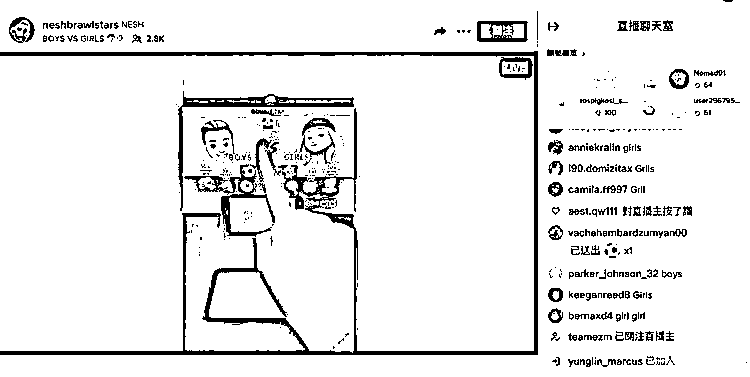
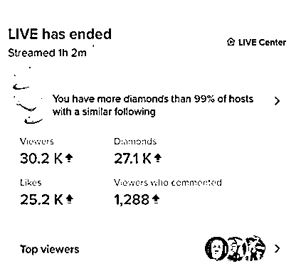

# 做 Tiktok 找准自身优势切入，睡播也能一小时变现 200 美金

> 原文：[`www.yuque.com/for_lazy/thfiu8/onbwqqqrdau6crf7`](https://www.yuque.com/for_lazy/thfiu8/onbwqqqrdau6crf7)

<ne-h2 id="4d4cf65d" data-lake-id="4d4cf65d"><ne-heading-ext><ne-heading-anchor></ne-heading-anchor><ne-heading-fold></ne-heading-fold></ne-heading-ext><ne-heading-content><ne-text id="uf1bb03b6">(34 赞)做 Tiktok 找准自身优势切入，睡播也能一小时变现 200 美金</ne-text></ne-heading-content></ne-h2> <ne-p id="udf869e97" data-lake-id="udf869e97"><ne-text id="uaf1da6f2">作者： Fredrich</ne-text></ne-p> <ne-p id="u9c88dd49" data-lake-id="u9c88dd49"><ne-text id="u99e3a3de">日期：2023-07-28</ne-text></ne-p> <ne-p id="u461973f1" data-lake-id="u461973f1"><ne-text id="u0c66cda9">大家发现了没？最近 TikTok 直播很火，像在国内很普遍的男女刷礼物 PK、刮刮乐抽奖、点赞关注打赏，在 TikTok 上很轻松就能涨粉变现。</ne-text></ne-p> <ne-p id="u82050614" data-lake-id="u82050614"><ne-card data-card-name="image" data-card-type="inline" id="NVtI2" data-event-boundary="card"></ne-card></ne-p> <ne-p id="ueabe5fd0" data-lake-id="ueabe5fd0"><ne-card data-card-name="image" data-card-type="inline" id="MVnKJ" data-event-boundary="card"></ne-card></ne-p> <ne-p id="u0ec2eb3e" data-lake-id="u0ec2eb3e"><ne-text id="uf8a774e9">相信不少人都发现这个商机了，但却一直犹豫没有去做。要么是不知道有什么好的变现方式、要么觉得自己没有资源，没有优势。</ne-text></ne-p> <ne-p id="u06b5ba83" data-lake-id="u06b5ba83"><ne-text id="ud8ced417">今天，我以自己做睡播为例子，和大家分享 TikTok 的现状和商机，以及新人怎么入局去做娱乐直播，希望通过我的这篇复盘，能给所有想做和在做跨境出海业务的圈友们一点启发。</ne-text></ne-p> <ne-p id="u9ceeb846" data-lake-id="u9ceeb846"><ne-text id="u3a5c61fe">大家好，我是 Fredrich 杨永，从 2021 年初开始从 Tiktok 入局 C 端跨境业务，目前在做的业务是 Tiktok 娱乐直播、私域与独立站。</ne-text></ne-p> <ne-p id="ua1197a28" data-lake-id="ua1197a28"><ne-text id="ud249d676">作为一名前 2B 外贸业务和直播产品互联网产品经理，在做 Tiktok 的内容创作和变现上也曾摇摆不定，以及碰个头破血流。</ne-text></ne-p> <ne-p id="u1710fe4a" data-lake-id="u1710fe4a"><ne-text id="u7c16d5b8">本篇复盘参照往期的笔记，有兴趣的圈友，也可以瞄一眼：</ne-text>[<ne-text id="u50e4aa34">《睡一觉 1500 美金，TikTok 还只是一门流量生意》</ne-text>](https://mp.weixin.qq.com/s?__biz=Mzg5ODg5NjgxMA==&mid=2247483702&idx=1&sn=9f40c418052e9f68f623b8e8b37cd435&chksm=c05ac7f3f72d4ee5fe38501230f7c770ed5d37a3df45ecb289efc09d499437d9f882914e14cd&token=1362272325&lang=zh_CN#rd)<ne-text id="uada702e4">和</ne-text>[<ne-text id="udbd5d460">《做 TikTok 就是开店卖货吗？》</ne-text>](https://mp.weixin.qq.com/s?__biz=Mzg5ODg5NjgxMA==&mid=2247483789&idx=1&sn=05d06464fcd8d1096288d5ba2e0b46a8&chksm=c05ac748f72d4e5e31809649ce0592f3709507b99b0526c8966efb07eff72217159f833c9b0a&token=1362272325&lang=zh_CN#rd)</ne-p> <ne-p id="uc1b3ea33" data-lake-id="uc1b3ea33"><ne-text id="u6766777e">开篇前，我想说的是：一切公域业务的开端都是流量，转化流程越短，拿到结果越快。</ne-text></ne-p> <ne-p id="u2876daad" data-lake-id="u2876daad"><ne-text id="ud995cbff">这篇内容以我做睡播获取正向反馈作为一个引子，以及我做 6 年直播产品经理和 2 年多 TikTok 的个人经验教训总结，给大家呈现目前内容出海的一角。</ne-text></ne-p> <ne-p id="u196564fb" data-lake-id="u196564fb"><ne-text id="u4850a971">文章的内容路径是从睡播到介绍 TikTok 秀场直播，以及在 TikTok 上玩赚流量的一些基操，给大家以睡播为例介绍秀场直播是怎么做的。</ne-text></ne-p> <ne-p id="ue4af98a2" data-lake-id="ue4af98a2"><ne-text id="ua47fa8d4">以及无公会的情况下，如何组织主播获取秀场打赏的收益，再到从秀场获取到粉丝的情况下，如何去做二次的私域转化或者测品，从而带来新业务线的 MVP 探索。</ne-text></ne-p> <ne-p id="u2537a97c" data-lake-id="u2537a97c"><ne-text id="u4e9cb794">最后是给新人入局 TikTok 和秀场直播的个人看法。</ne-text></ne-p> <ne-p id="u3bfa694e" data-lake-id="u3bfa694e"><ne-text id="ub35ce60e">所以本篇适合以下圈友阅读：</ne-text></ne-p> <ne-p id="u94bb967d" data-lake-id="u94bb967d"><ne-text id="u542ed00f">1、想要或刚入局 TikTok 的圈友；</ne-text></ne-p> <ne-p id="u9a1f142d" data-lake-id="u9a1f142d"><ne-text id="ud779743b">2、狂啃 TikTok 电商 SOP 又没有结果的圈友；</ne-text></ne-p> <ne-p id="uf21e514b" data-lake-id="uf21e514b"><ne-text id="ue309a339">3、玩内容或者秀场直播想要出海的圈友；</ne-text></ne-p> <ne-p id="u8be08234" data-lake-id="u8be08234"><ne-text id="ue130609c">想做平台电商的圈友请直接绕道。目录如下：</ne-text></ne-p> <ne-p id="u34cecf74" data-lake-id="u34cecf74"><ne-text id="uc9d03bdd">一、一场睡播带来的业务新路线</ne-text></ne-p> <ne-p id="u425ac6e2" data-lake-id="u425ac6e2"><ne-text id="u5049d7d3">二、Tiktok 的现状与机遇：区别于所有做电商的大佬的玩法，我将主要围绕流量侧直接变现为主来做介绍</ne-text></ne-p> <ne-p id="u2bbbddc5" data-lake-id="u2bbbddc5"><ne-text id="u914a7dc8">三、Tiktok 娱乐直播怎么做</ne-text></ne-p> <ne-p id="u0497886e" data-lake-id="u0497886e"><ne-text id="u9aac592b">四、没有公会怎么做 Tiktok 直播</ne-text></ne-p> <ne-p id="uf4acf6fb" data-lake-id="uf4acf6fb"><ne-text id="u450796ec">五、野生公会如何运营</ne-text></ne-p> <ne-p id="u67368e93" data-lake-id="u67368e93"><ne-text id="u741a2236">六、 如何放大直播收益</ne-text></ne-p> <ne-p id="u688644be" data-lake-id="u688644be"><ne-text id="u070fe9a2">七、娱乐直播如何与带货结合</ne-text></ne-p> <ne-p id="u6ed0685b" data-lake-id="u6ed0685b"><ne-text id="u30227f07">八、如何开发新娱乐直播项目</ne-text></ne-p> <ne-p id="u511c8bf6" data-lake-id="u511c8bf6"><ne-text id="uf77c59a8">九、新人入门门槛和建议</ne-text></ne-p> <ne-h1 id="38650ba9" data-lake-id="38650ba9"><ne-heading-ext><ne-heading-anchor></ne-heading-anchor><ne-heading-fold></ne-heading-fold></ne-heading-ext><ne-heading-content><ne-text id="ue8c4ef34" ne-bold="true">一、一场睡播带来的业务新路线</ne-text></ne-heading-content></ne-h1> <ne-p id="ub4a2ce32" data-lake-id="ub4a2ce32"><ne-text id="u5daff5db">我是 08 年从电网海外业务、2B 外贸转到互联网直播产品开发，再到自己下场做 TikTok 的。</ne-text></ne-p> <ne-p id="u2a219d95" data-lake-id="u2a219d95"><ne-text id="u75e4673a">21 年 3 月因为一场事故开始做 TikTok，入局是从 Tiktok 短视频开始的。路径是这样的：</ne-text></ne-p> <ne-p id="ub34e5fc0" data-lake-id="ub34e5fc0"><ne-text id="u96c68a53" ne-bold="true">（1）短视频 + 独立站带货：</ne-text></ne-p> <ne-p id="u356b0a0a" data-lake-id="u356b0a0a"><ne-text id="u9ca2cf31">21 年 5 月至 22 年 2 月，从短视频矩阵开始，带独立站，独立站是 wordpress + woocommerce，一件代发 Aliexpress。</ne-text></ne-p> <ne-p id="u8ea11fa2" data-lake-id="u8ea11fa2"><ne-text id="u70e1d8d7">这段时间流量大爆发，最大的问题是转化率低，也就是老外看了视频不买货，主打大力出奇迹。中间跟很多老师学习了视频剪辑，各种黑科技，某音实时搬运等等。</ne-text></ne-p> <ne-p id="u0b593c3d" data-lake-id="u0b593c3d"><ne-text id="u0800377d" ne-bold="true">（2）短视频/直播  + 独立站/英国小店带货</ne-text></ne-p> <ne-p id="u63f2a48c" data-lake-id="u63f2a48c"><ne-text id="u1c9733c0">22 年 2 月，下了 4 个 tt 店铺后，除了原来的短视频+独立站带货外，自己尝试直播，可能是运气好，自己跑出来一个，于是投入，搞直播间，找老外做直播，一小时 400 块，直播带货这个项目，4 个月总共赚了 1000 多人民币，退出及时止损。</ne-text></ne-p> <ne-p id="u4b9ee5f3" data-lake-id="u4b9ee5f3"><ne-text id="u66acddeb">当然，这跟个人以及团队的能力有关系，毕竟还是有团队跑出来成绩。</ne-text></ne-p> <ne-p id="u628a357c" data-lake-id="u628a357c"><ne-text id="u8adef5ab" ne-bold="true">（3）娱乐直播 + 私域 + 独立站带货</ne-text></ne-p> <ne-p id="ub06ab64e" data-lake-id="ub06ab64e"><ne-text id="ucdf17e6a">入局娱乐直播是从 5 月，第一个项目是照片墙的互动游戏直播项目，然后是跟着圈友做的点大屏项目。</ne-text></ne-p> <ne-p id="u344bafe8" data-lake-id="u344bafe8"><ne-card data-card-name="image" data-card-type="inline" id="nuQGC" data-event-boundary="card"></ne-card></ne-p> <ne-p id="u0b3bac65" data-lake-id="u0b3bac65"><ne-text id="u5b69127e">【照片墙互动游戏，逻辑是谁点赞或者送礼物就上墙，有各种不同形状的照片墙】</ne-text></ne-p> <ne-p id="u993c4244" data-lake-id="u993c4244"><ne-card data-card-name="image" data-card-type="inline" id="kKUK2" data-event-boundary="card"></ne-card></ne-p> <ne-p id="ufe5306c5" data-lake-id="ufe5306c5"><ne-text id="ueb1980e1">【点大屏项目，逻辑是谁送礼或者谁活跃就点谁的个人空间展示他的视频内容，让别人去关注他】</ne-text></ne-p> <ne-p id="u1a86a50f" data-lake-id="u1a86a50f"><ne-text id="u31465039">虽然在开始的两个项目上没赚到多少钱，但是数据反馈还是比较好的，于是找回了当年做秀场直播策略开发的感觉，开始了两个方向，一个是大量上改抖音互动小游戏上到 TT 上，二是开发了第一个秀场项目，就是睡播项目。</ne-text></ne-p> <ne-p id="ua8073518" data-lake-id="ua8073518"><ne-text id="u2aa438f8">互动小游戏的逻辑大家都懂，就是用户只要有互动，就能参加到游戏中去，送礼物越多，参与感越强。电脑上跑程序，手机对着电脑屏幕直播，纯无人，24 小时从$20-500 刀不等，游戏越新，参与感越强，收入越高。</ne-text></ne-p> <ne-p id="u6e35429d" data-lake-id="u6e35429d"><ne-card data-card-name="image" data-card-type="inline" id="MmZRF" data-event-boundary="card"></ne-card></ne-p> <ne-p id="u51d4518b" data-lake-id="u51d4518b"><ne-text id="uc6c53441">睡播的逻辑是，主播在直播间睡觉，有人送礼，就播放音、视频和各种烟雾灯光效果，让主播没法睡，或者主播各种搞怪、跳舞，扮演被吵醒后的状态，让用户感觉非常爽。</ne-text></ne-p> <ne-p id="ub1b0f583" data-lake-id="ub1b0f583"><ne-text id="u4b42db63">我们的策略很简单，矩阵直播间，有流量就播，没流量就下 10 分钟再播，薅 tt 急速流，因为直播形式新奇，大概率拉得起来。</ne-text></ne-p> <ne-p id="u501c7883" data-lake-id="u501c7883"><ne-text id="u7d0f94a4">最高一小时 200 多美金（抛去平台抽佣的 50%后），一般一小时在 130 美金左右，一天 1000 多美金。这还是一般的直播间，澳大利亚的 Jakey 一周能薅 3-5 万美金。</ne-text></ne-p> <ne-p id="u84c43360" data-lake-id="u84c43360"><ne-text id="uaa948cab">成本是多少呢，小游戏是无人的，基于程序自动互动的，一个直播间的成本是一台电脑和一台手机，额外的成本是买代码和找程序员改代码的费用。</ne-text></ne-p> <ne-p id="u7396d5d6" data-lake-id="u7396d5d6"><ne-text id="ub8990f30">睡播的成本是同样需要一台电脑和一台手机，一个是人就行的主播，40 人民币每小时，直播间内配置 500 块搞定。所有的电脑都是租的，人人租 150 一个月，加一个互动程序。于是，之前做直播带货瞬间就不香了，遂彻底抛弃了直播带货。</ne-text></ne-p> <ne-p id="u5ab05003" data-lake-id="u5ab05003"><ne-text id="uc37a487b">在这段时间的项目开发过程中，我们的策略是要么是直播没有真人，要么就是主播只是个活人能动就行，一切互动都交给程序，把直播间成本降到最低，我们的睡播主播是 40 块人民币一小时。</ne-text></ne-p> <ne-p id="ub76ddf9e" data-lake-id="ub76ddf9e"><ne-text id="u4e88d080">后来我们自播开发的其他的自播项目都是沿用这个模式。</ne-text></ne-p> <ne-p id="ub0929ad3" data-lake-id="ub0929ad3"><ne-text id="u4119d34e">私域是我们放弃直播带货后的另外一条聊单业务，原本带的是成人用品，例如等身硅胶 WW，1000-3000 刀的价格，1000 多块的成本，2000 块的物流。</ne-text></ne-p> <ne-p id="u45e5a2b1" data-lake-id="u45e5a2b1"><ne-text id="u06ef207e">随着娱乐直播间形式的增加，粉丝进我们福利群的人增加，直播场景中出现的物品越来越多，我们发现，直播间里越来越多人在问场景下的物品哪里买的。</ne-text></ne-p> <ne-p id="u3abd4d3c" data-lake-id="u3abd4d3c"><ne-text id="u0e031502">我们就把粉丝拉进群里，在美女主播的粉丝群里，WW 的转化效果非常好，然后逐渐增加了以主播形象定制抱枕、小薄毯、手机壳、耳机等等。</ne-text></ne-p> <ne-p id="uea139544" data-lake-id="uea139544"><ne-text id="u8cd38566">最后我们发现，同样的品，放在独立站中，用户也非常喜欢拿自己喜欢的图来定制，于是我们就又好好去选品，做单品独立站，顺便在谷歌 SEO 上做了一些摸索。</ne-text></ne-p> <ne-p id="u4f5af35f" data-lake-id="u4f5af35f"><ne-text id="u27eaffe9">到现在为止，我们形成了以扶持合作的达人直播间为主的矩阵直播，粉丝进福利群进行二次开发，带动定制产品的这一条线，测出来好的品，会拿去做单品独立站。就形成了矩阵直播间+矩阵独立站的形式。</ne-text></ne-p> <ne-p id="u52f7cf88" data-lake-id="u52f7cf88"><ne-text id="u5fba199b">这是之前的直播截图。</ne-text></ne-p> <ne-p id="uea9221a2" data-lake-id="uea9221a2"><ne-card data-card-name="image" data-card-type="inline" id="YR2UT" data-event-boundary="card"></ne-card></ne-p> <ne-p id="u07b7db0b" data-lake-id="u07b7db0b"><ne-card data-card-name="image" data-card-type="inline" id="rFvEt" data-event-boundary="card"></ne-card></ne-p> <ne-p id="u09058ba4" data-lake-id="u09058ba4"><ne-card data-card-name="image" data-card-type="inline" id="BOQlC" data-event-boundary="card"></ne-card></ne-p> <ne-h1 id="a73e280e" data-lake-id="a73e280e"><ne-heading-ext><ne-heading-anchor></ne-heading-anchor><ne-heading-fold></ne-heading-fold></ne-heading-ext><ne-heading-content><ne-text id="u3ab223e3" ne-bold="true">二、TikTok 的现状与机遇</ne-text></ne-heading-content></ne-h1> <ne-p id="u7b7a89f8" data-lake-id="u7b7a89f8"><ne-text id="u07d36026">TT 上确实像所有人说的一样，有很多的机会，但并不是每个人都能抓得住。</ne-text></ne-p> <ne-p id="u865d3be2" data-lake-id="u865d3be2"><ne-text id="u24094c20">从 21 年到现在，我见过太多人的进来又离开，包括我自己，在 22 年没有做店群、没有做无人直播、没有撸商家仅退款的货，这三条，任何一条，认真做都是千万利润。</ne-text></ne-p> <ne-p id="uc1277b19" data-lake-id="uc1277b19"><ne-text id="u40f1dd04">像无人直播，22 年 2 月，拿 5 台无人直播手机在跑，但是担心连累别人的 MCN 被封，就悄悄不干了。6 月拿过 20 个本土店测试，</ne-text></ne-p> <ne-p id="u5080f518" data-lake-id="u5080f518"><ne-text id="u7cbe06e9">因为忙娱乐直播，也没好好跑。机会很多，但你不一定抓得住。</ne-text></ne-p> <ne-p id="u32faa291" data-lake-id="u32faa291"><ne-text id="ua6aa54ef" ne-bold="true">（1）TT 大现状</ne-text></ne-p> <ne-p id="u082f5833" data-lake-id="u082f5833"><ne-text id="ud0d55f90">1、从流量上来看，TT 目前的状态大概 15 亿月活，用户量最大的国家/地区是美国、东南亚和南美，这也是 TT 重点发展的国家/区域。</ne-text></ne-p> <ne-p id="ucccf768e" data-lake-id="ucccf768e"><ne-text id="u34ae5a93">结合商业化角度来说，印尼是 TT 最早电商本土化也是做的最好的国家，跟抖音在国内的电商布局非常相似，商城、团长、MCN、公会都上了，可以说是 TT 在海外电商最成功的案例。</ne-text></ne-p> <ne-p id="uc3ec07ce" data-lake-id="uc3ec07ce"><ne-text id="u961f0d5f">其次是一衣带水的东南亚其他国家，美国因为 Politics 的因素，TT 非常谨慎，也没放开手脚去做，是个大潜力股，南美是个大花骨朵，一点都没开发。</ne-text></ne-p> <ne-p id="u0557d345" data-lake-id="u0557d345"><ne-card data-card-name="image" data-card-type="inline" id="CdYbt" data-event-boundary="card"></ne-card></ne-p> <ne-p id="u057f687f" data-lake-id="u057f687f"><ne-text id="ua8934956">2、从 TT 目前的推动来看，电商仍是 TT 商业化的重锤，之前的商家店铺模式除东南亚外，几乎全抛弃，目前重点是全托管，简单说，就是商家把东西给 TT，TT 自己在平台里面开个商城自己买。</ne-text></ne-p> <ne-p id="u326da7d1" data-lake-id="u326da7d1"><ne-text id="u79a99b1c">按照 TT 的布局，推动是商家供货给 TT 自营商城，然后 TT 分润给达人，让达人带货，似乎是一个比较完美的闭环。</ne-text></ne-p> <ne-p id="ue3820448" data-lake-id="ue3820448"><ne-text id="u15827283">但仔细一想，就非常困难。</ne-text></ne-p> <ne-p id="u83f20158" data-lake-id="u83f20158"><ne-text id="u910d8322">首先，TT 的用户电商教育没做好，也就是说购物属性不够；</ne-text></ne-p> <ne-p id="u6a8f90fe" data-lake-id="u6a8f90fe"><ne-text id="u102c643b">第二，TT 的电商调性对于用户来说就是一个达人卖廉价商品的地方，想要改变这两种属性不容易。</ne-text></ne-p> <ne-p id="u677f54cd" data-lake-id="u677f54cd"><ne-text id="uf80401fe">第三，上面说的完美闭环，是在有充分利润的前提下，利润要么压榨商家和达人，要么提高商品溢价，似乎任何一个 TT 现在都搞不定。更何况，还有 Temu，Shein，aliexpress 在追。</ne-text></ne-p> <ne-p id="uf47accde" data-lake-id="uf47accde"><ne-text id="u935847d5">作为一个小玩家，我认为，平台电商 TT 自己都没搞明白，商家想要乱中取胜等于火中取栗，想想，这个商业模式都难。</ne-text></ne-p> <ne-p id="u0df44f01" data-lake-id="u0df44f01"><ne-text id="u1f48a9c4">大玩家看不上这三瓜两枣，小玩家根据就没资源去拼。达人想去喝口汤，得看平台补贴到什么时候，跟基金没差，当然了，做个兼职，或者短时间没有别的项目可以上，可以去做一做达人带货。</ne-text></ne-p> <ne-p id="udf7d2208" data-lake-id="udf7d2208"><ne-text id="u0f79fe17" ne-bold="true">（2）TT 的机遇</ne-text></ne-p> <ne-p id="ud8cb7b16" data-lake-id="ud8cb7b16"><ne-text id="u27266f51">TT 的机遇在哪里，我们得看一下这个平台是什么样的平台。</ne-text></ne-p> <ne-p id="u925bb1e7" data-lake-id="u925bb1e7"><ne-text id="uf800be5c">像我之前在文章里提到，TT 只是一门流量生意，而且是娱乐流量，TT 的本质就是以视频和直播展现个人特性，也就是好玩新奇，从而产生了无数的内容，吸引着无数人欲罢不能。</ne-text></ne-p> <ne-p id="u1e73841d" data-lake-id="u1e73841d"><ne-text id="uf566099f">也就是，有内容的给内容，没内容的捧个场。就形成了流量。</ne-text></ne-p> <ne-p id="u71ed5a87" data-lake-id="u71ed5a87"><ne-text id="ud7389d67">我们很多人都愿意拿抖音来类比，认为所有在抖音上的业务都可以在 TT 上复现。</ne-text></ne-p> <ne-p id="u25f1ace5" data-lake-id="u25f1ace5"><ne-text id="u19f7419b">这句话，只对了一半。所有在抖音上衍生出来的带货需求都是在用户教育和特定前置条件下作用的结果。拿 TT 来类比抖音，并不合适。</ne-text></ne-p> <ne-p id="u461dc6b8" data-lake-id="u461dc6b8"><ne-text id="u18627e67">一定要说对这句话，那应该是，所有在抖音上跟流量相关的业务，都可以在 TT 上复现。电商理论上来说，是最不合适拿来玩 TT 流量的，因为转化长，供应链长，售后长，账期长，平台履约成本高。</ne-text></ne-p> <ne-p id="u2c894dc0" data-lake-id="u2c894dc0"><ne-text id="u203e7626">既然不带货，只玩流量，就有无限可能。</ne-text></ne-p> <ne-p id="u104696ea" data-lake-id="u104696ea"><ne-text id="u283503ea">1、</ne-text><ne-text id="u0bbbe469" ne-bold="true">秀场娱乐直播</ne-text></ne-p> <ne-p id="u7c9819dd" data-lake-id="u7c9819dd"><ne-text id="u114810f7">直接消费流量，赚老铁打赏。</ne-text></ne-p> <ne-p id="u75a22c1a" data-lake-id="u75a22c1a"><ne-text id="u30982c04">我们不妨看一下欢聚、赤子城、雅乐的社交娱乐，出海这么多年，秀场仍然火得一塌糊涂。</ne-text></ne-p> <ne-p id="u9bcfd97b" data-lake-id="u9bcfd97b"><ne-text id="u3dfce880">现在 TT 直播针对个人，只需要千粉就可以直播，没有实名，好好做，就做 IP，短期项目的话，账号周抛月抛都可以，矩阵上，真机真人都没问题。</ne-text></ne-p> <ne-p id="u304b58f0" data-lake-id="u304b58f0"><ne-text id="ub95cd017">如果个人有能力，可以签个本土发展的公会，给资源给培养，是可以的。如果没有，就个人直播，找项目，项目从哪来，抖音快手 BIGO，MICO 大把的项目。如果你会点技术，加到直播间里，带来额外的互动效果，那更棒了。</ne-text></ne-p> <ne-p id="u90946500" data-lake-id="u90946500"><ne-text id="u7ae6610e">2、</ne-text><ne-text id="u3ca42a90" ne-bold="true">游戏</ne-text></ne-p> <ne-p id="uefc98bac" data-lake-id="uefc98bac"><ne-text id="ua8a1b86c">一种是做游戏直播，有能力的话，小游戏互动游戏做无人。没有开发能力，露脸打游戏，做半无人，游戏集中在情节上，对主播要求并不多，会一点外语就可以，更何况还有新加坡马来弯弯直接说汉语。</ne-text></ne-p> <ne-p id="uf529c21b" data-lake-id="uf529c21b"><ne-text id="ub5b56429">第二种是做免费游戏网站，利用短视频或者直播，引用户进来免费玩游戏，帮你看广告。同理的项目，还有爽文网站。</ne-text></ne-p> <ne-p id="u838e5a1d" data-lake-id="u838e5a1d"><ne-text id="ue18c3acb">3、</ne-text><ne-text id="u33892161" ne-bold="true">独立站耗流量</ne-text></ne-p> <ne-p id="uea76756e" data-lake-id="uea76756e"><ne-text id="u73df502b">独立站可以完美避开平台的电商定位和调性，非常适合除东南亚外的用户，还不用平台的履约限制。</ne-text></ne-p> <ne-p id="ub6e19aca" data-lake-id="ub6e19aca"><ne-text id="uac59b6ad">一种方法是矩阵内容薅免费流量，无论是短视频矩阵还是无人直播矩阵都可以（无人直播还能生存吗？肯定可以）</ne-text></ne-p> <ne-p id="u1a93dab2" data-lake-id="u1a93dab2"><ne-text id="ufa5c0027">第二种是广告投放，做个好一点广告短视频内容，投 TT 广告，引流转化。</ne-text></ne-p> <ne-p id="u3fe387a9" data-lake-id="u3fe387a9"><ne-text id="u803c8d67">生财圈内有不少优秀的投手，大家可以去搜一个往期帖子。</ne-text></ne-p> <ne-p id="u548ad6fd" data-lake-id="u548ad6fd"><ne-text id="u9b1df04c">如果说矩阵流量是大力出奇迹，那么广告投放就是技术流，靠本事赚钱。可惜我不会。</ne-text></ne-p> <ne-p id="ua46d51bd" data-lake-id="ua46d51bd"><ne-text id="u8fca5aee">4、</ne-text><ne-text id="u8c2eb048" ne-bold="true">达人带货</ne-text></ne-p> <ne-p id="ua08f3504" data-lake-id="ua08f3504"><ne-text id="ue172852b">虽然我不看好目前的达人带货，但是这个确实是有手就行，非常适合从抖音平移过去的项目。</ne-text></ne-p> <ne-p id="u99f82d5b" data-lake-id="u99f82d5b"><ne-text id="u6819e78d">不过鉴于现在平台策略调整，东南亚汤太少了，新的 TT 自营商城达人带货平台会推出来并给与大量补贴，在 TT 没有更好的电商策略的情况下，给的补贴也可以给入门玩家进来玩一玩。</ne-text></ne-p> <ne-p id="u6e48af59" data-lake-id="u6e48af59"><ne-text id="uf02cbd6c">国内各个社交平台上，鼓吹的达人带货大可不必去看，生财圈有很多 MCN 可以免费挂。如果不想挂 MCN，东南亚各个国家都有虚拟账户回得来账。</ne-text></ne-p> <ne-p id="u5063b2ca" data-lake-id="u5063b2ca"><ne-text id="u84e15f6a">其次是，给达人提供收款的 MCN，鉴于达人赚不到钱，MCN 还要履约，现在不太推荐，想要布局的话，可以尝试拿到新出全托管商城的国家的 MCN，比如沙特、英国。</ne-text></ne-p> <ne-p id="u2e017b3c" data-lake-id="u2e017b3c"><ne-text id="ude58bfbf">5、</ne-text><ne-text id="u918630a2" ne-bold="true">做公会</ne-text></ne-p> <ne-p id="uaeec07f3" data-lake-id="uaeec07f3"><ne-text id="ud58f1229">官方跨境公会很难搞，平台不开放也不公开信息，这个策略不知道从何考虑。</ne-text></ne-p> <ne-p id="u2f2a3f8f" data-lake-id="u2f2a3f8f"><ne-text id="udc9540d3">不过现在公会拿不到，买的话很贵。有资源又有志向在本土国家发展的话，本土公会资质相对来说就非常容易了，推荐去搞。</ne-text></ne-p> <ne-p id="ufbd9954a" data-lake-id="ufbd9954a"><ne-text id="uaa001373">对于在国内想入局玩一玩的话，可以搞一个野生的“公会”，这也不叫公会，就是你搞一堆人来自播，管理好这些主播，获得的打赏和主播分成就行。</ne-text></ne-p> <ne-p id="u738fbc88" data-lake-id="u738fbc88"><ne-text id="u8af4c416">可玩，能玩多大看自己选的项目和策略。</ne-text></ne-p> <ne-p id="ud4bf86c8" data-lake-id="ud4bf86c8"><ne-text id="u46dc7bca">所以推荐本土公会。</ne-text></ne-p> <ne-p id="u3de6e8e7" data-lake-id="u3de6e8e7"><ne-text id="u0f589a6f">6、</ne-text><ne-text id="u5f472cd4" ne-bold="true">本土电商</ne-text></ne-p> <ne-p id="u19badb49" data-lake-id="u19badb49"><ne-text id="u0111556f">TT 的本土店铺还是可以做的，未来 TT 的电商策略会立足本土，跨境基本要自己干了。</ne-text></ne-p> <ne-p id="u8b9beedb" data-lake-id="u8b9beedb"><ne-text id="ub8817f0c">毕竟要去本地，前提是搞定供应链，如果搞不定供应链的话，是不是可以打一下全托管平台的商品的注意呢？</ne-text></ne-p> <ne-p id="u53872980" data-lake-id="u53872980"><ne-text id="u82fc854e">7、</ne-text><ne-text id="ue8c2b987" ne-bold="true">培训</ne-text></ne-p> <ne-p id="uece0d4bb" data-lake-id="uece0d4bb"><ne-text id="u5b4196f7">要说赚钱，培训舍我其谁当然该排第一，但是为什么我排最后，是因为现在大部分人都赚不到钱，培训也不好过，毕竟但凡要深耕，就要自己跑出来结果。现在培训做得好，要么有项目在跑，要么就是骗。</ne-text></ne-p> <ne-p id="u3c0a40da" data-lake-id="u3c0a40da"><ne-text id="u823cafa0">8、</ne-text><ne-text id="ua7ac11ad" ne-bold="true">工具</ne-text></ne-p>