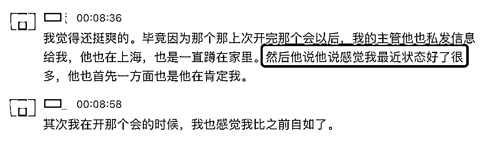
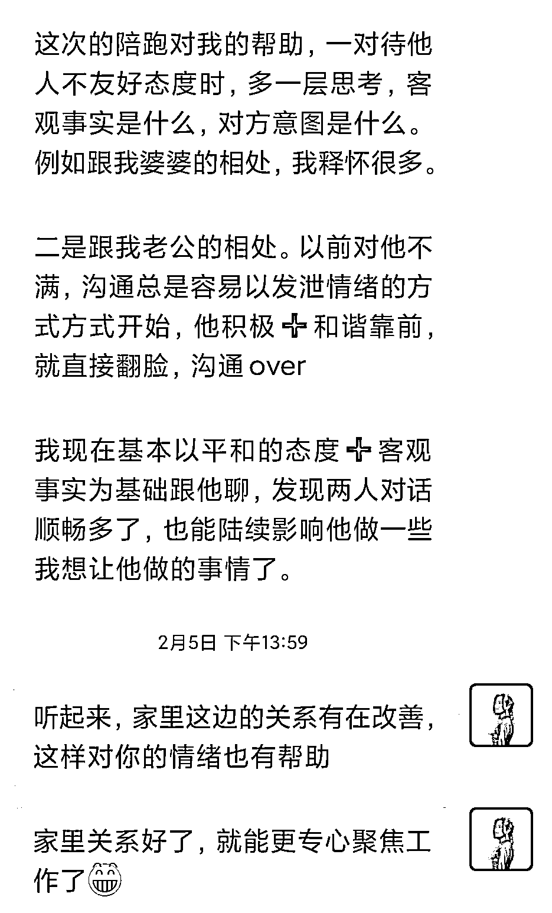
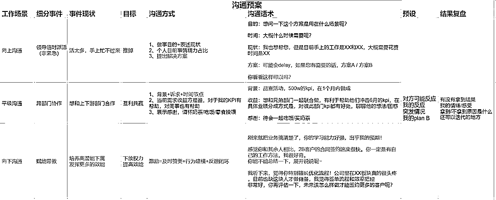

# 对自己不满意，该如何接纳自我，拥有高能量的状态？

> 原文：[`www.yuque.com/for_lazy/thfiu8/pcubt54h1l33oglp`](https://www.yuque.com/for_lazy/thfiu8/pcubt54h1l33oglp)

## (80 赞)对自己不满意，该如何接纳自我，拥有高能量的状态？ 

作者： 叶叶 _ 优势教练 

日期：2023-07-21 

大多数人的不快乐，都可以用一个点来总结——那就是对自己不满意，觉得自己不够好。 

对于创业者来说，这点表现得会更为明显。 

因为总是会看到身边的谁谁营收又几万了、群发售 GMV 又过多少万了、小红书带货卖了多少万了，而看自己的业务到处都是问题，感觉自己这个也不行，那个也不行，就很容易 emo、抑郁。 

作为个人优势挖掘大航海的优势教练，我想聊一个特别有代表性的话题： 

不喜欢自己的时候，怎么接纳自己，把自身优势才干发挥出来？ 

人对自己不满意，哪怕做了优势测试，都有可能还是很失落，不喜欢自己靠前的这些才干，甚至对自己的才干充满了各种嫌弃。 

当然也有人会更加认可自己，会从测试结果中看到希望和信心，如果你是这样的类型，那我要对你说声祝贺，恭喜你找到了自身优势，努力找到属于你的舞台，尽情绽放自己的才华！ 

但也许在未来的某个时刻，你可能突然会不那么喜欢自己的才干，所以今天的分享也值得你一听。 

今天我会用三个案例来帮助你，学会自我接纳，找回信心。 

## 案例一：喜欢的才干变成阻碍自己的瓶颈，应该如何接纳？ 

没有谁生来就是不喜欢自己、讨厌自己的。 

那一个人在什么时候最不喜欢自己呢？往往是在跟别人照镜子的时候，照见了自己的渺小、窘迫。 

比如你羡慕别人的执行力，他们做事果断高效，总是能达成自己的目标，对比之下，你看到了自己做事的优柔寡断、不自律。 

你羡慕那些影响力强的人，他们在人群中能得到一呼百应的关注，对比之下，你看到了自己总是像个小透明，没什么存在感； 

别人的光彩夺目和春风得意，更加映衬了你对自身现实处境的不满意，而这时候才干就完美成了背锅侠，承担了你所有的负面情绪。 

我曾经也有过相当长的一段时间，不喜欢自己的才干，但其实从一开始，我是非常喜欢这些才干的。 

我 2019 年第一次拿到自己的盖洛普报告，我很满意自己的测试结果，看到的全都是自己的优点： 

积极：对生活充满热情，内心有无穷的能量； 

行动：想到什么就立马去做的行动派； 

取悦：社交达人，擅长赢得别人的好感； 

学习：是个热爱学习的人； 

思维：有深度思考的能力，擅长发现问题本质； 

但是后面事业遭遇了一些挫折之后，我开始否定自己的才干，其中排名第一的「积极」才干被我攻击得最多。 

因为「积极」让我把很多事情的结果都想得特别美好，从不考虑风险，等到雷一个个爆出来，导致自己积累的心血和资源，慢慢分崩瓦解，才意识到「积极」才干的致命盲点——把商业想得太简单，太缺乏对人性的洞察。 

同时在 2021 年底我遇到一个特别优秀的精英朋友，跟她对比，我更加否定自己的才干。 

她是执行力+影响力，她的脑力、体力都是碾压很多普通人的那种，早上四点半就起床，做事很有方法论也很高效。 

做 IP，只花了一年多的时间，社群会员就超过一千人，营收就实现了百万，而且这一切还是建立在她有主业的情况下。 

人家只是副业做 IP，都做得比我好。跟她对比，她又放大了我对自己的不满意，我发现积极才干除了给别人带来快乐好像并没有什么用，对于搞事业，起不到什么帮助。 

为什么我就没有专注、纪律、分析这些才干？为什么我爸妈就没从小训练我具备精英的素质呢？所以是不是我注定成为不了很厉害的人？ 

后来，因为我报名了盖洛普教练高阶培训班，官方赠送了我一次 1 对 1 咨询的机会。 

我原本以为作为优势教练，我比任何人都了解自己的优势和短板，所以我并不期待咨询有什么效果，但是没想到这场教练对话，还真的让我重新点燃了对自己的信心。 

她让我讲述对自己满意的一段经历，我就说自己在被很多人没听说过盖洛普、质疑发现天赋这个太虚的情况下，从零到一坚持做了十几期发现天赋训练营，帮助了很多人发现了优势，变得更加认可自己。 

听完我的故事，她说她很佩服我，因为有很多教练都不敢全职，而我能把盖洛普作为一份全职事业去做，并且能靠盖洛普养活自己。 

她认为我能成为盖洛普领域的先行者，其实恰恰靠的就是我的积极、行动、学习、思维、理念等等这些才干。 

正是我把事情想得简单，没有考虑过失败的风险，我才会有一腔热血，去探索盖洛普产品化的可能性，让更多的普通职场人因为盖洛普而受益。 

所以我的优势特别适合去做早期的创新型产品，容易成为一个领域的开创者。 

如果换成另外一个人，很难在市场上没有同类产品可以借鉴的情况下，坚持下来。 

如果我的优势和我的那位精英朋友一样，我就不会去做盖洛普，因为很会算账的人，不会考虑商业回报率不高的事情。 

她还跟我说，我当时遇到的困境，其实不完全是才干的问题，还有一部分是我缺失某些团队管理的认知和能力。 

因为我的事业已经度过早期的蛮荒期，来到第二个阶段，需要引入擅长标准化、流程化的人才来扩大规模。 

那么我因为自身优势跟当下事业阶段的不匹配，一直去否定支撑自己走到现在的优势是不对的。 

也是这段经历，让我懂得什么是「优劣势同源」，一个人初期成就他的优势，往往也会成为他事业发展的最大瓶颈。 

所以认识到这一点之后，我就去学习很多创业相关的知识，比如公司财务管理、如何分钱、如何管理团队等等，同时我在招助理时，也会选择那些跟我优势特别互补的小伙伴。 

这样我就能继续发挥优势，去开创各种产品形式、设计社群的运营玩法，吸引更多的客户。 

每当我构建一个有意思的玩法，看到社群成员玩得很开心，我就会特别有满足感，所以我又重新爱上了自己的才干。这就是我的自我接纳过程。 

## 案例二：和谐才干突出，只能是个软柿子？ 

接下来再举一个我学员的例子小 N，她的和谐第一，最初加到我的时候，她说完全感觉不到和谐给她带来的价值，只感受到了和谐的困扰。 

因为她总是怕伤了和气，而选择妥协，不去表达自己内心真实想法，经常一个人默默内耗，生闷气。 

当内心压抑的不爽积压到一定程度，情绪会突然爆发，让别人觉得很莫名其妙，怎么一件小事发这么大的火儿？ 

有没有和谐小伙伴很有共鸣的？ 

这就是和谐才干的典型盲点，在冲突很小的时候选择隐忍，而给未来更大的冲突埋下炸弹，反而更加伤害关系。 

之所以出现这种情况，其实不是和谐才干不好，而是大多数和谐 才干非常缺乏处理冲突的能力，很多冲突通过合理地沟通，是完全可以化解掉的。 

再回到小 n 的例子上来，她的困扰是她在公司里很难推动其他部门的同事配合她工作，给其他部门提需求总是会被拒绝，她怀疑是不是自己不适合做项目管理的角色。 

这时候，我并没有马上下结论，而是先一起回顾她是怎么跟人沟通的。 

她说经常遇到的情况之一就是，给别人发消息，别人已读不回（钉钉软件可以显示），感觉自己总是不被重视。 

比如她找其他部门领导约会议，对方说明天下午有部门周会，然后她又问对方这周还有什么时候有时间？对方已读不回。 

你在工作中会遇到类似情况吗？ 

她当时苦恼地说为什么人和人之间不能团结友爱一些？ 

 

当我看到这部分的对话记录，我就发现也许不是真的别人不配合她，而是日常沟通表达上的细节出现了问题。 

我给她的建议是让别人做选择题，减轻思考压力，也就是更合适的问法是：周五上午、周五下午，你看哪个时间段更方便？ 

她很聪明，很能举一反三，后来也把这个思路应用于会议当中。 

之前她只给别人一个方案，经常会在会议中被质疑，然后就不能通过，项目进度就无法推进，但是那次她在会议当中提供了 2 个方案让大家选择，最后就能定下来一个方案。 

她的变化，领导也看在眼里，肯定她会议开得好，后面她学了更多的沟通技巧之后，感觉到她在推进项目进度上的吃力感就减少了很多。 

 

这里就是一个通过用选择题提升说服力的小小技巧。 

另外还有就是她和她老公的关系上，她以前非常不满意她老公不带娃，以前她要么选择发泄情绪，要么选择冷战，一个跑出门找个地方静下来，谁也不想理。 

后来我们也一起复盘了她和她老公的对话方式，发现她只是抱怨她老公不干什么，但很少直接表达她需要老公干什么。 

我就跟她推荐用非暴力的沟通方式，就是一定要基于你观察到的事实去表达感受，给出明确的指令，需要对方怎么做。 

她按照我说的方式去沟通后，老公也愿意在她需要学习工作的时候，帮忙带孩子而不是玩游戏了。 

 

通过这个例子就是想说明和谐才干掌握沟通技巧，你就可以成为一个有影响力的人，让别人按照你的想法去行动。 

## 案例三：执行力强悍的人，也会为人际关系困扰？ 

我前面举的都是关系建立维度下的才干，那是不是其他维度才干，比如拥有强悍执行力和战略思维的人，就很满意自己的才干嘛？ 

不一定哦，我有个学员也是好朋友预言家，她看报告后就找我吐槽： 

“关系建立这么拉垮的吗？ 

原来自己这么傲，体会不到别人的感受和情绪，是我的思维和行为模式导致的。 

影响力就点亮一个，哦，喜欢闷头做事又想被他人看见，又不喜欢对外界展示，不就是我嘛？” 

优势板块都点亮在事情维度，永远关心一件事能否做成做好。 

这种对事不对人、忽略人感受的刚硬，也让她在人际关系上踩了很多雷区: 

“在职场上，我总像个教导主任一样盯着他人的缺点和不足，害怕同事做不好事情，每次都要事无巨细过一遍细节，没法做到真正下放权力； 

在关系上，我喜欢一丝不苟的讲道理，不怎么在乎朋友的感受，让他们一度难受又无奈； 

因为「排难」过度发挥，看什么都容易看到问题，所以没法做到发自内心去赞美他人，让周围的人越亲近越受伤。 

直到去年在职场被人穿了小鞋，和领导关系上的撕扯和挤兑，一度让她产生了很深的工作倦怠感，也让她意识到，一味关注事不关注人的关系是一种损耗。 

只要处于职场的机制内，就避免和不同的人打交道，就得去学会向上/平级/向下管理，让公司的同事、老板看到你做的事。 

她利用盖洛普工具有意识的在以下两方面做努力： 

第一点：学习 34 个才干的同时积累不同优势领域小伙伴的样本 

通过长期浸泡在盖洛普语言的交流圈子里，她提升了自己对人的敏感度，也开始意识到人和人之间的性格特质、生活经历、行为模式的不同，这让她开始懂得如何根据对方的特性，让对方舒服的方式去跟对方打交道。 

第二点：分析自己的才干，找到擅长的点和可以发挥的优势 

她发现自己很擅长建模，所以她把职场常见的向上管理、平级管理、向下管理沟通场景，都整理了一套沟通预案；提前想好，避免在沟通的时候产生冲突。 

 

 

刻意练习了一段时间后，她的领导也明显感受到她的软性技能（沟通表达、跨部门协调)比刚进公司提升了很多，所以主动问她愿不愿去竞聘团队的项目经理，期望她去统筹更大的项目，带新人。 

她花了一个月时间认真准备竞聘，最后如愿竞聘成功，升职加薪 30%。 

例子都讲完了，不知道你们是什么感受？ 

是不是开始意识到才干不是决定我们困境的唯一因素，我们还是有很多机会去争取过上我们想要的人生？ 

大家刚接触到盖洛普，会觉得才干这个概念很新鲜，凡事都往才干上靠，觉得自己遇到的挫折都是因为自己没有某方面的特质，这是正常的现象，但我想提醒大家不要忽略了知识技能的重要性。 

实际上，一个人的能力是由才干、知识和技能共同组成。 

 

如果你这个阶段对自己不满意，不要怀疑自己，否定自己不够好，实际上是因为你目前的认知无法解决你遇到的问题，你没有找到正确的做事方法。 

有些人把自己失败的原因完全归结于自己的才干，这很容易，这会让你很舒适。 

如果是我，现在的我会自省：还需要补上哪些认知和技能? 

比如我之前遇到的问题，是我需要补足创业的团队管理等知识； 

和谐才干遇到的问题，是需要补足合理表达立场的能力； 

对人不敏感被人穿小鞋，是需要补足跟不同人打交道的能力。 

所以你可以想一想自己需要补上的功课是什么？把该补的功课补上之后，实力提升一轮之后，那你就会重新找到自己的自信。 

还有如果你觉得自己的才干没有别人的好时，你要考虑一下别人的专业背景是不是比你强、工作经验是不是比你要丰富、支持系统是否比你强大？ 

比如你羡慕别人的影响力，你要考虑到别人是不是销售/市场/营销/流量出身？又或者别人是否在这方面花的功夫比你多。 

人家做了几年的销售，那铁定比你更懂得如何跟不同的人打交道。 

别人的影响力，不是单纯的别人比你多了影响力才干而已。 

盖洛普才干只是你的出厂设置，靠后的才干只是说你以前没有这样的思维意识。 

当你意识到了自己思维的局限，你就可以学习相关的知识，来弥补缺失的思维方式，让自己可以灵活应对不同社会场景下对人的要求。 

盖洛普从来不是限制我们不能做什么，或者我们就做不了什么，我始终坚信，每个人都可以通过后天学习进化成综合能力更强、适应能力更强的人。 

如果你对自己不满意，也欢迎来找我聊聊，找我吸吸能量~ 

往期精华文章： 

1.《做了 27 期训练营，深度复盘我踩过的 5 个大坑！IP 新人必看的「避坑攻略」，可以少走很多弯路》 

https://t.zsxq.com/0d9YcD30W 

2.《盖洛普优势是什么？6000 字深度科普》https://wx.zsxq.com/dweb2/index/topic_detail/412584124411518 

评论区： 

小电 01 : 05   太太 808 他要太 8   他要 0808908 图太 0800 太 叶叶 _ 优势教练 : 是不是打错啦？ 倪大胖 : 精英朋友是马里奥吗 叶叶 _ 优势教练 : 哈哈哈被你猜到了 海英观心社 : 大大，我也积极第一，审慎最后，真像一匹脱了彊的野马[大哭]完全没有风险意识 叶叶 _ 优势教练 : 意识到了之后，做事之前就可以提醒自己有哪些风险没考虑到？ Amy : 第一种比较像我[快哭了] 晓岚 : 谢谢分享！叶叶真的好有正能量 

  