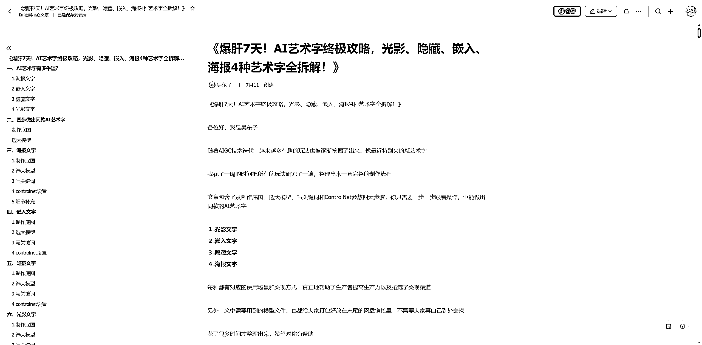
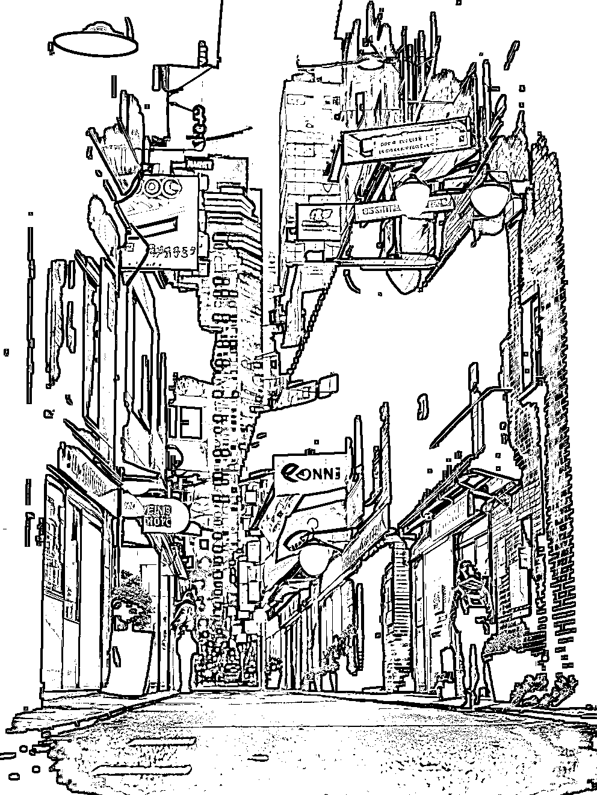

# AI 创意字终极攻略，4 种创意字全拆解

> 原文：[`www.yuque.com/for_lazy/thfiu8/lg7cidx4qqp7gssg`](https://www.yuque.com/for_lazy/thfiu8/lg7cidx4qqp7gssg)

## (精华帖)(317 赞)AI 创意字终极攻略，4 种创意字全拆解 

作者： 吴东子 

日期：2023-07-18 

《爆肝 7 天！AI 创意字终极攻略，光影、隐藏、嵌入、海报 4 种创意字全拆解！》 

各位好，我是吴东子 

随着 AIGC 技术迭代，越来越多有趣的玩法也被逐渐挖掘了出来，像最近特别火的 AI 创意字 

我花了一周的时间把所有的玩法研究了一遍，整理出来一套完整的制作流程 

文章包含了从制作底图、选大模型、写关键词和 ControlNet 参数四大步骤，你只需要一步一步跟着操作，也能做出同款的 AI 创意字 

１.光影文字 ２.嵌入文字 ３.隐藏文字 ４.海报文字 

每种都有对应的使用场景和变现方式，真正地帮助了生产者提高生产力以及拓宽了变现渠道 

另外，文中需要用到的模型文件，也都给大家打包好放在末尾的网盘链接里，不需要大家再自己到处去找 

花了很多时间才整理出来，希望对你有帮助 

[https://ry5hwpuf7b.feishu.cn/docx/VfbzdxsF6orYgSxE7tXcRWyMnBf?from=from_copylink](https://ry5hwpuf7b.feishu.cn/docx/VfbzdxsF6orYgSxE7tXcRWyMnBf?from=from_copylink) 

 

 

 

 

 

 

 

 

评论区： 

msft : 真快[得意] 陈龙 : 优秀 明月 : 🐮 浪久 : 本想学习一哈，奈何电脑不给力，运行不了 SD[晕] 忧蓝风 : 牛！ 文少 : 优秀啊 千穹 : 租！云端 浪久 : 这么说你也是走这路子？ 

 