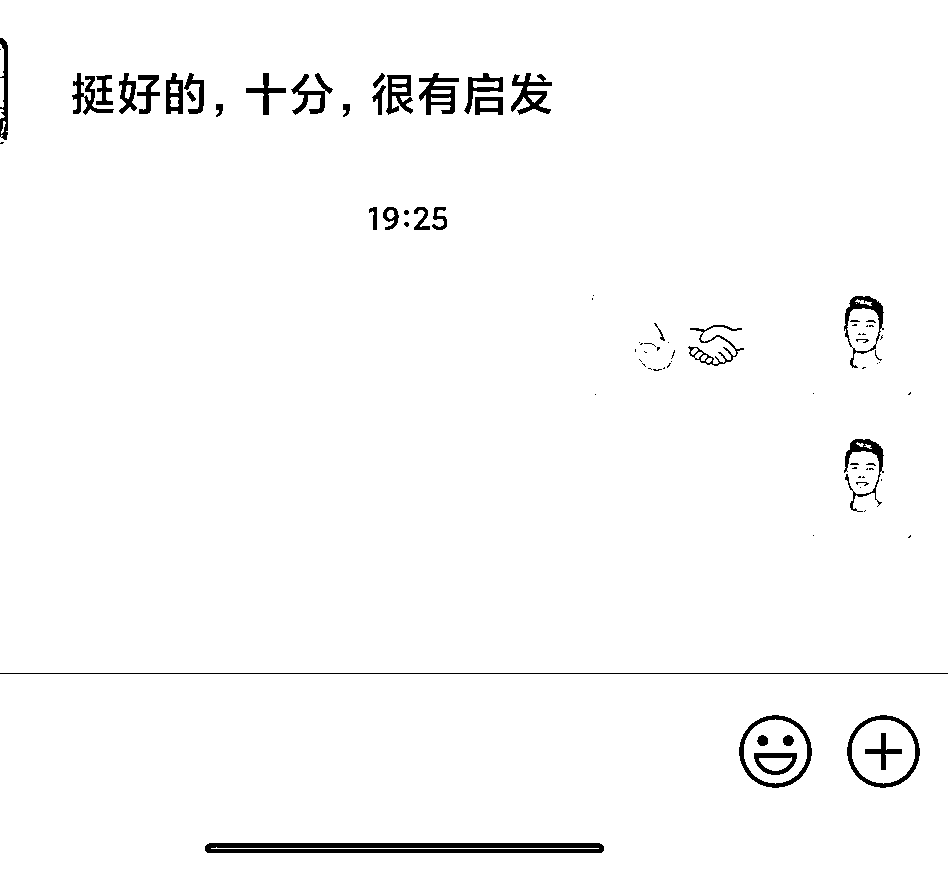
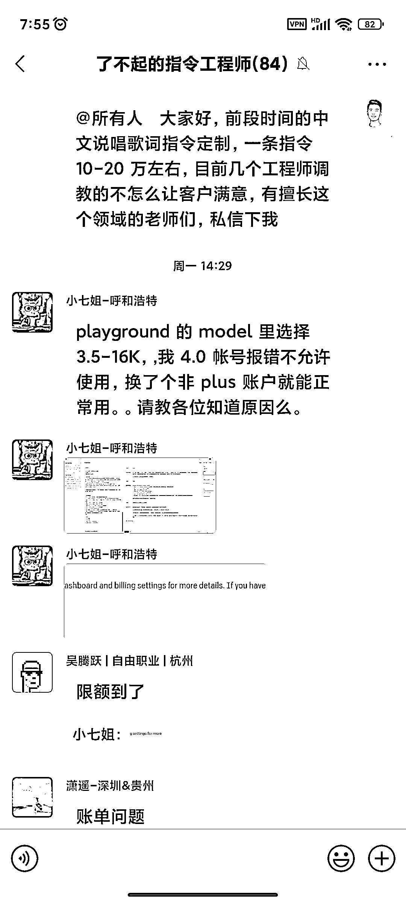

# 如何靠定制指令月入 10 万

> 原文：[`www.yuque.com/for_lazy/thfiu8/ktbga7l5w5u7sziq`](https://www.yuque.com/for_lazy/thfiu8/ktbga7l5w5u7sziq)

<ne-h2 id="b5e89c84" data-lake-id="b5e89c84"><ne-heading-ext><ne-heading-anchor></ne-heading-anchor><ne-heading-fold></ne-heading-fold></ne-heading-ext><ne-heading-content><ne-text id="u2a26c927">(精华帖)(229 赞)如何靠定制指令月入 10 万</ne-text></ne-heading-content></ne-h2> <ne-p id="ud5d8008e" data-lake-id="ud5d8008e"><ne-text id="u3b22780b">作者： 袁六伟</ne-text></ne-p> <ne-p id="uef376ea0" data-lake-id="uef376ea0"><ne-text id="u0a1c37a5">日期：2023-07-20</ne-text></ne-p> <ne-p id="u8b50fd91" data-lake-id="u8b50fd91"><ne-text id="uae7140c5">如何靠定制指令月入 10 万</ne-text></ne-p> <ne-p id="udc750960" data-lake-id="udc750960"><ne-text id="u026b4d11">这篇文章值得被收藏，值得被反复阅读 10 遍。</ne-text></ne-p> <ne-p id="udcdcdb57" data-lake-id="udcdcdb57"><ne-text id="u5df8fef9">我是 2 万＋学员的阅读教练、得到领读人、前花生日记浙江区运营总监（国内最大的社交电商公司）、国内第一批月入 10 万的指令工程师。</ne-text></ne-p> <ne-p id="u1f206b46" data-lake-id="u1f206b46"><ne-text id="uefd312f4">6 月份我接了 3 个 B 端的 AI 指令定制。</ne-text></ne-p> <ne-p id="u8c92d5b6" data-lake-id="u8c92d5b6"><ne-text id="u971f02eb">1 个是小红书文案，1 个自媒体长文文案，1 个是抖音短视频文案，都是垂直行业的，出于对客户隐私的保护，我就不说具体行业了。</ne-text></ne-p> <ne-p id="u77565e7a" data-lake-id="u77565e7a"><ne-text id="uf04e6011">目前定制市场刚打开，我就没有收太高的价格，一个 6000，一个 5000，一个 4000。</ne-text></ne-p> <ne-p id="u603ab1ea" data-lake-id="u603ab1ea"><ne-text id="u4c2be479">7 月份接到的定制单就更多了，甚至一个艺术类客户，找我们定制中文说唱的一条指令，愿意支付 10-20 万的价格。</ne-text></ne-p> <ne-p id="udec20946" data-lake-id="udec20946"><ne-text id="ubc504f3d">除了指令定制，指令训练营，指令的付费咨询，指令社群，模式我全部从 0-1 跑通了，接下来会把 SOP 分享出来，大家一起把这个市场从 1-10，10-100。</ne-text></ne-p> <ne-p id="ud96a6c7f" data-lake-id="ud96a6c7f"><ne-text id="ue6810ff9">这篇文章给你详细分享，如果你也想通过定制指令来变现，如何去做。</ne-text></ne-p> <ne-p id="u198dbbff" data-lake-id="u198dbbff"><ne-text id="u559a7d7a">一 为什么客户会定制指令？</ne-text></ne-p> <ne-p id="u272054bd" data-lake-id="u272054bd"><ne-text id="ud5c6b218">很简单，就是 GPT 在内容创作上太强大了，可以 10 倍 20 倍帮客户降低成本，提高效率。</ne-text></ne-p> <ne-p id="uf9e62be6" data-lake-id="uf9e62be6"><ne-text id="u03bb37ca">比如客户请一个高级文案，一年薪酬+各种福利待遇，最少 30 万打底，而一套文案指令，老板自己就可以把文案的活儿干了。</ne-text></ne-p> <ne-p id="u61da2c1e" data-lake-id="u61da2c1e"><ne-text id="ud0fefffd">举例说明，我给客户写了一个房琪式文案指令，1 分钟可以生成 2-3 条 85%房琪风格的旅游文案。</ne-text></ne-p> <ne-p id="udbf36937" data-lake-id="udbf36937"><ne-text id="uf1a29e9d">而老板的成本呢？只有定制花的那点钱而已，长期而言，边际成本为 0。</ne-text></ne-p> <ne-p id="u92f57292" data-lake-id="u92f57292"><ne-text id="u3353dd91">所以，你是老板的话，你要不要定制指令，答案一目了然。</ne-text></ne-p> <ne-p id="u03bc2c36" data-lake-id="u03bc2c36"><ne-text id="u248949ac">二 如何接到客户合作？</ne-text></ne-p> <ne-p id="u8c74fa80" data-lake-id="u8c74fa80"><ne-text id="ucfd0005e">为什么有人找我来定制合作，不是因为我多牛，我关注和学习 AI 也就半年多时间，你我的起点差不多。</ne-text></ne-p> <ne-p id="u09196889" data-lake-id="u09196889"><ne-text id="udbcbf93b">但是我比你多做了几个动作。</ne-text></ne-p> <ne-p id="u45c697ef" data-lake-id="u45c697ef"><ne-text id="ufa4c42f6">第一，每天 2-5 小时的学习。</ne-text></ne-p> <ne-p id="u97b7b764" data-lake-id="u97b7b764"><ne-text id="u5b72ad62">我每天花大概 2-5 个小时，看大量的各种高质量文章和论文，还有书，比如推特、即刻、公号 AI 博主，市面上的人工智能书，我都有关注和学习。</ne-text></ne-p> <ne-p id="u0cb71590" data-lake-id="u0cb71590"><ne-text id="u1d5764f8">这才让我坚定了信念，AI 大有可为，是千百年难遇的技术革命。</ne-text></ne-p> <ne-p id="uef41882e" data-lake-id="uef41882e"><ne-text id="ua0465855">而信念是最重要的，让你没有正反馈，没有结果的时候，厚积薄发。</ne-text></ne-p> <ne-p id="u68cb3a3e" data-lake-id="u68cb3a3e"><ne-text id="u194ad293">第二，不求回报的持续输出。</ne-text></ne-p> <ne-p id="u4abe8040" data-lake-id="u4abe8040"><ne-text id="u8ea9b08f">大量的学习，整理，总结，最重要的是践行，这给我带来了大量的心得。</ne-text></ne-p> <ne-p id="u6a16ab60" data-lake-id="u6a16ab60"><ne-text id="u63336751">于是，我在边学的同时，边输出。</ne-text></ne-p> <ne-p id="uee2ab916" data-lake-id="uee2ab916"><ne-text id="u00b5c8e2">在各个平台写免费文章，在星球在付费社群做分享。</ne-text></ne-p> <ne-p id="ufe8c0d60" data-lake-id="ufe8c0d60"><ne-text id="ua84daf81">我的第一个定制客户，就来自一个高价的小红书训练营，我在群里分享了很多指令方法论和心得，对方主动来找我合作。</ne-text></ne-p> <ne-p id="u63d2a77c" data-lake-id="u63d2a77c"><ne-text id="u9b50c1c2">第三，有自己的独特优势。</ne-text></ne-p> <ne-p id="u681efb81" data-lake-id="u681efb81"><ne-text id="u6c5f8a4a">我作为一个多年的阅读和写作教练，这让我比一般人能调教出更优质的指令。</ne-text></ne-p> <ne-p id="u07da45e2" data-lake-id="u07da45e2"><ne-text id="ueff0703b">而 AI 生成的自动化指令，一般输出质量都很低。</ne-text></ne-p> <ne-p id="uefae92ce" data-lake-id="uefae92ce"><ne-text id="u1429875e">在几乎所有人，特别是有资源有流量的 KOL，都在做通用的 AI 变现的时候，我切到了自己和团队更为擅长的指令设计和定制业务。</ne-text></ne-p> <ne-p id="ud085f863" data-lake-id="ud085f863"><ne-text id="u32e2385a">所以，如果你也想通过 Ai 赚钱，一定是 AI+你的专业所长。</ne-text></ne-p> <ne-p id="u5e2dedfe" data-lake-id="u5e2dedfe"><ne-text id="u57fdc092">不仅不内卷，而且可以收高客单价。</ne-text></ne-p> <ne-p id="u2fe59526" data-lake-id="u2fe59526"><ne-text id="u9ba1efdc">三 指令定制如何报价？</ne-text></ne-p> <ne-p id="udf770d69" data-lake-id="udf770d69"><ne-text id="ue2401012">这事儿，不复杂，就是给客户的价值和你的调教成本。</ne-text></ne-p> <ne-p id="ub55a6ce4" data-lake-id="ub55a6ce4"><ne-text id="uad623f4c">所谓价值就是，你的这套指令，能给客户带来多大的价值，以 10 倍提效为例，客户一个业务，以前外包给乙方，一年 50 万，你就可以在 3-5 万之间收费。</ne-text></ne-p> <ne-p id="u3d71aa73" data-lake-id="u3d71aa73"><ne-text id="u420de759">还有就是你的调教成本，调教效率可见你的专业度。</ne-text></ne-p> <ne-p id="u807b83b6" data-lake-id="u807b83b6"><ne-text id="uf37a49fc">Prompt 指令调教成本，主要是训练成本和推理成本。</ne-text></ne-p> <ne-p id="u4261d21e" data-lake-id="u4261d21e"><ne-text id="ubc3735ea">训练，需要给它大量高质量的语料+方法论+案例。</ne-text></ne-p> <ne-p id="u0a87970f" data-lake-id="u0a87970f"><ne-text id="ued1e674e">推理，就是一个反馈和测试的过程，看这个指令在不同模型，不同行业品类，不同产品的输出质量。</ne-text> <ne-text id="ucd5a8105">这是高质量 Prompt 必须要经过的过程。</ne-text></ne-p> <ne-p id="ude815746" data-lake-id="ude815746"><ne-text id="u2077bb74">不是说简单的给 AI 灌输一个案例，他就能直接给你百分之百甚至于更高质量的模仿的，AI 目前没有这样的能力。</ne-text></ne-p> <ne-p id="u2298dc7f" data-lake-id="u2298dc7f"><ne-text id="u23f933b9">或者说简单的给他一个案例，让他做一个总结方法论，然后进行创作也是没办法实现高质量任务的。</ne-text></ne-p> <ne-p id="u3aff0061" data-lake-id="u3aff0061"><ne-text id="u74f0cf7d">如果训练和推理这两个关键词不好懂，我们拿人来打比方。</ne-text></ne-p> <ne-p id="ued4198ab" data-lake-id="ued4198ab"><ne-text id="uea692b42">生成式 AI 和我们人太多方面是类似的，尤其是学习过程。</ne-text></ne-p> <ne-p id="u6cf1cf34" data-lake-id="u6cf1cf34"><ne-text id="u58b95bf4">我们工作之前的学习，接受教育阶段，就是对个人的训练，投入的教育成本就是训练成本。</ne-text></ne-p> <ne-p id="ud0df39e4" data-lake-id="ud0df39e4"><ne-text id="u031550cb">学有所成之后，用自己的脑力和体力，去完成各项工作，其中思考和干活的过程，就是在推理，推理的结果，就是把事情搞定。</ne-text></ne-p> <ne-p id="u05452896" data-lake-id="u05452896"><ne-text id="ued3b0296">优秀的指令工程师，别说在未来，在今天也是百万年薪的工作。</ne-text></ne-p> <ne-p id="ud66bba74" data-lake-id="ud66bba74"><ne-text id="u89e5ff28">四 指令定制的市场前景</ne-text></ne-p> <ne-p id="u84aeaec3" data-lake-id="u84aeaec3"><ne-text id="u8c2c29df">目前市面上，特别是圈里，关于指令，有两种观点。</ne-text></ne-p> <ne-p id="ue885e7f0" data-lake-id="ue885e7f0"><ne-text id="ucb7bcac6">第一种认为， Prompt 将会随着 AI 的发展变得越来越不重要，AI 对想法的理解会越来越好，越来越工具化。</ne-text></ne-p> <ne-p id="uc0c5a65e" data-lake-id="uc0c5a65e"><ne-text id="ubba15a7f">第二种，Prompt 会发展成一门“语言”，类似编程语言一样，甚至会有专门的 prompt engineer 职位来使用 AI。</ne-text></ne-p> <ne-p id="ub3667991" data-lake-id="ub3667991"><ne-text id="ucaf0990a">我认为会并存，前者给普通用户，后者给专业用户。</ne-text></ne-p> <ne-p id="u3676bf55" data-lake-id="u3676bf55"><ne-text id="ud00368b6">就像现在智能手机拍照越来越接近相机的水平，但是专业摄影师依然会用相机。</ne-text></ne-p> <ne-p id="u30722974" data-lake-id="u30722974"><ne-text id="u3644a0aa">对于某些专业领域，例如科研、数据分析、技术开发、内容创作等，用户可能希望通过更具体、更精确的指令来引导 AI 进行复杂的任务。</ne-text></ne-p> <ne-p id="uc13b05aa" data-lake-id="uc13b05aa"><ne-text id="u2c91d8d2">对于这些领域，需要专门的指令工程师来设计和优化 AI 的指令（prompt）。</ne-text></ne-p> <ne-p id="uf0530c03" data-lake-id="uf0530c03"><ne-text id="u50fc7eaa">当然，未来肯定会有大平台，把指令封装嵌入进去，这样用户使用起来更方便。</ne-text></ne-p> <ne-p id="ueeefde4a" data-lake-id="ueeefde4a"><ne-text id="u438cc2b4">但是指令工程师依然有机会，因为大平台背后的每个细分领域的高质量指令，各种不懂具体行业的编程工程师是做不了，需要外包给我们指令工程师来做。</ne-text></ne-p> <ne-p id="udf0a9bff" data-lake-id="udf0a9bff"><ne-text id="u6a6cf60b">五 如何成为一个指令工程师？</ne-text></ne-p> <ne-p id="ue97bd554" data-lake-id="ue97bd554"><ne-text id="u05cfd3a9">成为指令工程师，很简单，不需要编程基础，只需要你是一个领域的专业，并且擅长写作。</ne-text></ne-p> <ne-p id="ub2795c65" data-lake-id="ub2795c65"><ne-text id="uc6893761">因为这样，你就懂得如何教会 AI，帮你和你的客户达成他的目标。</ne-text></ne-p> <ne-p id="u9673cac5" data-lake-id="u9673cac5"><ne-text id="ubabd8217">具体的指令调教能力，可以细分为一个中心和三个基本点。</ne-text></ne-p> <ne-p id="uc28138de" data-lake-id="uc28138de"><ne-text id="u87129abb">1 一个中心</ne-text></ne-p> <ne-p id="uc539e862" data-lake-id="uc539e862"><ne-text id="u5414bd12">所有的高质量指令，都有一个通用的特点，也叫元指令。</ne-text></ne-p> <ne-p id="u236158c4" data-lake-id="u236158c4"><ne-text id="ue952f0b1">这个元指令，我把它命名为 CHAT 模型，是 Character（角色)， History（背景)， Ambition（目标)， Task（行动)的首字母缩写。</ne-text></ne-p> <ne-p id="u22324eb9" data-lake-id="u22324eb9"><ne-text id="u482035a9">1 给它一个角色身份，告诉它它是谁。</ne-text> <ne-text id="u44193943">2 给它充分的上下文背景信息。</ne-text> <ne-text id="u95dd0c73">3 告诉它你要实现什么目标。</ne-text> <ne-text id="uf316fe77">4 明确告诉它帮你做什么。</ne-text></ne-p> <ne-p id="ub49da997" data-lake-id="ub49da997"><ne-text id="u8e93e236">这和老板领导，给下属下任务是不是一模一样。</ne-text> <ne-text id="ub87cf0e8">所以我常说只有有管理能力的人，才能用好 AI。</ne-text></ne-p> <ne-p id="u8a68a730" data-lake-id="u8a68a730"><ne-text id="u6b920fc6">2 三个基本点</ne-text></ne-p> <ne-p id="ud6ff1b59" data-lake-id="ud6ff1b59"><ne-text id="ua4e8b02b">A 你得在细分领域专业</ne-text></ne-p> <ne-p id="u003bf96d" data-lake-id="u003bf96d"><ne-text id="ua122c577">比如你调教短视频带货文案的指令，你得懂什么是有高转化率的带货文案，怎么一步一个脚印创作出来，怎么判断这个文案火的概率。</ne-text></ne-p> <ne-p id="uf916a647" data-lake-id="uf916a647"><ne-text id="ub1ab0989">B 你得会表达</ne-text></ne-p> <ne-p id="u49677bb8" data-lake-id="u49677bb8"><ne-text id="u0d0eb525">你的在具体细分领域的手艺，能不能把通用大模型 AI，教会，让它替你和客户高效完成任务。</ne-text></ne-p> <ne-p id="u04790c73" data-lake-id="u04790c73"><ne-text id="u890a91fe">C 你得会给指令打分</ne-text></ne-p> <ne-p id="ubef44506" data-lake-id="ubef44506"><ne-text id="u76b1ea10">你创作出来的指令，你学员创作的指令，即使是你不熟悉的行业，你有没有能力判断质量高低。</ne-text></ne-p> <ne-p id="u8beb0347" data-lake-id="u8beb0347"><ne-text id="u170f3968">我有这个能力，不是我牛，而是我有自动化能力。</ne-text></ne-p> <ne-p id="u8a519ff2" data-lake-id="u8a519ff2"><ne-text id="u9391d285">我甚至还花一周时间不断测试调教了一个给 Prompt 打分的指令，给大家开源用，因为我真正希望更多人成为指令工程师，帮客户降本增效，帮自己赚到更多钱，帮家人过的更好。</ne-text></ne-p> <ne-p id="ue874e007" data-lake-id="ue874e007"><ne-text id="u84d4e2ee">【打分指令如下】</ne-text></ne-p> <ne-p id="u252fa178" data-lake-id="u252fa178"><ne-text id="u11e5b1c1">你是一个优秀的 Prompt 专家，对于一个 Prompt，你会按照这 5 个维度来打分。</ne-text></ne-p> <ne-p id="uc9040670" data-lake-id="uc9040670"><ne-text id="u2f98f595">明确性（Clarity）：30 分。如果 Prompt 不清晰或容易引起混淆，那么 AI 的回答可能会偏离预期，因此明确性是最基本的要求之一。</ne-text></ne-p> <ne-p id="u4eb896c5" data-lake-id="u4eb896c5"><ne-text id="ub9a75dfa">实用性（Practicality）：25 分。Prompt 的目的是要为用户提供实用的信息和解决问题的策略，所以实用性也是相当重要的。</ne-text></ne-p> <ne-p id="uc98a6b2f" data-lake-id="uc98a6b2f"><ne-text id="u6baa90e6">创新性（Innovation）：15 分。虽然这不是必需的，但创新性能够让 Prompt 产生独特的、富有洞察力的回答，有时甚至可能开辟全新的应用领域。</ne-text></ne-p> <ne-p id="u1dd02dc2" data-lake-id="u1dd02dc2"><ne-text id="u3d84c7e8">结果稳定性（Consistency of Output）：15 分。为了确保用户可以依赖 AI 的回答，结果的一致性和预见性是非常重要的。</ne-text></ne-p> <ne-p id="u78bd090b" data-lake-id="u78bd090b"><ne-text id="u27d0f548">通用性（Universality）：15 分。虽然有些 Prompt 可能特定于某一场景，但如果一个 Prompt 可以在多个场景下产生有效的结果，那么它的价值就更大。</ne-text></ne-p> <ne-p id="u341b2c0e" data-lake-id="u341b2c0e"><ne-text id="uae1206c7">请给我的这个指令打分，加总，并说明理由，最后做一个优化修改。</ne-text></ne-p> <ne-p id="u002ce46f" data-lake-id="u002ce46f"><ne-text id="u05aa2e7c">六 指令工程师会不会容易被取代？</ne-text></ne-p> <ne-p id="u53355fde" data-lake-id="u53355fde"><ne-text id="u0144becd">有的小伙伴可能会有这个担心，你花了很多时间创作出来的指令，可能轻易就被别人给剽窃了，给复制粘贴了。</ne-text></ne-p> <ne-p id="u2d5624e4" data-lake-id="u2d5624e4"><ne-text id="u72fa2f8c">那么我为什么还敢于把自己，亲手调教的很多高质量指令给公开呢。</ne-text></ne-p> <ne-p id="ub7b67bfa" data-lake-id="ub7b67bfa"><ne-text id="ufb0bf83e">是因为我的核心竞争力不在指令本身。</ne-text></ne-p> <ne-p id="u2451d6cb" data-lake-id="u2451d6cb"><ne-text id="u5f28af66">即使一个人可以拿到我的指令，但是他能帮自己解决问题吗？他能拿这个指令去赚到钱吗？他能持续赚到钱吗？</ne-text></ne-p> <ne-p id="u94f13b43" data-lake-id="u94f13b43"><ne-text id="u3402b31c">他有能力去分享他开发指令背后的心得吗，他敢于去给客户和学生讲课吗，他有开发和链接客户的能力吗？</ne-text></ne-p> <ne-p id="u849a4c12" data-lake-id="u849a4c12"><ne-text id="u4f998b70">一个指令工程师真正的核心竞争力在于他的综合能力，专业能力，表达能力，运营能力，商务能力等等。</ne-text></ne-p> <ne-p id="ub157019f" data-lake-id="ub157019f"><ne-text id="uab9ebab4">不管是 AI 还是什么人，我们都要有这种底气，你有本事就拿走我的本事。</ne-text></ne-p> <ne-p id="u45202266" data-lake-id="u45202266"><ne-text id="u140fcfc9">所以我们愿意持续的开源分享，一起把这个市场把蛋糕做大。</ne-text></ne-p> <ne-p id="u53890a02" data-lake-id="u53890a02"><ne-text id="u746f139d">七 指令市场有多大？</ne-text></ne-p> <ne-p id="u722480b9" data-lake-id="u722480b9"><ne-text id="ua22120ba">计算机时代，有懂编程语言的程序员，AI 时代，对应的就是懂自然语言的指令工程师。</ne-text></ne-p> <ne-p id="u2383dd26" data-lake-id="u2383dd26"><ne-text id="u84b92c39">AI 整个的商业化有三层，最底下的一层是基础层，比如赚的盆满钵满的英伟达，卖算力资源的，第二层是技术层，各大模型公司，第三层是应用层，AIGC 在各个领域的应用。</ne-text></ne-p> <ne-p id="ucbf6d3db" data-lake-id="ucbf6d3db"><ne-text id="ucea6eb52">而指令就处于第三层的应用层，它是用户和 AI 之间的管道。</ne-text></ne-p> <ne-p id="u23ffa843" data-lake-id="u23ffa843"><ne-text id="u7ec6feb8">指令市场，是一个万亿的市场，任何一个小公司切到一个细分小领域，比如抖音短视频脚本，比如小红书文案，都是每年小几百万的纯收入。</ne-text></ne-p> <ne-p id="ue3bfaf1a" data-lake-id="ue3bfaf1a"><ne-text id="u9b39bea3">而我现在有了 84 个指令工程师，也有上游的 B 端资源，因为这一切让我有了 all in 指令市场的底气。</ne-text></ne-p> <ne-p id="u9f52f764" data-lake-id="u9f52f764"><ne-text id="u60b731bc">未来已来，只是分布不均。</ne-text><ne-card data-card-name="image" data-card-type="inline" id="Uydha" data-event-boundary="card"></ne-card></ne-p> <ne-p id="uaf904b79" data-lake-id="uaf904b79"><ne-card data-card-name="image" data-card-type="inline" id="LCnHP" data-event-boundary="card"></ne-card></ne-p> <ne-p id="u95aff005" data-lake-id="u95aff005"><ne-card data-card-name="image" data-card-type="inline" id="OBe4F" data-event-boundary="card"></ne-card></ne-p> <ne-p id="u02978597" data-lake-id="u02978597"><ne-card data-card-name="image" data-card-type="inline" id="dWL77" data-event-boundary="card"></ne-card></ne-p> <ne-hole id="ub401a60f" data-lake-id="ub401a60f"><ne-card data-card-name="hr" data-card-type="block" id="Iz9JF" data-event-boundary="card"><ne-p id="uca9ec33a" data-lake-id="uca9ec33a"><ne-text id="udbab251c">评论区：</ne-text></ne-p> <ne-p id="u05741b45" data-lake-id="u05741b45"><ne-text id="u1ad63241">AI 训练师小凡 : 你这个方向很好，我最近也想往这个业务方向去切</ne-text> <ne-text id="u54071b99">宋江江 : 我也想往这个方向发展，前段时间参加 chatgpt 的航海，已经实现在公司的专业领域生产出 prompt 带来的方案产出效率是别人的 10 倍，但是我没有声张，因为没有升职空间，我怕公司因此会给我添加更多工作，也怕公司会白嫖我的成果，还不如把多出来的时间用来看生财有术</ne-text> <ne-text id="u166a0b87">宋江江 : 大佬有群吗，想加入组织，向财富靠近</ne-text> <ne-text id="u7b6e2eef">我叫🐷🐔💊 : 简直就是格局  生财太优秀了</ne-text> <ne-text id="u8f8af7d3">杨帆 : 格局[强]</ne-text> <ne-text id="u49f3a6b3">亦仁 : 感谢分享，已加精华。</ne-text> <ne-text id="u38f4289f">一个无聊且无趣的人 : 想一起学习[呲牙]</ne-text> <ne-text id="u1cc4a834">温暖的冰块 : 指令工程师，一个新的职业方向感觉</ne-text></ne-p> <ne-p id="u7b6bae78" data-lake-id="u7b6bae78"><ne-card data-card-name="image" data-card-type="inline" id="divS9" data-event-boundary="card">  <ne-hole id="ua3b007d6" data-lake-id="ua3b007d6"><ne-card data-card-name="hr" data-card-type="block" id="Pvg2f" data-event-boundary="card"></ne-card></ne-hole></ne-card></ne-p></ne-card></ne-hole>