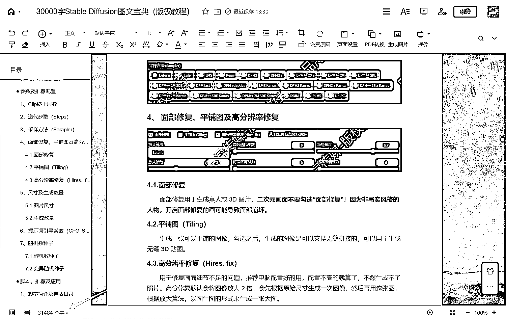
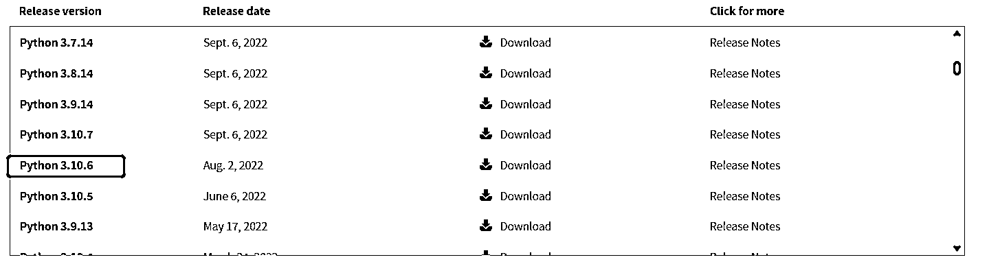
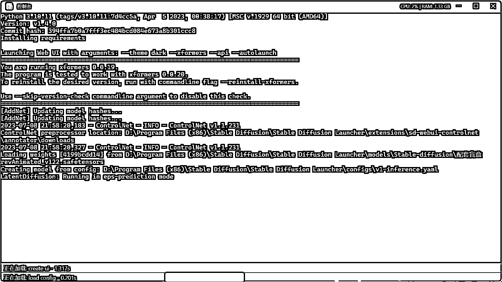
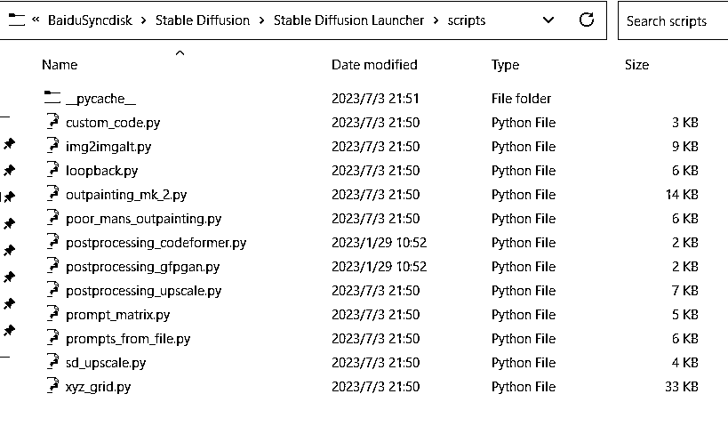
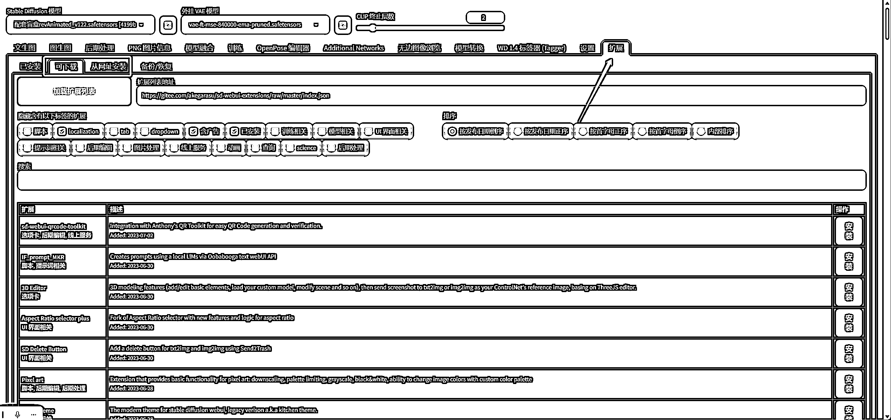

# Stable Diffusion 六脉神剑，小白的福音

> 原文：[`www.yuque.com/for_lazy/thfiu8/kd749lu65bisgxpe`](https://www.yuque.com/for_lazy/thfiu8/kd749lu65bisgxpe)

<ne-h2 id="44915018" data-lake-id="44915018"><ne-heading-ext><ne-heading-anchor></ne-heading-anchor><ne-heading-fold></ne-heading-fold></ne-heading-ext><ne-heading-content><ne-text id="u53f5fb7e">(49 赞)Stable Diffusion 六脉神剑，小白的福音</ne-text></ne-heading-content></ne-h2> <ne-p id="u6bec46ca" data-lake-id="u6bec46ca"><ne-text id="ue2960577">作者： Chris LEN</ne-text></ne-p> <ne-p id="u17a02b65" data-lake-id="u17a02b65"><ne-text id="u7a3f4e3a">日期：2023-07-20</ne-text></ne-p> <ne-p id="u26d7ee9e" data-lake-id="u26d7ee9e"><ne-text id="u3316ec70">如果你是一个 Stable Diffusion 的小白，那么你一定要看完这篇文章，这篇文章就像一张地图，看完你就知道自己到底身在 Stable Diffusion 的哪个板块。</ne-text></ne-p> <ne-p id="ucd732bfd" data-lake-id="ucd732bfd"><ne-text id="u33dc3f13">从来没有在生财写过文章，因为自己不爱写，近来因为专注 Stable Diffusion 绘画，经过挑灯近 20 来天的学习，学习记录了一篇高达 30000 字记录，本来是自己记录看的（因为 CTRL+F 查找很方便），结果越来越多，后来干脆就做成了教程，目前已经 31484 个字，还在小部分在更新中，采用云文档，这样就保证了有最新的技术和信息都可以随时更新。</ne-text></ne-p> <ne-p id="u47d7b5ac" data-lake-id="u47d7b5ac"><ne-text id="ub3517bb0" style="color: rgb(51, 51, 51);">       而经过系统的学习，我从一个小白到了一个大白，所以特别明白小白看到</ne-text><ne-text id="u25016f66">Stable Diffusion 那些各种各样的设置，选项，插件等等是什么感受，直接就是云里雾里。想想自己才学的时候也是这样，所以就总结了这篇短文。话不多说我们直接开始。</ne-text></ne-p> <ne-p id="u292a56ad" data-lake-id="u292a56ad"><ne-card data-card-name="image" data-card-type="inline" id="tLXAX" data-event-boundary="card"></ne-card></ne-p> <ne-p id="u36203530" data-lake-id="u36203530"><ne-text id="uc817e845" style="color: rgb(51, 51, 51);">       Stable Diffusion 具体是什么？我们就不在这里多说了，总的来说就是一个靠自己打字，然后通过 Stable Diffusion 这个工具，利用 Ai 技术，根据你输出的文字内容及配套的资源，来形成图片的系统。</ne-text></ne-p> <ne-p id="u9caa9d37" data-lake-id="u9caa9d37"><ne-text id="u601c2764" style="color: rgb(51, 51, 51);">而 Stable Diffusion 总体来说由 6 个维度构成，我们就简单地把这 6 个维度称之为“六脉神剑”吧。</ne-text><ne-text id="ud808e18a" ne-bold="true">要学好 Stable Diffusion，那么一定要先清楚这 6 个维度是什么？</ne-text></ne-p> <ne-p id="u2b437914" data-lake-id="u2b437914"><ne-text id="u1e921520" style="color: rgb(51, 51, 51);">       它们分别是环境，参数，模组，脚本，插件（扩展）和提示词，让我一一开始。</ne-text></ne-p> <ne-h3 id="052c6665" data-lake-id="052c6665"><ne-heading-ext><ne-heading-anchor></ne-heading-anchor><ne-heading-fold></ne-heading-fold></ne-heading-ext><ne-heading-content><ne-text id="ub9d7822c" style="background-color: rgb(255, 255, 255); color: rgb(47, 48, 52);">1. </ne-text><ne-text id="ub6a2ced2" ne-bold="true">环境</ne-text></ne-heading-content></ne-h3> <ne-p id="u1e76acb7" data-lake-id="u1e76acb7"><ne-text id="ub78571a2" style="color: rgb(51, 51, 51);">       首先我们要能够使用 Stable Diffusion，环境就要匹配，有些人也称之为依赖。这个环境实际上有两种，</ne-text><ne-text id="ude289c28" ne-bold="true">硬环境和软环境</ne-text><ne-text id="ufd175af3" ne-bold="true">，硬环境就是说自己的电脑硬件基础，软环境就是需要安装的前置组件或生态。</ne-text></ne-p> <ne-p id="u6c7059df" data-lake-id="u6c7059df"><ne-text id="ud54a1e6a" ne-bold="true">就类似说你要剖腹生孩子，除了产房、医生和医疗器械这些硬环境条件要达标外，这接生技术还必须到位，否则你就肯定噶了，就是这个道理。而接生技术、产房温度等等之类的东西就可以理解为软环境，我们先看看硬环境需要什么？</ne-text></ne-p> <ne-h4 id="8e882c59" data-lake-id="8e882c59"><ne-heading-ext><ne-heading-anchor></ne-heading-anchor><ne-heading-fold></ne-heading-fold></ne-heading-ext><ne-heading-content><ne-text id="u38fc2f4c" ne-bold="true">1.1.硬环境</ne-text></ne-heading-content></ne-h4> <ne-p id="u97f29f0d" data-lake-id="u97f29f0d"><ne-text id="ub2fa93b6" style="color: rgb(51, 51, 51);">       硬环境就是说电脑的硬件配置了，Stable Diffusion 运行推荐配置如下：</ne-text></ne-p> <ne-p id="ubc9c1709" data-lake-id="ubc9c1709"><ne-text id="uf8c98c42" style="color: rgb(51, 51, 51);">       内存：不低于 16 GB DDR4 或 DDR5</ne-text></ne-p> <ne-p id="u9ac638dd" data-lake-id="u9ac638dd"><ne-text id="u72aaf918" style="color: rgb(51, 51, 51);">       存储：不低于 10 GB 可用空间</ne-text></ne-p> <ne-p id="uc387d20c" data-lake-id="uc387d20c"><ne-text id="u09d046e4" style="color: rgb(51, 51, 51);">       GPU：N 卡，不低于 6 GB 显存</ne-text></ne-p> <ne-p id="uf47cdee4" data-lake-id="uf47cdee4"><ne-text id="ucd711656" style="color: rgb(51, 51, 51);">       我们现在通常用的秋叶的整合包，运行推荐配置如下：</ne-text></ne-p> <ne-p id="ude46a013" data-lake-id="ude46a013"><ne-text id="u116ed3b5" style="color: rgb(51, 51, 51);">       操作系统: windows10 以上</ne-text></ne-p> <ne-p id="u8419491a" data-lake-id="u8419491a"><ne-text id="u63389f4d" style="color: rgb(51, 51, 51);">       CPU: 不做强制性要求</ne-text></ne-p> <ne-p id="ud7b7fcfe" data-lake-id="ud7b7fcfe"><ne-text id="u24b5b048" style="color: rgb(51, 51, 51);">       内存: 推荐 8G 以上</ne-text></ne-p> <ne-p id="u26ced0db" data-lake-id="u26ced0db"><ne-text id="u931bbda5" style="color: rgb(51, 51, 51);">       显卡:必须是 Nvidia 的独立显卡,显存最低 4G,推荐 20 系以后</ne-text></ne-p> <ne-p id="uef401362" data-lake-id="uef401362"><ne-text id="u6085d9d1" style="color: rgb(51, 51, 51);">       A 卡、核显只能用 CPU 跑</ne-text></ne-p> <ne-p id="uf0f0dabe" data-lake-id="uf0f0dabe"><ne-text id="ued328a18" style="color: rgb(51, 51, 51);">       整合包推荐放在固态硬盘中，提升模型加载速度</ne-text></ne-p> <ne-p id="ub0523ef7" data-lake-id="ub0523ef7"><ne-text id="uf7da17af" style="color: rgb(51, 51, 51);">       配置不够的，可以在云主机上运行。</ne-text></ne-p> <ne-p id="u06c381ac" data-lake-id="u06c381ac"><ne-text id="u24e0787e" style="color: rgb(51, 51, 51);">       关于硬盘，即储存空间，实际上 10G 远远不够，各种模型插件搞下来，也得好几十个 G，到后期上百 G 是非常容易的，所以最好搞个大点的地方来放相关的资源。</ne-text></ne-p> <ne-p id="uead99d36" data-lake-id="uead99d36"><ne-text id="u5e299713" style="color: rgb(255, 0, 0);">《《《《《《硬盘推荐固态硬盘！！！》》》》》</ne-text></ne-p> <ne-p id="ufdb14a7a" data-lake-id="ufdb14a7a"><ne-text id="ua9f04ec3" style="color: rgb(255, 0, 0);">《《《《《《硬盘推荐固态硬盘！！！》》》》》</ne-text></ne-p> <ne-p id="u7e122c3b" data-lake-id="u7e122c3b"><ne-text id="u8bc4b99d" style="color: rgb(255, 0, 0);">《《《《《《硬盘推荐固态硬盘！！！》》》》》</ne-text></ne-p> <ne-h4 id="bdc06ccc" data-lake-id="bdc06ccc"><ne-heading-ext><ne-heading-anchor></ne-heading-anchor><ne-heading-fold></ne-heading-fold></ne-heading-ext><ne-heading-content><ne-text id="u3dee2844" ne-bold="true">1.2.软环境</ne-text></ne-heading-content></ne-h4> <ne-p id="u0894d54f" data-lake-id="u0894d54f"><ne-text id="ua99a23c8" style="color: rgb(51, 51, 51);">       一共分为三个板块：Python、Git 和魔法上网</ne-text></ne-p> <ne-p id="u83469724" data-lake-id="u83469724"><ne-text id="u9c0eb438" ne-bold="true">题外话：推荐彻底卸载 360、金山、电脑管家之类的沙雕工具，还有安装这些东西的时候，它们给你附带安装的各种垃圾软件，这些东西会极大地消耗你的电脑性能，除了惹人讨厌外，毫无用处。</ne-text></ne-p> <ne-p id="u6fcda405" data-lake-id="u6fcda405"><ne-text id="ua4af9f43" style="color: rgb(51, 51, 51);">       我们在使用 Stable Diffusion 之前，电脑里要先安装 Python 和 Git，否则就运行不起来，这两者是非常重要的前置软环境，也就是生态。</ne-text></ne-p> <ne-p id="u465da05d" data-lake-id="u465da05d"><ne-text id="u1a08f373" style="color: rgb(51, 51, 51);">       Python 下载地址：</ne-text></ne-p> <ne-p id="ua1b316dd" data-lake-id="ua1b316dd"><ne-card data-card-name="image" data-card-type="inline" id="kYtJV" data-event-boundary="card"></ne-card></ne-p> <ne-p id="u8ba5819b" data-lake-id="u8ba5819b"><ne-text id="uad8d57fa" style="color: rgb(51, 51, 51);">       下载 Python 3.10 以上就行了，但我截图的时候已经有了 3.11 和 12，但目前 3.10 以下显示是稳定版，所以我们就选用 3.10 就行了。</ne-text></ne-p> <ne-p id="u0803d809" data-lake-id="u0803d809"><ne-text id="u14913b4e" style="color: rgb(51, 51, 51);">鼠标往下滑，找到这个就行，网上大部分人推荐 3.10.6 或者 3.10.9。（不过我试了一下最 3.11.4 也没什么问题）</ne-text></ne-p> <ne-p id="u8b77e143" data-lake-id="u8b77e143"><ne-card data-card-name="image" data-card-type="inline" id="TX9aQ" data-event-boundary="card"></ne-card></ne-p> <ne-p id="u1fe73e83" data-lake-id="u1fe73e83"><ne-text id="udeff52dc" style="color: rgb(51, 51, 51);">       安装注意事项：看下图，然后点 Install Now，一直下一步，完事儿。</ne-text></ne-p> <ne-p id="u4953c3ce" data-lake-id="u4953c3ce"><ne-card data-card-name="image" data-card-type="inline" id="PUohd" data-event-boundary="card"></ne-card></ne-p> <ne-p id="ub975d070" data-lake-id="ub975d070"><ne-text id="uff74d00a" style="color: rgb(51, 51, 51);">       其次是 Git，下载地址：</ne-text></ne-p> <ne-p id="u02a5f6fc" data-lake-id="u02a5f6fc"><ne-card data-card-name="image" data-card-type="inline" id="vEg9F" data-event-boundary="card"></ne-card></ne-p> <ne-p id="uea872989" data-lake-id="uea872989"><ne-text id="u19800164" style="color: rgb(51, 51, 51);">       下载安装版就好了，便携版我没有试过。</ne-text></ne-p> <ne-p id="ucdfe91d0" data-lake-id="ucdfe91d0"><ne-text id="ub901993c" style="color: rgb(51, 51, 51);">       安装注意事项：无，就一直下一步 next、下一步 next、下一步 next 就行。</ne-text></ne-p> <ne-p id="u1587cee6" data-lake-id="u1587cee6"><ne-text id="u972d51a8" style="color: rgb(51, 51, 51);">       秋叶的整合包还需要一个微软的组件，就是 Microsoft Windows Desktop Runtime - 6.0.1.1，这个在本教程提供的整合包里有（整合包是免费的，后面会详细说到）。这个组件在网上很多地方也可以找到，百度一下就有了。</ne-text></ne-p> <ne-p id="u9a774d46" data-lake-id="u9a774d46"><ne-card data-card-name="image" data-card-type="inline" id="Jievf" data-event-boundary="card"></ne-card></ne-p> <ne-p id="ub8df7359" data-lake-id="ub8df7359"><ne-text id="u2133eb56" style="color: rgb(51, 51, 51);">       上面这些都匹配了的情况下，解压整合包，在里面找到 A 启动器.exe 双击即可。</ne-text></ne-p> <ne-p id="u320a4309" data-lake-id="u320a4309"><ne-card data-card-name="image" data-card-type="inline" id="vEYwu" data-event-boundary="card"></ne-card></ne-p> <ne-h3 id="73da6fe9" data-lake-id="73da6fe9"><ne-heading-ext><ne-heading-anchor></ne-heading-anchor><ne-heading-fold></ne-heading-fold></ne-heading-ext><ne-heading-content><ne-text id="u0585b370" ne-bold="true">2.参数</ne-text></ne-heading-content></ne-h3> <ne-p id="u41e03bfd" data-lake-id="u41e03bfd"><ne-text id="u4f5b31c3" style="color: rgb(51, 51, 51);">       点击以后就可以使用了，这里我们还是用秋叶的整合包举例，打开后点击一键启动。</ne-text></ne-p> <ne-p id="u86d223b0" data-lake-id="u86d223b0"><ne-card data-card-name="image" data-card-type="inline" id="Czhv7" data-event-boundary="card"></ne-card></ne-p> <ne-p id="u91d01a52" data-lake-id="u91d01a52"><ne-text id="u0d752e0d" style="color: rgb(255, 0, 0);">然后就会弹出来一个 CMD 界面，不用管它，但出错的时候，这里也记载了很多重要信息，所以如果遇到错误时，可以到这里来看看都有什么提示。</ne-text></ne-p> <ne-p id="u93f8cce3" data-lake-id="u93f8cce3"><ne-card data-card-name="image" data-card-type="inline" id="Ug4rg" data-event-boundary="card"></ne-card></ne-p> <ne-p id="u3a09ddcd" data-lake-id="u3a09ddcd"><ne-text id="u6c1aa1e0" style="color: rgb(51, 51, 51);">       这个过程加载完以后，会自动打开一个网页，你会发现这个界面非常复杂（秋叶整合包已汉化）</ne-text><ne-text id="u0ce1a38e" ne-bold="true">（每个人进去的界面可能不一样，比如下载秋叶整合包的，和从别的地方下载的可能都不一样，和自己从 0 到 1 配置的也不一样，这是因为他们在 UI 和插件上和本整合包不同，但后期使用大致都是相通的）</ne-text></ne-p> <ne-p id="ud4106427" data-lake-id="ud4106427"><ne-card data-card-name="image" data-card-type="inline" id="dSx9g" data-event-boundary="card"></ne-card></ne-p> <ne-p id="u610c0dc5" data-lake-id="u610c0dc5"><ne-text id="u79df9a82" style="color: rgb(51, 51, 51);">       进去以后，我们就会发现，界面里面有非常非常多的参数，对不对？包含了什么迭代步数、采样方法、引导词系数等等等等。</ne-text></ne-p> <ne-p id="u620dc80a" data-lake-id="u620dc80a"><ne-text id="udfe8ce78" style="color: rgb(51, 51, 51);">       而这些参数又跟模型，脚本，插件等等交叉混合使用，非常繁多复杂，这个只有同学们在使用的过程中慢慢地记，慢慢地试验，逐渐熟悉。</ne-text></ne-p> <ne-p id="u45f774f9" data-lake-id="u45f774f9"><ne-text id="ud8d872ce" style="color: rgb(51, 51, 51);">       参数的详细讲解和推荐配置就先不在这里一一赘述了，因为比较多。</ne-text></ne-p> <ne-h3 id="9738769a" data-lake-id="9738769a"><ne-heading-ext><ne-heading-anchor></ne-heading-anchor><ne-heading-fold></ne-heading-fold></ne-heading-ext><ne-heading-content><ne-text id="u27c5b4d1" style="background-color: rgb(255, 255, 255); color: rgb(47, 48, 52);">3. </ne-text><ne-text id="u0883d453" ne-bold="true">模组</ne-text></ne-heading-content></ne-h3> <ne-p id="u9b82d594" data-lake-id="u9b82d594"><ne-text id="uae2f7707" style="color: rgb(51, 51, 51);">       Stable Diffusion 里面有很多的模型，而这些模型的都有各自不同的用途，主要分为五大类别。分别是 Checkpoint，Hypernetwork，Embedding(也叫 Textual Inversion)，Lora 和 VAE。在后续我们的讲解中，我们会讲解在何处下载模型，下载后存在哪里，如何使用等等。</ne-text></ne-p> <ne-p id="u1903f81b" data-lake-id="u1903f81b"><ne-text id="u1b384fea" style="color: rgb(51, 51, 51);">       很多地方统称他们为模型，我称之为模组的原因是，这些模型可以单独使用，也可以配套使用，有一些则必须要配套使用，可能是模型配套模型，模型配套脚本，模型配套插件，所以我把它们称之为模组更为贴切，你想怎么称呼都随便你了。</ne-text></ne-p> <ne-p id="u21813e66" data-lake-id="u21813e66"><ne-text id="u9bb64b76" style="color: rgb(51, 51, 51);">       我们</ne-text><ne-text id="ucd3f254a" style="color: rgb(255, 0, 0);">常用的模型就是 Checkpoint、Lora</ne-text><ne-text id="u592a6438" style="color: rgb(51, 51, 51);">以及</ne-text><ne-text id="u7bd3f951" style="color: rgb(255, 0, 0);">ControlNet</ne-text><ne-text id="u82548413" style="color: rgb(51, 51, 51);">，但 ControlNet 并不是模型之一，只是一个插件，这个我们后面会详细说明（其实早期版本的 Stable Diffusion，Lora 也是作为插件使用的）。模组的存放和使用等等也不在这个文章里多说，因为本文只是一个索引地图，让你明白方位即可。</ne-text></ne-p> <ne-h3 id="05e768eb" data-lake-id="05e768eb"><ne-heading-ext><ne-heading-anchor></ne-heading-anchor><ne-heading-fold></ne-heading-fold></ne-heading-ext><ne-heading-content><ne-text id="u9613ae93" style="background-color: rgb(255, 255, 255); color: rgb(47, 48, 52);">4. </ne-text><ne-text id="ued42818c" ne-bold="true">脚本</ne-text></ne-heading-content></ne-h3> <ne-p id="u4a0103cb" data-lake-id="u4a0103cb"><ne-text id="ue1c22fb3" style="color: rgb(51, 51, 51);">       Stable Diffusion 还有脚本功能，脚本也是 SD 里一个非常不同寻常的功能，它就像一个打工人一样，按照你的要求给出你要的东西，下图是存放目录。</ne-text></ne-p> <ne-p id="u361ccf5d" data-lake-id="u361ccf5d"><ne-card data-card-name="image" data-card-type="inline" id="Jcgb9" data-event-boundary="card"></ne-card></ne-p> <ne-p id="u462946b1" data-lake-id="u462946b1"><ne-text id="ue67351d5" style="color: rgb(51, 51, 51);">       脚本有什么用途呢？我们可以这样理解，它的用途就像玩游戏的时候给自己施加 Buff，给我们的武器附魔是一个道理。脚本，就是给 Stable Diffusion 的成品附魔的（看下去你就会明白了），而有时候有的武器，不附魔是无法使用的。</ne-text></ne-p> <ne-p id="u4bfb8c34" data-lake-id="u4bfb8c34"><ne-text id="u57ea115c" style="color: rgb(51, 51, 51);">       虽然每个</ne-text><ne-text id="ueba90d87" style="color: rgb(255, 0, 0);">脚本有不同的用途，但并不是每一次都一定要用才行的。</ne-text></ne-p> <ne-p id="u0355f454" data-lake-id="u0355f454"><ne-text id="u34c9b0ba" style="color: rgb(51, 51, 51);">       比如利用脚本，你可以生成这种连环漫画，但如果你只用模型则是不行的，所以我说这就是给你的成品附魔的，相当于给 Stable Diffusion 附魔说，我要你出的图是这种漫画，那么结合这个脚本，Stable Diffusion 就会出这样的漫画。这个生成漫画的脚本，我们后续也会说到。</ne-text></ne-p> <ne-p id="u0a9c9bf9" data-lake-id="u0a9c9bf9"><ne-card data-card-name="image" data-card-type="inline" id="kJ6bk" data-event-boundary="card"></ne-card></ne-p> <ne-p id="u64d8f5ce" data-lake-id="u64d8f5ce"><ne-text id="uac1c4076" style="color: rgb(51, 51, 51);">       比如说下面这个 X/Y/Z 图表的脚本，也有很多不同的用途，这里不会详细讲，因为正如之前说的，本文只是一个索引地图，让各位明白什么是什么即可，这个在教程里有详细讲解的。</ne-text></ne-p> <ne-p id="u3be112c2" data-lake-id="u3be112c2"><ne-card data-card-name="image" data-card-type="inline" id="wv4wI" data-event-boundary="card"></ne-card></ne-p> <ne-h3 id="7cb06bc1" data-lake-id="7cb06bc1"><ne-heading-ext><ne-heading-anchor></ne-heading-anchor><ne-heading-fold></ne-heading-fold></ne-heading-ext><ne-heading-content><ne-text id="uac5e12a3" ne-bold="true">5.插件/扩展</ne-text></ne-heading-content></ne-h3> <ne-p id="udfc1c4c7" data-lake-id="udfc1c4c7"><ne-text id="u9d3c338f" style="color: rgb(51, 51, 51);">       除了模型和脚本以外，还有插件，插件就是扩展。</ne-text></ne-p> <ne-p id="ub18b7383" data-lake-id="ub18b7383"><ne-text id="u3129a12c" style="color: rgb(51, 51, 51);">脚本是给成品附魔的，那么插件就是给 Stable Diffusion 这套系统附魔的。就是说，通过插件，我们的 Stable Diffusion 就会有更多的功能，我们耳熟能详的 ControlNet 其实就是 Stable Diffusion 里的一个插件。</ne-text></ne-p> <ne-p id="ue3e69fee" data-lake-id="ue3e69fee"><ne-text id="u83ad1cbd" style="color: rgb(51, 51, 51);">       插件存储的位置是：SD 安装目录 > extensions </ne-text></ne-p> <ne-p id="ua124c796" data-lake-id="ua124c796"><ne-card data-card-name="image" data-card-type="inline" id="Y1xl2" data-event-boundary="card"></ne-card></ne-p> <ne-p id="uf47ebea2" data-lake-id="uf47ebea2"><ne-text id="u2d70b7a6" style="color: rgb(0, 0, 0);">第二种下载插件的办法就是，在 Stable Diffusion 里直接安装。</ne-text></ne-p> <ne-p id="u61e24b42" data-lake-id="u61e24b42"><ne-card data-card-name="image" data-card-type="inline" id="jH7GQ" data-event-boundary="card"></ne-card></ne-p> <ne-p id="u5f856875" data-lake-id="u5f856875"><ne-text id="u918f598d" style="color: rgb(51, 51, 51);">       插件界面图，红色画框部分里有很多都是插件，比如有增强提示词的，编辑姿势的等等。</ne-text></ne-p> <ne-p id="u611534aa" data-lake-id="u611534aa"><ne-card data-card-name="image" data-card-type="inline" id="b7REK" data-event-boundary="card"></ne-card></ne-p> <ne-h3 id="d78cb8bb" data-lake-id="d78cb8bb"><ne-heading-ext><ne-heading-anchor></ne-heading-anchor><ne-heading-fold></ne-heading-fold></ne-heading-ext><ne-heading-content><ne-text id="u7956795a" ne-bold="true">6.提示词</ne-text></ne-heading-content></ne-h3> <ne-p id="ue8698e0e" data-lake-id="ue8698e0e"><ne-text id="u03cb3707" style="color: rgb(0, 0, 0);">提示词，Prompt，有些地方也称之为关键词，也有人称之为咒语。不管叫什么了，反正我们只有通过提示词，才可以让 Stable Diffusion 明白我们需要什么样的图。</ne-text></ne-p> <ne-p id="u4bf14868" data-lake-id="u4bf14868"><ne-text id="u79425c0a" style="color: rgb(0, 0, 0);">       而提示词则分为正向提示词和反向提示词，正向提示词是告诉 Stable Diffusion 我们要什么，比如 best quality,4k,1girl，这就是告诉 Stable Diffusion 我们要画的内容里要包括最好画质，4K 分辨率，1 个女孩。</ne-text></ne-p> <ne-p id="u1dd08840" data-lake-id="u1dd08840"><ne-text id="u9bf5b388" style="color: rgb(0, 0, 0);">       而反向提示词则可以是 Twisted fingers, multiple heads, multiple arms，当你把这个放进反向提示词里，则是告诉 Stable Diffusion，出的图不要扭曲的手指，不要三头六臂。</ne-text></ne-p> <ne-p id="u479c9bf1" data-lake-id="u479c9bf1"><ne-card data-card-name="image" data-card-type="inline" id="yoKpm" data-event-boundary="card"></ne-card></ne-p> <ne-p id="udf4f82ee" data-lake-id="udf4f82ee"><ne-text id="ub2d2c104" style="color: rgb(51, 51, 51);">       提示词怎么写，怎么写更快，也不在这里继续说了。</ne-text></ne-p> <ne-p id="ufe7af3f6" data-lake-id="ufe7af3f6"><ne-text id="u4d5b7f2b" style="color: rgb(51, 51, 51);">       好了，关于 Stable Diffusion 的六脉神剑就讲完了，看完这一篇文章，想必作为一个小白的你，应该也明白自己薄弱的是哪一块了，如果有问题的，也可以提问，我都会回答的。</ne-text></ne-p> <ne-hole id="uf39d46b4" data-lake-id="uf39d46b4"><ne-card data-card-name="hr" data-card-type="block" id="BkWiL" data-event-boundary="card"><ne-p id="u2b296c54" data-lake-id="u2b296c54"><ne-text id="ue0fbbd02">评论区：</ne-text></ne-p> <ne-p id="ue4676b06" data-lake-id="ue4676b06"><ne-text id="u0ccc69a0">无咎。 : 别的不说，360 和金山确实挺沙雕的[OK]</ne-text> <ne-text id="u376bf4ee">Chris LEN : 腾讯电脑管家也不遑多让</ne-text> <ne-text id="u411b4c68">生财大头 : 别的不说，引流高手</ne-text> <ne-text id="ue0de8416">Chris LEN : 啥引流？我可没引流</ne-text></ne-p> <ne-p id="uede76fa8" data-lake-id="uede76fa8"><ne-card data-card-name="image" data-card-type="inline" id="Dk0IQ" data-event-boundary="card"></ne-card></ne-p> <ne-hole id="u3612f2a6" data-lake-id="u3612f2a6"><ne-card data-card-name="hr" data-card-type="block" id="mrFxo" data-event-boundary="card"></ne-card></ne-hole></ne-card></ne-hole>