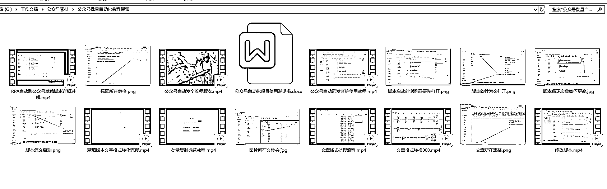
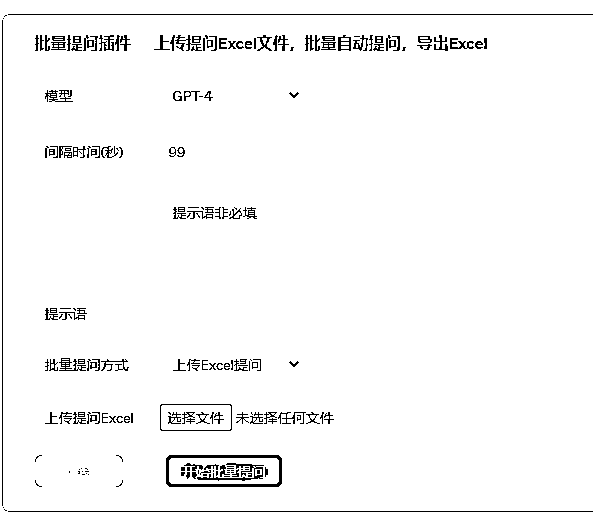

# 公众号爆文项目：批量公众号自动化发布文章和生成草稿 流程分享

> 原文：[`www.yuque.com/for_lazy/thfiu8/oba1iagn0fi7x0bi`](https://www.yuque.com/for_lazy/thfiu8/oba1iagn0fi7x0bi)

<ne-h2 id="74504506" data-lake-id="74504506"><ne-heading-ext><ne-heading-anchor></ne-heading-anchor><ne-heading-fold></ne-heading-fold></ne-heading-ext><ne-heading-content><ne-text id="u2a2f6c4a">(104 赞)公众号爆文项目：批量公众号自动化发布文章和生成草稿 流程分享</ne-text></ne-heading-content></ne-h2> <ne-p id="u8b5cf380" data-lake-id="u8b5cf380"><ne-text id="u3cd5e2f1">作者： 良辰美</ne-text></ne-p> <ne-p id="u64bcc9de" data-lake-id="u64bcc9de"><ne-text id="u9be3ff42">日期：2023-07-20</ne-text></ne-p> <ne-h1 id="10d13130" data-lake-id="10d13130"><ne-heading-ext><ne-heading-anchor></ne-heading-anchor><ne-heading-fold></ne-heading-fold></ne-heading-ext><ne-heading-content><ne-text id="u7abb4771">前言，分享背景</ne-text></ne-heading-content></ne-h1> <ne-p id="u81a8deea" data-lake-id="u81a8deea"><ne-text id="ua970d9d3">最近公众号爆文吃流量主的项目如火如荼，不知道有多少圈友下场？</ne-text></ne-p> <ne-p id="u15c6d046" data-lake-id="u15c6d046"><ne-text id="u19d03d6d">我没报名这个航海项目，但看星球里好多这方面的文章，尤其是</ne-text>[<ne-text id="udf35f19f">亦仁给这条风向标加精</ne-text>](http://%20https://wx.zsxq.com/dweb2/index/topic_detail/181154582542122)<ne-text id="u23c9f078">之后，这个项目就更加火爆了。</ne-text></ne-p> <ne-p id="uc4a67a7c" data-lake-id="uc4a67a7c"><ne-card data-card-name="image" data-card-type="inline" id="wixTn" data-event-boundary="card"></ne-card></ne-p> <ne-p id="u9607b990" data-lake-id="u9607b990"><ne-text id="u45fca695">我当时看到这条帖子，第一反应就是，</ne-text><ne-text id="u7cafa5d7" ne-bold="true" ne-underline="true">批量，矩阵，自动化</ne-text><ne-text id="u17cda600">，这几个关键词。</ne-text></ne-p> <ne-p id="u1e4cda03" data-lake-id="u1e4cda03"><ne-text id="u503df51d">所以当天上午就把 RPA 自动化跑公众号的流程搞完了，接下来就是找人合作拿号，然后再慢慢优化流程，包括增加 SD 批量出图和 GPT 自动化写文章。</ne-text></ne-p> <ne-p id="u508a8cd5" data-lake-id="u508a8cd5"><ne-text id="u433768de">最后找了个圈友号商合作，个把月下来都是跑美女图文项目，废了几个号，收益不算高，今晚突然说没资料了，流量主收益全部都提不出来了...</ne-text></ne-p> <ne-p id="u869815b5" data-lake-id="u869815b5"><ne-text id="u94b5193a">（具体细节不多说，问了也暂不回答，大环境封控原因）</ne-text></ne-p> <ne-p id="ua6c0a68c" data-lake-id="ua6c0a68c"><ne-text id="uf72c3bd6">本来想着项目搞到月入十万，再分享一波这个流程的，现在感觉今天就可以拿出来了。</ne-text><ne-card data-card-name="image" data-card-type="inline" id="zYKFg" data-event-boundary="card"></ne-card></ne-p> <ne-h1 id="767afaad" data-lake-id="767afaad"><ne-heading-ext><ne-heading-anchor></ne-heading-anchor><ne-heading-fold></ne-heading-fold></ne-heading-ext><ne-heading-content><ne-text id="ub05fa10d">公众号自动化流程是怎么实现的</ne-text></ne-heading-content></ne-h1> <ne-p id="u219ce4f5" data-lake-id="u219ce4f5"><ne-text id="u87d59626">先说脚本，用的是 UIBOT，前后优化了好几个版本，好处是不同电脑之间可以直接复制代码，免费版本的就可以直接上，坏处是不如影刀的识别性准确率高，当然还有方便易用性等等。</ne-text></ne-p> <ne-p id="u0cfdcbc5" data-lake-id="u0cfdcbc5"><ne-text id="ua121a567">脚本可以设置成一个号不停得保存草稿，也可以一台电脑每天定时循环五个号创作草稿后点击发布。</ne-text></ne-p> <ne-p id="uaa805df7" data-lake-id="uaa805df7"><ne-text id="ub8a28243">就是公众号发布有个问题，得管理员扫码，当然这个可以在安全中心里面吗关闭。</ne-text></ne-p> <ne-p id="u5d8c0786" data-lake-id="u5d8c0786"><ne-text id="ub2015dcb">那还有个问题，是一个号的登录缓存只能保持三天，那每周还是得扫码登录两三次。</ne-text></ne-p> <ne-p id="uc9125a86" data-lake-id="uc9125a86"><ne-text id="ubced1ebd">至于一个电脑怎么同时登录多个号？用 sessionbox 插件。最多可以登录多少个号？仁者见仁智者见智，建议五个左右，其实有人觉得超过十个也没关系。</ne-text></ne-p> <ne-p id="u75ae9408" data-lake-id="u75ae9408"><ne-card data-card-name="image" data-card-type="inline" id="OqFv2" data-event-boundary="card"></ne-card></ne-p> <ne-p id="u0526aba5" data-lake-id="u0526aba5"><ne-text id="ua9a60a9a">链接：https://pan.baidu.com/s/1VGyuAgEC5wKogMNqjItLMg?pwd=tfay</ne-text></ne-p> <ne-p id="u7b00de69" data-lake-id="u7b00de69"><ne-text id="uf9611729">提取码：tfay 这个是截图里面全部版本的脚本代码了，但是不一定适配你的电脑，大概率是要调试的。</ne-text></ne-p> <ne-p id="u92d20cad" data-lake-id="u92d20cad"><ne-text id="u3dd23be5">这里脚本的实现逻辑是，提前准备好图片和文章素材，文案统一格式放到表格当中，然后就完成标题撰写，一张图+一段话循环复制粘贴，再完成原创作者和标签话题填写，最后保存就行。一次群发想弄几篇文章，就循环几次即可，当然每个循环也要有所变动。</ne-text></ne-p> <ne-p id="uce427879" data-lake-id="uce427879"><ne-text id="uad64d7c9">以上这段话看起来简单，但真正去做起来，就需要各种各样的调试了，确实超级麻烦，可以这么说，就算我把代码给你，不懂的可能压根不知道怎么用，知道 UIBOT 的也得调试半天。</ne-text></ne-p> <ne-p id="u0b258d4b" data-lake-id="u0b258d4b"><ne-text id="uea5805fc">所以这里我也把录制的视频一并放上来，是之前给一个付费圈友远程讲解的，中间也是经过了无数次沟通。</ne-text></ne-p> <ne-p id="u58649736" data-lake-id="u58649736"><ne-card data-card-name="image" data-card-type="inline" id="zx2a0" data-event-boundary="card"></ne-card></ne-p> <ne-p id="u8e9aea84" data-lake-id="u8e9aea84"><ne-text id="ucd566e95">链接：https://pan.baidu.com/s/1gYuEPbdOaC-XOXn8pXJceQ?pwd=5rju</ne-text></ne-p> <ne-p id="u6968628b" data-lake-id="u6968628b"><ne-text id="uc7616e63">提取码：5rju  这个是上面截图的视频教程，不保证你能看懂，但是想学的话，估计能看个大概，有这套代码，搭配视频，稍微研究下，应该就知道怎么用怎么修改了。</ne-text></ne-p> <ne-p id="ua1d6254e" data-lake-id="ua1d6254e"><ne-text id="u605f95c2">如果你自学性强，估计不看这些也能自己研究出来；如果你看着代码就头皮发麻，那可能看了这些视频也搞不懂。我是自己瞎鼓捣的，需要用到什么，就去自行研究。</ne-text></ne-p> <ne-p id="u17ca8bfa" data-lake-id="u17ca8bfa"><ne-text id="u2713ffba">以上这套代码，是</ne-text><ne-text id="u70df03ef" ne-italic="true" ne-underline="true">美女图文项目</ne-text><ne-text id="u51055428">的，说白了就是一段话一张图那种类型的，如果你想要精细化的排版，或者只需要一张图，那都是可以修改的。</ne-text></ne-p> <ne-p id="ue7618079" data-lake-id="ue7618079"><ne-text id="u56db7cd3">我目前的做法是，一个号批量保存草稿，一天 24 小时不停创建，保证图片和文章素材足够用，差不多攒了两三百篇草稿... 然后手机端就每天发一次就可以了。</ne-text></ne-p> <ne-p id="u5f8c90b1" data-lake-id="u5f8c90b1"><ne-text id="uf51309c0">如果想要精细化操作，那么从出图和写稿到排版都可以去进行优化，只是代码固定好后，不轻易乱搞，会知道怎么用，那就不怎么耗时间了。</ne-text></ne-p> <ne-h1 id="cc4a47e0" data-lake-id="cc4a47e0"><ne-heading-ext><ne-heading-anchor></ne-heading-anchor><ne-heading-fold></ne-heading-fold></ne-heading-ext><ne-heading-content><ne-text id="ua0a7b920">图片和文章素材怎么批量自动化生成</ne-text></ne-heading-content></ne-h1> <ne-p id="uad7dd9b4" data-lake-id="uad7dd9b4"><ne-text id="uea3dc5e8">美女图，甚至任何类型的图片，基本都可以用 MIDJOURNEY 生成，只不过这个是用按月付费的平台。</ne-text></ne-p> <ne-p id="u9132d2ab" data-lake-id="u9132d2ab"><ne-text id="u2656d154">如果自己电脑配置比较高，且是 N 卡，那就可以自行下载安装 Stable Disfusion 这块软件，然后网上下载美女模型，再搭配 RPA 就可以免费 24 小时不间断出图了。</ne-text></ne-p> <ne-p id="udcaaa855" data-lake-id="udcaaa855"><ne-text id="u0262f43c">我电脑配置都比较低，也都是 INTERL 的显卡，所以就找朋友借了个 6T 的电脑和 64G 运行内存的 N 卡超高配电脑去跑，基本上一秒钟一张图，搞几千张图很快的。</ne-text></ne-p> <ne-p id="u839009b1" data-lake-id="u839009b1"><ne-text id="uca1d3200">在此感谢@吴东子手把手的教程，</ne-text>[<ne-text id="ue8aecb19">《耗时 80 小时！超详细的胎教级 Stable Diffusion 使用教程，看这一篇就够！》</ne-text>](https://wx.zsxq.com/mweb/views/topicdetail/topicdetail.html?topic_id=181484882125482)</ne-p> <ne-p id="uca2f7eb4" data-lake-id="uca2f7eb4"><ne-text id="u82d367de">如果你不懂 RPA，只需要知道固定鼠标位置，每隔 5 分钟点击一次，这个原理就行。</ne-text></ne-p> <ne-p id="u079056af" data-lake-id="u079056af"><ne-text id="ub8840e3a">如果你懂 RPA，那么可以做的事情就非常多啦，改变关键词，调整参数，等等全部都可以自动化操作。</ne-text></ne-p> <ne-p id="ucc5c154b" data-lake-id="ucc5c154b"><ne-text id="u98c38cbe">至于文章，要求不高，那就一个 PROMPT，让 CHATGPT 反复生成就行，顶多是改变一下个别关键词。</ne-text></ne-p> <ne-p id="u9b657b70" data-lake-id="u9b657b70"><ne-text id="u0761ce34">如果要求很高，则需要完善一套 GPT4 的写稿流程，然后用 RPA 把人工操作给固定下来。</ne-text></ne-p> <ne-p id="u45d04cfc" data-lake-id="u45d04cfc"><ne-text id="ub4e9fe99">如果是洗稿的话，那还得先去抓取文章：</ne-text></ne-p> <ne-p id="uc9387434" data-lake-id="uc9387434"><ne-text id="u9a31a738">1\. 关键词下面的十万加爆款，各种公众号的都有；</ne-text></ne-p> <ne-p id="u2c708bf6" data-lake-id="u2c708bf6"><ne-text id="ue845f5f0">2\. 关键词下面的最新文章，各个公众号的都要；</ne-text></ne-p> <ne-p id="u9d69b5c8" data-lake-id="u9d69b5c8"><ne-text id="u7bd3f1e0">3\. 固定一个博主的所有文章，这个就有很多工具了。</ne-text></ne-p> <ne-p id="ua1e78c19" data-lake-id="ua1e78c19"><ne-text id="u30e84c72">RPA 都可以解决这三个，目前我是做了前面两个脚本。</ne-text></ne-p> <ne-p id="ua77002a5" data-lake-id="ua77002a5"><ne-card data-card-name="image" data-card-type="inline" id="JgFFi" data-event-boundary="card"></ne-card></ne-p> <ne-p id="u46b996d6" data-lake-id="u46b996d6"><ne-text id="u4b983cd7">截图里可以看出，我还有批量登录公众号的流程，所以说学会 RPA 很方便，门槛很低的指哪打哪的机器人。</ne-text></ne-p> <ne-p id="u556d33f8" data-lake-id="u556d33f8"><ne-text id="u0f259dce">链接：https://pan.baidu.com/s/1kLMy1vARTclWJKgQ0YKuBg?pwd=p8ks</ne-text></ne-p> <ne-p id="u3e7fa32d" data-lake-id="u3e7fa32d"><ne-text id="u9d44a289">提取码：p8ks 这个是上面所有代码的合集，我正在用的代码，但是具体怎么用，可能你要研究一下，或者评论区问下我。</ne-text></ne-p> <ne-p id="u84ac35f9" data-lake-id="u84ac35f9"><ne-text id="u999ec8f1">用 RPA 的一个坏处是，鼠标和键盘都被机器人占据了，所以这个时候用 VPS 就显得很有帮助了，本地电脑可以正常操作，且同时可以连接非常多 VPS。</ne-text></ne-p> <ne-p id="u24061c5a" data-lake-id="u24061c5a"><ne-text id="u2a2647b9">但是一个 VPS 就跑一个 RPA 脚本就显得浪费了，尤其是只针对 GPT 批量自动化写作，所以我后来买了个码叔的 GPTPLUS 插件，用得很方便，就是要保持页面不能刷新和浏览器卡死。</ne-text></ne-p> <ne-p id="u2e760895" data-lake-id="u2e760895"><ne-card data-card-name="image" data-card-type="inline" id="QU4ME" data-event-boundary="card"></ne-card></ne-p> <ne-p id="udfb75014" data-lake-id="udfb75014">[<ne-text id="ue4e79b74">https://fnkip.xet.tech/s/1ygto4</ne-text>](https://fnkip.xet.tech/s/1ygto4) <ne-text id="u22986d1c">这里是直达链接，他那有非常详细的操作手册。</ne-text></ne-p> <ne-h1 id="d93641b4" data-lake-id="d93641b4"><ne-heading-ext><ne-heading-anchor></ne-heading-anchor><ne-heading-fold></ne-heading-fold></ne-heading-ext><ne-heading-content><ne-text id="u59299a10">最后的话，矩阵之前，先搞 SOP</ne-text></ne-heading-content></ne-h1> <ne-p id="u129d8737" data-lake-id="u129d8737"><ne-text id="u4dce545c">我其实还在研究洗稿的自动化流程，但是太忙一直搁置。</ne-text></ne-p> <ne-p id="ub7cd5517" data-lake-id="ub7cd5517"><ne-text id="u113f412d">公众号自动化流程不难，难得是对领域内爆文的把握和判断。</ne-text></ne-p> <ne-p id="u9e68a5e6" data-lake-id="u9e68a5e6"><ne-text id="uf0c5c902">小女子教练纯手动写文，一年也能收入百万。</ne-text></ne-p> <ne-p id="u5a1e8679" data-lake-id="u5a1e8679"><ne-text id="u0996e06d">总结下这个项目，要有明确的赚钱 SOP，不断复盘总结爆文的特点，优化自己的操作，前面我大部分时间都投入到脚本开发和优化上了，看似花了很多精力，但真正可以赚钱的地方不多。</ne-text></ne-p> <ne-p id="u745b6d58" data-lake-id="u745b6d58"><ne-text id="u9419b749">文章的流量主收益曝光低且需要日更搬砖，搭配小程序和社群做留存和反复触达，才算是管道性的被动收益。</ne-text></ne-p> <ne-p id="ue57133af" data-lake-id="ue57133af"><ne-text id="u86be9918">参考程序员田同学的</ne-text>[<ne-text id="u107acb4c">三年探索，我通过流量主每月被动收入超 5w，历程分享</ne-text>](https://wx.zsxq.com/dweb2/index/topic_detail/181148842244512)</ne-p> <ne-p id="ue17193bd" data-lake-id="ue17193bd"><ne-text id="u17b5b2be">圈内挺多人做这方面培训的，貌似也有自动化的脚本，应该也是 RPA 居多。</ne-text></ne-p> <ne-p id="ucf531e46" data-lake-id="ucf531e46"><ne-text id="u1c3bc7e4">另外看到祥叔的</ne-text>[<ne-text id="u751ea712">《YouTube 名人名言 AI 制作保姆级教程》</ne-text>](https://wx.zsxq.com/dweb2/index/group/1824528822)<ne-text id="u97c06ab7">分析这条加精的风向标：</ne-text>[<ne-text id="ufe4e4623">AI 制作中国名言视频赚钱</ne-text>](https://wx.zsxq.com/dweb2/index/topic_detail/811511842282282)</ne-p> <ne-p id="u873cec4d" data-lake-id="u873cec4d"><ne-text id="u01ebdbfa">看大概操作，自动批量化的 RPA 脚本，其实就在文本转语音和图片生成视频上，这两个去操作的技术也不难，难的可能是找对领域与方向和沉淀出可盈利的 SOP （如果有时间可能也会鼓捣一下...）。</ne-text></ne-p> <ne-p id="ub3cc37cc" data-lake-id="ub3cc37cc"><ne-text id="ue5f30752">以上，希望对圈友有所帮助！（大半夜写文，找不到人校稿，所以明后天可能会适当修改本篇文章）</ne-text></ne-p> <ne-hole id="u4b9eb01e" data-lake-id="u4b9eb01e"><ne-card data-card-name="hr" data-card-type="block" id="AXE90" data-event-boundary="card"><ne-p id="ufb2306a5" data-lake-id="ufb2306a5"><ne-text id="u87f8b111">评论区：</ne-text></ne-p> <ne-p id="ua05698c3" data-lake-id="ua05698c3"><ne-text id="ucc07e191">猫爸 : 太厉害了吧</ne-text> <ne-text id="u80074cc4">Fan : 感谢分享, 最近正好需要这个.</ne-text> <ne-text id="ude5a92cd">财火 : 厉害👍</ne-text> <ne-text id="u21972036">财火 : 提升效率的神器 RPA</ne-text> <ne-text id="ud44cafaf">地铁馒头 : 没资料是啥意思？</ne-text> <ne-text id="ua79863aa">我叫🐷🐔💊 : 思维看懂了 具体操作仍需要学习 感谢分享</ne-text> <ne-text id="uc0e3b557">Wheels : 🐮🍺</ne-text> <ne-text id="ub951c3c4">吉祥 : 换个方向，出海卷</ne-text></ne-p> <ne-p id="u62ee9e1f" data-lake-id="u62ee9e1f"><ne-card data-card-name="image" data-card-type="inline" id="bngb5" data-event-boundary="card">  <ne-hole id="u125580f0" data-lake-id="u125580f0"><ne-card data-card-name="hr" data-card-type="block" id="lyoTk" data-event-boundary="card"></ne-card></ne-hole></ne-card></ne-p></ne-card></ne-hole>