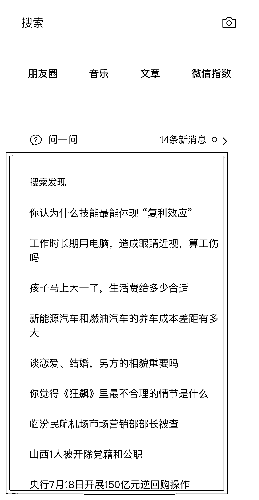
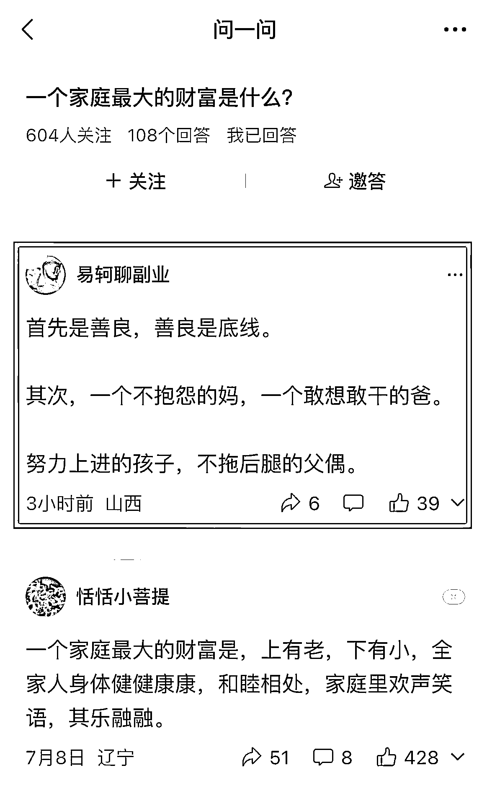

# 微信问一问涨粉、引流和变现的实操教程

> 原文：[`www.yuque.com/for_lazy/thfiu8/iktcy8dm6y1bo9x6`](https://www.yuque.com/for_lazy/thfiu8/iktcy8dm6y1bo9x6)

<ne-h2 id="5eec4f0e" data-lake-id="5eec4f0e"><ne-heading-ext><ne-heading-anchor></ne-heading-anchor><ne-heading-fold></ne-heading-fold></ne-heading-ext><ne-heading-content><ne-text id="u9e41b5ce">(83 赞)微信问一问涨粉、引流和变现的实操教程</ne-text></ne-heading-content></ne-h2> <ne-p id="ued8ec129" data-lake-id="ued8ec129"><ne-text id="ucce2e7ec">作者： 易轲</ne-text></ne-p> <ne-p id="u05647686" data-lake-id="u05647686"><ne-text id="u90f8613f">日期：2023-07-18</ne-text></ne-p> <ne-p id="u053f6558" data-lake-id="u053f6558"><ne-text id="ude382e82">生财的朋友们，大家好，我是易轲。</ne-text></ne-p> <ne-p id="ua48be897" data-lake-id="ua48be897"><ne-text id="ufd0a7d15">今天来跟大家分享一下问一问的涨粉与引流、变现的操作。</ne-text></ne-p> <ne-p id="uf8415130" data-lake-id="uf8415130"><ne-text id="uf0670ead">我现在做的第四天有两个号都已经出过爆款了，有一个视频号已经有两百个关注了。</ne-text></ne-p> <ne-p id="u99615095" data-lake-id="u99615095"><ne-card data-card-name="image" data-card-type="inline" id="L8xBo" data-event-boundary="card"></ne-card></ne-p> <ne-p id="u7bf48744" data-lake-id="u7bf48744"><ne-text id="u24663016">给公众号涨粉的问一问也涨的很猛。</ne-text></ne-p> <ne-p id="u8c88dceb" data-lake-id="u8c88dceb"><ne-text id="u264ea485">视频号是第三天两个号都破了百粉，百粉证书还有点高级。</ne-text></ne-p> <ne-p id="ucf15ad27" data-lake-id="ucf15ad27"><ne-card data-card-name="image" data-card-type="inline" id="Xwmc0" data-event-boundary="card"></ne-card></ne-p> <ne-p id="ub06af3e6" data-lake-id="ub06af3e6"><ne-text id="uba33c444">那么首先就是大家最关心的：</ne-text></ne-p> <ne-p id="u78da889f" data-lake-id="u78da889f"><ne-text id="u8c3fd04f" ne-bold="true">一、微信问一问的变现能干什么呢？</ne-text></ne-p> <ne-p id="u8347c842" data-lake-id="u8347c842"><ne-text id="u41c3d73c" ne-bold="true">第一个就是它可以给我们的公众号，还有我们的视频号涨粉。</ne-text></ne-p> <ne-p id="u27d97220" data-lake-id="u27d97220"><ne-text id="u6f7c9cb7" ne-bold="true">涨粉能带来哪些收益？</ne-text></ne-p> <ne-p id="u41a168c9" data-lake-id="u41a168c9"><ne-text id="ub6fcabd0" ne-bold="true">①简单粗暴，直接卖粉：</ne-text></ne-p> <ne-p id="ub2d8133d" data-lake-id="ub2d8133d"><ne-text id="ua2729d86">公众号的粉丝是公域平台粉丝价值最高的，粉丝都差不多在一块到十块一个。</ne-text></ne-p> <ne-p id="u407cb098" data-lake-id="u407cb098"><ne-text id="u4ad2ca26">那么通过微信问一问来的粉丝是不要钱免费的，只要你多答问题来的粉丝就越多。</ne-text></ne-p> <ne-p id="u7fce6272" data-lake-id="u7fce6272"><ne-text id="u289dfe12">如果你没有后续承接，直接把粉丝卖掉也是一笔不错的收益。</ne-text></ne-p> <ne-p id="u6caec8d1" data-lake-id="u6caec8d1"><ne-text id="u71ea8c41" ne-bold="true">②公众号流量主+广告收益：</ne-text></ne-p> <ne-p id="u3a710552" data-lake-id="u3a710552"><ne-text id="u3c538a57">你起一个新的公众号 100 粉之后可以有流量主收益。</ne-text></ne-p> <ne-p id="u770371fe" data-lake-id="u770371fe"><ne-text id="uff8ee0b9">流量主收益虽然很多人看不上，最近有一个新的项目叫做公众号爆文写作，这个我们有些小伙伴直接就是在操作的，爆了之后一篇能带来 150-1000 的收益！</ne-text></ne-p> <ne-p id="u3f4c4ae8" data-lake-id="u3f4c4ae8"><ne-text id="u15c1c701">你开通流量主之后，直接把微信问一问有热度的话题原封不动写到公众号上，每天 8 条拉满，这个钱很快就能见到效果。</ne-text></ne-p> <ne-p id="u711e9bba" data-lake-id="u711e9bba"><ne-text id="uca9be338" ne-bold="true">③开通视频号带货</ne-text></ne-p> <ne-p id="u17d82491" data-lake-id="u17d82491"><ne-text id="ucb2bd513">视频号带货这个大家都听过，那一听好像跟我们没关系。</ne-text></ne-p> <ne-p id="uc32308b0" data-lake-id="uc32308b0"><ne-text id="ud0c1ce08">我们也不卖东西，但是我们卖资料卖知识产品满</ne-text><ne-text id="u104b4e29" ne-bold="true">一千粉丝</ne-text><ne-text id="u9b069e46">之后发视频都是可以带在链接里面的。</ne-text></ne-p> <ne-p id="u88119336" data-lake-id="u88119336"><ne-text id="ua9927f20">我们开通橱窗之后以后我们的自己产品就可以发在视频号进行带货。</ne-text></ne-p> <ne-p id="u1726bbeb" data-lake-id="u1726bbeb"><ne-text id="u8c37113a">我曾经见到一个付费群里的博主专门花 1000 请小助理剪辑视频切片，做了好几个月才 200 多粉丝，而通过这个方法可能 3.4 天就可以有！</ne-text></ne-p> <ne-p id="u0d66066a" data-lake-id="u0d66066a"><ne-text id="u5905df87" ne-bold="true">④引流微信卖自己的产品</ne-text></ne-p> <ne-p id="u19da2195" data-lake-id="u19da2195"><ne-text id="uf9b08c9a">所有流量都是为了变现，如果你这个时候有自己的产品，那就更棒了！</ne-text></ne-p> <ne-p id="u493de853" data-lake-id="u493de853"><ne-text id="ua0deb748">通过操作直接就把人引流到微信呀！</ne-text></ne-p> <ne-p id="u761c4f38" data-lake-id="u761c4f38"><ne-text id="u3bbb1f50">当然了，还有一些其他的，比如问一问可能后面也会开通入驻收益，那我们提前入驻之后就能提前拿到这个红利。</ne-text></ne-p> <ne-p id="u2cddbf05" data-lake-id="u2cddbf05"><ne-text id="uacf353b9">介绍完好处下面来介绍：</ne-text></ne-p> <ne-p id="ubc799926" data-lake-id="ubc799926"><ne-text id="u2bda7b00" ne-bold="true">二、操作教程：</ne-text></ne-p> <ne-p id="ufdf28137" data-lake-id="ufdf28137"><ne-text id="u3876306c" ne-bold="true">①如何开通问一问？</ne-text></ne-p> <ne-p id="ucfc938d7" data-lake-id="ucfc938d7"><ne-text id="u8e21f786" style="color: rgba(0, 0, 0, 0.9);">问一问现在还处于内测阶段，如果你发现自己好像内测资格不够（没收到官方通知的），或想快速找到问一问入口，获得问答资格，也可以试试这个方法。</ne-text></ne-p> <ne-p id="u6d1bcaa0" data-lake-id="u6d1bcaa0"><ne-text id="u09c8f164" style="color: rgba(0, 0, 0, 0.9);">打开微信发现页，点进“搜一搜”，点击“搜索发现”下的任意一个问题，进行搜索，并点击问题。</ne-text></ne-p> <ne-p id="u08bcbfbf" data-lake-id="u08bcbfbf"><ne-text id="ue6b9c53b" style="color: rgba(0, 0, 0, 0.9);">进入问一问页面，在问题后面点击“写回答”，之后根据提示使甲视频号授权咨录就可以开进入问一问页面，在问题后面点击“写回答”，之后根据提示使用视频号授权登录，就可以开通问一问功能，进而进行问题的浏览和答案的发布。</ne-text></ne-p> <ne-p id="u4a4b0729" data-lake-id="u4a4b0729"><ne-text id="u80d8bcc0" style="color: rgba(0, 0, 0, 0.9);">这里不要求你必须回答问题，只是点下“写回答”界面即可。如果你进行了回答或者提问，审核通过之后就会展示。</ne-text></ne-p> <ne-p id="ue635fd8e" data-lake-id="ue635fd8e"><ne-text id="uf8152513" style="color: rgba(0, 0, 0, 0.9);">开通之后，再次点击“发现”“搜一搜”，就可以看到“问一问”功能。点击之后就会进入问题广场，可以去提问或者回答问题。</ne-text></ne-p> <ne-p id="ue1887cb5" data-lake-id="ue1887cb5"><ne-text id="u30f813cb" ne-bold="true">②怎么答题能更快的吸粉引流？</ne-text></ne-p> <ne-p id="u0363f332" data-lake-id="u0363f332"><ne-text id="ua4a7d79f">因为问一问登录的时候就直接需要选择用视频号或者公众号，所以直接登陆之后回答问题，别人关注你就是关注的视频号或者公众号，往视频号导粉和公众号涨粉一般还是都比较顺滑的。</ne-text></ne-p> <ne-p id="u0eb7dfbb" data-lake-id="u0eb7dfbb"><ne-text id="ubfe2f8c2">问一问答题一共有三种形式：热点问题和专业领域问题以及自问自答。</ne-text></ne-p> <ne-p id="u00d01149" data-lake-id="u00d01149"><ne-text id="udf8d4c06" ne-bold="true">最快速涨粉的就是热点问题，也是比较推荐的方式。</ne-text></ne-p> <ne-p id="u7ed6f403" data-lake-id="u7ed6f403"><ne-text id="uf2d72483">我们直接点进去就会有这样一个界面他每两个小时会更新一些问题，基本上有十个前六个你是可以回答的，后四个就是社会性新闻，暂时跟我们没关系。</ne-text></ne-p> <ne-p id="u60f27f42" data-lake-id="u60f27f42"><ne-card data-card-name="image" data-card-type="inline" id="Zsvss" data-event-boundary="card"></ne-card></ne-p> <ne-p id="u8a029e04" data-lake-id="u8a029e04"><ne-text id="u8940f6b8">这种热点问题只要你在热搜挂上去的时候点进去回答就很容易获得点赞和转发还有涨粉。</ne-text></ne-p> <ne-p id="u15a23b3d" data-lake-id="u15a23b3d"><ne-text id="u5fa8baf5">可以往我们微信导粉我现在已经有人通过这个加到了副业交流群和我的微信 。</ne-text></ne-p> <ne-p id="u5e2df710" data-lake-id="u5e2df710"><ne-text id="u819da278">什么样的回答更容易被大家点赞关注呢？</ne-text></ne-p> <ne-p id="ud358fc8a" data-lake-id="ud358fc8a"><ne-text id="ue77fb3f4">通过我的实操来说：</ne-text></ne-p> <ne-p id="u85f15e29" data-lake-id="u85f15e29"><ne-text id="u01ea2a3d" ne-bold="true">第一个就是：</ne-text><ne-text id="u2f4f87d8">问题回答得越少你回答的越早就越容易爆，反之，如果这个已经有很多人回答了，你的回答就很难脱颖而出。</ne-text></ne-p> <ne-p id="uf3b20ba7" data-lake-id="uf3b20ba7"><ne-text id="uadf55fdc" ne-bold="true">第二个就是：</ne-text><ne-text id="ubda5ba9a">字数越少，格式越工整，答案越精炼越容易爆。</ne-text></ne-p> <ne-p id="u049514d9" data-lake-id="u049514d9"><ne-text id="ub2878102" ne-bold="true">第三个就是：</ne-text><ne-text id="u95e43afc">你能引起共鸣引起情绪的语气，越口语化的越容易爆。</ne-text></ne-p> <ne-p id="uabe7561b" data-lake-id="uabe7561b"><ne-text id="u74399816">这么说还是不太明白，那我们直接怎么样呢？</ne-text></ne-p> <ne-p id="uc19d815b" data-lake-id="uc19d815b"><ne-text id="u3c2e444d" ne-bold="true">复制爆款，自媒体的逻辑就是这样，一通百通。</ne-text></ne-p> <ne-p id="u1165f46f" data-lake-id="u1165f46f"><ne-text id="u771a80a7">我们点进去问题点赞排名榜第一的是什么，我们可以再往下翻几个，把前五个答案结合一下，用自己的话说出来，比如我的这两个排名第一的都是这样的方式。</ne-text></ne-p> <ne-p id="udc02bc8b" data-lake-id="udc02bc8b"><ne-card data-card-name="image" data-card-type="inline" id="Hj9jE" data-event-boundary="card"></ne-card></ne-p> <ne-p id="uca2adfce" data-lake-id="uca2adfce"><ne-text id="u430007f1">那么除了热点问题</ne-text><ne-text id="u239d2afc" ne-bold="true">第二个就是可以搜索我们的专业问题：</ne-text></ne-p> <ne-p id="u665caf99" data-lake-id="u665caf99"><ne-text id="u4372b26a">比如说做的资料的领域就可以直接搜怎么备考，如果有人询问你在下面直接点击回答就行。</ne-text></ne-p> <ne-p id="ue6e1f581" data-lake-id="ue6e1f581"><ne-text id="u7965e3a9" ne-bold="true">第三种就是可以自问自答：</ne-text></ne-p> <ne-p id="ucea660d8" data-lake-id="ucea660d8"><ne-text id="uc90a66c6">因为微信问一问刚上线不久所以知道的人还比较少，问题也会比较少这个时候我们就可以自己提出问题在自己解答。</ne-text></ne-p> <ne-p id="u5c222239" data-lake-id="u5c222239"><ne-text id="uaf14c5b1" ne-bold="true">三、怎么导流微信呢？</ne-text></ne-p> <ne-p id="ubd3337a7" data-lake-id="ubd3337a7"><ne-text id="u2b6d4962">微信问一问发布之后就可以引流到视频号，虽然微信问一问不允许我们发营销类的内容。</ne-text></ne-p> <ne-p id="u26404394" data-lake-id="u26404394"><ne-text id="udd959af6">但是视频号的名字可以直接写微信，也可以在视频号直接发布带自己微信二维码的视频。</ne-text></ne-p> <ne-p id="u011bfae4" data-lake-id="u011bfae4"><ne-text id="ucb227271">可以设置钩子引流到微信领资料，比如你是副业领域的，可以直接设置一百份可以做的小副业等。</ne-text></ne-p> <ne-p id="uda40e644" data-lake-id="uda40e644"><ne-text id="uf7586811">OK，以上就是整个流程啦，这就是一个信息差的小项目。</ne-text></ne-p> <ne-p id="ub46f4d0e" data-lake-id="ub46f4d0e"><ne-text id="uf191e8bb">干吧！</ne-text></ne-p> <ne-hole id="uc8bfd333" data-lake-id="uc8bfd333"><ne-card data-card-name="hr" data-card-type="block" id="jLJmt" data-event-boundary="card"><ne-p id="uc73ee4e2" data-lake-id="uc73ee4e2"><ne-text id="u36990f74">评论区：</ne-text></ne-p> <ne-p id="ud2cc0279" data-lake-id="ud2cc0279"><ne-text id="u381fc4d3">在路上 : 亲测 有效[呲牙]</ne-text> <ne-text id="u651ef21a">易轲 : 有用就好啊[呲牙]</ne-text> <ne-text id="u34a9ee61">坏孩（大学生） : 微信问一问现在入局还卷吗</ne-text> <ne-text id="u5e3e961a">易轲 : 个人觉得还好耶</ne-text> <ne-text id="u0f3c6d6d">易轲 : 基本上你回答问题就会有点赞和关注</ne-text> <ne-text id="u2042bdab">易轲 : 时不时还会出一个爆款热门</ne-text> <ne-text id="u3e232f97">坏孩（大学生） : 感谢</ne-text> <ne-text id="ud2b100d6">雅俊 : 不错</ne-text></ne-p> <ne-p id="u3c3416a7" data-lake-id="u3c3416a7"><ne-card data-card-name="image" data-card-type="inline" id="cK2Jj" data-event-boundary="card">  <ne-hole id="ufcc9ffdc" data-lake-id="ufcc9ffdc"><ne-card data-card-name="hr" data-card-type="block" id="Yo2ah" data-event-boundary="card"></ne-card></ne-hole></ne-card></ne-p></ne-card></ne-hole>