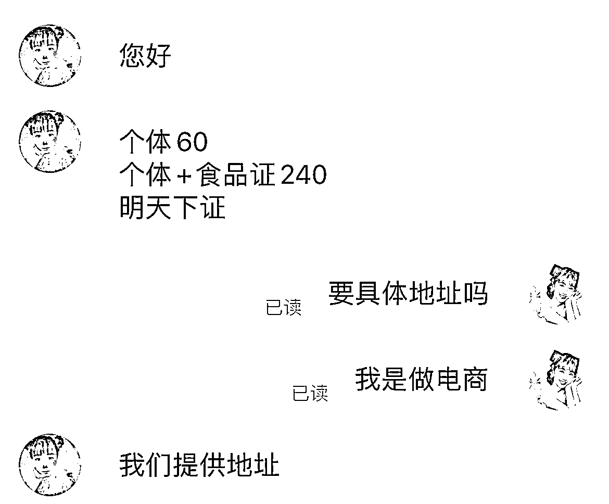
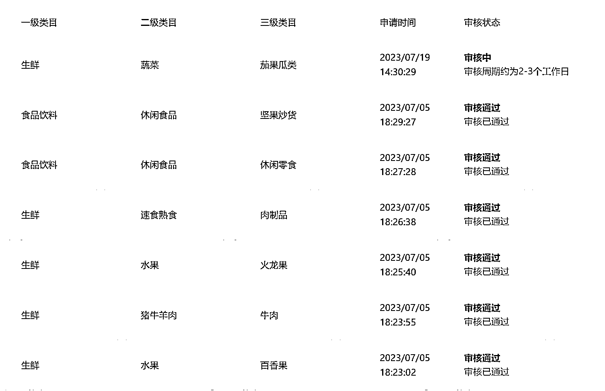
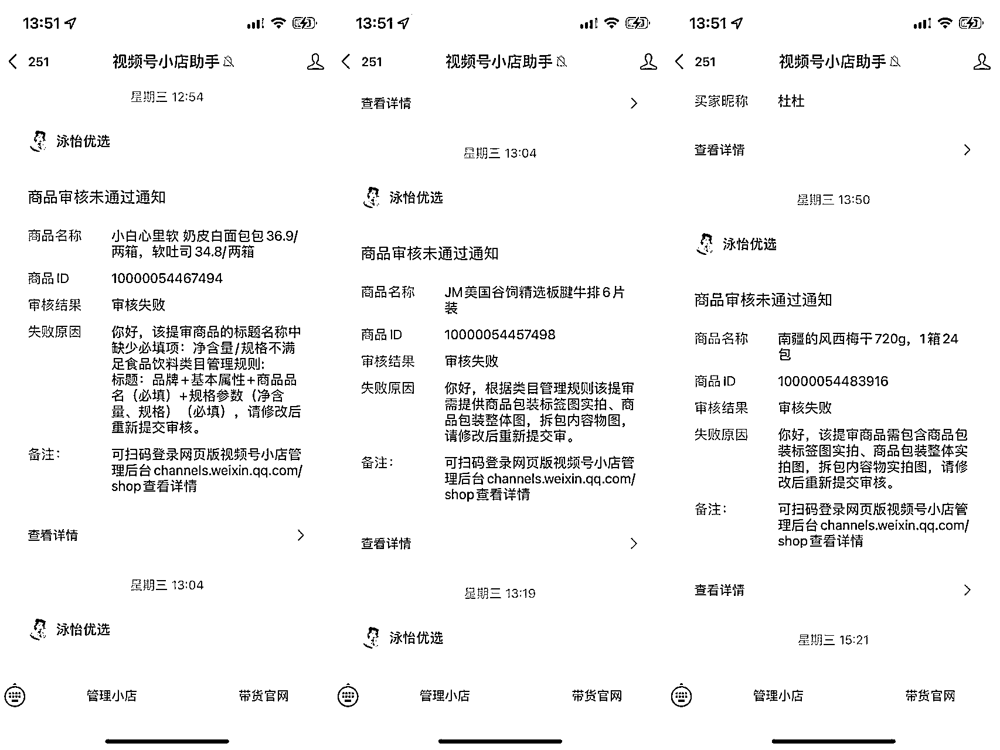
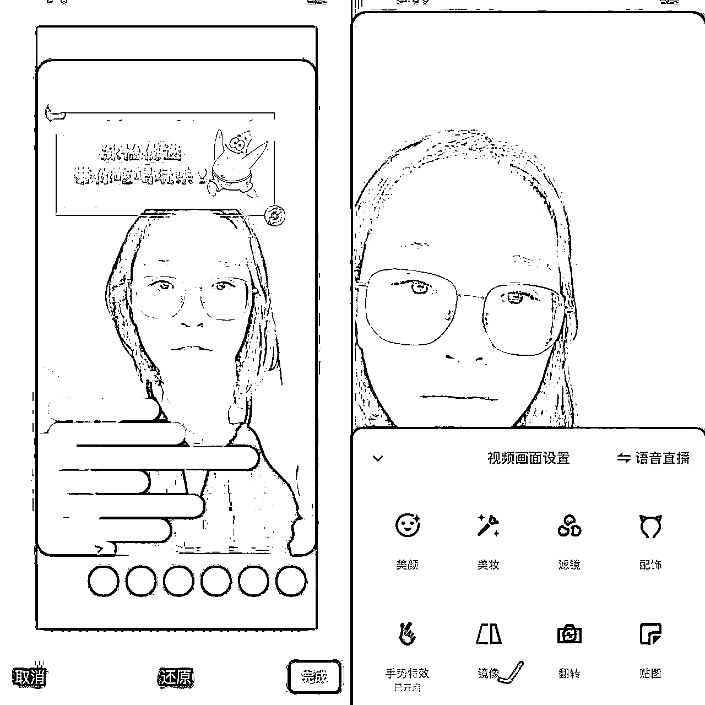
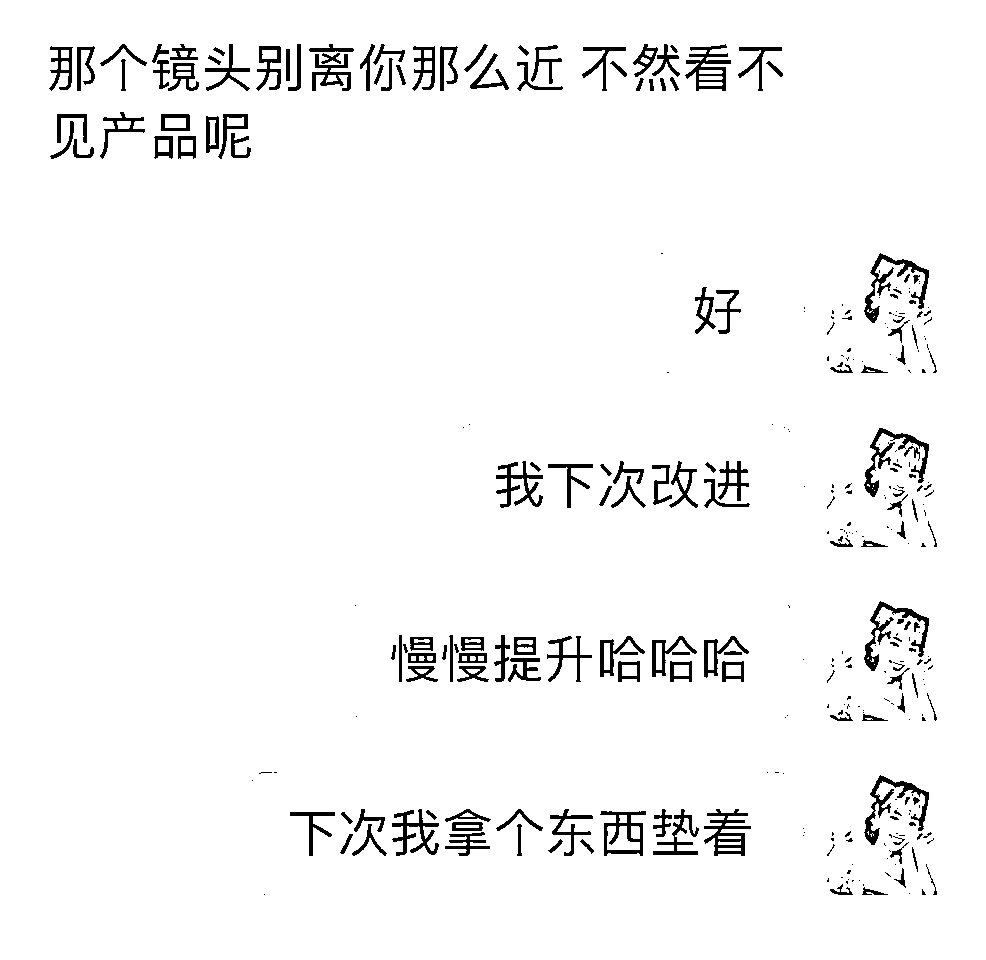

# 90 后宝妈首次直播带货 2 小时，三款低客单产品打造 2700+GMV

> 原文：[`www.yuque.com/for_lazy/thfiu8/vh8g69snpiv2hlm3`](https://www.yuque.com/for_lazy/thfiu8/vh8g69snpiv2hlm3)

<ne-h2 id="2ed8cfa6" data-lake-id="2ed8cfa6"><ne-heading-ext><ne-heading-anchor></ne-heading-anchor><ne-heading-fold></ne-heading-fold></ne-heading-ext><ne-heading-content><ne-text id="ub6412792">(55 赞)90 后宝妈首次直播带货 2 小时，三款低客单产品打造 2700+GMV</ne-text></ne-heading-content></ne-h2> <ne-p id="u6a0ae79b" data-lake-id="u6a0ae79b"><ne-text id="ua5a7aa33">作者： 泳怡</ne-text></ne-p> <ne-p id="u443ba484" data-lake-id="u443ba484"><ne-text id="u05ec6d70">日期：2023-07-19</ne-text></ne-p> <ne-p id="u5feb16b9" data-lake-id="u5feb16b9"><ne-text id="u22b98a3c">大家好，我是泳怡</ne-text></ne-p> <ne-p id="u79c667ef" data-lake-id="u79c667ef"><ne-text id="u78196f88">我先来做个简单的自我介绍，20 年开始做母婴社群带货，到现在也 3 年的时间，基本是在私域里卖货，从社群主到个人 IP，做到了年流水 200wGMV，500 个社群成员，人均复购率 80-100 次（详情可以看我之前的文章）</ne-text></ne-p> <ne-p id="uf8cb3476" data-lake-id="uf8cb3476"><ne-text id="u8a39fe6e">以往我都是在社群和朋友圈，或者客户私聊里卖货，算是比较私密的环境，基本没走过公域，今年想有点新的突破，于是想策划自己的小店</ne-text><ne-text id="u89506843" ne-bold="true">“泳怡优选”</ne-text><ne-text id="ue566443a">在视频号开启自己的直播带货。</ne-text></ne-p> <ne-p id="u370467b2" data-lake-id="u370467b2"><ne-text id="u82bd65c3">说干就干，7 月 12 日 10：30，正式开启了自己的第一场带货直播</ne-text></ne-p> <ne-p id="u76722480" data-lake-id="u76722480"><ne-text id="u71d1d0da">总时长 2 小时，3 款产品，总成交 2700+GMV，39 个订单，场观 350+，最高在线 35 人（超真实数据）</ne-text></ne-p> <ne-p id="u64ef0c87" data-lake-id="u64ef0c87"><ne-text id="ueda9dd48">今天就针对这一场直播，来做一个详细的复盘，希望能给到想做带货的小伙伴们一点帮助</ne-text></ne-p> <ne-p id="u5e89eeba" data-lake-id="u5e89eeba"><ne-card data-card-name="image" data-card-type="inline" id="hvfps" data-event-boundary="card"></ne-card></ne-p> <ne-h2 id="3f8c4dd8" data-lake-id="3f8c4dd8"><ne-heading-ext><ne-heading-anchor></ne-heading-anchor><ne-heading-fold></ne-heading-fold></ne-heading-ext><ne-heading-content><ne-text id="uaa2bcd98" ne-bold="true">一、我为什么想做直播带货</ne-text></ne-heading-content></ne-h2> <ne-h3 id="b9d1708c" data-lake-id="b9d1708c"><ne-heading-ext><ne-heading-anchor></ne-heading-anchor><ne-heading-fold></ne-heading-fold></ne-heading-ext><ne-heading-content><ne-text id="u7cfe360f">1.传统私域带货遇到了瓶颈</ne-text></ne-heading-content></ne-h3> <ne-p id="u7d74d53c" data-lake-id="u7d74d53c"><ne-text id="ua88af880">不知不觉做私域卖货也三年了，你说没有困难铁定是不可能的，尤其我还是以卷中之卷的快团团为主，我拿母婴来举例，现在哪个宝妈手里没有几个快团团群，我在小区电梯里都看到好几个妈妈同时在刷快团团的页面，</ne-text><ne-text id="u333752f5" ne-bold="true">竞争激烈</ne-text><ne-text id="u64ae49e0">不说，</ne-text><ne-text id="u30359b09" ne-bold="true">同质化的产品和价格</ne-text><ne-text id="u33ec2231">，让我失去了一部分的优势，你说价格都一样，去哪买不是买，而且也会有同行自己降佣金，就跟一些保险人员，自愿返 cps 给你抢客户是一样的，</ne-text><ne-text id="ue0b1adda" ne-bold="true">劣币驱逐良币</ne-text><ne-text id="uedaed60c">的环境也越发明显。</ne-text></ne-p> <ne-p id="u2a92a6b1" data-lake-id="u2a92a6b1"><ne-text id="u184f9594">销售数据日渐下滑，从一开始的日销 1w+，到现在淡季 3-5000 一天，佣金大概在 10-20%，也就是一天赚几百块。</ne-text></ne-p> <ne-p id="u87eebce5" data-lake-id="u87eebce5"><ne-text id="uca417c05">最重要的是，</ne-text><ne-text id="u8fddb108" ne-bold="true">我们的利润，跟团长们的选品紧紧相依</ne-text><ne-text id="u7238c03e">，他们今天选了又高佣又好的产品，我们就能赚多点，他们今天选了一单利润 3 块的，我们卖 100 单也是赚 300 块，等于把自己吃饭的家伙都绑定在了别人的手上，依赖性太强，这不属于我的风格，方法总比困难多嘛，所以我下定决心要寻求突破，根据我深耕了三年私域 C 端用户的优势，我认为在视频号里直播带货就是个好机会。</ne-text></ne-p> <ne-h3 id="9039450f" data-lake-id="9039450f"><ne-heading-ext><ne-heading-anchor></ne-heading-anchor><ne-heading-fold></ne-heading-fold></ne-heading-ext> <ne-heading-content></ne-heading-content></ne-h3> <ne-h3 id="4b8d742a" data-lake-id="4b8d742a"><ne-heading-ext><ne-heading-anchor></ne-heading-anchor><ne-heading-fold></ne-heading-fold></ne-heading-ext><ne-heading-content><ne-text id="ucd2b7a96">2.认识了靠谱、同频的供应链</ne-text></ne-heading-content></ne-h3> <ne-p id="u1a7a2cb5" data-lake-id="u1a7a2cb5"><ne-text id="u9281d1af">直播带货这件事其实我去年就在想了，但一直没找到好的供应链，首先我的定位先以吃喝玩乐为主，但你能找到</ne-text><ne-text id="u75ac8254" ne-bold="true">稳定、严格、有品控，售后好的供应链</ne-text><ne-text id="u71a0c472">是真的不容易，还得建立</ne-text><ne-text id="u7febfe6a" ne-bold="true">重要的信任感</ne-text><ne-text id="u12bfa5a2">，所以一直搁置，正好在生财的快团航海里，我认识了</ne-text><ne-text id="udb138e64" ne-bold="true">星宇、月亮和 blue</ne-text><ne-text id="u1c8b3b13">等一众供应链教练，他们不仅专业，还有着令人发指的严格品控，比如说星宇和月亮就是中国农业大学的优秀毕业生，食品、生鲜都不在话下，深藏 blue 和他的伙伴都是美国肉联厂出来的资深经理，经过好几轮的磨合，他们的产品不仅在我的社群里拿到了很好的反馈，售后率也稳定控制在 1%，期间我还卖爆了一款荔枝王，一个人卖出 130 单+</ne-text></ne-p> <ne-p id="uf93aecf8" data-lake-id="uf93aecf8"><ne-text id="u59300ff6">有了靠谱的供应链大腿，那基本东风就借齐了</ne-text></ne-p> <ne-p id="u48c72e28" data-lake-id="u48c72e28"><ne-text id="u1a3ca034">起码在我直播间下单的产品，都必须是好东西，也是立好口碑的基础条件。</ne-text></ne-p> <ne-h3 id="4d0df303" data-lake-id="4d0df303"><ne-heading-ext><ne-heading-anchor></ne-heading-anchor><ne-heading-fold></ne-heading-fold></ne-heading-ext><ne-heading-content><ne-text id="uf05d479e">3.通过多维度的展现，增加自己的影响力</ne-text></ne-heading-content></ne-h3> <ne-p id="ubdeb4137" data-lake-id="ubdeb4137"><ne-text id="u3aac1486">在越发内卷的时代，我始终认为</ne-text><ne-text id="uf295246b" ne-bold="true">超级个体</ne-text><ne-text id="u421b1155">才是我目前最好的出路，</ne-text><ne-text id="ue6dd914a" ne-bold="true">只有打造好影响力，才能成为我的护城河。</ne-text></ne-p> <ne-p id="u1343cafb" data-lake-id="u1343cafb"><ne-text id="u2dabd95a">通过直播、短视频、文字输出等多维的方式，去转化更多铁粉，而直播和短视频是最直观的方式，每周 2 次的直播，一天一条日更短视频，能让更多转化进私域的人，我简称朋友圈的精神股东们，</ne-text><ne-text id="ubb816233" ne-bold="true">能认识我多一点，不熟悉的人可以熟悉我，不信任我的人可以信任我，不喜欢我的人可以喜欢我。</ne-text></ne-p> <ne-p id="udc9d91b7" data-lake-id="udc9d91b7"><ne-text id="u00f49183" ne-bold="true">直播不仅是带货，更是价值观的输出</ne-text></ne-p> <ne-p id="ud3cb293c" data-lake-id="ud3cb293c"><ne-text id="ua0021244" ne-bold="true">你以为我卖的是产品，其实卖的是更优质的生活方式。</ne-text></ne-p> <ne-p id="u30cc82a8" data-lake-id="u30cc82a8"><ne-text id="u333d88ab" ne-bold="true">你以为我卖的是产品，其实我卖的是有趣的灵魂。</ne-text></ne-p> <ne-h2 id="9d99eaa5" data-lake-id="9d99eaa5"><ne-heading-ext><ne-heading-anchor></ne-heading-anchor><ne-heading-fold></ne-heading-fold></ne-heading-ext><ne-heading-content><ne-text id="u0c1e3b5b">二、视频号的直播带货有什么方式</ne-text></ne-heading-content></ne-h2> <ne-h3 id="220e21c2" data-lake-id="220e21c2"><ne-heading-ext><ne-heading-anchor></ne-heading-anchor><ne-heading-fold></ne-heading-fold></ne-heading-ext><ne-heading-content><ne-text id="u109156e8">1.自营小店</ne-text></ne-heading-content></ne-h3> <ne-p id="udf39b268" data-lake-id="udf39b268"><ne-text id="u3030e3e4">如果你想卖自己的产品，可以选择注册自己的自营小店，有</ne-text><ne-text id="u9675784b" ne-bold="true">企业和个体工商户</ne-text><ne-text id="u30d2b547">两种。</ne-text></ne-p> <ne-p id="u076118cd" data-lake-id="u076118cd"><ne-text id="u93574591">目前开放近 2000 个类目，关于类目范围和申请资质可以在视频号网页版看详情，这里就不多赘述了</ne-text></ne-p> <ne-p id="u79ad5c29" data-lake-id="u79ad5c29"><ne-text id="u51805114">企业需要：</ne-text><ne-text id="ud3755671" ne-bold="true">营业执照、法人身份证、公户信息</ne-text></ne-p> <ne-p id="uba5051c7" data-lake-id="uba5051c7"><ne-text id="uce568ae1">这里一定要注意！！没有公户是无法完成注册的，而且银行对于公户的审核很严格，建议大家还是走个体工商户比较方便</ne-text></ne-p> <ne-p id="ud9571fde" data-lake-id="ud9571fde"><ne-text id="u0f63159f">个体工商户：</ne-text><ne-text id="u22728a35" ne-bold="true">个体工商营业执照、身份证，要求的资质</ne-text></ne-p> <ne-p id="u419d1ec8" data-lake-id="u419d1ec8"><ne-text id="u7f28df59">比如我是有卖食品，所以需要食品许可，然后我在万能的 pdd 花了 240 元注册了一个昆明的个体工商户+食品证，成功完成注册。</ne-text></ne-p> <ne-p id="u9ada1bd5" data-lake-id="u9ada1bd5"><ne-card data-card-name="image" data-card-type="inline" id="iy7ls" data-event-boundary="card"></ne-card></ne-p> <ne-h3 id="a1f6d7d0" data-lake-id="a1f6d7d0"><ne-heading-ext><ne-heading-anchor></ne-heading-anchor><ne-heading-fold></ne-heading-fold></ne-heading-ext><ne-heading-content><ne-text id="u5748759a">2.视频号自带的选品中心</ne-text></ne-heading-content></ne-h3> <ne-p id="u07f6a7f8" data-lake-id="u07f6a7f8"><ne-text id="uce0dbd08">如果你是个人，没有供应链，但又想直播带货，那可以尝试在视频号的选品中心里选几款不错的产品，进行短视频和直播带货，由后台直接发货，还不需要写链接，省心省事</ne-text></ne-p> <ne-p id="uf737ee35" data-lake-id="uf737ee35"><ne-text id="u35cd6b42">我看过一个大 V，在视频号里火了之后，每次直播在选品中心里选一款产品，一整晚就围绕这款产品在介绍，效果也很好。</ne-text></ne-p> <ne-p id="ud8b0112b" data-lake-id="ud8b0112b"><ne-text id="u43a89982"><ne-card data-card-name="image" data-card-type="inline" id="NrEKf" data-event-boundary="card"></ne-card></ne-text></ne-p> <ne-h2 id="9039450f-1" data-lake-id="9039450f-1"><ne-heading-ext><ne-heading-anchor></ne-heading-anchor><ne-heading-fold></ne-heading-fold></ne-heading-ext> <ne-heading-content></ne-heading-content></ne-h2> <ne-h2 id="b21dc7d5" data-lake-id="b21dc7d5"><ne-heading-ext><ne-heading-anchor></ne-heading-anchor><ne-heading-fold></ne-heading-fold></ne-heading-ext><ne-heading-content><ne-text id="u991e52cc">三、开启直播带货需要做些什么</ne-text></ne-heading-content></ne-h2> <ne-h4 id="f4b92ead" data-lake-id="f4b92ead"><ne-heading-ext><ne-heading-anchor></ne-heading-anchor><ne-heading-fold></ne-heading-fold></ne-heading-ext><ne-heading-content><ne-text id="uc176da81">1.完成注册后，首先根据类目需求，先</ne-text><ne-text id="ud1a7f198" ne-bold="true">缴纳保证金</ne-text><ne-text id="ubbe05d1a">，根据类目不同，保证金要求也不一样。</ne-text></ne-heading-content></ne-h4> <ne-p id="u55e32d53" data-lake-id="u55e32d53"><ne-text id="uebb9bca0">保证金是可以退还的</ne-text></ne-p> <ne-p id="u6da11cc7" data-lake-id="u6da11cc7"><ne-card data-card-name="image" data-card-type="inline" id="g2y0U" data-event-boundary="card"></ne-card></ne-p> <ne-p id="u59f23a53" data-lake-id="u59f23a53"><ne-card data-card-name="image" data-card-type="inline" id="u7Alz" data-event-boundary="card"></ne-card></ne-p> <ne-p id="u585460fe" data-lake-id="u585460fe"><ne-text id="ud9280a88">缴纳完保证金就可以申请对应的类目，审核时间大概是 1 天内</ne-text></ne-p> <ne-h4 id="b7b664be" data-lake-id="b7b664be"><ne-heading-ext><ne-heading-anchor></ne-heading-anchor><ne-heading-fold></ne-heading-fold></ne-heading-ext><ne-heading-content><ne-text id="u836d6ee7">2.选好产品进行上架</ne-text></ne-heading-content></ne-h4> <ne-p id="ufceb9b39" data-lake-id="ufceb9b39"><ne-text id="u39bfd297" ne-bold="true">a.选品</ne-text></ne-p> <ne-p id="u1320cb21" data-lake-id="u1320cb21"><ne-text id="u47e53e7d">在供应链的产品库里，先选择几款比较适合带货，能直观呈现的产品。</ne-text></ne-p> <ne-p id="u0b11749b" data-lake-id="u0b11749b"><ne-text id="u6005fed5">比如我，就选了当季的火龙果、百香果,在速食这块，我选了鸭血粉丝汤，现场煮起来画面会比较诱人和丰富，而且这几款产品在社群里卖了几波反馈都不错，我也比较有信心。</ne-text></ne-p> <ne-p id="ub4a90135" data-lake-id="ub4a90135"><ne-text id="u4a318731">所以我总结出新手直播带货选品的几个逻辑：</ne-text></ne-p> <ne-p id="u6a3ee6ce" data-lake-id="u6a3ee6ce"><ne-text id="u0071d5f9" ne-bold="true">应季、刚需</ne-text></ne-p> <ne-p id="u2f8184d8" data-lake-id="u2f8184d8"><ne-text id="u4f18d740" ne-bold="true">性价比高</ne-text></ne-p> <ne-p id="ubd9e087a" data-lake-id="ubd9e087a"><ne-text id="ubcf87a4a" ne-bold="true">主播能直观呈现、好讲</ne-text></ne-p> <ne-p id="u4f297cd9" data-lake-id="u4f297cd9"><ne-text id="ub4ff48fd">（比如现场切开很漂亮、主播能直接开吃跟大家分享的）</ne-text></ne-p> <ne-p id="uc758b9c4" data-lake-id="uc758b9c4"><ne-text id="ub5f2ec18">如果你一开始会害怕镜头，倒不如尝试一些吃吃喝喝的产品，不知道说什么直接开吃也是个好方法。</ne-text></ne-p> <ne-p id="u9f7e1512" data-lake-id="u9f7e1512"><ne-text id="u7c98f32f">如果是新手，建议一开始不要选太多产品，建议 1-3 款即可，每款产品可以花多点时间去讲解，去找感觉，卖太多反而会手忙脚乱。</ne-text></ne-p> <ne-p id="u92bc6b46" data-lake-id="u92bc6b46"><ne-text id="ua20f291e" ne-bold="true">b.上品</ne-text></ne-p> <ne-p id="uc4a8e229" data-lake-id="uc4a8e229"><ne-text id="u863d6bb0">在这里用血泪经验告诫大家，</ne-text><ne-text id="u36ea55cc" ne-bold="true">上产品一定要提前提前再提前</ne-text><ne-text id="u69b3a273">！我就是以为交了保证金以及有资质就没啥问题了，正好碰上个周末很忙，我就只留了两天时间，没想到审核一次就得 3 小时以上，有时候还得 5-7 小时才会告知你结果，我一个火龙果都快弄了一天的时间，最后原定计划的六款产品最后只成功上架了三款。</ne-text></ne-p> <ne-p id="u743b7d90" data-lake-id="u743b7d90"><ne-text id="u373306d8">视频号的要求极其严苛</ne-text></ne-p> <ne-p id="ueaea5066" data-lake-id="ueaea5066"><ne-card data-card-name="image" data-card-type="inline" id="OrWEK" data-event-boundary="card"></ne-card></ne-p> <ne-p id="u7e237704" data-lake-id="u7e237704"><ne-card data-card-name="image" data-card-type="inline" id="dkVf4" data-event-boundary="card"></ne-card></ne-p> <ne-p id="uac0183f8" data-lake-id="uac0183f8"><ne-card data-card-name="image" data-card-type="inline" id="W3rBo" data-event-boundary="card"></ne-card></ne-p> <ne-p id="u1162febd" data-lake-id="u1162febd"><ne-text id="u510b2e61" ne-bold="true">视频号上产品链接，必须严格按照他们的要求来</ne-text><ne-text id="ueee5535e">，比如说商品的外包装、标签图，正面图、打开的内里实拍等等，连顺序都是有要求的，这还没完，包括我的食品经营许可，产品的检验报告、经营许可、海关进口货物报关单、出入境检验检疫等都是需要出示的，以及文案内不许出现 emoji 表情，“最棒”“最好”等夸张的形容词，所以内容也要言简意赅。</ne-text></ne-p> <ne-p id="ua61df25d" data-lake-id="ua61df25d"><ne-text id="u1c1ef7f5">小技巧：一般不通过会在 2 小时内出结果，我也试过 10 分钟内出通知，看到失败的通知就赶紧按要求去改，争取三次内成功，不然通过概率就小了。</ne-text></ne-p> <ne-p id="u7622b2d8" data-lake-id="u7622b2d8"><ne-text id="u9c4d2125">所以靠谱的供应链价值在这时就体现出来了，你需要什么资料、资质能立马提供给你，除了能保证产品质量，更能给你保驾护航。</ne-text></ne-p> <ne-h4 id="9039450f-2" data-lake-id="9039450f-2"><ne-heading-ext><ne-heading-anchor></ne-heading-anchor><ne-heading-fold></ne-heading-fold></ne-heading-ext> <ne-heading-content></ne-heading-content></ne-h4> <ne-h4 id="d0d7c3a0" data-lake-id="d0d7c3a0"><ne-heading-ext><ne-heading-anchor></ne-heading-anchor><ne-heading-fold></ne-heading-fold></ne-heading-ext><ne-heading-content><ne-text id="u860769bb" ne-bold="true">3.搭建好直播间场景</ne-text></ne-heading-content></ne-h4> <ne-p id="u925a06dd" data-lake-id="u925a06dd"><ne-text id="uc786efa3">首先，直播间的场景也是很重要的，没有预算的可以先在家里整理出一片空间直播，有预算的，比如我，就在家附近光速以 1500 一个月的价格合租了一间独立的办公室，不仅可以仓储放样品，其余时间还能办公，注意！你直播的地方网速一定要好，最忌讳播着播着卡住了，那样你做再多前期准备都没用。</ne-text></ne-p> <ne-p id="u7a4d4e6b" data-lake-id="u7a4d4e6b"><ne-text id="uf07f70ee">最好是白墙，这样后期上 OBS 或者绿幕比较方便</ne-text></ne-p> <ne-p id="ud5f6f936" data-lake-id="ud5f6f936"><ne-card data-card-name="image" data-card-type="inline" id="VsPfA" data-event-boundary="card"></ne-card></ne-p> <ne-p id="u46df3948" data-lake-id="u46df3948"><ne-text id="u7ba85ee4" ne-bold="true">采购好直播的常规装备，如拍摄架、直播灯、手牌等</ne-text></ne-p> <ne-p id="u04d98822" data-lake-id="u04d98822"><ne-text id="uedd2dbd6" ne-bold="true">当天直播还需要一台电脑，实时看后台订单，一台手机直播，可备用一台手机在旁边录素材，还要准备一台 ipad 看资料，方便主播介绍。</ne-text></ne-p> <ne-p id="ufc1cad03" data-lake-id="ufc1cad03"><ne-text id="u2f3bd8bb">第二类装备，比如我是有涉及到要现场烹饪的食材，所以需要空气炸锅、电磁炉锅、一次性碗筷等，这个按可以按需求采购。</ne-text></ne-p> <ne-h4 id="aed4cdd1" data-lake-id="aed4cdd1"><ne-heading-ext><ne-heading-anchor></ne-heading-anchor><ne-heading-fold></ne-heading-fold></ne-heading-ext><ne-heading-content><ne-text id="u6568289b">4.提前安排好样品</ne-text></ne-heading-content></ne-h4> <ne-p id="ud6153f5c" data-lake-id="ud6153f5c"><ne-text id="u33a18396">将要直播的产品，提前跟供应链下好单，最好提前 2-3 天的时间到达，另外，水果类产品为了保证新鲜，最好是提前 1-2 天顺丰送达，合理规划好时间，还能给短视频拍摄留出时间</ne-text></ne-p> <ne-h4 id="9039450f-3" data-lake-id="9039450f-3"><ne-heading-ext><ne-heading-anchor></ne-heading-anchor><ne-heading-fold></ne-heading-fold></ne-heading-ext> <ne-heading-content></ne-heading-content></ne-h4> <ne-h4 id="7fe0d30a" data-lake-id="7fe0d30a"><ne-heading-ext><ne-heading-anchor></ne-heading-anchor><ne-heading-fold></ne-heading-fold></ne-heading-ext><ne-heading-content><ne-text id="ue2db6056">5.建立直播预告，并拍系列短视频进行预热</ne-text></ne-heading-content></ne-h4> <ne-p id="ub4e7d631" data-lake-id="ub4e7d631"><ne-text id="u885f0914">提前一周做好直播预约，建好主题，并将二维码发到社群、朋友圈等</ne-text></ne-p> <ne-p id="uebc660a1" data-lake-id="uebc660a1"><ne-text id="u21d7c1d5">（也可把二维码嫁接在直播宣传海报上，我个人习惯前者）</ne-text></ne-p> <ne-p id="u03a0f0f0" data-lake-id="u03a0f0f0"><ne-card data-card-name="image" data-card-type="inline" id="T75xv" data-event-boundary="card"></ne-card></ne-p> <ne-p id="u2ef77217" data-lake-id="u2ef77217"><ne-text id="u204d9565">我在开播前一周，先更新了一条口播视频，官宣我要做直播带货</ne-text></ne-p> <ne-p id="u9adf7115" data-lake-id="u9adf7115"><ne-text id="u22f1496b">接下来的几天，我更新了 3 条《90 后宝妈自媒体创业的 vlog》，展示自己的生活和工作，在不经意间呈现了很多关于我直播带货的前期工作准备，累计播放量超过 5000+，直播预约拉到了 100+</ne-text></ne-p> <ne-p id="u14caf05a" data-lake-id="u14caf05a"><ne-card data-card-name="image" data-card-type="inline" id="PUP2R" data-event-boundary="card"></ne-card></ne-p> <ne-h4 id="9039450f-4" data-lake-id="9039450f-4"><ne-heading-ext><ne-heading-anchor></ne-heading-anchor><ne-heading-fold></ne-heading-fold></ne-heading-ext> <ne-heading-content></ne-heading-content></ne-h4> <ne-h4 id="753fd2f4" data-lake-id="753fd2f4"><ne-heading-ext><ne-heading-anchor></ne-heading-anchor><ne-heading-fold></ne-heading-fold></ne-heading-ext><ne-heading-content><ne-text id="uf1bb7626">6.摇人帮忙</ne-text></ne-heading-content></ne-h4> <ne-p id="u913c671d" data-lake-id="u913c671d"><ne-text id="u36aa49b1">如果你是卖护肤、彩妆，或者单一品类，自己一个人也是没问题的</ne-text></ne-p> <ne-p id="u1bcca449" data-lake-id="u1bcca449"><ne-text id="uab3fdcfe">但我初定直播的产品有六种，一半是需要现场烹饪的，涉及的道具很多，为了保险起见，我还是摇了我的小助理从广州过来帮忙，我们之前在开服装店的时候，就磨合过好几次直播，也有了经验，所以有她在就基本没问题。</ne-text></ne-p> <ne-p id="uc7e6f6ec" data-lake-id="uc7e6f6ec"><ne-text id="u6fa930a5">当妈就是不容易，没人帮她带孩子，于是她带着女儿，一大早坐高铁赶过来帮我，还好我干女儿非常乖，就在一边陪我直播，这里尤其要注意，</ne-text><ne-text id="u22daf5ec" ne-bold="true">未成年人是一定！绝对！不可以入镜的！被发现的话可能是终生封号！</ne-text></ne-p> <ne-p id="u42452bea" data-lake-id="u42452bea"><ne-text id="u769ef1eb">直播途中，我主要负责讲解产品，小助理负责提前准备好道具和产品，比如我煮鸭血粉丝汤，她就会帮我提前把水煮沸，比如我要展示百香果蜂蜜气泡水，她就提前帮我泡好，还一直在后台看数据，给我省去了很多时间，也在一定程度上保证了主播一直在镜头前。</ne-text></ne-p> <ne-h4 id="4bdab483" data-lake-id="4bdab483"><ne-heading-ext><ne-heading-anchor></ne-heading-anchor><ne-heading-fold></ne-heading-fold></ne-heading-ext><ne-heading-content><ne-text id="u42882921">7.设计好直播流程</ne-text></ne-heading-content></ne-h4> <ne-p id="ud780fea4" data-lake-id="ud780fea4"><ne-text id="u83876bb4">可以先大致写好第一版流程，没问题就可以开始梳理所有的细节</ne-text></ne-p> <ne-p id="u5f487245" data-lake-id="u5f487245"><ne-text id="u07a44282">因为我们没有专业团队，只是个人直播，所以建议</ne-text><ne-text id="u3f845b7d" ne-bold="true">在脑海中跑一遍全流程，细化到每一个道具</ne-text><ne-text id="ua99dba6f">（可以参考右图）保证直播过程中不要因缺少小道具出现失误，比如我就百密一疏，漏了开苏打水的起子。</ne-text></ne-p> <ne-p id="uf04193e9" data-lake-id="uf04193e9"><ne-card data-card-name="image" data-card-type="inline" id="c9Wur" data-event-boundary="card"></ne-card></ne-p> <ne-h4 id="cb1a867c" data-lake-id="cb1a867c"><ne-heading-ext><ne-heading-anchor></ne-heading-anchor><ne-heading-fold></ne-heading-fold></ne-heading-ext><ne-heading-content><ne-text id="u196db439">8.设计好直播的封面，提前打开直播间进行预演，进行参数调整</ne-text></ne-heading-content></ne-h4> <ne-p id="uda86a04c" data-lake-id="uda86a04c"><ne-text id="u1dedd3ac" ne-bold="true">视觉锤效应：直播封面设计好了，转发朋友圈的作用会高一倍</ne-text></ne-p> <ne-p id="u1a0a0897" data-lake-id="u1a0a0897"><ne-text id="u006d37d5" ne-bold="true">海报要直接、鲜明呈现你这场直播的主题是什么，就你到底要做什么，简洁明了告诉观众。</ne-text></ne-p> <ne-p id="u1411f117" data-lake-id="u1411f117"><ne-text id="ub18b20a3">大家可以看看右图我以往的直播封面，只有两次是认认真真做了海报，其他都是临时随便找的图片，从观众的角度来说，我刷朋友圈刷到你在直播，但根本不知道你在干什么，自然点进去的概率就低了，所以数据也一般</ne-text></ne-p> <ne-p id="u3f0444d6" data-lake-id="u3f0444d6"><ne-text id="u8ede7531">ps：做海报可以用稿定设计、美图秀秀、黄油相机等，找到模板替换一下人物图就可以了</ne-text></ne-p> <ne-p id="u29e74cdc" data-lake-id="u29e74cdc"><ne-text id="u364450c6" ne-bold="true">这里注意：直播封面图和主题尽量不要出现敏感词，不然系统检测会限流</ne-text></ne-p> <ne-p id="ub882f7bf" data-lake-id="ub882f7bf"><ne-card data-card-name="image" data-card-type="inline" id="Zrqd9" data-event-boundary="card"></ne-card></ne-p> <ne-p id="uea9d0e92" data-lake-id="uea9d0e92"><ne-text id="u748cfb40">提前 1-2 天打开直播间，但不要选择“开始直播”，</ne-text><ne-text id="u273beea1" ne-bold="true">在直播分类里点击“购物”，并把对应的产品品类选择好</ne-text></ne-p> <ne-p id="u206dcbc3" data-lake-id="u206dcbc3"><ne-text id="u7a7563b6">选好粉丝群发红包，不提前选好的话开播后是没法选的</ne-text></ne-p> <ne-p id="ubf48e21b" data-lake-id="ubf48e21b"><ne-card data-card-name="image" data-card-type="inline" id="pVUap" data-event-boundary="card"></ne-card></ne-p> <ne-p id="u58d8e27d" data-lake-id="u58d8e27d"><ne-text id="uec5dc281" ne-bold="true">调整美颜、滤镜、现场的灯光效果、镜像、贴图的位置</ne-text><ne-text id="u3920c364">，美图秀秀弄个壁纸裁剪一下就可以了</ne-text></ne-p> <ne-p id="u0cc8d8c7" data-lake-id="u0cc8d8c7"><ne-card data-card-name="image" data-card-type="inline" id="IbplI" data-event-boundary="card"></ne-card></ne-p> <ne-p id="u4932d3b8" data-lake-id="u4932d3b8"><ne-text id="ud806b94c">注意：新手可以先不申请 OBS，比较复杂，不推荐个人用，想要有背景可以用贴图先代替</ne-text></ne-p> <ne-h4 id="0625d19e" data-lake-id="0625d19e"><ne-heading-ext><ne-heading-anchor></ne-heading-anchor><ne-heading-fold></ne-heading-fold></ne-heading-ext><ne-heading-content><ne-text id="ud429df4a">9.熟悉产品资料，整理卖点</ne-text></ne-heading-content></ne-h4> <ne-p id="u68263dfa" data-lake-id="u68263dfa"><ne-text id="u6bc14ef0">主播提前一晚看好资料，将产品卖点梳理出来，直播的时候重点讲解，并且将要展示的图片按顺序保存在 ipad 或提词器上，就不容易卡壳和不知道讲什么，也能体现主播的专业性</ne-text></ne-p> <ne-h4 id="58724b7f" data-lake-id="58724b7f"><ne-heading-ext><ne-heading-anchor></ne-heading-anchor><ne-heading-fold></ne-heading-fold></ne-heading-ext><ne-heading-content><ne-text id="ue06a6ce8">10.提前找亲朋好友来冲 GMV 和直播间热场</ne-text></ne-heading-content></ne-h4> <ne-p id="ua77270ef" data-lake-id="ua77270ef"><ne-text id="uc20494e5">直播前一晚，我就给好朋友们安排好了任务，每人去拍一单，如果直播间冷场了，他们去帮我评论和点赞</ne-text></ne-p> <ne-p id="u75bb7b1e" data-lake-id="u75bb7b1e"><ne-text id="u7fb07c65">新手，尤其是私域还没有太多积累的时候，一定要找多点”托儿“来帮自己热场子,也能增加系统推流的概率</ne-text></ne-p> <ne-h4 id="9039450f-5" data-lake-id="9039450f-5"><ne-heading-ext><ne-heading-anchor></ne-heading-anchor><ne-heading-fold></ne-heading-fold></ne-heading-ext> <ne-heading-content></ne-heading-content></ne-h4> <ne-h4 id="7cc5dd9c" data-lake-id="7cc5dd9c"><ne-heading-ext><ne-heading-anchor></ne-heading-anchor><ne-heading-fold></ne-heading-fold></ne-heading-ext><ne-heading-content><ne-text id="ua5d50cd1">11.调整好状态，以开心、积极的面貌面向观众，不要害怕</ne-text></ne-heading-content></ne-h4> <ne-p id="uf4610d08" data-lake-id="uf4610d08"><ne-text id="udecff455">可以在家没事的时候对着镜子多练习，多讲，不要害怕去呈现自己</ne-text></ne-p> <ne-h3 id="b043c8e8" data-lake-id="b043c8e8"><ne-heading-ext><ne-heading-anchor></ne-heading-anchor><ne-heading-fold></ne-heading-fold></ne-heading-ext><ne-heading-content><ne-text id="u6f5e6355">四、直播当中的复盘</ne-text></ne-heading-content></ne-h3> <ne-h4 id="9039450f-6" data-lake-id="9039450f-6"><ne-heading-ext><ne-heading-anchor></ne-heading-anchor><ne-heading-fold></ne-heading-fold></ne-heading-ext> <ne-heading-content></ne-heading-content></ne-h4> <ne-h4 id="6363c6f8" data-lake-id="6363c6f8"><ne-heading-ext><ne-heading-anchor></ne-heading-anchor><ne-heading-fold></ne-heading-fold></ne-heading-ext><ne-heading-content><ne-text id="u44754403">1.确认好自己的直播风格，这点至关重要</ne-text></ne-heading-content></ne-h4> <ne-p id="ua75c242b" data-lake-id="ua75c242b"><ne-text id="ub68858cc">你要打造什么风格的直播间，你是个什么类型的主播，这点必须在开始前想清楚，</ne-text></ne-p> <ne-p id="u628c5e6c" data-lake-id="u628c5e6c"><ne-text id="ua5c7f56a">是吵闹的，还是安静的，是大嘴 rap，还是犀利女主播，还是跟董洁一样温婉舒服</ne-text></ne-p> <ne-p id="u261969d0" data-lake-id="u261969d0"><ne-text id="ud6baa055">比如我，</ne-text><ne-text id="udc54098a" ne-bold="true">台湾腔+90 后宝妈+活力满满+吃喝玩乐+认真负责，一边卖货一边输出人生价值观</ne-text></ne-p> <ne-p id="u9538b66d" data-lake-id="u9538b66d"><ne-text id="uf4764629" ne-bold="true">主打的就是一个真诚！</ne-text></ne-p> <ne-h4 id="4fe8b9dd" data-lake-id="4fe8b9dd"><ne-heading-ext><ne-heading-anchor></ne-heading-anchor><ne-heading-fold></ne-heading-fold></ne-heading-ext><ne-heading-content></ne-heading-content></ne-h4><ne-h4 id="4af24d3e" data-lake-id="4af24d3e"><ne-heading-ext><ne-heading-anchor></ne-heading-anchor><ne-heading-fold></ne-heading-fold></ne-heading-ext><ne-heading-content><ne-text id="u046b172e">2.第一印象很重要，要打造记忆点</ne-text></ne-heading-content></ne-h4> <ne-p id="u5f7b6f84" data-lake-id="u5f7b6f84"><ne-text id="u9819230a">由于我的背景是白墙，所以我特地选择了黄色的衬衣，对比白色我会显得很亮眼，</ne-text><ne-text id="u167b027a" ne-bold="true">服饰也是不可忽视的细节</ne-text></ne-p> <ne-p id="uf9ad4405" data-lake-id="uf9ad4405"><ne-text id="uabea83ad">我再加上了”泳怡优选，带你吃喝玩乐”的贴图，让人一进来直播间就知道我叫泳怡，我的目的是什么</ne-text></ne-p> <ne-h4 id="b14eab4f" data-lake-id="b14eab4f"><ne-heading-ext><ne-heading-anchor></ne-heading-anchor><ne-heading-fold></ne-heading-fold></ne-heading-ext><ne-heading-content><ne-text id="u94a5b43d">3.要掌握好直播的节奏，不要只顾着聊天，赶紧卖货</ne-text></ne-heading-content></ne-h4> <ne-p id="ueec8dcca" data-lake-id="ueec8dcca"><ne-text id="u728ea826">我刚开播的时候，想着先预热一下直播间，就准备聊会天，结果哗哗上人，五六分钟就来了一百多人，废话不多说，赶紧卖货，开播 20 分钟就卖了 10 单百香果，主播要时刻看着数据，做出对应的措施，比如在线掉人就开始抽奖</ne-text></ne-p> <ne-p id="u4fd784b0" data-lake-id="u4fd784b0"><ne-text id="u27594dfa" ne-bold="true">4.不能只顾自己说，要多把镜头给到产品</ne-text></ne-p> <ne-p id="ueb63f757" data-lake-id="ueb63f757"><ne-text id="ub641dba5">第一次带货还是没经验，习惯性把镜头对着自己，比如我在介绍鸭血粉丝汤的时候，大家基本看不见产品，只能看见我一直在吃，这点下次一定要改进，也可以准备好垫高的道具。</ne-text></ne-p> <ne-p id="ucdebdca0" data-lake-id="ucdebdca0"><ne-card data-card-name="image" data-card-type="inline" id="bSCQd" data-event-boundary="card"></ne-card></ne-p> <ne-h4 id="763550b7" data-lake-id="763550b7"><ne-heading-ext><ne-heading-anchor></ne-heading-anchor><ne-heading-fold></ne-heading-fold></ne-heading-ext><ne-heading-content><ne-text id="ua7730c8f">5.利用抽奖，来打造认知锚点</ne-text></ne-heading-content></ne-h4> <ne-p id="u4c2d9d8f" data-lake-id="u4c2d9d8f"><ne-text id="u13d1b4a7">这场直播我设置了 6 轮福袋，参与条件就是关注主播并且评论“泳怡最棒”或者“相信泳怡”，通过让用户评论这四个字，在他们脑海不断植入锚点，利用“从众心理”，其他人进直播间看到满屏的评论，也会觉得主播很可靠的样子，也可以去引导大家反复评论</ne-text></ne-p> <ne-p id="u9ea356eb" data-lake-id="u9ea356eb"><ne-text id="u801ec4c9">（的确是很可靠哈哈哈哈）</ne-text></ne-p> <ne-p id="uc6ea6b3e" data-lake-id="uc6ea6b3e"><ne-card data-card-name="image" data-card-type="inline" id="eD4ja" data-event-boundary="card"></ne-card></ne-p> <ne-p id="u173d2318" data-lake-id="u173d2318"><ne-card data-card-name="image" data-card-type="inline" id="zfEmR" data-event-boundary="card"></ne-card></ne-p> <ne-h4 id="6ff456aa" data-lake-id="6ff456aa"><ne-heading-ext><ne-heading-anchor></ne-heading-anchor><ne-heading-fold></ne-heading-fold></ne-heading-ext><ne-heading-content><ne-text id="uf8ea8706">6.多看多学</ne-text></ne-heading-content></ne-h4> <ne-p id="u406fd142" data-lake-id="u406fd142"><ne-text id="ud3d08907">很多人来直播间，也不知道我在干嘛就走了，所以我必须在有限的时间内，最快让人知道我在干什么，一些欢迎、憋单、搞气氛的话术还是得学，建议大家多看一些直播间，是怎么卖的，节奏是怎么把控的，又是怎么</ne-text><ne-text id="uc792ffdf" ne-bold="true">利用人性搞成交的</ne-text><ne-text id="u82be966c">，比如李佳琦的“买它买它买它”重复三遍大家也就觉得真的要买了</ne-text></ne-p> <ne-h2 id="470c4464" data-lake-id="470c4464"><ne-heading-ext><ne-heading-anchor></ne-heading-anchor><ne-heading-fold></ne-heading-fold></ne-heading-ext><ne-heading-content><ne-text id="u195cb76c">五、直播后我做了些什么</ne-text></ne-heading-content></ne-h2> <ne-p id="u6ba00b8f" data-lake-id="u6ba00b8f"><ne-text id="ue2085d8e">1.写这篇复盘文，及时总结，想想有哪些没做好的，争取下次可以做得更好</ne-text></ne-p> <ne-p id="ub21b686f" data-lake-id="ub21b686f"><ne-text id="u3d09742c">2.拍了口播短视频复盘，用视频的形式更直观呈现，再次讲述直播带货的初心，预热下一场直播</ne-text></ne-p> <ne-p id="u43f60017" data-lake-id="u43f60017"><ne-text id="uf2366393">3.追踪所有订单的物流情况，回访了每一位下单的客户，询问有没有售后，有没有遇到什么问题，并表达感谢，有问题的及时赔付，其中有 5 位是基本没有在微信互动过的朋友，这次通过直播对我有了更深的了解，基本把我推荐的产品都下单了。</ne-text></ne-p> <ne-p id="u464eb43c" data-lake-id="u464eb43c"><ne-card data-card-name="image" data-card-type="inline" id="bKXlB" data-event-boundary="card"></ne-card></ne-p> <ne-p id="u53a6da45" data-lake-id="u53a6da45"><ne-card data-card-name="image" data-card-type="inline" id="yCKzS" data-event-boundary="card"></ne-card></ne-p> <ne-h2 id="8c9d507e" data-lake-id="8c9d507e"><ne-heading-ext><ne-heading-anchor></ne-heading-anchor><ne-heading-fold></ne-heading-fold></ne-heading-ext><ne-heading-content><ne-text id="u98d4c757">总结：</ne-text></ne-heading-content></ne-h2> <ne-p id="u9d0acc2a" data-lake-id="u9d0acc2a"><ne-text id="u192c3c32">第一次直播带货，三款低客单产品能卖出 2700+GMV，利润在 20%，我是真的觉得很棒了</ne-text></ne-p> <ne-p id="ud145902c" data-lake-id="ud145902c"><ne-text id="u89c81820">不亲自从 0-1 去跑通整条链路，你怎么能发现问题呢？不眼高手低，只一味追求超高的 GMV 和成绩，咱们就踏踏实实卖货，也是很好的经验嘛，这是一条普通人都能走好的道路</ne-text></ne-p> <ne-p id="u1616891a" data-lake-id="u1616891a"><ne-text id="u59524409">这是自媒体的时代，我们素人也能通过努力去得到更多，不只是金钱。</ne-text></ne-p> <ne-p id="ue19867d1" data-lake-id="ue19867d1"><ne-text id="ucd43e46b">保护好自己的羽毛，坚持初心，在这流量为王的时代，我们绝对可以用心耕耘出自己的影响力</ne-text></ne-p> <ne-p id="u34d5aba8" data-lake-id="u34d5aba8"><ne-text id="u7ab393b5">我相信只要我坚持开播，坚持选好的产品带给大家，会转化更多私域里的精神股东们，逐步提升自己的影响力</ne-text></ne-p> <ne-p id="ub4ef3cb7" data-lake-id="ub4ef3cb7"><ne-text id="u4f056a59">也希望这篇复盘文能帮到你。</ne-text></ne-p> <ne-hole id="u82a67e67" data-lake-id="u82a67e67"><ne-card data-card-name="hr" data-card-type="block" id="qQ0Jm" data-event-boundary="card"><ne-p id="u5ff7c0eb" data-lake-id="u5ff7c0eb"><ne-text id="uf507cf65">评论区：</ne-text></ne-p> <ne-p id="u2137ffc5" data-lake-id="u2137ffc5"><ne-text id="u0ccb356a">比比先森° : 泳怡姐 yyds！！</ne-text> <ne-text id="u86643d01">筱云 : 太厉害啦[强][强][强][强]</ne-text> <ne-text id="u90bb1d95">小浩哥 : 牛</ne-text> <ne-text id="uda0bf8a8">Rosia 吴熳 : 泳怡的状态特别好！</ne-text> <ne-text id="u9e4a8a45">宋大刀 : 泳怡姐太强了！！！</ne-text> <ne-text id="u51e108be">102℃De 月亮 : 感谢泳怡的信任，感谢生财这个平台，一起生财有术！</ne-text> <ne-text id="u6345aa72">小米 : 泳怡姐 yyds！！</ne-text> <ne-text id="u5dab6fb6">慧福 : 厉害厉害</ne-text></ne-p> <ne-p id="ub8b68746" data-lake-id="ub8b68746"><ne-card data-card-name="image" data-card-type="inline" id="M1a8g" data-event-boundary="card"></ne-card></ne-p> <ne-hole id="u940d61ca" data-lake-id="u940d61ca"><ne-card data-card-name="hr" data-card-type="block" id="je8QS" data-event-boundary="card"></ne-card></ne-hole></ne-card></ne-hole>