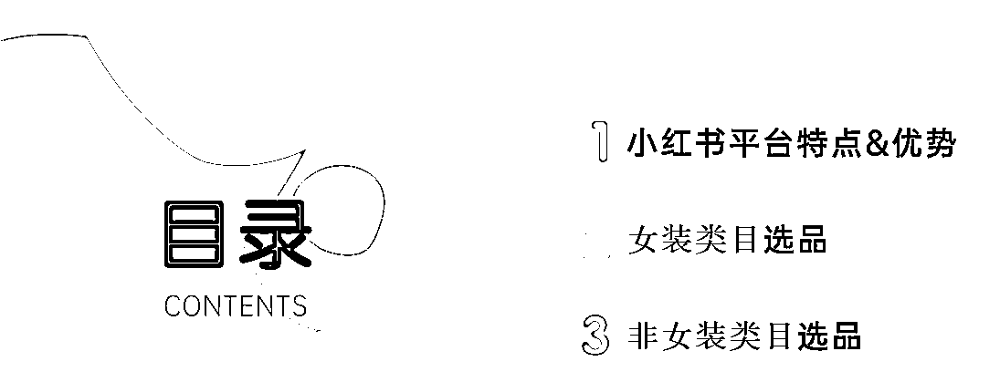
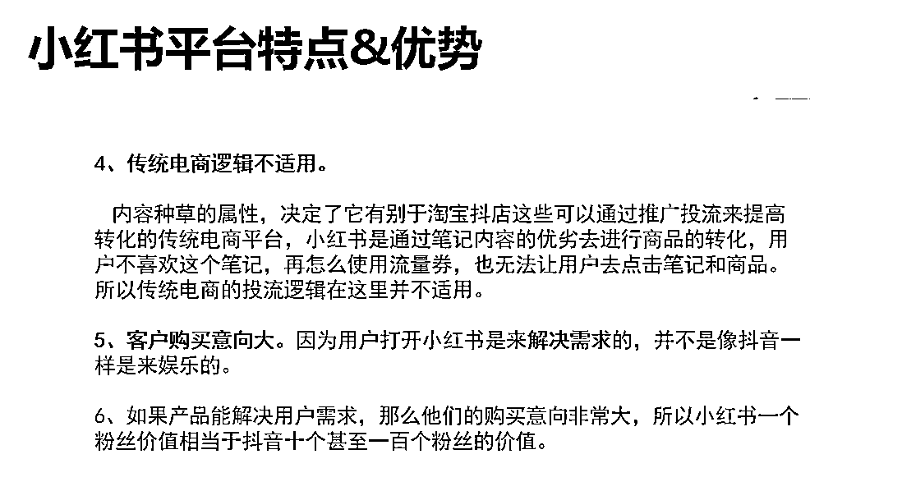
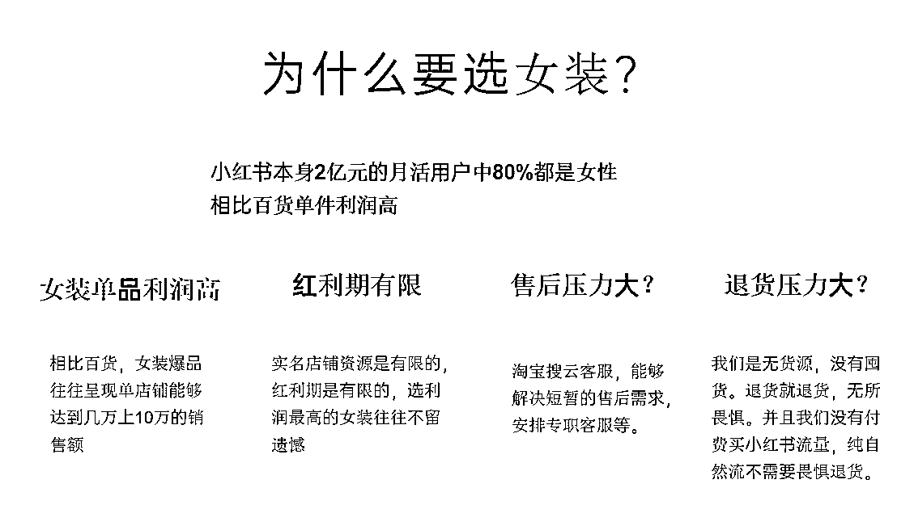

# 如何矩阵化经营 30 个小红书店铺月利润过 20 万？

> 原文：[`www.yuque.com/for_lazy/thfiu8/gxki4ztyzwfx1vm1`](https://www.yuque.com/for_lazy/thfiu8/gxki4ztyzwfx1vm1)

<ne-h2 id="04c19140" data-lake-id="04c19140"><ne-heading-ext><ne-heading-anchor></ne-heading-anchor><ne-heading-fold></ne-heading-fold></ne-heading-ext><ne-heading-content><ne-text id="u6fb7577d">(74 赞)如何矩阵化经营 30 个小红书店铺月利润过 20 万？</ne-text></ne-heading-content></ne-h2> <ne-p id="ua8226f2f" data-lake-id="ua8226f2f"><ne-text id="u76cbabc4">作者： 书豪</ne-text></ne-p> <ne-p id="u2a850d0b" data-lake-id="u2a850d0b"><ne-text id="u1e78b9ff">日期：2023-07-19</ne-text></ne-p> <ne-p id="u7155078e" data-lake-id="u7155078e"><ne-text id="ue686cc3f" style="background-color: rgb(255, 255, 255); color: rgb(47, 48, 52);">各位朋友好，我是在杭州的圈友书豪，一个连续创业四年的 95 后，目前连续四年都年入百万。</ne-text></ne-p> <ne-p id="ue16a6768" data-lake-id="ue16a6768"><ne-text id="u19595a71">越来越喜欢生财有术这个星球，在这个星球认识了很多事业和生活当中的朋友。</ne-text></ne-p> <ne-p id="uc4a5b67a" data-lake-id="uc4a5b67a"><ne-text id="uc24e3534">今天给大家分享一下，如何批量化矩阵经营 30 个小红书店铺，希望对矩阵化经营小红书店铺的圈友产生实际的帮助；</ne-text></ne-p> <ne-p id="ue0dad66f" data-lake-id="ue0dad66f"><ne-text id="u48d2a329" style="background-color: rgb(255, 255, 255); color: rgb(47, 48, 52);">主要围绕这几点内容去分享：</ne-text></ne-p> <ne-p id="u18f29d43" data-lake-id="u18f29d43"><ne-text id="uf27c2043" style="background-color: rgb(255, 255, 255); color: rgb(47, 48, 52);">1.小红书平台有哪些特点和优势？</ne-text></ne-p> <ne-p id="u718b9260" data-lake-id="u718b9260"><ne-text id="u3973c21e" style="background-color: rgb(255, 255, 255); color: rgb(47, 48, 52);">2.小红书店铺女装类目如何选品？</ne-text></ne-p> <ne-p id="ucca7a1ab" data-lake-id="ucca7a1ab"><ne-text id="u9f1a4959" style="background-color: rgb(255, 255, 255); color: rgb(47, 48, 52);">3.非女装类目如何选品呢？...</ne-text></ne-p> <ne-p id="ub5887bf6" data-lake-id="ub5887bf6"><ne-card data-card-name="image" data-card-type="inline" id="gdHl3" data-event-boundary="card"></ne-card><ne-card data-card-name="image" data-card-type="inline" id="dvgih" data-event-boundary="card"></ne-card></ne-p> <ne-h2 id="4fe8b9dd" data-lake-id="4fe8b9dd"><ne-heading-ext><ne-heading-anchor></ne-heading-anchor><ne-heading-fold></ne-heading-fold></ne-heading-ext><ne-heading-content></ne-heading-content></ne-h2><ne-h2 id="4fe8b9dd-1" data-lake-id="4fe8b9dd-1"><ne-heading-ext><ne-heading-anchor></ne-heading-anchor><ne-heading-fold></ne-heading-fold></ne-heading-ext><ne-heading-content></ne-heading-content></ne-h2><ne-h2 id="ef54768d" data-lake-id="ef54768d"><ne-heading-ext><ne-heading-anchor></ne-heading-anchor><ne-heading-fold></ne-heading-fold></ne-heading-ext><ne-heading-content><ne-text id="ub8c04251" ne-bold="true">一、小红书平台的特点和优势决定了矩阵化经营</ne-text></ne-heading-content></ne-h2> <ne-p id="u011f0c35" data-lake-id="u011f0c35"><ne-text id="u64b7d67d">大家还记得 2022 年视频号带货流量风口出现的时候，为什么那么多人去买号经营视频号带货矩阵吗！？</ne-text></ne-p> <ne-p id="ucdfe2387" data-lake-id="ucdfe2387"><ne-text id="u5ee8a06f">2022 年出现视频号流量带货红利的时候，赚到钱的不是那批精细化选品的玩家，而是那帮第一时间矩阵化经营的玩家，同理，当年做公众号矩阵，抖音短视频带货的玩家同样都是靠矩阵经营。</ne-text></ne-p> <ne-p id="ub6bdac79" data-lake-id="ub6bdac79"><ne-text id="u60946424">小红书店铺的红利并不长久，而站在红利之上，如何在尽可能短的时间内赚到钱才是比研究选品研究爆款笔记封面更重要的事情。</ne-text></ne-p> <ne-p id="u7ba9bbbf" data-lake-id="u7ba9bbbf"><ne-text id="ue57e941f">面对日活 8000 万的小红书平台电商的红利，矩阵化经营，才是我们应该花最大精力去推进的核心要事。</ne-text></ne-p> <ne-p id="u4e1cd0be" data-lake-id="u4e1cd0be"><ne-card data-card-name="image" data-card-type="inline" id="d9cUV" data-event-boundary="card"></ne-card></ne-p> <ne-p id="ue84c007f" data-lake-id="ue84c007f"><ne-text id="u0db2edca">早年的小红书博主都是站内分享往淘宝天猫引流，而今开启的这波小红书店铺的红利，平台对于混剪模式的玩家也是尽可能的放任，许多圈友不知道的是即使在 7 月中下旬，直接从抖音上找益智玩具、泡脚桶等类目的视频简单去重混剪发在小红书依然能有效出单。</ne-text></ne-p> <ne-p id="ue6c27535" data-lake-id="ue6c27535"><ne-card data-card-name="image" data-card-type="inline" id="LBr62" data-event-boundary="card"></ne-card><ne-card data-card-name="image" data-card-type="inline" id="Y2aui" data-event-boundary="card"></ne-card></ne-p> <ne-p id="ueb10016b" data-lake-id="ueb10016b"><ne-card data-card-name="image" data-card-type="inline" id="XoWio" data-event-boundary="card"></ne-card></ne-p> <ne-p id="u55fa0ee7" data-lake-id="u55fa0ee7"><ne-text id="u9da32e52">做小红书平台有哪些优势，我觉得是需要给团队做培训的，调整团队的认知，统一思想，这是我们团队内部的培训手册，在这里也给生财的圈友做分享，紧紧抓住今年小红书平台的电商红利。</ne-text></ne-p> <ne-p id="ue44b3dd3" data-lake-id="ue44b3dd3"><ne-text id="ud7b9a9cf">为什么需要给团队定期做培训呢！？</ne-text></ne-p> <ne-p id="ub1046904" data-lake-id="ub1046904"><ne-text id="u99ec0981">因为你一个人的认知视野如果不能很快的沟通到执行团队，无法充分调动大家的热情，二来无法形成标准化的执行方法，每周一次的培训是必要的。</ne-text></ne-p> <ne-p id="u71000830" data-lake-id="u71000830"><ne-text id="ud09eb192" ne-bold="true">二、小红书店铺女装类目选品方法</ne-text></ne-p> <ne-p id="ubd8814e5" data-lake-id="ubd8814e5"><ne-card data-card-name="image" data-card-type="inline" id="Xh6kw" data-event-boundary="card"></ne-card></ne-p> <ne-p id="u5042c43b" data-lake-id="u5042c43b"><ne-card data-card-name="image" data-card-type="inline" id="LRwm5" data-event-boundary="card"></ne-card></ne-p> <ne-p id="u22d585fe" data-lake-id="u22d585fe"><ne-card data-card-name="image" data-card-type="inline" id="b5oPX" data-event-boundary="card"></ne-card></ne-p> <ne-p id="ud73cb532" data-lake-id="ud73cb532"><ne-text id="u2a9a3762" ne-bold="true">三、小红书百货等其他类目选品方法</ne-text></ne-p> <ne-p id="u53857a4f" data-lake-id="u53857a4f"><ne-card data-card-name="image" data-card-type="inline" id="vt2tI" data-event-boundary="card"></ne-card></ne-p> <ne-p id="u94beda4b" data-lake-id="u94beda4b"><ne-card data-card-name="image" data-card-type="inline" id="e4hRw" data-event-boundary="card"></ne-card></ne-p> <ne-p id="uba0b3c47" data-lake-id="uba0b3c47"><ne-card data-card-name="image" data-card-type="inline" id="GMpqk" data-event-boundary="card"></ne-card></ne-p> <ne-p id="ua0d63360" data-lake-id="ua0d63360"><ne-card data-card-name="image" data-card-type="inline" id="OH18R" data-event-boundary="card"></ne-card></ne-p> <ne-p id="u9c4f7a5b" data-lake-id="u9c4f7a5b"><ne-text id="u1cf109c0" style="color: rgb(73, 73, 73); background-color: rgb(255, 248, 149);">今天和大家分享我们团队做小红书如何选品，是想分享一下团队化经营矩阵的具体细节</ne-text></ne-p> <ne-p id="ua0a3c076" data-lake-id="ua0a3c076"><ne-text id="ue5c137ed" style="color: rgb(73, 73, 73);">其实在今年之前，我们团队没有一个人做过小红书电商，都是跟着我公众号和抖音短视频带货过来的团队。</ne-text></ne-p> <ne-p id="uac1f8f25" data-lake-id="uac1f8f25"><ne-text id="ua81403bc" style="color: rgb(73, 73, 73);">在团队基本都是小红书新手的情况下，日常的管理沟通细节和强调重点是什么呢？</ne-text></ne-p> <ne-p id="udf978f95" data-lake-id="udf978f95"><ne-text id="ud54ccc10" style="color: rgb(73, 73, 73);">反复盯大家是否跟了爆品，因为选爆品蹭热度蹭流量，哪怕肉吃不上，汤还是可以喝的。</ne-text></ne-p> <ne-p id="ub3ce258a" data-lake-id="ub3ce258a"><ne-text id="u7fa00de0" style="color: rgb(73, 73, 73);">我们团队从大多数的新人小红书电商小白到知道怎么选爆品也是一路跌跌撞撞过来的，今年我们还有一个非常得力的骨干主管怀孕了，抖音付费投流短视频带货的业务也在大幅下滑，一路糟心过来，更加坚定了我们做新业务的尝试。</ne-text></ne-p> <ne-p id="u96e247bb" data-lake-id="u96e247bb"><ne-text id="uc26eb24c" style="color: rgb(73, 73, 73);">好在今年做小红书店铺矩阵有了新收获，基本团队每个人都知道怎么选品</ne-text></ne-p> <ne-p id="uaade80ff" data-lake-id="uaade80ff"><ne-text id="u167fb348" style="color: rgb(73, 73, 73);">第一，学会让团队去看产品的数据，是否是站内粉丝少成交多的账号带货产品。</ne-text></ne-p> <ne-p id="u7987d598" data-lake-id="u7987d598"><ne-text id="uef4ab2fc" style="color: rgb(73, 73, 73);">第二，让员工去关注同行近期有没有重复的去发一个品的不同的视频，不同的素材。同款爆品不同的视频来回发。</ne-text></ne-p> <ne-p id="u230cdfc3" data-lake-id="u230cdfc3"><ne-text id="ua91a7c2f" style="color: rgb(73, 73, 73);">第三：很重要的一点，这点我发现大多数人都没有分享过，都是我们自己亲测有效的，就是之前有在抖音爆过的品，之后发在小红书还有可能再爆。这种选品方法也是最轻松的，因为抖音基本都是成片的素材。</ne-text></ne-p> <ne-p id="ucd583bb4" data-lake-id="ucd583bb4"><ne-text id="u722e461d" style="color: rgb(73, 73, 73); background-color: rgb(255, 248, 149);">最后的最后，给大家分享一下，我们做小红书店铺自然流笔记带货如何做内容，如何去带剪辑团队</ne-text></ne-p> <ne-p id="u5408597b" data-lake-id="u5408597b"><ne-text id="u899f5178" style="color: rgb(73, 73, 73);">要做好内容，人是关键</ne-text></ne-p> <ne-p id="u018b6528" data-lake-id="u018b6528"><ne-text id="u86399891" style="color: rgb(73, 73, 73);">剪辑视频都是耐心活，混剪的每个画面，剪辑时对每帧画面的调整都是视频能爆的核心关键，也是视频的竞争力。</ne-text></ne-p> <ne-p id="u9081578c" data-lake-id="u9081578c"><ne-text id="u663212a0" style="color: rgb(73, 73, 73);">怎么管理好员工呢？</ne-text></ne-p> <ne-p id="uc27fc4ef" data-lake-id="uc27fc4ef"><ne-text id="u145f06e7" style="color: rgb(73, 73, 73);">每天让员工充实起来，个人薪资个人成长都是员工的内驱力，小红书内容电商是一个靠流量的行业，需要对小红书的爆款带货笔记内容有敏感度，需要员工保持定期的学习，与小红书的爆款商品带货笔记的热度俱进才能更快的追上热度，做出有可能会爆的带货笔记视频。</ne-text></ne-p> <ne-p id="u7ec15877" data-lake-id="u7ec15877"><ne-text id="ubbe7aa5c" style="color: rgb(73, 73, 73);">我们每周会组织一次视频拆解会议，每个人找出一个爆款视频，从拍摄到剪辑把爆款视频的亮点找出来，周而复始大家的拍摄和剪辑水平也会得到提升，重要的是，激活他们对视频创作的灵感。</ne-text></ne-p> <ne-p id="ufc880545" data-lake-id="ufc880545"><ne-text id="uf372b6bf" style="color: rgb(73, 73, 73);">另外可以每周两次的频率把爆过的品，爆过的视频找出来整理好，第一时间给团队伙伴更新，最好是以会议的形式统一更新给他们，而不是随手在群里一发就这样过去了。做小红书电商一定要跟踪到同行们在追什么品，流量怎么样，了解到这个平台近期或者近半个月爆了哪些品。有些爆过的品，后面要再追一下，有可能就被你拉起来了。</ne-text></ne-p> <ne-p id="u35218732" data-lake-id="u35218732"><ne-text id="u147e25ba" style="color: rgb(73, 73, 73);">每周进行一次周总结，会议的形式针对本周数据表现最好的同事给予肯定，数据落后的同事给予鼓励，和员工之间的度盘一周一次很有必要，定期激发他们的工作状态！</ne-text></ne-p> <ne-h2 id="5db5939a" data-lake-id="5db5939a"><ne-heading-ext><ne-heading-anchor></ne-heading-anchor><ne-heading-fold></ne-heading-fold></ne-heading-ext><ne-heading-content><ne-text id="uc69fa35c" ne-bold="true">往期文章：</ne-text></ne-heading-content></ne-h2> <ne-h3 id="dd667cb0" data-lake-id="dd667cb0"><ne-heading-ext><ne-heading-anchor></ne-heading-anchor><ne-heading-fold></ne-heading-fold></ne-heading-ext><ne-heading-content>[<ne-text id="u2c1bbbe0" ne-bold="true" ne-underline="true">人生的第一个 100 万，我是怎么赚到的？！</ne-text>](https://articles.zsxq.com/id_kek27cqo56wf.html)</ne-heading-content></ne-h3> <ne-h4 id="c6ff19e8" data-lake-id="c6ff19e8"><ne-heading-ext><ne-heading-anchor></ne-heading-anchor><ne-heading-fold></ne-heading-fold></ne-heading-ext><ne-heading-content>[<ne-text id="u76fe1a9e" ne-bold="true">组织生财有术福建厦门圈友聚会复盘！</ne-text>](https://articles.zsxq.com/id_7gqhllpk7tpk.html)</ne-heading-content></ne-h4> <ne-h3 id="b0a18646" data-lake-id="b0a18646"><ne-heading-ext><ne-heading-anchor></ne-heading-anchor><ne-heading-fold></ne-heading-fold></ne-heading-ext><ne-heading-content>[<ne-text id="uf0bd60ed" ne-bold="true" ne-underline="true">小红书单店铺单月 6000+利润选品保姆级教程</ne-text>](https://articles.zsxq.com/id_xwveu3e0usfv.html)</ne-heading-content></ne-h3> <ne-h3 id="7dfe62ce" data-lake-id="7dfe62ce"><ne-heading-ext><ne-heading-anchor></ne-heading-anchor><ne-heading-fold></ne-heading-fold></ne-heading-ext><ne-heading-content>[<ne-text id="u415352f9" ne-bold="true" ne-underline="true">小红书无货源电商，单品 4w+利润，我做了什么？</ne-text>](https://articles.zsxq.com/id_8o3ptacdp6mj.html)</ne-heading-content></ne-h3> <ne-h3 id="673e56f5" data-lake-id="673e56f5"><ne-heading-ext><ne-heading-anchor></ne-heading-anchor><ne-heading-fold></ne-heading-fold></ne-heading-ext><ne-heading-content>[<ne-text id="u6ac56dc0" ne-bold="true" ne-underline="true">抖音直播间月消耗过百万的千川投流经验分享</ne-text>](https://articles.zsxq.com/id_d3zembkeh2cw.html)</ne-heading-content></ne-h3> <ne-h3 id="71707296" data-lake-id="71707296"><ne-heading-ext><ne-heading-anchor></ne-heading-anchor><ne-heading-fold></ne-heading-fold></ne-heading-ext><ne-heading-content>[<ne-text id="udf80d63a" ne-bold="true" ne-underline="true">2023 小红书幼教考编保姆级教程</ne-text>](https://articles.zsxq.com/id_cpdec6j4xtho.html)</ne-heading-content></ne-h3> <ne-h3 id="8b2491f0" data-lake-id="8b2491f0"><ne-heading-ext><ne-heading-anchor></ne-heading-anchor><ne-heading-fold></ne-heading-fold></ne-heading-ext><ne-heading-content>[<ne-text id="u22044e44" ne-bold="true" ne-underline="true">小红书爆款封面最新设计攻略！带你掌握流量密码</ne-text>](https://articles.zsxq.com/id_bbisxulzsup1.html)</ne-heading-content></ne-h3> <ne-h3 id="60b5aec1" data-lake-id="60b5aec1"><ne-heading-ext><ne-heading-anchor></ne-heading-anchor><ne-heading-fold></ne-heading-fold></ne-heading-ext><ne-heading-content>[<ne-text id="u108123fb" ne-bold="true" ne-underline="true">如何拆解一个小红书爆款视频</ne-text>](https://articles.zsxq.com/id_opo78sxacew9.html)</ne-heading-content></ne-h3> <ne-h3 id="745f49cc" data-lake-id="745f49cc"><ne-heading-ext><ne-heading-anchor></ne-heading-anchor><ne-heading-fold></ne-heading-fold></ne-heading-ext><ne-heading-content>[<ne-text id="ufa0d11bf" ne-bold="true" ne-underline="true">小红书无货源电商做女装如何选品？</ne-text>](https://articles.zsxq.com/id_1wxixz3rofb3.html)</ne-heading-content></ne-h3> <ne-h3 id="417ae9e5" data-lake-id="417ae9e5"><ne-heading-ext><ne-heading-anchor></ne-heading-anchor><ne-heading-fold></ne-heading-fold></ne-heading-ext><ne-heading-content>[<ne-text id="udf91e15e" ne-bold="true" ne-underline="true">小红书颜值测评变现保姆级教程</ne-text>](https://articles.zsxq.com/id_15njj2g5hxfr.html)</ne-heading-content></ne-h3> <ne-h3 id="530dd444" data-lake-id="530dd444"><ne-heading-ext><ne-heading-anchor></ne-heading-anchor><ne-heading-fold></ne-heading-fold></ne-heading-ext><ne-heading-content>[<ne-text id="ubc0fcfa7" ne-bold="true" ne-underline="true">小红书低粉爆款案例拆解教程</ne-text>](https://articles.zsxq.com/id_0nmnwdg6mb0l.html)</ne-heading-content></ne-h3> <ne-h3 id="6054e001" data-lake-id="6054e001"><ne-heading-ext><ne-heading-anchor></ne-heading-anchor><ne-heading-fold></ne-heading-fold></ne-heading-ext><ne-heading-content>[<ne-text id="ue7eb21e1" ne-bold="true" ne-underline="true">小红书新人入局月入 100-1000 元保姆级教程</ne-text>](https://articles.zsxq.com/id_sbk8lqv5unca.html)</ne-heading-content></ne-h3> <ne-h3 id="9039450f" data-lake-id="9039450f"><ne-heading-ext><ne-heading-anchor></ne-heading-anchor><ne-heading-fold></ne-heading-fold></ne-heading-ext> <ne-heading-content></ne-heading-content></ne-h3> <ne-h3 id="065ebffa" data-lake-id="065ebffa"><ne-heading-ext><ne-heading-anchor></ne-heading-anchor><ne-heading-fold></ne-heading-fold></ne-heading-ext><ne-heading-content>[<ne-text id="ud5feabf7" ne-bold="true" ne-underline="true">抖音单品短视频带货 1000 万 GMV，我是怎么做到的？！</ne-text>](https://articles.zsxq.com/id_qoak1w7ptnwf.html)</ne-heading-content></ne-h3> <ne-h3 id="673e56f5-1" data-lake-id="673e56f5-1"><ne-heading-ext><ne-heading-anchor></ne-heading-anchor><ne-heading-fold></ne-heading-fold></ne-heading-ext><ne-heading-content>[<ne-text id="ued5f2b73" ne-bold="true" ne-underline="true">抖音直播间月消耗过百万的千川投流经验分享</ne-text>](https://articles.zsxq.com/id_d3zembkeh2cw.html)</ne-heading-content></ne-h3> <ne-h3 id="9039450f-1" data-lake-id="9039450f-1"><ne-heading-ext><ne-heading-anchor></ne-heading-anchor><ne-heading-fold></ne-heading-fold></ne-heading-ext> <ne-heading-content></ne-heading-content></ne-h3> <ne-h3 id="9039450f-2" data-lake-id="9039450f-2"><ne-heading-ext><ne-heading-anchor></ne-heading-anchor><ne-heading-fold></ne-heading-fold></ne-heading-ext> <ne-heading-content></ne-heading-content></ne-h3> <ne-hole id="u6c8cfd7b" data-lake-id="u6c8cfd7b"><ne-card data-card-name="hr" data-card-type="block" id="p5gBf" data-event-boundary="card"><ne-p id="u1cc291d4" data-lake-id="u1cc291d4"><ne-text id="u23b4bdf6">评论区：</ne-text></ne-p> <ne-p id="uc1b7416c" data-lake-id="uc1b7416c"><ne-text id="ub2accd2a">Aimmon : 这么多账号如何管理，一机一号一 ip？</ne-text> <ne-text id="u0e83a1bd">谢安生 : 干货满满，这次甚至连排版都更加美观了，豪哥 YYDS[强][强][强]</ne-text> <ne-text id="ue6eb690b">安宇轩~ : 书豪 nb！</ne-text> <ne-text id="ua2bf30e5">书豪 : 一机一卡一号[爱心]</ne-text> <ne-text id="u06731c78">书豪 : 感谢认可，冲冲冲，一起生财有术</ne-text> <ne-text id="u289f7bec">书豪 : 宇轩好兄弟[呲牙][呲牙]</ne-text> <ne-text id="u4f33cf3e">陈同学 : 没有什么内容啊，是不是忘记挂链接了</ne-text> <ne-text id="u1b9e6e27">书豪 : 你在生财写过内容嘛，团队化选品的方式都写的非常详细了，有落地执行嘛</ne-text></ne-p> <ne-p id="ua1b71f6f" data-lake-id="ua1b71f6f"><ne-card data-card-name="image" data-card-type="inline" id="uHGsx" data-event-boundary="card"></ne-card></ne-p> <ne-hole id="uf781c67b" data-lake-id="uf781c67b"><ne-card data-card-name="hr" data-card-type="block" id="q1Hzg" data-event-boundary="card"></ne-card></ne-hole></ne-card></ne-hole>