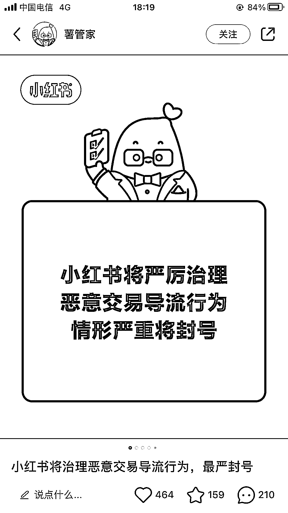

# 拆解一个不起眼却很安全的引流玩法

> 原文：[`www.yuque.com/for_lazy/thfiu8/xuq5v5mhxkudgzc0`](https://www.yuque.com/for_lazy/thfiu8/xuq5v5mhxkudgzc0)

<ne-h2 id="06aaf4fb" data-lake-id="06aaf4fb"><ne-heading-ext><ne-heading-anchor></ne-heading-anchor><ne-heading-fold></ne-heading-fold></ne-heading-ext><ne-heading-content><ne-text id="u54c61b99">(50 赞)拆解一个不起眼却很安全的引流玩法</ne-text></ne-heading-content></ne-h2> <ne-p id="ub4c585ce" data-lake-id="ub4c585ce"><ne-text id="uc64f870e">作者： 艾小飞</ne-text></ne-p> <ne-p id="u3f36876a" data-lake-id="u3f36876a"><ne-text id="ubf416c00">日期：2023-07-21</ne-text></ne-p> <ne-p id="ub5dd3166" data-lake-id="ub5dd3166"><ne-text id="ua99cca20">【拆解一个不起眼却很安全的引流玩法】</ne-text></ne-p> <ne-p id="ua68d4c26" data-lake-id="ua68d4c26"><ne-text id="u4cfd87b8">哈喽，各位生财的圈友们</ne-text> <ne-text id="ub137ffa8">大家好，我叫艾小飞</ne-text></ne-p> <ne-p id="u493f2ddc" data-lake-id="u493f2ddc"><ne-text id="ub0d1c301">一个靠自媒体创业还债的 95 后。目前擅长小红书引流和无货源店铺</ne-text></ne-p> <ne-p id="u0b71327e" data-lake-id="u0b71327e"><ne-text id="ud19c0c90">今天呢，我想给大家分享一个不起眼却很安全的小红书引流玩法</ne-text></ne-p> <ne-p id="u24371c5d" data-lake-id="u24371c5d"><ne-text id="u2fb1aacd">我相信很多做私域的生财圈友们，从小红书上引流都会遇到一个头疼又难受的问题，那就是如何从小红书上低风险的把客户引到自己的私域上</ne-text></ne-p> <ne-p id="ua982d02a" data-lake-id="ua982d02a"><ne-text id="u1b4511a5">大家都知道小红书对于引流的打击是非常严格的，正好今天官方又出新规了。</ne-text></ne-p> <ne-p id="u65ada16a" data-lake-id="u65ada16a"><ne-text id="ua79c088f">堪称史上最严，放张图给你们感受下(图 1)</ne-text></ne-p> <ne-p id="u8bcb1dc9" data-lake-id="u8bcb1dc9"><ne-text id="u64c209cb">因此很多做私域的生财圈友，在小红书上引流都被限流或封过账号，包括我也一样，引流行为相当于是背着平台偷平台的流量到自己的地盘上</ne-text></ne-p> <ne-p id="ua626fa3b" data-lake-id="ua626fa3b"><ne-text id="ub46fb917">上有政策，下有对策。既然平台有他的一套检测引流的方法，那么我们做私域的，也有自己的一套避规检测的方法</ne-text></ne-p> <ne-p id="u0a3051a2" data-lake-id="u0a3051a2"><ne-text id="uaf9cec88">内容偏长，那么麻烦生财圈友们，请移步到飞书文档阅读</ne-text></ne-p> <ne-p id="u584d852d" data-lake-id="u584d852d"><ne-text id="u24ef75c4">总结：</ne-text></ne-p> <ne-p id="u3eb74d60" data-lake-id="u3eb74d60"><ne-text id="u46554b4f">其实这篇更多讲的是一种思路吧</ne-text></ne-p> <ne-p id="u060d357c" data-lake-id="u060d357c"><ne-text id="u6f5f950b">因为我觉得任何一种引流玩法它都会过时的，但只要你理解其中的底层逻辑或思路，能举一反三的应万变，那我相信往后你再发现新的引流玩法时，还能如鱼得水的去操作它</ne-text></ne-p> <ne-p id="u922311dc" data-lake-id="u922311dc"><ne-text id="ue50db1b1">好了，也希望你看完这篇后，能给你带来思路上的启发，谢谢生财圈友们</ne-text></ne-p> <ne-p id="u8852a842" data-lake-id="u8852a842"><ne-text id="u87588a9f">我叫艾小飞，擅长小红书引流和无货源店铺</ne-text></ne-p> <ne-p id="u65dd9a85" data-lake-id="u65dd9a85"><ne-text id="ua0eb82af">我们下期再会！</ne-text>[<ne-text id="ubd923962">https://nivut760ftk.feishu.cn/docx/TID1dGqddoSenwxWFKxchfvInUf?from=from_copylink</ne-text>](https://nivut760ftk.feishu.cn/docx/TID1dGqddoSenwxWFKxchfvInUf?from=from_copylink)<ne-card data-card-name="image" data-card-type="inline" id="anvmE" data-event-boundary="card"></ne-card></ne-p> <ne-hole id="uf57689a4" data-lake-id="uf57689a4"><ne-card data-card-name="hr" data-card-type="block" id="rrAfe" data-event-boundary="card"><ne-p id="ue1b49c34" data-lake-id="ue1b49c34"><ne-text id="u4583418a">评论区：</ne-text></ne-p> <ne-p id="u68403c84" data-lake-id="u68403c84"><ne-text id="u6303e29c">小金叔叔 : 引流封号限流的问题，就一句话解决:投聚光，找小二，号不死</ne-text> <ne-text id="u1fef3cc3">艾小飞 : 你说的对。不过我的心态是：封了就换，没啥大不了的😂</ne-text> <ne-text id="u1486a2a8">小金叔叔 : 号越到后面权重越高，我们有的号通过投流吃搜索流量，后面关掉投流 帖子还在上面</ne-text> <ne-text id="u174e732a">如果是封了就换的思路，后面就吃不到长尾流量</ne-text> <ne-text id="u7fe27241">艾小飞 : 你这个方式是很牛的，我认可的！但 seo 投流的玩法，对新人来说还是有难度的，你那个是属于付费打法，我这个是属于免费打法，也各有各的好吧。如果有运营能力，我更愿意推荐你的那个方式，毕竟付费才是长久且稳定的</ne-text> <ne-text id="ue70a9a00">万青 : 该说不说这种方法被封过...</ne-text> <ne-text id="u91560410">艾小飞 : 对的，目前还找不到 100%安全的。不过我每天靠这个方式引流还没被封过</ne-text> <ne-text id="u48adad2d">陈龙 : 感谢分享，这个办法确实挺好，比之前的更安全</ne-text> <ne-text id="ua03e1bac">艾小飞 : 对的，如果同时组合去套用试试会更好</ne-text></ne-p> <ne-p id="ud9d8ac02" data-lake-id="ud9d8ac02"><ne-card data-card-name="image" data-card-type="inline" id="gYOKd" data-event-boundary="card">  <ne-hole id="uaec20845" data-lake-id="uaec20845"><ne-card data-card-name="hr" data-card-type="block" id="ITxdM" data-event-boundary="card"></ne-card></ne-hole></ne-card></ne-p></ne-card></ne-hole>