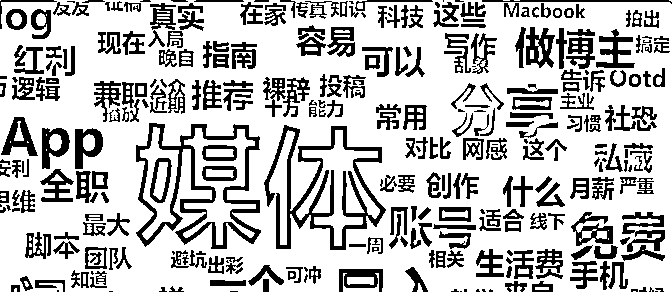

# 新号第一篇登上小红书热门，我的爆款选题 3 部曲

> 原文：[`www.yuque.com/for_lazy/thfiu8/vfpozsomfofzagqd`](https://www.yuque.com/for_lazy/thfiu8/vfpozsomfofzagqd)

<ne-h2 id="815992fe" data-lake-id="815992fe"><ne-heading-ext><ne-heading-anchor></ne-heading-anchor><ne-heading-fold></ne-heading-fold></ne-heading-ext><ne-heading-content><ne-text id="u677e4b62">(30 赞)新号第一篇登上小红书热门，我的爆款选题 3 部曲</ne-text></ne-heading-content></ne-h2> <ne-p id="u1b60c1ca" data-lake-id="u1b60c1ca"><ne-text id="u5a5f69cd">作者： 李子木</ne-text></ne-p> <ne-p id="uafe8eebf" data-lake-id="uafe8eebf"><ne-text id="u3407982e">日期：2023-07-18</ne-text></ne-p> <ne-p id="ua6ed8ac7" data-lake-id="ua6ed8ac7"><ne-text id="u8ab63d04" style="color: rgb(51, 51, 51);">对大多数人而言，自媒体是一场客观的开卷考试。</ne-text></ne-p> <ne-p id="u360f8f69" data-lake-id="u360f8f69"><ne-text id="uaed36c5c" style="color: rgb(51, 51, 51);">时间来到 2023 年，各个平台已经有无数内容，无论你想做哪个方向，基本都能找到不错的参考，那些同类目的新锐账号、爆款内容，就是藏在互联网上的参考答案，等着我们找到、琢磨，解开流量密码。</ne-text></ne-p> <ne-p id="u3d10d039" data-lake-id="u3d10d039"><ne-text id="u34756db3" style="color: rgb(51, 51, 51);">上个月，我帮公司在小红书开了个小众垂类的图文新号，发布第一篇内容 3 天后，收到系统通知，笔记登上了素材领域热门，单篇涨粉过百。</ne-text></ne-p> <ne-p id="uc9ac155c" data-lake-id="uc9ac155c"><ne-card data-card-name="image" data-card-type="inline" id="m8HGP" data-event-boundary="card"></ne-card></ne-p> <ne-p id="u0ea3deda" data-lake-id="u0ea3deda"><ne-text id="u60b2f1c0" style="color: rgb(51, 51, 51);">之所以能在开号第一篇取得这个数据，就是因为我在发布前，做了大量准备工作，找到该类目需求量较大的爆款选题，并在标题、笔记封面中使用了爆款率较高的关键词。</ne-text></ne-p> <ne-p id="ucd585e2d" data-lake-id="ucd585e2d"><ne-text id="ubbad571a" style="color: rgb(51, 51, 51);">今天这篇文章就来分享一下，我如何利用工具、顺藤摸瓜找到爆款选题。这种方法，适用于小红书、抖音、快手平台，各个赛道可用，尤其适合高度垂直细分、暂时没有出现很好的头部账号的赛道。</ne-text></ne-p> <ne-h3 id="782cd67a" data-lake-id="782cd67a"><ne-heading-ext><ne-heading-anchor></ne-heading-anchor><ne-heading-fold></ne-heading-fold></ne-heading-ext><ne-heading-content><ne-text id="ucabea562">1、 </ne-text><ne-text id="u5b830791" ne-bold="true">破题：围绕赛道或产品列出关键词</ne-text></ne-heading-content></ne-h3> <ne-p id="ufbb0c61d" data-lake-id="ufbb0c61d"><ne-text id="uc33bea2b" style="color: rgb(51, 51, 51);">先从自身出发，围绕你想做的赛道、或者你想要通过自媒体销售的产品，列出尽可能多的关键词，这是我们的初始素材库。</ne-text></ne-p> <ne-p id="u2c0753a0" data-lake-id="u2c0753a0"><ne-text id="u9040f8db" style="color: rgb(51, 51, 51);">比如我要做的这个产品，是帮助培训机构管理的运营系统，围绕它的目标用户群体、功能、用户需求、特点，我列出了“机构招生”、“招生引流”、“机构运营”等 5 个关键词。</ne-text></ne-p> <ne-p id="u6f32544c" data-lake-id="u6f32544c"><ne-text id="ua617fc8c" style="color: rgb(51, 51, 51);">提升效率的小工具：九宫格思考法，能帮助你更高效、全面地列出关键词。</ne-text></ne-p> <ne-p id="u94bbfa72" data-lake-id="u94bbfa72"><ne-text id="u118878c0" style="color: rgb(51, 51, 51);">拿一张纸，用笔分割成九宫格，或借助 Excel 等表格工具绘制九宫格，在中间写上你的产品，然后在它外围的 8 格，填上相关的关键词，这些关键词，可以从人群、目的、方法、困难、工具等方向去发散，参考如图：</ne-text></ne-p> <ne-p id="u402a8621" data-lake-id="u402a8621"><ne-card data-card-name="image" data-card-type="inline" id="jjdPT" data-event-boundary="card"></ne-card></ne-p> <ne-h3 id="1b393e8e" data-lake-id="1b393e8e"><ne-heading-ext><ne-heading-anchor></ne-heading-anchor><ne-heading-fold></ne-heading-fold></ne-heading-ext><ne-heading-content><ne-text id="u94218b20">2、 </ne-text><ne-text id="u4b118823" ne-bold="true">找答案：借助工具网站，搜索关键词</ne-text></ne-heading-content></ne-h3> <ne-p id="u9ef61dd4" data-lake-id="u9ef61dd4"><ne-text id="u0c42dc68" style="color: rgb(51, 51, 51);">用 5118、新榜、千瓜等网站，在自媒体平台内容搜索的模块，搜索列出的关键词。</ne-text></ne-p> <ne-p id="u4c870f87" data-lake-id="u4c870f87"><ne-text id="u987bc6bd" style="color: rgb(51, 51, 51);">以 5118 为例，搜索关键词，将互动量按“增量从高到低”排序，就可以看到，在这个关键词下，最近最受欢迎的笔记内容。</ne-text><ne-card data-card-name="image" data-card-type="inline" id="zghIU" data-event-boundary="card"></ne-card></ne-p> <ne-p id="u6e6d9d47" data-lake-id="u6e6d9d47"><ne-text id="ud26d13ca" style="color: rgb(51, 51, 51);">通过分析这些选题，我们就能找到爆款比例高的笔记选题。</ne-text></ne-p> <ne-p id="u226fa7e0" data-lake-id="u226fa7e0"><ne-text id="u1d439bb5" style="color: rgb(51, 51, 51);">比如我在搜索时发现，与“机构招生”相关的笔记中，数据最好的 10 篇笔记，有 5 篇以上是朋友圈招生文案，就说明这个选题是受欢迎的，可以纳入我们的爆款选题库。</ne-text></ne-p> <ne-p id="ud1528484" data-lake-id="ud1528484"><ne-text id="u872dcc8d" style="color: rgb(51, 51, 51);">通过分析前 100 条（或互动量高于 100 的所有笔记）数据，我们可以还可以做 2 件事：</ne-text></ne-p> <ne-p id="u76dc5ac2" data-lake-id="u76dc5ac2"><ne-text id="u368089a3" style="color: rgb(51, 51, 51);">①拓展关键词。</ne-text></ne-p> <ne-p id="ucb317fee" data-lake-id="ucb317fee"><ne-text id="uaf6b6a28" style="color: rgb(51, 51, 51);">我们自己脑子里的关键词是有限的，可能存在一些词，是用户常用、而我们不知道的，会在这些笔记中体现出来。找到这些关键词之后，再搜索他们的相关笔记，拓展我们的数据库，帮助我们找到更多爆款选题。</ne-text></ne-p> <ne-p id="u72144639" data-lake-id="u72144639"><ne-text id="u608a5e60" style="color: rgb(51, 51, 51);">怎么拓展关键词：将所有笔记标题摘取下来，放进词云分析器，找到词频高的词语或组合。可以在百度、知乎上寻找好用的词云分析器，我暂时用的是 wenziyun（3D 词云）。</ne-text></ne-p> <ne-p id="uc0306378" data-lake-id="uc0306378"><ne-card data-card-name="image" data-card-type="inline" id="uk4cX" data-event-boundary="card"></ne-card></ne-p> <ne-p id="u8a712360" data-lake-id="u8a712360"><ne-card data-card-name="image" data-card-type="inline" id="EQwRC" data-event-boundary="card"></ne-card></ne-p> <ne-p id="u63650a19" data-lake-id="u63650a19"><ne-text id="uce6cd917" style="color: rgb(51, 51, 51);">②找到垂类账号。</ne-text></ne-p> <ne-p id="u57780017" data-lake-id="u57780017"><ne-text id="ue516b196" style="color: rgb(51, 51, 51);">有些优秀的垂类新号，值得我们学习，同时也可以给我们提供选题灵感，但许多这样的账号名称中可能没有关键词，很难通过直接搜索找到，我们就可以通过搜索相关笔记，点进作者主页，看他发的内容，如果他的内容垂直、数据比较稳定，就可以关注他，此时，平台也会推荐相关账号，这样，我们就会快速获得一个垂类账号池子，供我们学习、参考选题。</ne-text></ne-p> <ne-h3 id="ad13b558" data-lake-id="ad13b558"><ne-heading-ext><ne-heading-anchor></ne-heading-anchor><ne-heading-fold></ne-heading-fold></ne-heading-ext><ne-heading-content><ne-text id="u9a4644de">3、 </ne-text><ne-text id="ubdbdd6fe" ne-bold="true">做验证：回平台查看作者主页，验证选题数据</ne-text></ne-heading-content></ne-h3> <ne-p id="uab5725c0" data-lake-id="uab5725c0"><ne-text id="uebedc72c" style="color: rgb(51, 51, 51);">在第二步，我们获取了一些爆款选题，接下来，就可以去平台进行验证。</ne-text></ne-p> <ne-p id="u4fa0bc0c" data-lake-id="u4fa0bc0c"><ne-text id="uc420e77d" style="color: rgb(51, 51, 51);">翻看我们在上一步关注的每位垂类作者，统计他们的笔记数据，关注两个点：</ne-text></ne-p> <ne-p id="uefc05e14" data-lake-id="uefc05e14"><ne-text id="uacc0bdaa" style="color: rgb(51, 51, 51);">①你认为是爆款选题的内容，数据如何</ne-text></ne-p> <ne-p id="u4fd43b9b" data-lake-id="u4fd43b9b"><ne-text id="u7d96b7fb" style="color: rgb(51, 51, 51);">比如我初步认定，“朋友圈招生笔记”是小红书上教培类的爆款选题，就会格外关注每个作者的这一类的内容。</ne-text></ne-p> <ne-p id="u205a3c9a" data-lake-id="u205a3c9a"><ne-text id="u4fc0f06b" style="color: rgb(51, 51, 51);">在观察 5~7 位作者之后发现，一般发这个选题的笔记，互动数据都会比较高，对于一些粉丝不过千的作者，也有较高的百赞、千赞比例，同时，在一年内的不同时期，这个选题的数据量都高于一般笔记。</ne-text></ne-p> <ne-p id="u064064d7" data-lake-id="u064064d7"><ne-text id="u47d0c024" style="color: rgb(51, 51, 51);">那么，就可以认为，这类选题的爆款率高，而且时效性较低，我可以用这个选题来启动账号。</ne-text></ne-p> <ne-p id="ufa31e9af" data-lake-id="ufa31e9af"><ne-text id="ue55108b2" style="color: rgb(51, 51, 51);">②着重记录互动量远高于作者平均数的内容</ne-text></ne-p> <ne-p id="u767c2b34" data-lake-id="u767c2b34"><ne-text id="u191312d5" style="color: rgb(51, 51, 51);">比如一般互动量不过百，但某条内容超过 500、甚至超过 1000，这些就值得记录下来。记录标题、封面关键词、所带话题。</ne-text></ne-p> <ne-p id="u6b80031d" data-lake-id="u6b80031d"><ne-text id="ufdfd81a7" style="color: rgb(51, 51, 51);">比对 10-20 个作者，找出其中出现频率较高的爆款选题，也是我们可用的选题。</ne-text></ne-p> <ne-p id="u1c016359" data-lake-id="u1c016359"><ne-text id="u3b21a899" style="color: rgb(51, 51, 51);">除了刻意搜索、验证之外，建议日常多刷垂类内容，平台就会推荐一些同类目新号，这些账号我们比较难通过主动搜索找到，但有时也会给我们一些惊喜。</ne-text></ne-p> <ne-p id="ucc967aef" data-lake-id="ucc967aef"><ne-text id="ub34b9da7" style="color: rgb(51, 51, 51);">最后，我还是想不厌其烦地强调 3 个做自媒体过程中的重要思维：</ne-text></ne-p> <ne-p id="ua4b200e7" data-lake-id="ua4b200e7"><ne-card data-card-name="image" data-card-type="inline" id="kWC3j" data-event-boundary="card"></ne-card></ne-p> <ne-p id="u76f47767" data-lake-id="u76f47767"><ne-text id="ue32f6118" style="color: rgb(51, 51, 51);">1、选题的利他思维</ne-text></ne-p> <ne-p id="u5d81548b" data-lake-id="u5d81548b"><ne-text id="u7837f510" style="color: rgb(51, 51, 51);">说这个词的人太多了，但说清楚具体怎么做的不多。</ne-text></ne-p> <ne-p id="u897573ac" data-lake-id="u897573ac"><ne-text id="ua6c8309e" style="color: rgb(51, 51, 51);">我认为这个词的本质，不是“给用户我觉得他要的”，而是“先了解用户要什么，然后给他”，落实到做法上，就是摒弃“我要做这个选题”，而是“我要去做好爆款选题”。</ne-text></ne-p> <ne-p id="uccc8c782" data-lake-id="uccc8c782"><ne-text id="ud1764cea" style="color: rgb(51, 51, 51);">去年下半年，我做了 4 个账号，其中 3 个，是按照上述方法，根据市场需求、筛选爆款选题来做运营的，都做起来了，最快的 1 个单月涨粉 10w+，剩下的 1 个，仅出于自己的表达欲，想发什么就发什么，账号规划、选题、内容完全靠空想，虽然定位也比较垂直，但 3 个月过去，数据非常惨淡。</ne-text></ne-p> <ne-p id="u7c7b3811" data-lake-id="u7c7b3811"><ne-text id="u4e43196f" style="color: rgb(51, 51, 51);">确实有极少部分天才，能仅凭做好自己的内容，就能成功，但这部分人是极少的。我们在做这件事之前，要将自己当成众多普通人中的一个，才可能获得更大的成功率。</ne-text></ne-p> <ne-p id="u85614d95" data-lake-id="u85614d95"><ne-text id="u170aa00d" style="color: rgb(51, 51, 51);">2、分析的独立思维</ne-text></ne-p> <ne-p id="ua57fc435" data-lake-id="ua57fc435"><ne-text id="uc5d8d302" style="color: rgb(51, 51, 51);">有的运营会通过千瓜、新榜等数据分析平台去分析需求，但切记：不要过度依赖工具。</ne-text></ne-p> <ne-p id="u1c56b93b" data-lake-id="u1c56b93b"><ne-text id="u50bedd66" style="color: rgb(51, 51, 51);">数据分析平台的好处是，大而全，它们能让你站在比较高的层面做数据分析，快速了解赛道全貌，但所有数据网站，都是定期在平台上爬取数据的，多少会有一些滞后、不精准。比如我找到的一个账号，小红书粉丝已经有 5042，但数据平台上显示的是 4608，这就是不同赛道、不同体量数据的滞后性。</ne-text></ne-p> <ne-p id="u31a1597a" data-lake-id="u31a1597a"><ne-text id="u013c489c" style="color: rgb(51, 51, 51);">所以，用数据分析平台获得了信息之后，仍然要直接在自媒体平台里去搜索、验证，也要多浏览自媒体平台内容，培养自己的网感，自媒体平台反馈出来的数据才是最真实的。</ne-text></ne-p> <ne-p id="ud68170e6" data-lake-id="ud68170e6"><ne-text id="u0a4c5d69" style="color: rgb(51, 51, 51);">另外，不同的数据分析平台，因为统计维度、爬取时间间隔不一致，数据也会有出入，我用过三个数据分析平台，搜索出来的内容，是会有不一致的，确定一个惯用的就好。</ne-text></ne-p> <ne-p id="u0d3f018b" data-lake-id="u0d3f018b"><ne-text id="u4da695a8" style="color: rgb(51, 51, 51);">3、内容的原创思维</ne-text></ne-p> <ne-p id="u6b69f91d" data-lake-id="u6b69f91d"><ne-text id="u1fc3f9a2" style="color: rgb(51, 51, 51);">参考不等于抄袭，要参考爆款内容反映出的需求，而不是照搬参考内容的形式。</ne-text></ne-p> <ne-p id="ued4c76a8" data-lake-id="ued4c76a8"><ne-text id="ua5b36bc1" style="color: rgb(51, 51, 51);">照搬内容会面临两个问题：</ne-text></ne-p> <ne-p id="u4f0f7ab7" data-lake-id="u4f0f7ab7"><ne-text id="u754f4636" style="color: rgb(51, 51, 51);">①发展天花板低，随着平台发展成熟，对于内容原创度要求会越来越高，原创度低的账号越来越难做；</ne-text></ne-p> <ne-p id="u21d60565" data-lake-id="u21d60565"><ne-text id="uaf54c463" style="color: rgb(51, 51, 51);">②账号调性难统一，中后期粉丝增长受阻。今天模仿这个账号的爆款、明天模仿那个账号的爆款，会让我们自己的账号显得非常混乱，而保持原创思维，才能让我们面对不同的选题时，做符合我们自己账号调性的内容，收获更高价值的粉丝。</ne-text></ne-p> <ne-p id="u9d815073" data-lake-id="u9d815073"><ne-text id="u830de415" style="color: rgb(51, 51, 51);">如何拆解爆款、输出原创，可参考我之前的文章：</ne-text>[<ne-text id="u8648a906">不露脸，20 个视频单月涨粉 10 万的 技巧：5 步拆解爆款</ne-text>](https://articles.zsxq.com/id_10eb4pk4qv4o.html)</ne-p> <ne-hole id="u2c669b42" data-lake-id="u2c669b42"><ne-card data-card-name="hr" data-card-type="block" id="NMj7P" data-event-boundary="card"><ne-p id="u04a1e2a2" data-lake-id="u04a1e2a2"><ne-text id="ue149f62c">评论区：</ne-text></ne-p> <ne-p id="ud7bac2d9" data-lake-id="ud7bac2d9"><ne-text id="u303eb581">暂无评论</ne-text></ne-p> <ne-p id="u0a5270dc" data-lake-id="u0a5270dc"><ne-card data-card-name="image" data-card-type="inline" id="pQgO9" data-event-boundary="card">  <ne-hole id="uc8f8fceb" data-lake-id="uc8f8fceb"><ne-card data-card-name="hr" data-card-type="block" id="Sqga8" data-event-boundary="card"></ne-card></ne-hole></ne-card></ne-p></ne-card></ne-hole>