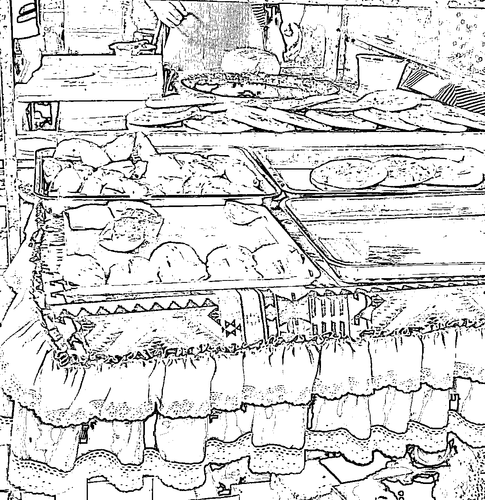

# 如何用最小 MVP 迭代，最后开家大门店？

> 原文：[`www.yuque.com/for_lazy/thfiu8/vdrtdnl3tyb7a22q`](https://www.yuque.com/for_lazy/thfiu8/vdrtdnl3tyb7a22q)

<ne-h2 id="f8a2442a" data-lake-id="f8a2442a"><ne-heading-ext><ne-heading-anchor></ne-heading-anchor><ne-heading-fold></ne-heading-fold></ne-heading-ext><ne-heading-content><ne-text id="u6a363ccb">(24 赞)如何用最小 MVP 迭代，最后开家大门店？</ne-text></ne-heading-content></ne-h2> <ne-p id="ucd008f8d" data-lake-id="ucd008f8d"><ne-text id="u234c5bd5">作者： 奋斗的木鱼</ne-text></ne-p> <ne-p id="ud1ecf5eb" data-lake-id="ud1ecf5eb"><ne-text id="u0a1cc47c">日期：2023-07-21</ne-text></ne-p> <ne-p id="u77574381" data-lake-id="u77574381"><ne-text id="ua5580ee3">我们在经营时，经常开启了门店后才发现产品不符合市场，最后只能关门歇业，消磨了斗志之余，还浪费的大量的时间和启动资金，那有没有一些办法，让自己可以用更小可行性的行动来测试市场呢？</ne-text></ne-p> <ne-p id="ud83a85bc" data-lake-id="ud83a85bc"><ne-text id="u9896ac6e">今天，我就为大伙带来我观察的一家门店，他就是用了最小的可行性的方法，不断测试和迭代，最后在 2 年后开启了 3 店，其中还有 1 家大店，那他是如何做的呢？</ne-text></ne-p> <ne-p id="u3a3ab2be" data-lake-id="u3a3ab2be"><ne-text id="ud80eb36b">下面，我就为大伙带来我观察到的信息。</ne-text></ne-p> <ne-h4 id="da3800db" data-lake-id="da3800db"><ne-heading-ext><ne-heading-anchor></ne-heading-anchor><ne-heading-fold></ne-heading-fold></ne-heading-ext><ne-heading-content><ne-text id="ud1c66c60" style="color: rgb(216, 57, 49);">【产品最小化测试】</ne-text></ne-heading-content></ne-h4> <ne-p id="u6d974225" data-lake-id="u6d974225"><ne-text id="u875fa293">这是一家新疆菜品类门店。一般新疆菜品类门店大多集中在烤肉、面食等方向，但他开店却另辟途径，用新疆馕作为切口，开设了 3 款产品，分别是“原味馕、羊肉馕、烤包子”。</ne-text></ne-p> <ne-p id="u2f414e3e" data-lake-id="u2f414e3e"><ne-card data-card-name="image" data-card-type="inline" id="NKMdg" data-event-boundary="card"></ne-card></ne-p> <ne-p id="u63d82b0b" data-lake-id="u63d82b0b"><ne-text id="u90eae602">这样有什么好处呢？</ne-text></ne-p> <ne-p id="ub7f85c64" data-lake-id="ub7f85c64"><ne-text id="u8beefe9f" style="color: rgb(216, 57, 49);">1.产品最小化验证</ne-text></ne-p> <ne-p id="u13f65ce3" data-lake-id="u13f65ce3"><ne-text id="ua50a0032">同样是门店，但是他的产品极简，且 3 款产品都可以作为早中晚三餐的食品。覆盖时段多，产品能保存时间也长，可利用美团等平台配送产品去到更远的客户群体内，让门店的生存能力大大地增加了。因此，他借助 3 款产品就能快速地验证产品在当地市场的生命力。</ne-text></ne-p> <ne-p id="u749c5272" data-lake-id="u749c5272"><ne-text id="ub5d1b498" style="color: rgb(216, 57, 49);">2.资金要求最低</ne-text></ne-p> <ne-p id="uc4c8e97e" data-lake-id="uc4c8e97e"><ne-text id="u33c45e77">因为产品少，需求的工作人员也变少，产品需求的制造空间要求也随之降低。在产品管控、成本管控、门店经营上形成了最小的闭环，而且这个闭环所要花费的资金远低于开设一家面馆（不需要堂食）。</ne-text></ne-p> <ne-p id="u6e928351" data-lake-id="u6e928351"><ne-text id="u43cfd2dd" style="color: rgb(216, 57, 49);">3.快速迭代</ne-text></ne-p> <ne-p id="u50c5d48b" data-lake-id="u50c5d48b"><ne-text id="u3b51bbfb">产品少，收集意见集中，有利于快速迭代改进。</ne-text></ne-p> <ne-p id="u145fce1e" data-lake-id="u145fce1e"><ne-text id="u8ec4bce0">产品少，但基于原有产品的基础可以千变万化，在获得第一阶段的验证后，可以立即推陈出新，快速扩大产品更大范围的测试。</ne-text></ne-p> <ne-p id="u91f5817b" data-lake-id="u91f5817b"><ne-text id="u4f9b7250" style="color: rgb(216, 57, 49);">【双腿走路，既要 toC，还要 toB】</ne-text></ne-p> <ne-p id="u56aca5c3" data-lake-id="u56aca5c3"><ne-text id="u19fa4bd3">在获得初步市场的验证后，该门店并未止步，反而转向另一端，把货卖给了门店。</ne-text></ne-p> <ne-p id="u3a050d59" data-lake-id="u3a050d59"><ne-text id="u055fde22">我偶然一次购买该门店商品，居然断货了，要知道，这家小门店虽小，但是随着生意的日渐火爆，聘请的工人是翻了倍，照理没有这么快就卖光了。</ne-text></ne-p> <ne-p id="ue064df51" data-lake-id="ue064df51"><ne-text id="ua6f21182">我随后便询问“为什么这么快就没货了”？</ne-text></ne-p> <ne-p id="u38eaac86" data-lake-id="u38eaac86"><ne-text id="ue9eb0b0b">商家的回答：“因为有别的门店预定了，所以今天早上一大半的馕都被他们拿走了“。</ne-text></ne-p> <ne-p id="u9af3ec01" data-lake-id="u9af3ec01"><ne-text id="u7dcfb36f">这让我惊愕不已，想不到在门店日渐红火的日子里，该门店没有继续深挖产品，而是沿着初阶段的产品，把产品的量加大，让门店在几款产品下继续占领更大的市场。</ne-text></ne-p> <ne-p id="u0bb5d86d" data-lake-id="u0bb5d86d"><ne-text id="u97ce0e64">后续的洽谈中还获知，该门店已经和至少 3 家门店建立合作，在对商家端供货销售的量已达到半天工作等于普通日常的两至三天的量。</ne-text></ne-p> <ne-p id="ued830c4e" data-lake-id="ued830c4e"><ne-text id="u810b7f35">虽然一周只有 3 天早上这样供货，但这样的出货量，已远超该门店日常负荷。</ne-text></ne-p> <ne-p id="u64612568" data-lake-id="u64612568"><ne-text id="u9f35188f">就这样一家小门店通过基础的产品，急速地抢占了 C 端和 B 端的客户，让小店的生命力进一步加强。</ne-text></ne-p> <ne-p id="u391e1de8" data-lake-id="u391e1de8"><ne-card data-card-name="image" data-card-type="inline" id="ldyaq" data-event-boundary="card"></ne-card></ne-p> <ne-p id="ufa7a1e0c" data-lake-id="ufa7a1e0c"><ne-text id="ubc9fa2c9">来到这里就止步了吗？</ne-text></ne-p> <ne-p id="u2b3cdbbc" data-lake-id="u2b3cdbbc"><ne-text id="uca72234d">并没有！在获得两端消费客群的流量后，该门店做出了下一个动作，按照模板，开设分店。</ne-text></ne-p> <ne-h4 id="c9168d2f" data-lake-id="c9168d2f"><ne-heading-ext><ne-heading-anchor></ne-heading-anchor><ne-heading-fold></ne-heading-fold></ne-heading-ext><ne-heading-content><ne-text id="u9e8d9d5b" style="color: rgb(216, 57, 49);">【模板复制，新市场验证】</ne-text></ne-heading-content></ne-h4> <ne-p id="u5b190909" data-lake-id="u5b190909"><ne-text id="u4cf4a734">在基于第一个门店成功后，这家馕店开设了第二家，第二店的选址选在了远离第一家的位置，且新店周边有办公楼、学校、大型商超等。</ne-text></ne-p> <ne-p id="ub7a24bea" data-lake-id="ub7a24bea"><ne-text id="u8c686864">在这家新店里，我也观察到一些有意思的新现象</ne-text></ne-p> <ne-p id="u9322f68a" data-lake-id="u9322f68a"><ne-text id="ucafa3861" style="color: rgb(216, 57, 49);">1.线上平台用具的使用增加了（大众点评，小红书等）；</ne-text></ne-p> <ne-p id="uff92ccae" data-lake-id="uff92ccae"><ne-text id="u5953b3ac">相较于第一店，第二店所处的环境竞争强了很多，周边同纬度品类和不同维度品类也上了量级，在门店线上店铺的展示中，门店的视觉、图片及优惠设置都远比第一家店好，我还在小红书这个种草平台上看到了投放的痕迹。</ne-text></ne-p> <ne-p id="u9b956889" data-lake-id="u9b956889"><ne-text id="u2ac3b6fa">这一系列的显现表明了这家馕店开始逐渐使用平台，从线上的导入流量，为自己门店流量的再加一个渠道。</ne-text></ne-p> <ne-p id="u63e0f71d" data-lake-id="u63e0f71d"><ne-text id="u98a0ae8a" style="color: rgb(216, 57, 49);">2.市场客户群体从较单一的客群扩大到了学生、蓝领、白领。</ne-text></ne-p> <ne-p id="ube8b3946" data-lake-id="ube8b3946"><ne-text id="u726da12b">第一店的客户群体比较单一（地点特殊），在第二店就不同了，周边从学校到众多办公大夏，从医院到商超，从村落到市区热点（村落靠近市区热点），因此整体面临的客户就复杂了很多。</ne-text></ne-p> <ne-p id="u0613b702" data-lake-id="u0613b702"><ne-text id="uf1613008">从这两点来看，选取该地址做第二测试门店，也是进一步验证门店生存能力，从而反扑回来第一店。</ne-text></ne-p> <ne-p id="u314e5793" data-lake-id="u314e5793"><ne-text id="uf8815708">在两家店成型状况下，该店又拓展了新店，但是这一次不同，这次是一家大店，产品从单一的馕横跨到了烤羊肉、米饭、面食等综合品类的餐厅，面积也从 10 平方扩到了约计 90 平方</ne-text></ne-p> <ne-h4 id="6790a2a1" data-lake-id="6790a2a1"><ne-heading-ext><ne-heading-anchor></ne-heading-anchor><ne-heading-fold></ne-heading-fold></ne-heading-ext><ne-heading-content><ne-text id="u8cea609c" style="color: rgb(216, 57, 49);">【综合门店，老市场里面的新测试】</ne-text></ne-heading-content></ne-h4> <ne-p id="uda9c0e60" data-lake-id="uda9c0e60"><ne-text id="ucd9f8a10">这家综合门店，开在第一家店不远处，里面的产品主围绕新疆菜，因为前期积淀的口碑，该门店开启后，一直红火，即使在假期期间，该门店的客流依然满员，从整体的入座率来说，远超于周边门店，还因其特色，逐渐在当地打出了一定的名气，让众多人员慕名过去评测。</ne-text></ne-p> <ne-p id="uaa7a7b05" data-lake-id="uaa7a7b05"><ne-text id="u8360d4db">就这样，我看着这家新疆馕店，从一家专卖馕产品扩张到经营新疆菜系的餐厅。</ne-text></ne-p> <ne-p id="uedf537eb" data-lake-id="uedf537eb"><ne-text id="ua6bf7c4c">还有两点我也要写出来，让大伙看到这家餐厅不但是最小化，在经营过程中一直保持的点。</ne-text></ne-p> <ne-p id="u45d228e4" data-lake-id="u45d228e4"><ne-card data-card-name="image" data-card-type="inline" id="jlrJY" data-event-boundary="card"></ne-card></ne-p> <ne-p id="u16b8f336" data-lake-id="u16b8f336"><ne-text id="u19f33e85" style="color: rgb(216, 57, 49);">【餐厅的产品味道好】</ne-text></ne-p> <ne-p id="u234219ea" data-lake-id="u234219ea"><ne-text id="u66f688d1">在早期单卖的馕门店里，产品虽然单一，但是采取的是地道做法，从面粉到烤制，全是使用的传统方法，虽然耗时长，但因为保留传统做法，产品的味道得到了众多客户的认可。</ne-text></ne-p> <ne-p id="u57adb9b9" data-lake-id="u57adb9b9"><ne-text id="u5b57f43e" style="color: rgb(216, 57, 49);">【量大价优】</ne-text></ne-p> <ne-p id="u4859d9da" data-lake-id="u4859d9da"><ne-text id="u02dea9e5">味道好之余，产品的份量和价格都体现了性价比，几块钱一个烤包子，里面满满肉，吃过一次都能感觉到实在的性价比。</ne-text></ne-p> <ne-p id="u8e4a0f52" data-lake-id="u8e4a0f52"><ne-text id="u496ebf87">一开始，他开店的时机并不理想，因为刚好遇到疫情，同属于市场的其他商家都大量的歇业，客户也被锁在了固定园区内，导致大量客流被截断，而大量门店歇业进一步导致客流的减少。幸运的是，他的产品灵活性强，能局部扭转疫情带来的影响，从而让他在疫情期间依然能活下来，到了后面，经历疫情后，因为产品的味道和开拓了 B 端客户，让他获得了极大的生存能力，然后顺势的在庞大客户群体内，开设了第一家大店。</ne-text></ne-p> <ne-p id="u9f69ffa6" data-lake-id="u9f69ffa6"><ne-text id="u50a14c4e">这家门店一步步走来，其实都在验证了最小化 MVP 的方法，从小店，小店对 B 端客户，小店的扩张尝试，小店基于整理市场的客户开拓大店，逐步走出了自己的一片小天空，在 2 年的内时间里，做到了这样的成绩，是非常值得我们学习的。</ne-text></ne-p> <ne-p id="ub0bfcc46" data-lake-id="ub0bfcc46"><ne-text id="ue13bf437">最后，说说额外话，借机问大伙一个问题：基于最后两点“产品味道好与量大价优”上，大伙觉得如果没有最小化验证，他是不是一样能生存下来呢？</ne-text></ne-p> <ne-p id="u04cb9de9" data-lake-id="u04cb9de9"><ne-text id="u6857442a">期待大伙不同视角的答案。</ne-text></ne-p> <ne-hole id="ue424f9a2" data-lake-id="ue424f9a2"><ne-card data-card-name="hr" data-card-type="block" id="O9KCv" data-event-boundary="card"><ne-p id="u01d53f05" data-lake-id="u01d53f05"><ne-text id="ubfb2a873">评论区：</ne-text></ne-p> <ne-p id="uc8fad47d" data-lake-id="uc8fad47d"><ne-text id="u828f9d0e">暂无评论</ne-text></ne-p> <ne-p id="ua1bf8546" data-lake-id="ua1bf8546"><ne-card data-card-name="image" data-card-type="inline" id="Oos8G" data-event-boundary="card">  <ne-hole id="u71cf6d70" data-lake-id="u71cf6d70"><ne-card data-card-name="hr" data-card-type="block" id="NRbFm" data-event-boundary="card"></ne-card></ne-hole></ne-card></ne-p></ne-card></ne-hole>