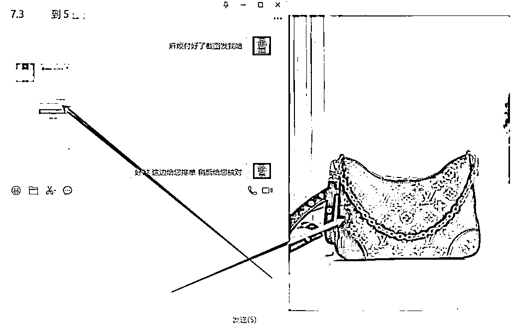

# 轻资产风口，二奢创业的经验分享

> 原文：[`www.yuque.com/for_lazy/thfiu8/tgof47mfa10lcl5h`](https://www.yuque.com/for_lazy/thfiu8/tgof47mfa10lcl5h)

<ne-h2 id="607cbc57" data-lake-id="607cbc57"><ne-heading-ext><ne-heading-anchor></ne-heading-anchor><ne-heading-fold></ne-heading-fold></ne-heading-ext><ne-heading-content><ne-text id="ua6999f53">(54 赞)轻资产风口，二奢创业的经验分享</ne-text></ne-heading-content></ne-h2> <ne-p id="uc01dbe07" data-lake-id="uc01dbe07"><ne-text id="u870e49ff">作者： 亮亮（中古妙奢）</ne-text></ne-p> <ne-p id="u9e40be21" data-lake-id="u9e40be21"><ne-text id="u5e3348e6">日期：2023-07-17</ne-text></ne-p> <ne-p id="ub9da2cca" data-lake-id="ub9da2cca"><ne-text id="u8e746e59">圈友们大家好，我是亮亮，我是一名 99 年的二奢老板，是【中古妙奢】的主理人，从事二奢行业一年半，独立门户半年，就在上个月，我挣到了近 30W，很高兴通过邀请来到生财有术，分享一下自己的行业项目，今天我把我所在做的事呈现分享给大家。</ne-text></ne-p> <ne-p id="ub38cb3f8" data-lake-id="ub38cb3f8"><ne-text id="u53701a6c">我曾做过很多实体行业，比如剧本杀店、民宿、电子烟品牌等。在 22 年初迫于政 ce 打压，电子烟门店关闭后，接触到了自己的师傅，也引领我进入了二奢行业，通过一年的学习实践，在今年 3 月份拿到了自己的《奢侈品鉴定师能力认证证书》，在 4 月中旬创立自己的品牌，并且认识了自己的贵人（也是生财的圈友哦，很多伙伴应该都认识，为了保护他的信息安全，不被叨扰，暂时先不提他的名字啦），投资了我的梦想，目前在长沙及成都两地做二手奢侈品收售工作室。</ne-text></ne-p> <ne-p id="u46c9a43c" data-lake-id="u46c9a43c"><ne-card data-card-name="image" data-card-type="inline" id="WkqDz" data-event-boundary="card"></ne-card></ne-p> <ne-p id="ufbe69584" data-lake-id="ufbe69584"><ne-text id="uf3de65a0">“二奢行业的入行门槛极高”这句话是大多数人的第一直觉，觉得一些包包手表即便是回收，一件商品动辄压货几千，更止十几万甚至更多，很多人对此行业望而却步，不会入行，所以二奢行业当下的形式还是一片明朗的，至少在未来三年，行业前景是一片乐观的。现在入局还来得及，能够踩上这个行业的风口顶峰，并不用担心自己的投入成本不够，我做事一直有一个信仰：只要我想做成的事，总有办法做成。</ne-text></ne-p> <ne-p id="u5ec564d0" data-lake-id="u5ec564d0"><ne-text id="ud2b9b33b">接下来，我从以下几个方面，给圈友们好好介绍一下这个行业，并分享我的二奢行业进阶史，告诉大家这个行业是真的可以马上动手开始起盘操作的：</ne-text></ne-p> <ne-p id="u88338908" data-lake-id="u88338908"><ne-text id="u33a88b4e" ne-bold="true">1.二奢行业前景</ne-text></ne-p> <ne-p id="ub916d550" data-lake-id="ub916d550"><ne-text id="ubc08caea" ne-bold="true">2.二奢同行打法分析</ne-text></ne-p> <ne-p id="u5804913f" data-lake-id="u5804913f"><ne-text id="ubd3a64b2" ne-bold="true">3.我是怎么做的</ne-text></ne-p> <ne-p id="ua3b74b01" data-lake-id="ua3b74b01"><ne-text id="ud2c46a0a" ne-bold="true">二奢行业前景</ne-text></ne-p> <ne-p id="u74f88871" data-lake-id="u74f88871"><ne-text id="u7496019d">目前国内的二奢大环境空前好。不像前几年，没有权威的二奢鉴定平台用户买不到安心，再者，老一辈的富豪，宁愿溢价买全新的，也不愿意用一般的价格去买二手的。但现在 90 后乃至 00 后无论是消费观还是审美较于上一代有明显的差异。追求小众彰显个性以及攀比心理是新生代人群的特质，而且一旦有符合心理预期的单品，不会在乎消费的多少。</ne-text></ne-p> <ne-p id="ud93470bc" data-lake-id="ud93470bc"><ne-text id="u93430690">并且真正的爆款一定是二奢买的，类似球鞋文化，一手你肯定是买不到的。二奢是唯一上水道与下水道循环的流通渠道，客户买了是一定会卖的，因为她每年都在买包，一个包背个一年八折九折再回收，中间的差价也可以想象。卖了就一定有流通。所以看明白的一定是做信任加私域的，搞服务，逮着客户死磕。1000 个好友每人贡献 1000 块钱，一年的净利润就有 100 万。</ne-text></ne-p> <ne-p id="u848d0b73" data-lake-id="u848d0b73"><ne-card data-card-name="image" data-card-type="inline" id="KEf4z" data-event-boundary="card"></ne-card></ne-p> <ne-p id="ubad8d9ee" data-lake-id="ubad8d9ee"><ne-text id="u06817cc6" ne-bold="true">二奢同行打法分析</ne-text></ne-p> <ne-p id="uc851037e" data-lake-id="uc851037e"><ne-text id="uf8848d58" ne-bold="true">直播电商：</ne-text></ne-p> <ne-p id="u1409c0ec" data-lake-id="u1409c0ec"><ne-text id="u71159221">直播电商无疑是帮助二奢行业打开市场的有力武器。</ne-text></ne-p> <ne-p id="uc55666c6" data-lake-id="uc55666c6"><ne-text id="u1a01781e">二手奢侈品存在着只有一件库存的特点，所以直播电商可以说是最高效率的进行商品呈现，每件单品 1～2 分钟的直播讲解，单次直播能进行大几十的商品展示，并且也是用户互动路径最短的交易模式，彻底摆脱了线下一对一的低效营销模式。同时弊端也很明显。由于二奢的单价不低，直播间的搭建以及商品的展示需要大批量囤货，有较高门槛。</ne-text></ne-p> <ne-p id="u168f0904" data-lake-id="u168f0904"><ne-card data-card-name="image" data-card-type="inline" id="Ne61D" data-event-boundary="card"></ne-card><ne-card data-card-name="image" data-card-type="inline" id="qkChj" data-event-boundary="card"></ne-card></ne-p> <ne-p id="u061825bf" data-lake-id="u061825bf"><ne-text id="u1b1862fc" ne-bold="true">小红书引流：</ne-text></ne-p> <ne-p id="uf031ad1a" data-lake-id="uf031ad1a"><ne-text id="u829e413b">二奢在小红书最有效果的打法只有两点：1、秀品牌秀人设（实体店背书）  2、秀专业知识</ne-text></ne-p> <ne-p id="u85da103d" data-lake-id="u85da103d"><ne-text id="u5c108f9a">秀品牌人设，在自媒体所有行业都是共通的，任何商业的本质都是建立在信任的基础之上，越来越多的人通过自媒体平台打造个人 ip 以及品牌价值，这样能很好的解决与粉丝之间的信任问题。用户更愿意相信的是一个活生生的人。</ne-text></ne-p> <ne-p id="u23a31c85" data-lake-id="u23a31c85"><ne-text id="u37abd7f5">秀专业知识，比如包包的测评，包包的科普，真假防伪鉴别知识等等。好处是，最起码人家知道你说的是专业的，毕竟奢侈品这么高的客单价，用户有戒心是很平常的。</ne-text></ne-p> <ne-p id="ue7f5445b" data-lake-id="ue7f5445b"><ne-card data-card-name="image" data-card-type="inline" id="VXdfT" data-event-boundary="card"></ne-card></ne-p> <ne-p id="ucc26a1a9" data-lake-id="ucc26a1a9"><ne-card data-card-name="image" data-card-type="inline" id="kG4cO" data-event-boundary="card"></ne-card><ne-card data-card-name="image" data-card-type="inline" id="ffwbl" data-event-boundary="card"></ne-card></ne-p> <ne-p id="u8b4e40e6" data-lake-id="u8b4e40e6"><ne-text id="u6286082a" ne-bold="true">我是怎么做的</ne-text></ne-p> <ne-p id="u80f2b322" data-lake-id="u80f2b322"><ne-text id="ua0c9fb9e">因为家庭条件从小较好，加之自己成年后交际圈子的推崇，开始对品牌这件事有了理解和认知，我钟爱 THOM BROWNE.和 Burberry 两个品牌，这是我夏季的衣柜（百分之 90 都是这两个品牌）：</ne-text></ne-p> <ne-p id="udd7875db" data-lake-id="udd7875db"><ne-card data-card-name="image" data-card-type="inline" id="qXfzf" data-event-boundary="card"></ne-card></ne-p> <ne-p id="uccccd8d3" data-lake-id="uccccd8d3"><ne-text id="ube098544">但在之后的学习上，并没有多大的作用，因为鉴定和回收真的是需要专业性的，在没有鉴定能力时，可以去对接靠谱的鉴定师，也是完全可行的，我相当于也是算一个 0 基础的小白入的行，所以圈友们不要对这个行业有恐惧心理，真的去掌握行业的底层逻辑，处处是黄金。</ne-text></ne-p> <ne-p id="u121f3c1c" data-lake-id="u121f3c1c"><ne-text id="ud0cf70ee">2022 年 2 月，刚过完一个团圆年，接到很多的行业消息，电子烟实体迎来毁灭性的压力，迫不得已为保全半个身躯，我关闭了经营一年的电子烟代理门店，在彷徨之际，因为自己的小圈子不错，通过朋友介绍，得以幸识自己的师傅，带我进入了二奢行业，刚开始作为师傅的助理，负责师傅团队的整体后勤，从给销售客服、主播及运营订员工餐、打扫卫生开始，慢慢认识到了这个行业的魅力，当时也见过单场直播下来一个主播拿到小十万的提成，暗自羡慕，不断地请求师傅能不能尽早的带我入行，哪怕从销售干也行，师傅总说别急，还不行。（后来知道是因为师傅认可我这个孩子，把我定位在一个日后可以脱离他独当一面的主理人的方向，想先从做事的心性上锻炼我，让我的底子能打得实在些，很感谢师傅当时的做法，我才能成为现在的自己）</ne-text></ne-p> <ne-p id="u0dc145b3" data-lake-id="u0dc145b3"><ne-text id="u55254c4d">2022 年 4 月中旬，师傅的大团队迎来了考验，一名销售主管和主播谈恋爱，带着自己的销售团队和两名主播直接跳出去单干了，因为师傅对他们过于信任，所以没有之前没有签署什么赔偿条款。如果你也是二奢同行，就应该对此事有所耳闻。师傅被筐在其中，除了资金没有损失，团队的大臂江山已然不在，当下培养新人会消耗更大的时间成本及员工培育成本。这时已做了两个月后勤的我临危受命，去做了销售客服，为了帮助师傅，我呼应自己的圈子自己的朋友，招募到了三个对二奢有所了解的朋友过来上班，通过短时间的高强度填补能力，销售团队得以稳固。就这样，我开始锻炼起了自己的二奢销售能力，六月份一个月的私域销售额做到了 42 万，通过师傅的委任，我成为了客服部门的一个小组长，带领着 6 名小伙伴冲刺下半年的销售。</ne-text></ne-p> <ne-p id="uf76edcdd" data-lake-id="uf76edcdd"><ne-text id="ud92144c9">师傅对我非常的好，只要是我提的问题都会给我非常详细的解答，有时还会通过一些行为方式让我自己能够悟到，慢慢的，我用了大半年的时间，摸透了师傅的团队整体的运营逻辑，很感谢师傅。</ne-text></ne-p> <ne-p id="u280fe2fb" data-lake-id="u280fe2fb"><ne-text id="u4df3937f">2023 年 1 月 22 日，这是让我一直记忆深刻且对我接下来的人生有着重大改变的一天，我会永远记住这天，前一天刚与家里团过年，把去年的年终奖交给了妈妈，第二天和师妹提着礼物去向师傅拜年，在饭间，师傅意味深长的说到：“亮亮，你可以自己出去做店了，师傅看得到你的抱负不止于此，师傅带你也是想让你好，把证拿了，自己出去做，让郑琳（我的师妹）去帮你，好好的做人做事！”我一下泪目了...我一直哭着说我不走我不走，我舍不得师傅（我根本没有打算过离开师傅），师傅放下筷子，告诉我他也想要一个新的开始了，因为某音、某宝的同行竞争内卷，他想把自己归零，新的一年换一个新方向做二奢，减少工作强度，好好陪自己的女儿，师傅的女儿今年高三，正是倒计时高考冲刺的时候。我一口气喝完分酒器中的酒（应该还有一两半的样子），答应了下来。就这样，为了让师傅不孤单，我并没有带走师妹，开始了自己的二奢收售品牌创业...</ne-text></ne-p> <ne-p id="ubc00669a" data-lake-id="ubc00669a"><ne-text id="u795ecb2e">2 月，我报名的鉴定师学习成功可以拿证（3 月 10 号才拿到的），开始设计布局自己的创业框架，首先，要想挣到钱只需要复制成功的结果，复制师傅团队的底层运营框架，因为自己没拿多少钱开始，所以师傅团队一些大项开支我该裁掉的裁掉，就此，我把直播部门从我的团队版图设计中直接删掉了，轻资产上路，只做公域引流加私域成交，先让自己的本钱壮大起来才是当务之急。</ne-text></ne-p> <ne-p id="ua53f07fc" data-lake-id="ua53f07fc"><ne-text id="u7d6a1f5e">2 月 20 号，我自己的品牌上线，起名为【中古妙奢】四月份最终敲定的，首批启用了 5 个微信做私域承接，每天朋友圈保持 10-12 条的防折叠营销产品介绍，同时在某音及某红书开始批量养号，拍摄并剪辑图文视频。陆续注册了闲鱼账号和得物旗下的 95 分商家，不仅可以直接销售，也可以做到间接引流。</ne-text></ne-p> <ne-p id="u8cc3bd86" data-lake-id="u8cc3bd86"><ne-text id="ud3e90878">看到这里，圈友们就能明白，我的二奢创业是多么的轻资产了吧？觉得还不轻资产，可以继续往下看我的细节操作。</ne-text></ne-p> <ne-p id="ud8cb3a91" data-lake-id="ud8cb3a91"><ne-text id="uf0822b78" ne-bold="true">选品：</ne-text></ne-p> <ne-p id="u396f5335" data-lake-id="u396f5335"><ne-text id="u2b7b6f97">我首次是在师傅那里淘了 10 来件回收价格 700 元以内的钱包背包（正经的很多回收价格真的只有这么多），既然要轻资产运营，那么就把轻资产运营到底！我用这 10 来件二手小包，拍摄商品细节图，发布在闲鱼等交易平台，销售客单价基本增长为成本的 20%-35%,增加曝光的同时，自己剪辑一些好看包包的合图发布在某音和某红书。</ne-text></ne-p> <ne-p id="u320311d3" data-lake-id="u320311d3"><ne-text id="u067de87a">我就只做低价引流，二奢二奢，不就是图便宜还要面子吗？买二奢的用户真正仅是不能享受专柜人员的服务和包包的第一次或前几次的使用权罢了。就这样，我的 5 个号被添加人数都基本是 99+，其中有两个号因为是新号，被限制解封后又阵亡了，所以仅剩了 3 个号一直在运营。</ne-text></ne-p> <ne-p id="u8839832f" data-lake-id="u8839832f"><ne-text id="ue11e5b56">到了我的私域你可就走不出去啦！我从添加用户的介绍开始，包括朋友圈主页图，都会严丝合缝的拿捏用户消费。</ne-text></ne-p> <ne-p id="u5567d9ea" data-lake-id="u5567d9ea"><ne-card data-card-name="image" data-card-type="inline" id="KKzAA" data-event-boundary="card"></ne-card></ne-p> <ne-p id="ub3096c41" data-lake-id="ub3096c41"><ne-text id="u2bc86695">我有一套自己实践很久独创的私域运营方案，我会把客户分类，做标签化管理，每种类别的标签看到的朋友圈是不一样的，包括我跟他们的聊天话术都会有所区别，并且我还提供回收和以旧换新业务，就在这样的细节运营下，我在 3 月份就积累了 4000 多精准二奢用户，月销售额做到了 22 万 6 千元。26 号奖励自己去了一趟三亚，劳逸结合休息放松了几天，因为我知道接下来我就要真正打一场硬仗了，自己的闭环跑通，接下来就是打造壁垒和找投资做放大了。</ne-text></ne-p> <ne-p id="udccc4ac7" data-lake-id="udccc4ac7"><ne-text id="u900d2c44">这真是一份对师傅满意的答卷，但也遇到了问题，就是个微收款限制并风控，就包括我的银行卡也有两张被限制了非柜面交易，这真是一个麻烦事...</ne-text></ne-p> <ne-p id="u3d8fe694" data-lake-id="u3d8fe694"><ne-text id="u46e614b9">既然我的闭环也已经跑通了，那么应该可以大干特干了，因为之前进入网创圈学习引流，也认识到了很多大佬，其中认识到了一位投资人，也是我至今除师傅以外的另一位贵人，他也在生财、淘金和群响，线上聊天到电话聊天，再到线下见面，再到确定合作，只用了小半个月时间，那时也正值淘金之路那边的三周年线下见面会，虽然因为自己每天一个人的高强度工作压力错过了和淘金圈友们的见面，但是大佬开车来我家中，看到了我一人的工作场景和存货，他给我设计了一套商业运营模式我采纳后，当即决定投资，当天签下了 85 万的投资协议，并且我拿到了财务权和决策权，这也是我贵人对我的高度信任了，也曾自己扛着诸多压力帮我解决了很多麻烦。</ne-text></ne-p> <ne-p id="uaae826c8" data-lake-id="uaae826c8"><ne-card data-card-name="image" data-card-type="inline" id="QAjLk" data-event-boundary="card"></ne-card><ne-card data-card-name="image" data-card-type="inline" id="lT0xy" data-event-boundary="card"></ne-card><ne-card data-card-name="image" data-card-type="inline" id="zAM7J" data-event-boundary="card"></ne-card></ne-p> <ne-p id="u35a19af2" data-lake-id="u35a19af2"><ne-text id="u27000ba2">就此，我开始组建招募我的小团队，开通商家收款码，在第一个月教团队成员如何引流的引流，如何做销售的销售，并且我在销售服务上增添了不少改进，与用户做朋友，为用户做到私人推荐：</ne-text></ne-p> <ne-p id="u07c50b48" data-lake-id="u07c50b48"><ne-text id="u581bd340">我将客户分为四大种标签，他们所能看到的朋友圈图文都是不一样的展现。</ne-text></ne-p> <ne-p id="uf15ef6c3" data-lake-id="uf15ef6c3"><ne-text id="ua06e9c7c">在四大种标签中，又分男女性别，这样可以做到很好的奢品推荐。</ne-text></ne-p> <ne-p id="ua4e611f3" data-lake-id="ua4e611f3"><ne-text id="ue236f049">我自己编辑了一套话术库，分享给了每一个销售客服微信号，他们直接点击话术就可以发送，方便了不少，针对不一样的标签，话术是不一样的。</ne-text></ne-p> <ne-p id="ue6e9db5e" data-lake-id="ue6e9db5e"><ne-text id="ud8e30197">还有挺多的细节及活动，让用户能更多的感受到我的精细化运营服务，从而大大提高了开单率与复购率。</ne-text></ne-p> <ne-p id="ubf521507" data-lake-id="ubf521507"><ne-card data-card-name="image" data-card-type="inline" id="ISBbl" data-event-boundary="card"></ne-card></ne-p> <ne-p id="u48b2da9f" data-lake-id="u48b2da9f"><ne-text id="uf83de7b1">五月份的销售额虽然少，但是对比与没有被投资之前，确实还是有增长，在六月份，我也不负师傅和投资人的信赖，取得了五月份 3 倍多销售额的成绩。</ne-text></ne-p> <ne-p id="u5176ae1a" data-lake-id="u5176ae1a"><ne-card data-card-name="image" data-card-type="inline" id="lcEFM" data-event-boundary="card"></ne-card><ne-card data-card-name="image" data-card-type="inline" id="RukWC" data-event-boundary="card"></ne-card></ne-p> <ne-p id="u017e2a3f" data-lake-id="u017e2a3f"><ne-text id="u414f9a67">也就在这个七月，我开始拓宽自己的应用渠道，开始做 tob 的业务，为学员代理提供二奢垫资供应链，提供二奢鉴定业务和回购业务，我也会把自创的私域精细化运营倾囊相授，因为学员代理能挣到越多的钱，我作为供应链也就能有更高的收益。为了保证供应链的稳定，我把所有利润 All in 压在了库存储备回收上，并且能做到下单后 24 小时内发货，回收可以做到收到货后 24 小时内转款。虽然投资人还没有分到红，但是看到我的销售数据后，非常欢喜，对我寄予厚望。我现在可以通过自己团队的精细化运营服务，将纯利润做到百分之 25 以上，我也会用下半年时间争取做到更高！</ne-text></ne-p> <ne-p id="udcd16a9d" data-lake-id="udcd16a9d"><ne-text id="u2e58e378">我也希望圈友们能共同见证我的成长，所以我把我做二奢这个赛道以来的经历和操作分享给了大家！我的执行力也是非常高的，有位大佬说过一句话我一直记忆犹新：趁着能挣钱的时候猛猛挣钱，不要等到挣不到钱的时候后悔自己当时的一念之差。</ne-text></ne-p> <ne-p id="ucf034ef3" data-lake-id="ucf034ef3"><ne-text id="u7e36f3f0">我是亮亮，今年 24 岁，我的目标是 30 岁财务自由！加油！</ne-text></ne-p> <ne-hole id="u5b47fe62" data-lake-id="u5b47fe62"><ne-card data-card-name="hr" data-card-type="block" id="BdUNY" data-event-boundary="card"><ne-p id="u4fabcf44" data-lake-id="u4fabcf44"><ne-text id="ud998575a">评论区：</ne-text></ne-p> <ne-p id="ufe1c9f7b" data-lake-id="ufe1c9f7b"><ne-text id="u433404e3">huii : 厉害</ne-text> <ne-text id="uc343a142">挽歌 : 厉害👍</ne-text> <ne-text id="u562c29a0">道简 : 招学员代理吗？</ne-text> <ne-text id="ua18a0bd7">亮亮（中古妙奢） : 可以了解了解</ne-text> <ne-text id="ub82d5cc7">帅彬 : 厉害了 大佬了</ne-text> <ne-text id="uc1857e05">菜小猫 : 同问招代理吗</ne-text> <ne-text id="u28568695">少伯 : 圈友我想了解一下代理</ne-text></ne-p> <ne-p id="uf2a13b45" data-lake-id="uf2a13b45"><ne-card data-card-name="image" data-card-type="inline" id="QrswB" data-event-boundary="card"></ne-card></ne-p> <ne-hole id="u25d42908" data-lake-id="u25d42908"><ne-card data-card-name="hr" data-card-type="block" id="wBsTG" data-event-boundary="card"></ne-card></ne-hole></ne-card></ne-hole>