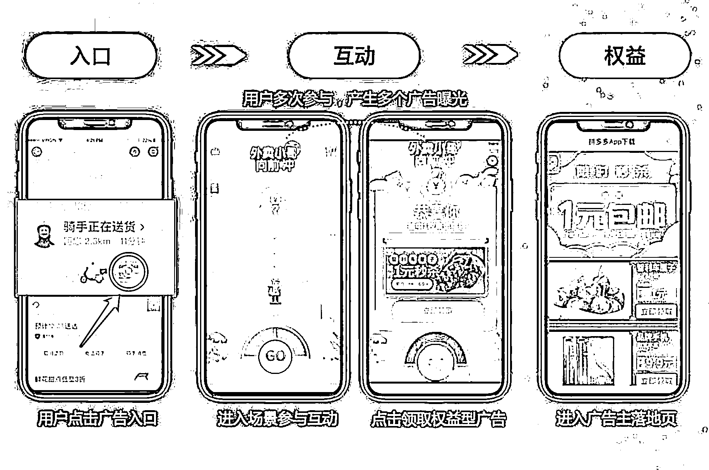
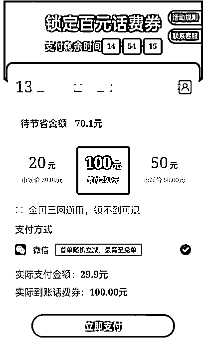

# 靠抽奖活动做互动广告，头部公司如何做到一年营收十几亿的？

> 原文：[`www.yuque.com/for_lazy/thfiu8/xbuwvaav6apsm5sr`](https://www.yuque.com/for_lazy/thfiu8/xbuwvaav6apsm5sr)

<ne-h2 id="f208ad70" data-lake-id="f208ad70"><ne-heading-ext><ne-heading-anchor></ne-heading-anchor><ne-heading-fold></ne-heading-fold></ne-heading-ext><ne-heading-content><ne-text id="uc5641826">(精华帖)(50 赞)靠抽奖活动做互动广告，头部公司如何做到一年营收十几亿的？</ne-text></ne-heading-content></ne-h2> <ne-p id="u079259e3" data-lake-id="u079259e3"><ne-text id="u12b4e006">作者： Guaiss</ne-text></ne-p> <ne-p id="u9e67cdb4" data-lake-id="u9e67cdb4"><ne-text id="u7f3b1af3">日期：2023-07-17</ne-text></ne-p> <ne-p id="ubf2f3808" data-lake-id="ubf2f3808"><ne-text id="uc201477a">”恭喜你获得一个红包“、”刮开有惊喜“、”中奖啦“...大家在使用各种小程序、APP 的时候，肯定遇到过这种中奖通知，去领现金、白酒、话费等等各种奖品。</ne-text></ne-p> <ne-p id="ub5a5c0b4" data-lake-id="ub5a5c0b4"><ne-card data-card-name="image" data-card-type="inline" id="S8wo9" data-event-boundary="card"></ne-card></ne-p> <ne-p id="u8a217afe" data-lake-id="u8a217afe"><ne-card data-card-name="image" data-card-type="inline" id="uqwpO" data-event-boundary="card"></ne-card></ne-p> <ne-p id="u99958c8f" data-lake-id="u99958c8f"><ne-text id="u084b0b30">这种抽奖活动就是一种互动广告，利用用户对游戏和奖品的好奇心，去参与抽奖产生互动，表面上用户获得了奖品，其实背后是一种拉新、增加收益的方式。</ne-text></ne-p> <ne-p id="u69c66039" data-lake-id="u69c66039"><ne-text id="u2116653c">通常来说，只要是能与用户产生交互的广告形式，都算互动广告，比如可玩广告（Playable Ads）、视频交互广告，而今天我要讲的互动广告比较简单，仅仅是以抽奖来推广的广告形式。</ne-text></ne-p> <ne-p id="u117d0a69" data-lake-id="u117d0a69"><ne-text id="ufb8b6334">接下来，和大家详细拆解互动广告行业，介绍一下互动广告行业的起源、发展和现状，以及普通玩家可以利用这种互动广告做些什么。</ne-text></ne-p> <ne-h1 id="6230d2df" data-lake-id="6230d2df"><ne-heading-ext><ne-heading-anchor></ne-heading-anchor><ne-heading-fold></ne-heading-fold></ne-heading-ext><ne-heading-content><ne-text id="uede692c9">一、起源</ne-text></ne-heading-content></ne-h1> <ne-p id="u4d4556d5" data-lake-id="u4d4556d5"><ne-text id="uc65888e8">2014 年，一家 SAAS 初创公司立志让天下没有难做的运营。</ne-text></ne-p> <ne-p id="uabbd00d7" data-lake-id="uabbd00d7"><ne-text id="u164fd590">当时，许多应用程序都希望通过使用内部积分来引导用户进行积极的行为，但如何有效地使用这些积分成为一个难题。</ne-text></ne-p> <ne-p id="u04f92489" data-lake-id="u04f92489"><ne-text id="u402bf7c3">于是这家公司开发了积分商城的 SAAS 服务，开发者可以 h5 形式接入这个商城并与他们自己的积分体系对接。</ne-text></ne-p> <ne-p id="udb2497eb" data-lake-id="udb2497eb"><ne-text id="u1029cadd">SAAS 公司提供了一些需要花费积分购买的商品，例如话费，同时也提供了一些对平台免费获取且对用户有一定价值的商品，例如视频平台 7 天体验券、电商 app 新人优惠券等。</ne-text></ne-p> <ne-p id="ufc6f860e" data-lake-id="ufc6f860e"><ne-text id="u632690d8">用户可以使用积分来兑换这些商品（当然，兑换有价商品时开发者是要付钱的），也可以免费参与一些抽奖活动来抽取。开发者可以设置每个用户每天参与抽奖的次数等数值，以引导用户留存。</ne-text></ne-p> <ne-p id="u7281017a" data-lake-id="u7281017a"><ne-text id="u583c0c16">这个积分商城成为了当时非常受欢迎的运营工具，许多知名的 App 如饿了么等都在使用它。</ne-text></ne-p> <ne-p id="uccaa9610" data-lake-id="uccaa9610"><ne-card data-card-name="image" data-card-type="inline" id="U9zqH" data-event-boundary="card"></ne-card></ne-p> <ne-p id="ub6673922" data-lake-id="ub6673922"><ne-text id="uf7667905">有一天，有人说：“这些提供免费新人优惠券的公司，我们给他们带来了用户流量，他们免费提供优惠券还不够，我们还应该从他们那里收费！</ne-text></ne-p> <ne-p id="ud4c46f4d" data-lake-id="ud4c46f4d"><ne-text id="u00d80125">”于是，该 SAAS 公司联系了一些有拉新需求的公司，让他们提供新人优惠券，并按照实际拉新的数量来问他们收费。</ne-text></ne-p> <ne-p id="ub8a3fddd" data-lake-id="ub8a3fddd"><ne-text id="u8e080330">实际测试中发现，用户在抽奖活动中抽到无价值券后转化还蛮好。后来这个模式开始从积分商城中抽离，作为变现产品单独去接开发者。这就是互动广告的雏形，而这家公司就是兑吧，后来于 2019 年上市 ，</ne-text><ne-text id="ubcbade5e" style="color: rgb(143, 149, 158);">股票代码：01753.HK</ne-text><ne-text id="u53f50ca6">。 （顺带提一句上市时创始人才 28 岁）</ne-text></ne-p> <ne-h1 id="a5b5e67d" data-lake-id="a5b5e67d"><ne-heading-ext><ne-heading-anchor></ne-heading-anchor><ne-heading-fold></ne-heading-fold></ne-heading-ext><ne-heading-content><ne-text id="u3e6c8e5d">二、业务模式</ne-text></ne-heading-content></ne-h1> <ne-p id="uf1dccf73" data-lake-id="uf1dccf73"><ne-text id="uac6664cc">为了给大家一个直观的认识，以下是一个常见的用户侧流程</ne-text></ne-p> <ne-p id="ue576ddb5" data-lake-id="ue576ddb5"><ne-card data-card-name="image" data-card-type="inline" id="JsAbb" data-event-boundary="card"></ne-card></ne-p> <ne-p id="u50b9892f" data-lake-id="u50b9892f"><ne-text id="u784645fa">整个业务模式中，分为了三方 ：流量主、平台方、广告主，广告平台是流量与广告的中间商，以赚取差价作为盈利的手段。</ne-text></ne-p> <ne-p id="u8d72fc84" data-lake-id="u8d72fc84"><ne-card data-card-name="image" data-card-type="inline" id="QYmIa" data-event-boundary="card"></ne-card></ne-p> <ne-p id="u64be6a58" data-lake-id="u64be6a58"><ne-text id="u07de15e0" ne-bold="true">（1）互动广告的差异化竞争</ne-text></ne-p> <ne-p id="uaa631535" data-lake-id="uaa631535"><ne-text id="ua9c491bc">那有人要问了，所有的广告平台都是这样的赚差价的模式，互动广告跟其他广告能有什么区别？</ne-text></ne-p> <ne-p id="u0765f92e" data-lake-id="u0765f92e"><ne-text id="u6a44fccf">常见的广告平台都只提供</ne-text> <ne-text id="u8774fa2e" ne-bold="true">标准化广告位</ne-text> <ne-text id="uf9cb1cb8">的广告变现（如开屏、banner、插屏、激励视频等），而互动广告基本不参与竞争这些位置，而是利用一些犄角旮旯的广告位为开发者做出一些增量收益。</ne-text></ne-p> <ne-p id="u129eaed3" data-lake-id="u129eaed3"><ne-text id="u6717b276">如下图所示，这些位置太小，很难把正常广告的内容展现出来，而却很适合利用一些吸睛素材，如『你有奖品待领取』『有一条未读消息』等把用户吸引进去，用抽奖来承接。</ne-text></ne-p> <ne-p id="u1f10002e" data-lake-id="u1f10002e"><ne-card data-card-name="image" data-card-type="inline" id="KROxi" data-event-boundary="card"></ne-card></ne-p> <ne-p id="u3d73aa30" data-lake-id="u3d73aa30"><ne-text id="ue074321f">那其他广告平台为什么不也来做这块的事情呢？我认为主要是这两个原因：</ne-text></ne-p> <ne-p id="u2256f1d9" data-lake-id="u2256f1d9"><ne-text id="u58b02e9d">① 非标广告位的天花板太低，产品的绝大部分广告收入还是来自标准广告位。</ne-text></ne-p> <ne-p id="ubb5152d2" data-lake-id="ubb5152d2"><ne-text id="ucbcd122a">② 互动广告平台的运营成本远高于普通的广告平台。 （这一点从下一小节可以大概看懂）。</ne-text></ne-p> <ne-p id="ueaa48366" data-lake-id="ueaa48366"><ne-text id="u2e2d6d7e" ne-bold="true">（2）常见的业务合作流程</ne-text></ne-p> <ne-p id="uf82cebad" data-lake-id="uf82cebad"><ne-text id="ub068f58a" ne-bold="true">① 对流量主</ne-text></ne-p> <ne-p id="ub9323c74" data-lake-id="ub9323c74"><ne-text id="uc974dd40">一般来说都是 app 开发者：</ne-text></ne-p> <ne-p id="u8332f894" data-lake-id="u8332f894"><ne-text id="u142e0f1b">1\. 双方确认结算模式 （平台方一般希望以 cps 结算，常见的结算模式就是 cps/cpc）</ne-text></ne-p> <ne-p id="uca803f4b" data-lake-id="uca803f4b"><ne-text id="u553b937c">2\. 平台运营与开发者对接，共同确定产品中适合做互动广告的位置。</ne-text></ne-p> <ne-p id="u9e7a8936" data-lake-id="u9e7a8936"><ne-text id="u434cd8f3">3\. 提供给开发者一条 h5 链接，开发者控制跳转到这条 h5 即可。</ne-text></ne-p> <ne-p id="ue62a036e" data-lake-id="ue62a036e"><ne-text id="u43ff2c06">4\. 开个后台，开跑，看数据，等结算。</ne-text></ne-p> <ne-p id="uc60d66ae" data-lake-id="uc60d66ae"><ne-text id="ub1dea295">可以看到，互动广告对 app 的侵入程度是很低的，不需要集成 SDK，一条 h5 即可变现，可以很快速的进行测试，所以在发展初期，还是很容易拓展流量的。</ne-text></ne-p> <ne-p id="u5068a4c1" data-lake-id="u5068a4c1"><ne-text id="u3fb44777" ne-bold="true">② 对广告主</ne-text></ne-p> <ne-p id="u50bdcd5a" data-lake-id="u50bdcd5a"><ne-text id="u15fbc106">1\. 双方确认计费模式和价格（大平台基本都是 ocpc 出价），确认考核指标。</ne-text></ne-p> <ne-p id="ub4078b38" data-lake-id="ub4078b38"><ne-text id="uddd80feb">2\. 广告主提供落地页，并充值预付。</ne-text></ne-p> <ne-p id="u818315e0" data-lake-id="u818315e0"><ne-text id="u79c300eb">3\. 平台运营制作广告素材。</ne-text></ne-p> <ne-p id="u5dba1f22" data-lake-id="u5dba1f22"><ne-text id="u2a38d8c8">4\. 开个后台，开跑。</ne-text></ne-p> <ne-p id="ud180b9bc" data-lake-id="ud180b9bc"><ne-text id="u6069d36c">对比起常见的广告平台，流量主和广告主的操作成本都极低。</ne-text></ne-p> <ne-p id="u12805ed2" data-lake-id="u12805ed2"><ne-text id="u93308a93">自己做过 app 接广告变现的圈友肯定知道，标准广告位只接一家收益上不去，接了聚合还要建什么 waterfall，设置 bid floor 之类的一堆事情，挺有学问的。</ne-text></ne-p> <ne-p id="u83f74f45" data-lake-id="u83f74f45"><ne-text id="ud5bb4a8c">但是接互动，如果你觉得收益低，就再找一家互动来分流测，谁给的钱多就把量给谁多点，就这么简单。</ne-text></ne-p> <ne-p id="u72b7c5f5" data-lake-id="u72b7c5f5"><ne-text id="uec421fcb">而对于广告主来说，如果你去广点通投，不找代理的话你得自己每天做一堆素材，建计划，盯数据等等，而在互动广告平台，就是简单的约定好考核指标，等平台的 ae 帮你做优化就好了。</ne-text></ne-p> <ne-h1 id="caf1094f" data-lake-id="caf1094f"><ne-heading-ext><ne-heading-anchor></ne-heading-anchor><ne-heading-fold></ne-heading-fold></ne-heading-ext><ne-heading-content><ne-text id="u04e540c8">三、发展</ne-text></ne-heading-content></ne-h1> <ne-p id="u48c2860a" data-lake-id="u48c2860a"><ne-text id="ufb7eca25" ne-bold="true">（1）流量问题</ne-text></ne-p> <ne-p id="ua4920bde" data-lake-id="ua4920bde"><ne-text id="u0f517479">平台方面临的最大问题就是如何扩大规模，最开始大家投入精力的方向都是去找各种各样的 app 合作，随着时间推移，方向发生了一些改变。</ne-text></ne-p> <ne-p id="u6a6451f0" data-lake-id="u6a6451f0"><ne-text id="udb21a0ca" ne-bold="true">线上流量 -> 线下场景</ne-text></ne-p> <ne-p id="udae0929c" data-lake-id="udae0929c"><ne-text id="uca9b2782">由于互动广告的特点就是对于入口没有高要求，需要传递的信息量很少，于是就发展出一条找线下流量的路线。</ne-text></ne-p> <ne-p id="uea7c862e" data-lake-id="uea7c862e"><ne-text id="ue7dabcbd">比如饮料罐/瓶盖上的活动、扫码支付后自动跳转到抽奖。其中最成功的合作就是快递面单上的二维码，可以透露的几个关键数字是，扫码进入的用户参与率高达 90%以上。</ne-text></ne-p> <ne-p id="ub0841ff0" data-lake-id="ub0841ff0"><ne-text id="uc8187f09">一个扫码进入的用户，可以为平台产生 1 元以上的广告收入。</ne-text></ne-p> <ne-p id="u546ebbd4" data-lake-id="u546ebbd4"><ne-text id="uc963bce7" ne-bold="true">直媒 -> 大平台开户</ne-text></ne-p> <ne-p id="uec3fb5a9" data-lake-id="uec3fb5a9"><ne-text id="u4dc679da">一开始大家都是找媒体/流量方直接合作，要位置跳互动。这种方式还是比较难快速把规模搞起来，后来就逐渐有了在大平台（比如快手、百度、爱奇艺等）开户投放的玩法。</ne-text></ne-p> <ne-p id="ud4aa3253" data-lake-id="ud4aa3253"><ne-text id="uf0d2c19b">头部的互动广告公司，以前每天在快手的买量广告消耗在 500 万以上。</ne-text></ne-p> <ne-p id="uea3101d8" data-lake-id="uea3101d8"><ne-text id="ue3e907f3">与广告主直接去大平台投放不同，互动广告平台的运营去其他大平台投放的是一个抽奖页面， 这时素材就可以做的很诱导，比其他广告主的素材点击率有优势，竞价也会有优势。</ne-text></ne-p> <ne-p id="u18ca1b61" data-lake-id="u18ca1b61"><ne-text id="uf449b59c">相当于以前是互动广告平台用 cpc/cps 模式去开发者那里买量，现在是互动广告平台用 oCPM 模式去大平台那里买量，没有本质区别。</ne-text></ne-p> <ne-p id="uca6483e8" data-lake-id="uca6483e8"><ne-text id="u4f06f59b">只不过这时平台已经不像平台了，更像广告主的代理，用抽奖来为广告主的落地页做前置包装。</ne-text></ne-p> <ne-p id="uf73465d6" data-lake-id="uf73465d6"><ne-text id="u206f1937">这种变化带来的是几个结果：</ne-text></ne-p> <ne-p id="u1f164803" data-lake-id="u1f164803"><ne-text id="u84a82b74">1\. 流量不稳定： 以前直媒合作稳定之后基本就不会下掉你，这部分流量可以持续稳定的产生价值。而大平台投放面临的是竞争，很难保证流量是稳定的。</ne-text></ne-p> <ne-p id="uf67bc780" data-lake-id="uf67bc780"><ne-text id="ubfae8a70">2\. 利润率降低：直媒合作时 cps 分成 80%，留下 20%的利润或更多，而开户投放时，跑到最后可能就赚个位数的返点。</ne-text></ne-p> <ne-p id="udaa7b87d" data-lake-id="udaa7b87d"><ne-text id="ue868a4ad">3\. 资金要求比较高：因为利润率低靠走量，大玩家还撑得住，小玩家可能就只能找垫款公司。但凡有上游坏账，就亏的很惨。</ne-text></ne-p> <ne-p id="u3d43d8a7" data-lake-id="u3d43d8a7"><ne-text id="u93fdb3d6" ne-bold="true">腰部 App -> 头部 app 的内部流量</ne-text></ne-p> <ne-p id="u34eb25d3" data-lake-id="u34eb25d3"><ne-text id="u6c2cb68e">早期互动广告的商务比较喜欢去找一些二线的 app 合作，因为一线的基本不可能带你玩，二线的又能保证流量还比较多，但随着流量进一步向头部 app 集中，这个方式也越来越难。</ne-text></ne-p> <ne-p id="ucce02af8" data-lake-id="ucce02af8"><ne-text id="u6410ffb3">所以逐渐转化为去寻找头部 app 内部流量的方向，即去找小程序或者公众号开发者合作。</ne-text></ne-p> <ne-p id="u3fda8cb2" data-lake-id="u3fda8cb2"><ne-text id="uff05dbcb">与小程序开发者的合作也会遇到问题：小程序跳 h5 有各种各样的限制 -- 要加域名白名单（造成了平台新上广告主沟通成本变高）、无法支付无法下载（排除了一部分高价值广告主）。</ne-text></ne-p> <ne-p id="ue7d5663b" data-lake-id="ue7d5663b"><ne-text id="uf5933756">所以小程序的变现能力整体做不到很高。</ne-text></ne-p> <ne-p id="u2ce7be9f" data-lake-id="u2ce7be9f"><ne-text id="u348a0746" ne-bold="true">（2）广告问题</ne-text></ne-p> <ne-p id="u4ebefad0" data-lake-id="u4ebefad0"><ne-text id="u87faf25a">对于互动广告来说，适合的广告主类型其实很少。</ne-text></ne-p> <ne-p id="u39554c24" data-lake-id="u39554c24"><ne-text id="u18b69213">1\. 因为广告要包装成抽奖的奖品，所以广告本身要有明确的利益点。</ne-text></ne-p> <ne-p id="uf4082059" data-lake-id="uf4082059"><ne-text id="u197331f5">2\. 由于互动广告多以 h5 方式接入，很难获取到设备/用户信息，无法做精准个性化推荐，所以广告要有通用性。</ne-text></ne-p> <ne-p id="u03d351de" data-lake-id="u03d351de"><ne-text id="u0a7e9882">举个例子 ：装修广告在互动广告里没法投，因为无法精准定位到有房的人群，只能浪费钱。而电话卡这种就相对通用的多，大部分人都觉得话费太贵什么的。</ne-text></ne-p> <ne-p id="u051a1c57" data-lake-id="u051a1c57"><ne-text id="ua04bfbd6">所以基本都是围绕着几个类型的广告主。有一些持续了很多年一直在跑的广告类型，也有一些阶段性由于政策原因能跑出来的高价值广告</ne-text></ne-p> <ne-p id="u8266d04d" data-lake-id="u8266d04d"><ne-text id="ue3a944aa" ne-bold="true">经久不衰的几种广告</ne-text></ne-p> <ne-oli index-type="0"><ne-oli-i>1</ne-oli-i><ne-oli-c class="ne-oli-content" id="u7a2a2709" data-lake-id="u7a2a2709"><ne-text id="ub3a48f08">二类电商：尤其是茅台镇白酒 。 打着『茅台』二字的幌子，转化率极高。  落地页是货到付款的表单，一个表单线索的成本在 6 元左右，货到付款 298 元十瓶。 据说这样转化一单基本不赚钱，全靠用户复购，这说明喝起来味道还行？</ne-text></ne-oli-c></ne-oli> <ne-oli index-type="0"><ne-oli-i>1</ne-oli-i><ne-oli-c class="ne-oli-content" id="u48cd8b88" data-lake-id="u48cd8b88"><ne-text id="ud9d9736d">彩铃：有点 sp 的意思，基本靠持续按月扣用户话费为赚钱手段。</ne-text></ne-oli-c></ne-oli> <ne-oli index-type="0"><ne-oli-i>1</ne-oli-i><ne-oli-c class="ne-oli-content" id="ucd0e1410" data-lake-id="ucd0e1410"><ne-text id="ub3ac98dc">保险；</ne-text></ne-oli-c></ne-oli> <ne-p id="u80b1e71f" data-lake-id="u80b1e71f"><ne-text id="ubf304d1e">再介绍几个我了解的有固定起飞时间段的广告，这些广告并不限于在互动广告渠道投放，但在互动渠道投放效果不错，可以算是一段时间的头部广告主。</ne-text></ne-p> <ne-p id="u86f85354" data-lake-id="u86f85354"><ne-text id="u3cae3d19" ne-bold="true">20 年：返利网+支付宝卡包模式</ne-text></ne-p> <ne-oli index-type="0"><ne-oli-i>1</ne-oli-i><ne-oli-c class="ne-oli-content" id="uebd96c93" data-lake-id="uebd96c93"><ne-text id="u797162ed">在支付宝还不限制卡券发放能力的时候，这种模式给用户发一个大额支付宝卡券，点击使用会跳到一个电商返利页。利用支付宝的卡包做信任背书，让电商转化效果很好，有很强的买量能力。</ne-text></ne-oli-c></ne-oli> <ne-p id="u001f1cd5" data-lake-id="u001f1cd5"><ne-text id="u61eec2a6" ne-bold="true">21 年：水滴保、联通大王卡</ne-text></ne-p> <ne-oli index-type="0"><ne-oli-i>1</ne-oli-i><ne-oli-c class="ne-oli-content" id="ue98d4d5c" data-lake-id="ue98d4d5c"><ne-text id="ubce2c202">滴保上市冲业绩，所以疯狂投放。做了赠险+首月免费的模式，也有点欺骗用户的意思，让用户后续被持续扣费。</ne-text></ne-oli-c></ne-oli> <ne-oli index-type="0"><ne-oli-i>1</ne-oli-i><ne-oli-c class="ne-oli-content" id="ueda7b5c3" data-lake-id="ueda7b5c3"><ne-text id="u2cbc08d1">联通大王卡也是因为 5G 刚上不久，三大运营商都在抢用户。所以价格会出的高一些，可以付出 100～120 元一个激活用户的成本，在互动广告这里投放 差不多就有 15～25 一个办卡表单线索。</ne-text></ne-oli-c></ne-oli> <ne-p id="uc022a8d9" data-lake-id="uc022a8d9"><ne-text id="u9b664ad1" ne-bold="true">22 年：权益卡、盲盒</ne-text></ne-p> <ne-oli index-type="0"><ne-oli-i>1</ne-oli-i><ne-oli-c class="ne-oli-content" id="u7f0ca9a6" data-lake-id="u7f0ca9a6"><ne-text id="ud2b87e80">这些就有点擦边了，在我看来是随时在被抓的边缘。</ne-text></ne-oli-c></ne-oli> <ne-oli index-type="0"><ne-oli-i>1</ne-oli-i><ne-oli-c class="ne-oli-content" id="u6c575acd" data-lake-id="u6c575acd"><ne-text id="u7c5fc999">盲盒是博彩擦边球，就不说了。</ne-text></ne-oli-c></ne-oli> <ne-oli index-type="0"><ne-oli-i>1</ne-oli-i><ne-oli-c class="ne-oli-content" id="u10bf2e11" data-lake-id="u10bf2e11"><ne-text id="ue40f94d3">权益卡完全是欺骗用户， 看起来是 29.9 元充 100 元话费，实际上是发了一堆 5 元券，而且一个月才能领一张。这玩意暴利到什么程度呢，我听说是有代理在 23 年春节期间投这个赚了一个小目标。</ne-text></ne-oli-c></ne-oli> <ne-p id="u8f0dd411" data-lake-id="u8f0dd411"><ne-card data-card-name="image" data-card-type="inline" id="g7Qnz" data-event-boundary="card"></ne-card></ne-p> <ne-h1 id="fa671e4b" data-lake-id="fa671e4b"><ne-heading-ext><ne-heading-anchor></ne-heading-anchor><ne-heading-fold></ne-heading-fold></ne-heading-ext><ne-heading-content><ne-text id="udde396ca">四、新入局者的困境</ne-text></ne-heading-content></ne-h1> <ne-p id="uc5dadde4" data-lake-id="uc5dadde4"><ne-text id="u4407bc0d" ne-bold="true">基础：开发门槛</ne-text></ne-p> <ne-p id="u6feb7327" data-lake-id="u6feb7327"><ne-text id="u7b1e6ef3">一个互动广告平台简单来说包括三部分：</ne-text></ne-p> <ne-p id="u9221d5d7" data-lake-id="u9221d5d7"><ne-text id="ua82d8ee2">1\. 内部管理后台</ne-text></ne-p> <ne-oli index-type="0"><ne-oli-i>1</ne-oli-i><ne-oli-c class="ne-oli-content" id="u594f63f1" data-lake-id="u594f63f1"><ne-text id="u8e9fe065">管广告：广告的各种定向条件如区域、系统、环境，各种限额等；</ne-text></ne-oli-c></ne-oli> <ne-oli index-type="0"><ne-oli-i>1</ne-oli-i><ne-oli-c class="ne-oli-content" id="u78942fea" data-lake-id="u78942fea"><ne-text id="u554ad65b">管广告位：为广告位设置各种条件，如屏蔽哪些类型的广告等；</ne-text></ne-oli-c></ne-oli> <ne-p id="u878fdb31" data-lake-id="u878fdb31"><ne-text id="u8bcb5faf">2\. 广告主后台与流量主后台</ne-text></ne-p> <ne-oli index-type="0"><ne-oli-i>1</ne-oli-i><ne-oli-c class="ne-oli-content" id="u62c1d116" data-lake-id="u62c1d116"><ne-text id="u4d292a25">基本只用做一个数据展示，让广告主知道花了多少钱怎么花的，让流量主知道赚了多少钱就行。</ne-text></ne-oli-c></ne-oli> <ne-p id="ue664da45" data-lake-id="ue664da45"><ne-text id="u40b9f882">3.活动部分</ne-text></ne-p> <ne-oli index-type="0"><ne-oli-i>1</ne-oli-i><ne-oli-c class="ne-oli-content" id="u900de78f" data-lake-id="u900de78f"><ne-text id="u29a94c33">需要支持各种各样类型的抽奖活动，支持运营配置。</ne-text></ne-oli-c></ne-oli> <ne-p id="u4ddb399f" data-lake-id="u4ddb399f"><ne-text id="u48674975">影响最大的是活动部分，看起来活动没什么难度，实际转化率千差万别，考验设计功力及运营的数据分析水平。</ne-text></ne-p> <ne-p id="uffe5b034" data-lake-id="uffe5b034"><ne-text id="u1e3ff5f5" ne-bold="true">进阶 1：商务门槛</ne-text></ne-p> <ne-p id="u41069cae" data-lake-id="u41069cae"><ne-text id="u7fc526bc">由于广告平台是一个中间方，要对接广告和流量两方，就存在先有鸡还是先有蛋的问题。对互动广告这个细分领域来说，广告主是相对集中相对好接触到的，所以核心还是要先有流量。</ne-text></ne-p> <ne-p id="uf2a2ca23" data-lake-id="uf2a2ca23"><ne-text id="u09dea847">做平台是个滚雪球的过程，不断把两边都滚大，把平台滚扎实。</ne-text></ne-p> <ne-p id="ud5f0461d" data-lake-id="ud5f0461d"><ne-text id="u599b6fe9">所以 ，如果你自己有流量还不少的 app，已经在接互动广告做变现了，想自己把差价赚回来，可以考虑自己做。</ne-text></ne-p> <ne-p id="u6ab7d618" data-lake-id="u6ab7d618"><ne-text id="u8741b030">如果你本身就是个广告代理，很熟悉广告主的情况，也能接触到一些流量主，也可以考虑自己做。</ne-text></ne-p> <ne-p id="uab8e5423" data-lake-id="uab8e5423"><ne-text id="u9b99f142">如果两边你都够不到，就还是别想了。</ne-text></ne-p> <ne-p id="u524e1d33" data-lake-id="u524e1d33"><ne-text id="uf479451c" ne-bold="true">进阶 2：运营门槛</ne-text></ne-p> <ne-p id="ub53ea173" data-lake-id="ub53ea173"><ne-text id="u929e8b91">互动广告平台应该是个运营导向的业务，运营决定了平台的成败。</ne-text></ne-p> <ne-p id="u4282af62" data-lake-id="u4282af62"><ne-text id="u58a10cb4">业务流程上的每一个步骤都值得运营花时间去优化：</ne-text></ne-p> <ne-oli index-type="0"><ne-oli-i>1</ne-oli-i><ne-oli-c class="ne-oli-content" id="u6fb2f1af" data-lake-id="u6fb2f1af"><ne-text id="u3a4b5413">广告位的选择 - 决定了量级的大小</ne-text></ne-oli-c></ne-oli> <ne-oli index-type="0"><ne-oli-i>2</ne-oli-i><ne-oli-c class="ne-oli-content" id="uf65c55d3" data-lake-id="uf65c55d3"><ne-text id="uebf18f69">入口素材的测试</ne-text></ne-oli-c></ne-oli> <ne-oli index-type="0"><ne-oli-i>3</ne-oli-i><ne-oli-c class="ne-oli-content" id="udcd7df42" data-lake-id="udcd7df42"><ne-text id="uc633ecc1">抽奖活动的定制</ne-text></ne-oli-c></ne-oli> <ne-oli index-type="0"><ne-oli-i>4</ne-oli-i><ne-oli-c class="ne-oli-content" id="u54154b82" data-lake-id="u54154b82"><ne-text id="ub05c5616">广告的选择、广告素材的选择</ne-text></ne-oli-c></ne-oli> <ne-oli index-type="0"><ne-oli-i>5</ne-oli-i><ne-oli-c class="ne-oli-content" id="u86857264" data-lake-id="u86857264"><ne-text id="u7faac36c">给媒体分成的试探</ne-text></ne-oli-c></ne-oli> <ne-p id="u104ad2a7" data-lake-id="u104ad2a7"><ne-text id="u5f8283c2">还需要不断的了解行业动向，新的广告类型、新的媒体类型等。</ne-text></ne-p> <ne-p id="ucd51e473" data-lake-id="ucd51e473"><ne-text id="udb933c0c" ne-bold="true">政策风险</ne-text></ne-p> <ne-p id="u2d61bf5e" data-lake-id="u2d61bf5e"><ne-text id="uad875f52">做广告，尤其是互动广告这种带一定诱导性的，就要面临政策的风险。这我就不多说了，互联网不是法外之地，一定要坚守底线。</ne-text></ne-p> <ne-h1 id="d04ab3bd" data-lake-id="d04ab3bd"><ne-heading-ext><ne-heading-anchor></ne-heading-anchor><ne-heading-fold></ne-heading-fold></ne-heading-ext><ne-heading-content><ne-text id="u8a1f954f">五、普通玩家能做什么</ne-text></ne-heading-content></ne-h1> <ne-p id="u69ee3615" data-lake-id="u69ee3615"><ne-text id="u800a2130">做平台有那么多的困难，那普通玩家能做什么？</ne-text></ne-p> <ne-p id="u14687ed0" data-lake-id="u14687ed0"><ne-text id="ua27aa673">让平台为你服务嘛，做平台的朋友，做广告主或者流量主。</ne-text></ne-p> <ne-p id="uabb7ec9e" data-lake-id="uabb7ec9e"><ne-text id="u924fae22">你有自己的产品，或者能代理的产品（相对泛用户群体的、可以包装出利益点的），就可以试试投互动广告平台。</ne-text></ne-p> <ne-p id="u724d5c06" data-lake-id="u724d5c06"><ne-text id="ua55f21e5">我想这里能接触到货源的朋友还是比较多的，二类电商的一些 sku 还是在互动广告平台上跑出来过的。</ne-text></ne-p> <ne-p id="ud10dbfaa" data-lake-id="ud10dbfaa"><ne-text id="u4b4c5d47">近期算是互动广告广告主匮乏、竞价不充分的时候，有机会可以试试能不能低价拿到流量。</ne-text></ne-p> <ne-h1 id="515b81d1" data-lake-id="515b81d1"><ne-heading-ext><ne-heading-anchor></ne-heading-anchor><ne-heading-fold></ne-heading-fold></ne-heading-ext><ne-heading-content><ne-text id="u5307bbf9">六、我们在做什么</ne-text></ne-heading-content></ne-h1> <ne-p id="u7be7d7cf" data-lake-id="u7be7d7cf"><ne-text id="ua5db47bc">考虑到国内的政策风险，以及希望进一步差异化竞争的角度。 我们从 22 年开始放弃了国内的业务全面转战海外。</ne-text></ne-p> <ne-p id="u540bcf15" data-lake-id="u540bcf15"><ne-text id="u5620e896">目前覆盖 印度、印尼、菲律宾、美国、巴西、墨西哥、俄罗斯这 7 个国家，投放的广告类型以游戏为主。</ne-text></ne-p> <ne-p id="u1c159f8b" data-lake-id="u1c159f8b"><ne-text id="uf972be1d">如果对海外市场感兴趣的可以评论区留言～</ne-text></ne-p> <ne-hole id="u4650f851" data-lake-id="u4650f851"><ne-card data-card-name="hr" data-card-type="block" id="WOHTd" data-event-boundary="card"><ne-p id="u1813cb6a" data-lake-id="u1813cb6a"><ne-text id="uec8c0c79">评论区：</ne-text></ne-p> <ne-p id="uc8ad2e47" data-lake-id="uc8ad2e47"><ne-text id="u94112c05">非驰 : 太赞了👍</ne-text> <ne-text id="u5b5aa936">亦仁 : 感谢分享，已加精华。</ne-text> <ne-text id="ueba78972">John！黄庆 : 求联系方式哇</ne-text> <ne-text id="u0a34c5c4">Guaiss : 昵称即微信</ne-text> <ne-text id="ued47a855">Alex : 太牛了[强][强]</ne-text></ne-p> <ne-p id="u62bf9d24" data-lake-id="u62bf9d24"><ne-card data-card-name="image" data-card-type="inline" id="l68Zu" data-event-boundary="card"></ne-card></ne-p> <ne-hole id="ue6bc26aa" data-lake-id="ue6bc26aa"><ne-card data-card-name="hr" data-card-type="block" id="i8OQD" data-event-boundary="card"></ne-card></ne-hole></ne-card></ne-hole>