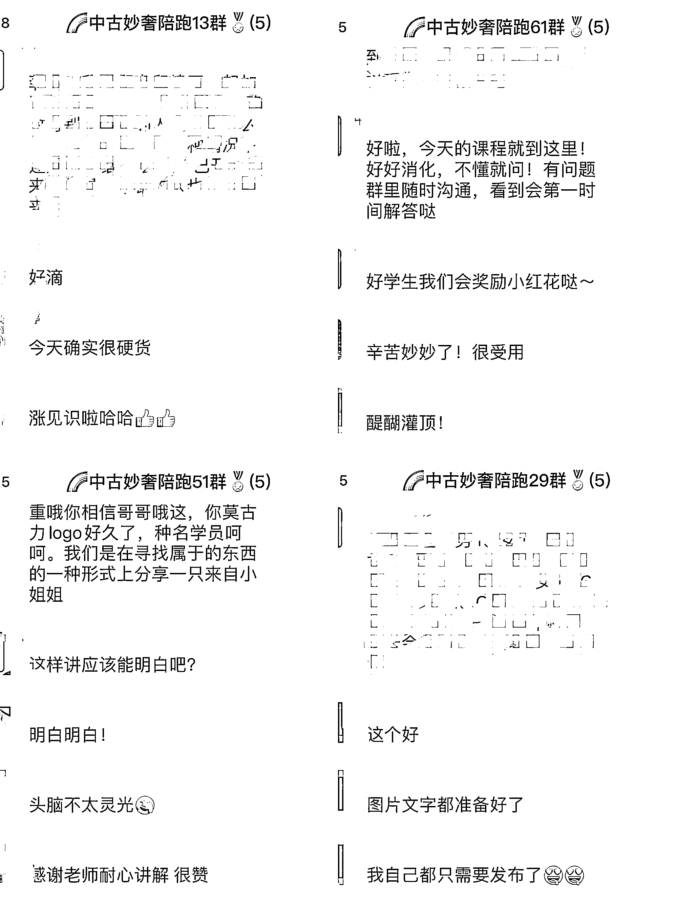

# 揭秘二奢行业，引领消费降级市场新趋势

> 原文：[`www.yuque.com/for_lazy/thfiu8/ssg85pakfvs39u8k`](https://www.yuque.com/for_lazy/thfiu8/ssg85pakfvs39u8k)

<ne-h2 id="603e20ce" data-lake-id="603e20ce"><ne-heading-ext><ne-heading-anchor></ne-heading-anchor><ne-heading-fold></ne-heading-fold></ne-heading-ext><ne-heading-content><ne-text id="ufccc9014">(32 赞)揭秘二奢行业，引领消费降级市场新趋势</ne-text></ne-heading-content></ne-h2> <ne-p id="u9f3c6d3f" data-lake-id="u9f3c6d3f"><ne-text id="u747463eb">作者： 亮亮（中古妙奢）</ne-text></ne-p> <ne-p id="u7ae30a77" data-lake-id="u7ae30a77"><ne-text id="u31145c1a">日期：2023-07-21</ne-text></ne-p> <ne-p id="u419140ef" data-lake-id="u419140ef"><ne-text id="u66f98983">大家好，我是亮亮，一名 99 年的二奢老板，中古妙奢主理人，从业一年半，但相比于部分同行，我的运营模式让我一直有一个良好的收入状况。我不知道把二奢行业带入互联网创业圈子把这个行业做拆解是不是一件好事，但我知道这是一个正确的举动。二奢行业的现状就和 15 年的手机行业、18 年的二手车行业一样，存在着极大的信息差，我应该做好一个分享者，自己也在找寻新机会的路上。目前各行业都处于消费降级的大环境中，消费降级的市场新趋势主要源于消费者的思维转变和消费观念的调整。随着社会竞争的加剧和物价的上涨，部分消费者开始意识到奢侈品带来的高价格并不一定能够带来与之相符的价值和体验。因此，这部分消费者更倾向于选择二奢，以更合理的价格购买到满足自身需求的产品。</ne-text></ne-p> <ne-p id="u5baa6de7" data-lake-id="u5baa6de7"><ne-text id="ube8e6d0f">二奢行业已拥有了一个蓬勃发展的市场。二奢行业指的是那些二手的奢侈品牌在市场流通销售，满足对奢侈品牌喜爱的人群的物质需求和精神自由。分为现代货和中古货、古着货三大类，又分为很多小分类（如瑕疵、纯元、换皮等），如中高档服装、包包、手表、首饰等。这些产品深受一部分消费者的喜爱，但相对较为亲民的价格也使更多的消费者能够负担得起。我们称专柜市场为一级市场，中古市场为二级市场，但一二级市场价格波动并不互相影响，一级市场价格高的说不定二级市场价格会更低，主要看流通，流通性越高的一些大热门，价格会保值。</ne-text></ne-p> <ne-p id="uf0ddf0d0" data-lake-id="uf0ddf0d0"><ne-text id="u455451de">很难看见背帆布包的姑娘会咬牙买一下 CHANEL，但如果日常背的是 MCM 等千元的轻奢品牌，面对三四千的 LV，2.7 折的香奈儿很难不心动。以爱马仕为例，爱马仕需要配货，一只 10 万的铂金至少花费 20 万才能拿到手，但在二手奢侈品市场上，98 新的爱马仕可以低至原价的 6.8 折，相当于只花了一手不到 1/3 的价格。再者，越来越多的明星和时尚达人推崇二手奢侈品，人们对于“二手”概念逐渐削弱。Angelababy 和水原希子喜欢逛中古店，阿黛尔、蕾哈娜、杨幂等人，也都是二奢店的常客。</ne-text></ne-p> <ne-p id="u9d74b339" data-lake-id="u9d74b339"><ne-card data-card-name="image" data-card-type="inline" id="MULjc" data-event-boundary="card"></ne-card><ne-card data-card-name="image" data-card-type="inline" id="ir85R" data-event-boundary="card"></ne-card><ne-card data-card-name="image" data-card-type="inline" id="owqSH" data-event-boundary="card"></ne-card></ne-p> <ne-p id="ueb370645" data-lake-id="ueb370645"><ne-text id="u2ccf623d">现在，打着“中古”概念的二奢门店，在各个城市逐渐增加，其中杭州的门店极多，为什么？因为卖二奢的直播公司多啊！养活了很多中古店。可以看出这个藏在冰山之下的行业，浮出水面，进入了增长期。很多伙伴虽然到现在都没有一款属于自己的奢侈品包包或者手表，但是“能挣钱”和“兴趣爱好”、“消费能力”没有关系。在这篇文章中，我将为大家揭秘二奢行业的小小机密与入行机会。</ne-text></ne-p> <ne-p id="uaa36ef34" data-lake-id="uaa36ef34"><ne-text id="ue5d42844">处在 70 后与 00 后之间，80 后 90 后无疑是社会蓬勃发展进程中的过渡年代产物，很尴尬的见证了祖国的强大发展，为什么会说是尴尬？这是一个物价房价翻几十倍几百倍的，却无能为力的年代，前些日子，发生的断供潮，伙伴们也应都经历过了。就是这么尴尬的人群，却担任了这个时代消费主力的重任，以此衍生了各种贴合时代的行业，二手车、二手数码、分期金融等等，二奢也是这其中之一。</ne-text></ne-p> <ne-p id="ua44fbe1c" data-lake-id="ua44fbe1c"><ne-text id="u28ba1942">疫情三年，经济不好，人的消费欲望是不是就被压抑了，我们是不是就进入低欲望社会了？显然不是的，欲望会换一个形式，用另一个样子出现。一手的买不起，就买二手。跟人谈不起恋爱，就找猫猫狗狗玩。一切都可以平替，只要能满足欲望就可以。还是那句话，大环境不好，不一定没机会，只是机会以你看不懂的方式出现。</ne-text></ne-p> <ne-p id="u79a2a949" data-lake-id="u79a2a949"><ne-text id="u8fd87b97" ne-bold="true">二奢的兴起</ne-text></ne-p> <ne-p id="u623571e2" data-lake-id="u623571e2"><ne-text id="u15076e7c">很久以前，有人提出了二手奢侈品的概念，但并没有得到广泛接受。老一辈国人一直习惯购买全新的物品，对于二手货持保留态度。主要原因是受到了日本中古市场的影响。然而，随着时间的推移，国内市场逐渐兴起了二手奢侈品行业。在 2018 年和 2019 年，二手奢侈品行业才开始进入大众的视野。最初，这个行业主要由一些专柜柜姐或奢侈品收藏爱好者以实体店的形式开始销售二手奢侈品。</ne-text></ne-p> <ne-p id="u7d5541d0" data-lake-id="u7d5541d0"><ne-text id="u1b1cbc6c" ne-bold="true">为什么要入行二奢？</ne-text></ne-p> <ne-p id="u77fb3765" data-lake-id="u77fb3765"><ne-text id="u51411fc0">对于从业者而言，二奢行业意味着无限的机遇和挑战。首先，二奢行业是一个新兴且繁荣的行业，对于人才的需求量非常大，这为从业者提供了许多赚钱的机会。其次，由于假货泛滥的问题日益严重，消费者对于奢侈品鉴定服务和回收寄卖服务的需求也在不断提升。因此，从业者可以通过提供专业的鉴定和回收寄卖服务来满足消费者的需求，并获得更多的商机。</ne-text></ne-p> <ne-p id="uba2efccb" data-lake-id="uba2efccb"><ne-text id="uc36a6916">进入二奢行业有着诸多吸引人的原因。首先，二奢行业具有巨大的市场潜力和发展空间。随着人们生活水平的提高和消费观念的转变，对奢侈品的需求不断增加。其次，二奢行业的竞争相对较小，相比其他行业，进入二奢行业的门槛较低，使得更多的人可以尝试并获得成功。此外，二奢行业的发展速度非常快，创业者可以迅速获得回报并实现财富增长。</ne-text></ne-p> <ne-p id="u0e12f0ef" data-lake-id="u0e12f0ef"><ne-text id="u890c8271">然而，要在二奢行业获得成功并非易事。从业者需要具备专业的知识和技能，以便提供高质量的鉴定和回收寄卖服务。同时，他们还需要与供应商建立良好的合作关系，以确保能够获取正品奢侈品并提供给消费者。此外，从业者还需要不断学习和更新自己的知识，以跟上行业的发展和变化。</ne-text></ne-p> <ne-p id="u0d09d1ff" data-lake-id="u0d09d1ff"><ne-text id="u90b4a9d6">总之，对于从业者而言，二奢行业是一个充满机遇和挑战的行业。通过提供专业的鉴定和回收寄卖服务，从业者可以满足消费者对于奢侈品的需求，并获得商机。然而，成功需要具备专业知识和技能，并不断学习和适应行业的发展。只有具备这些条件，才能在二奢行业中取得成功。</ne-text></ne-p> <ne-p id="u50819ea6" data-lake-id="u50819ea6"><ne-text id="ueffa1009" ne-bold="true">什么人买二奢？</ne-text></ne-p> <ne-p id="u85141f7e" data-lake-id="u85141f7e"><ne-text id="ue6a6cbaf">第一类人：</ne-text><ne-text id="u11534f54" ne-bold="true">富豪</ne-text><ne-text id="u7adbab21">。喜欢买一些限量款，稀缺款，专柜停产断货的，在专柜根本就买不到的款，只能通过二手渠道购买。</ne-text></ne-p> <ne-p id="u7efe0073" data-lake-id="u7efe0073"><ne-text id="u6bccdf5d">第二类人：</ne-text><ne-text id="u4db97b38" ne-bold="true">中产</ne-text><ne-text id="ufd1529a4">。已经具备了购买奢侈品的经济能力，奢侈品的需求量比较大。比如网红小姐姐因为拍摄需要，每个包最多只能用 1～2 个月，经常买了又卖，这样就能换新款了，这个方法真的很省钱的。</ne-text></ne-p> <ne-p id="u0136b9f8" data-lake-id="u0136b9f8"><ne-text id="ufba2593e">第三类人：</ne-text><ne-text id="ud7c9cf92" ne-bold="true">小资</ne-text><ne-text id="u92156e7f">。有社交需求的人，比如说起步初期的小老板，做高端的生意，出去为了挣个面子，也为了跟自己的客户更有话题性，选择买几个二手奢侈品。买二手物品比买假的要强，而且穿戴体面自己更有自信，也更容易让人产生信任感。谈生意相对来说会更容易成功。</ne-text></ne-p> <ne-p id="u98cce955" data-lake-id="u98cce955"><ne-text id="ue154da5d">其实很多</ne-text><ne-text id="u553e961e" ne-bold="true">买二奢的人都具备投资理念</ne-text><ne-text id="uc670596f">，这么高的回报率何乐而不为呢。</ne-text></ne-p> <ne-p id="u61ecab36" data-lake-id="u61ecab36"><ne-text id="u14973a96">刘润老师在《进化的力量》演讲中，把二手奢侈品市场称作是“顺应周期，帮人省钱”的模式。那么“帮人省钱”是从何而来呢？这要从二奢的三种交易平台模式说起。</ne-text></ne-p> <ne-p id="u8e7a4860" data-lake-id="u8e7a4860"><ne-text id="u10bb6224">第一种交易模式：撮合撮合很容易理解，卖家自己拍照、写文案、上传图片，然后自己定价，大家熟悉的闲鱼，其实就是这个模式。但这个模式存在一个问题，平台的存在只是连接了供需两段，通常不介入售前，不容易产生信任关系，而买卖双方没有信任关系，很容易导致买卖纠纷。</ne-text></ne-p> <ne-p id="uc7f6e182" data-lake-id="uc7f6e182"><ne-text id="ua9081870">第二种交易模式：买断这种模式，是很多二奢店的做法，回收闲置包包，让自己变为拥有者，然后再选择销售。二手奢侈品，是个单价比较高的品类，收购闲置包包的是有一定风险的，毕竟潮流的风向说变就变，很多新入行的人，往往容易在这上面栽跟头。</ne-text></ne-p> <ne-p id="u4b6a85ec" data-lake-id="u4b6a85ec"><ne-text id="u795755a6">第三种交易模式：寄售这也是现在二奢平台及二奢店常用的模式。在这个模式中，店家充当的是一个介绍人的角色，它会对卖家提供的商品进行鉴定、测量、护理、清洁、拍照等等服务，并且会基于市场行情，给卖家做一个报价的建议。而店家可以通过赚取服务费来获得收益，当然，是为了尽力促成成交，店家通常也很卖力。</ne-text><ne-text id="u839fd81d" ne-bold="true">对于普通人而言，机会就藏在这三种交易模式里。（认为自己不甘平凡的圈友可以接着往下看）</ne-text></ne-p> <ne-p id="u4108822e" data-lake-id="u4108822e"><ne-text id="u4eb8b903">通过以上的描述，看到这篇文的伙伴应该就对二奢行业有一个清楚的认识了吧？</ne-text></ne-p> <ne-p id="ub61600db" data-lake-id="ub61600db"><ne-text id="uf1a78ff3">接下来，我将为大家讲述，</ne-text><ne-text id="u2eda034e" ne-bold="true">我眼中的二奢行业以及小白入行建议。</ne-text></ne-p> <ne-p id="ubf75ce77" data-lake-id="ubf75ce77"><ne-text id="u6fa5cccd" ne-bold="true">我眼中的二奢行业：</ne-text></ne-p> <ne-p id="u46ba995d" data-lake-id="u46ba995d"><ne-text id="u0101849d">18、19 年是实体店的黄金时期，也是近 10 年来实体经济达到巅峰的时期。尽管电商行业发展迅猛，但仍未能在实体经济中占据更大份额，许多消费者仍然对实体店的产品质量有信心。由于日本中古市场的兴起，国内中古店如雨后春笋般涌现，许多店主认为从事二手奢侈品行业也是一种有面子的事业。我师傅就是其中一员，当时二手奢侈品的价格差异使得二手奢侈品概念迅速普及，奢侈品爱好者意识到一些无法在正规渠道购买到的包包可能会出现在二手市场，因此选择在二手市场购买。因此，二手奢侈品行业在中国站稳了脚跟。</ne-text></ne-p> <ne-p id="u1cab450c" data-lake-id="u1cab450c"><ne-text id="ua2ce8520">20、21 年，疫情爆发并且 5G 时代的到来，给实体店带来了巨大的危机，而电商和直播行业却蓬勃发展。中古奢侈品店老板开始涌入直播平台，通过直播的方式销售二手奢侈品，并在已经成交的客户群体中开展二手奢侈品收售业务。毫无例外，这种转型对他们来说是必然的选择。那些早先涉足奢侈品行业的老板们纷纷获得了巨额财富。</ne-text></ne-p> <ne-p id="u2a18a1c1" data-lake-id="u2a18a1c1"><ne-text id="u432cd418">22 年，我踏入了二奢行业的门槛，这是我与实体店和线上市场相互冲击的第一年。然而，我发现实体店根本无法销售商品，即使销售出去的货物也很难找到买家。相反，在抖音上直播销售，虽然价格较低，但却能以更高的价格售出。这让一些实体店同行经常倒苦水：“为什么线上销售反而更受人们信任？”原因在于抖音带动了美女经济的兴起，美女主播成为了销售的关键。她们不需要华丽的销售技巧，只需传递专业知识给直播间的用户就足够了。大部分商家的三种经营方式：收货，卖货，同行贸易，二奢顶流是做顶奢圈，300 万的启动资金真的算少的。</ne-text></ne-p> <ne-p id="uba6ef470" data-lake-id="uba6ef470"><ne-text id="ud8866e2d">未来：我认为私域的重要性将在今年凸显出来，我们应该尽可能多地积累私域客户，这样才能确保未来的顺利发展。看奔驰、宝马、奥迪便知，曾经在大众的眼中就是财富的象征，“那个人开大奔”来衡量这个人有没有钱，那么现在呢？奔驰、宝马、奥迪是大街上随处可见的汽车品牌。二奢里也可以有 BBA 之分的，大 BBA 为 H/C/L（爱马仕、香奈儿、LV）小 BBA 就是 G/B/D（GUCCI、BURBEERY、DIOR）当下的火热程度，也不言而喻，一个女孩儿活这辈子怎么也应该有一个自己的顶奢包包（爱马仕、香奈儿、LV），一个男人怎么也想要一只劳力士、江诗丹顿、百达翡丽吧？所以现在入行还不算晚。</ne-text></ne-p> <ne-p id="uba88eef5" data-lake-id="uba88eef5"><ne-text id="u8d6d157e" ne-bold="true">各位怎么入行？</ne-text></ne-p> <ne-p id="ua1d2efa7" data-lake-id="ua1d2efa7"><ne-text id="ua56f8005" ne-bold="true">别人说：</ne-text></ne-p> <ne-p id="u271f6ab9" data-lake-id="u271f6ab9"><ne-text id="u4bcef85b">他们都说小白入行先从学鉴定开始，了解市场需求与供应关系，把握产品的价格和盈利空间。这是任何商业行为的基本逻辑，无论是倒卖奢侈品还是其他行业，都需要掌握这些基础知识。在奢侈品行业，了解市场和产品是非常重要的一环。入行时可以先从熟悉某个品牌或者某种类型的奢侈品开始，比如手表、包包等。通过学习相关资料、参加培训课程或者与专业人士交流，了解产品的特点、历史背景、市场价格等。同时，关注市场动向也是必不可少的。可以通过阅读行业媒体、参加展会或者加入奢侈品相关的社群，了解行业的最新趋势和市场变化，以及各个品牌的推广活动和促销策略。了解市场和产品之后，可以开始寻找供应渠道和销售渠道。这可能涉及到与供应商洽谈合作、参与拍卖会、与二手奢侈品平台合作等方式，确保能够以较低的成本获取到货物。在进行倒卖的过程中，需要注意选择合适的平台和渠道进行销售。可以考虑使用线上销售平台、开设线下实体店面或者与其他零售商合作等方式，将产品推向市场。随着经验的积累和对市场的深入理解，可以逐步扩大自己的业务范围，开辟新的供应渠道和销售渠道。同时也要不断提升自己的专业知识和技能，关注行业的变化和创新，保持竞争力。</ne-text></ne-p> <ne-p id="u1d965cf5" data-lake-id="u1d965cf5"><ne-text id="u09d8476a" ne-bold="true">我说：</ne-text></ne-p> <ne-p id="u1f626bad" data-lake-id="u1f626bad"><ne-text id="u355a1630">别人说的就是扯淡，就是故意加高门槛，二奢其实是一个非常吃供应链和现金流的行业，其实行内人都知道，最快的起家方式并不是学习鉴定，而是任何商业都共有的底层逻辑，从倒卖开始，想要入行，找到一个靠谱的上游供应链，为你提供收售货就行（但行业水深，很多上游同行挣的就是帮下级市场收售货的利润，自己要明辨是非，好好选择）。学好引流，服务好每一位客户，这些方面是不需要启动资金的，当你通过销售挣到了钱以后，我依旧还是不推荐你自己去囤货，因为我在囤货我就明白，现金流太重要啦！我会选择先扩大销售团队，不会先选择囤更多的货去方便销售。</ne-text></ne-p> <ne-p id="uc85f0fda" data-lake-id="uc85f0fda"><ne-text id="u5adf8dfc">当下，引流不再是难事，如何经营好自己的私域，才是重中之重，大家刷到抖音上一些博主告诉你想做好二奢，就是要做自己的 IP，什么二奢粉很垂很垂，明白人都明白，你引流下来后自己的承接能力才是关键，是否能转化客户，是否可以开单，是否可以做好服务提升复购才是重心。</ne-text></ne-p> <ne-p id="u387d14da" data-lake-id="u387d14da"><ne-text id="u945b75dc">服务要做的就是诚心诚意，我也告诉自己的学员啊代理啊，不要心急，沉下心做好服务，不以每天的销售额作为工作完成度的指标，而是今天聊了多少个有效客户来作为指标，愿意和你聊或愿意在你这里选包的用户是需要你用心去对待，把她/她当作朋友的。</ne-text></ne-p> <ne-p id="ufaaa8be8" data-lake-id="ufaaa8be8"><ne-text id="u8b262c9b">目前我从 2 月底做自己的销售客服号至今，5 个月时间已经积攒了近 1 万 1 千个私域精准客户，近 85%发生过有效聊天，总成交率百分之 9.6.还可以有很多复购，已经非常高了。</ne-text></ne-p> <ne-p id="ua9088f42" data-lake-id="ua9088f42"><ne-text id="u2f427d47">前段时间开始招募的学员代理，通过我细致的传授纷纷发来好评，从而也加大了我的工作量，每天看着交付，也有更多的包包需要发出，希望下半年可以做到 2000W 的销售业绩，我也会为之努力。</ne-text></ne-p> <ne-p id="u7540cfb9" data-lake-id="u7540cfb9"><ne-card data-card-name="image" data-card-type="inline" id="rHInn" data-event-boundary="card"></ne-card><ne-card data-card-name="image" data-card-type="inline" id="BGyOV" data-event-boundary="card"></ne-card><ne-card data-card-name="image" data-card-type="inline" id="lUQbY" data-event-boundary="card"></ne-card></ne-p> <ne-p id="u6f4ede16" data-lake-id="u6f4ede16"><ne-text id="u232a26f4">其实做什么行业都是可以挣到钱的，就像一位大哥说的，人对了做什么都能做，人没把自己理清楚，做什么都做不好，耽误你挣钱的，不是没有时间，而是数不清的犹豫和考虑。</ne-text></ne-p> <ne-hole id="u8b8c7ec8" data-lake-id="u8b8c7ec8"><ne-card data-card-name="hr" data-card-type="block" id="JazbS" data-event-boundary="card"><ne-p id="uaf0dc628" data-lake-id="uaf0dc628"><ne-text id="ub6a7c002">评论区：</ne-text></ne-p> <ne-p id="u7f551eb6" data-lake-id="u7f551eb6"><ne-text id="uc775adf7">段大熊- : 感谢大佬分享，有机会向大佬学习🙏🙏🙏</ne-text></ne-p> <ne-p id="u9861e373" data-lake-id="u9861e373"><ne-card data-card-name="image" data-card-type="inline" id="EBhNH" data-event-boundary="card">  <ne-hole id="u149e7ab5" data-lake-id="u149e7ab5"><ne-card data-card-name="hr" data-card-type="block" id="E1U60" data-event-boundary="card"></ne-card></ne-hole></ne-card></ne-p></ne-card></ne-hole>