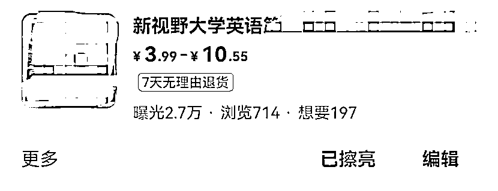

# 二手书行业不经意发现的商机——大学英语激活码

> 原文：[`www.yuque.com/for_lazy/thfiu8/thfcb4gdr8vcmyl8`](https://www.yuque.com/for_lazy/thfiu8/thfcb4gdr8vcmyl8)

<ne-h2 id="e69b4476" data-lake-id="e69b4476"><ne-heading-ext><ne-heading-anchor></ne-heading-anchor><ne-heading-fold></ne-heading-fold></ne-heading-ext><ne-heading-content><ne-text id="ud9bb9d80">(25 赞)二手书行业不经意发现的商机——大学英语激活码</ne-text></ne-heading-content></ne-h2> <ne-p id="ucd08068b" data-lake-id="ucd08068b"><ne-text id="u5cd5a694">作者： 小嵩</ne-text></ne-p> <ne-p id="u74b4306c" data-lake-id="u74b4306c"><ne-text id="ud41e41ce">日期：2023-07-17</ne-text></ne-p> <ne-p id="u2398630d" data-lake-id="u2398630d"><ne-text id="ude9876a5">大家好，我是小嵩。</ne-text></ne-p> <ne-p id="u1d917150" data-lake-id="u1d917150"><ne-text id="ubb9b9e7f">已经看过 3 月 6 号我发出这篇文章《加入生财有术一年，终于实现副业月入过万》的圈友估计已经对我有所了解了。</ne-text> <ne-text id="u2eefc51b">这次分享的是做二手书过程中了解到的另一种需求，大学英语激活码，附带详细实操流程。</ne-text></ne-p> <ne-p id="u3a5e8c0d" data-lake-id="u3a5e8c0d"><ne-text id="u906dc6f9">做过二手书的圈友多多少少对售后有点顾虑，怕上家发的书品相差，买家要退货怎么办，既影响心情又要亏运费，那么有没有不用发货又没有售后的东西呢，今天我给大家分享的是我在做二手书的时候不经意发现的商机，它不是实物，不用发货也没有售后。</ne-text></ne-p> <ne-p id="u5d38f43f" data-lake-id="u5d38f43f"><ne-text id="uce789fa3">故事是从一个买家开始的，如图。</ne-text><ne-card data-card-name="image" data-card-type="inline" id="dxYga" data-event-boundary="card"></ne-card></ne-p> <ne-p id="u81616dca" data-lake-id="u81616dca"><ne-text id="uf063c8c0">刚开始我还没有察觉，后面几天都有人问这个码，于是我就去淘宝搜了下，欸！还真有人卖，而且还卖得不错！</ne-text></ne-p> <ne-p id="u94aecf64" data-lake-id="u94aecf64"><ne-text id="u981654a7">这些是淘宝以及拼多多上卖激活码的商家。当前阶段在任意平台，激活码的每月销售量都是一个非常可观的数字。（暑寒假除外）</ne-text></ne-p> <ne-p id="u2c31e7d7" data-lake-id="u2c31e7d7"><ne-card data-card-name="image" data-card-type="inline" id="RMJg3" data-event-boundary="card"></ne-card></ne-p> <ne-p id="u404c6436" data-lake-id="u404c6436"><ne-text id="u1788d377">于是我就尝试在闲鱼上架试试。在孔夫子找到了实物图后，接着在图片上加点文字就直接上架了。设定的价格是在淘宝卖家的基础上再加上我想赚的利润，结果上架第二天就有人问，并且还成交了，这单利润 50%。</ne-text></ne-p> <ne-p id="u6ffb890a" data-lake-id="u6ffb890a"><ne-card data-card-name="image" data-card-type="inline" id="ZmETq" data-event-boundary="card"></ne-card></ne-p> <ne-p id="u5289c8ed" data-lake-id="u5289c8ed"><ne-text id="u16230ce2">下图是我自己两个号在闲鱼上架测试一个月的商品，这还不是旺季的时候。</ne-text><ne-card data-card-name="image" data-card-type="inline" id="ZDz1e" data-event-boundary="card"></ne-card></ne-p> <ne-p id="u8aabbc18" data-lake-id="u8aabbc18"><ne-card data-card-name="image" data-card-type="inline" id="QqRa5" data-event-boundary="card"></ne-card></ne-p> <ne-p id="u6ae8425b" data-lake-id="u6ae8425b"><ne-text id="u959b9390">大学英语激活码相比于二手书，它的优势有哪些？</ne-text> <ne-text id="u4d346096">总结起来有以下几点：</ne-text> <ne-text id="ufcf9d63e">1.激活码交易更精准，不用到处找图。</ne-text> <ne-text id="uc24b5a35">2.购买商品的顾客更精准。</ne-text> <ne-text id="u4e5614eb">3.只需要直接发送激活码给客户即可确认售后。</ne-text> <ne-text id="ua8f3cc31">4.到账快</ne-text></ne-p> <ne-p id="uf18838c9" data-lake-id="uf18838c9"><ne-text id="u118f9aa1">还有一点，收码相比于收二手书，种类更少，收码也更方便。</ne-text></ne-p> <ne-p id="ue3599363" data-lake-id="ue3599363"><ne-text id="u971c5c0f">收码成本的高低取决于你是否有渠道</ne-text></ne-p> <ne-p id="uba264fd1" data-lake-id="uba264fd1"><ne-text id="u8f616f23">我尝试过联系一些大学生，但是都不太靠谱，不是要的时候联系不上，就是收的码是激活过或者过期的。</ne-text></ne-p> <ne-p id="u9bd68b37" data-lake-id="u9bd68b37"><ne-text id="ud02a44b2">收码时是把书本后面的激活码裁剪下来：</ne-text><ne-card data-card-name="image" data-card-type="inline" id="xYEzO" data-event-boundary="card"></ne-card></ne-p> <ne-p id="uc3fcad6d" data-lake-id="uc3fcad6d"><ne-card data-card-name="image" data-card-type="inline" id="NoAul" data-event-boundary="card"></ne-card></ne-p> <ne-p id="udfe6654a" data-lake-id="udfe6654a"><ne-text id="uf7cc0543">《新视野大学英语》是一套由外语教学与研究出版社出版的大学英语教材系列，其中第三版是指该系列教材的第三个版本。这套教材是当下各大院校大学生正在使用的一套英语教材。</ne-text></ne-p> <ne-p id="u1540368d" data-lake-id="u1540368d"><ne-text id="u4da499e3">这套教材主要分为四个级别：《新视野大学英语》第一册、第二册、第三册和第四册。每一册都分「读写」、「视听说」两种。</ne-text></ne-p> <ne-p id="u237c94e8" data-lake-id="u237c94e8"><ne-text id="u672001fa">每本教材都包含课本以及课本背后的激活码。</ne-text></ne-p> <ne-p id="u5d070250" data-lake-id="u5d070250"><ne-text id="u10954ed2">该教材激活码用于激活新视野大学英语教材中的在线学习资源和服务。</ne-text></ne-p> <ne-p id="u744c22bc" data-lake-id="u744c22bc"><ne-text id="u26731795">学生购买教材时通常会获得一个激活码，这个激活码按照学习要求，用来提交作业，获得学分。</ne-text></ne-p> <ne-p id="u75b04415" data-lake-id="u75b04415"><ne-text id="ua88263a2">但是，这个激活码只有一个学期的激活期限，很多学生在使用激活码的时候，会发现激活码已经过期了，所以，需要重新购买激活码来激活课程，才能提交作业。</ne-text></ne-p> <ne-p id="u012360d0" data-lake-id="u012360d0"><ne-text id="ubd655466">由此可见，市场上这种激活码基本属于供不应求的状态，</ne-text></ne-p> <ne-p id="uef444ebc" data-lake-id="uef444ebc"><ne-text id="u023a1a77">接下来给大家上实操详解</ne-text></ne-p> <ne-p id="ue8e49119" data-lake-id="ue8e49119"><ne-text id="u31ff40ae">1.登录闲管家 —> 点击商品管理 —> 点击新建商品</ne-text></ne-p> <ne-p id="ucc7a907f" data-lake-id="ucc7a907f"><ne-card data-card-name="image" data-card-type="inline" id="NoGZQ" data-event-boundary="card"></ne-card></ne-p> <ne-p id="uc7134689" data-lake-id="uc7134689"><ne-text id="u340e3a7f">商品分类选择图书 —> 学习考试</ne-text></ne-p> <ne-p id="u236402d8" data-lake-id="u236402d8"><ne-card data-card-name="image" data-card-type="inline" id="N6U0p" data-event-boundary="card"></ne-card></ne-p> <ne-p id="ub0116ad3" data-lake-id="ub0116ad3"><ne-text id="u1a079f71">建议大家从孔夫子或者淘宝找书的图片再自己加上文字（不过更建议大家自己找图，避免同质化）</ne-text></ne-p> <ne-p id="u64c733a8" data-lake-id="u64c733a8"><ne-card data-card-name="image" data-card-type="inline" id="UbwUY" data-event-boundary="card"></ne-card></ne-p> <ne-p id="u70dffcb1" data-lake-id="u70dffcb1"><ne-card data-card-name="image" data-card-type="inline" id="ceQiu" data-event-boundary="card"></ne-card></ne-p> <ne-p id="uf5078302" data-lake-id="uf5078302"><ne-text id="ud7dc33d7">新视野大学英语第三版 读写 视听说 思政智慧版 1 2 3 4 激活码</ne-text> <ne-text id="ub3669f4c">新视野大学英语第三版思政智慧视听说读写综合训练激活码注册码</ne-text> <ne-text id="u60c906d6">新视野大学英语第三版 读写思政版 1 2 3 4 激活码 U 校园 智慧版</ne-text> <ne-text id="ua376d97d">新视野大学英语 U 校园 读写 视听说教程 思政智慧版 1 2 3 4 激活码</ne-text></ne-p> <ne-p id="ua25adfde" data-lake-id="ua25adfde"><ne-text id="u768c7473">新视野大学英语 U 校园 读写 视听说教程</ne-text> <ne-text id="u2834f026">“思政智慧版”  “智慧版” “U 卡通”</ne-text> <ne-text id="uf3ae4bf8">第 1 2 3 4 册验证码  激活码</ne-text> <ne-text id="u5c314a20">不是书，下单后联系客服在线发送，无需物流</ne-text></ne-p> <ne-p id="u76ae7bee" data-lake-id="u76ae7bee"><ne-text id="u0f19e912">确定好版本，保证注册，无效退货</ne-text> <ne-text id="u3c4d2636">激活码拍下后在线发送，无需快递，保证激活，放心下单，</ne-text> <ne-text id="u64b94c10">下单前务必核实清楚，若您知道用什么码，请直接拍下。</ne-text></ne-p> <ne-p id="u399a6e0b" data-lake-id="u399a6e0b"><ne-text id="ue3dbb8a7">若不知道，请将课程中心带有“未激活”字样的可成图片截图给客服</ne-text> <ne-text id="u894ee918">否则拍错不支持退换。收到激活码后请立即激活，超出 7 天不售后。</ne-text> <ne-text id="u1caeec8f">下单后 请联系客服。</ne-text> <ne-text id="u2c530cd4">激活码刮开后不支持退换，谢谢理解</ne-text></ne-p> <ne-p id="u97b067b2" data-lake-id="u97b067b2"><ne-text id="u728d9055">5.图书信息-ISBN 编码填写新视野大学英语的 ISBN 码就行</ne-text></ne-p> <ne-p id="u01201472" data-lake-id="u01201472"><ne-card data-card-name="image" data-card-type="inline" id="uxP94" data-event-boundary="card"></ne-card></ne-p> <ne-p id="ueb29a0ce" data-lake-id="ueb29a0ce"><ne-text id="u9944f525">这里可以添加多个 sku</ne-text></ne-p> <ne-p id="u5d01d674" data-lake-id="u5d01d674"><ne-card data-card-name="image" data-card-type="inline" id="m7fUd" data-event-boundary="card"></ne-card></ne-p> <ne-p id="u5f6b9c56" data-lake-id="u5f6b9c56"><ne-text id="u2b781da6">填好后点击立即发布—>确认</ne-text></ne-p> <ne-p id="u881965c8" data-lake-id="u881965c8"><ne-card data-card-name="image" data-card-type="inline" id="uLcr6" data-event-boundary="card"></ne-card></ne-p> <ne-p id="u511fb41a" data-lake-id="u511fb41a"><ne-text id="u91cfe8e8">还有一个要注意的点！！！</ne-text></ne-p> <ne-p id="ua5094885" data-lake-id="ua5094885"><ne-text id="u9da0fec4">激活码分 「智慧版」和「 思政智慧版」  两大类</ne-text> <ne-text id="u1b29cc87">两个大类别都有  「读写」 与 「视听说」 两个版本，价格也是不同的</ne-text></ne-p> <ne-p id="u1e2bc27d" data-lake-id="u1e2bc27d"><ne-text id="ue3cb5afc">细分下还有 1/2/3/4 册的区别 ，千万注意给客户发送码的时候不要给错版本。</ne-text> <ne-text id="u6ac152e9">前期卖激活码分不清版本，可以要求客户发送即可分辨。</ne-text></ne-p> <ne-p id="ub2edba2e" data-lake-id="ub2edba2e"><ne-text id="ua2282220">这是 U 校园未激活截图和已刮开码的图书照片，可参考一下：</ne-text><ne-card data-card-name="image" data-card-type="inline" id="in7K5" data-event-boundary="card"></ne-card></ne-p> <ne-p id="u45d02532" data-lake-id="u45d02532"><ne-card data-card-name="image" data-card-type="inline" id="Yxb2W" data-event-boundary="card"></ne-card></ne-p> <ne-p id="u4c06b502" data-lake-id="u4c06b502"><ne-text id="ub9d61090">1.宝贝价格</ne-text> <ne-text id="uf395f518">宝贝上架后可选择标价 3.8-10.8 元进行低价引流，或者直接开 SKU 标注每个版本实际价格。建议选择前者，效果会更好</ne-text></ne-p> <ne-p id="u5573803d" data-lake-id="u5573803d"><ne-text id="ub60a5b8f">2.交易话术</ne-text> <ne-text id="u18b46b5d">为避免发错版本，请截图 U 校园未激活页面截图确认版本再报价。</ne-text> <ne-text id="u31501fda">激活码全新，不包含书本，包激活，不激活退款</ne-text></ne-p> <ne-p id="u41907c95" data-lake-id="u41907c95"><ne-text id="uc872e8e0">3.交易方法：</ne-text> <ne-text id="ue60c2fad">因闲鱼不能发送带二维码的图片，直接把图片拍成视频发送给客户，或者提取激活码数串发送给客户。</ne-text></ne-p> <ne-p id="u3cbca810" data-lake-id="u3cbca810"><ne-text id="ue89e931f">4.售后技巧：</ne-text> <ne-text id="ubc1dc816">因激活码系统设置有时间限制，卖出激活码后，记得提醒客户及时激活，交作业。</ne-text> <ne-text id="uaa1b117c">客户询问价格折扣，可告知客户，多买可优惠。</ne-text> <ne-text id="uf05ff09a">采用这种方法优惠一到两元一张，提高销量，效果非常好。</ne-text> <ne-text id="u9c6c732c">激活成功后，点无需寄件发货。</ne-text></ne-p> <ne-p id="ue7fd92e4" data-lake-id="ue7fd92e4"><ne-text id="ue2318516">5.好评话术：</ne-text> <ne-text id="ud74bcad7">激活成功后，请推荐给有需要的同学，希望得到同学一个好评，祝学习进步，学业有成，感谢支持！</ne-text></ne-p> <ne-p id="uca164ee1" data-lake-id="uca164ee1"><ne-text id="ueda1d34b">1 激活码上架到什么类目？</ne-text></ne-p> <ne-p id="ufa08fd0d" data-lake-id="ufa08fd0d"><ne-text id="u5dd1b70c">建议上架到了学习考试类目。ISBN 码输入新视野大学的编码即可  9787513588188</ne-text> <ne-text id="u57b56f7a">任意版本激活码都属于新视野大学这本书的类目。不容易违规。</ne-text></ne-p> <ne-p id="ua9807afa" data-lake-id="ua9807afa"><ne-text id="u5c068b34">方案一：建议价格标到最低 3.88 不要太低，防止官方判定引流。</ne-text> <ne-text id="ueef890f8">方案二：打开多规格 SKU 模式，把每个版本的价格都标注上。</ne-text></ne-p> <ne-p id="ufd37cf98" data-lake-id="ufd37cf98"><ne-text id="uab3cbfda">以上两种方案任意选择，上传的宝贝详情图片，可以去淘宝或者多多各种平台搜，或者用书的图片，不建议大家都用一样的图片，避免限流。</ne-text></ne-p> <ne-p id="u0a51f5ac" data-lake-id="u0a51f5ac"><ne-text id="uba29f65e">2.具体拍哪个版本？</ne-text></ne-p> <ne-p id="ue7300802" data-lake-id="ue7300802"><ne-text id="ue29a8e1a">客户下单时，要求客户发送书本照片，或者 U 校园未激活截图，按照版本价格报价，看不懂版本的同学可以把图片发给淘宝或者拼多多卖家</ne-text></ne-p> <ne-p id="u8d2dea91" data-lake-id="u8d2dea91"><ne-text id="uf82b0573">买家拍下付款后，上淘宝拍一个同版本的再把激活码转发给买家</ne-text></ne-p> <ne-p id="u125079ac" data-lake-id="u125079ac"><ne-text id="u78a71a32">注意：闲鱼聊天不能直接发送带二维码的图片，会显示违规，切记不要发。</ne-text><ne-card data-card-name="image" data-card-type="inline" id="ykfUo" data-event-boundary="card"></ne-card></ne-p> <ne-p id="u365128e2" data-lake-id="u365128e2"><ne-card data-card-name="image" data-card-type="inline" id="OwwY1" data-event-boundary="card"></ne-card></ne-p> <ne-p id="ue2dda6b3" data-lake-id="ue2dda6b3"><ne-text id="ub9c37236">3.沟通中的聊天话术建议</ne-text></ne-p> <ne-p id="u2fedbbd4" data-lake-id="u2fedbbd4"><ne-text id="ue3dbe866">当客户拍下时，可提前告知客户，为避免激活码过期，我们的码都是现刮的，请耐心等待，包激活，请放心。</ne-text> <ne-text id="u73b78da1">发送激活码后，即可发送引导好评文字。</ne-text></ne-p> <ne-p id="ua5f0a212" data-lake-id="ua5f0a212"><ne-text id="ufd21840d">以上就是我给大家带来关于大学英语激活码的分享</ne-text></ne-p> <ne-p id="ue2d04414" data-lake-id="ue2d04414"><ne-text id="uc85ea7d1">最后再说说这个项目在闲鱼上的缺点，有些闲鱼店上架就会被平台通知违规下架，有些就不会，这个看概率，如果你有货源，那么在其它平台销售优势会更大，已有大佬在淘宝上做到单日销售 2k+</ne-text></ne-p> <ne-p id="u0a06d02b" data-lake-id="u0a06d02b"><ne-text id="ue44aa8e9">另外，也给大家准备了跳转链接，关于我如何操作二手书的具体流程，有兴趣的小伙伴可以结合着一起看看哈。（）</ne-text> <ne-text id="u7fb1ae9a">希望大家有所收获，感谢观看~</ne-text></ne-p> <ne-hole id="u96291ac5" data-lake-id="u96291ac5"><ne-card data-card-name="hr" data-card-type="block" id="QOjRO" data-event-boundary="card"><ne-p id="u71a3eb2a" data-lake-id="u71a3eb2a"><ne-text id="u870984e0">评论区：</ne-text></ne-p> <ne-p id="u546d0751" data-lake-id="u546d0751"><ne-text id="ude8492ef">张耑一 : 直接上传就行嘛？需不需要什么图书出版许可证明之类的东西</ne-text> <ne-text id="u37421e6f">小嵩 : 发教材类目是需要的</ne-text></ne-p> <ne-p id="u0432052c" data-lake-id="u0432052c"><ne-card data-card-name="image" data-card-type="inline" id="LNvvr" data-event-boundary="card"></ne-card></ne-p> <ne-hole id="uacaecf00" data-lake-id="uacaecf00"><ne-card data-card-name="hr" data-card-type="block" id="rgKHq" data-event-boundary="card"></ne-card></ne-hole></ne-card></ne-hole>