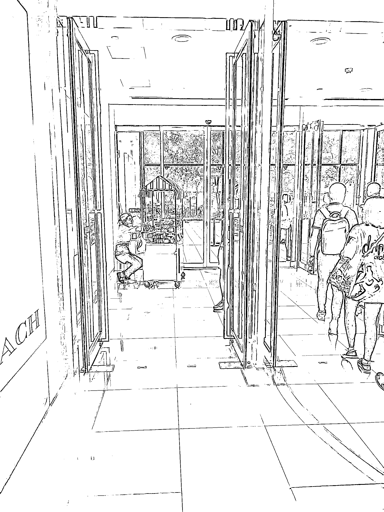

# 一张图说清营销 4P 的渠道和推广

> 原文：[`www.yuque.com/for_lazy/thfiu8/uqz2c9gfnkhgl6g3`](https://www.yuque.com/for_lazy/thfiu8/uqz2c9gfnkhgl6g3)

## (61 赞)一张图说清营销 4P 的渠道和推广 

作者： 小马宋 

日期：2023-07-12 

一张图说清营销 4P 的渠道和推广 

前天在地铁门口，看到西直门凯德茂的泸溪河在地铁口摆摊卖点心。 泸溪河的店铺在凯德茂南门进门处，恰好没有地铁客流进出。 

最近我每次都看到上下班高峰，泸溪河和有服务员在地铁进出口摆摊卖点心，而我太太也在他们这里买过两次，生意还不错。 

从营销角度说，这其实就是泸溪河门店渠道的延伸，因为早晚高峰最大的客流不在门店那里，那就把门店搬到客流最大的地方。 

线下门店租金的本质，就是购买了门前的客流。 

而营销中对成交起到关键作用的两个 P，渠道和推广，本质上都是在获得客流（流量）的情况下，让成交更多更快地发生。 

渠道的本质，是一套能让成交发生组织，推广的本质，怎是一系列能让成交发生的经营活动。 

对于泸溪河来说，西直门凯德茂的物业、本店加盟商就是渠道，而让服务员推小车到地铁口销售，这个活动就是推广。 

评论区： 

暂无评论 

  