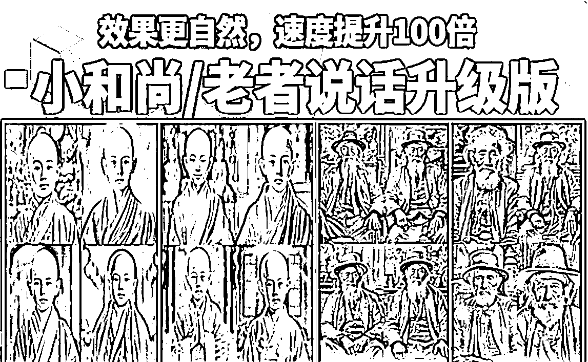

# 小和尚、老者图片会说话升级版教程

> 原文：[`www.yuque.com/for_lazy/thfiu8/ms8qt90iy7y7vve6`](https://www.yuque.com/for_lazy/thfiu8/ms8qt90iy7y7vve6)

## (94 赞)小和尚、老者图片会说话升级版教程 

作者： 云天 

日期：2023-07-13 

各位圈友，大家好，我是云天。 

前段时间我分享了一份[《思维语录制作保姆级教程（图片会说话）》](https://ixy2s5ruvqf.feishu.cn/docx/Z073dMlcmomg5CxeZKQcd5Y6nVg)，收到了广大圈友的关注和好评，但是很多人对于人物生成描述语（咒语）、CT 这个软件的安装和使用，以及视频合成还是各种问题。 

那么今天结合市面上的各路玩法，整理了一套更加贴合大家使用的教程。 

这套教程可以让你不用操心图片的描述语，直接以图生图，快速出图，去掉 mj 的出图等待时间，几乎相当于秒出图。以及我们去除了 CT 比较繁琐的步骤，利用白嫖 did 这个网站的思路，直接导入我们的图片和音频，一键生成动态视频。一套流程下来，速度至少提升 20 倍以上。基本上做一个视频大概在 10 分钟内，效率惊人。 

那么废话不多说，直接上干货。 

 

因为星球受限，详情请大家移步飞书 

[https://ixy2s5ruvqf.feishu.cn/docx/EBUudHloWoYZzoxG6hTcw8W1nvh](https://ixy2s5ruvqf.feishu.cn/docx/EBUudHloWoYZzoxG6hTcw8W1nvh) 

评论区： 

雅俊 : 牛 悦佬 : 结合了郭耀天老哥分享的无限邮箱玩法的升级款[强] 文少 : 太牛啦！[强] 鲁西西 : 好的谢谢大佬 初一 : 请问一下这类视频的音频是用什么软件生成的，试了好几个文本转语音的工具，效果都不是很好 雪利 ｜朋友圈文案教* : did 自带的音频就很好喔 

  