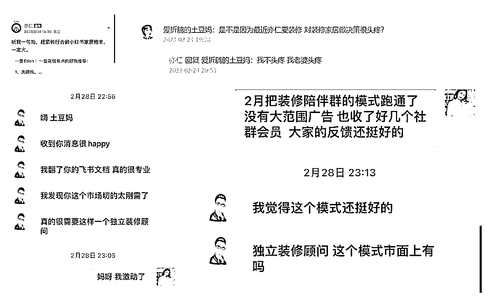
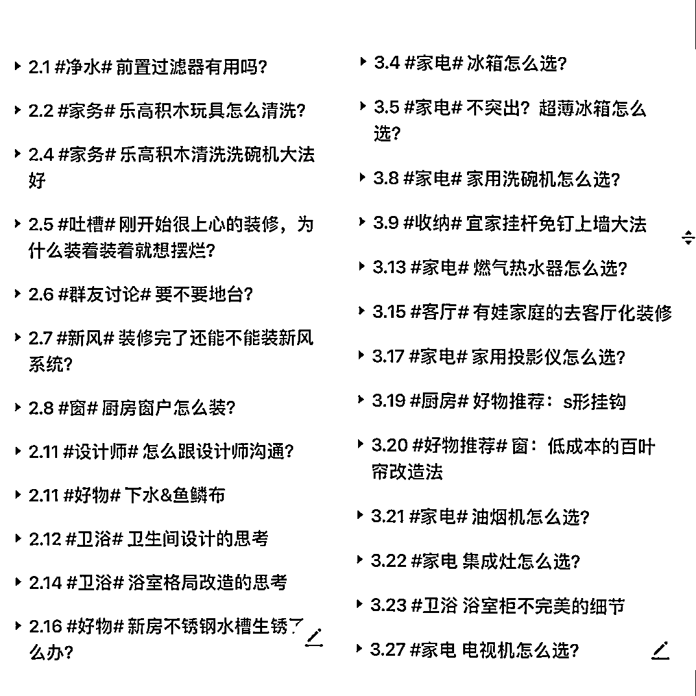
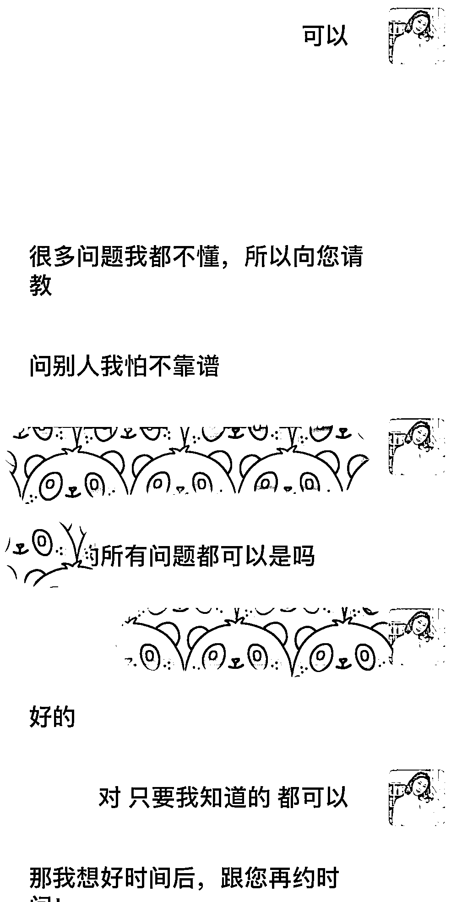

# 把一个为爱发电的装修围观群，成功变成商业化社群，我都做了什么？

> 原文：[`www.yuque.com/for_lazy/thfiu8/vmverrn4m6fazusn`](https://www.yuque.com/for_lazy/thfiu8/vmverrn4m6fazusn)

<ne-h2 id="37526a2f" data-lake-id="37526a2f"><ne-heading-ext><ne-heading-anchor></ne-heading-anchor><ne-heading-fold></ne-heading-fold></ne-heading-ext><ne-heading-content><ne-text id="u97f74aab">(67 赞)把一个为爱发电的装修围观群，成功变成商业化社群，我都做了什么？</ne-text></ne-heading-content></ne-h2> <ne-p id="u5d2a4cca" data-lake-id="u5d2a4cca"><ne-text id="udc12f0f4">作者： 爱折腾的土豆妈</ne-text></ne-p> <ne-p id="u89135836" data-lake-id="u89135836"><ne-text id="u85c4052e">日期：2023-07-12</ne-text></ne-p> <ne-p id="u3ffbf9bb" data-lake-id="u3ffbf9bb"><ne-text id="ub0da7ebe">大家好，我是土豆妈，一个爱折腾房子的体制内幼教，五年买卖六次房产，装修过三套房。</ne-text></ne-p> <ne-p id="u527a3191" data-lake-id="u527a3191"><ne-text id="ua418eda9">2023 年连续跟了两期社群运营航海，坚持运营 5 个月，把一个建立了一年半零变现的装修围观群，升级成一个 140+ 人的付费社群，目前已成功跑通 n 个 0-1 变现方式，目前累计利润 5w+。</ne-text></ne-p> <ne-p id="u1a4dce51" data-lake-id="u1a4dce51"><ne-text id="ud1a5f5a0">以下这篇，我将重点介绍的是</ne-text><ne-text id="u2b120fec" ne-bold="true">如何借助航海的训练营把握社群定位、社群运营的底层逻辑和想法</ne-text><ne-text id="u23f86075">，以及如何</ne-text><ne-text id="u15c5a691" ne-bold="true">在生财找到同频圈友进行深度合作变现</ne-text><ne-text id="u427e7325">。</ne-text></ne-p> <ne-h1 id="390a31bb" data-lake-id="390a31bb"><ne-heading-ext><ne-heading-anchor></ne-heading-anchor><ne-heading-fold></ne-heading-fold></ne-heading-ext><ne-heading-content><ne-text id="ua8693c3b" ne-bold="true">01 缘起亦仁的一句话</ne-text></ne-heading-content></ne-h1> <ne-p id="u9cd179c7" data-lake-id="u9cd179c7"><ne-text id="u95d7d7a1">我在 2020 年 4 月加入生财有术，三年前，大部分生财的内容，我都看得云里雾里，默默潜水不敢发声。但是这个期间，我会主动参加线下见面会，多次参与不同项目的航海，不断刷精华帖，到某天发现一部分内容逐渐变得清晰，这是一个潜移默化地进步过程。</ne-text></ne-p> <ne-p id="udcc976a4" data-lake-id="udcc976a4"><ne-text id="ubc6b5c87">曾经我是个母婴群群主，运营了海淘母婴用品代购 5、6 年，积累了一批忠实用户。可惜那个时候不懂运营，不想干了就把一个几百人的微信群说散就散了，现在想想悔得肠子都青了，群里都是高复购、高购买力的妈妈们呐。</ne-text></ne-p> <ne-p id="u458bb08e" data-lake-id="u458bb08e"><ne-text id="ub6c85d6f">2022 年二胎孕期也努力过通过混一些母婴免费群引流到自己的私域群，结果那个群里，日常除了互相吐槽公婆，老公，讨论社会负面新闻之外，就是各种比价，能 pdd 的绝对不 tb，我种草啥东西都被怼，根本带不动货。一怒之下，把群解散了，远离负能量的人。</ne-text></ne-p> <ne-p id="u4cafc65b" data-lake-id="u4cafc65b"><ne-text id="u998f00d0">从之前两次社群运营的失败中总结经验：</ne-text></ne-p> <ne-p id="ua801c4f8" data-lake-id="ua801c4f8"><ne-text id="ua7f2c4bf" style="background-color: rgb(255, 165, 61);">1.不赚穷人的钱，远离负能量。</ne-text></ne-p> <ne-p id="u0729c220" data-lake-id="u0729c220"><ne-text id="u32bd4401" style="background-color: rgb(255, 165, 61);">2.付费社群是最好的筛选方式。</ne-text></ne-p> <ne-p id="uf5f9f226" data-lake-id="uf5f9f226"><ne-text id="u25384d08">然而我的装修围观社群，虽然改变策略，有 9.9 的入群门槛，装修了一年半，</ne-text><ne-text id="u8950ef92" ne-bold="true">基本都是我在自 high 输出，互动很少，也没有变现。</ne-text></ne-p> <ne-p id="udbb9e1f6" data-lake-id="udbb9e1f6"><ne-text id="uec527562">当时就是被付费社群定位，如何进行日常运营激活社群活跃度？怎么进行社群变现，展现社群的运营价值？一堆的问题摆在面前，一筹莫展。</ne-text></ne-p> <ne-p id="u0ba82255" data-lake-id="u0ba82255"><ne-text id="ub4bd5dae">遇上转机，还是因为亦仁在星球里一句话无意的评论。</ne-text></ne-p> <ne-p id="u0822b654" data-lake-id="u0822b654"><ne-text id="u557e1a05" ne-bold="true">某帖子里亦仁吐槽：我忙得都没时间管家里装修。</ne-text><ne-text id="u155fd453" style="color: rgb(38, 38, 38);">（具体哪条帖子的评论，太久远了，翻遍了也没找到，见谅）</ne-text></ne-p> <ne-p id="u501b384e" data-lake-id="u501b384e"><ne-text id="u1b63ee4d">随后，我有看到亦仁鼓励大家尝试做小红书家居博主。大胆地跨出了这一步。</ne-text></ne-p> <ne-p id="u37b770bf" data-lake-id="u37b770bf"><ne-card data-card-name="image" data-card-type="inline" id="LDgAl" data-event-boundary="card"></ne-card></ne-p> <ne-p id="u587e41bc" data-lake-id="u587e41bc"><ne-text id="u0dbcbde6">就这样，家居陪伴社群的</ne-text><ne-text id="u0bfe8ec3" ne-bold="true">灵感瞬间来了，我找到了社群定位痛点突破口。</ne-text></ne-p> <ne-p id="ua3fa4ae8" data-lake-id="ua3fa4ae8"><ne-text id="u109d5309">装修这件事，一辈子总能碰到一次吧；装修这件事，中间的过程有多虐，谁装谁知道。</ne-text></ne-p> <ne-p id="u0a4f1cd7" data-lake-id="u0a4f1cd7"><ne-text id="u6fe21a5b">市面上有很多装修公司、设计公司、施工队，有博主做家居家电团购、直播，然而这些都是只负责装修全过程的中间某一个环节。</ne-text></ne-p> <ne-p id="u8065af96" data-lake-id="u8065af96"><ne-text id="u16a7875c">有没有一个社群，是可以全程陪伴的？在装修的过程中，不需要自己遇到问题还要百度、知乎、小红书图文视频翻一遍，浪费非常多时间精力在做攻略上？</ne-text></ne-p> <ne-p id="u9b5effba" data-lake-id="u9b5effba"><ne-text id="u85588185">有没有一个社群，让一个完全没有经验的装修小白，能从社群里找到想要的答案，比如开工前如何找设计公司，找施工队？装修过程中如何选瓷砖、地板？再到如果遇到翻车怎么跟工人、供应商谈补救方案，怎么运用话术下单时候巧妙地砍价？搬家之后软装怎么搭配，懒人绿植怎么养？玩具怎么快速收纳不显乱等一系列的问题。</ne-text></ne-p> <ne-p id="ub480a74e" data-lake-id="ub480a74e"><ne-text id="uf1030c5b">有没有一个社群，能让装修人在装修过程中的无力、无奈的情绪找到一个排解的出口，或者当所有努力变成想要的模样，有一个展现展示的机会？并且能够获得群友们及时的反馈和鼓励？</ne-text></ne-p> <ne-p id="udd67affd" data-lake-id="udd67affd"><ne-text id="u2ddde03a">通过这么多年买房卖房，装修改造的经验，以及身边朋友的反馈，我发现装修人需要的不仅是一个卖货的广告群，而是想要找一个有装修知识、有装修经验、有避坑指南的朋友指点，想要有一群同频的群友们一起沟通、互相扶持的平台。</ne-text></ne-p> <ne-p id="uf6683ca7" data-lake-id="uf6683ca7"><ne-text id="u9700edb4">当时联想到我曾经也在 2013-2018 年左右，有建立过宝妈社群，一群养娃新人聚集在一起，聊各种养娃技巧，种草拔草各种好物，交流熊孩子的应对方法等等。其实就是一种主题式的陪伴群。</ne-text></ne-p> <ne-p id="u27c3c175" data-lake-id="u27c3c175"><ne-text id="uba56ccd1">宝妈群的客户粘性、复购率、变现渠道，这里就不拓展了。那么依托宝妈群的这种模式，试试看做一个家居装修类陪伴群吧。</ne-text></ne-p> <ne-p id="u746f7a4e" data-lake-id="u746f7a4e"><ne-text id="u4b23fd87">于是有了付费社群的雏形：</ne-text></ne-p> <ne-h2 id="4911b634" data-lake-id="4911b634"><ne-heading-ext><ne-heading-anchor></ne-heading-anchor><ne-heading-fold></ne-heading-fold></ne-heading-ext><ne-heading-content><ne-text id="u19c4630d" style="color: rgb(222, 120, 2);">做一个有知识分享、有情绪支持的家居装修陪伴社群。</ne-text></ne-heading-content></ne-h2> <ne-p id="u13ebba0c" data-lake-id="u13ebba0c"><ne-card data-card-name="image" data-card-type="inline" id="N3zkE" data-event-boundary="card"></ne-card></ne-p> <ne-h1 id="b2c1a410" data-lake-id="b2c1a410"><ne-heading-ext><ne-heading-anchor></ne-heading-anchor><ne-heading-fold></ne-heading-fold></ne-heading-ext><ne-heading-content><ne-text id="uc165050f" style="background-color: rgb(255, 165, 61);">02 抢跑社群运营航海</ne-text></ne-heading-content></ne-h1> <ne-p id="u1873665c" data-lake-id="u1873665c"><ne-text id="u04b9a541">2023 年 1 月，生财发布了航海项目预告，其中社群运营项目一看就蠢蠢欲动。要知道当时我家 105 平的二手房，因为口罩原因断断续续装修了一年多，装修围观群一直在为爱发电，没有变现。</ne-text></ne-p> <ne-p id="u0c1a0cfb" data-lake-id="u0c1a0cfb"><ne-text id="u68c390f1">凭借前两年多次参加航海的经验，想做出成绩一定要提前准备，如果等航海开始了，听完课再去筹备社群，节奏太慢了，容易对自己失去信心。</ne-text></ne-p> <ne-p id="ud4562889" data-lake-id="ud4562889"><ne-text id="ue73ab956">解决这个问题的办法就是先琢磨着自己先搭建起来一个基础社群，后续大航海开始之后再根据教练的攻略方法、达人分享进一步优化完善。</ne-text></ne-p> <ne-p id="u46cd4414" data-lake-id="u46cd4414"><ne-text id="u2b0c6568" ne-bold="true">关键点：先动手干，再动脑改。</ne-text></ne-p> <ne-p id="ude1c0fec" data-lake-id="ude1c0fec"><ne-card data-card-name="image" data-card-type="inline" id="zc6Ce" data-event-boundary="card"></ne-card></ne-p> <ne-p id="uf4e88137" data-lake-id="uf4e88137"><ne-text id="u135fbcae">生财的航海项目，就好比玩游戏新手村任务，游戏小白也不要怕，开局有攻略、有教练手把手指导，有圈友可外场支援，不懂就问，不会就学，做错了没关系，大不了重来。</ne-text></ne-p> <ne-p id="u322a3484" data-lake-id="u322a3484"><ne-text id="u34e93deb">生财新人们答应我，不要在意结果如何，麻烦先行动！要不然很容易陷入眼睛看会了，手还不会的死循环。</ne-text></ne-p> <ne-p id="u0424823b" data-lake-id="u0424823b"><ne-text id="uf10412ec">所以土豆妈在 2 月份航海开始之前，过年期间就完成了第一批核心社群成员的招募。后续航海刚启航，就在社群运营手册的指引下，解决掉了社群搭建的绝大部分问题，边行动边思考边迭代，一路就高歌猛进。</ne-text></ne-p> <ne-h2 id="892b5538" data-lake-id="892b5538"><ne-heading-ext><ne-heading-anchor></ne-heading-anchor><ne-heading-fold></ne-heading-fold></ne-heading-ext><ne-heading-content><ne-text id="u1fa4db1a">【收获】：</ne-text></ne-heading-content></ne-h2> <ne-h3 id="a09b3564" data-lake-id="a09b3564"><ne-heading-ext><ne-heading-anchor></ne-heading-anchor><ne-heading-fold></ne-heading-fold></ne-heading-ext><ne-heading-content><ne-text id="ucf99701c">1.社群定位梳理</ne-text></ne-heading-content></ne-h3> <ne-p id="uf46954e1" data-lake-id="uf46954e1"><ne-text id="uc702e61c">不得不夸一下 条形马老师的定位梳理表格，直观清晰，建议每个想要做社群运营的朋友们都静下来梳理一下。</ne-text></ne-p> <ne-p id="u3edae0a0" data-lake-id="u3edae0a0"><ne-card data-card-name="image" data-card-type="inline" id="nPTBX" data-event-boundary="card"></ne-card></ne-p> <ne-h3 id="40143758" data-lake-id="40143758"><ne-heading-ext><ne-heading-anchor></ne-heading-anchor><ne-heading-fold></ne-heading-fold></ne-heading-ext><ne-heading-content><ne-text id="u30b227de">2.坚持每日输出</ne-text></ne-heading-content></ne-h3> <ne-p id="uda5dfdac" data-lake-id="uda5dfdac"><ne-text id="ub67cb972">坚持每日输出家装方面的干货，每日一个主题不重复。</ne-text></ne-p> <ne-p id="u43113d53" data-lake-id="u43113d53"><ne-card data-card-name="image" data-card-type="inline" id="Pht7N" data-event-boundary="card"></ne-card></ne-p> <ne-h3 id="a8de5cc3" data-lake-id="a8de5cc3"><ne-heading-ext><ne-heading-anchor></ne-heading-anchor><ne-heading-fold></ne-heading-fold></ne-heading-ext><ne-heading-content><ne-text id="ucad4487e">3.沉淀社群精华</ne-text></ne-heading-content></ne-h3> <ne-p id="u5b898260" data-lake-id="u5b898260"><ne-text id="u84377011">每日输出的精华内容整理到飞书文档，方便群友随时查看。</ne-text></ne-p> <ne-p id="ua8d44e91" data-lake-id="ua8d44e91"><ne-text id="u20824731">土豆妈可以坚持每日输出，但是特别不擅长整理这些文档，因此整理的任务由我家土豆爸和社群小助理共同完成，半年积累了 6w 字精华。</ne-text></ne-p> <ne-p id="u29fa4bc1" data-lake-id="u29fa4bc1"><ne-card data-card-name="image" data-card-type="inline" id="GCjUi" data-event-boundary="card"></ne-card></ne-p> <ne-h3 id="ecc66105" data-lake-id="ecc66105"><ne-heading-ext><ne-heading-anchor></ne-heading-anchor><ne-heading-fold></ne-heading-fold></ne-heading-ext><ne-heading-content><ne-text id="u4472d1cc">4.制作社群海报</ne-text></ne-heading-content></ne-h3> <ne-p id="u48bb2ede" data-lake-id="u48bb2ede"><ne-text id="uf3ed138e">邀请生财圈友@马热爱 协助梳理社群价值，制作拉新海报。</ne-text></ne-p> <ne-p id="uf0c5081c" data-lake-id="uf0c5081c"><ne-card data-card-name="image" data-card-type="inline" id="wdNjU" data-event-boundary="card"></ne-card></ne-p> <ne-h3 id="cb317ec0" data-lake-id="cb317ec0"><ne-heading-ext><ne-heading-anchor></ne-heading-anchor><ne-heading-fold></ne-heading-fold></ne-heading-ext><ne-heading-content><ne-text id="uc6fd3eb4">5.设计群表情包</ne-text></ne-heading-content></ne-h3> <ne-p id="ub57b9a14" data-lake-id="ub57b9a14"><ne-text id="u21291511">社群亚文化的渗透，模仿生财的表情包模式，群友群策群力+ChatGPT 赋能。打造社群口号和表情包。</ne-text></ne-p> <ne-p id="u0b8c1074" data-lake-id="u0b8c1074"><ne-card data-card-name="image" data-card-type="inline" id="XhBNI" data-event-boundary="card"></ne-card></ne-p> <ne-h3 id="d2b9548b" data-lake-id="d2b9548b"><ne-heading-ext><ne-heading-anchor></ne-heading-anchor><ne-heading-fold></ne-heading-fold></ne-heading-ext><ne-heading-content><ne-text id="udadcffd7">6.社群定价拉新</ne-text></ne-heading-content></ne-h3> <ne-p id="ufbded2ab" data-lake-id="ufbded2ab"><ne-text id="udbbc4287">原来定价是 365 元，每天一元的价格，但是社群建立初期自己欠缺一些底气和自信，99 的早鸟价，满百人之后是 199 的折扣价。第一期航海期间共拉新的了 40-50 人。</ne-text></ne-p> <ne-p id="u7b2e3214" data-lake-id="u7b2e3214"><ne-text id="u103c8966">最近发现这么重的交付，全年陪伴，199 的价格有点低，哈哈哈哈。</ne-text></ne-p> <ne-h2 id="2c9a9b1a" data-lake-id="2c9a9b1a"><ne-heading-ext><ne-heading-anchor></ne-heading-anchor><ne-heading-fold></ne-heading-fold></ne-heading-ext><ne-heading-content><ne-text id="uf75aa9d8">【不足】：</ne-text></ne-heading-content></ne-h2> <ne-h3 id="297f45d1" data-lake-id="297f45d1"><ne-heading-ext><ne-heading-anchor></ne-heading-anchor><ne-heading-fold></ne-heading-fold></ne-heading-ext><ne-heading-content><ne-text id="uebce516f">1.社群输出费时费力</ne-text></ne-heading-content></ne-h3> <ne-p id="u1725d575" data-lake-id="u1725d575"><ne-text id="u770c55a8">当时我给自己定的 KPI 是每天都要有干货输出，等我输出到第二个月的时候，明显感觉到了内容的匮乏，每天找主题成了负担，分享的内容如果是每天即时输出，压力非常大。</ne-text></ne-p> <ne-p id="uf4f04366" data-lake-id="uf4f04366"><ne-text id="uefb77b15">同时也碰到了一些输出瓶颈：一个人的知识库是有限的，一个人熟悉的内容也是有限的，当群友提问问到一些我也并不是特别熟悉的领域，确实难给出比较合理的回答。</ne-text></ne-p> <ne-p id="u712e1b18" data-lake-id="u712e1b18"><ne-text id="u2b4bc82f" style="background-color: rgba(222, 224, 227, 0.8);">举个例子：300 平的独栋户型怎么选地暖、净水器、中央空调？（抱歉，土豆妈还没有拥有 300 平的大别墅的能力，提供不了实战经验分享）</ne-text></ne-p> <ne-h3 id="e3373cfa" data-lake-id="e3373cfa"><ne-heading-ext><ne-heading-anchor></ne-heading-anchor><ne-heading-fold></ne-heading-fold></ne-heading-ext><ne-heading-content><ne-text id="uf5d6dbbc">2.社群活跃不升反降</ne-text></ne-heading-content></ne-h3> <ne-p id="u21698c4b" data-lake-id="u21698c4b"><ne-text id="u9018489c">社群的活跃度并没有因为我每天的输出干货而提高，反而有明显下降，我每天大量输出的文字、图片，产生了信息过载的负面影响。</ne-text></ne-p> <ne-p id="ua641f5cb" data-lake-id="ua641f5cb"><ne-text id="ud15611a2">也有群友表示内容有点深奥，好多装修中的专用名词都不理解。也有群友反馈，家里可能还没开始装修，或者已经装修收尾，分享的内容用不上，或者已经来不及整改。</ne-text></ne-p> <ne-h3 id="bdda9a11" data-lake-id="bdda9a11"><ne-heading-ext><ne-heading-anchor></ne-heading-anchor><ne-heading-fold></ne-heading-fold></ne-heading-ext><ne-heading-content><ne-text id="u3fae53b3">3.变现渠道单一有限</ne-text></ne-heading-content></ne-h3> <ne-p id="ua1a3ae6d" data-lake-id="ua1a3ae6d"><ne-text id="u3f55eb7c">一个年度社群，只靠收会员的入群费用，少得可怜，后续还有群成员留存续费的问题。变现不足，是群主不能用心运营下去的根本原因。说到底还是一个，变现能力弱的问题。</ne-text></ne-p> <ne-h2 id="ee1a16e7" data-lake-id="ee1a16e7"><ne-heading-ext><ne-heading-anchor></ne-heading-anchor><ne-heading-fold></ne-heading-fold></ne-heading-ext><ne-heading-content><ne-text id="ufcee4b5d">【复盘】</ne-text></ne-heading-content></ne-h2> <ne-p id="u9fb8506d" data-lake-id="u9fb8506d"><ne-text id="u23948e66">当每天平衡主业工作、民宿日常运营、还有俩娃需要照顾，只能投入有限时间去运营社群的时候，我需要在拉新拓展和后端变现搭建之间做一个取舍，虽然我知道两件事同步推进的效果更完美，但成年人还是要做一个合适的选择。</ne-text></ne-p> <ne-p id="u892c82e2" data-lake-id="u892c82e2"><ne-text id="u6d87f6c4">第一期航海结束后，思考犹豫很久，决定先把内循环做稳做扎实，更多地思考如何丰满自己的社群产品、知识付费的内容、课程系统的搭建，进一步拓展变现渠道，而不是盲目地去拉新。</ne-text></ne-p> <ne-h1 id="8358fcee" data-lake-id="8358fcee"><ne-heading-ext><ne-heading-anchor></ne-heading-anchor><ne-heading-fold></ne-heading-fold></ne-heading-ext><ne-heading-content><ne-text id="ubd601623" ne-bold="true">03 社群运营再次航海</ne-text></ne-heading-content></ne-h1> <ne-p id="u15b96f3a" data-lake-id="u15b96f3a"><ne-text id="uf4949f1c">两次航海中间，我的社群运营也一直没有间断，持续地在输出，在慢慢迭代。当 5 月份社群航海再次起航的时候，毫不犹豫就报名了，而这一次是带着第一期运营中遇到的问题和不足来参与的，目的性就更强了。</ne-text></ne-p> <ne-h2 id="c2bfadea" data-lake-id="c2bfadea"><ne-heading-ext><ne-heading-anchor></ne-heading-anchor><ne-heading-fold></ne-heading-fold></ne-heading-ext><ne-heading-content><ne-text id="ua7593701">【当下困局】</ne-text></ne-heading-content></ne-h2> <ne-p id="u28f34035" data-lake-id="u28f34035"><ne-text id="ub14ca1fb">身边不乏一些私域朋友圈+社群运营的达人，就目前接触到的一些社群运营的形式、内容、定位来说，常见的是社群团购（付费零门槛）、学习打卡、运动打卡、复盘打卡（付费低门槛）、主题项目（知乎、小红书、ChatGPT、写作等等）训练营群（付费中高门槛），还有一些则是高端咨询资源群（付费高门槛）</ne-text></ne-p> <ne-p id="u4f058809" data-lake-id="u4f058809"><ne-text id="uc0d54875">而家居装修类目下，只进过一些博主的团购群，商家的买家交流群，都是自由聊天、灌水之外，没有什么运营操作的，变现渠道也非常单一。找不到对标社群运营的模板的时候，就只能硬着头皮，自己先从细节摸索起来。</ne-text></ne-p> <ne-p id="uc7ca0324" data-lake-id="uc7ca0324"><ne-text id="u105a159c" ne-bold="true">关键点：找不到可模仿的对标，就从细节优化开始。</ne-text></ne-p> <ne-p id="u1891ace2" data-lake-id="u1891ace2"><ne-card data-card-name="image" data-card-type="inline" id="M8R2n" data-event-boundary="card"></ne-card></ne-p> <ne-h2 id="feefa2c8" data-lake-id="feefa2c8"><ne-heading-ext><ne-heading-anchor></ne-heading-anchor><ne-heading-fold></ne-heading-fold></ne-heading-ext><ne-heading-content><ne-text id="u38bc24ba">【破局】</ne-text></ne-heading-content></ne-h2> <ne-h3 id="1fa7f237" data-lake-id="1fa7f237"><ne-heading-ext><ne-heading-anchor></ne-heading-anchor><ne-heading-fold></ne-heading-fold></ne-heading-ext><ne-heading-content><ne-text id="u8d3f0237">1\. 每日复盘 - 写好航海日记</ne-text></ne-heading-content></ne-h3> <ne-p id="ub961dcb8" data-lake-id="ub961dcb8"><ne-text id="ubb3b1900">怎么在自己的能力范围内，找到合适的定位，找到省时省力的输出方式？如何激发群友的活跃度？如何拓展变现方式？这些第一期航海面对的问题，其实都是在每天的航海复盘中迭代更新的。</ne-text></ne-p> <ne-p id="u4c11a18a" data-lake-id="u4c11a18a"><ne-text id="u99572ec0">2020.12.27 开始，土豆妈坚持公开每日复盘日记 600 多天，连二胎生娃当天都没有断更。这两年多的坚持，深刻领悟到了滴水穿石的魔力。每天睡前对一整天的反思、对明天的计划，当真实的想法落到笔下如有神，许多事情会豁然开朗。</ne-text></ne-p> <ne-p id="ued7dcffe" data-lake-id="ued7dcffe"><ne-text id="u1ffb8c68">第一期航海，土豆妈坚持了 20 天航海日记打卡，缺了一天是因为一岁多的娃甲流了，来来回回奔波医院，累瘫直接睡着到了第二天。第二期航海，满勤 21 天打卡，排行榜总分第 2。</ne-text></ne-p> <ne-p id="ue93f85cc" data-lake-id="ue93f85cc"><ne-text id="u75973bfe">这里截图几篇土豆妈社群运营期间的精华日记。每个节点遇到的问题，思考的过程，解决的方法都可以记录下来。回头看看，感觉真的很不错，所有的闪光点、不足之处都有迹可循。</ne-text></ne-p> <ne-p id="u1c7f1708" data-lake-id="u1c7f1708"><ne-card data-card-name="image" data-card-type="inline" id="iYXWp" data-event-boundary="card"></ne-card></ne-p> <ne-p id="u6a9e5796" data-lake-id="u6a9e5796"><ne-text id="ua1ae863b">题外话：</ne-text></ne-p> <ne-p id="u00ab1740" data-lake-id="u00ab1740"><ne-text id="u03091f33">在航海期间，我看到很多圈友，就坚持了几天打卡就放弃了，有的甚至报名了都没有开始，还有的就是为了那 12 天的打卡任务，想到了就水一篇，感悟、收获从头到尾就那么一句话。</ne-text></ne-p> <ne-p id="u4413f69a" data-lake-id="u4413f69a"><ne-text id="u1f74d282">这样的航海日记，写了跟没写一样。写不出日记，从一个方面也说明了，你对待这个项目的用心程度。如果躬身入局实战过，一篇小小的复盘日记怎么会无内容可写？</ne-text></ne-p> <ne-p id="u2b40c818" data-lake-id="u2b40c818"><ne-text id="u259df828">把运营的细节融入到每一天里。复盘日记不在于字数多少，那是给自己鼓励，给自己警醒。</ne-text></ne-p> <ne-p id="u2636fe95" data-lake-id="u2636fe95"><ne-text id="ud271bac7">别小看这些看似细小的改变，持续航海期间的 21 天，甚至更长时间，你会发现，原来进步这么大。</ne-text></ne-p> <ne-p id="udb7266f0" data-lake-id="udb7266f0"><ne-text id="uc80e2692" style="color: rgb(222, 120, 2);">关键点：每日认真复盘，积累点滴进步。</ne-text></ne-p> <ne-p id="u2da03e0a" data-lake-id="u2da03e0a"><ne-card data-card-name="image" data-card-type="inline" id="uwWfk" data-event-boundary="card"></ne-card></ne-p> <ne-h3 id="7f885ee9" data-lake-id="7f885ee9"><ne-heading-ext><ne-heading-anchor></ne-heading-anchor><ne-heading-fold></ne-heading-fold></ne-heading-ext><ne-heading-content><ne-text id="u55864427">2.寻找圈友讨教学习</ne-text></ne-heading-content></ne-h3> <ne-p id="u2e8e205d" data-lake-id="u2e8e205d"><ne-text id="u192d4bad">很多运营灵感来源于不仅仅是航海的嘉宾、教练的分享，其他圈友的航海日记，尤其是精华日记，我都会去看，跳出自己思维局限的最佳方式。有时候碰到特别觉得优秀的圈友，都会主动讨教经验，围观朋友圈等等，能少走不少弯路。</ne-text></ne-p> <ne-p id="u44560ebe" data-lake-id="u44560ebe"><ne-text id="ub7a3a9ba">举个例子，我没尝试过快闪群，在今年第一期社群运营航海中，@我安了个安安，就有一篇非常详细的快闪群的搭建的完整版复盘。这样的复盘笔记真的超有价值。那一期的航海积分排名第一，分数遥遥领先。就是要向优秀的人无限靠近和学习，比起自己闭门造车，站在巨人的肩膀上，成长起来更快。</ne-text></ne-p> <ne-p id="u0d9b0b70" data-lake-id="u0d9b0b70"><ne-card data-card-name="image" data-card-type="inline" id="exncM" data-event-boundary="card"></ne-card></ne-p> <ne-p id="u173e9470" data-lake-id="u173e9470"><ne-text id="uff073879" style="color: rgb(222, 120, 2);">关键点：互相学习，同频交流，快速成长。</ne-text></ne-p> <ne-p id="u814628fc" data-lake-id="u814628fc"><ne-card data-card-name="image" data-card-type="inline" id="TNJku" data-event-boundary="card"></ne-card></ne-p> <ne-h3 id="51fadf47" data-lake-id="51fadf47"><ne-heading-ext><ne-heading-anchor></ne-heading-anchor><ne-heading-fold></ne-heading-fold></ne-heading-ext><ne-heading-content><ne-text id="u9d10cb19">3.细化输出内容形式</ne-text></ne-heading-content></ne-h3> <ne-p id="u144c5946" data-lake-id="u144c5946"><ne-text id="u33209730">一个人“独角戏”难以持续，那就让一群人来配合。我借用了生财的嘉宾分享、优秀圈友交流的形式，深度阅读更新版的社群运营手册，把嘉宾分享内容反复多品味几遍，再把自己社群运营中的细节，进行迭代细化。</ne-text></ne-p> <ne-p id="u3479acc9" data-lake-id="u3479acc9"><ne-text id="uf0839114">对比一下 3 月和 7 月的月分享安排表，细节方面确实有很多的变化和进步。</ne-text></ne-p> <ne-p id="u98d62b68" data-lake-id="u98d62b68"><ne-card data-card-name="image" data-card-type="inline" id="GjZHr" data-event-boundary="card"></ne-card></ne-p> <ne-p id="u43bab229" data-lake-id="u43bab229"><ne-text id="ude2012bd">·干货知识好物分享，合理搭配</ne-text></ne-p> <ne-p id="u148529c4" data-lake-id="u148529c4"><ne-text id="ud97071bc">·群友接龙困惑需求，内容聚焦</ne-text></ne-p> <ne-p id="u838f8596" data-lake-id="u838f8596"><ne-text id="uaed49d29">·固定每日分享时间，精简高效</ne-text></ne-p> <ne-p id="u801d4263" data-lake-id="u801d4263"><ne-text id="ua602249a">·挖掘群友身边案例，每周分享</ne-text></ne-p> <ne-p id="u6e3a2020" data-lake-id="u6e3a2020"><ne-text id="ue3b8cba1">·寻找大咖合作分享，互相赋能</ne-text></ne-p> <ne-p id="ud0b8986b" data-lake-id="ud0b8986b"><ne-text id="u513a2191">·增加群友采访拓展，口碑宣传</ne-text></ne-p> <ne-p id="ucae7ae33" data-lake-id="ucae7ae33"><ne-text id="u58f467b7">·假期双休随意分享，适当休息</ne-text></ne-p> <ne-p id="u9658dad5" data-lake-id="u9658dad5"><ne-text id="u0b2316b8">有了精细化的调整，稳定的输出运营之后，社群运营就基本进入到了相对平稳的阶段，坚持了近半年的输出，每日的分享不再痛苦，群友也习惯了这个节奏，不同的群友、大咖分享的主题，总能在群里激发起一波有需求有共鸣的群友进行互动。</ne-text></ne-p> <ne-p id="u3889d9de" data-lake-id="u3889d9de"><ne-card data-card-name="image" data-card-type="inline" id="N6WfJ" data-event-boundary="card"></ne-card></ne-p> <ne-h1 id="2ce1a192" data-lake-id="2ce1a192"><ne-heading-ext><ne-heading-anchor></ne-heading-anchor><ne-heading-fold></ne-heading-fold></ne-heading-ext><ne-heading-content><ne-text id="u3e3ad227" style="background-color: rgb(255, 165, 61);">04 变现渠道深度探索</ne-text></ne-heading-content></ne-h1> <ne-p id="u177888d1" data-lake-id="u177888d1"><ne-text id="ue46008d9">第二期的航海更重要的目标是变现渠道的拓展，除了收社群门票费之外，我把想到的、没想到的都试了一下。</ne-text></ne-p> <ne-h3 id="d9c84c93" data-lake-id="d9c84c93"><ne-heading-ext><ne-heading-anchor></ne-heading-anchor><ne-heading-fold></ne-heading-fold></ne-heading-ext><ne-heading-content><ne-text id="uc048bde1">1.社群带货团购</ne-text></ne-heading-content></ne-h3> <ne-p id="u5efe644a" data-lake-id="u5efe644a"><ne-text id="u300b17b6">带货变现是私域领域最简单的一种变现形式，但是一定要把握住度，不能跟团购群一样，整天刷硬广。借助快团团、群买买小程序带货，不用囤货发货、售后压力小。定位要准确，结合每日干货输出，丝滑带货。</ne-text></ne-p> <ne-p id="uf2c284c4" data-lake-id="uf2c284c4"><ne-text id="uf14a2cb4">比如厨房清洁好物系列，都是自用体验真实推荐，花王系列、大公鸡清洁剂、管道疏通剂等等，家居日用品，利用快团团承接满足一波群友被种草的购物需求，直接下单购买。</ne-text></ne-p> <ne-p id="ue201023b" data-lake-id="ue201023b"><ne-text id="udbb4a692">所以在 4、5 月付费社群搭配无门槛团购群，变现了 1000+。</ne-text></ne-p> <ne-p id="uc1873c0e" data-lake-id="uc1873c0e"><ne-card data-card-name="image" data-card-type="inline" id="VqBlt" data-event-boundary="card"></ne-card></ne-p> <ne-h3 id="c64ad943" data-lake-id="c64ad943"><ne-heading-ext><ne-heading-anchor></ne-heading-anchor><ne-heading-fold></ne-heading-fold></ne-heading-ext><ne-heading-content><ne-text id="u4e3299f4">2.品牌合作卖货</ne-text></ne-heading-content></ne-h3> <ne-p id="u6ab4dc10" data-lake-id="u6ab4dc10"><ne-text id="u253e4444">临近 618 期间群友的购物欲望空前高涨，被一波群友追着喂饭！想买啥，群里喊，土豆妈快速找渠道找货源，公域粉丝少没关系，找有资源的群友对接品牌方就行了！</ne-text></ne-p> <ne-p id="u2d71cbe2" data-lake-id="u2d71cbe2"><ne-text id="u1eedadd4">生财圈友的资源好好挖掘，自己社群内部的资源都利用上，比如找到深耕家电测评领域的 2y 进行深度合作，邀请他先来做一次扫地机器人的绿色无广版的大咖讲座，纯干活类的分享，群友们都很喜欢。再通过 2y 对接品牌方资源，进行推广销售。</ne-text></ne-p> <ne-p id="ueb462cec" data-lake-id="ueb462cec"><ne-text id="u0446d294">说实话，100 多人的群，有需求的不多，但是刚需的客户牢牢被抓住了。销售量不大，闭环跑通了。这种躺赚分佣模式，可以尝试拓展的。</ne-text></ne-p> <ne-p id="u437091ba" data-lake-id="u437091ba"><ne-card data-card-name="image" data-card-type="inline" id="jt7TK" data-event-boundary="card"></ne-card></ne-p> <ne-h3 id="da06d9b7" data-lake-id="da06d9b7"><ne-heading-ext><ne-heading-anchor></ne-heading-anchor><ne-heading-fold></ne-heading-fold></ne-heading-ext><ne-heading-content><ne-text id="ub5cb1427">3.设计公司返佣</ne-text></ne-heading-content></ne-h3> <ne-p id="ud3589a84" data-lake-id="ud3589a84"><ne-text id="u8cd09e74">第二期航海阶段促成的一单设计合同签约成功，土豆妈躺赚一笔介绍费佣金。</ne-text></ne-p> <ne-p id="ue9e0d16f" data-lake-id="ue9e0d16f"><ne-text id="ue9b7e53f">上海地区 160 平大平层精装修房子设计项目。按之前设计师的报价计算，纯设计费合同轻轻松松就能 10W+，可能也是目前市场行情不容乐观，因此几番谈判下来，业主最后和设计公司签订的合同总价是 7W+。</ne-text></ne-p> <ne-p id="ue63e4b31" data-lake-id="ue63e4b31"><ne-text id="u8db6a11e">这个变现渠道属于意料之外，粉丝追着我喂饭的那种！起因是这个业主从知乎转战到小红书，再通过小红书加了我微信，围观朋友圈之后决定加入我的社群，入社群之后打消疑虑，几方对比之后，决定找我家同一个设计师工作室合作。</ne-text></ne-p> <ne-p id="ue911ae88" data-lake-id="ue911ae88"><ne-text id="uff86274b">促成了这一单合作之后发现，这种变现形式比起卖散货佣金更客观。作为一个家居博主，完全也可以把顾客引流到装修公司、设计公司，谈妥佣金即可。</ne-text></ne-p> <ne-p id="ub6a50222" data-lake-id="ub6a50222"><ne-text id="u1256c8e4">（题外话，6 月份接到了一单某装修公司的邀约，看了一下合作合同，给到的佣金非常诱人，到店即有现金红包，但对方的模式全款付清再开工，恕我无法接受，不该赚的钱不赚）</ne-text></ne-p> <ne-p id="u7efb3961" data-lake-id="u7efb3961"><ne-text id="u80cb5285">7 月初的群友采访过程中，也意外收获了一个即将开工的群友，我的一个十年铁粉，对我家的设计师特别有好感，120 平的新房设计不出意外的话，就等着交房拿钥匙签约了。</ne-text></ne-p> <ne-h3 id="53fbc019" data-lake-id="53fbc019"><ne-heading-ext><ne-heading-anchor></ne-heading-anchor><ne-heading-fold></ne-heading-fold></ne-heading-ext><ne-heading-content><ne-text id="u2e3e28f1">4.个人咨询付费</ne-text></ne-heading-content></ne-h3> <ne-p id="ucaf99de5" data-lake-id="ucaf99de5"><ne-text id="uea959ad1">通过社群的输出，我正在全方位丰满地展现个人 IP 的能量。因此建立了关于买卖房产、学区规划、装修定位、租房改造等各方向的个人咨询服务。目前定位 999/3h，做身边贴心的家居陪伴咨询服务。</ne-text></ne-p> <ne-p id="u06f3edbb" data-lake-id="u06f3edbb"><ne-card data-card-name="image" data-card-type="inline" id="MJpAV" data-event-boundary="card"></ne-card></ne-p> <ne-h3 id="9615d830" data-lake-id="9615d830"><ne-heading-ext><ne-heading-anchor></ne-heading-anchor><ne-heading-fold></ne-heading-fold></ne-heading-ext><ne-heading-content><ne-text id="ud7928130">5.全案改造定位设计</ne-text></ne-heading-content></ne-h3> <ne-p id="uabcd70b9" data-lake-id="uabcd70b9"><ne-text id="uea78f0ec">从来没想过我一个非专业人士，还能接到群友的私人定制一对一服务。</ne-text></ne-p> <ne-p id="u1e9d0246" data-lake-id="u1e9d0246"><ne-text id="u1ec49a29">他有一套房子 130+，上海市中心的出租房，之前签给了某中介包租，租金比较低。业主想要收回进行装修改造再出租。用低成本改造撬动高租金收益。遇到的问题是精力有限，能力有限，想要设计装修，却找不到合适的人合作。</ne-text></ne-p> <ne-p id="u6f76feaa" data-lake-id="u6f76feaa"><ne-text id="ud0769343">经过几番沟通，业主相信土豆妈作为民宿房东视角，分析市场定位、租客群体定位能力，也认可装修过改造过 n 次的实战经验，最后从单一的个人咨询方案谈到最后变成了全案出租房定位+全案设计。</ne-text></ne-p> <ne-p id="ub9523e3b" data-lake-id="ub9523e3b"><ne-text id="u50d9a29c">给到客户三个套餐方案，大家可以猜一下，业主选了哪个方案？</ne-text></ne-p> <ne-p id="u6c581a64" data-lake-id="u6c581a64"><ne-card data-card-name="image" data-card-type="inline" id="dEI1l" data-event-boundary="card"></ne-card></ne-p> <ne-p id="uf073b9b0" data-lake-id="uf073b9b0"><ne-text id="uad4f696f">为什么我一个对室内设计根本没学过，CAD 都不会的我，哪来的底气接单？</ne-text></ne-p> <ne-p id="uadcc1d5f" data-lake-id="uadcc1d5f"><ne-text id="u32c25f73">找合适的人合作呀！</ne-text></ne-p> <ne-p id="u7a62c06d" data-lake-id="u7a62c06d"><ne-text id="u70212fc0" ne-bold="true">同样也是在生财有术里发现的小帅郭，@GUOOOO 聊了一下细节，一拍即合，大胆去挑战。</ne-text></ne-p> <ne-p id="u3e9d1c1d" data-lake-id="u3e9d1c1d"><ne-text id="u90eac110">用项目管理的模式去合作就好啦，用人不疑，疑人不用，发挥好大家的优势就可以。</ne-text></ne-p> <ne-p id="ua5c4661f" data-lake-id="ua5c4661f"><ne-text id="u71494296">目前全案改造正在进行中，具体细节就不多透露了。但完成之后再来复盘。</ne-text></ne-p> <ne-p id="ud62e3f3a" data-lake-id="ud62e3f3a"><ne-text id="ubee49cae" ne-bold="true">复盘写到这里，再回到当初社群新开的那一天，我记得是 2023 年的大年初五，带着俩娃从莫干山回上海的高速上，当时的我，无法想到做一个付费家居陪伴社群，真的可以变现，抱着试一试的心态去做了，短短半年猛然发现，付费社群大有可为。</ne-text></ne-p> <ne-h1 id="91ef2f1c" data-lake-id="91ef2f1c"><ne-heading-ext><ne-heading-anchor></ne-heading-anchor><ne-heading-fold></ne-heading-fold></ne-heading-ext><ne-heading-content><ne-text id="u3567ad3e" style="background-color: rgb(255, 165, 61);">05 付费社群的优化</ne-text></ne-heading-content></ne-h1> <ne-p id="ua921642e" data-lake-id="ua921642e"><ne-text id="ub9fef9c3">付费社群做了半年，其实还有很多很多可以提升优化的地方。</ne-text></ne-p> <ne-p id="u14825648" data-lake-id="u14825648"><ne-text id="u84e83b5d">接下去，我计划要做的就是持续输出，把沉淀的资料，分发到公众号、小红书、知乎等公域的平台，打造朋友圈，扩大影响力，</ne-text><ne-text id="ud005ef04" ne-bold="true">把跑通的 0-1 的闭环，进一步提升做到 1-10，甚至是 1-100 的裂变。</ne-text><ne-text id="uc900a6d8">要学习、要优化、要提升的地方还有很多很多。</ne-text></ne-p> <ne-p id="u4fbf9678" data-lake-id="u4fbf9678"><ne-text id="ufda1f9a6" ne-bold="true">生财的航海是一个引路的灯塔，找准了方向，就不要随意地停下，持续地做下去，总会有收获。</ne-text></ne-p> <ne-p id="uc59ba49c" data-lake-id="uc59ba49c"><ne-text id="u125cf9f8">文末，送给圈友们一句话：</ne-text></ne-p> <ne-p id="u57f64d82" data-lake-id="u57f64d82"><ne-text id="u2d994753" style="color: rgb(222, 120, 2);">找准方向持续做，总会有收获！</ne-text></ne-p> <ne-p id="u8e9cbbda" data-lake-id="u8e9cbbda"><ne-card data-card-name="image" data-card-type="inline" id="Zueu7" data-event-boundary="card"></ne-card></ne-p> <ne-p id="udced4610" data-lake-id="udced4610"><ne-text id="u1b1a929e">看完以上内容，如果你对社群 0-1 搭建的实操细节感兴趣，可以再看看以下这篇精华复盘：</ne-text></ne-p> <ne-p id="u513c1ceb" data-lake-id="u513c1ceb">[<ne-text id="u1167243a">运营新手，从 0 到 1 家居类社群免费向付费转型，深度变现的经验</ne-text>](https://t.zsxq.com/0f7YJSAxq)</ne-p> <ne-p id="u9c2758fc" data-lake-id="u9c2758fc"><ne-text id="u84f8a477">最后，感谢生财有术这个社群，给了我深入学习的平台。感谢航海中的教练、志愿者们，以及感谢每个认真阅读到这里的朋友们，耐心支持！</ne-text></ne-p> <ne-p id="u6a9850d2" data-lake-id="u6a9850d2"><ne-text id="u6e3e1586">我是土豆妈，你身边的懂育儿懂装修的好朋友。</ne-text></ne-p> <ne-hole id="u7b4cf6aa" data-lake-id="u7b4cf6aa"><ne-card data-card-name="hr" data-card-type="block" id="kEFVN" data-event-boundary="card"><ne-p id="u59f2d8c9" data-lake-id="u59f2d8c9"><ne-text id="u4eefb48a">评论区：</ne-text></ne-p> <ne-p id="ua0e77c15" data-lake-id="ua0e77c15"><ne-text id="u88c81623">梁靠谱 : 土豆妈牛逼！</ne-text> <ne-text id="uc7a5b119">清一 : 土豆妈牛逼！</ne-text> <ne-text id="u3d4cf770">大西 CC : 土豆吗牛逼！</ne-text> <ne-text id="u1f7740b6">小浩哥 : 土豆妈牛逼！</ne-text> <ne-text id="u90dbbf70">肉松 : 尝试了好多变现方式啊[强]这么多种尝试下来感觉哪个空间比较大呢？</ne-text> <ne-text id="u2b96d67e">付豪 : 土豆妈牛逼！</ne-text> <ne-text id="ua22ab892">胜遇 : 土豆妈牛逼！</ne-text> <ne-text id="u43aaf984">shier : 太强了，这个家居社群不单单是一个社群那么简单了，而是成为了一个大家交流更好生活方式的场域了。</ne-text></ne-p> <ne-p id="ub2bfe061" data-lake-id="ub2bfe061"><ne-card data-card-name="image" data-card-type="inline" id="sLrDn" data-event-boundary="card">  <ne-hole id="u80c3eb2d" data-lake-id="u80c3eb2d"><ne-card data-card-name="hr" data-card-type="block" id="lvjOt" data-event-boundary="card"></ne-card></ne-hole></ne-card></ne-p></ne-card></ne-hole>