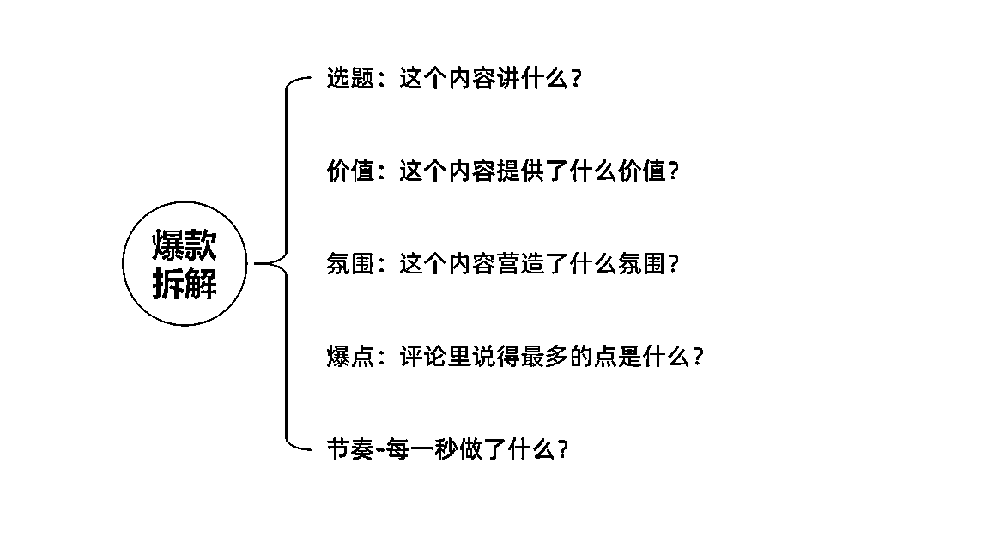
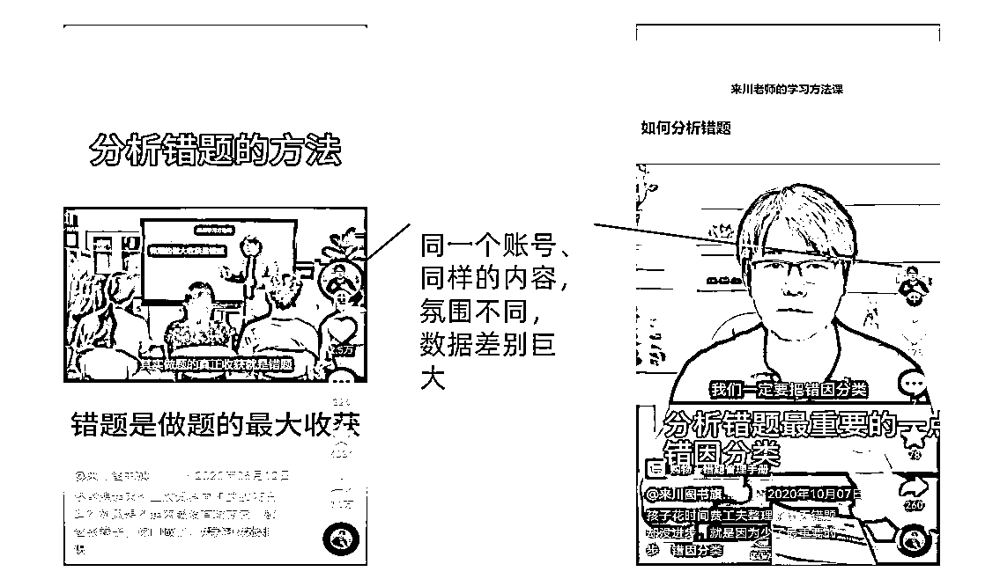
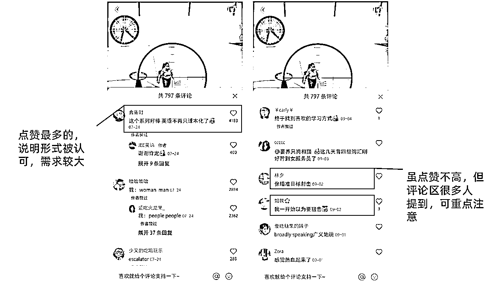

# 不露脸，20 个视频单月涨粉 10 万的 技巧：5 步拆解爆款

> 原文：[`www.yuque.com/for_lazy/thfiu8/ongfhn2apx2578uz`](https://www.yuque.com/for_lazy/thfiu8/ongfhn2apx2578uz)

<ne-h2 id="63d1c82d" data-lake-id="63d1c82d"><ne-heading-ext><ne-heading-anchor></ne-heading-anchor><ne-heading-fold></ne-heading-fold></ne-heading-ext><ne-heading-content><ne-text id="u72b7bb05">(33 赞)不露脸，20 个视频单月涨粉 10 万的 技巧：5 步拆解爆款</ne-text></ne-heading-content></ne-h2> <ne-p id="ub33cb07b" data-lake-id="ub33cb07b"><ne-text id="uc6555a95">作者： 李子木</ne-text></ne-p> <ne-p id="u583a330a" data-lake-id="u583a330a"><ne-text id="ua553ed0f">日期：2023-07-14</ne-text></ne-p> <ne-p id="u7b372a36" data-lake-id="u7b372a36"><ne-text id="u9b40b887" style="color: rgb(0, 0, 0);">大火靠风口，小火靠技巧，作为自媒体运营，如何通过一步一步精细操作，在一个月内精准粉丝涨粉超过 10w？</ne-text></ne-p> <ne-p id="u35931ff4" data-lake-id="u35931ff4"><ne-text id="udbbff112" style="color: rgb(0, 0, 0);">我通过找到对标爆款内容、拆解对标爆款要素，在视频内容均为原创的基础上，一个月内抖音+快手累计涨粉 11.9w，涨粉速度甚至超过了原来的爆款账号。今天复盘一下整个操作方法及思考。</ne-text></ne-p> <ne-p id="u77dd9e0c" data-lake-id="u77dd9e0c"><ne-card data-card-name="image" data-card-type="inline" id="wmyvW" data-event-boundary="card"></ne-card></ne-p> <ne-p id="ucfd70c54" data-lake-id="ucfd70c54"><ne-text id="ua2b554c4" style="color: rgb(0, 0, 0);">首先，如何找到对标爆款，主要有四点：</ne-text></ne-p> <ne-p id="u73c5a36d" data-lake-id="u73c5a36d"><ne-text id="u2e397e03" ne-bold="true">第一，找发布时间为 3 个月内，点赞数超过 1w 的内容；</ne-text></ne-p> <ne-p id="u429b7405" data-lake-id="u429b7405"><ne-text id="uc5ebf235" style="color: rgb(0, 0, 0);">互联网的内容更替非常快，如果内容发布时间间隔太久，可能并不适合现在再用，所以我们要尽量找日期更近的爆款内容。</ne-text></ne-p> <ne-p id="u208ff9d5" data-lake-id="u208ff9d5"><ne-text id="u693edca7" ne-bold="true">第二，发表该内容的账号，原有粉丝不超过 10w（不过万更好）；</ne-text></ne-p> <ne-p id="u5fee2f8b" data-lake-id="u5fee2f8b"><ne-text id="u95d3d964" style="color: rgb(0, 0, 0);">如果是大号，大多形成了自己特定的人设、有特定的受众，内容模式趋于成熟、分发的流量也更加精准，比如米雷发个“周末写生”就能十几万点赞，而同样的内容放在新号上，大概率会扑。</ne-text></ne-p> <ne-p id="u26795f29" data-lake-id="u26795f29"><ne-text id="u7ce54876" ne-bold="true">第三，发布爆款内容后，账号粉丝数上涨明显；</ne-text></ne-p> <ne-p id="u3a1ae36e" data-lake-id="u3a1ae36e"><ne-text id="u0df8322f" style="color: rgb(0, 0, 0);">这是为了验证爆款的转粉率，有的内容虽然流量高，但没转化，比如我之前有一篇小红书笔记，在粉丝只有几十的时候，点赞超过 2 万，但没什么转粉，后续发同类内容依然是几十的阅读，意义不大。</ne-text></ne-p> <ne-p id="ua5ec595a" data-lake-id="ua5ec595a"><ne-card data-card-name="image" data-card-type="inline" id="aKVcP" data-event-boundary="card"></ne-card></ne-p> <ne-p id="ub9828191" data-lake-id="ub9828191"><ne-text id="u6d61b7a6" ne-bold="true">第四，内容具有较明显的节奏、或内容特色，具有该特色的内容，与其他内容相比，数据相对稳定；</ne-text></ne-p> <ne-p id="udaf6679f" data-lake-id="udaf6679f"><ne-text id="u4747c464" style="color: rgb(0, 0, 0);">这是为了进一步排除“概率性”，找到真正“可借鉴”的内容形式。</ne-text></ne-p> <ne-p id="uf0f8aa34" data-lake-id="uf0f8aa34"><ne-text id="u09ce1251" style="color: rgb(0, 0, 0);">除此之外，还要看内容是不是符合你的要求：</ne-text></ne-p> <ne-p id="u55416afb" data-lake-id="u55416afb"><ne-text id="u60ed16a0">1、  </ne-text><ne-text id="u313e4d1b" style="color: rgb(0, 0, 0);">如果不想露脸，就找同样不露脸的内容；</ne-text></ne-p> <ne-p id="udeefb699" data-lake-id="udeefb699"><ne-text id="u3adcd159">2、  </ne-text><ne-text id="ua9e6042a" style="color: rgb(0, 0, 0);">如果缺少演员，就不要找剧情向的内容；</ne-text></ne-p> <ne-p id="udd96aa44" data-lake-id="udd96aa44"><ne-text id="u18373977">3、  </ne-text><ne-text id="u1b6a8ad1" style="color: rgb(0, 0, 0);">如果没有强大的剪辑技巧，就不要找特效很强的内容。</ne-text></ne-p> <ne-p id="uf448ecfb" data-lake-id="uf448ecfb"><ne-text id="u1ace4c53" style="color: rgb(0, 0, 0);">总结起来，思路就是一句话：排除账号权重、时间影响等对概率影响较大的因素，找到适合你、且能够坚持做下去的内容形式参考。</ne-text></ne-p> <ne-p id="u13610b94" data-lake-id="u13610b94"><ne-text id="u0a1e6384" ne-bold="true">做好了这一步之后，就是拆解爆款。</ne-text></ne-p> <ne-p id="u5f644118" data-lake-id="u5f644118"><ne-text id="u3e28b8be" style="color: rgb(0, 0, 0);">我不太认可从布景、内容、音乐等形式去像素级地“模仿”对标内容，那样的话，内容的原创度、未来发展都容易受限，我们可以从这些内容所产生的价值、氛围等更底层更基本的东西上去分析。</ne-text></ne-p> <ne-p id="u7c7a3264" data-lake-id="u7c7a3264"><ne-card data-card-name="image" data-card-type="inline" id="gfdDx" data-event-boundary="card"></ne-card></ne-p> <ne-p id="u1cd52d8e" data-lake-id="u1cd52d8e"><ne-text id="ue8b8823b" ne-bold="true">第一，选题：这个内容讲什么？</ne-text></ne-p> <ne-p id="uf283801d" data-lake-id="uf283801d"><ne-text id="u7e965e58" style="color: rgb(0, 0, 0);">选题是大方向，互联网上讲同一个选题的内容数不胜数，但它仍然非常重要：它决定了我们的起跑线。</ne-text></ne-p> <ne-p id="uc60c29c4" data-lake-id="uc60c29c4"><ne-text id="uee326e61" style="color: rgb(0, 0, 0);">讲如何拆解选题的内容很多，这里不再赘述，说几个我最关注的点：这个选题的内容，我有能力能讲吗？它所在的大方向，我能持续讲下去吗？现在讲这个选题合适吗？</ne-text></ne-p> <ne-p id="ue7a4fd8d" data-lake-id="ue7a4fd8d"><ne-text id="u74bfffe8" style="color: rgb(0, 0, 0);">如果答案都是肯定的，进入下一步。</ne-text></ne-p> <ne-p id="u8a8a9019" data-lake-id="u8a8a9019"><ne-text id="u4294086f" ne-bold="true">第二，价值：这个内容提供了什么价值？</ne-text></ne-p> <ne-p id="ubfd67902" data-lake-id="ubfd67902"><ne-text id="u42543347" style="color: rgb(0, 0, 0);">同样一个大选题方向下，内容提供的价值常常并不一样。</ne-text></ne-p> <ne-p id="u8e4c785f" data-lake-id="u8e4c785f"><ne-text id="uc794cb49" style="color: rgb(0, 0, 0);">同样是讲婆婆不让儿子干活、让怀孕的儿媳去洗碗的婆媳冲突，可以提供“痛骂婆婆，帮儿媳出口恶气”的情绪价值，可以提供“这种情况儿媳该如何应对”的干货价值，也可以提供“洗碗机限时骨折”的经济价值。</ne-text></ne-p> <ne-p id="ub2cc05d4" data-lake-id="ub2cc05d4"><ne-card data-card-name="image" data-card-type="inline" id="iIgu8" data-event-boundary="card"></ne-card></ne-p> <ne-p id="u2aa60320" data-lake-id="u2aa60320"><ne-text id="u941dd916" style="color: rgb(0, 0, 0);">同样是热门游戏的讲解视频，可以输出“教你如何上分”的干货诀窍，可以提供”看我虐别人你很痛快“的情绪爽点，可以满足“一边看游戏一边听八卦”的好奇心，还可以提供“钻石装备免费薅”的省钱方法。</ne-text></ne-p> <ne-p id="uca3fa197" data-lake-id="uca3fa197"><ne-text id="u2f60d72a" style="color: rgb(0, 0, 0);">一般来说，内容提供的价值主要有 3 大类：</ne-text></ne-p> <ne-p id="ubfa54478" data-lake-id="ubfa54478"><ne-text id="u873a9803" style="color: rgb(0, 0, 0);">1、情绪价值</ne-text></ne-p> <ne-p id="u4d73b319" data-lake-id="u4d73b319"><ne-text id="u149d906c" style="color: rgb(0, 0, 0);">我认为这是自媒体上最受欢迎的一种价值，其他价值与之叠加，能体现出更好的效果。</ne-text></ne-p> <ne-p id="ub553fcd8" data-lake-id="ub553fcd8"><ne-text id="ufafdbe86" style="color: rgb(0, 0, 0);">包括但不限于“帮儿媳出口恶气”这类，提供情绪出口；“看我虐别人很痛快”这类，让人心情愉悦；“世界上还有很多人羡慕你”这类，舒缓焦虑，等等。</ne-text></ne-p> <ne-p id="uddf91865" data-lake-id="uddf91865"><ne-text id="ufca55945" style="color: rgb(0, 0, 0);">2、知识价值</ne-text></ne-p> <ne-p id="u8a1a55ab" data-lake-id="u8a1a55ab"><ne-text id="ubcfd2aac" style="color: rgb(0, 0, 0);">解决某些具体的问题，比如考试、学习、工作、生活中的问题；这类最容易模仿，通过很多同类视频、书籍、长图文，可以整合出属于你自己的知识体系。</ne-text></ne-p> <ne-p id="u459f2789" data-lake-id="u459f2789"><ne-text id="u406f3263" style="color: rgb(0, 0, 0);">包括但不限于提供“如何做”的知识，“如何学”的知识，等等。</ne-text></ne-p> <ne-p id="u50dfe044" data-lake-id="u50dfe044"><ne-text id="u3e7694e8" style="color: rgb(0, 0, 0);">3、经济价值</ne-text></ne-p> <ne-p id="u12e29968" data-lake-id="u12e29968"><ne-text id="u8580e228" style="color: rgb(0, 0, 0);">这类同样很受欢迎，尤其在鼓吹“消费降级”的当下，如何 9.9 元买到几件长袖、如何正确薅拼夕夕的羊毛，等等。</ne-text></ne-p> <ne-p id="uc8f3f5f2" data-lake-id="uc8f3f5f2"><ne-card data-card-name="image" data-card-type="inline" id="Zf9M3" data-event-boundary="card"></ne-card></ne-p> <ne-p id="ue8c40656" data-lake-id="ue8c40656"><ne-text id="u7d18790d" style="color: rgb(0, 0, 0);">在 3 大类价值之下，不同内容有不同的细节呈现形式，需要我们针对具体内容具体分析。</ne-text></ne-p> <ne-p id="u679878b9" data-lake-id="u679878b9"><ne-text id="ua0b5289c" ne-bold="true">第三，氛围：这个内容营造了什么氛围？</ne-text></ne-p> <ne-p id="uc628a9ec" data-lake-id="uc628a9ec"><ne-text id="u9f810ead" style="color: rgb(0, 0, 0);">在珍贵的黄金 3 秒，氛围甚至比内容还要重要。</ne-text></ne-p> <ne-p id="uc4bf29bd" data-lake-id="uc4bf29bd"><ne-text id="udb8cb001" style="color: rgb(0, 0, 0);">举两个例子。</ne-text></ne-p> <ne-p id="uebe0bfaf" data-lake-id="uebe0bfaf"><ne-text id="u0bf89adb" style="color: rgb(0, 0, 0);">一个普通家庭的客厅，明亮的灯光、配上《迎宾进行曲》——无聊，刷地一下就划过去了；</ne-text></ne-p> <ne-p id="u7c3fb280" data-lake-id="u7c3fb280"><ne-text id="u149e98b0" style="color: rgb(0, 0, 0);">一个普通家庭的客厅，明亮的灯光，微微摇晃的镜头，配上“哈哈哈哈哈哈”的笑声——有点好奇，“有啥好戏？”，停留 1.5 秒；</ne-text></ne-p> <ne-p id="u87754f35" data-lake-id="u87754f35"><ne-text id="u0a581999" style="color: rgb(0, 0, 0);">一个普通家庭的客厅，昏暗的灯光一闪一闪，配上悬疑片的经典音乐，隐隐听到还有说话声——好奇心被勾起，“会发生什么？”，停留 3 秒。</ne-text></ne-p> <ne-p id="u1f5a5f3e" data-lake-id="u1f5a5f3e"><ne-text id="uad6fdada" style="color: rgb(0, 0, 0);">一个教语文的男人，穿着 t 恤坐在自家客厅讲课——没什么意思，0.5 秒划走；</ne-text></ne-p> <ne-p id="ud51d826f" data-lake-id="ud51d826f"><ne-text id="u23a792d7" style="color: rgb(0, 0, 0);">一个教语文的男人，穿着睡衣，站在在黑板前讲课——“嘿，这是干嘛？”打开评论，一刷就是 3 秒；</ne-text></ne-p> <ne-p id="ue25c1820" data-lake-id="ue25c1820"><ne-text id="u9de2275c" style="color: rgb(0, 0, 0);">一个教语文的男人，穿着西装，在大礼堂里讲课，下面乌泱泱都是家长和学生——“他讲的应该不错，我看看”，耐着性子看了 5、6 秒。</ne-text></ne-p> <ne-p id="u132a569a" data-lake-id="u132a569a"><ne-card data-card-name="image" data-card-type="inline" id="skufQ" data-event-boundary="card"></ne-card></ne-p> <ne-p id="u10847a9b" data-lake-id="u10847a9b"><ne-text id="ue4cb6a3c" style="color: rgb(0, 0, 0);">一般来说，视频内容是用画面元素、灯光（或亮度）的明暗闪烁、背景音乐的选择来营造氛围，尤其是前 3 秒，特别重要。</ne-text></ne-p> <ne-p id="ua04e8c9c" data-lake-id="ua04e8c9c"><ne-text id="ua8627078" style="color: rgb(0, 0, 0);">并不需要照搬爆款内容的画面和音乐，只需要分析出来：它营造出来的氛围，是欢乐、还是严肃，是热闹还是惊悚？</ne-text></ne-p> <ne-p id="uec03f2bf" data-lake-id="uec03f2bf"><ne-text id="ubcd867ca" style="color: rgb(0, 0, 0);">然后去剪映（或其他剪辑软件）的素材库里找一找，是否有其他的搭配，能营造出这样的感觉？是否能比它做得更好？然后不断地在内容里排列组合，多次尝试，直到找到适合你自己的组合。</ne-text></ne-p> <ne-p id="ubee7d002" data-lake-id="ubee7d002"><ne-text id="u7fc21f1c" ne-bold="true">第四，爆点：评论里说得最多的点是什么？</ne-text></ne-p> <ne-p id="u478d3d42" data-lake-id="u478d3d42"><ne-text id="udd0966af" style="color: rgb(0, 0, 0);">纯靠我们主观地去判断一个内容的爆点是什么，不一定准确，尤其是当网感没有培养起来的时候，可能经常会有偏差，幸好，只要是爆款内容，一般都会给我们留下线索：点赞数据过 w 的内容，一般评论区也很热闹。</ne-text></ne-p> <ne-p id="uf74a4fb6" data-lake-id="uf74a4fb6"><ne-text id="u20359011" style="color: rgb(0, 0, 0);">千万不能浪费这个绝佳的线索，一定要好好研究爆款内容的评论区，主要看 2 点：</ne-text></ne-p> <ne-p id="u2e837600" data-lake-id="u2e837600"><ne-text id="u7c4337ec" style="color: rgb(0, 0, 0);">1、看点赞最多的评论说了什么，这代表着大部分看视频的人的感受；</ne-text></ne-p> <ne-p id="u1acdfb8b" data-lake-id="u1acdfb8b"><ne-text id="uef888e2a" style="color: rgb(0, 0, 0);">2、再往下多翻一翻，看评论区里出现最多的关键词是什么？</ne-text></ne-p> <ne-p id="u7afa83bd" data-lake-id="u7afa83bd"><ne-card data-card-name="image" data-card-type="inline" id="aWwT0" data-event-boundary="card"></ne-card></ne-p> <ne-p id="u1930ae05" data-lake-id="u1930ae05"><ne-text id="u3aa57dab" style="color: rgb(0, 0, 0);">这 2 点，往往揭示了对大部分用户来说，这条爆款内容真正的价值是什么、它与其他普通内容相比的特点是什么、是什么氛围吸引用户停留并互动。</ne-text></ne-p> <ne-p id="ud558207b" data-lake-id="ud558207b"><ne-text id="u95d78217" style="color: rgb(0, 0, 0);">找到之后，将它们与你分析出来的价值、氛围去做验证，校准自己的分析，并将它们应用到你接下来的内容中去。</ne-text></ne-p> <ne-p id="u370173d7" data-lake-id="u370173d7"><ne-text id="ube173639" ne-bold="true">第五，节奏-每一秒做了什么？</ne-text></ne-p> <ne-p id="u15617375" data-lake-id="u15617375"><ne-text id="ua3cf0e47" style="color: rgb(0, 0, 0);">别急，还有一个很大的细节要注意：节奏。</ne-text></ne-p> <ne-p id="uc0909609" data-lake-id="uc0909609"><ne-text id="u1b0c6388" style="color: rgb(0, 0, 0);">互联网上每天新产生大几千万条内容，完播率、互动率稍有百分之零点几的偏差，所获得的流量就完全不一样，所以，还要把握好视频的时长、节奏，才能加大胜算。</ne-text></ne-p> <ne-p id="ubeda2541" data-lake-id="ubeda2541"><ne-text id="u1e8829d1" style="color: rgb(0, 0, 0);">爆款视频总共有多长？第一秒是什么内容？第二秒是什么内容？第三秒是什么内容？最后两秒是什么内容？</ne-text></ne-p> <ne-p id="u452dc727" data-lake-id="u452dc727"><ne-text id="u2a955f6e" style="color: rgb(0, 0, 0);">刚开始时，可以把这个节奏应用到你自己的内容中，等数据稳定了、或者你对内容节奏的把握，可以不限于掐秒表，可以再尝试放宽。</ne-text></ne-p> <ne-hole id="ub488d4d9" data-lake-id="ub488d4d9"><ne-card data-card-name="hr" data-card-type="block" id="p3bnA" data-event-boundary="card"><ne-p id="u33b0c74d" data-lake-id="u33b0c74d"><ne-text id="ud656b232">评论区：</ne-text></ne-p> <ne-p id="u87b471d8" data-lake-id="u87b471d8"><ne-text id="u8a7b7690">境界哥 : 分析出来后，咋模仿呢</ne-text> <ne-text id="u2031e52d">流芳 : 太有用了！！用到其他领域一样适用</ne-text> <ne-text id="u6b800fcb">李子木 : 短视频底层逻辑都是相通的</ne-text><ne-text id="uc4df07da" ne-sub="true">加油</ne-text><ne-text id="u9fb15c6e">土豆先生 : 感谢分享</ne-text></ne-p> <ne-p id="ua57b4a40" data-lake-id="ua57b4a40"><ne-card data-card-name="image" data-card-type="inline" id="xsVmn" data-event-boundary="card">  <ne-hole id="u473a32f0" data-lake-id="u473a32f0"><ne-card data-card-name="hr" data-card-type="block" id="unydx" data-event-boundary="card"></ne-card></ne-hole></ne-card></ne-p></ne-card></ne-hole>