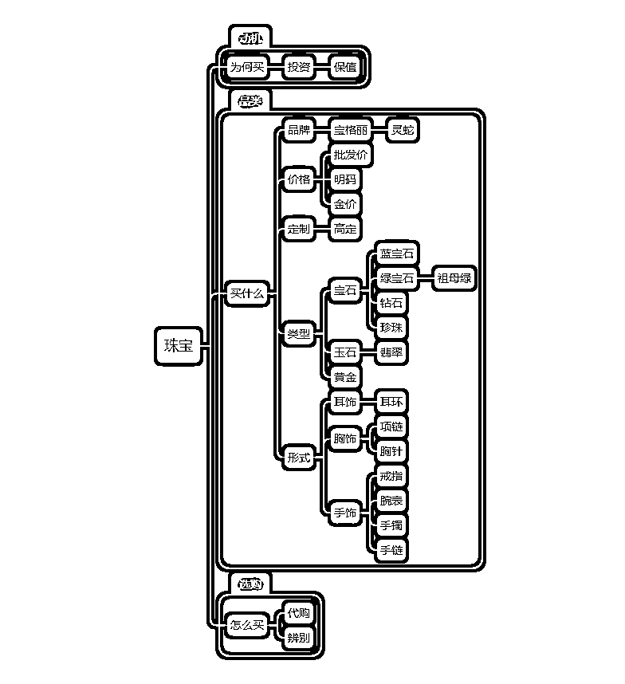
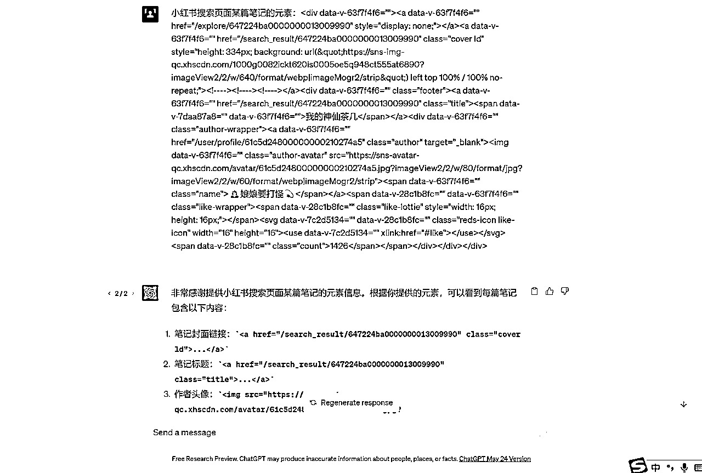
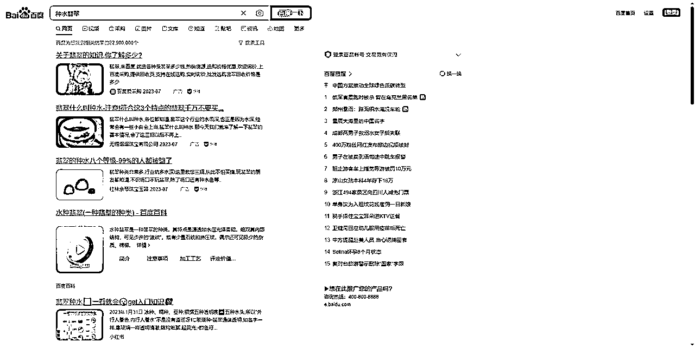
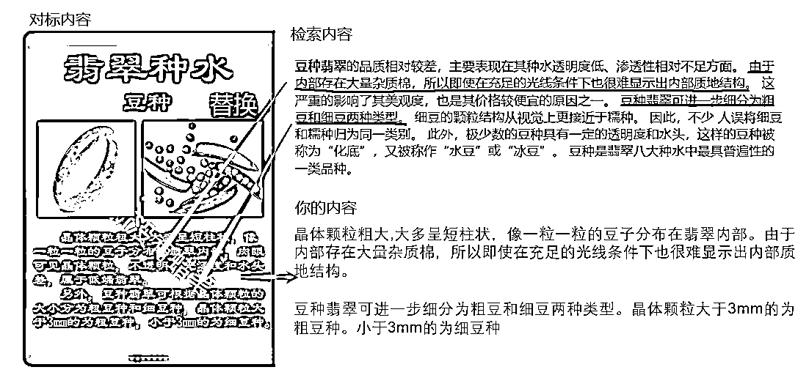

# 如何用 ChatGPT 开发插件脚本，提升小红书内容创作效率

> 原文：[`www.yuque.com/for_lazy/thfiu8/fye9wwfx2swubb1x`](https://www.yuque.com/for_lazy/thfiu8/fye9wwfx2swubb1x)

## (168 赞)如何用 ChatGPT 开发插件脚本，提升小红书内容创作效率 

作者： 梨云 

日期：2023-07-14 

生财圈友们好，我是梨云，一个自媒体内容创业者。 

最近，在跑全新的高客单价赛道，在收集过程中，后裔八爪鱼被反爬虫，所以梨云直接开发了脚本（文末代码开源）可以一键获取批量笔记，用技术赋能内容创作，接下来，就和大家复盘这一整个过程。 

 

 

小红书变现的入局者，在我看来，可以分为两类，一类是已有相关知识积累的专业玩家，一类是行业积累甚少，甚至没有的小白玩家。 

而小红书之所以是对普通人最友好的平台，就是因为存在一套方法，可以快速拉短和专业玩家的差距。 

就像我快速做到学习赛道头部：[《小红书三个月涨粉 17w，变现 10w+，我做对什么？》](https://t.zsxq.com/0f1j7QDH5)，一大原因是我本身就是研究学习方法的，深知学习的痛点，并且抓住【讨厌学习-如何调动学习兴趣】这个点，用选题+内容的方式击穿它。 

现在，我做小红书，已经横跨多个赛道，有时，也会面对跑全新赛道，没有知识积累的情况。 

但是，并不妨碍我继续取得成绩。 

比如，我最近跑的珠宝赛道，用 0 粉新号一篇笔记直接吸引了 300+精准粉丝，用户画像中未成年人占比为 0。 

在缺少知识储备的情况下，我是如何做到的？ 

 

我在入局珠宝赛道的时候，面临最大的问题，就是对要做的事情，一问三不知：用户痛点是啥？赛道的选题都有啥？内容要写啥？ 

但是我知道，要解决这个问题，核心就四个字：搜索采集。 

搜索，就是利用关键词，快速构建起对一个赛道的整体认知，从用户痛点确定选题模块，根据选题多渠道收集素材，完成对内容的撰写。 

采集，就是为了批量收集数据进行分析，以及素材对内容的辅助创作。 

搜索的难点在于，因为 0 知识储备，我脑子里没几个相关关键词，不知道搜啥，采集的难点在于，小红书烦人的反爬虫机制。 

# 利用搜索采集构建赛道整体认知 

这赛道，对我这个玩家太不友好了，开局一个关键词：珠宝。 

如何通过珠宝进行拓展呢，就是先收集珠宝检索结果下的爆款标题，进行分词，从而收集到相关关键词。 

## 1、用关键词开启上帝视角 

手机不方便，改用网页版，它有个细节，就是有一栏关键词，直接完成了第一轮的拓展。 

然后，检索珠宝，得到一堆笔记。 

 

为了批量获取它们，我反手就是后裔采集器+八爪鱼采集器，奈何网页的反爬虫太厉害，都失败了……于是，我只能通过游览的方式，提取标题关键词，完成手动记录。 

 

记录下来之后，做去重处理，和对词的关系进一步梳理，使得层级逻辑更加清晰。 

 

这样梳理之后，你直接就开启了对珠宝赛道的上帝视角，能看到用户在购买决策的不同阶段，所关注的焦点，以及珠宝的哪些细分赛道，在小红书上是可以做的。 

你能看到赛道的完整度，取决于你初始数据收集的多寡。 

然后，结合你已经有资源，就可以开始找切入点了。 

如果你本身是开线下实体店，想要线上拓客，那么找你的产品品类，在小红书上，是否受欢迎。 

但，如果你自身没有资源…… 

你可以做流量生意，引流给有珠宝资源的合作伙伴，以此收分佣，珠宝作为高客单价，是非常值得去做的。 

你可以做广告变现，一个月百万投放，可以说是品牌方非常有钱的赛道了。 

 

你还可以做无货源，借助上面关键词的检索，挖掘爆品，然后开店，中间商赚差价。 

你甚至可以涨粉卖号，一个珠宝号，高净值人群，用户画像极好，可以卖出不菲的价格。 

## 2、再切细分赛道做素材库 

珠宝这个赛道依然太大了，从上面的思维导图就可以看出，我们需要细分，越细分，人群越精准。 

切翡翠赛道，你可能觉得，这都是类型里面的二级关键词了，真的有流量吗？ 

不要凭感觉，直接上数据，需求是很大的。 

 

翡翠这个时候，就相当于刚才开局的珠宝，所以，针对这个关键词，要进行拓展，从而俯瞰这个细分赛道，不一样的是，在这个过程中，可以同步锁定选题模块。 

 

这是翡翠赛道的鸟瞰图，也是选题的关键词库，根据这些词去检索，取爆款，就可以构建你的爆款选题库了。 

这里需要注意的，依然是先要明确你的商业模式。 

如果你是走实体店，或者无货源，可以往定制和二手这一块去深入，主选翡翠手镯和翡翠挂件。 

具体怎么做选品、笔记内容，我之前在这篇文章已经详细写过了，就不在赘述：[如何从小红书千条带货笔记深度挖掘，找到适合普通人的蓝海爆品](https://t.zsxq.com/0fHiubmm7) 

如果你要做 ip 接广告，那么可以主选科普下的二级关键词。 

这里你可能要问了，自己对翡翠一点都不了解，科普知识写不来。 

而我要说，它不是能力问题，而是认知问题。 

在小红书上，每个人都可以做 IP，关键在于，你必须找到知识储备少于你的人，进行输出。 

你开过车，你就可以教准备学车的人，怎么考科一，怎么过科三。 

你工作过，你就可以教毕业生，怎么去面试，怎么混职场。 

甚至，你有了二胎，你就可以给新手妈妈分享育儿踩过的坑。 

你有 80 分，就去教 60 分的人，你有 30 分，就去教 10 分的人。 

只要看几篇翡翠的笔记，知道翡翠的分类，就可以对想要了解翡翠的人，说的头头是道。 

比如现在的我，之于你。 

那么，如何找到大量笔记，把自己的知识储备，从 0 分快速提升至 60 分呢？ 

在小红书网页版，翡翠关键词检索结果下的知识科普页面，展示有限，每个页面平均 200 条笔记。 

把点赞排名前 20%的笔记整理出来。 

具体到标题的时候，你就更知道用户都在关注什么了。 

翡翠种水、手镯价位、翡翠挑选、翡翠行话，都是比较爆款的选题。 

很多人不知道选题库怎么去呈现，也分不清选题和标题的区别，我用一张图来简单解释一下。 

赛道是对选题的统领 

选题是对标题的归纳 

标题是对内容的总结 

内容是对素材的融合 

 

所以，构建好选题库之后，不是就开始动笔了啊！ 

你需要借助选题，构建素材库，而素材库，才是你内容创作的起点。 

小红书的素材，主要是图文、视频，以及文案区的文字。 

在对标排版上，我们需要把图片、视频，下载下来，一边分析，一边临摹。 

在对标内容上，我们需要图片、视频提取文字，以及直接复制粘贴文案区的文字。 

同时，小红书的查重机制在不断完善，如果只用站内的内容，而自己改表达又不能很好降低重复率的时候，就可以借助万能的搜索引擎，来拓展你的知识边界。 

比如，我要写翡翠的分类，素材库里面，对标的内容，是这张图，我要对它降重，又不会改写，那么你就替换里面的句子，替换什么呢？用检索来帮你。 

 

这样，就快速完成了笔记的生产，还能降低被系统抓到、限流的概率。 

如果想要提升内容生产的效率，可以看我之前写过的这篇：[小红书 60 天用原创拿下 20 多篇 10w+，如何流程化创作爆款内容？](https://t.zsxq.com/10ev8Jjgj) 

这么一套下来，去哪个赛道做流量，还会有困难？ 

# 借助GPT开发实现工具赋能效率 

## 

## 

## 开发缘起 

正当复盘完这一套方法之后，我突然意识到，有好几个点，真的太浪费时间了。 

 

因为后裔八爪鱼又被反爬虫，使得我在构建关键词库，和收集素材的过程中，效率之低，尤为痛苦。 

那怎么办？因为之前有合作开发过自动排版器的经验，让我立马想到：要不，就做一个符合自己需求的凌云采集器！ 

说干就干，能提升效率的三个环节，分别是网页检索结果的笔记爬取、笔记素材的导出和快速切换检索渠道。 

我在大学的时候，做动漫混剪，用过油猴插件安装脚本，下载 b 站视频。油猴插件，就是你通过安装脚本修改网页 html，来实现你想要的效果。 

虽然网页插件开发 0 经验，但我对编程还是有一点点经验，于是就想着，借助 chatgpt 在油猴插件的基础上，直接开发脚本。 

## 开发过程 

第一步：小红书搜索页面的采集 

因为小红书深度采集笔记正文和更多笔记数据，需要二次打开页面，会降低采集速度，以及被小红书限制。 

为了在有用的基础上，保证效率，所以选择采集笔记标题、笔记链接、作者、作者链接、点赞数据。 

关于 chatGPT 的操作，在生财已有不少内容，这里不在过多展开细节，但是，我要讲一下开发过程中要注意的。 

开发关键点： 

1、因为 chatgpt 的数据截止到 21 年，所以对当前小红书页面的信息不太了解，需要你提供更多网页 html 信息给它。 

 

2、小红书页面展现内容是滚动加载，并且每次加载的数据是有限制的，所以必须实时监控加载的信息并保存，还要对已保存的数据做去重处理。 

 

第二步：快速下载素材 

这个功能开发是最简单的，只需要你给 GPT 提供丰富的小红书笔记页面信息，就可以实现图片/视频的提取。 

开发关键点： 

1、提供 GPT 足够多页面信息，包括图文笔记和视频笔记。 

2、需要代码获取当前页面标题，然后对下载的图片/视频素材命名规则为：页面标题+页数 

 

第三步：快速切换检索渠道 

这个想法，来源于在搜集对标信息时，需要小红书收集外部更多信息，来对对标内容进行降重，按个把关键词扔到“百度”“公众号”“知乎”太慢了，所以开发这个功能。 

开发关键点： 

1、网页搜索按钮的设计比较麻烦，需要给 GPT 反馈左侧网页信息，并且按钮大小、左右间距需要不断调整。 

2、需要对当前搜索关键词进行实时监控，如果有变动，要将搜索关键词赋值给其他跳转搜索链接。 

 

# 小红书网页工具安装和使用方法 

## 安装方法 

里面具体讲解 edge 和谷歌浏览器安装方法，由于内容较多，梨云放到飞书了。 

凌云采集器：小红书搜索网页导出/图文下载/搜索跳转脚本安装教程： 

[https://lvcj32c4z9.feishu.cn/docx/LOJedZaP6ooW2gx5r27cAwiunQd](https://lvcj32c4z9.feishu.cn/docx/LOJedZaP6ooW2gx5r27cAwiunQd) 

这里特别感谢我的好朋友徐宿，在脚本的内测过程中，帮我发现了重大 bug，让我进一步完善了凌云采集器的采集功能和使用体验。 

 

## 使用方法 

1、小红书搜索批量爬取笔记 

搜索框输入关键词，点击搜索后，需要刷新一次页面，召唤此功能。 

然后开始手动滚动，会显示已采集的笔记数，需要多少条，然后点击导出即可。 

 

下载表格打开后： 

 

点击表格中的链接，可以直达笔记并且一键下载，打开网页后，需要刷新召唤此功能。 

 

相同关键词下，快速切换检索渠道，收集素材辅助内容输出。 

 

 

 

一顿操作猛如虎，可能你会觉得，梨云用 GPT 写了个插件，真他妈的 6，也想学怎么用它写代码，但我想说，这不是最重要的。 

最重要的是，如何用更高的效率，来实现你想要的目标。 

永远记住，工具是对方法的执行赋能，对流程的降本增效。 

今天的小红书分享就到这里，内容很干，希望能给到大家一些启发和帮助，坚持下去，你一定会有所收获。有帮助的话，记得点个赞哦~也欢迎交流+v：lyy520061 

更多小红书干货，可以关注公众号：梨云读书 

往期精华文章推荐： 

《小红书三个月涨粉 17w，变现 10w+，我做对什么？》 

[https://t.zsxq.com/07Fqr3jQ7](https://t.zsxq.com/07Fqr3jQ7) 

《小红书 60 天用原创拿下 20 多篇 10w+，如何流程化创作爆款内容？》 

[https://t.zsxq.com/09ev8Jjgj](https://t.zsxq.com/09ev8Jjgj) 

《在小红书上，如何挖掘出 1000 个适合普通人的赚钱项目》 

[https://t.zsxq.com/0eRD32jY6](https://t.zsxq.com/0eRD32jY6) 

评论区： 

洺 : 哇，梨云出品，必属精品！ 晴朗☀️ : 梨云出品，必属精品！内卷，已经开始[捂脸][捂脸][强] 徐宿 : 说什么谢不谢的，太见外了，感谢云老师帮我从小红书赚了 20 万，下次有这种活儿请继续让我身先士卒[得意] 张静伟@生财有术 : GPT 蛋蛋。 : 云云太强了 梨云 : 还得是你[奸笑][强] 梨云 : 放大镜男孩[太阳] 梨云 : [社会社会][社会社会] 

 