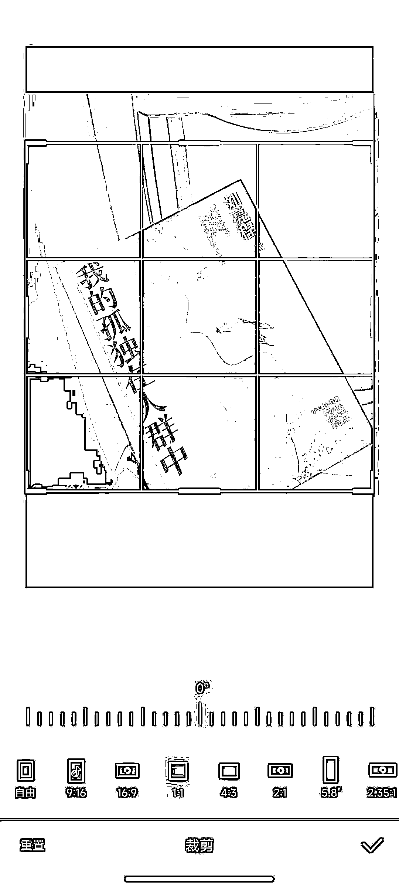
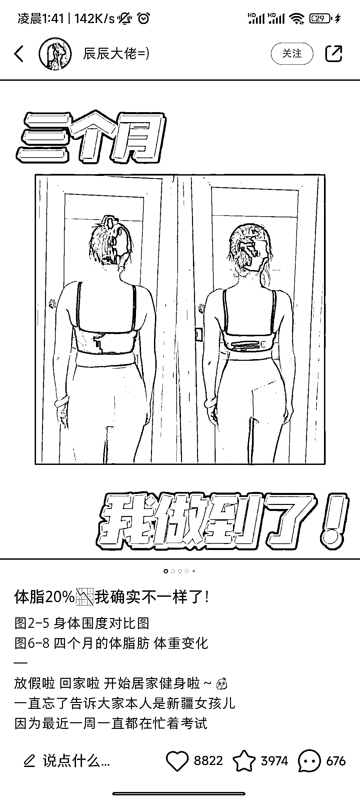
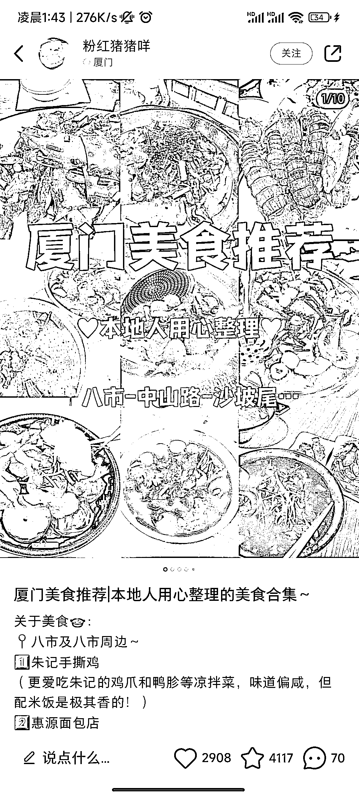

# 小红书爆款封面最新设计攻略！带你掌握流量密码

> 原文：[`www.yuque.com/for_lazy/thfiu8/smk34z8xrdxgs4tw`](https://www.yuque.com/for_lazy/thfiu8/smk34z8xrdxgs4tw)

<ne-h2 id="bf1d1f60" data-lake-id="bf1d1f60"><ne-heading-ext><ne-heading-anchor></ne-heading-anchor><ne-heading-fold></ne-heading-fold></ne-heading-ext><ne-heading-content><ne-text id="ua0907f9b">(53 赞)小红书爆款封面最新设计攻略！带你掌握流量密码</ne-text></ne-heading-content></ne-h2> <ne-p id="u24325d8f" data-lake-id="u24325d8f"><ne-text id="u957c2e02">作者： 书豪</ne-text></ne-p> <ne-p id="u9694beb4" data-lake-id="u9694beb4"><ne-text id="u8c6064ab">日期：2023-07-14</ne-text></ne-p> <ne-p id="ufa72f6d5" data-lake-id="ufa72f6d5"><ne-text id="u12949ac0">各位朋友好，我是在杭州的圈友书豪，一个连续创业四年的 95 后，目前连续四年都年入百万。</ne-text></ne-p> <ne-p id="u417e35be" data-lake-id="u417e35be"><ne-text id="ubbd3bdd3">很多做小红书的朋友都会面临这个问题：</ne-text></ne-p> <ne-p id="u832be42c" data-lake-id="u832be42c"><ne-text id="ue56e26d2" ne-bold="true">为什么我辛辛苦苦码了这么多字，还全都是干货，笔记的浏览量点赞数寥寥无几；而隔壁博主相似的内容却能轻轻松松成为爆款，一骑绝尘？</ne-text></ne-p> <ne-p id="ua8a9d811" data-lake-id="ua8a9d811"><ne-text id="u7c297ea3">在内容、标题差不多的情况下，很有可能是你的封面图不够吸引人。</ne-text></ne-p> <ne-p id="u104dba91" data-lake-id="u104dba91"><ne-text id="u200aabb8" ne-bold="true">在同个环境下，图片永远比文字更加引人注目。</ne-text></ne-p> <ne-p id="u95434500" data-lake-id="u95434500"><ne-card data-card-name="image" data-card-type="inline" id="lQEGs" data-event-boundary="card"></ne-card></ne-p> <ne-p id="u08a50cf4" data-lake-id="u08a50cf4"><ne-text id="u9ff5aa8f">今天就给大家总结了几类</ne-text><ne-text id="u676bf381" ne-bold="true">小红书爆款图文笔记封面设计技巧</ne-text></ne-p> <ne-p id="u4b1c71ed" data-lake-id="u4b1c71ed"><ne-text id="ua90d4087">学会了，你也可以拥有属于自己的爆款笔记，牢牢把握住流量密码！</ne-text></ne-p> <ne-p id="u60764d76" data-lake-id="u60764d76"><ne-text id="u85ff0b27" ne-bold="true">01</ne-text> <ne-text id="uf3c1815e" ne-bold="true">封面尺寸</ne-text></ne-p> <ne-p id="ue31d55f9" data-lake-id="ue31d55f9"><ne-text id="u2f763b87">对于小红书图文笔记来说，</ne-text><ne-text id="u57579f75" ne-bold="true">官方的尺寸推荐有三种：</ne-text></ne-p> <ne-p id="u4915d92d" data-lake-id="u4915d92d"><ne-text id="u432689d5" ne-bold="true">竖屏 3:4，横屏 4:3，正方形 1:1。</ne-text></ne-p> <ne-p id="u4b605580" data-lake-id="u4b605580"><ne-text id="uc2e810a5">有一个点需要注意：</ne-text><ne-text id="u31cfb02d" ne-bold="true" ne-italic="true">横板封面对于屏幕空间的占比较小，给用户的视觉冲击不会太大，会出现被用户直接划走的风险。</ne-text></ne-p> <ne-p id="ub9b6f892" data-lake-id="ub9b6f892"><ne-text id="u9a33e4f7" ne-bold="true" ne-italic="true">所以大家公认的小红书图文封面黄金比例分别是竖图 3：4，视频封面是横图 4：3，而且每一篇图文笔记的图片比例都要保持一致，确保用户点进你的主页时，看见的封面是一致的，更具美观性。</ne-text></ne-p> <ne-p id="ub3a46c83" data-lake-id="ub3a46c83"><ne-card data-card-name="image" data-card-type="inline" id="N4uNZ" data-event-boundary="card"></ne-card><ne-card data-card-name="image" data-card-type="inline" id="eUjKn" data-event-boundary="card"></ne-card><ne-card data-card-name="image" data-card-type="inline" id="WC17P" data-event-boundary="card"></ne-card></ne-p> <ne-p id="u130031e8" data-lake-id="u130031e8"><ne-text id="u9bd43209" ne-bold="true">02  </ne-text><ne-text id="u4fb50a1e" ne-bold="true">五种爆款笔记封面参考</ne-text></ne-p> <ne-p id="u2a80cb85" data-lake-id="u2a80cb85"><ne-text id="ue6e9fb41" ne-bold="true" ne-italic="true">1）前后对比型</ne-text></ne-p> <ne-p id="u412fe19b" data-lake-id="u412fe19b"><ne-text id="uc1465f62">这类封面主要用在</ne-text><ne-text id="ua83c28dd" ne-bold="true">制造前后反差效果</ne-text><ne-text id="ua2e348a9">上，通过反差冲突来吸引用户点击，通常在健身、美妆、测评、考试等类型的博主中看到。</ne-text></ne-p> <ne-p id="u2c00162e" data-lake-id="u2c00162e"><ne-card data-card-name="image" data-card-type="inline" id="fxwJk" data-event-boundary="card"></ne-card><ne-card data-card-name="image" data-card-type="inline" id="t5Kt1" data-event-boundary="card"></ne-card></ne-p> <ne-p id="u49a27ecc" data-lake-id="u49a27ecc"><ne-text id="u5c39ad28" ne-bold="true">设计技巧：</ne-text><ne-text id="ud5d4f972" style="background-color: rgb(255, 255, 255);">前后对比的反差感越大、越明显越好。但为了体现内容的真实性可以统一前后对比图的拍摄场地和角度。</ne-text></ne-p> <ne-p id="ue044679a" data-lake-id="ue044679a"><ne-text id="u5778922a" ne-bold="true">适用类型：</ne-text><ne-text id="u83a52de8">健身分享、考试提分、美妆教程、家居改造等。</ne-text></ne-p> <ne-p id="u7cad5066" data-lake-id="u7cad5066"><ne-text id="ud2918b26" ne-bold="true" ne-italic="true">2）多图拼接型</ne-text></ne-p> <ne-p id="u24436a14" data-lake-id="u24436a14"><ne-text id="u9daca76b" style="background-color: rgb(255, 255, 255);">拼接型封面适合想要传递元素较多、干货合集类的笔记，可以选择把主题一致的图片拼接起来。拼接型封面的好处在于只要用户心水了多图中的一款图片，就</ne-text><ne-text id="u56ca6408">会</ne-text><ne-text id="uac809abf" style="background-color: rgb(255, 255, 255);">点开查看笔记，增加点击的概率，内容多样，同时精心设计的排版在视觉效果上也会更胜一筹。</ne-text></ne-p> <ne-p id="ub99477d7" data-lake-id="ub99477d7"><ne-card data-card-name="image" data-card-type="inline" id="ppnS7" data-event-boundary="card"></ne-card><ne-card data-card-name="image" data-card-type="inline" id="jZkiC" data-event-boundary="card"></ne-card></ne-p> <ne-p id="ua18b6ed5" data-lake-id="ua18b6ed5"><ne-text id="u1d77918b" ne-bold="true">设计技巧：</ne-text></ne-p> <ne-p id="u98ba6836" data-lake-id="u98ba6836"><ne-text id="u017716cc" style="background-color: rgb(255, 255, 255);">1、在多图的选择上，注重图片色调、风格的</ne-text><ne-text id="u1ad72e4c" ne-bold="true">一致性</ne-text><ne-text id="uda52fbdb" style="background-color: rgb(255, 255, 255);">，这样拼接出来的成片看起来会更加</ne-text><ne-text id="u2e95d617">得</ne-text><ne-text id="u771f06f2" style="background-color: rgb(255, 255, 255);">和谐。</ne-text></ne-p> <ne-p id="u7414fee7" data-lake-id="u7414fee7"><ne-text id="u63eddfa7">2、图片适当，成片效果对称最佳，避免图片拼接的数量过多造成封面的重点不明和画面杂乱。封面标题可以放在画面正中或是其他醒目的位置，让封面的主题更加明确。</ne-text></ne-p> <ne-p id="u40379894" data-lake-id="u40379894"><ne-text id="u05c28736" ne-bold="true">适用类型：</ne-text><ne-text id="ub12c30f5">美食推荐、干货盘点、好物推荐等等。</ne-text></ne-p> <ne-p id="u7c3b6ffa" data-lake-id="u7c3b6ffa"><ne-text id="u1cc35e70" ne-bold="true" ne-italic="true">3）抠图展示型</ne-text></ne-p> <ne-p id="u2f51e66d" data-lake-id="u2f51e66d"><ne-text id="u15b0604d">当我们想要在封面中突出主体时，抠图就十分关键，它可以让人物、物件直观呈现在用户面前。</ne-text></ne-p> <ne-p id="ua0b7cc75" data-lake-id="ua0b7cc75"><ne-card data-card-name="image" data-card-type="inline" id="w0axK" data-event-boundary="card"></ne-card><ne-card data-card-name="image" data-card-type="inline" id="vsFK3" data-event-boundary="card"></ne-card></ne-p> <ne-p id="u71d6c42e" data-lake-id="u71d6c42e"><ne-text id="u787a27ec" ne-bold="true">设计技巧：</ne-text><ne-text id="u53704c05">把想要展示的主体抠出来，搭配纯色、清新的背景，给人一种干净清爽的感觉，再配上标题，注意要主次分明、错落有致，保持整体色调和谐。</ne-text></ne-p> <ne-p id="u849c6e00" data-lake-id="u849c6e00"><ne-text id="u38d53e3b" ne-bold="true">适用类型：</ne-text><ne-text id="u06b956f3">穿搭分享、好物推荐等</ne-text></ne-p> <ne-p id="u19b989a8" data-lake-id="u19b989a8"><ne-text id="u26d7c742" ne-bold="true" ne-italic="true">4）纯文字型</ne-text></ne-p> <ne-p id="ud0fc7b75" data-lake-id="ud0fc7b75"><ne-text id="u9d4db92e" style="background-color: rgb(255, 255, 255);">使用纯文字型封面时，一定要注意封面的关键词让读者能一眼 get 笔记的重点。</ne-text></ne-p> <ne-p id="u27134d0c" data-lake-id="u27134d0c"><ne-card data-card-name="image" data-card-type="inline" id="j4mnv" data-event-boundary="card"></ne-card><ne-card data-card-name="image" data-card-type="inline" id="Lgqqp" data-event-boundary="card"></ne-card></ne-p> <ne-p id="ueeee3af5" data-lake-id="ueeee3af5"><ne-text id="u164f3d5a" ne-bold="true">设计技巧：</ne-text></ne-p> <ne-p id="uc99c89ac" data-lake-id="uc99c89ac"><ne-text id="u4f51be2f">1、这类封面文字信息较多，制作时注意文字排版的整洁性，可以使用线条、小贴纸等让文字更有主次。</ne-text></ne-p> <ne-p id="ua16ca87f" data-lake-id="ua16ca87f"><ne-text id="u2d56ab7e">2、必要时封面标题可以用一些带有夸张的修饰词吸引用户，也可以加一些时间、数字等字眼，来证明自己的笔记的实用性、价值性。</ne-text></ne-p> <ne-p id="u6829700f" data-lake-id="u6829700f"><ne-text id="u6c783d21">3、如果是手写字体，字一定要好看或者可爱！</ne-text></ne-p> <ne-p id="ub847c030" data-lake-id="ub847c030"><ne-text id="ua980505e" ne-bold="true">适用类型：</ne-text><ne-text id="udcc6e0f7">干货分享、教程推荐等等。</ne-text></ne-p> <ne-p id="ua6cbf7db" data-lake-id="ua6cbf7db"><ne-text id="u49cebf2e" ne-bold="true" ne-italic="true">5）清新实拍型</ne-text></ne-p> <ne-p id="u764d2243" data-lake-id="u764d2243"><ne-text id="ueb51e0a3">小红书女性用户占绝大部分，一张高级、优雅的图片必定会受她们青睐。</ne-text></ne-p> <ne-p id="ueb6522e4" data-lake-id="ueb6522e4"><ne-card data-card-name="image" data-card-type="inline" id="irekh" data-event-boundary="card"></ne-card><ne-card data-card-name="image" data-card-type="inline" id="x7838" data-event-boundary="card"></ne-card></ne-p> <ne-p id="u8f142e88" data-lake-id="u8f142e88"><ne-text id="u598fa380" ne-bold="true">设计技巧：</ne-text><ne-text id="u235fb567">选取一些 ins 风或莫兰迪色系的实拍图片作为封面的主视觉，再搭配一些具有设计感的文字，不能太多，</ne-text><ne-text id="u42f0a356" ne-bold="true">文字太多就不够文艺。</ne-text></ne-p> <ne-p id="ub88eff08" data-lake-id="ub88eff08"><ne-text id="uc0aa9bab" ne-bold="true">适用类型：</ne-text><ne-text id="u0f855c34">家居改造、好物种草、摄影教程等等。</ne-text></ne-p> <ne-p id="u4bf8eadb" data-lake-id="u4bf8eadb"><ne-text id="ub58b6763" ne-bold="true">03</ne-text></ne-p> <ne-p id="u167b0040" data-lake-id="u167b0040"><ne-text id="u998ae973" ne-bold="true">四款制图软件</ne-text></ne-p> <ne-p id="u38bff6a3" data-lake-id="u38bff6a3"><ne-text id="u76d57c7e">有了</ne-text><ne-text id="ub3f47193" ne-bold="true">封面类型</ne-text><ne-text id="u0c75bd1a">，那么该如何制作图片呢？</ne-text></ne-p> <ne-p id="uc67c146a" data-lake-id="uc67c146a"><ne-text id="u80efcef3">这里我</ne-text><ne-text id="u1e693fa4" ne-bold="true">罗列了几个我们团队最常用的作图 APP</ne-text><ne-text id="u50886bd1">，希望能够帮助大家提高作图效率。</ne-text></ne-p> <ne-p id="u0de9913f" data-lake-id="u0de9913f"><ne-text id="u1920fe12" ne-bold="true">1、美图秀秀</ne-text></ne-p> <ne-p id="u8ca20ea9" data-lake-id="u8ca20ea9"><ne-text id="u4d1b32c9">对于小红书博主而言，美图秀秀基本可以满足自己作图的所有需求，</ne-text><ne-text id="u12a4ece7" ne-bold="true">花体字、贴图、p 图、拼图</ne-text><ne-text id="u1db52955">等功能都可以免费使用，如果要拍摄视频，它还有提词器功能，对于新手来说十分。</ne-text></ne-p> <ne-p id="uf10bb6d7" data-lake-id="uf10bb6d7"><ne-text id="uf62e1e14" ne-bold="true">2、黄油相机</ne-text></ne-p> <ne-p id="ue19babad" data-lake-id="ue19babad"><ne-text id="uf0e5c78c">黄油相机和美图秀秀相比，花体字、贴纸会</ne-text><ne-text id="u6b3aa854" ne-bold="true">更高级</ne-text><ne-text id="u31574336">一些，模板也可以复用，很适合对图片要求较高的小伙伴。</ne-text></ne-p> <ne-p id="uf529c2ce" data-lake-id="uf529c2ce"><ne-text id="u3a2f0583" ne-bold="true">3、稿定设计</ne-text></ne-p> <ne-p id="ud12b4a51" data-lake-id="ud12b4a51"><ne-text id="u6a63f784">这个软件专门为小红书用户开设了小红书专区，有很多热门的</ne-text><ne-text id="ud8eeb1d2" ne-bold="true">首图模板</ne-text><ne-text id="u5ffec3a7">可以使用，只需要填充内容，0 基础的新手也可以很容易上手。</ne-text></ne-p> <ne-p id="u270467dc" data-lake-id="u270467dc"><ne-text id="u8f3ad5ab" ne-bold="true">4、醒图</ne-text></ne-p> <ne-p id="ue56a717a" data-lake-id="ue56a717a"><ne-text id="ub59787a3">醒图的</ne-text><ne-text id="u052fa1fd" ne-bold="true">滤镜素材库、花字、拼图</ne-text><ne-text id="uf47db807">种类很多，不管是拍图、修图还是封面制作都很 ok，拿它做主要的作图软件也是没问题的。</ne-text></ne-p> <ne-p id="ua8acaca9" data-lake-id="ua8acaca9"><ne-text id="u61e4a978">好啦，今天的小红书爆款图文封面制作指南就到这里，希望通过今天的分享，可以给大家带来一些帮助~</ne-text></ne-p> <ne-p id="u291d4355" data-lake-id="u291d4355"><ne-text id="u8d2e288d">往期文章：</ne-text></ne-p> <ne-h2 id="6df2d92e" data-lake-id="6df2d92e"><ne-heading-ext><ne-heading-anchor></ne-heading-anchor><ne-heading-fold></ne-heading-fold></ne-heading-ext><ne-heading-content>[<ne-text id="ue4cef425" ne-underline="true">人生的第一个 100 万，我是怎么赚到的？！</ne-text>](https://articles.zsxq.com/id_kek27cqo56wf.html)</ne-heading-content></ne-h2> <ne-h2 id="f0708e79" data-lake-id="f0708e79"><ne-heading-ext><ne-heading-anchor></ne-heading-anchor><ne-heading-fold></ne-heading-fold></ne-heading-ext><ne-heading-content>[<ne-text id="u4e81feb2" ne-underline="true">小红书单店铺单月 6000+利润选品保姆级教程</ne-text>](https://articles.zsxq.com/id_xwveu3e0usfv.html)</ne-heading-content></ne-h2> <ne-h2 id="877bffbd" data-lake-id="877bffbd"><ne-heading-ext><ne-heading-anchor></ne-heading-anchor><ne-heading-fold></ne-heading-fold></ne-heading-ext><ne-heading-content>[<ne-text id="ub5603950" ne-underline="true">小红书无货源电商，单品 4w+利润，我做了什么？</ne-text>](https://articles.zsxq.com/id_8o3ptacdp6mj.html)</ne-heading-content></ne-h2> <ne-h2 id="b23d2e96" data-lake-id="b23d2e96"><ne-heading-ext><ne-heading-anchor></ne-heading-anchor><ne-heading-fold></ne-heading-fold></ne-heading-ext><ne-heading-content>[<ne-text id="udb649f51" ne-underline="true">抖音直播间月消耗过百万的千川投流经验分享</ne-text>](https://articles.zsxq.com/id_d3zembkeh2cw.html)</ne-heading-content></ne-h2> <ne-h2 id="4cd87268" data-lake-id="4cd87268"><ne-heading-ext><ne-heading-anchor></ne-heading-anchor><ne-heading-fold></ne-heading-fold></ne-heading-ext><ne-heading-content>[<ne-text id="u2f6cfdbf" ne-underline="true">2023 小红书幼教考编保姆级教程</ne-text>](https://articles.zsxq.com/id_cpdec6j4xtho.html)</ne-heading-content></ne-h2> <ne-p id="u4250e5c9" data-lake-id="u4250e5c9">[<ne-text id="uc751168f" ne-bold="true" ne-underline="true">小红书低粉爆款案例拆解教程</ne-text>](https://articles.zsxq.com/id_0nmnwdg6mb0l.html)</ne-p> <ne-p id="uc9ba0aef" data-lake-id="uc9ba0aef">[<ne-text id="u6f3c89f2" ne-bold="true" ne-underline="true">小红书新人入局月入 100-1000 元保姆级教程</ne-text>](https://articles.zsxq.com/id_sbk8lqv5unca.html)</ne-p> <ne-p id="uada29400" data-lake-id="uada29400">[<ne-text id="uc7dc87ce" ne-bold="true" ne-underline="true">抖音单品短视频带货 1000 万 GMV，我是怎么做到的？！</ne-text>](https://articles.zsxq.com/id_qoak1w7ptnwf.html)</ne-p> <ne-p id="u452a498e" data-lake-id="u452a498e">[<ne-text id="u9fdd03d4" ne-bold="true" ne-underline="true">如何拆解一个小红书爆款视频</ne-text>](https://articles.zsxq.com/id_opo78sxacew9.html)</ne-p> <ne-p id="u0962e706" data-lake-id="u0962e706">[<ne-text id="u27defa2a" ne-bold="true" ne-underline="true">小红书无货源电商做女装如何选品？</ne-text>](https://articles.zsxq.com/id_1wxixz3rofb3.html)</ne-p> <ne-p id="u6fae437d" data-lake-id="u6fae437d">[<ne-text id="u6766a31c" ne-bold="true">小红书颜值测评变现保姆级教程</ne-text>](https://articles.zsxq.com/id_15njj2g5hxfr.html)</ne-p> <ne-hole id="u8967e452" data-lake-id="u8967e452"><ne-card data-card-name="hr" data-card-type="block" id="w2EYh" data-event-boundary="card"><ne-p id="u4ab39f7e" data-lake-id="u4ab39f7e"><ne-text id="u8c99c263">评论区：</ne-text></ne-p> <ne-p id="ub7448f61" data-lake-id="ub7448f61"><ne-text id="u8ba9290f">陈海伦 : 好用</ne-text> <ne-text id="ub9b31b4d">书豪 : 感谢认可[呲牙][呲牙][呲牙]</ne-text></ne-p> <ne-p id="u63f3163d" data-lake-id="u63f3163d"><ne-card data-card-name="image" data-card-type="inline" id="QM0n1" data-event-boundary="card"></ne-card></ne-p> <ne-hole id="uf62de782" data-lake-id="uf62de782"><ne-card data-card-name="hr" data-card-type="block" id="CqK3p" data-event-boundary="card"></ne-card></ne-hole></ne-card></ne-hole>