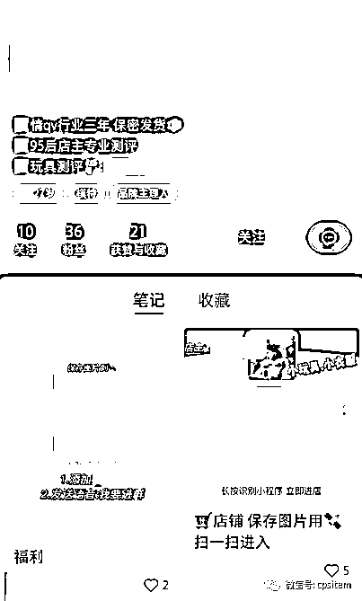

# 小红书上的女性成人用品生意

> 原文：[`www.yuque.com/for_lazy/thfiu8/afuhgdaxo8wwd6gq`](https://www.yuque.com/for_lazy/thfiu8/afuhgdaxo8wwd6gq)

<ne-h2 id="fff8aeaa" data-lake-id="fff8aeaa"><ne-heading-ext><ne-heading-anchor></ne-heading-anchor><ne-heading-fold></ne-heading-fold></ne-heading-ext><ne-heading-content><ne-text id="u4c20582c">(35 赞)小红书上的女性成人用品生意</ne-text></ne-heading-content></ne-h2> <ne-p id="ub487aeb8" data-lake-id="ub487aeb8"><ne-text id="u486d25e5">作者： 小马哥 xy50</ne-text></ne-p> <ne-p id="ud620a850" data-lake-id="ud620a850"><ne-text id="u820abce8">日期：2023-07-12</ne-text></ne-p> <ne-p id="u6f685513" data-lake-id="u6f685513"><ne-text id="uaddb1710">今年小红书类的项目比较火，各类的无货源的项目充斥在朋友圈，发布内容基本便是学员的订单与收入情况。</ne-text></ne-p> <ne-p id="uc2c46e71" data-lake-id="uc2c46e71"><ne-text id="u940357c6">与此同时带火了小红书无货源的内衣内裤、qq 内衣内裤的生意，一到晚上打开小红书，基本上刷几条就有一个直播。赚不赚钱不知道，但的确刷到的挺多的。</ne-text></ne-p> <ne-p id="u7f846bc8" data-lake-id="u7f846bc8"><ne-card data-card-name="image" data-card-type="inline" id="ZvZ2W" data-event-boundary="card"></ne-card></ne-p> <ne-p id="u64d7a541" data-lake-id="u64d7a541"><ne-text id="u289ae53e">前几天发现小红书上的 qq 用品（女性成人用品）一些玩家借助简单粗暴的来进行操作。以往 qq 用品（女性成人用品）受制于产品本身的问题，所以大规模的投放是很隐秘的，之前都是在公众号进行投放，慢慢过度到微博上找各种 kol 进行投放，这两年才可以看到一些品牌做一些品牌类的投放，比如杜蕾斯冈本这类的避孕套品牌投放的开屏啊，信息流广告，会偶尔在朋友圈刷到这类的广告，开屏刷到的便是大人糖的一次营销活动，其他的的确便比较少了</ne-text></ne-p> <ne-p id="ue061ad0a" data-lake-id="ue061ad0a"><ne-text id="u94748b94">而目前 qq 用品（女性成人用品）的个人玩家玩法在小红书上堪称简单粗暴，以往都要藏着掖着，现在直接大大方方的用视频或者图片展现出来</ne-text></ne-p> <ne-p id="u857afd15" data-lake-id="u857afd15"><ne-card data-card-name="image" data-card-type="inline" id="V0Fr7" data-event-boundary="card"></ne-card></ne-p> <ne-p id="u6abb1515" data-lake-id="u6abb1515"><ne-text id="u5e4be1a9">笔记内容就是针对产品的描述，一张图片或者一小段视频直接展现产品。</ne-text></ne-p> <ne-p id="u6e97f400" data-lake-id="u6e97f400"><ne-text id="u49948ebc">然后借助群名称、群、简介、收藏来进行引流。我把整体的过程展示一遍。如果你不会在小红书引流，看完你就会了，而且他们会很详细的展示至每一个可以呈现出来的细节中。如果你刷抖音，偶尔也会刷到这类的，他们的引流细节值得我们学习。</ne-text></ne-p> <ne-p id="uc128de39" data-lake-id="uc128de39"><ne-card data-card-name="image" data-card-type="inline" id="sgtSJ" data-event-boundary="card"></ne-card></ne-p> <ne-p id="u42928bad" data-lake-id="u42928bad"><ne-text id="ubb5ad08a">群聊+评论@小号置顶评论</ne-text></ne-p> <ne-p id="u2b1d5485" data-lake-id="u2b1d5485"><ne-card data-card-name="image" data-card-type="inline" id="WWGG3" data-event-boundary="card"></ne-card></ne-p> <ne-p id="u83879ffe" data-lake-id="u83879ffe"><ne-text id="u482cdfe9">群简介，介绍身份，@购买入口，引流微信或者其他地方</ne-text></ne-p> <ne-p id="ub178df94" data-lake-id="ub178df94"><ne-card data-card-name="image" data-card-type="inline" id="jjpEn" data-event-boundary="card"></ne-card></ne-p> <ne-p id="u2cb7b1dd" data-lake-id="u2cb7b1dd"><ne-text id="u3bcbe4bf">除了在简介引流、评论区引流外，瞬间、群聊、小号笔记引流更直接</ne-text></ne-p> <ne-p id="uc18217a5" data-lake-id="uc18217a5"><ne-card data-card-name="image" data-card-type="inline" id="mmpdY" data-event-boundary="card"></ne-card></ne-p> <ne-p id="u87165395" data-lake-id="u87165395"><ne-card data-card-name="image" data-card-type="inline" id="nOI7H" data-event-boundary="card"></ne-card></ne-p> <ne-p id="u3753702e" data-lake-id="u3753702e"><ne-card data-card-name="image" data-card-type="inline" id="Hao0E" data-event-boundary="card"></ne-card></ne-p> <ne-p id="u34468e91" data-lake-id="u34468e91"><ne-text id="u2b55b68d">直接微信二维码+快团团链接</ne-text></ne-p> <ne-p id="uc4afacda" data-lake-id="uc4afacda"><ne-card data-card-name="image" data-card-type="inline" id="DCG1U" data-event-boundary="card"></ne-card></ne-p> <ne-p id="ue9b292a7" data-lake-id="ue9b292a7"><ne-card data-card-name="image" data-card-type="inline" id="RuCdP" data-event-boundary="card"></ne-card></ne-p> <ne-p id="uec8ad4ca" data-lake-id="uec8ad4ca"><ne-text id="u88afff96">微信+微店</ne-text></ne-p> <ne-p id="u13282dbc" data-lake-id="u13282dbc"><ne-text id="ue3377d68">总之传统的引流玩法在 qq 用品（女性成人用品）方面更简单直接，群聊同时会伴随着群内的内容存在封群的情况，至于对应的账号是否会封不得而知。</ne-text></ne-p> <ne-p id="ub48128a9" data-lake-id="ub48128a9"><ne-text id="u2af50a1a">基本引流方式是大小号来进行配合，借助小红书的瞬间、评论区、简介、笔记、群名称、群聊来进行引流。</ne-text></ne-p> <ne-p id="u42d3f8d7" data-lake-id="u42d3f8d7"><ne-text id="u2bc41a9c">变现方面会呈现两种方式，一种是加盟代理，另外一种便是进行购买下单。</ne-text></ne-p> <ne-p id="udcedc679" data-lake-id="udcedc679"><ne-text id="u096d0eac">情趣内衣为什么会伴随着小红书无货源的玩法大盛行，其中最核心的点在于内衣不需要营业执照，个人就可以开店，而情趣用品则是在其玩法的衍生下诞生的。</ne-text></ne-p> <ne-p id="u7509db40" data-lake-id="u7509db40"><ne-text id="ua7030789">以往基本没有这么简单粗暴的引流方式，现在在这个行业发扬光大，一方面为什么需要引流，是因为这个品类需要对应的营业执照，大多数人操作其实并没有的所以只能进行引流，另外一方面这个产品需要私密，更适合在微信上沟通下单。</ne-text></ne-p> <ne-p id="ufba4c018" data-lake-id="ufba4c018"><ne-text id="u5a00bc25">至于加盟这个我看了下他们小程序的品，其实并不怎么好，其实 qq 用品（女性成人用品）说到底还是需要最终回归到产品上，产品不怎么样，再拉更多的代理都销售不出去，因为这个产品是实实在在的，抛去那一层属性后，就是一个电子产品，那么这个产品的外观怎么样，用户体验怎么样，利润空间如何，售后如何等等每一个细节都是需要考虑的。</ne-text></ne-p> <ne-p id="ud44e74db" data-lake-id="ud44e74db"><ne-text id="ud03053ee">这只不过是披着一层常规需求下的理性的生意，如同其他电商业务一样，需要去考虑前端引流，如何吸引精准的用户，如何经营私域用户，如何提升转化，如何选一个优质的品。始终围绕的便是引流、变现、产品。而上面提到的快团团、微店还是微信群其中各自玩法中小小支付工具的差异点。同时也需要考虑投入产出比。</ne-text></ne-p> <ne-p id="u194b607d" data-lake-id="u194b607d"><ne-text id="u146ac0c6">也许前端流量好引，但后端的转化留存便是更多的考验。</ne-text></ne-p> <ne-hole id="uecd7d470" data-lake-id="uecd7d470"><ne-card data-card-name="hr" data-card-type="block" id="UmzrX" data-event-boundary="card"><ne-p id="ubf61334a" data-lake-id="ubf61334a"><ne-text id="ua8ea2fa1">评论区：</ne-text></ne-p> <ne-p id="ue6d80275" data-lake-id="ue6d80275"><ne-text id="u2b569c9e">刘小银 : 学习了</ne-text></ne-p> <ne-p id="u06fa7ca7" data-lake-id="u06fa7ca7"><ne-card data-card-name="image" data-card-type="inline" id="HxWQf" data-event-boundary="card"></ne-card></ne-p> <ne-hole id="u3dbbde9a" data-lake-id="u3dbbde9a"><ne-card data-card-name="hr" data-card-type="block" id="D37wq" data-event-boundary="card"></ne-card></ne-hole></ne-card></ne-hole>