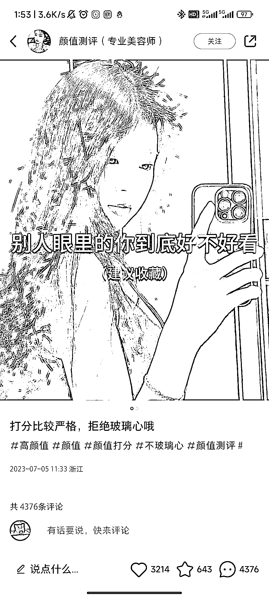
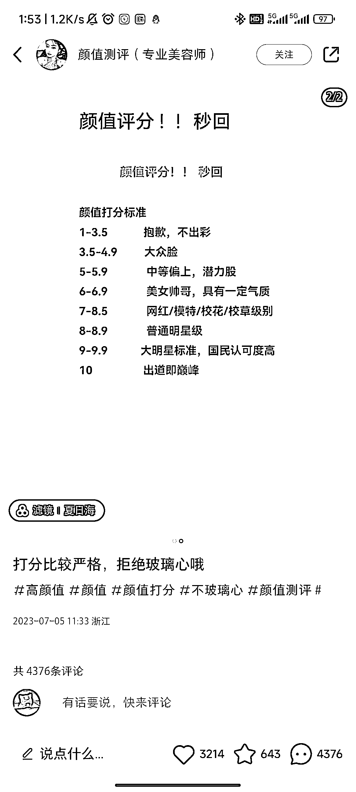

# 小红书颜值测评变现保姆级教程

> 原文：[`www.yuque.com/for_lazy/thfiu8/eri569vybe3g5z7r`](https://www.yuque.com/for_lazy/thfiu8/eri569vybe3g5z7r)

<ne-h2 id="34dbbf19" data-lake-id="34dbbf19"><ne-heading-ext><ne-heading-anchor></ne-heading-anchor><ne-heading-fold></ne-heading-fold></ne-heading-ext><ne-heading-content><ne-text id="u4284d42f">(26 赞)小红书颜值测评变现保姆级教程</ne-text></ne-heading-content></ne-h2> <ne-p id="u6a22a61d" data-lake-id="u6a22a61d"><ne-text id="ua9e42792">作者： 书豪</ne-text></ne-p> <ne-p id="ufbd761fe" data-lake-id="ufbd761fe"><ne-text id="u8d555fe6">日期：2023-07-10</ne-text></ne-p> <ne-p id="u51e76505" data-lake-id="u51e76505"><ne-text id="ucfaef279">各位朋友好，我是在杭州的圈友书豪，一个连续创业四年的 95 后，目前连续四年都年入百万。</ne-text></ne-p> <ne-p id="u1809336a" data-lake-id="u1809336a"><ne-text id="u16ad2796">今天分享一个通过在小红书上做颜值测评引流私域去变现的玩法。</ne-text></ne-p> <ne-p id="ud7cd407a" data-lake-id="ud7cd407a"><ne-text id="u60cac63f">直接上案例：</ne-text></ne-p> <ne-p id="uf8b169e2" data-lake-id="uf8b169e2"><ne-card data-card-name="image" data-card-type="inline" id="lOvOb" data-event-boundary="card"></ne-card><ne-card data-card-name="image" data-card-type="inline" id="zQuth" data-event-boundary="card"></ne-card><ne-card data-card-name="image" data-card-type="inline" id="aLOJ4" data-event-boundary="card"></ne-card></ne-p> <ne-p id="u35667f47" data-lake-id="u35667f47"><ne-text id="u42158213">方法就是做一个化妆师/美容师的人设，通过做颜值测评，免费给网友的颜值打分，如果网友想要更为具体的颜值分析和穿搭风格建议，那就引流微信去付费咨询。</ne-text></ne-p> <ne-h3 id="5c79442c" data-lake-id="5c79442c"><ne-heading-ext><ne-heading-anchor></ne-heading-anchor><ne-heading-fold></ne-heading-fold></ne-heading-ext><ne-heading-content><ne-text id="u7d097304" ne-bold="true">本质是利用容貌焦虑</ne-text></ne-heading-content></ne-h3> <ne-h2 id="c8bd5988" data-lake-id="c8bd5988"><ne-heading-ext><ne-heading-anchor></ne-heading-anchor><ne-heading-fold></ne-heading-fold></ne-heading-ext><ne-heading-content><ne-text id="uea6b77b4">小红薯设置</ne-text></ne-heading-content></ne-h2> <ne-p id="uc088d133" data-lake-id="uc088d133"><ne-text id="u299faf28">名称：颜值测评/颜值打分/颜值分析/颜值评分，后面可再加（专业美容师/化妆师）</ne-text></ne-p> <ne-p id="ude0a061b" data-lake-id="ude0a061b"><ne-text id="u05dc4d58">介绍：专业美容师/化妆师</ne-text></ne-p> <ne-p id="ud46709fb" data-lake-id="ud46709fb"><ne-text id="u9b2bcf1d">颜值打分，敢说大实话，提升建议</ne-text></ne-p> <ne-p id="uaa7cf62b" data-lake-id="uaa7cf62b"><ne-text id="u9443b96d">分析包括：穿搭化妆发型</ne-text></ne-p> <ne-p id="u808df162" data-lake-id="u808df162"><ne-text id="u1ec01dea">点赞+关注 可优先打分</ne-text></ne-p> <ne-p id="ude8a5958" data-lake-id="ude8a5958"><ne-text id="u085fa84b">建议加文评直接后抬我</ne-text></ne-p> <ne-p id="u28af399b" data-lake-id="u28af399b"><ne-text id="ufb7211f5">性别设置女</ne-text></ne-p> <ne-p id="u572ebd5d" data-lake-id="u572ebd5d"><ne-text id="uddaa8841">年龄设置满 18 周以上，职业选择美容师和化妆师</ne-text></ne-p> <ne-h1 id="b40a6eea" data-lake-id="b40a6eea"><ne-heading-ext><ne-heading-anchor></ne-heading-anchor><ne-heading-fold></ne-heading-fold></ne-heading-ext><ne-heading-content><ne-text id="u7fe88cc2">怎么做图</ne-text></ne-heading-content></ne-h1> <ne-p id="uc67c0c0e" data-lake-id="uc67c0c0e"><ne-text id="uec40ab02" ne-bold="true">其实这种类型很简单，首页拿一张美女的图当底图，然后加点会引起容貌焦虑的文字当作图中标题</ne-text></ne-p> <ne-p id="u121dca05" data-lake-id="u121dca05"><ne-text id="u50e21cde">比如“别人眼里的你到底好不好看”“如何认清自己的真实长相””玻璃心别来，陌生人颜值打分，“等，就可以当作封面了</ne-text></ne-p> <ne-p id="u20aaccba" data-lake-id="u20aaccba"><ne-text id="u195ae168">内容图就可以直接用手机的备忘录去做，这种图容易爆，看几个案例：</ne-text></ne-p> <ne-p id="uebc9fe88" data-lake-id="uebc9fe88"><ne-card data-card-name="image" data-card-type="inline" id="tfG0p" data-event-boundary="card"></ne-card><ne-card data-card-name="image" data-card-type="inline" id="FzrZ1" data-event-boundary="card"></ne-card><ne-card data-card-name="image" data-card-type="inline" id="VYlty" data-event-boundary="card"></ne-card></ne-p> <ne-p id="uab94058c" data-lake-id="uab94058c"><ne-card data-card-name="image" data-card-type="inline" id="w2r1k" data-event-boundary="card"></ne-card><ne-card data-card-name="image" data-card-type="inline" id="ku95C" data-event-boundary="card"></ne-card></ne-p> <ne-p id="u11fe06be" data-lake-id="u11fe06be"><ne-text id="u1401fda2">几点建议：</ne-text></ne-p> <ne-p id="u1fe0207f" data-lake-id="u1fe0207f"><ne-text id="uab4c1d16">1、文案不会写可以借助同行的爆款文案，但最关键的还是模板，回答的模板最好是自己原创，里面的内容可以借鉴同行，这样的流量高。</ne-text></ne-p> <ne-p id="u9d42b643" data-lake-id="u9d42b643"><ne-text id="u7734d0b5">2、去模仿做上述内容的图就可以了，要是流量不好就去换图，笔记标题就用颜值打分＋提升建议，来给你的颜值打分等等，首图文字就用能引起容貌焦虑，诱导用户点击的文字就行，可以去参考同类别的账号。</ne-text></ne-p> <ne-p id="ue329e782" data-lake-id="ue329e782"><ne-text id="u5b5dff2f">3、话题一般都是#颜值 #颜值打分 #神仙颜值 #颜值测评 #颜值分享 等等。</ne-text></ne-p> <ne-p id="u0873012a" data-lake-id="u0873012a"><ne-text id="u2160456a">4、需要打造一个人设朋友圈，每天都要发一下客户的评价，可以是夸赞的，可以是批评但是你会一直努力完善的，无所谓是啥内容，但一定是相关的，要么能秀肌肉要么积极向上的，去证明你自己一直在做，而且很专业，值得信赖。</ne-text></ne-p> <ne-p id="ub6304a89" data-lake-id="ub6304a89"><ne-text id="u212f909b">5、如果笔记有流量，但是没人评论的话，找几个小号自己内部评论，去让用户看到有评论从而去点击评论区，提高用户的评论区互动量。</ne-text></ne-p> <ne-p id="u765fc99a" data-lake-id="u765fc99a"><ne-text id="u83658577">6、用户没有反馈，或者自己不会 P 图的，自己就去同行那边搬运，拿小号模仿着发，造成每天都有人咨询的假象，总之一定要包装好朋友圈。</ne-text></ne-p> <ne-h2 id="9039450f" data-lake-id="9039450f"><ne-heading-ext><ne-heading-anchor></ne-heading-anchor><ne-heading-fold></ne-heading-fold></ne-heading-ext> <ne-heading-content></ne-heading-content></ne-h2> <ne-h2 id="cc345501" data-lake-id="cc345501"><ne-heading-ext><ne-heading-anchor></ne-heading-anchor><ne-heading-fold></ne-heading-fold></ne-heading-ext><ne-heading-content><ne-text id="u5a8b5b0e" style="color: rgb(236, 40, 52);">文评文案</ne-text></ne-heading-content></ne-h2> <ne-p id="ua79740fa" data-lake-id="ua79740fa"><ne-text id="u513adec4" ne-bold="true">以下内容是从同行那边拔下来的内容，如果有侵权，可联系删除。</ne-text></ne-p> <ne-p id="u36536258" data-lake-id="u36536258"><ne-text id="ud1e9420a">1、综合评分 x.x 小哥哥属于帅哥级别的颜值类型，脸型轮廓清晰，给人感觉比较斯文的类型，眉形完整浓密，眼睛属于双，褶皱窄，瞳孔黑亮，鼻梁山根高度适中，鼻翼两侧偏宽，中庭距离长。上唇厚度适中，下唇适中，唇峰比较明显，线条感弯曲优质唇色偏淡了一些。脸上无明显的瑕疵，从照片上看，眼睛走向呈平行，瞳孔黑亮恰当眼神带点朦胧色彩，眼间距微宽，眉毛浓密度较浓，条走势较平。，五官比较柔和，皮肤状态不错，就是稍微有点豆印，发型的话当前发型就很适合，有点偏韩系的感觉，比较适合休闲风，学院风，或者韩系风格，日常也可以走简约风，还有偏运动风格也不错的哦</ne-text></ne-p> <ne-p id="ub5c456f9" data-lake-id="ub5c456f9"><ne-text id="uff1af8fb">2、综合评分 x.x 分。小姐姐很漂亮的哦,属于那种清纯的长相，脸型偏椭圆脸，面部线条还算流畅，三庭比例适中，整体属于淡颜系，您的面部线条及轮廓流畅，眉毛颜色浓度适中，眉间距较远，眉形眉尾偏下，左右眉型线条基本对称，眉型略浅，自然稍微有点弧线有错落感，眼睑、眼白比例恰当。</ne-text></ne-p> <ne-p id="u6b9db2ef" data-lake-id="u6b9db2ef"><ne-text id="ub6187efa">额头适中,下巴比较尖，皮肤状态很好，白皙,眼睛属平扇行,又大又圆，眼型娇美，眼神明亮灵动,化妆了着重眼睛部份。鼻梁山根挺拔，鼻头坚挺,鼻头稍微尖。唇形自然，上下嘴唇厚度适中,人中距离适中，日常涂一些淡色的口红就很 OK 了，五官比例及五官立体感不错，整体面容适配度 ok，第一眼看去属于比较甜美温柔的邻家姐姐感觉，休闲运动风，慵懒风，日系宽松裙子这些都可以驾驭喔。发型方面，我们觉得头发。一侧留点长刘海的话会显得更加精致有气质喔，你超级好看的哦"</ne-text></ne-p> <ne-p id="uf95d01b3" data-lake-id="uf95d01b3"><ne-text id="ue1a4676f">3、综合 x.x 小哥哥长相硬汉风格属于日常生活中帅哥级别颜值呢，五官结构看起来较为立体，面部轮廓分明。鼻翼较宽，鼻头圆润有肉感，在整个面部五官占中适中，整个面部立体感不错。整体皮肤状态不算很好，但是也没有很大问题，有一丝暗沉，注意日常脸部清洁需要做到位，整体与面容的适配度不错。第一眼看去属干比较稳重阳光的感觉，小哥哥沉稳干练，城市潮牌休闲风，日系工装街头风那些就挺合适，发型方面，我们觉得目前的发型就很合适有一种兵哥哥的即视感，显得有精神有魅力。正面看偏椭圆形脸多点，额头在五官占比适中，上唇厚度适中，下唇偏厚，唇峰比较明显，线条感弯曲优质唇色偏淡了一些。脸上无明显的瑕疵，从照片上看，眼睛走向呈平行，瞳孔黑亮恰当眼神带点朦胧色彩，眼间距适中，眉毛浓密度适中线条走势也不错。</ne-text></ne-p> <ne-p id="u85cd66d9" data-lake-id="u85cd66d9"><ne-text id="u5fc49800">4、综合分数是 x.x 分，小姐姐的颜值属于中上等级别，从面部分析来看，面部是标准中式窄面，偏向于秀气瓜子脸，下颌小巧精致。眉形太呆板僵硬，棱角过于清晰僵硬，显凶显愁。面部尖线条比较多，内眼角明显，鼻子高挺秀直皇尖锐感较强，锋利感+冷感比较强。颌面标准，无凸嘴情况存在改造思路:不适合太现代太网感的妆容，太抹杀个人特质，眉毛修细修淡，弱化眉毛边缘，画柳叶弯眉，更温柔更具古典气质。口红不要涂太艳，容易风尘，裸色，淡粉色风格路线:中式清冷风!!!</ne-text></ne-p> <ne-p id="u9aae69b6" data-lake-id="u9aae69b6"><ne-text id="uf2251493">5、综合评分 x.x 分，小姐姐属于网红美女偏清纯风的长相，皮肤状态非常好，属于淡颜系。眉距适中，鼻子比较属于标准，人中距离适中，嘴唇属于标准，唇峰比较明显。下颚线条圆滑无顿挫感同时线条分明视觉上有冲击力。肤色自然白皙，皮肤状态 ok，无明显暗沉、基本无瑕疵肤若凝脂，日常需要做好脸部清洁即可。五官比例及五官立体感不错，整体面容适配度 ok，第一眼看去属于比较温婉清冷的邻家大姐姐感觉，总体来说算是中等偏上的美女级别了，目前风格也很适合，建议可以走纯欲风格或者甜酷风格哦。</ne-text></ne-p> <ne-p id="u0f90c5e8" data-lake-id="u0f90c5e8"><ne-text id="uaa9ef35d">发现没有，其实这些回复案例中都是有模板的，先给出等级属性，然后讲皮肤保养，讲五官样式，讲肤色状态，讲适合妆造，讲适合路线。配上一些比较专业但是完全可以去学习掌握的词汇，中式窄面、唇峰、人中、眉距、下颌、鼻翼、鼻头等等，说白了就是拆解五官，拆得越细越给人专业的感觉。又因为虽然每个中国人都长不一样，但特征也就那么些个特征，把专业名词套一套就八九不离十了。一通分析完后，最后再赞美一下，通过什么风格就能找到更好的自己。红脸白脸一起唱，基本上就可以了。</ne-text></ne-p> <ne-h2 id="7ebb8924" data-lake-id="7ebb8924"><ne-heading-ext><ne-heading-anchor></ne-heading-anchor><ne-heading-fold></ne-heading-fold></ne-heading-ext><ne-heading-content><ne-text id="u9e4e5989" ne-bold="true">引流到微信成交步骤</ne-text></ne-heading-content></ne-h2> <ne-p id="u8874621e" data-lake-id="u8874621e"><ne-text id="u9b168af2">刷多了同行的账号，你就会发现，其实这个项目大约分为两个</ne-text></ne-p> <ne-p id="ueb4da656" data-lake-id="ueb4da656"><ne-text id="u859bfbb1">第一种就是对自己颜值有自信，也就是符合大部分人审美的，想让别人继续夸夸他。</ne-text></ne-p> <ne-p id="ua82f88ec" data-lake-id="ua82f88ec"><ne-text id="ued5dcd5e">第二种是长相一般的，他们对自己的颜值有点焦虑，想让你帮他指导一下。</ne-text></ne-p> <ne-p id="uea6785c6" data-lake-id="uea6785c6"><ne-text id="u1481f4fe">1、有用户直接在评论区发图，就先回打的分数，然后再加上“具体详情丝”之类引导私信的话术，注意，一定要用后抬，丝我等等这种谐音字，不然会被判定违规</ne-text></ne-p> <ne-p id="ue1374959" data-lake-id="ue1374959"><ne-text id="ua1b6a652">2、有客户私信你，你就回复：集美（帅哥）你好，作为一名专业化妆师/美容师，我的打分比较严格哦，不会奉承而乱吹彩虹屁的，能接受的请发三五张原相机原图照片给我，打分完全免费哦，一定是没有美颜过的，不然没有意义！</ne-text></ne-p> <ne-p id="u11454e99" data-lake-id="u11454e99"><ne-text id="uf86af121">3、打完分之后就引导他，“是否需要具体分析”，如果需要的话，就引导他加微信</ne-text></ne-p> <ne-p id="u6867e248" data-lake-id="u6867e248"><ne-text id="u6cb1b2ce">4、发送微信号是个技术活，不然极其容易违规限流。如果你的微信号有数字，可以将数字用汉字代替；在微信号码中加上“（河蟹）”标识；将微信号藏在图片里，让用户通过图片提供的微信号去加好友；小红书置顶笔记中有微信号码，然后在评论区引导用户进首页看置顶笔记去添加微信；让用户留微信，自己去加用户等等。这些方法不能一直用，需要三五天就换一种引流方式，比较保险，不然很容易被查。</ne-text></ne-p> <ne-p id="ua73585a5" data-lake-id="ua73585a5"><ne-text id="u893885f6">5、如果消息多的情况下，可以直接评完分，就把引流图片抛出去。如果消息比较少的话，就做精细化一对一的服务，多引导，比如打完分后可以说，“小姐姐、小哥哥五官很精致需要建议和文评吗”，这个时候用户大概率会说要，这个时候你就让他留 V 你加他，然后再微信引导成交。</ne-text></ne-p> <ne-p id="u92f94813" data-lake-id="u92f94813"><ne-text id="uefc5160a">6、评分的话一般都 5 分以上吧，这个多少跟情商有点关系，人都是喜欢听好话的，忠言虽然是好的，但是它逆耳啊，但我们要做的是让用户胆战心惊花钱，满脸笑意离开，所以多多少少的还是以客户满意度为准，当然，评分免费，分析和建议就要收费了，天下没有免费的午餐。</ne-text></ne-p> <ne-p id="u597b0359" data-lake-id="u597b0359"><ne-text id="ua6a6519e">7、用户引到微信后，可以去看看同行是怎么引导用户付费的，以及同行是怎么打造朋友圈人设的。</ne-text></ne-p> <ne-p id="ua28b46fd" data-lake-id="ua28b46fd"><ne-text id="u9f119b8a">8、如果通过颜值评分引流出一个 6000 人左右的微信女粉，后期的变现维度可以长期跟进同行的变现动作。</ne-text></ne-p> <ne-p id="u84218681" data-lake-id="u84218681"><ne-text id="ue8d43182">9、建议多备几个引流微信，爆了的笔记，单个微信一天不要超过 50 个好友的添加，单天如果两三百个好友，建议粉为三四个微信去沉淀。</ne-text></ne-p> <ne-p id="ub40be777" data-lake-id="ub40be777"><ne-text id="uf185dc81">往期文章：</ne-text></ne-p> <ne-h2 id="6df2d92e" data-lake-id="6df2d92e"><ne-heading-ext><ne-heading-anchor></ne-heading-anchor><ne-heading-fold></ne-heading-fold></ne-heading-ext><ne-heading-content>[<ne-text id="u6c9ff514" ne-underline="true">人生的第一个 100 万，我是怎么赚到的？！</ne-text>](https://articles.zsxq.com/id_kek27cqo56wf.html)</ne-heading-content></ne-h2> <ne-h2 id="f0708e79" data-lake-id="f0708e79"><ne-heading-ext><ne-heading-anchor></ne-heading-anchor><ne-heading-fold></ne-heading-fold></ne-heading-ext><ne-heading-content>[<ne-text id="u2caca7f7" ne-underline="true">小红书单店铺单月 6000+利润选品保姆级教程</ne-text>](https://articles.zsxq.com/id_xwveu3e0usfv.html)</ne-heading-content></ne-h2> <ne-h2 id="877bffbd" data-lake-id="877bffbd"><ne-heading-ext><ne-heading-anchor></ne-heading-anchor><ne-heading-fold></ne-heading-fold></ne-heading-ext><ne-heading-content>[<ne-text id="ufded4780" ne-underline="true">小红书无货源电商，单品 4w+利润，我做了什么？</ne-text>](https://articles.zsxq.com/id_8o3ptacdp6mj.html)</ne-heading-content></ne-h2> <ne-h2 id="b23d2e96" data-lake-id="b23d2e96"><ne-heading-ext><ne-heading-anchor></ne-heading-anchor><ne-heading-fold></ne-heading-fold></ne-heading-ext><ne-heading-content>[<ne-text id="ub8870aa9" ne-underline="true">抖音直播间月消耗过百万的千川投流经验分享</ne-text>](https://articles.zsxq.com/id_d3zembkeh2cw.html)</ne-heading-content></ne-h2> <ne-h2 id="4cd87268" data-lake-id="4cd87268"><ne-heading-ext><ne-heading-anchor></ne-heading-anchor><ne-heading-fold></ne-heading-fold></ne-heading-ext><ne-heading-content>[<ne-text id="u1232e2bd" ne-underline="true">2023 小红书幼教考编保姆级教程</ne-text>](https://articles.zsxq.com/id_cpdec6j4xtho.html)</ne-heading-content></ne-h2> <ne-p id="ue5ec1571" data-lake-id="ue5ec1571">[<ne-text id="u802dbd15" ne-bold="true" ne-underline="true">小红书低粉爆款案例拆解教程</ne-text>](https://articles.zsxq.com/id_0nmnwdg6mb0l.html)</ne-p> <ne-p id="u4b6cf58d" data-lake-id="u4b6cf58d">[<ne-text id="u8be88aba" ne-bold="true" ne-underline="true">小红书新人入局月入 100-1000 元保姆级教程</ne-text>](https://articles.zsxq.com/id_sbk8lqv5unca.html)</ne-p> <ne-p id="u8fc1d5ce" data-lake-id="u8fc1d5ce">[<ne-text id="u3c97afa0" ne-bold="true" ne-underline="true">抖音单品短视频带货 1000 万 GMV，我是怎么做到的？！</ne-text>](https://articles.zsxq.com/id_qoak1w7ptnwf.html)</ne-p> <ne-p id="uc8cbd3e9" data-lake-id="uc8cbd3e9">[<ne-text id="u7e33d21b" ne-bold="true" ne-underline="true">如何拆解一个小红书爆款视频</ne-text>](https://articles.zsxq.com/id_opo78sxacew9.html)</ne-p> <ne-p id="uda84babb" data-lake-id="uda84babb">[<ne-text id="u2f15bffd" ne-bold="true">小红书无货源电商做女装如何选品？</ne-text>](https://articles.zsxq.com/id_1wxixz3rofb3.html)</ne-p> <ne-hole id="u369efc4e" data-lake-id="u369efc4e"><ne-card data-card-name="hr" data-card-type="block" id="yUMWX" data-event-boundary="card"><ne-p id="uf1041154" data-lake-id="uf1041154"><ne-text id="u6eb5e473">评论区：</ne-text></ne-p> <ne-p id="u5e377fa0" data-lake-id="u5e377fa0"><ne-text id="ub9a0470d">陈真 : 大佬带我。</ne-text> <ne-text id="u91d3104f">纪玮 : 怎么变现呢</ne-text> <ne-text id="uea2ccfcb">书豪 : 引流到微信，穿搭建议，一般是 9.9</ne-text> <ne-text id="u3b55d872">书豪 : 互相学习！</ne-text> <ne-text id="uaf4ee9bc">半生瓜 : 9.9 元给穿搭建议？</ne-text> <ne-text id="ua00413a6">书豪 : 是的</ne-text></ne-p> <ne-p id="u5bfd4fb4" data-lake-id="u5bfd4fb4"><ne-card data-card-name="image" data-card-type="inline" id="aFdQj" data-event-boundary="card"></ne-card></ne-p> <ne-hole id="uf1847c5c" data-lake-id="uf1847c5c"><ne-card data-card-name="hr" data-card-type="block" id="RRMoJ" data-event-boundary="card"></ne-card></ne-hole></ne-card></ne-hole>