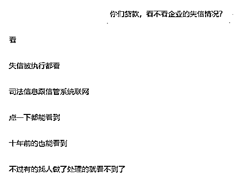
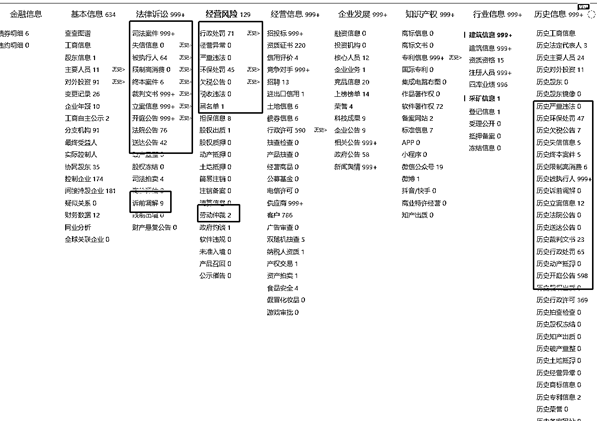
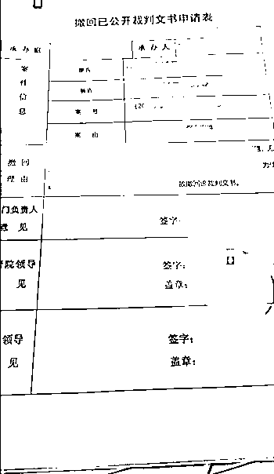
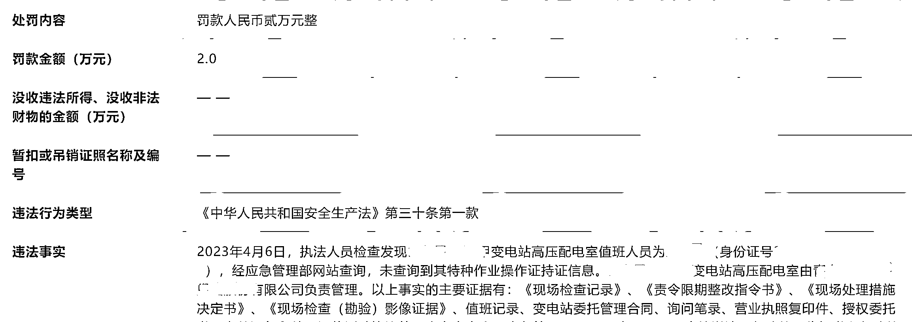
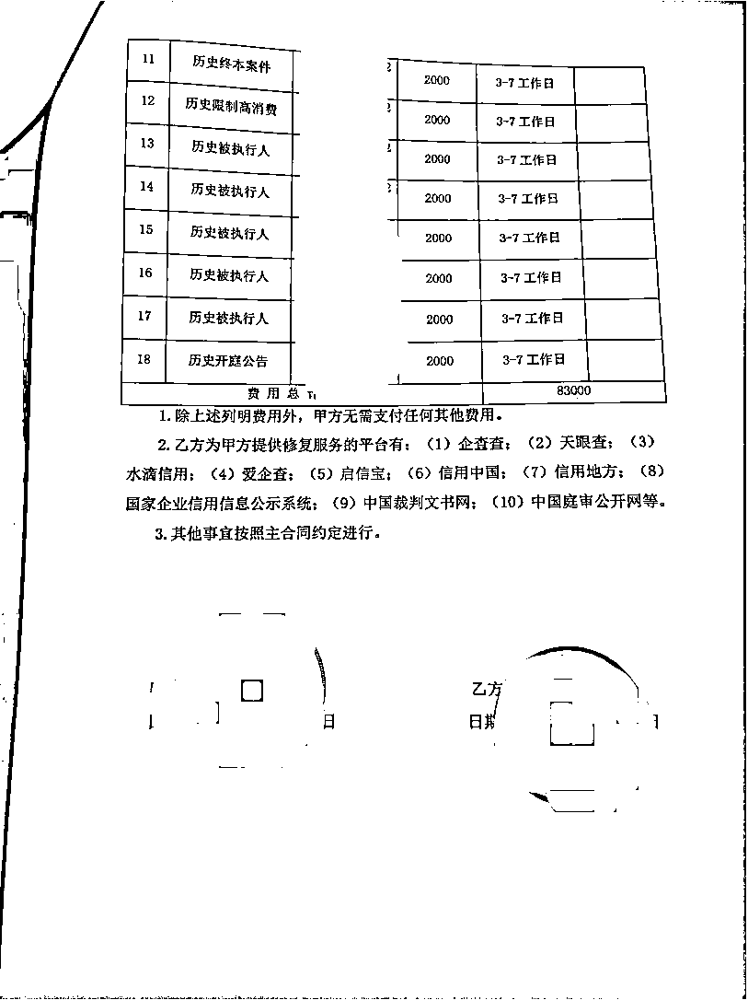
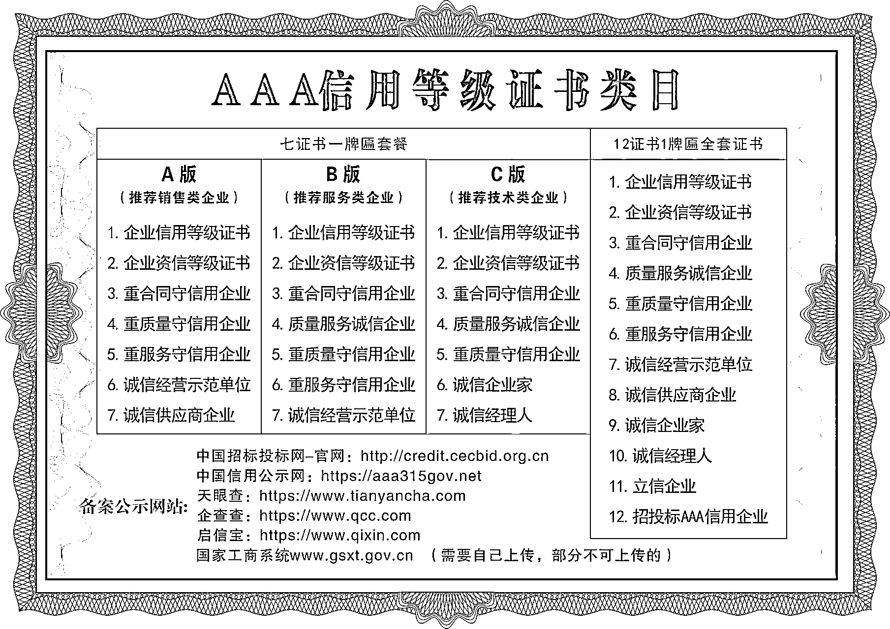

# 从风向标捡了个项目，实操一个月净利 30 多万

> 原文：[`www.yuque.com/for_lazy/thfiu8/mzvfphg0uiykplqi`](https://www.yuque.com/for_lazy/thfiu8/mzvfphg0uiykplqi)

## (精华帖)(338 赞)从风向标捡了个项目，实操一个月净利 30 多万 

作者： Summer 

日期：2023-07-14 

亦仁说风向标赚钱了记得来报道。 

今天，就和大家分享我从风向标发现一个项目，变现 80 万的过程。 

一定要重视风向标，太多宝藏了，没项目的可以在里边挖掘项目，有项目的可以在里边共鸣进步的灵感和机会。 

大家好，我是 summer，坐标青岛，生财航海家俱乐部成员，编号 0055，也是铁杆圈友。 

一个月之前，在中标 tag 刷到一个风向标 [https://t.zsxq.com/0fI8JEX1V](https://t.zsxq.com/0fI8JEX1V) 。讲企业信用管理的，主要就是做企业信用修复的，且被亦仁中标，结合我自身的 B 端客户经验，引起了我兴趣，简单查了查并迅速链接了发帖的圈友。 

遗憾的是这名圈友并不是做这个的，只是听朋友说的准备去研究。 

但是我直觉这个项目应该是适合我的，因为我以前做过几年的企业政策补贴，手里攒了大量的 B 端客户和渠道，跟企业打交道我们太熟了。 

而且有部分信用修复，我们以前本来就给企业做过，因为想拿政策补贴必须保证企业没有不良记录没有处罚，比如给企业修复信用中国的一些行政处罚等等。 

只不过我们当时是免费给企业做的，为了成功申请补贴，但是从没想过去收费，因为确实很简单，也从没想过就这个方向去进一步拓展成一个细分的项目。 

而多看风向标，一个风向标就点醒了我。 

于是我首先立马验证这个项目的市场需求，但各个搜索引擎并没有搜出来多少需要修复的需求信息，只有一些同行的小广告，考虑到 B 端市场的特殊性也可以理解。 

于是我联系了一些关系很熟的企业，调研了一圈下来基本上都有这个需求，确定了这项目并不是个伪需求。 

  

  

 

 

然后进一步自己全网去搜集了解相关信息，在抖音快手淘宝找到了一些同行，以客户名义加他们，看他们朋友圈，套他们话，摸他们工作流程。 

并带着“诚意”实地去外地拜访了两家同行。回来后我就立即拉了个小团队着手实操起来了，从刷到风向标到开始具体实操仅花了 4 天时间。 

整理出我们原先所有接触过的企业客户名单，摸排手上所有能对接得上的客户，去第三方平台查他们信用问题，查出来挨个联系挨个对接，业绩很明显，正反馈太快了。 

至今一个月，我手上的客户还没完全处理完，合同金额签了 80 多万，已到账了 30 多万（有些记录处理的周期较长），基本上都是纯利润。除了人工没什么成本。 

标题本来想写净利 80 多万的，好像有点标题党就写了我实收的。接下来具体给大家拆解下这个蓝海轻资产项目。 

## 一、项目介绍 

这里的企业信用管理项目，主要是指企业信用修复，当然也还有一些其他，如做企业信用评估，企业信用等级认证，企业 AAA 评级等。 

企业信用是企业在市场经济中的通行证，是企业与客户、供应商、金融机构等各方建立信任关系的基础。 

然而，企业在经营过程中难免会出现一些失信行为如欠款不还、合同违约、逃税等，还有一些经营的违法违规行为，这些行为将直接影响企业的信用评级和声誉。 

企业的这些不良失信记录信息具体不好的影响有很多，如影响企业的资质认定、招标投标、政府采购、政策补贴、融资贷款、商务合作、人才招聘、市场准入、客户口碑、上市评级等，这些都是企业的痛点，有痛点就会有需求。 

为了帮助企业重塑形象，提升信誉度，所以这些企业就需要信用修复服务。比如下图今年我们青岛的一个补贴政策，申请的前提就是需要没有处罚信息，去年都没有这么严。 

 

还有尤其是经常招投标的、需要融资贷款的以及做政府采购的，拿政府补贴的，会特别特别重视自身的企业信用问题。再就是被告且败诉的，也特别想删掉这些记录。 

 

根据企查查的数据，全国范围内，筛选存在风险的目标客户，经营异常的有 1000 多万家，行政处罚有 300 多万家，环保处罚有 30 多万家，裁判文书有 500 多万家，有失信信息的有 50 多万家，限制高消费 100 多万家，被执行人的有 40 多万家。 

而且这个数据是动态变化的，每天都会有新的变化，做完修复的消失，新产生不良失信记录的增加。 

所以这个项目是可持续的能长期做的，能产生复购的，你这次给他完美交付，下次他碰到问题还会找你。 

 

2022 年 9 月 30 日国家发布了一个职业，叫信用管理师，企业和消费者信用风险管理工作的专业人员。 

我目前已经安排了两个老师联系机构准备去报考了，说是 9 月份考试，目前没发现具体有什么用，不过后边可以宣传持证上岗，给自己做信任背书。 

也就是从去年开始，国家比较重视企业信用的问题，国家下发了一系列红头文件，加强信用体系建设，推进信用监管机制，明确规定了信用修复机制。 

今年年初出的一个政策《失信行为纠正后的信用信息修复管理办法（试行）》，2023 年 5 月 1 日开始实行的，大家可以去看看这个政策，官方指导了企业信用修复这项工作。我们的一些操作也都是围绕着这个政策展开的。 

 

大家去搜搜相干企业信用的官方报道就知道了。 

这个行业基本上大多也就是从去年开始的，被开发成一个项目的，目前做的人还不是很多，还没到太卷的时候，所以各大平台搜这个业务出来的信息就太少了，翻来覆去就那几个地域的 ip，账号做的也比较烂。 

符合蓝海项目的要求。 

## 二、修复类别 

企业产生的不良信息记录的种类有很多，公示的平台也有很多，有官方的有第三方平台的，一般给客户处理时会给他全网一起下架。下图红框内的不良记录都可以修复下架清零。 

 

不良信息记录主要有行政处罚记录、环保处罚记录、裁判文书、其他诉讼记录、经营异常、失信惩戒、欠税公告等等。百分之八十的单子都是行政处罚、环保处罚和裁判文书这三类。 

我们去修复的平台有： 

官方平台：信用中国、国家企业信用信息公示系统、中国裁判文书网、庭审公开网、行政处罚文书网、执行信息公开网等。 

第三方平台：爱企查、企查查、天眼查、启信宝、水滴信用、企知道等。 

 

 

## 三、如何修复 

修复分为修复官方平台和第三方平台，我们先来说第三方平台，给大家看两个平台的截图： 

 

 

懂我意思吧，这些第三方平台处理非常简单，所有的三方平台的数据都是采集的几个官方平台同步更新的，你把数据来源撤销掉了，所有第三方平台自然会更新掉，没有及时更新撤销掉的可以自行数据纠错提交证明材料就行，或者找客服也行。 

所以这个项目操作的核心在几个官方平台的修复。 

外边一些同行把第三方平台拿出来说消除，主要是因为大多企业主熟悉这几个平台，对官方的几个平台反而很多不知道的，降低沟通成本，他们的需求很多也都只是处理掉企查查天眼查的风险信息，反正接单都是全网做撤销。 

下面来说几个主要的修复类别，行政处罚、环保处罚和裁判文书，数量占了市场 80%以上。 

（1）行政处罚 

行政处罚的原因多种多样，处罚单位也是各个主管部门。我们修复的前提一般都是处罚已经到了公示期且企业已经履行处罚的才可以修复。主要在信用中国和全国企业信用信息公示系统修复。 

信用中国修复很简单，主管单位是发改委，可以全程线上操作，提交材料。 

 

跟着操作提示走，需要提交材料。（里边有详细步骤） 

全国企业信用信息公示系统是市场监督管理局主管的，修复稍微麻烦一点，大多地方不能在线上处理，需要联系当地市场监督管理局申请，然后提交纸质材料，等他们审核，有些地方甚至会上门收纸质材料和现场核验。 

 

 

行政处罚大部分单子就是修复这两个平台就可以了。 

有人问公示期内的单子可不可以修复？ 

可以，但是不是一般人能做的，这种单子一般收费很高，正常都在 20w 以上，需要企业当地的一些资源，走特殊原因申请提前撤回公示。 

这种特高价的单子只能是碰了，客户有需求不一定能做，能做的地方不一定有客户需求。我们也联合了一些同行现在部分城市的部分单子可以做，同行可以相互甩单。 

（2）环保处罚 

同上，跟行政处罚修复差不多。 

（3）裁判文书 

所有修复类别里，裁判文书的修复是最麻烦的，周期也是最长的，一般都得 20 天到一个月左右，也是我很多尾款卡着还没收回来的原因，其他的修复一般 7 个工作日就解决了，有些甚至 2，3 天。 

因为裁判文书的每一单都需要联系法院，跟法官沟通去撤销，法官认可了你的修复理由会让你提交申请材料，然后他往上一级级申请，基层法院到中院，最后提交到省高院，省高院的技术部门才有权限撤销。 

所以这里的最重要的一点就是跟法官沟通你的撤销原因，一般原因都是说涉及到商业机密，个人隐私或者商业贷款批不下来公司要倒闭等原因。 

很多银行的企业贷款都会看你有没有跟金融机构产生诉讼，产生诉讼的基本上都批不了，我们成功操作的第一单裁判文书就是企业跟银行的案子。 

然后撤销裁判文书，前提是一定要结案。不结案的撤销不了。 

 

## 四、如何拓客 

项目的核心还是在如何签客户，没有客户你修复的再厉害也没用，正常拓客方式有这几种。 

（1）电话营销 

这也是传统的最简单最普遍的开发客户的模式，就是转化率越来越低，很多企业主也比较抵触这种营销电话，但仍是有效的，在没有更好的方式时电销去扫客户仍是高效的手段，当你打的电话数量上去后，肯定会有一定的成功率。 

所有目标客户都可以通过第三方平台导出来，并且绝大多数都会有企业联系方式。市面上也有专业的电销公司，在自己没有销售人手的时候也可以试试跟他们合作，测试下意向客户转化率，计算投产比，能跑正就可以不停放大数量。 

（2）陌拜 

有一些特精准的客户，完全可以上门陌拜，比如一些工程行业的企业，会经常参加招投标的，这类企业他们必须要保证自身没有不良记录影响企业信用问题。 

（3）线上获客 

短视频平台批量运营账号，坐等目标客户，关于线上获客这里的大佬太多了，我就不班门弄斧了，去看看航海那些手册照着操作就行了。 

目前搜了各个平台，账号都做得不行。圈友过去就是降维打击。 

（4）渠道代理 

很多行业手上都有不少企业客户群体，最常见的就是代理记账公司，银行信贷，律所，园区等。 

所以也可以换个角度，去直接商务目标企业客户有时候不如去攻略这些渠道客户，让出大额分成，谈成一个渠道会成批的给你带单子。 

我们以前做企业补贴时大多数单子都是这么来的，这是最重要最值得下功夫的方式。 

（5）客户转介绍 

这块完全就是做服务口碑了。 

我们也应该去做好服务，不止为了转介绍，也为了复购，以及维护良好关系后期的进一步转化。 

## 五、利润空间 

市场很大很大，天花板很高很高。听说有每月能做几百万的大佬，低调的从来不发什么朋友圈。 

按上文提的全国范围内有几百万上千万家理论上的目标客户，你们计算客单价一般一单数千以上就知道理论上这个市场巨大无比了，能做多少而。 

毕竟很多企业主现在也没什么企业信用意识，可能没有需求去做，但是国家正在大力建设信用体系，往后大家的企业信用意识肯定会越来越强的。 

我这边一个月的业务数据，合同金额签了 80 多万，已到账 30 多万，尾款也都在陆续到账。 

能有这个成绩主要是基于我们原先累计的资源，很多客户之前建立了不错的关系也比较信任我们。 

收费一般是按不良信息记录的条数收费，不同修复类别价格也不一，处理难度也不同。有些企业有很多条的，可以打包优惠处理。 

我们目前除了仅有一条裁判文书被驳回的其余都在正常流程中，被驳回的我们也正在重新提交。 

 

我目前谈的最大的一单是一个电气公司的行政处罚，一条公示期内的，他们老总直接说给 20 万处理掉公示，处罚本身不严重罚款才 2 万，但这条行政处罚公示着会影响他们一年的业务，因为他们公司一直依赖着政府采购。 

合同还没签预付款我也还没收，因为不一定能做，很可能要黄，还在给他打听中，要是能做我要他 30 万也没什么问题，这种就比较吃当地的资源了。 

 

这行比较难的一点是报价，并没有标准价，大多都是看人下菜。报价低了自己拍大腿，报价高了吓跑客户。 

我们一般都是分析客户的实力、意向。实力越雄厚意向越高特别想修复，那成交单价都是数万以上一单。 

我们也参考了很多同行，都没有个收费标准，线上淘宝抖音加的几个，行政处罚基本上都是报的 3-5k 一条，裁判文书 5-8k 一条，但是线上线下还是有区别的，线上价格难免竞争。 

我们的客单价整体稍微高一些，线下的价格高于线上也很正常。 

而且这行收尾款并不需要太担心，不给就起诉他，正规信用管理服务合同，刚替他处理完裁判文书企业主也不想再添加上。反正我们也没什么成本。 

 

 

 

 

签的比较爽的一单，大户老板不还价直接签。 

## 六、提高利润 

这个项目主体利润就是不停开发目标客户，给客户做修复挣服务费，但是客户数量多了借助于成交信任完全可以拓展一些额外项目，做利润的进一步转化。 

 

1、代办 AAA 信用认证，一单成本几百块，淘宝收费 2000 左右，我们可以适当上浮。 

2、客户进一步转化企业补贴，如高企、专精、科小等等，也就是我们之前的老业务。 

3、与自身业务的一些结合，比如我本身的旅游业务，再比如团建、企业定制等。 

4、还有另外个不是针对目标客户的方向，做项目培训。狠下心来其实包装成创业项目专门去做培训可能更加暴利，做知识付费挣钱的应该有体会。 

市面上也有些同行在接着培训，教怎么修复的，费用都不低，大多在 2，3 万，水平参差不齐。我也线下收了个，一个做工程的客户自己的处理完觉得项目不错想学了去开发同行。 

## 七、其他 

总体来说这个项目其实也是个信息差项目，目前来说还算是一个非常不错的方向，但是并不适合所有人，比较吃资源和销售的能力，前端需要不停对接开发 B 端客户，后端需要经常联系政府部门申请修复，有人可能连法官电话都不敢打，那当然不适合做这行了。 

比较适合哪些人呢？ 

有丰富 B 端资源的，有良好商务开发能力的，有一定 ZF 人脉资源的，擅长线上获客的等等都是比较合适的。 

自己手上本身有大量企业客户资源的可以直接当作副业操作起来。当然主业太忙不想做具体的修复工作也可以当个代理接单甩给同行去做，拿高额提成也是很舒服的。 

最后再敲下重点，重视风向标。 

作为一个第一期风向标就在群了、目前还没掉队的资深标友深有感触，风向标太值得了。 

以上仅发于生财有术，未经授权禁止转载。 

评论区： 

程序员小解 : [强] 哓 海丶 : 厉害😄 飞龙 : 牛🐮 热爱 : 厉害啦 馄饨 : 厉害 沙滩螃蟹 : 执行力太优秀了 MR.Remembe* : 强啊强啊 洋先生 : 真详细[强] 

 