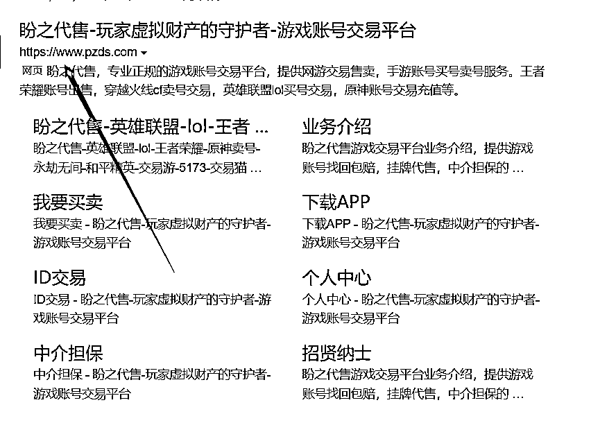
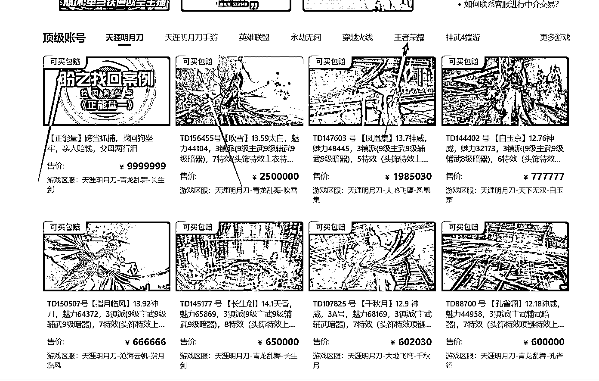

# 3 个月回本，我是如何靠游戏租赁业务一个月收入 5w+的？

> 原文：[`www.yuque.com/for_lazy/thfiu8/zb2trbpnmzwual7e`](https://www.yuque.com/for_lazy/thfiu8/zb2trbpnmzwual7e)

<ne-h2 id="86d4c6a3" data-lake-id="86d4c6a3"><ne-heading-ext><ne-heading-anchor></ne-heading-anchor><ne-heading-fold></ne-heading-fold></ne-heading-ext><ne-heading-content><ne-text id="u6dc5656b">(精华帖)(143 赞)3 个月回本，我是如何靠游戏租赁业务一个月收入 5w+的？</ne-text></ne-heading-content></ne-h2> <ne-p id="uc9df68c6" data-lake-id="uc9df68c6"><ne-text id="u2a2b1436">作者： 石头</ne-text></ne-p> <ne-p id="u521c07c8" data-lake-id="u521c07c8"><ne-text id="u63fb18d6">日期：2023-07-13</ne-text></ne-p> <ne-p id="u2e9dac60" data-lake-id="u2e9dac60"><ne-text id="u7cfdd26a">游戏租赁面向的大多是 95 后群体，只要是款游戏就能出租赚钱，无非是就是赚多赚少的问题。</ne-text></ne-p> <ne-p id="u2c64a29a" data-lake-id="u2c64a29a"><ne-text id="ucc13ce13">比如首选做现象级的游戏租赁，投入 10 万，每月纯利润空间可以在 7k-1W 之间。</ne-text></ne-p> <ne-p id="ub1e04c75" data-lake-id="ub1e04c75"><ne-text id="uf1657357">相对于其他行业，游戏租赁的门槛较高，成效也较快，只要愿意投入时间精力，就很容易获得第一桶金。我是从 18 年开始接触互联网，从做卡盟、网赚圈到后来做游戏租赁，现在成功经营了两家店铺，月营收达到 5W+。</ne-text></ne-p> <ne-p id="ucf09a281" data-lake-id="ucf09a281"><ne-text id="u417814b4">接下来，就以热门游戏“王者荣耀”为例，和大家分享我的实操过程和具体玩法，聊一聊游戏租赁行业的赚钱逻辑、变现空间以及风险规避的技巧。</ne-text></ne-p> <ne-p id="u7de4288f" data-lake-id="u7de4288f"><ne-card data-card-name="image" data-card-type="inline" id="HXyfN" data-event-boundary="card"></ne-card></ne-p> <ne-p id="u3b4c728c" data-lake-id="u3b4c728c"><ne-card data-card-name="image" data-card-type="inline" id="SMz4W" data-event-boundary="card"></ne-card></ne-p> <ne-p id="uf8a52f51" data-lake-id="uf8a52f51"><ne-text id="u17c67f0d">主要从以下几点来介绍游戏租赁：</ne-text></ne-p> <ne-p id="u07c53e63" data-lake-id="u07c53e63"><ne-text id="uf12d07b5">什么样的人群可以加入此行业？</ne-text></ne-p> <ne-p id="u2a6accd9" data-lake-id="u2a6accd9"><ne-text id="u4301995c">游戏租赁还能做多久？</ne-text></ne-p> <ne-p id="ud6b7de97" data-lake-id="ud6b7de97"><ne-text id="u87894a6b">游戏租赁的门槛是多少风险如何规避？</ne-text></ne-p> <ne-p id="u84b7355c" data-lake-id="u84b7355c"><ne-text id="ua002bf38">游戏租赁能赚多少钱 回报率是多少？</ne-text></ne-p> <ne-p id="u9cc08f55" data-lake-id="u9cc08f55"><ne-text id="u3dda53e9">等等……</ne-text></ne-p> <ne-h1 id="e890f70d" data-lake-id="e890f70d"><ne-heading-ext><ne-heading-anchor></ne-heading-anchor><ne-heading-fold></ne-heading-fold></ne-heading-ext><ne-heading-content><ne-text id="ud0e616e1">一、 什么是游戏租赁？</ne-text></ne-heading-content></ne-h1> <ne-p id="u6bcd029b" data-lake-id="u6bcd029b"><ne-text id="u37dc8728">游戏租赁可以理解为账号出租，通过买断此账号的所有权来进行平台上或者私域上的出租，能简单的理解为，我手里有一百台低中高端的豪车，我只需解决流量问题把我手里的车子，进行对外的出租，来获取收益。</ne-text></ne-p> <ne-p id="u5889eb03" data-lake-id="u5889eb03"><ne-text id="u49511dd1">在 2017 年间王者荣耀在国内可谓火的一塌糊涂，我也是王者迷，在某一天和女同事进行开黑，想着哪里能借到高端皮肤数量较多的账号呢？</ne-text></ne-p> <ne-p id="u950e1884" data-lake-id="u950e1884"><ne-text id="u02e49336">借了半小时，女同事不断的催我，我就在 QQ 群搜索“王者荣耀账号出租”跳出了许许多多的群，当时抱着尝试的心里，果断加入了群聊。</ne-text></ne-p> <ne-p id="ue64a7804" data-lake-id="ue64a7804"><ne-text id="u0d2f6474">看到群管理发的价格表和一个店铺的链接，V8 皮肤数量相对于较多的账号能达到 7-9 快去一个小时，硬着头皮租了俩个小时...... 从那时期开始对游戏租赁这行业抱着很大的期望值，开始慢慢研究相关的知识体系。</ne-text></ne-p> <ne-p id="ueb8aac43" data-lake-id="ueb8aac43"><ne-text id="ua0a8a7bb" ne-bold="true">（1）游戏有那些赚钱的板块呢？</ne-text></ne-p> <ne-p id="ub3edf2d7" data-lake-id="ub3edf2d7"><ne-text id="u9218b259">游戏项目可以大致的分成四大板块：</ne-text></ne-p> <ne-p id="ub99f6e99" data-lake-id="ub99f6e99"><ne-text id="u87fd2774">1、账号倒卖</ne-text></ne-p> <ne-p id="u09af8fbf" data-lake-id="u09af8fbf"><ne-text id="u91dc242a">2、游戏账号出租</ne-text></ne-p> <ne-p id="u2f1cf1fc" data-lake-id="u2f1cf1fc"><ne-text id="ub4d8ef59">3、游戏搬砖</ne-text></ne-p> <ne-p id="u42b917da" data-lake-id="u42b917da"><ne-text id="u3ab147dc">4、游戏陪玩</ne-text></ne-p> <ne-p id="uc5fa780d" data-lake-id="uc5fa780d"><ne-text id="ub961a742" ne-bold="true">账号倒卖：</ne-text><ne-text id="u1ef88b44">行业称之为号贩子，通过回收低价账号进行高价出售，此行业需要在业内有一定的沉淀，知名度不断提高之后收入也会不断的增加。</ne-text></ne-p> <ne-p id="u448d0376" data-lake-id="u448d0376"><ne-text id="u97fd8bf5" ne-bold="true">游戏账号出租：</ne-text><ne-text id="ua2f24813">此篇文章讲围绕此板块不断深根细说。</ne-text></ne-p> <ne-p id="uc0110405" data-lake-id="uc0110405"><ne-text id="u2b23ed89" ne-bold="true">游戏搬砖：</ne-text><ne-text id="u1e11fa7e">相比在自媒体如此发达的年代，各位圈友也应该会在抖音上看到许许多多，推广魔兽打金，梦幻西游打金等等....一系列 2980 5980 的项目介绍，此行业最累赚钱也是都有着周期性，给大家提个醒入局游戏搬砖需谨慎 切勿被浮夸的收益迷糊。</ne-text></ne-p> <ne-p id="u33112299" data-lake-id="u33112299"><ne-text id="uf087d085" ne-bold="true">游戏陪玩：</ne-text><ne-text id="uae4d4e7b">此板块应该算是比较热门的板块，分为娱乐陪玩 技术陪玩 （当然女孩子在此板块是最吃香的，每小时 8-20 不等）</ne-text></ne-p> <ne-h1 id="922e8099" data-lake-id="922e8099"><ne-heading-ext><ne-heading-anchor></ne-heading-anchor><ne-heading-fold></ne-heading-fold></ne-heading-ext><ne-heading-content><ne-text id="uc16cd3fa">二、什么样的人群能入局游戏租赁行业？</ne-text></ne-heading-content></ne-h1> <ne-p id="u43e1300d" data-lake-id="u43e1300d"><ne-text id="u6b86787f">（1）对此行业有着一定的见解、不盲目入局；</ne-text></ne-p> <ne-p id="u99823e77" data-lake-id="u99823e77"><ne-text id="u83b4ea0b">（2）自身也偶尔也接触游戏（什么游戏均可）；</ne-text></ne-p> <ne-p id="u9039dad3" data-lake-id="u9039dad3"><ne-text id="u0550092f">（3）缺少副业项目，兜里有闲置资金；</ne-text></ne-p> <ne-p id="ue8ecee5b" data-lake-id="ue8ecee5b"><ne-text id="u45c0ddd3">（4）看好此行业，能承担相对的风险 比如说账号因开挂被封号以及业内恶意竞争。</ne-text></ne-p> <ne-p id="uea3296ce" data-lake-id="uea3296ce"><ne-text id="uedf31527">相对于其他行业游戏租赁的门槛较高，成效较快，只要愿意投入时间精力去维护自己的客户群体，很容易获得第一桶金，相对于较少的沉淀期，执行力至上。</ne-text></ne-p> <ne-h1 id="161057d1" data-lake-id="161057d1"><ne-heading-ext><ne-heading-anchor></ne-heading-anchor><ne-heading-fold></ne-heading-fold></ne-heading-ext><ne-heading-content><ne-text id="u3d9e6061">三、游戏租赁能赚多少钱？回报率是多少？</ne-text></ne-heading-content></ne-h1> <ne-p id="udba0314d" data-lake-id="udba0314d"><ne-text id="u493dbb55" style="background-color: rgb(247, 105, 100);">以回本周期为例</ne-text></ne-p> <ne-p id="ue9a09d30" data-lake-id="ue9a09d30"><ne-text id="ud115b482">游戏租赁项目市面上大多的游戏，回本周期都为半年至一年内。</ne-text></ne-p> <ne-p id="u3dcf4795" data-lake-id="u3dcf4795"><ne-text id="u2396b572">爆款游戏基本处于三个月内回本 （投入的资金并没浮动很多）。</ne-text></ne-p> <ne-p id="u01f90e31" data-lake-id="u01f90e31"><ne-text id="u31ecd876">相对于游戏的其他类目板块，游戏租赁可以算是比较长久并且稳定的项目，游戏的周期一般在 3-5 年之久。</ne-text></ne-p> <ne-p id="ud55d79d1" data-lake-id="ud55d79d1"><ne-text id="u812270bb">风险是人为可控范围之内，风险相对于较低，人员设备上也无需太大的投入，配合脚本能达到 90%的全自动，业内也有着一句话，一个兵当一个团用，一个人当一百人用，无需投入太大的时间，但只限于王者荣耀能做到 90%的全自动。</ne-text></ne-p> <ne-p id="u4ead7eaf" data-lake-id="u4ead7eaf"><ne-text id="u5e3e3a6e">我们拿王者荣耀来说：目前的账号 V10 皮肤数量较多的账号每小时能达到 4-6 块，上下这区间 一款较好的 V10 账号均价在 3000-4000 之间。</ne-text></ne-p> <ne-p id="uf0dfd935" data-lake-id="uf0dfd935"><ne-text id="ua69f4cd4">假设我们是十万资金进入到此行业，预计能有 30-35 个账号，单账号放到平台上进行出租的话，每天的佣金区间在 20-25 上下区间浮动，30 个账号的收益也就在 600-750 之间，月收益在一万八到俩万上下…</ne-text></ne-p> <ne-p id="u070248db" data-lake-id="u070248db"><ne-text id="ua9be7d74">所以回本周期基本控制在半年至一年内。</ne-text></ne-p> <ne-h1 id="eee976d8" data-lake-id="eee976d8"><ne-heading-ext><ne-heading-anchor></ne-heading-anchor><ne-heading-fold></ne-heading-fold></ne-heading-ext><ne-heading-content><ne-text id="u372477d1">四、游戏租赁能拆分为那些关键环节？</ne-text></ne-heading-content></ne-h1> <ne-h4 id="9039450f" data-lake-id="9039450f"><ne-heading-ext><ne-heading-anchor></ne-heading-anchor><ne-heading-fold></ne-heading-fold></ne-heading-ext> <ne-heading-content></ne-heading-content></ne-h4> <ne-p id="ub9f54f9b" data-lake-id="ub9f54f9b"><ne-text id="uc5cf4797" ne-bold="true">（1）游戏租赁大致可分为三个环节</ne-text></ne-p> <ne-p id="ue766953b" data-lake-id="ue766953b"><ne-text id="u271890e5">第一环节：买号或者起号。</ne-text></ne-p> <ne-p id="u5c754042" data-lake-id="u5c754042"><ne-text id="u7417cee8">做游戏租赁的话第一个要解决的就是账号的问题，像主流单腾讯游戏或者网易游戏账号都可以在很多平台上进行购买，不需要去注册在充值购买装备道具，这样会极大的降低成本。</ne-text></ne-p> <ne-p id="uebafcf06" data-lake-id="uebafcf06"><ne-text id="ufe40f6c2">第三方平台的话可以去找些口碑好的有包赔服务的平台进行账号的购买，这里推荐下盼之交易平台。</ne-text></ne-p> <ne-p id="ub28f9539" data-lake-id="ub28f9539"><ne-text id="u7618d70a">第二环节：就是选择游戏租赁平台进行账号的上架。</ne-text></ne-p> <ne-p id="uf3ac777e" data-lake-id="uf3ac777e"><ne-text id="u8bad82db">目前国内的租赁平台有很多，手游上做的比较大的平台有租号玩 u 租号等，选择平台的话可以先加入几个平台的交流群，看看里面的商户或者租客的活跃度，还有就是账号在那个平台上的收益率会比较高。</ne-text></ne-p> <ne-p id="u42b3985b" data-lake-id="u42b3985b"><ne-text id="u1159225c">例如王者荣耀的中低端号，同样一个账号在 u 租号上相较于租号玩就是会比较好做的，因为 u 租号的商户较少，价格能设置对更低，所以这部分类型的账号在 u 租号上就会更好对出租。</ne-text></ne-p> <ne-p id="ud4e51466" data-lake-id="ud4e51466"><ne-text id="u25c1a4a0">举这个例子就是想说平台的重要性，选择对的平台也是能提高自己的收益率的。</ne-text></ne-p> <ne-p id="u2c2bd145" data-lake-id="u2c2bd145"><ne-text id="u33d54d5f">第三环节：日常维护和打造自己的租客私域，增加客户的游戏体验有利于提高租客多复购率。</ne-text></ne-p> <ne-p id="u5f574319" data-lake-id="u5f574319"><ne-text id="ua30828c5">这块每个游戏的做法都不太一样。像一些热门的游戏基本都有软件可以解决这些问题，</ne-text></ne-p> <ne-h1 id="060a97f8" data-lake-id="060a97f8"><ne-heading-ext><ne-heading-anchor></ne-heading-anchor><ne-heading-fold></ne-heading-fold></ne-heading-ext><ne-heading-content><ne-text id="ufb1bb618">五、关于新手小白游戏租赁从何积累稳定客源？</ne-text></ne-heading-content></ne-h1> <ne-p id="u3ae7c5d8" data-lake-id="u3ae7c5d8"><ne-text id="u7f327e01">租赁和账号倒卖都均可从游戏本身的各个社群内获取</ne-text></ne-p> <ne-p id="u2f00e132" data-lake-id="u2f00e132"><ne-text id="ubbb37320" ne-bold="true">（1）游戏贴吧</ne-text></ne-p> <ne-p id="u0cc6ae26" data-lake-id="u0cc6ae26"><ne-text id="u5504c006">关于贴吧，还是比较适合新手进行入场，因为门槛较低。</ne-text></ne-p> <ne-p id="ud0773e92" data-lake-id="ud0773e92"><ne-text id="uacf7db83">可以通过一些游戏交流板块，通过截图游戏账号皮肤来吸引精准的人群到私域群里，相对于贴吧的账号合租模式，适用于一些老手，账号合租的模式，是无需承担任何风险的。</ne-text></ne-p> <ne-p id="u37b91829" data-lake-id="u37b91829"><ne-text id="u0f9af06c">很多退游的玩家绝大部分都会把自己的账号放给号商，从而获取收益，基本上收益分成都是 2/8 或者 3/7，分成模式基于你和号主商谈。</ne-text></ne-p> <ne-p id="u727182b9" data-lake-id="u727182b9"><ne-card data-card-name="image" data-card-type="inline" id="IGALP" data-event-boundary="card"></ne-card></ne-p> <ne-p id="u3db7ec57" data-lake-id="u3db7ec57"><ne-text id="u9b36dded" ne-bold="true">（2） 闲鱼</ne-text></ne-p> <ne-p id="ube90d53c" data-lake-id="ube90d53c"><ne-text id="u661798e4">闲鱼也相对于比较热门，设备闲鱼账号较多的话，可以通过此方法来积累固定的客源，相对于租游戏账号的人群来说没有手续费，比租号平台便宜很多。</ne-text></ne-p> <ne-p id="ub98a9102" data-lake-id="ub98a9102"><ne-text id="u5aa03a18">所以说还是有很多人群在闲鱼上进行租赁，在积累到一定的客源之后可以开展相对应的游戏出租群，来维护客户资源。</ne-text></ne-p> <ne-p id="uab03b9aa" data-lake-id="uab03b9aa"><ne-card data-card-name="image" data-card-type="inline" id="LdW80" data-event-boundary="card"></ne-card></ne-p> <ne-p id="u626f9a3a" data-lake-id="u626f9a3a"><ne-card data-card-name="image" data-card-type="inline" id="tHFUb" data-event-boundary="card"></ne-card></ne-p> <ne-p id="uda12fe5c" data-lake-id="uda12fe5c"><ne-text id="u89aff2e3">通过低价引流来获取高的曝光以及想要数，从闲鱼上倒流上微信或者 QQ 群里，等用户基数达到一定的数量之后会有相对应的转介绍。</ne-text></ne-p> <ne-h1 id="19b07b1e" data-lake-id="19b07b1e"><ne-heading-ext><ne-heading-anchor></ne-heading-anchor><ne-heading-fold></ne-heading-fold></ne-heading-ext><ne-heading-content><ne-text id="ubf840ce7">六、新人入局要承担什么样的风险以及如何规避？</ne-text></ne-heading-content></ne-h1> <ne-p id="ubfb8c684" data-lake-id="ubfb8c684"><ne-text id="ub55a0524">通过接触游戏账号租赁这么久的时间，也踩过无数的坑，下面我给大家讲讲有哪些比较经常发生的风险</ne-text></ne-p> <ne-h5 id="5cca6129" data-lake-id="5cca6129"><ne-heading-ext><ne-heading-anchor></ne-heading-anchor><ne-heading-fold></ne-heading-fold></ne-heading-ext><ne-heading-content><ne-text id="u48db2ff7">（1）账号找回</ne-text></ne-heading-content></ne-h5> <ne-p id="u5929e92d" data-lake-id="u5929e92d"><ne-text id="ue195f2f9">对于我们从事游戏租赁板块的话，账号找回是非常常见的事情，因此要去找一些包赔的平台上进行购买账号，切记不要到号商上大量购买游戏账号，如果有实在看好的账号那么我推荐大家使用以下平台进行交易。</ne-text></ne-p> <ne-p id="u5046299d" data-lake-id="u5046299d"><ne-text id="u3cd819bc">①  盼之包赔平台</ne-text></ne-p> <ne-p id="ubfd628a2" data-lake-id="ubfd628a2"><ne-text id="u3b3b6b63">大家可以去哔哩看下此平台在自媒体上发布的视频，都是关于线下通过法律途径要回账号。</ne-text></ne-p> <ne-p id="u2b55dc17" data-lake-id="u2b55dc17"><ne-card data-card-name="image" data-card-type="inline" id="oTTF8" data-event-boundary="card"></ne-card></ne-p> <ne-p id="u54d32e63" data-lake-id="u54d32e63"><ne-card data-card-name="image" data-card-type="inline" id="FYi51" data-event-boundary="card"></ne-card></ne-p> <ne-p id="u5bb04f76" data-lake-id="u5bb04f76"><ne-text id="u80e2611c">盼之包赔属于比较老的包赔平台了，无需置疑他们的专业能力，可以放心使用。</ne-text></ne-p> <ne-p id="u8fb472de" data-lake-id="u8fb472de"><ne-text id="u786c82e4">② 螃蟹包赔平台</ne-text></ne-p> <ne-p id="ucf77bfd9" data-lake-id="ucf77bfd9"><ne-text id="u050e389b">注意⚠️千万不要去某宝上进行购买账号，因为店铺会跑路的！</ne-text></ne-p> <ne-h5 id="9baf4968" data-lake-id="9baf4968"><ne-heading-ext><ne-heading-anchor></ne-heading-anchor><ne-heading-fold></ne-heading-fold></ne-heading-ext><ne-heading-content><ne-text id="u3f39dd5e">（2）账号开挂以及同行竞争</ne-text></ne-heading-content></ne-h5> <ne-p id="uf05b5fe2" data-lake-id="uf05b5fe2"><ne-text id="ud958e913">租客开挂是难以避免的，有时候也会遇到同行的恶意竞争，同行租号开挂导致账号被封，这种情况也有发生过。</ne-text></ne-p> <ne-p id="u8eee7b39" data-lake-id="u8eee7b39"><ne-text id="u5d8bdb81">只能通过设置账号押金来减小开挂的发生，正常租号平台都会有专门的上号器的，上号器如果检测到租客设备内有外挂也会自动撤单，但是也不排除一些的外挂是检测不到的。</ne-text></ne-p> <ne-h1 id="62ddb927" data-lake-id="62ddb927"><ne-heading-ext><ne-heading-anchor></ne-heading-anchor><ne-heading-fold></ne-heading-fold></ne-heading-ext><ne-heading-content><ne-text id="u1dbc77ee">七、什么样的游戏存在变现空间？</ne-text></ne-heading-content></ne-h1> <ne-p id="u931c03b9" data-lake-id="u931c03b9"><ne-text id="u7f4b457e">1、游戏热度高 用户基数大</ne-text></ne-p> <ne-p id="u4c10dd81" data-lake-id="u4c10dd81"><ne-text id="u5c40a1d8">2、游戏人群受众广</ne-text></ne-p> <ne-p id="u396221e2" data-lake-id="u396221e2"><ne-text id="u6700957c">3、游戏皮肤数量多 更新较快 市场基于稳定</ne-text></ne-p> <ne-p id="u2d5d7c38" data-lake-id="u2d5d7c38"><ne-text id="u0b1e15d0" ne-bold="true">（1）如何发掘蓝海租赁游戏</ne-text></ne-p> <ne-p id="u2b3e9c28" data-lake-id="u2b3e9c28"><ne-text id="udcce543e">大家可以依据大型网游排行榜前十名，热门排行榜来分析那些游戏存在变现空间 在依据游戏的人群在区分人群的消费能力，什么样的玩家会来租游戏账号，基本上要满足这些条件：</ne-text></ne-p> <ne-p id="u57b54c0b" data-lake-id="u57b54c0b"><ne-text id="u59f7932f">1\. 游戏皮肤数量多 需要氪金</ne-text></ne-p> <ne-p id="ud36cb0dd" data-lake-id="ud36cb0dd"><ne-text id="ub696cd94">2.游戏热度较高人群广，比如王者荣耀、刺激战场、蛋仔派对</ne-text></ne-p> <ne-p id="u46447a5d" data-lake-id="u46447a5d"><ne-text id="u8d7132ed">3.受种群体玩家占比高</ne-text></ne-p> <ne-p id="uf1e553c0" data-lake-id="uf1e553c0"><ne-text id="u29b3def7">4.用户群体在 90-00 后等</ne-text></ne-p> <ne-p id="ud69b0d00" data-lake-id="ud69b0d00"><ne-text id="u181a4d98">下面给大家更新下 2023 年 手游游戏排行榜。（数据来源：点点数据）</ne-text></ne-p> <ne-p id="u5a9b508a" data-lake-id="u5a9b508a"><ne-card data-card-name="image" data-card-type="inline" id="kdPPR" data-event-boundary="card"></ne-card></ne-p> <ne-p id="ua05f34dd" data-lake-id="ua05f34dd"><ne-card data-card-name="image" data-card-type="inline" id="Hecap" data-event-boundary="card"></ne-card></ne-p> <ne-p id="ud3059957" data-lake-id="ud3059957"><ne-text id="ub2921485">点点数据的数据据显示，这几款苹果端的游戏热度，都是不错的，可以从中进行筛选游戏类别赛道进行实践操作。</ne-text></ne-p> <ne-p id="u455e011e" data-lake-id="u455e011e"><ne-text id="ue7687377">再根据我们上面的几点方式来筛选游戏的人群和热度，排行越高的游戏 ，受众的群体也比较多，因此在大众的赛道内也是比较好进行操作以及获得正反馈的。</ne-text></ne-p> <ne-p id="u65289ece" data-lake-id="u65289ece"><ne-text id="uae91524a">为什么我们选择热门的游戏？</ne-text></ne-p> <ne-p id="uaa11c828" data-lake-id="uaa11c828"><ne-text id="ufafbc28a">因为热门的游戏，用户基数较大，再根据游戏内的官方充值数据来看是否满足我们进行对外出租的条件，在做游戏租赁时尽量选择安卓端，苹果端相对于游戏租赁行业是比较难操作的，所以这点要注意下进行区分</ne-text></ne-p> <ne-h1 id="6d9fbc25" data-lake-id="6d9fbc25"><ne-heading-ext><ne-heading-anchor></ne-heading-anchor><ne-heading-fold></ne-heading-fold></ne-heading-ext><ne-heading-content><ne-text id="u785745ba">八、以王者荣耀为核心的实操流程</ne-text></ne-heading-content></ne-h1> <ne-p id="u67ceb097" data-lake-id="u67ceb097"><ne-text id="u1b4c0727" ne-bold="true">（1） 观察市场动向对比账号价格</ne-text></ne-p> <ne-p id="uf8caaabf" data-lake-id="uf8caaabf"><ne-text id="ude6b4150">价格控制在 2500-4000 之间 皮肤数量控制在 380-450 之间 当然数量越多出租的概率也就越高。</ne-text></ne-p> <ne-p id="u73ee7ca6" data-lake-id="u73ee7ca6"><ne-text id="u0b2d9dda">我们这里用盼之包赔平台进行购买是有保障的，后续找回可以直接联系平台客服去找回，</ne-text><ne-text id="u58c34634" style="background-color: rgb(247, 105, 100);">切记请勿脱离包赔平台后续发生账号找回得不偿失，</ne-text> <ne-text id="ud050a491">服务保障选择包赔服务 系统操作选择 安卓 QQ 版本 实名最好选择可二次实名。</ne-text></ne-p> <ne-p id="u924b14b4" data-lake-id="u924b14b4"><ne-card data-card-name="image" data-card-type="inline" id="kkIiR" data-event-boundary="card"></ne-card></ne-p> <ne-p id="u8378aed3" data-lake-id="u8378aed3"><ne-text id="u2bd11d8d">价格区间控制在 2500-3500 之间 选择皮肤数量较多 荣耀典藏数量多的即可，皮肤数和典藏数和后续的出租率挂钩，因为王者的皮肤更新的数量会比较快，所以尽量选择一些比较新的皮肤数。</ne-text></ne-p> <ne-p id="u7050f4f3" data-lake-id="u7050f4f3"><ne-card data-card-name="image" data-card-type="inline" id="WBWcN" data-event-boundary="card"></ne-card></ne-p> <ne-p id="u634ce9ca" data-lake-id="u634ce9ca"><ne-text id="u6a7cc568" ne-bold="true">（2） 账号购买玩进行对外的出租</ne-text></ne-p> <ne-p id="u078b0a4a" data-lake-id="u078b0a4a"><ne-text id="u3a69b56d">这里给大家介绍下账号购买完之后有几种方法进行对外的出租：</ne-text></ne-p> <ne-p id="uafd34623" data-lake-id="uafd34623"><ne-text id="u7a843d44">1.私租（通过闲鱼低客单引流到私欲进行对外的出租）</ne-text></ne-p> <ne-p id="u51c0c772" data-lake-id="u51c0c772"><ne-text id="u3f202233">2.租号平台进行出租：这里推荐 U 租号 虚贝 租号玩 等平台</ne-text></ne-p> <ne-p id="u1e324afd" data-lake-id="u1e324afd"><ne-text id="u41567dda">3.合租 （ 找商户进行合租 按时拿收益分成 基本都是 4/6 或者 2/8）</ne-text></ne-p> <ne-h3 id="6c67fe52" data-lake-id="6c67fe52"><ne-heading-ext><ne-heading-anchor></ne-heading-anchor><ne-heading-fold></ne-heading-fold></ne-heading-ext><ne-heading-content><ne-text id="uf5e03bd5">1.闲鱼私租注意方法</ne-text></ne-heading-content></ne-h3> <ne-p id="u0f86a65a" data-lake-id="u0f86a65a"><ne-text id="ufd3dcbfe">在闲鱼上进行低客单价上的引流到私域上进行沟通下单，此方法适用户，账号基数大，已经有点沉淀的玩家进行操作。</ne-text></ne-p> <ne-p id="uf8a736b7" data-lake-id="uf8a736b7"><ne-text id="ubd9fe832">如果账号少，但是收益肯定也是也会受到一定的影响，租客到时间才可以进行下一单的开始，因此我推荐账号数量在 4-10 是比较适合的。</ne-text></ne-p> <ne-p id="u400edaed" data-lake-id="u400edaed"><ne-text id="u81bdf076">每天赚百来块钱还是比较轻松的，闲鱼的市场还是较好的每天单号的收益会在 15-35 之间，有的个别的玩家会开挂之类的，可以收取玩家 20-50 的租金，到期退还即可。</ne-text></ne-p> <ne-p id="u35a4f15f" data-lake-id="u35a4f15f"><ne-card data-card-name="image" data-card-type="inline" id="pN2ix" data-event-boundary="card"></ne-card></ne-p> <ne-p id="ubf7b9b18" data-lake-id="ubf7b9b18"><ne-card data-card-name="image" data-card-type="inline" id="fkERN" data-event-boundary="card"></ne-card></ne-p> <ne-h3 id="6f545130" data-lake-id="6f545130"><ne-heading-ext><ne-heading-anchor></ne-heading-anchor><ne-heading-fold></ne-heading-fold></ne-heading-ext><ne-heading-content><ne-text id="u0a6e3d1a">2\. 平台出租</ne-text></ne-heading-content></ne-h3> <ne-p id="u5ff88d79" data-lake-id="u5ff88d79"><ne-text id="u7eebca74">以虚贝平台为例，先去对比各位商户的价格区间，在按照我们的账号质量稍微降低一点价格去和他们争抢市场即可。</ne-text></ne-p> <ne-p id="u4dfe5280" data-lake-id="u4dfe5280"><ne-card data-card-name="image" data-card-type="inline" id="Wkwjx" data-event-boundary="card"></ne-card></ne-p> <ne-p id="u2c451a10" data-lake-id="u2c451a10"><ne-text id="ub9ba50c3">这里我们登录我们的账号去注册店铺，依据同行的标题来进行修改，把我们账号的特点给突出出来，比如 V10 （380 皮 6 水晶）在加上一些比较有特点的皮肤名称编辑好就可以进行上架拉。</ne-text></ne-p> <ne-p id="u9059d019" data-lake-id="u9059d019"><ne-card data-card-name="image" data-card-type="inline" id="iwkjv" data-event-boundary="card"></ne-card></ne-p> <ne-p id="u31a6593d" data-lake-id="u31a6593d"><ne-text id="uba888074">此环节相对于比较简单按照平台要求进行跟着操作即可，需要注意的是在平台上进行操作的是账号描述以及账号的保险要进行购买，出租账号难免会有着封号或者账号冻结的问题。</ne-text></ne-p> <ne-p id="u1365abfb" data-lake-id="u1365abfb"><ne-text id="u531d5784">业内也有一句话，冻结一个账号，我拿十个账号去补上这个洞。</ne-text></ne-p> <ne-h3 id="82e4edbb" data-lake-id="82e4edbb"><ne-heading-ext><ne-heading-anchor></ne-heading-anchor><ne-heading-fold></ne-heading-fold></ne-heading-ext><ne-heading-content><ne-text id="uf89c80e3">3.合租模式</ne-text></ne-heading-content></ne-h3> <ne-p id="u6977178b" data-lake-id="u6977178b"><ne-text id="ucf7c93e6">账号合租适用于散户。</ne-text></ne-p> <ne-p id="u7354fa6c" data-lake-id="u7354fa6c"><ne-text id="u09d6b238">因为在打游戏的过程中氪金较多，账号质量也不会很低，所以对于散户来说每个月还可以获得几百块钱的收益何乐而不为呢？</ne-text></ne-p> <ne-p id="u85ffb60b" data-lake-id="u85ffb60b"><ne-text id="uea2d1b86">也可以通过游戏交流群里发布广告进行招租，我们的学员也有靠此模式玩法，空手套白狼月入上万的，合租模式简单来说就是将散户的账号运用以上的方法进行对外出租</ne-text></ne-p> <ne-h1 id="76897097" data-lake-id="76897097"><ne-heading-ext><ne-heading-anchor></ne-heading-anchor><ne-heading-fold></ne-heading-fold></ne-heading-ext><ne-heading-content><ne-text id="ua5a6ec6f">九、注意事项</ne-text></ne-heading-content></ne-h1> <ne-p id="uf862cdfd" data-lake-id="uf862cdfd"><ne-text id="u38958f35">在进行对外出租的过程一定要注意我们以上的操作注意事项，同行之间减少不了相互竞争，互相压价。</ne-text></ne-p> <ne-p id="u66f0a70d" data-lake-id="u66f0a70d"><ne-text id="u8d60e351">在操作之前要权衡利弊，观察好市场的动向在进行整个流程的实践操作，了解账号贬值率是多少，了解此游戏热度怎么样，了解整体市场的动向，观察周边年轻人群体都在接触什么游戏，是否值得入场，回报率能到多少。</ne-text></ne-p> <ne-p id="u78823ac2" data-lake-id="u78823ac2"><ne-text id="ua225ae1a">目前整个市场上大环境趋势还是不错的，值得大家去深入研究此行业，四月份的学员目前也收入过万。</ne-text></ne-p> <ne-p id="u6936e978" data-lake-id="u6936e978"><ne-text id="u58926658">我</ne-text><ne-text id="u749245df" ne-bold="true">是石头专注游戏租赁、私域引流，欢迎前来交流学习探讨，热衷于接触新项目，新行业 。</ne-text></ne-p> <ne-hole id="u81506230" data-lake-id="u81506230"><ne-card data-card-name="hr" data-card-type="block" id="Jgwwa" data-event-boundary="card"><ne-p id="u30bec8a9" data-lake-id="u30bec8a9"><ne-text id="u7bef8981">评论区：</ne-text></ne-p> <ne-p id="u09109235" data-lake-id="u09109235"><ne-text id="uf7dda137">瑾糖 : 我的第一桶金是靠着倒卖英雄联盟账号</ne-text> <ne-text id="uec8a0869">亦仁 : 感谢分享，已加精华。</ne-text> <ne-text id="u91658b2c">石头 : 感谢亦仁哥</ne-text> <ne-text id="uc40832e1">小良 : 厉害👍</ne-text> <ne-text id="u21853a21">石头 : 当时我们得第一桶金也是从倒卖开始后续演变成租赁了～</ne-text> <ne-text id="u4f253647">李布岩、 : 封号问题有解决办法嘛，还是只能看运气呢</ne-text> <ne-text id="u47757065">石头 : 要根据游戏赖制定</ne-text> <ne-text id="ue4e72b59">半条咸鱼 : cf 有大坑  我今年一月份买了大概 30 多个账号，刚出租一个月就被封了十多个，而且是连着被封的，就很离谱，也不知道是检测突然厉害还是被同行搞了，后来直接卖号跑路了，被找回倒是少数  30 个号一共被找回 2 个，全都走盼之包赔，只损失了手续费，其实如果买的号多，我觉得可以不走包赔，包赔的话 10-20%手续费确实有点多</ne-text></ne-p> <ne-p id="u1981e413" data-lake-id="u1981e413"><ne-card data-card-name="image" data-card-type="inline" id="cEK07" data-event-boundary="card"></ne-card></ne-p> <ne-hole id="u436e06a0" data-lake-id="u436e06a0"><ne-card data-card-name="hr" data-card-type="block" id="vjbuT" data-event-boundary="card"></ne-card></ne-hole></ne-card></ne-hole>