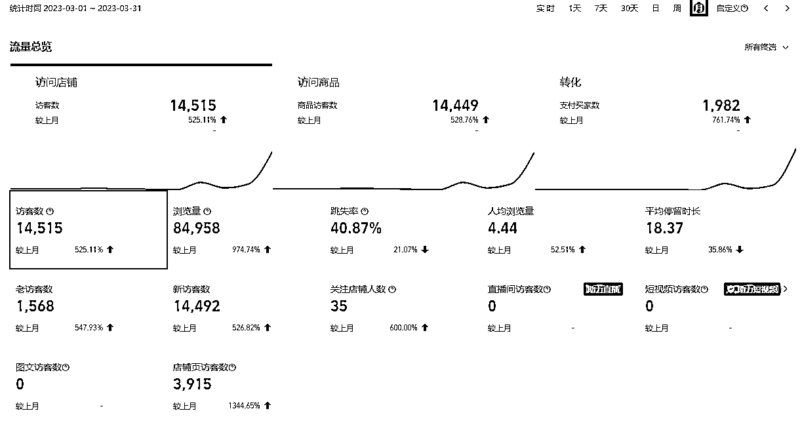

# 我们是如何跑通 Midjourney 共享账号 0-1，获得 30w+利润的

> 原文：[`www.yuque.com/for_lazy/thfiu8/ga61pf0f35zditkt`](https://www.yuque.com/for_lazy/thfiu8/ga61pf0f35zditkt)

## (精华帖)(61 赞)我们是如何跑通 Midjourney 共享账号 0-1，获得 30w+利润的 

作者： 西昂 

日期：2023-07-10 

『我们是如何跑通 midjourney 共享账号 0-1，以及 3 人如何获得 30w+利润的』 

大家好，我是西昂。目前在做一些虚拟产品变现项目。首先感谢  对文章的指点，感谢 的优秀排版！ 

6 月 22 日，我们小群的黄校长写了个复盘贴。分享了前段时间操作的 midjourney 共享账号的项目，并且还被亦仁老大给了精华。小组内立马组织了新的行动，定下了一个月一篇帖子的 flag。 

飞书链接：[https://u0yrmcie7v.feishu.cn/docx/FyODdreh7oK8ZwxfsiWcOec4n0c](https://u0yrmcie7v.feishu.cn/docx/FyODdreh7oK8ZwxfsiWcOec4n0c)  

评论区： 

陈真 : 不知道还要人吗？现在进小群不知道晚不晚？ 热爱 : 哈哈哈同问 西昂 : [呲牙] 不要人啦 西昂 : 不要人啦 [皱眉] 西昂 : 兄弟们，建立小群的初衷和前段时间亦仁老大说的 实战小组类似。如果大家有合适的项目，可以自己朋友圈拉个小群，这样可能更容易拿到结果。 

当然，有好的项目。请拉我。[奸笑] 陈真 : 我有你的好友，就是不知道下次你什么时候开始做项目 西昂 : 一直测试新的项目呢，生财的项目都可以做的。就是都是小钱，没有拿的出手的。 司徒 K : [强][强][强][强] 

  