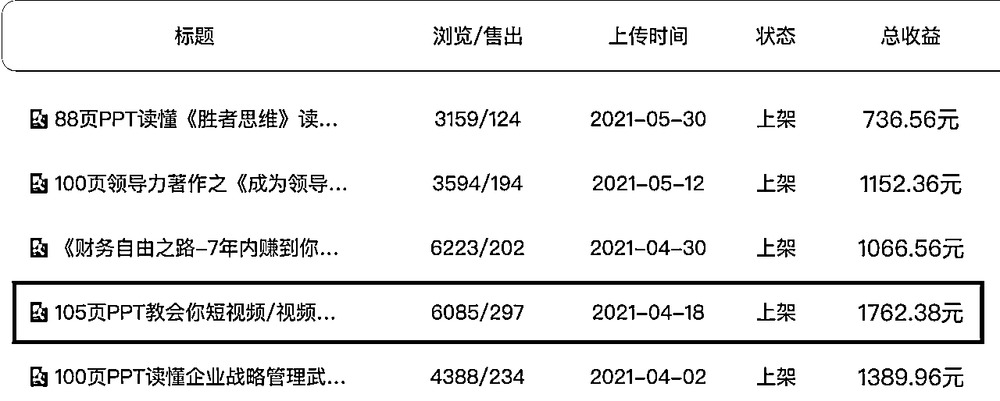

# 读书笔记变现全流程复盘-适合小白上手的项目

> 原文：[`www.yuque.com/for_lazy/thfiu8/eg40ok6wsv6e3gg0`](https://www.yuque.com/for_lazy/thfiu8/eg40ok6wsv6e3gg0)

## (36 赞)读书笔记变现全流程复盘-适合小白上手的项目 

作者： 飞掌柜 

日期：2023-07-14 

【实战篇：读书笔记变现全流程复盘-适合小白上手的项目】 

相信大家都读过很多书，不知道是否有和我一样的经历，读完一本书，没过多久就忘了，很多书无法和实际工作或学习结合，或者没有变现。美其名曰“丰富了内在，开拓了眼界”，但收获多少，真正能用到多少，其实只有你自己知道。 

你有多久没完整读过一本书了？每次总因为各种原因取消 or 打乱！ 读过书是否很快忘记？看似丰富内在，其实没有在实际中运用！ 你知道读书变现的途径和方法吗？需要找到靠谱的人帮助你！ 

大家好，我是飞掌柜，副业运营读书会，以公众号为平台，孵化了几个小项目，今天介绍的是【读书笔记变现实操项目】，全文阅读约 8 分钟。事先声明两点： 

1、该项目适合对读书笔记变现感兴趣的小白，如果你是大佬，可以直接点击【商业模式、实操步骤、笔记优化、收益情况、项目思考】看精华总结即可； 2、该项目针对小白培训视角写的，因此介绍有平台功能部分，不是为了打广告哈。 

同时，这里要提到本文的灵感来源，一方面是想对自己之前【读书笔记变现实操项目】进行总结，一方面来源于圈友@读旅世界 的风向标启发，他总结了 5 条读书笔记变现的风向标，附上链接：，在此感谢。他的 5 条分别是： 笔记变现方法 1：带货 笔记变现方法 2：蹭官方给予的优质内容奖励 笔记变现方法 3：小红书 笔记变现方法 4：豆瓣 笔记变现方法 5：IP 变现 

而我这一篇，不属于 5 条中的任意一条，相当于对他的途径进行了补充，给大家多一个变现渠道。全文目录如下： 

一、项目来源 二、平台介绍 三、平台功能 四、项目调研 4.1 公司背景 4.2 股权结构 五、商业模式 5.1 收入来源 5.2 客户群体 5.3 用户视角 六、实操步骤 6.1 对接平台 6.2 笔记创作 七、笔记优化 7.1 标杆案例 7.2 作品美化 7.3 选择书籍 7.4 拆解章节 7.5 笔记频率 7.6 PPT 模板 7.7 流量获取 八、收益情况 九、项目思考 9.1 变现方式 9.2 变现平台 

详细内容及干货请移步飞书：[https://wx.zsxq.com/dweb2/index/topic_detail/185212841122122](https://wx.zsxq.com/dweb2/index/topic_detail/185212841122122)[https://kqubish8iq0.feishu.cn/docx/R7Cld4FZmoLMAmxzoEvcbRakn5b](https://kqubish8iq0.feishu.cn/docx/R7Cld4FZmoLMAmxzoEvcbRakn5b) 

 

 

评论区： 

暂无评论 

  