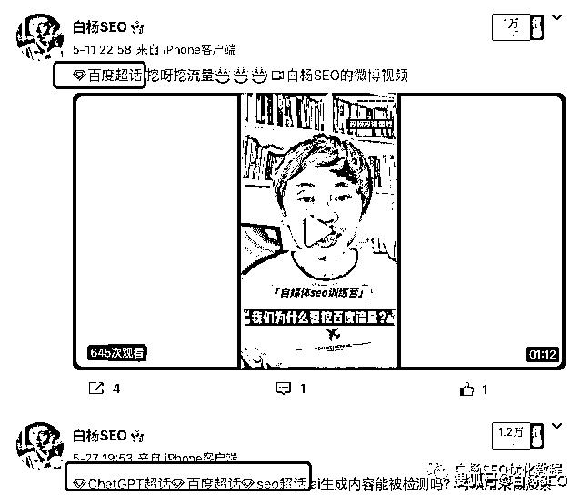
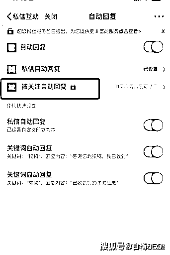
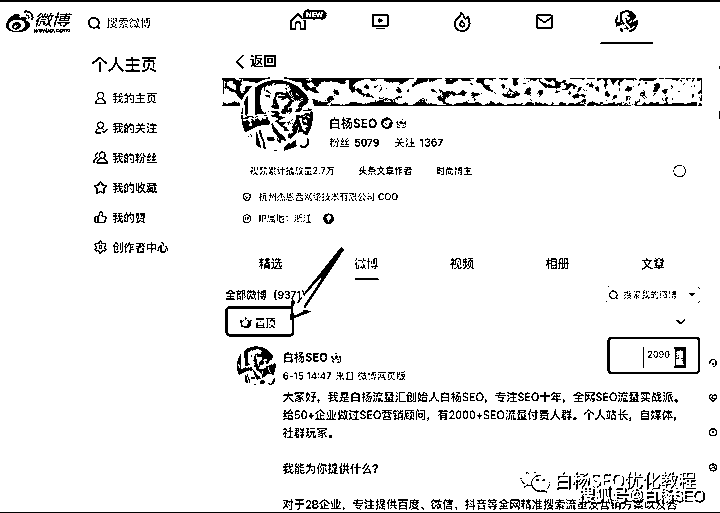
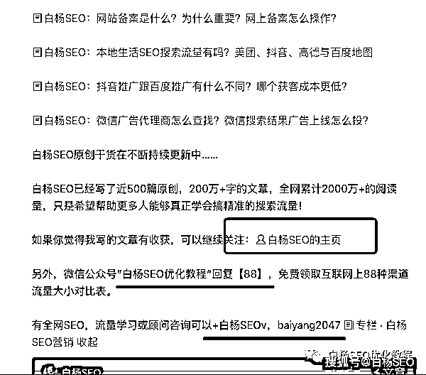

# 关于微博流量，你不知道的 10 条小干货分享

> 原文：[`www.yuque.com/for_lazy/thfiu8/ngvclakxu9g6i7au`](https://www.yuque.com/for_lazy/thfiu8/ngvclakxu9g6i7au)

<ne-h2 id="f55fd055" data-lake-id="f55fd055"><ne-heading-ext><ne-heading-anchor></ne-heading-anchor><ne-heading-fold></ne-heading-fold></ne-heading-ext><ne-heading-content><ne-text id="u81072adf">(30 赞)关于微博流量，你不知道的 10 条小干货分享</ne-text></ne-heading-content></ne-h2> <ne-p id="u720f36f9" data-lake-id="u720f36f9"><ne-text id="uc53b9b20">作者： 白杨 SEO</ne-text></ne-p> <ne-p id="uce755139" data-lake-id="uce755139"><ne-text id="u016645d4">日期：2023-07-11</ne-text></ne-p> <ne-p id="u2eaecf69" data-lake-id="u2eaecf69"><ne-card data-card-name="image" data-card-type="inline" id="y0k9I" data-event-boundary="card">  <ne-p id="uc39cc208" data-lake-id="uc39cc208"><ne-text id="uab9e6e6a" ne-bold="true">1、微博时间久，流量依然巨大</ne-text></ne-p> <ne-p id="u930f3cb7" data-lake-id="u930f3cb7"><ne-text id="u547a0b3f">这里微博主要指新浪微博，诞生于 2009 年 8 月 4 日，还有一个月不到 14 年了，那一年白杨 SEO 刚大学毕业。很多人觉得微博没什么人用了，实际情况是，2022 年底数据，微博月活 5.86 亿、日活 2.5 亿。（最新数据如图，略有下降，供参考）</ne-text></ne-p> <ne-p id="u1ea8e9b2" data-lake-id="u1ea8e9b2"><ne-card data-card-name="image" data-card-type="inline" id="Fpzds" data-event-boundary="card">  <ne-p id="u214c9dcb" data-lake-id="u214c9dcb"><ne-text id="u06e835fb">从这里可以看出来，微博上的流量依旧很大，同属于日活亿级以上 APP。亿级以上，意味着这里不仅有推荐流量，也有自然搜索流量，也就有了用户微博搜索流量（微博 SEO）的基础！</ne-text></ne-p> <ne-p id="u84854bdc" data-lake-id="u84854bdc"><ne-text id="u8b827bfa" ne-bold="true">2、微博热点及时，传播快，查看热门事件首选</ne-text></ne-p> <ne-p id="ube557f49" data-lake-id="ube557f49"><ne-text id="ue2f58073">如果白杨 SEO 粉丝里有在企业做新媒体或者自媒体朋友，肯定会或多或少追过热门，或者也想蹭热门流量。不管是做图文形式，还是短视频形式，微博查看及了解热门事件一定首选！</ne-text></ne-p> <ne-p id="ude61b5ec" data-lake-id="ude61b5ec"><ne-card data-card-name="image" data-card-type="inline" id="jh7TP" data-event-boundary="card"></ne-card></ne-p> <ne-p id="u1535afae" data-lake-id="u1535afae"><ne-text id="u1d0ea73a">很多非微博玩家或者自媒体，又或者比较年轻，如 00 后，对微博并不那么了解。微博之所以能打败一众“微博”独孤求败至今，除了最开始邀请明星策略，最重要的就是他的娱乐八卦，当然它的先发优势也很明显！</ne-text></ne-p> <ne-p id="ub5b27049" data-lake-id="ub5b27049"><ne-text id="u41b2724d" ne-bold="true">3、微博实时可以直接上百度热议，获取百度流量</ne-text></ne-p> <ne-p id="u1bfa7843" data-lake-id="u1bfa7843"><ne-card data-card-name="image" data-card-type="inline" id="T7iDk" data-event-boundary="card"></ne-card></ne-p> <ne-p id="u42c0e04a" data-lake-id="u42c0e04a"><ne-text id="ude0f9fec">先看上图，在百度 APP 上，有一栏是【热议】，这个热议里的内容全部来自微博内容，而且热议的内容有些词可以上百度搜索综合首页，上面二手车就是。</ne-text></ne-p> <ne-p id="u87c35e96" data-lake-id="u87c35e96"><ne-text id="u0e91f319">关于百度热议是什么、微博如何进百度热议，可以看之前写的这 2 篇：</ne-text></ne-p> <ne-p id="uc7bafbd0" data-lake-id="uc7bafbd0">[<ne-text id="ud034a9e3">白杨 SEO：百度热议是什么、收录规则、排名怎么上去和推广引流？</ne-text>](http://mp.weixin.qq.com/s?__biz=MzU2NTQzMzA4Nw==&mid=2247485874&idx=1&sn=a2a396b69be749fc61dec9f89e53e102&chksm=fcba8e22cbcd07348f48adada3e5359c5db3aeab98bc11747f30c56afe98a15ec91b1b925d9e&scene=21#wechat_redirect)</ne-p> <ne-p id="u8203276e" data-lake-id="u8203276e">[<ne-text id="u48f5352b">白杨 SEO：微博引流之微博实时号是什么，有什么用及怎么养？</ne-text>](http://mp.weixin.qq.com/s?__biz=MzU2NTQzMzA4Nw==&mid=2247486016&idx=1&sn=c1b42fed1ffffef60018899447f85ed9&chksm=fcba8dd0cbcd04c6979df74f1c95b84a0e793e92814e85313eca657746031d04da9284b8716b&scene=21#wechat_redirect)</ne-p> <ne-p id="ubb0a34a9" data-lake-id="ubb0a34a9"><ne-text id="u2eddbc10" ne-bold="true">4、微博专栏流量大、自由度高</ne-text></ne-p> <ne-p id="ufc9727cc" data-lake-id="ufc9727cc"><ne-text id="u1d863494">很多人应该听过知乎专栏、博客专栏之类。而微博专栏，你简单理解就是在微博上写文章开通自己的专栏。以白杨 SEO 自己实战专栏【白杨 SEO 营销】举例，如图，</ne-text></ne-p> <ne-p id="uaf105fc4" data-lake-id="uaf105fc4"><ne-card data-card-name="image" data-card-type="inline" id="xPO2Z" data-event-boundary="card"></ne-card></ne-p> <ne-p id="u937e61f6" data-lake-id="u937e61f6"><ne-text id="ufa1ebf14">目前专栏形式只能在 APP 上展示，但在 PC 上展示是文章形式。上面提到的流量大，大家可以看下，我发在微博专栏文章平均阅读 1000+以上，总粉丝也就 5000 多人。自由度高是什么意思？简单理解就是你微博专栏里的文章可以为你做引流，最后一条有截图。不管是引流网站、公众号还是个人私域，懂得人懂。</ne-text></ne-p> <ne-p id="u165c3d7f" data-lake-id="u165c3d7f"><ne-text id="ue25f8f40" ne-bold="true">5、微博文章被百度收录高，适合做品宣和引流</ne-text></ne-p> <ne-p id="ud70baeb7" data-lake-id="ud70baeb7"><ne-text id="u488acd18">以白杨 SEO 自己举例，我在公众号白杨 SEO 原创四百多篇，90%都有同步在微博专栏里，因为我希望微博上和百度上有人搜到都能看到。大多数都被百度收录了，比我的白杨 SEO 博客收录还多，如图，</ne-text></ne-p> <ne-p id="u8ecfa655" data-lake-id="u8ecfa655"><ne-card data-card-name="image" data-card-type="inline" id="VZC5M" data-event-boundary="card"></ne-card></ne-p> <ne-p id="udcd4da2e" data-lake-id="udcd4da2e"><ne-text id="u4e6e34f3">不管你是像白杨 SEO 这样做品牌宣传还是做引流，微博专栏，你是不是都没有意识到用它来做百度 SEO？现在开始做也不晚哈。</ne-text></ne-p> <ne-p id="u44bd0a0a" data-lake-id="u44bd0a0a"><ne-text id="uf5fe2ed1" ne-bold="true">6、微博也有视频号，微博短视频流量大</ne-text></ne-p> <ne-p id="uf9474eff" data-lake-id="uf9474eff"><ne-text id="uec47817d">我们现在说视频号，大家肯定就想到微信的视频号，其实不止微信有，其它很多平台都有。就像小程序一样，他只是一个通用名字。比如白杨 SEO 微博视频号截图。</ne-text></ne-p> <ne-p id="u90cf64e1" data-lake-id="u90cf64e1"><ne-card data-card-name="image" data-card-type="inline" id="DwRjj" data-event-boundary="card"></ne-card></ne-p> <ne-p id="ubfe16ca4" data-lake-id="ubfe16ca4"><ne-text id="u90283b7e">很多人问我：白杨老师，现在除了抖音、快手、小红书、B 站可以发短视频外还有哪些平台？其实，微博就是一个不错的地方，很多人没注意到而已。</ne-text></ne-p> <ne-p id="u81ce6722" data-lake-id="u81ce6722"><ne-text id="ua8c362d4" ne-bold="true">7、微博超话流量大，适合各垂直话题</ne-text></ne-p> <ne-p id="u79ba156c" data-lake-id="u79ba156c"><ne-text id="u707b42fb">很多人说，白杨老师，我不像你一样懂 SEO，我不会做搜索流量，但我也想要我发的微博或者短视频有流量怎么做？其实，微博超话就是一个不错的方式！如图，</ne-text></ne-p> <ne-p id="u6e441411" data-lake-id="u6e441411"><ne-card data-card-name="image" data-card-type="inline" id="kNfNF" data-event-boundary="card"></ne-card></ne-p> <ne-p id="u6ea35737" data-lake-id="u6ea35737"><ne-text id="uac446c15">其实，我有时也有微博超话加持，比如百度超话，ChatGPT 超话，阅读 1 万+，哈哈哈。啥，超话是啥不懂？这个我就不解释了哈。</ne-text></ne-p> <ne-p id="u17a4a7b4" data-lake-id="u17a4a7b4"><ne-text id="u5165919a" ne-bold="true">8、微博被其它搜索引擎收录高</ne-text></ne-p> <ne-p id="u505af086" data-lake-id="u505af086"><ne-text id="udbeb662d">微博的内容，不管是短微博，还是微博文章，被搜狗、360、神马，甚至必应都收录高。</ne-text></ne-p> <ne-p id="u98279b4d" data-lake-id="u98279b4d"><ne-text id="uf7ff0b3e">你可能想问为什么？因为微博其实算是一个 UGC（用户生产内容）平台，而且它的内容还比其它平台更具有实效性。而搜索引擎给用户看的就是要实效性，满足用户搜索需求，这下你懂了吧？你可能会说，现在 AIGC（人工智能生成内容）来了，用户辨别不了，但现在国内，如果你用 AIGC 生成内容，尤其新闻虚假等，严重直接进去喝茶，已经有相关规定了。</ne-text></ne-p> <ne-p id="u4800a7af" data-lake-id="u4800a7af"><ne-text id="u06865788" ne-bold="true">9、微博可设置自动私信回复引流（付费功能）</ne-text></ne-p> <ne-p id="u6f1d012b" data-lake-id="u6f1d012b"><ne-text id="u69c7d0b3">大多数平台其实都可以设置自动回复，微博也不例外。</ne-text></ne-p> <ne-p id="u7d135932" data-lake-id="u7d135932"><ne-card data-card-name="image" data-card-type="inline" id="Ig6Bm" data-event-boundary="card"></ne-card></ne-p> <ne-p id="u282220cb" data-lake-id="u282220cb"><ne-text id="u85fc879e">如图，大家最需要的是被关注自动回复功能（公众号有，百家号也有），小红书暂时没看到。而微博这个需要付费开通（IOS 苹果手机）暂不支持。</ne-text></ne-p> <ne-p id="u55ed17d1" data-lake-id="u55ed17d1"><ne-text id="u05e86d90">我们做 SEO 流量这行，尤其程序员出身的朋友最喜欢说一个词叫自动化。而白杨 SEO 非程序技术出身，所以喜欢手动操作。当然前者确实方便很多，白杨 SEO 粉丝里有技术朋友，直接付费设置好那个功能即可。</ne-text></ne-p> <ne-p id="ub84d7f39" data-lake-id="ub84d7f39"><ne-text id="ua0055388">当然也有一个前提，你做的微博不能像白杨 SEO 这个微博这样过度垂直和小众，每天关注个位数，甚至几天几个关注，这种设置就没什么用。</ne-text></ne-p> <ne-p id="u25c8d489" data-lake-id="u25c8d489"><ne-text id="u92c69b48" ne-bold="true">10、微博置顶功能，可做品宣或引流（付费会员功能）</ne-text></ne-p> <ne-p id="u8b9a4430" data-lake-id="u8b9a4430"><ne-text id="u3d23ea6c">这个功能，是我最近在看一个做个人品牌很厉害的那里学来的，他做的完全是高价值粉丝。我怎么发现他的呢，他也在生财有术，他也是和白杨 SEO 一样生财 2023 邀请影响力 TOP 前 100，他还在我前面。我以自己的微博实战举例吧，（前提，必须是微博会员才能置顶）</ne-text></ne-p> <ne-p id="u98c2dff7" data-lake-id="u98c2dff7"><ne-card data-card-name="image" data-card-type="inline" id="Rx8Xj" data-event-boundary="card"></ne-card></ne-p> <ne-p id="u9279fc90" data-lake-id="u9279fc90"><ne-text id="uc9111833">如上图，比如我 10 多年发了快 10000 条微博，哪一条用户一来就看到呢，所以就用到了置顶。</ne-text></ne-p> <ne-p id="u63163140" data-lake-id="u63163140"><ne-text id="u58154e1a">你很好奇，置顶有什么用，再看这个置顶微博几张截图吧，</ne-text></ne-p> <ne-p id="uc551c7b1" data-lake-id="uc551c7b1"><ne-card data-card-name="image" data-card-type="inline" id="Rz6s4" data-event-boundary="card"></ne-card></ne-p> <ne-p id="u746d1c9e" data-lake-id="u746d1c9e"><ne-card data-card-name="image" data-card-type="inline" id="VOpXs" data-event-boundary="card"></ne-card></ne-p> <ne-p id="u7426a9d3" data-lake-id="u7426a9d3"><ne-card data-card-name="image" data-card-type="inline" id="iN1Fu" data-event-boundary="card"></ne-card></ne-p> <ne-p id="u180df3a8" data-lake-id="u180df3a8"><ne-text id="u05349070">以上只是截图举例，懂得人懂，我不用解释太多，做流量的肯定直接能看懂了。我只是想说，我愿意分享出来，是希望对大家真的有用。</ne-text></ne-p> <ne-p id="u8e374044" data-lake-id="u8e374044"><ne-text id="u4b4789c2">最后，白杨 SEO 回到做流量或者说引流本质上来说，</ne-text><ne-text id="uc736e560" style="color: rgb(204, 0, 0);">你一定要为用户提供有价值的东西，跟平台一定要共赢思维（包括给平台付费）</ne-text><ne-text id="u8de5695d">。</ne-text></ne-p> <ne-p id="u87dbe81b" data-lake-id="u87dbe81b"><ne-text id="u3fda4798">作者简介：白杨 SEO，专注 SEO 研究十年，全网 SEO 流量实战派，对互联网精准流量有深入研究。</ne-text></ne-p> <ne-hole id="u4608fe76" data-lake-id="u4608fe76"><ne-card data-card-name="hr" data-card-type="block" id="EqSzu" data-event-boundary="card"><ne-p id="ud65bc9ae" data-lake-id="ud65bc9ae"><ne-text id="uc03dafdf">评论区：</ne-text></ne-p> <ne-p id="u1b308e8f" data-lake-id="u1b308e8f"><ne-text id="uf69c623e">暂无评论</ne-text></ne-p> <ne-p id="ucf60ecb5" data-lake-id="ucf60ecb5"><ne-card data-card-name="image" data-card-type="inline" id="NSS3y" data-event-boundary="card"></ne-card></ne-p> <ne-hole id="uc6a96bd5" data-lake-id="uc6a96bd5"><ne-card data-card-name="hr" data-card-type="block" id="wAT6B" data-event-boundary="card"></ne-card></ne-hole></ne-card></ne-hole></ne-card></ne-p></ne-card></ne-p>