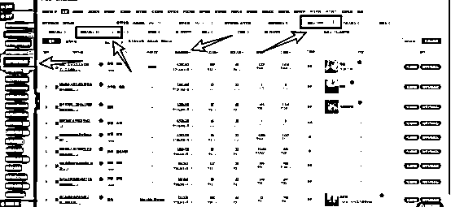
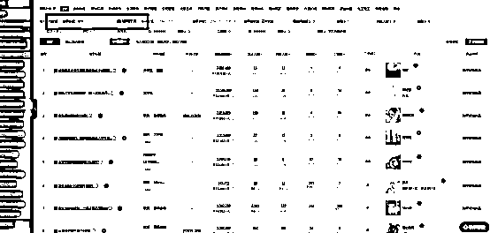
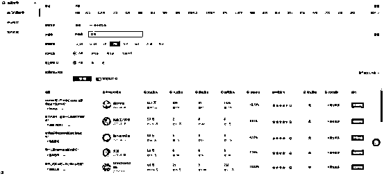
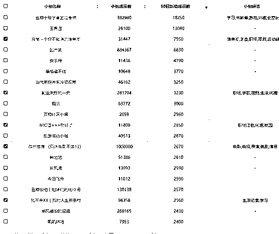

# 没粉丝的个人用户在各平台网盘拉新的一些技巧

> 原文：[`www.yuque.com/for_lazy/thfiu8/wmqo62cauyhv4mvr`](https://www.yuque.com/for_lazy/thfiu8/wmqo62cauyhv4mvr)

## (28 赞)没粉丝的个人用户在各平台网盘拉新的一些技巧 

作者： 嘟 

日期：2023-07-14 

我应该是生财里第一个分享网盘拉新信息的。 

 

我玩了一年多，没加团队，没搞下线，大多精力用在搞流量上，在个人推广上有一些自己总结出来的技巧，分享给圈友们。 

## 玩法核心 

做网盘拉新，我认为最重要的第一点，是想明白：我是要拉新，还是要引流。拉新和引流是两套玩法。 

拉新，让他通过我分享的资源开通账号使用就行了。 

引流，我要让他关注账号，或者加好友、进群，再发他资源。 

两者可以结合，但一定要分清主次，这篇分享的技巧以拉新为主。 

拉新为主，就衍生出一个关键点：链路越短，转化越易。 

就是说，用户领取资料越便捷，就越容易被拉新。 

点开资源链接→注册账号保存→下载软件登录→查看下载资料。 

这是我能想到的最短路径。 

夸克、UC、迅雷还可以先下载软件，再打开口令，链路也很短，但操作起来相对较难，对一些用户并不友好。 

刚开始由于手上没有能用来拉新的大号和粉丝群，那就只能借助公域平台，利用算法和搜索优化让更多人看到自己的资源。 

小号有曝光机会的公域平台，在我这里只分两种，一种是能发链接的，一种是不能发链接的。 

能直接发链接的，转化效率就会高一些，比如知乎、虎扑、微博、豆瓣、B 站、贴吧、公众号，以及各种小众论坛和资源分享群。 

不能直接发链接的，需要去引导，转化效率相对就会低一些，而且发多了资源还有封号的可能性，比如抖音、快手、小红书、视频号、简书。 

如何让最大化利用一份资源，一个是要思考如何能让更多人看到自己的资源链接，也就是如何让发布的内容在公域平台有更多展现，一个是要思考如何知道别人需要什么资源、什么资源需求量大。 

一般我是这么找别人需要的资源： 

1，自己需要的资源，一定也有别人需要，找到后打包分享出去，比如影视动漫游软件电子书。 

2，淘宝、拼多多热销的虚拟资源，免费分享会很有市场，比如相声评剧音乐素材合集。 

3，一些热搜提到的内容，可以打包成资源包分享，比如某某明星塌房，他的作品合集就会有一波热度。 

4，利用数据平台挖掘有需求的关键词，布局资源链接，比如用微信指数看某些关键词搜索量上涨，就可以去公众号布局搜索词。 

5，平时刷抖音、小红书看到别人付费卖的虚拟资源，做免费分享，比如演讲资料、英语动画、考证资料。 

一个人获取免费资源大多是这么个流程： 

1，搜索。 

看到或者需要某个资源，去搜狗/必应/微博/Q 群/百度一下。那搜索排名靠前的网站，我应该也可以进去发一下内容。 

小红书/知乎/抖音/快手相关内容搜索后的评论区。那我可以分享我拿到的资源链接或者获取方式。 

2，算法。 

在小红书/抖音/知乎/快手刷到内容。评论区有资源、有直接获取方式，没有资源，再去搜索。 

## 各平台玩法 

接下来就是考虑怎么利用搜索和算法在各个平台让自己的内容有更多曝光机会，以下为我在各个平台的玩法。 <ne-h3 id="91809114" data-lake-id="91809114">能直接放链接的平台。</ne-h3> <ne-h4 id="6a9adea6" data-lake-id="6a9adea6">1，知乎，主推文档合集、提高效率工具。</ne-h4> 

知乎我主要关注三个地方。 

第一个是每天的热榜，有些时候会出现可以打包成资料类型的问题，比如天涯论坛相关话题就曾多次上榜。 

第二个是用数据平台挖一些有潜力的回答，我一般是用 5118 筛选 50 个回答以内，阅读量增速比较快的回答。   

第三个是搜一些可以被打包成资源的问题关键词，比如 XX 软件下载、XX 合集之类。  

 

没有数据查询会员的可以用知乎官方的吐司查 

[https://tools.zhihu.com/questionselection/recommend](https://tools.zhihu.com/questionselection/recommend) 

 

点进去可以清晰看到问题的流量趋势和潜力 

 

在知乎问题放链接有三个地方： 

一个是知乎问题下的评论，这个入口被很多人忽略了，这里可以直接放链接。 

一个是回答，如果问题和资源关联很大，把网盘放在第一行，转化率会很高，因为很多人没有耐心翻到最后；如果问题和资源关联不是很大，可以把网盘插在文中，提到某些内容的时候，去引导去网盘看全部资料。 

另一个是回答的评论区，有些敏感问题，一改回答或者里面插入链接，就会被屏蔽，这时候可以置顶放网盘链接，另外还有一些人会选择去热门回答下的评论区截流，放自己的网盘。 

知乎在百度和搜狗的搜索权重很高，文章、专栏适合布局一些搜索关键词，不适合推荐算法，如果在其他平台或者数据平台发现搜索指数高的词，可以来知乎布局一下。 <ne-h4 id="39306ce6" data-lake-id="39306ce6">2，微博，主推汉化影视动漫、明星周边。</ne-h4> 

微博有三种玩法： 

第一个是热搜榜，这个知乎一样，没被引进的国外影视剧类比较容易上榜，找到资源相关话题，去发帖，老号可以正文放资源链接，新号建议放在评论区，还要拿其他账号看一下评论链接有没有被和谐。 

第二个是超话，在超话发微博，只要评论区有互动，就可以被顶帖到最新一条，比如大部分漫画、设计、读书、明星类超话，对于资源链接并不排斥。 

第三个是搜索，某些连载的汉化影视动漫资源，要找最新剧集，在微博搜索，通常会选择实时微博这个选项找最新资源。 

微博女用户多，不会解压缩开通会员的比例也很高，可以关注言情、耽美小说漫画相关超话和话题，需求精准，流量也大。 

 

蹭热搜榜话题和实时搜索对账号要求比较高，需要是实时号，就是发布内容以后，可以在实时微博页面看到自己的微博，有些新号没有这个权限；超话没事，能发帖就行。 <ne-h4 id="f155290e" data-lake-id="f155290e">3，虎扑，主推体育比赛相关。</ne-h4> 

虎扑的基础曝光很不错，好资源容易上热门，直接放链接没太大问题，没有套路放资源的帖子，虎扑老哥也愿意帮忙顶帖，不排斥。 

我这是有两次流量太大，帖子被屏蔽了，自己能看到，别人看不到。 

虎扑讨论内容是以体育为主，由于我不懂那些体育项目，所以能发帖的类型比较少，比如篮球、足球相关的比赛回放，一些新赛事会有较高的曝光，懂各种比赛的可以考虑下这个渠道。 <ne-h4 id="5d64d4f2" data-lake-id="5d64d4f2">4，豆瓣，主推学习资料合集。</ne-h4> 

豆瓣我会去两个地方发帖： 

一个是豆瓣小组，这个和微博超话玩法类似，可以自己顶帖，让帖子保持排名靠前，最近热门的小组比如信息差、副业、教程，都是可以包装成资源合集放链接的。 

 

一个是日记形式+话题广场选词，手机端只能选系统推荐的话题，网页端可以搜索任意话题。豆瓣在百度搜索权重不算太低，日记可以布局搜索流量。 

话题会有相关精准讨论，讨论的话题够干货能帮到被人，会有持续的曝光，我几个月发的一条上过话题前三的帖子，现在虽然被顶下去了，但还是会偶尔有几个收藏。 

 <ne-h4 id="5deb8896" data-lake-id="5deb8896">5，B 站，主推剪辑素材、软件、猎奇资料。</ne-h4> 

B 站分视频和专栏： 

视频适合发软件、电子书、特效素材、AI 绘画原图等，最近就可以看到 B 站很多发天涯神贴视频的账号，AI 绘画这种满足二次元某些想象的作品，流量很大。 

专栏基础曝光很小，适合布局搜索，B 站在百度权重很高，如果在专栏放链接，且资料有被和谐风险，尽量把链接放在第一行，这样即便专栏被和谐，百度快照还是能看到完整链接，能够直接下载。 

 <ne-h4 id="ef99f6e5" data-lake-id="ef99f6e5">6，贴吧，主推影视动漫资源。</ne-h4> 

贴吧发帖分两种： 

1，在具体的吧里发图文，某种资源需求、某个影视剧动漫，都有相关贴吧讨论，可以自己回帖置顶，但有被吧主删帖的风险。如果打算长期发帖，最好是有一个自己的吧，可以占贴吧的搜索流量。 

2，在个人主页发视频，这个会有公域的流量，我一般是在抖音刷到热门的影视解说，直接去水印搬到贴吧，然后在视频的评论区放链接，基本是搬一个爆一个。但是视频播放量水分很大，实际转化率不是很高，玩了一段时间就放弃了，可能是我玩法有问题，手上有贴吧号的话可以去试一下。 <ne-h4 id="64223346" data-lake-id="64223346">7，公众号，主做搜索优化。</ne-h4> 

公众号，我公众号没什么粉丝基础，一般是在其他平台发现热门资源，在公众号布局搜索关键词。 

另外就是关注微信指数小程序，订阅一些资源类的关键词，如果关键词搜索量波动大，就再去发一遍相关资源。 <ne-h4 id="1fc2dcad" data-lake-id="1fc2dcad">8，QQ 群</ne-h4> 

QQ 群我一开始试过，直接在搜索资源相关的词，有的是基本只允许管理发链接，有的是想发言要身份验证，碰上能分享资源的群，在一个两千人群，发一次链接也就几十次点击，适合长期固定发合集类引导转发，不适合发一波就潜水。 

以上是之前常用的能直接放链接的公域平台，还有一些不常用的小网站，这里不提具体名，不然被网盘推广大军一搞，把别人网站搞的乌烟瘴气，不好。 

给大家一些方向，比如某些二次元论坛、程序员论坛、城市社区、读书论坛、产品论坛等一些垂直的小众论坛、社区、app，基本都是可以直接放链接的。分享的资源合集，对于大多数用户来说是一种福利，他们愿意收藏。 

每个人的偏好不一样，根据自己的喜好找论坛和社区，给同好提供实在的资源，你赚钱，别人有收获，双赢。 <ne-h3 id="5914efe0" data-lake-id="5914efe0">然后是不能直接放链接的平台。</ne-h3> 

快手，小红书，抖音，引导复制口令，或者加微信、公众号取资源，基本都会很快和谐，目前玩的比较多的是拉粉丝群，但这样拉新效率并不高。视频号审核比较松，可以说微信和公众号，还可以在视频里插入公众号文章，引流效果还可以。 

我玩过的主要是这四种玩法。 

第一种是，在视频文案里放口令，然后在评论区或者视频的口播或者置顶视频里去诱导用户复制视频链接打开网盘 app，这样口令会包含在链接里，打开网盘可以直接保存资源。 

第二种是，直接把口令放在评论区置顶，然后引导复制打开网盘 app，现在网盘口令在评论区被和谐机率很高，这么玩的少了，更多玩的是第一种。 

第三种是，资源名字改成唯一单词组合，比如叫《666 个赚钱案例》，全网都搜不到，这时候我去用自己各平台账号布局这个包含资源名的帖子，资源在抖音小红书曝光以后，只要让用户看见资源名，然后诱导用户去任意平台搜索就可以直接触达。 

最近很多天涯帖子有这种类似玩法的倾向，但只处于第一阶段，他们把已经泛滥的原贴标题和作者名字抹去，自己摘一段、取一个劲爆的新名字，别人就找不到帖子，只能找他要资源，如果在其他平台布局这个新名字的搜索词的话，能更大效率利用帖子的曝光。 

第四种是，花几块钱买个好记的域名搭个静态网站，引导去浏览器打开网址，虽然各平台对微信和公众号引流限制很多，但是对于网址类分享，限制很少，放在视频、图文上面或者评论区，被和谐机率很小。这种玩法因为有一点门槛，玩的相对较少，其实用 github+未备案域名搭个静态站很容易，百度有很多详细教程。 

以上是我这一年多在各平台做网盘拉新总结出来的经验。 

## 以下是一些常见的问题。 <ne-h4 id="6fbb64dc" data-lake-id="6fbb64dc">1，关于版权风险</ne-h4> 

分享有版权的资料，是一定有风险，不是说你加上仅供交流学习就真能免责了，真碰上版权流氓，你斗不过。而且现在都不好赚钱，发这种邪财的也越来越多，他们是不分大小号，找得到用户信息就起诉。 

比如去裁判文书网，搜免费电子书，就有免费送书被出版社告的，赔偿远大于收入，至于拿去卖版权作品被告的就更多了。 

对分享某类型资源是否会被告，可以先去文书网搜一下出版社、公司名、资源类型。安全第一。 <ne-h4 id="4f15ca51" data-lake-id="4f15ca51">2，提高资源利用率</ne-h4> 

可以做资源合集，然后把合集放在分享出去的每一个链接里。 

合集有两种方法，一种是放链接，比如网站、在线文档，如果是国内的在线文档，腾讯、飞书、金山、很容易被举报和谐，那之间的布局就白费了，目前用 notion 在线文档的比较多。 

一种是放 office 文档，我之前分享某领域资源，放腾讯文档总是被和谐，于是就把合集整理到了一个 pdf 文档，然后在文档上留了获取更新资源的方式，传播效果比较不错，很久没推这类资源，还是有人通过文档联系方式找到我。 <ne-h4 id="3b51e34a" data-lake-id="3b51e34a">3，提高会员收入</ne-h4> 

现在夸克、UC 拉新，新用户占比不算很高，赚钱的大头在开会员的提成。 

用户开会员，一般是两种可能： 

一种是，文件数量太多，不开会员保存不了，一种是，不会下载本地解压，只能按引导去开会员在线解压。 

想提高会员收入，提升这两个方向就行。 

如果再具体一些，可以考虑一些女粉需求量大的资源，放压缩包，一个原因是女粉苹果用户多，在线解压比第三方解压软件便捷，另一个原因是，根据我被问的次数，女粉不会下载到本地再解压这个操作的占比更高。 <ne-h4 id="e0fd6e88" data-lake-id="e0fd6e88">4，网盘推广的坑</ne-h4> 

现在网盘推广除了迅雷，基本都是数据不透明状态，也就是说，你没法直接在官网查看数据，只能通过上家或者第三方给一个数据，这个数据有没有水分，没人能保证。 

现在各路培训起来，都说自己是夸克商务，辨别难度很高，搞不清哪家是真的公开透明，哪家是抽了很多水后的公开透明。 

如果准备拿推广权限，建议找一些过往有诚信背书案例的人或者平台，他们的口碑比这点抽成值钱。 <ne-h4 id="047e27b2" data-lake-id="047e27b2">5，建议推广的时候少一些套路，多一些真诚。</ne-h4> 

送资源，就实实在在送，好东西有自传播效果，我很多链接并不是自己操作火的，而是没有套路分享，很多人愿意自发传播，流量才起来的。 

有的推广者为了拉新效果最大化，把压缩包放在夸克盘，要到公众号获取解压密码，解压密码在迅雷盘，或者在压缩包里放个 8 图片的链接，要付费拿密码。 

赚的多不多不知道，但被拿资料气急的人举报肯定少不了。 

真诚是最大的套路。 

这就是我网盘拉新的一些经验分享，可能有漏掉的，如果有其他网盘推广的疑惑或遇到的坑可评论区交流，给以后刷到这篇帖子的圈友一个参考。 

评论区： 

冰是睡着的水 : 很详细 爱飞的鱼 : 干货满满，谢谢分享！ 倪大胖 : 感谢分享。那么多渠道。时间分配的过来吗 嘟 : 主要精力放在能放链接的文字平台，前期会用时比较长，积累关键词库后会方便一些，省不少时间。 做自媒体，每天关注热点是工作一部分，有热点就全网分发，平常刷抖音 B 站当电子榨菜，顺便会留意一些潜在机会。 崴阳 : 可以加个微信链接一下靠谱渠道么 我在做网盘拉新的矩阵 

 