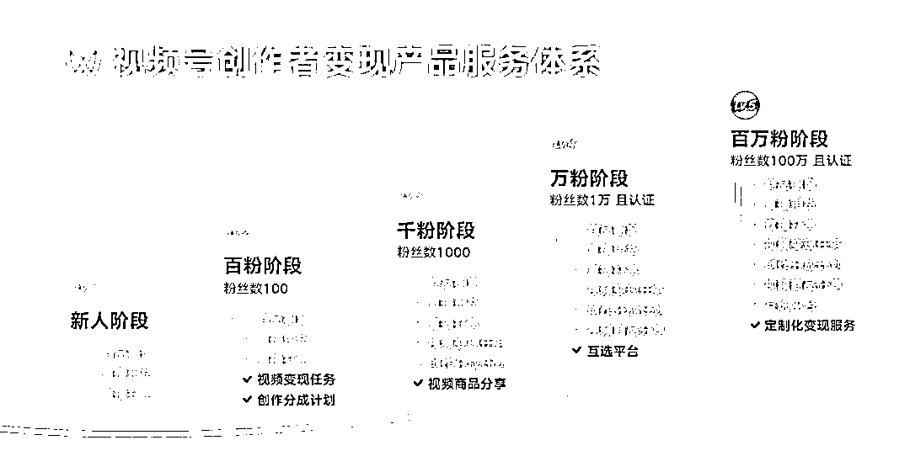
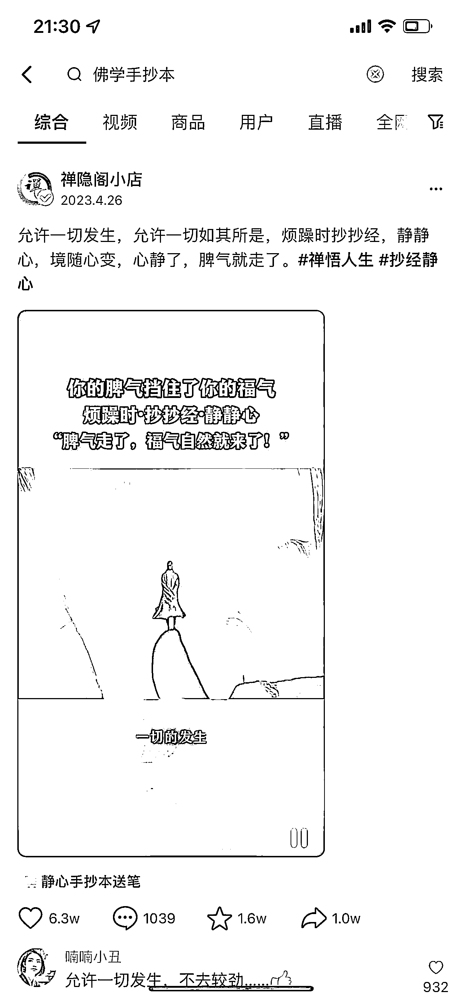
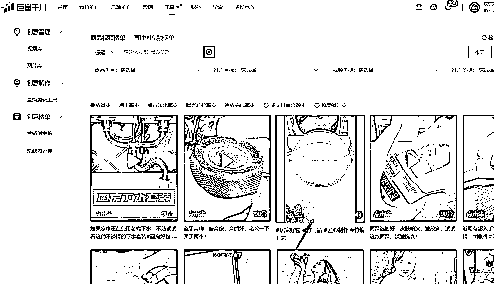
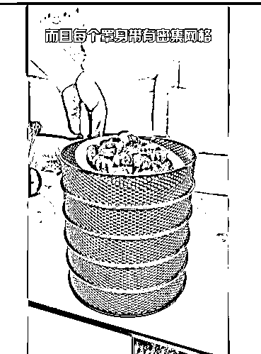
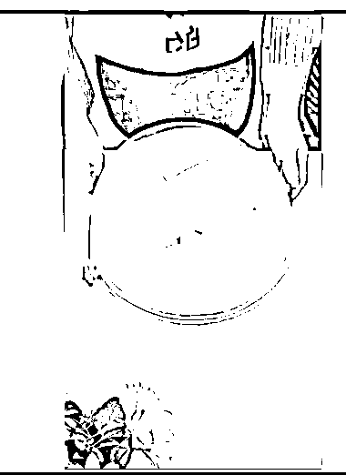
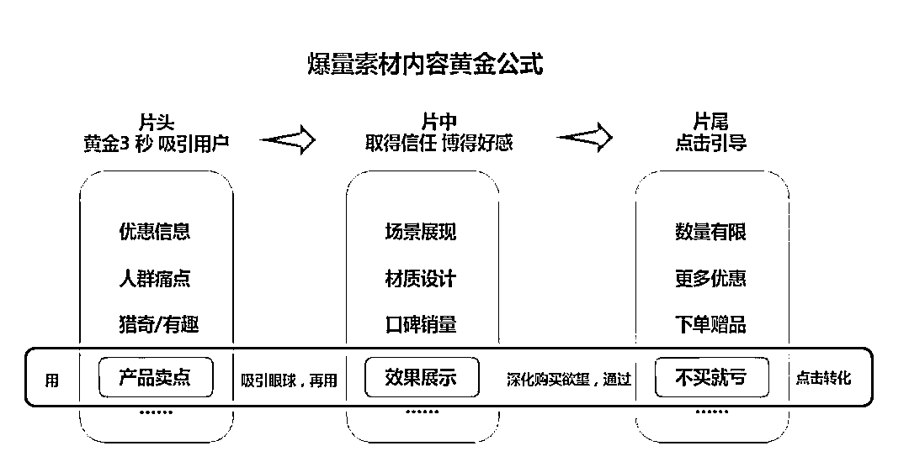
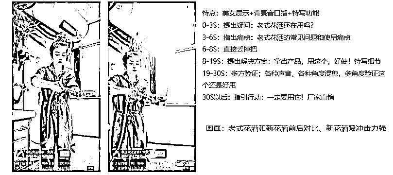
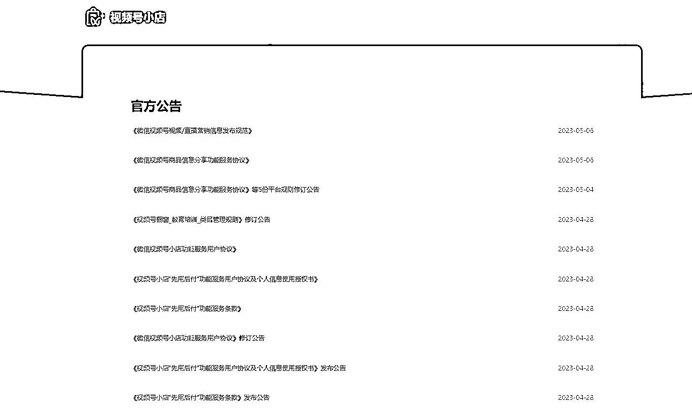

# 视频号带货爆量分享

> 原文：[`www.yuque.com/for_lazy/thfiu8/gyl05vgnbnwk0dhg`](https://www.yuque.com/for_lazy/thfiu8/gyl05vgnbnwk0dhg)

<ne-h2 id="694cdf97" data-lake-id="694cdf97"><ne-heading-ext><ne-heading-anchor></ne-heading-anchor><ne-heading-fold></ne-heading-fold></ne-heading-ext><ne-heading-content><ne-text id="u877dfeeb">(51 赞)视频号带货爆量分享</ne-text></ne-heading-content></ne-h2> <ne-p id="u5d984621" data-lake-id="u5d984621"><ne-text id="u15a9a7aa">作者： 天道电商-东东</ne-text></ne-p> <ne-p id="u13939d52" data-lake-id="u13939d52"><ne-text id="u9f970ae1">日期：2023-07-12</ne-text></ne-p> <ne-p id="ude251269" data-lake-id="ude251269"><ne-text id="ud6b5dfe0">大家好，我是东东，六年互联网创业经验，视频号最高带货单月利润七位数，涉猎多平台电商带货、图文投放、视频号带货，目前深耕视频号自然流带货、付费投放图文、直播带货领域。</ne-text></ne-p> <ne-p id="u91ff35ac" data-lake-id="u91ff35ac"><ne-text id="u388b0c17">在平台规则更新及视频推流的变换下，目前每月视频号自然流 GMV 保持在 30w 以上，所以建议新人做视频号建议还是从自然流入手，快速能获得正反馈，废话不多说，下面开始给大家分享。</ne-text> <ne-text id="uc8e97852">目前，视频号目前日活 6 亿多。视频号视频直播带货正处于新风口上，微信的用户体量大，且目前竞争较小。现在入局，吃一波平台红利还是比较容易的，微信公开课上数据也显示，视频号的消费平均客单价能在 200 元以上。</ne-text></ne-p> <ne-p id="u4fbcc4a3" data-lake-id="u4fbcc4a3"><ne-text id="u7e6079c8">视频号里最大的红利还是带货赚钱，门槛比其他平台低，新人更好入手。</ne-text></ne-p> <ne-p id="u18f26bd5" data-lake-id="u18f26bd5"><ne-card data-card-name="image" data-card-type="inline" id="QHX4N" data-event-boundary="card"></ne-card></ne-p> <ne-p id="u3b7379e4" data-lake-id="u3b7379e4"><ne-text id="ua291d2eb">建议新人还是先做短视频带货流量，把带货流量做起来，熟悉平台推流逻辑及用户喜欢的内容，后期搭配直播流量以及付费流量，快速的放量，后期再引导私域流量，产生复购。</ne-text></ne-p> <ne-p id="uba2f6ccb" data-lake-id="uba2f6ccb"><ne-text id="u88753d0a">现在视频号初步形成了自己的创作者变现体系，涵盖了创作者分成计划、商品橱窗、小任务、互选广告等。</ne-text><ne-card data-card-name="image" data-card-type="inline" id="RDIN7" data-event-boundary="card"></ne-card></ne-p> <ne-p id="ucb0fcf6d" data-lake-id="ucb0fcf6d"><ne-text id="udbafc7f4">，需要账号符合规范，并且官方给你开通商品分享权益，才能使用加热挂车功能。账号符合规范才能开通挂车权限，所以尽量保持视频号账号符合规范且不违规。</ne-text><ne-card data-card-name="image" data-card-type="inline" id="Lho09" data-event-boundary="card"></ne-card></ne-p> <ne-p id="u1ca71855" data-lake-id="u1ca71855"><ne-text id="u32e66f05">预计挂车门槛会变高，竞争门槛变高，原创内容高的优先开通此权限，这对我们长期入局的也是一种优势，所以要尽量增加手里的账号，所以需要挂车转化的一定要保持自己的账号原创度高，内容符合规范，开通了商品分享权益才能更好的转化。</ne-text></ne-p> <ne-p id="u937a7016" data-lake-id="u937a7016"><ne-text id="u6898c57e">所以后续的视频内容原创度会越来越高，这也是平台所扶持的，大家前期去重动作要做好，后期加入实拍内容，才能长期更好的获取流量。</ne-text></ne-p> <ne-p id="u227c10c9" data-lake-id="u227c10c9"><ne-text id="ud3570d32">首先，视频号具有社交属性和信任基础，因此成交率相对较高。</ne-text></ne-p> <ne-p id="udbf1f26f" data-lake-id="udbf1f26f"><ne-text id="ufa64c930">其次，视频号拥有大量的中老年用户，这些人没有刷短视频的习惯，他们的消费决策门槛更高，但消费能力更强。此外，该平台的整体退货率约为 10%。</ne-text></ne-p> <ne-p id="u5fe8213c" data-lake-id="u5fe8213c"><ne-text id="uf9d88b7c">第三，想要在视频号上获得更好的爆单效果，需要了解平台的推流机制。核心是基于用户兴趣画像推荐，往往一个客户在你发完视频后，给你留下互动数据，你的下一条视频他也能刷到。</ne-text></ne-p> <ne-p id="u5c99f79d" data-lake-id="u5c99f79d"><ne-text id="u34dbc268">通过核心画像去挖掘需求下单人群最多的是二三四线城市，中年妇女居多，这个群体占据了视频号成交额的 60%左右，所以我们的选品方向可以围绕中年妇女这个人群来操作。</ne-text></ne-p> <ne-p id="ub76e99b8" data-lake-id="ub76e99b8"><ne-text id="ufa6c2337">中年妇女这个群体，上有老，下有小。老人要保健，各种保健滋补产品很好卖，下有小，孩子要成长，孩子要教育，关于孩子的成长相关的产品，书籍，培训知识都是比较好卖的。中间有自己，中年妇女需要保养的产品，祛斑，补水，修复，服饰，这些都比较好卖，另外家庭使用的家具日用百货食品，也会比较不错的。</ne-text></ne-p> <ne-p id="ud0a644e2" data-lake-id="ud0a644e2"><ne-card data-card-name="image" data-card-type="inline" id="dXMoK" data-event-boundary="card"></ne-card></ne-p> <ne-p id="u5dc2c6c3" data-lake-id="u5dc2c6c3"><ne-text id="u2eb6bcff">红利首先毋庸置疑还是带货，无论是短视频带货还是直播带货，这都是我们新人最快得到正反馈的地方，后期可以打造带货 ip 账号，长期吃到垂类的红利，再引导到私域，产生复购价值，目前要想拿到目前视频号带货红利，主要在选品和视频素材这两个地方发力。</ne-text></ne-p> <ne-p id="ua8e4ec51" data-lake-id="ua8e4ec51"><ne-text id="u6ea05c57">根据人群画像及需求痛点，视频号中老年人居多，所以要懂得换位思考，一开始就选好一个大方向、选择一个看好的大品类，精选一个蓝海类目，再细分领域去测品。</ne-text></ne-p> <ne-p id="u1f4351cd" data-lake-id="u1f4351cd"><ne-text id="u0502e11b">把其中跑的好的品跟素材记录下来，确定一个视频是否能爆除了看播放量还有就是流速，短时间内持续涨粉或者涨播放，这个视频大概率能起量，根据出单及询单量去多发此类目的品。</ne-text></ne-p> <ne-p id="u8a6a8ca7" data-lake-id="u8a6a8ca7"><ne-text id="ud188020b">这里给大家举个例子：</ne-text></ne-p> <ne-p id="u5129714d" data-lake-id="u5129714d"><ne-text id="u975acffa">我们优先选择视频号的视频流量，起量了再考虑开通橱窗去直播带货。</ne-text></ne-p> <ne-p id="u5cb2ae8f" data-lake-id="u5cb2ae8f"><ne-card data-card-name="image" data-card-type="inline" id="oHeHU" data-event-boundary="card"></ne-card></ne-p> <ne-p id="ud963c2fe" data-lake-id="ud963c2fe"><ne-card data-card-name="image" data-card-type="inline" id="SRNWG" data-event-boundary="card"></ne-card></ne-p> <ne-p id="u736b2087" data-lake-id="u736b2087"><ne-card data-card-name="image" data-card-type="inline" id="LNxXz" data-event-boundary="card"></ne-card></ne-p> <ne-p id="uacd4661a" data-lake-id="uacd4661a"><ne-card data-card-name="image" data-card-type="inline" id="LZfM5" data-event-boundary="card"></ne-card></ne-p> <ne-p id="ue3c662c3" data-lake-id="ue3c662c3"><ne-text id="u0e0e0b8a">把抖音快手已经视频号同行跑的好的手抄本素材记录下来，可以搜索关键词【佛学、手抄本、静心抄经】等去找素材，然后混剪测流量。如果跑的好，就可以大量跟，前期简单混剪试试流量，后期稳定了就加原创，再把账号做起来。</ne-text> <ne-text id="u8e4a5d96">这里如果不知道那些素材是优质的，可以参考近期抖音快手或者视频号起量的素材，去模仿混剪。可以看到近期视频号刚开始有同行操作了，我们再去发优质素材也是有量的。</ne-text><ne-card data-card-name="image" data-card-type="inline" id="plhfs" data-event-boundary="card"></ne-card></ne-p> <ne-p id="u97e9cfc5" data-lake-id="u97e9cfc5"><ne-text id="ud12f3711">近期竞争不大，跟品速度也要快，自己混剪的素材如果流量不错，就可以快速跟上，如果流量不行，先换其他类型素材，深度去重，再去测试，最重要就是要执行。测试做 AB 测试，选不同脚本，不同平台，不同时间段发布的素材去测，例如这些素材，保证不同质化</ne-text><ne-card data-card-name="image" data-card-type="inline" id="hfUv6" data-event-boundary="card"></ne-card></ne-p> <ne-p id="u7da995a2" data-lake-id="u7da995a2"><ne-card data-card-name="image" data-card-type="inline" id="zGlPN" data-event-boundary="card"></ne-card></ne-p> <ne-p id="u7194d0a7" data-lake-id="u7194d0a7"><ne-card data-card-name="image" data-card-type="inline" id="kp0sX" data-event-boundary="card"></ne-card></ne-p> <ne-p id="u27a4fa55" data-lake-id="u27a4fa55"><ne-card data-card-name="image" data-card-type="inline" id="XlDXq" data-event-boundary="card"></ne-card></ne-p> <ne-p id="u209941c7" data-lake-id="u209941c7"><ne-text id="u03bd128d">这里给大家分享一下 5 月份的选品种草指南，很多爆品都是可以跟的。</ne-text></ne-p> <ne-p id="ue6c0eec8" data-lake-id="ue6c0eec8"><ne-text id="ufdaa8d69">一：选什么素材：</ne-text></ne-p> <ne-p id="uf80c1a9f" data-lake-id="uf80c1a9f"><ne-text id="u5ac4d0be">二：去哪里找素材：巨量千川</ne-text></ne-p> <ne-p id="u6e4211bd" data-lake-id="u6e4211bd"><ne-text id="ua673bb89">1.打开巨量千川</ne-text></ne-p> <ne-p id="uf2df8892" data-lake-id="uf2df8892"><ne-text id="u5157e0d3">2.找到工具-创意榜单</ne-text> <ne-text id="u9fc28764">3.在里面选取新奇特、优质素材</ne-text> <ne-text id="u35256be3">4.去抖音找相对应的素材去混剪</ne-text><ne-card data-card-name="image" data-card-type="inline" id="Us9pg" data-event-boundary="card"></ne-card></ne-p> <ne-p id="ud0248294" data-lake-id="ud0248294"><ne-card data-card-name="image" data-card-type="inline" id="ACNaI" data-event-boundary="card"></ne-card></ne-p> <ne-p id="uf9389c82" data-lake-id="uf9389c82"><ne-card data-card-name="image" data-card-type="inline" id="DgEn0" data-event-boundary="card"></ne-card></ne-p> <ne-p id="uf43616d9" data-lake-id="uf43616d9"><ne-card data-card-name="image" data-card-type="inline" id="NXsGB" data-event-boundary="card"></ne-card></ne-p> <ne-p id="ue8b27f77" data-lake-id="ue8b27f77"><ne-card data-card-name="image" data-card-type="inline" id="dSGAT" data-event-boundary="card"></ne-card></ne-p> <ne-p id="u19fb211b" data-lake-id="u19fb211b"><ne-text id="u2aa8f311">目前平台越来越注重短视频的原创度，所以在素材方面，一定要避免同质化，内容优先选取稀缺蓝海的优质素材。视频到 10w 播放就会触发人工审核，内容如果同质化严重，或者素材有违规内容，就会触发内容违规，这也是最近自然流容易遇到的情况，所以选取素材时，保证素材优质，尽量蓝海。</ne-text> <ne-text id="u096edc6e">例如下面这两个菜罩，我会优先选木质的菜罩，原因就是塑料菜罩在视频号发布的内容已经较红海，并且素材脚本都是统一的，无较好的创新内容，观众会审美疲劳，同质化的内容跑出来的流量不太好，塑料菜罩同样是好品，但是不太容易跑量。</ne-text><ne-card data-card-name="image" data-card-type="inline" id="bLU9C" data-event-boundary="card"></ne-card></ne-p> <ne-p id="u3a5c39e6" data-lake-id="u3a5c39e6"><ne-card data-card-name="image" data-card-type="inline" id="pARHr" data-event-boundary="card"></ne-card></ne-p> <ne-p id="ue100c5b1" data-lake-id="ue100c5b1"><ne-text id="u9dca9b68">前三秒是吸引观众的关键期，中间就是获得用户群体信任与认同，结尾再引导转化，这就是爆量带货内容的</ne-text><ne-card data-card-name="image" data-card-type="inline" id="nFNDc" data-event-boundary="card"></ne-card></ne-p> <ne-p id="uf3c8dbb6" data-lake-id="uf3c8dbb6"><ne-card data-card-name="image" data-card-type="inline" id="TQ3J1" data-event-boundary="card"></ne-card></ne-p> <ne-p id="u671eca15" data-lake-id="u671eca15"><ne-text id="u95489d8b">再给大家一个短视频内容自查工具，选取素材的时候可以查漏补缺</ne-text><ne-card data-card-name="image" data-card-type="inline" id="mNkdD" data-event-boundary="card"></ne-card></ne-p> <ne-p id="u5c77bd01" data-lake-id="u5c77bd01"><ne-text id="u0a193ae5">从选品、视频场景、再到利益点、音频、人物等，每一个小关键点做好，把素材整体分数做上去，提高爆单率</ne-text><ne-card data-card-name="image" data-card-type="inline" id="liPnL" data-event-boundary="card"></ne-card></ne-p> <ne-p id="u6d08208e" data-lake-id="u6d08208e"><ne-text id="u18d7ecfc">这里分享两个类型的带货视频拆解</ne-text><ne-card data-card-name="image" data-card-type="inline" id="pBXQJ" data-event-boundary="card"></ne-card></ne-p> <ne-p id="uce3e7ed4" data-lake-id="uce3e7ed4"><ne-card data-card-name="image" data-card-type="inline" id="hFbbE" data-event-boundary="card"></ne-card></ne-p> <ne-p id="u1144218e" data-lake-id="u1144218e"><ne-text id="u72542c5a">不要去对抗平台规则，顺应平台长远发展的路，多看看规则，避免违规的规则都写在了公告里面，可以多留意一下</ne-text> <ne-text id="u1267b0d3">并且要重点维护好橱窗分和店铺分，都影响着转化、挂车、加热、优选联盟等功能，所以一定要多看看平台规则</ne-text><ne-card data-card-name="image" data-card-type="inline" id="mmkME" data-event-boundary="card"></ne-card></ne-p> <ne-p id="uea985eed" data-lake-id="uea985eed"><ne-text id="u95afaea1">1）已经爆过的品，换个优质素材或者隔一段时间发布往往也有几率起量。</ne-text> <ne-text id="u46452f9b">2）隔一段时间测之前爆过的品有惊喜</ne-text> <ne-text id="u6610842d">3）多测爆过的品的相似品，以及被市场验证过有市场，可以多花时间测试</ne-text> <ne-text id="u4d601f12">每天花时间去分析视频号广场及抖快近期的爆款带货素材，并且记录分析拆解要点，锻炼自己对素材把控的敏感度，多看看营销视频、爆款内容视频来培养网感，分析素材的特点、痛点、痒点，学习素材整体的脚本，根据不同的目标选取里面新奇特的视频</ne-text> <ne-text id="u2c6b7fa1">长期做的话，一定要慢慢转化到原创，并且原创度高且优质的内容是受平台欢迎的，所以要培养自己原创实拍的能力，把带货账号稳定做起来，长尾流量都是很不错且稳定的</ne-text> <ne-text id="uf86f7fe4">通过矩阵放大来操作，账号放大才能对抗平台不确定的好方法，稳定且只要执行力到位，不可能是赚不到钱的，并且多账号跑出来的概率更高更快，并且对长期主义来说，这也是核心竞争力，只要不下牌桌，短视频永远都是你的红利。</ne-text></ne-p> <ne-hole id="ua6cd8c1f" data-lake-id="ua6cd8c1f"><ne-card data-card-name="hr" data-card-type="block" id="XWler" data-event-boundary="card"><ne-p id="u3ad2a389" data-lake-id="u3ad2a389"><ne-text id="ua914667d">评论区：</ne-text></ne-p> <ne-p id="u91e3305f" data-lake-id="u91e3305f"><ne-text id="u27cabab7">Huang : 怎么加入你的交流群呢？东哥</ne-text> <ne-text id="ua809d1fd">天道电商-东东 : 没有交流群哦</ne-text></ne-p> <ne-p id="u9e3fa8f3" data-lake-id="u9e3fa8f3"><ne-card data-card-name="image" data-card-type="inline" id="XnRuJ" data-event-boundary="card"></ne-card></ne-p> <ne-hole id="u7bc828bb" data-lake-id="u7bc828bb"><ne-card data-card-name="hr" data-card-type="block" id="kTQBM" data-event-boundary="card"></ne-card></ne-hole></ne-card></ne-hole>