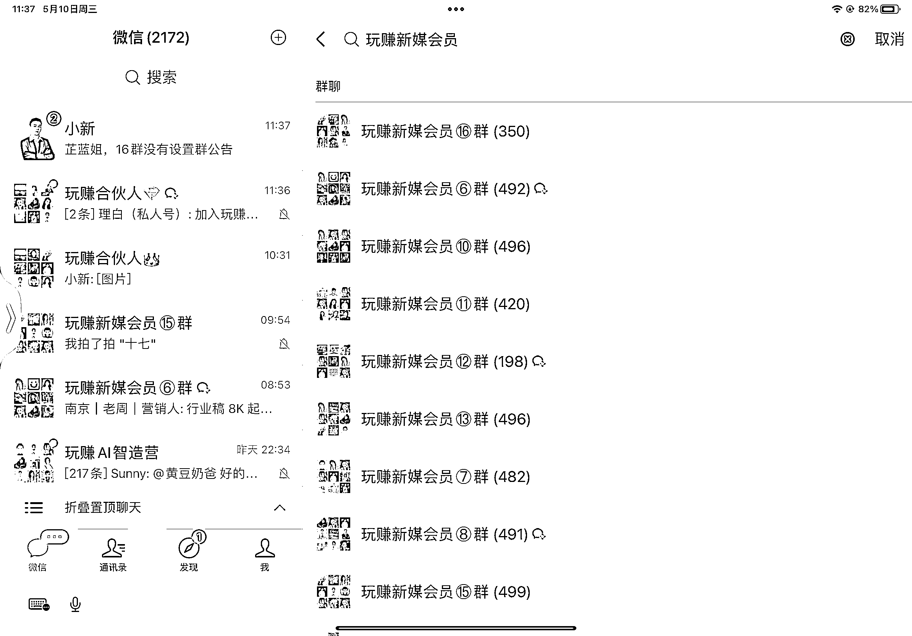

# 社群商业价值提升三要素

> 原文：[`www.yuque.com/for_lazy/thfiu8/fpgi974zibbdr7q4`](https://www.yuque.com/for_lazy/thfiu8/fpgi974zibbdr7q4)

<ne-h2 id="b2f479bc" data-lake-id="b2f479bc"><ne-heading-ext><ne-heading-anchor></ne-heading-anchor><ne-heading-fold></ne-heading-fold></ne-heading-ext><ne-heading-content><ne-text id="u0ccfdc2b">(74 赞)社群商业价值提升三要素</ne-text></ne-heading-content></ne-h2> <ne-p id="ue9a39df0" data-lake-id="ue9a39df0"><ne-text id="u31c702fa">作者： 芷蓝</ne-text></ne-p> <ne-p id="u86bbf1bb" data-lake-id="u86bbf1bb"><ne-text id="u7bcb2128">日期：2023-07-14</ne-text></ne-p> <ne-p id="u98048e11" data-lake-id="u98048e11"><ne-text id="u659d54dc">Hello，我是芷蓝，非常开心这次能在航海过程中给大家分享一些关于社群运营的小技巧。感谢生财官方对芷蓝的认可，感谢九儿和静伟的邀请。</ne-text></ne-p> <ne-p id="uaed9ae95" data-lake-id="uaed9ae95"><ne-text id="u354bd923">本次我将会从以下 3 个维度来为大家分享社群运营的相关内容。</ne-text></ne-p> <ne-p id="u00f939d8" data-lake-id="u00f939d8"><ne-text id="u7dbdd2f6">① 如何提高社群活跃度？</ne-text> <ne-text id="u1656915b">② 如何提高社群原创内容？</ne-text> <ne-text id="u36dfd71c">③ 社群的商业模式如何升级？</ne-text></ne-p> <ne-p id="u3507a908" data-lake-id="u3507a908"><ne-text id="uce7a21e7">第一句话我就要敲黑板，请大家思考一个问题：</ne-text></ne-p> <ne-p id="u89c32651" data-lake-id="u89c32651"><ne-text id="u7e5f34b0">我自己运营了 16 付费会员群，5000+人以上，运营了 4 年多了，还有 2 个高客单价的合伙人群，也运营了 1 年多了。</ne-text></ne-p> <ne-p id="u7de0e76a" data-lake-id="u7de0e76a"><ne-text id="u4a044aa5">我自己从一开始拼了命去活跃社群，到想明白了社群活跃的意义，用了很长时间，中间踩了不少坑。</ne-text><ne-card data-card-name="image" data-card-type="inline" id="ZXa4D" data-event-boundary="card"></ne-card></ne-p> <ne-p id="u7d5036cf" data-lake-id="u7d5036cf"><ne-text id="u0219c63a">记住一句话：</ne-text></ne-p> <ne-p id="u0f42e769" data-lake-id="u0f42e769"><ne-text id="ub4856f2f">我的建议是：</ne-text></ne-p> <ne-p id="u02ef0024" data-lake-id="u02ef0024"><ne-text id="uca9b75d6">个体创业者的特点是一个人干活，前期你可能会为了群活跃，耗费自己大量的精神和心力，但是人的体力是有限的，当累了疲了的时候，你的运营动作可能就走形了，而用户前后感受不好，反而适得其反。</ne-text></ne-p> <ne-p id="u92d75be2" data-lake-id="u92d75be2"><ne-text id="uf811875e">比如我的普通会员群，基本是不做运营的，内容都在星球上，只是每周有固定的时间节点，小助理会操作一下，大概有两个动作：</ne-text></ne-p> <ne-p id="u38450616" data-lake-id="u38450616"><ne-text id="ua6b1e6e9">比如非卖货群不需要搞太多的气氛，尤其是知识付费，过多的活跃反而会干扰真正想学习链接的用户。而卖货群需要情绪的引导，所以要有适当的活跃气氛，这样用户才能去下单，才能接龙下单。</ne-text></ne-p> <ne-p id="u45d3b312" data-lake-id="u45d3b312"><ne-text id="u882f9ce1">我截了几张社群的图，大家可以尝试感受一下：</ne-text><ne-card data-card-name="image" data-card-type="inline" id="aeOgs" data-event-boundary="card"></ne-card></ne-p> <ne-p id="uf9809aae" data-lake-id="uf9809aae"><ne-card data-card-name="image" data-card-type="inline" id="kFfm6" data-event-boundary="card"></ne-card></ne-p> <ne-p id="ub2a21e30" data-lake-id="ub2a21e30"><ne-card data-card-name="image" data-card-type="inline" id="tTFi7" data-event-boundary="card"></ne-card></ne-p> <ne-p id="uc0d96a95" data-lake-id="uc0d96a95"><ne-text id="ud5e18191">知道自己是轻运营还是重要运营之后，我们才能根据自己当前的需求去做特定的动作。</ne-text></ne-p> <ne-p id="ubcc81e2c" data-lake-id="ubcc81e2c"><ne-text id="u8c5c6a89">接下来我就跟大家分享 9 个我验证过能够提高社群活跃度的方法。</ne-text></ne-p> <ne-p id="uc99a14f1" data-lake-id="uc99a14f1"><ne-text id="uda0504bf">1、如果不紧急，最好让用户在晚上 8-10 点这个时间段进群，保证进群后，大家有时间互动。</ne-text></ne-p> <ne-p id="u36dcd143" data-lake-id="u36dcd143"><ne-text id="ufb9efda2">2、进群前，给到新用户自我介绍模板，并且在社群里提高告知有新伙伴要进群，这样就保证进群后，聚光灯可以都在新用户身上，体验会更好。</ne-text></ne-p> <ne-p id="ub9fa121c" data-lake-id="ub9fa121c"><ne-text id="u66c6bdad">3、所有的自我介绍和分享都要先发红包再进行，顺序出错了大家抢红包就会把之前的内容给覆盖了。</ne-text></ne-p> <ne-p id="ufb3feff0" data-lake-id="ufb3feff0"><ne-text id="u2afd77d5">4、用户进群后，你要根据用户的位置和能力标签，主动给用户介绍下，并且@一下群里相同标签的人，主动帮新人链接老用户，这样就能调动社群气氛。</ne-text></ne-p> <ne-p id="u1e587ffb" data-lake-id="u1e587ffb"><ne-text id="u0842d369">5、用户进群后，群主或者管理尽量用社群专属的表情包 logo 去引导大家欢迎，即航海手册中的社群亚文化，盖楼是社群活跃度的最原始展现形式，也是最好用的。</ne-text></ne-p> <ne-p id="u84e1d55e" data-lake-id="u84e1d55e"><ne-card data-card-name="image" data-card-type="inline" id="H4DJW" data-event-boundary="card"></ne-card></ne-p> <ne-p id="u6448d418" data-lake-id="u6448d418"><ne-text id="uf5bbad41">以上 5 个就是用户进群前后需要注意的一些运营动作，既是调节了气氛保证了活跃度，又让新用户感受到了社群对他的关注，体验感增强。</ne-text></ne-p> <ne-p id="u5ba0415b" data-lake-id="u5ba0415b"><ne-text id="u3ac4173a">接下来我再说说日常运营过程中如何通过一些小技巧去调动社群的气氛。</ne-text></ne-p> <ne-p id="u928dd1c6" data-lake-id="u928dd1c6"><ne-text id="ufd889600">6、矩阵社群要在固定的时间段内换血。</ne-text> <ne-text id="uf7d4d39f">比如我的十几个社群，基本上就是半年换一次，让社群的伙伴可以接触到新的伙伴，人与人之间的连接就能为社群产出新的社交关系和内容。</ne-text></ne-p> <ne-p id="ued47b971" data-lake-id="ued47b971"><ne-text id="ue9806879">7、社群一定要造星，要让社群里的用户非常喜欢你们社群里的明星，一小部分人，因为喜欢一个人，才能留在社群里，这些社群明星可以让 1 个社群从群主的点状发射单向链接，到网状发射，社群关系就会更牢靠。</ne-text></ne-p> <ne-p id="u1cfc8ba8" data-lake-id="u1cfc8ba8"><ne-text id="u0d845b99">其实这也是我自己社群去中心化的一个方法，社群只有去了中心化，才能不依靠群主，自己运转活跃下去。</ne-text></ne-p> <ne-p id="u2946ed91" data-lake-id="u2946ed91"><ne-text id="u89b0e967">另外，社群的明星也能够帮助做线下活动，裂变邀请等运营动作。我自己的社群里就有明显，他们或者是销冠，或者是线下活动的高手，总之他们让这个社群拥有长久的活力。</ne-text></ne-p> <ne-p id="uedb468c9" data-lake-id="uedb468c9"><ne-text id="uc9cb3f11">8、社群要建立自己的一套积分制度或者销售排行，最好是可以组建战队，大家共同参与一个项目，才能激活社群用户与用户之间的关系，关系是在紧密协作中建立起来的。</ne-text></ne-p> <ne-p id="u3af77445" data-lake-id="u3af77445"><ne-text id="u3b238e1c">如果你觉得积分制度太过繁琐，其实可以考虑用知识星球自带的功能，设置好激励制度即可。</ne-text></ne-p> <ne-p id="u625285ae" data-lake-id="u625285ae"><ne-text id="ue7cfa7dd">我常用的激励制度很简单，分为流量曝光、红包打赏和奖品这 3 个维度：</ne-text></ne-p> <ne-p id="uf0675dc4" data-lake-id="uf0675dc4"><ne-card data-card-name="image" data-card-type="inline" id="fSSeT" data-event-boundary="card"></ne-card></ne-p> <ne-p id="u9ac756fa" data-lake-id="u9ac756fa"><ne-card data-card-name="image" data-card-type="inline" id="jR0Po" data-event-boundary="card"></ne-card></ne-p> <ne-p id="u35625c50" data-lake-id="u35625c50"><ne-text id="u0ba11392">其实我不建议社群设置过多的运营路径，一旦让用户看起来很复杂，用户的参与度就会降低，社群的活跃度就跟着降低了。</ne-text></ne-p> <ne-p id="u7a4888ac" data-lake-id="u7a4888ac"><ne-text id="u9183711a">9、社群要时常组织线下活动，活动的规模根据自己的运营成本而决定。</ne-text></ne-p> <ne-p id="u693f3b3b" data-lake-id="u693f3b3b"><ne-text id="u4b821a8c">比如我自己这边只做小活动，且只针对高客单价付费社群来举行。因为我没有那么大的运营团队，组织大规模的活动成本过高，需要考虑的事情过多。</ne-text></ne-p> <ne-p id="u2b42abba" data-lake-id="u2b42abba"><ne-text id="u8b191237">因此我的社群线下活动只针对我的合伙人，他们可以在自己城市自由组织，而我一般每个月会有 2 次去全国各个地方见他们，聊聊近期情况，交流一些经验。一个是给到大家更好的 IP 咨询服务，一个是也是我自己每个月可以出去玩玩。</ne-text></ne-p> <ne-p id="ub3790470" data-lake-id="ub3790470"><ne-text id="u44bc67b1">我始终认为，优质的沟通和社交关系的建立一定建立在小的场景里。</ne-text><ne-card data-card-name="image" data-card-type="inline" id="vLFA5" data-event-boundary="card"></ne-card></ne-p> <ne-p id="u7cce995e" data-lake-id="u7cce995e"><ne-card data-card-name="image" data-card-type="inline" id="Hzbdz" data-event-boundary="card"></ne-card></ne-p> <ne-p id="uef631442" data-lake-id="uef631442"><ne-card data-card-name="image" data-card-type="inline" id="I7kkR" data-event-boundary="card"></ne-card></ne-p> <ne-p id="ud2106b73" data-lake-id="ud2106b73"><ne-card data-card-name="image" data-card-type="inline" id="h9tmr" data-event-boundary="card"></ne-card></ne-p> <ne-p id="ufd4eca9d" data-lake-id="ufd4eca9d"><ne-text id="ud42d9654">👌 关于社群活跃度大致就是这几个技巧了，希望大家可以多尝试，不一定适合每个社群，但是好的玩法一定是根据自己的业务一次次的尝试后沉淀下来的。</ne-text></ne-p> <ne-p id="u33f0b5b7" data-lake-id="u33f0b5b7"><ne-text id="u4d9e4a9d">我先说方法论吧，其实很简单，那就是要</ne-text></ne-p> <ne-p id="u814ac5c0" data-lake-id="u814ac5c0"><ne-text id="ub0f262b0">你要相信，人的天性都是懒的，看书写字一个输入一个输出，这是在和人性做抵抗，没有一点正向反馈，谁也不愿意去干。</ne-text></ne-p> <ne-p id="ud0d9c928" data-lake-id="ud0d9c928"><ne-text id="ua11c7efb">我在做社群的初期，最发愁也是社群里没人分享内容，星球都是我一个人在写，不是写不出来，而是很累，而且内容单调。</ne-text></ne-p> <ne-p id="u5a296901" data-lake-id="u5a296901"><ne-text id="uf51b2b46">怎么办？我当初的做法就是，我自己去买付费的营销工具，拿出来主动给用户去用，比如说小鹅通、一起学堂、零一裂变等等，这些都是用户在做私域营销过程中需要用到的产品，如果自己去买需要花一笔费用，现在我免费给你用，用完你给我输出一篇复盘文章即可。</ne-text></ne-p> <ne-p id="u73a26b10" data-lake-id="u73a26b10"><ne-text id="u3cc5296b">输出完之后，我还会帮你去做社群里的流量曝光，去推你的名片，这个正反馈就会非常明显，会有人去家你的微信，去买你的产品，去给你点赞等等。</ne-text></ne-p> <ne-p id="u4485e0f2" data-lake-id="u4485e0f2"><ne-text id="u29e365b2">而这些正反馈也会让更多的人参与到这个内容生产的过程中来，谁也不傻，引流这个事非常痛苦，尤其是精准的流量，如果自己做内容输出，有群主愿意给你去曝光，还是很值的。</ne-text></ne-p> <ne-p id="u16fb1ed1" data-lake-id="u16fb1ed1"><ne-text id="udcd4e117">所以，我建议各位小伙伴可以吧自己的社群的基础建设做的更好一些，千万不要相信一个人的毅力，你把环境准备的越好，人动起来的速度就越快。</ne-text></ne-p> <ne-p id="u7d7373b6" data-lake-id="u7d7373b6"><ne-text id="u9800fc36">我平时在鼓励我合伙人小伙伴输出的时候，甚至把选题+框架都准备好了，写完我还给你去推流量，这种情况下他们才愿意动起来，而一旦动起来，有正反馈了，自己就知道继续了，别人看到也眼红了，这个正向循环就走起来了。</ne-text></ne-p> <ne-p id="uc3e50669" data-lake-id="uc3e50669"><ne-text id="uc0c2e61f">剩下的就是制造一些可以晒的素材，比如说上榜名片啊，积分名片啊，让用户在输出素材后可以把自己的成绩晒到朋友圈被别人看到，这个也是一个精神爽点。</ne-text></ne-p> <ne-p id="u1ffee701" data-lake-id="u1ffee701"><ne-text id="u5c782201">做社群真的就是人力搭起来的，生财的约稿大家都知道，星球这么多篇优质的内容，背后是生财团队小伙伴的辛苦付出。</ne-text></ne-p> <ne-p id="u127aae90" data-lake-id="u127aae90"><ne-text id="uc6d41c1a">我也是一样，想让自己社群生产更多的原创素材，不是光有激励就行的，你需要去挖掘用户的能量，看到谁在某方面做的不错，就要点对点的去私信他，鼓励他多输出，然后给他输出方向等等。</ne-text></ne-p> <ne-p id="u13e9625a" data-lake-id="u13e9625a"><ne-text id="u2ae46c63">这个没办法，如果你没有团队，就自己一个个的去问吧，每周给自己规规定一个数量，要私信多少人，要生产多少篇文章。</ne-text></ne-p> <ne-p id="ueb600d85" data-lake-id="ueb600d85"><ne-text id="u512796de">社群商业模式升级，听起来可能会觉得有些高级，但说俗一点，所有商业模式升级的意义无非 2 件事，一个是减少运营成本，一个是增加你的收益，社群也不例外。</ne-text></ne-p> <ne-p id="ub88bdb07" data-lake-id="ub88bdb07"><ne-text id="u123ce822">拿我自己的社群来说，我的商业模式升级就是创造了合伙人这个更高端的社群。</ne-text></ne-p> <ne-p id="udaa42740" data-lake-id="udaa42740"><ne-text id="uf47b59b0">我来分享一下我的创造过程，以及如何通过这个新的产品来释放更多的社群动力源，以及如何获得资源整合后的更多收益。</ne-text></ne-p> <ne-p id="ua7bd7f53" data-lake-id="ua7bd7f53"><ne-text id="u9479ec11">首先当你想改变自己的社群商业时，你要舍弃自己的一个核心产品收益，用来换取更多的资源链接。</ne-text></ne-p> <ne-p id="ub5dbfdb9" data-lake-id="ub5dbfdb9"><ne-text id="uf720e9c4">而普通用户数量的累积，又能够再次反向衬托出你这个高端产品背后的权益。</ne-text></ne-p> <ne-p id="u76de03d8" data-lake-id="u76de03d8"><ne-text id="u20ffdfa4">所以说如果你想升级你的社群模式，</ne-text></ne-p> <ne-p id="ud5b71b90" data-lake-id="ud5b71b90"><ne-text id="u417254fb">提炼出你这个社群现在所涵盖的核心价值是什么？这个核心价值是你的筹码，是你用来换取别人资源的一个筹码，一旦你能够换取成功，那么接下来你就可以得到对方的相应资源，这个资源，就可以驱动你原有社群的一种升级，无论是内容上的还是运营模式上的。</ne-text></ne-p> <ne-p id="ud73454da" data-lake-id="ud73454da"><ne-text id="u4a433aee">当你换取成功之后，</ne-text></ne-p> <ne-p id="ua9ec4128" data-lake-id="ua9ec4128"><ne-text id="u1459026c">拿我自己的合伙人社群来说，新资源的整合为我带来了更多的营销机会，比如说 to B 端，比如说 to G 端的，这些都是优质资源进行碰撞，整合之后产生的新机会。</ne-text></ne-p> <ne-p id="u2a7a9878" data-lake-id="u2a7a9878"><ne-text id="u445b4150">当你成功换取资源，又对资源进行了整合，重新输出之后，</ne-text></ne-p> <ne-p id="u0ecb7eb6" data-lake-id="u0ecb7eb6"><ne-text id="ue28ec2e6">我去年在思考过程中，沉淀下来一套，乐高商业模型的原创玩法。</ne-text></ne-p> <ne-p id="uae8d560e" data-lake-id="uae8d560e"><ne-text id="u63a67aa0">什么是乐高商业模型？它具有什么样的特质？</ne-text></ne-p> <ne-p id="u2e9ce866" data-lake-id="u2e9ce866"><ne-text id="uf2923390">模块标准化，设计图多样化，结果丰富可无限拓展。</ne-text></ne-p> <ne-p id="u43d1b088" data-lake-id="u43d1b088"><ne-text id="u0fdeaf41">比如说在我的乐高商业模型里面，行业＋技能＋人，就是一个最基础的组合版图，它可以让不同的高端玩家在一个新的商业模式下产生更多的商业价值。</ne-text></ne-p> <ne-p id="u25454163" data-lake-id="u25454163"><ne-text id="ubac42d0c">社群的 2.0 是去中心化，我认为社群的 3.0 模式就是乐高商业，由社群创建者去主导的，市场需求导向商业价值组合。</ne-text></ne-p> <ne-p id="uc02a85a2" data-lake-id="uc02a85a2"><ne-text id="uafe614e6">在这个组合里面所有的参与者都会得到，自己的一份收益，而且又为你的社群，产品库，积累了新的能量。</ne-text></ne-p> <ne-p id="u195c4608" data-lake-id="u195c4608"><ne-text id="ucac94e5d">好啦，这个就是今天为大家分享的所有内容，如果有什么问题欢迎大家随时和我沟通。</ne-text></ne-p> <ne-hole id="ud6fc6d64" data-lake-id="ud6fc6d64"><ne-card data-card-name="hr" data-card-type="block" id="gjkfe" data-event-boundary="card"><ne-p id="uecead87f" data-lake-id="uecead87f"><ne-text id="uc52caa3d">评论区：</ne-text></ne-p> <ne-p id="u58c69f33" data-lake-id="u58c69f33"><ne-text id="ud5c175f6">梁靠谱 : 芷蓝姐 yyds</ne-text> <ne-text id="u371dd8ad">Kris 王 : 芷蓝姐 YYDS（敬礼）</ne-text> <ne-text id="u9ec05f1c">小女巫忻忻 : 芷蓝 yyds！</ne-text> <ne-text id="u042ff9c5">赵承纬 : 芷蓝姐 yyds</ne-text> <ne-text id="u824f43ad">轨迹 LLC : 芷蓝姐 yyds</ne-text> <ne-text id="u00ac0174">小米 : 芷蓝姐 yyds!</ne-text> <ne-text id="u088294cb">张可粒 : 芷蓝姐 yyds！</ne-text> <ne-text id="u7c14d89d">孟 _MENG : 芷蓝姐 YYDS（敬礼）</ne-text></ne-p> <ne-p id="u389e97c7" data-lake-id="u389e97c7"><ne-card data-card-name="image" data-card-type="inline" id="URkS8" data-event-boundary="card"></ne-card></ne-p> <ne-hole id="u644a82ac" data-lake-id="u644a82ac"><ne-card data-card-name="hr" data-card-type="block" id="ttzms" data-event-boundary="card"></ne-card></ne-hole></ne-card></ne-hole>