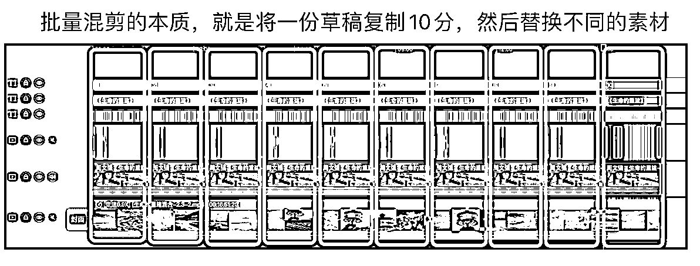
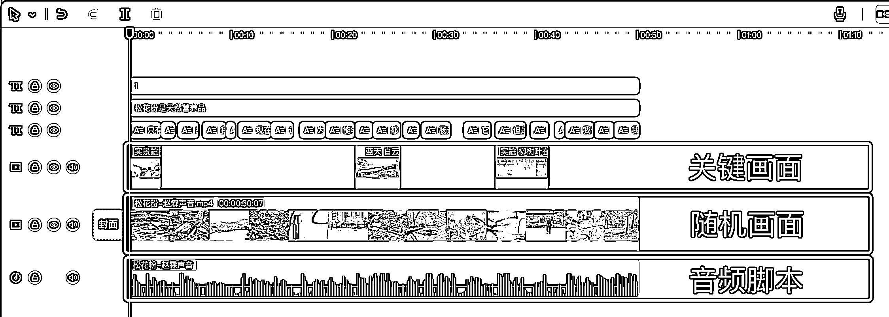
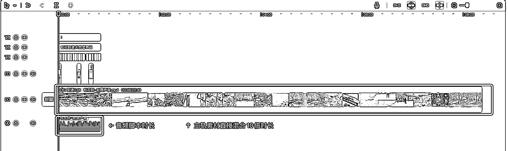

# 短视频混剪逻辑和去重设计

> 原文：[`www.yuque.com/for_lazy/thfiu8/hg3p31krm7gmi12x`](https://www.yuque.com/for_lazy/thfiu8/hg3p31krm7gmi12x)

<ne-h2 id="117d5702" data-lake-id="117d5702"><ne-heading-ext><ne-heading-anchor></ne-heading-anchor><ne-heading-fold></ne-heading-fold></ne-heading-ext><ne-heading-content><ne-text id="u16bb28f4">(精华帖)(263 赞)短视频混剪逻辑和去重设计</ne-text></ne-heading-content></ne-h2> <ne-p id="u38880b92" data-lake-id="u38880b92"><ne-text id="u002ee68b">作者： 奇杰</ne-text></ne-p> <ne-p id="ue59627d4" data-lake-id="ue59627d4"><ne-text id="u6570f80d">日期：2023-07-10</ne-text></ne-p> <ne-p id="u64abf37b" data-lake-id="u64abf37b"><ne-text id="u9c34f58c">短视频混剪逻辑和去重设计</ne-text></ne-p> <ne-p id="uab889462" data-lake-id="uab889462"><ne-text id="uc4a01786">大家好，我是奇杰。一个短视频带货创业者，也是「单人日产 200 条」批量混剪研发人，很荣幸为大家做本次航海分享。</ne-text></ne-p> <ne-p id="u2ffbc14e" data-lake-id="u2ffbc14e"><ne-text id="uec54bca7">我早前是传统行业的市场运营，后来是互联网公司的产品经理，现在是一个短视频带货的创业者。也许是因为之前有过做“产品经理”的经历，所以我对做“产品”的兴趣非常大。</ne-text></ne-p> <ne-p id="u5c973f9c" data-lake-id="u5c973f9c"><ne-text id="ud5b3f9b6">作为一个短视频项目创业人，我们的“产品”是什么呢？当然就是我们创作的“视频”。产品生产的“质”与“量”是影响生意好坏的关键因素。这条原则，放在我们做短视频项目上也是适用的。我们的“视频产品”好不好，生产能力强不强，直接影响我们的变现水平。</ne-text></ne-p> <ne-p id="u98264778" data-lake-id="u98264778"><ne-text id="u5d0ff65f">但是我发现很多圈友不重视“视频生产”这个问题，只对“变现”的“话题”感兴趣，对“变现”的“前提”却不关心。别人为什么能高效“变现”呢？这个问题考验我们的认知水平。</ne-text></ne-p> <ne-p id="u663fc482" data-lake-id="u663fc482"><ne-text id="u9c49e3a4">也许有的朋友会说：赛道找的好，选品选的好，内容找的好，号多，运气好，产品卖的多。这些答案都没错，但是却忽略了“能大量生产优质视频”这个大前提。这个大前提是“皮”，上面提到的都是长在皮上的“毛”，皮之不存，毛将焉附？</ne-text></ne-p> <ne-p id="uf0ed265f" data-lake-id="uf0ed265f"><ne-text id="u8de4a044">如果不能持续且大量的生产出合格的视频，那“选赛道、选品、找内容、分析数据”等等这些操作又能发挥什么价值呢？为了帮助大家认识这个问题，我给大家准备了两组图片。</ne-text></ne-p> <ne-p id="ub81cf1b9" data-lake-id="ub81cf1b9"><ne-card data-card-name="image" data-card-type="inline" id="FjDwn" data-event-boundary="card"></ne-card></ne-p> <ne-p id="u6cc8e72f" data-lake-id="u6cc8e72f"><ne-card data-card-name="image" data-card-type="inline" id="sBfCc" data-event-boundary="card"></ne-card></ne-p> <ne-p id="u3f04f65b" data-lake-id="u3f04f65b"><ne-text id="uc50dd6d3">为大家准备这两组图，是为了让大家意识到两个问题：</ne-text> <ne-text id="u316bbaa2">1.基础能力的重要性：如果没有基础能力，任何“运营”和“变现”都是空谈。</ne-text> <ne-text id="u12f7a450">2.“工具性技能”的重要性：不掌握“工具性技能”，就做不出合格的“变现产品”。</ne-text></ne-p> <ne-p id="u8179b5b5" data-lake-id="u8179b5b5"><ne-text id="ua4a1a972">我们做短视频项目，基础能力和工具性技能就是剪辑视频。项目启动，你面临的第一个问题就是剪视频，而且是需要长期面对的问题，无法回避。</ne-text></ne-p> <ne-p id="u6a7aa11b" data-lake-id="u6a7aa11b"><ne-text id="u42af3903">也许大家听说过不用剪视频的玩法，也听说过自动生产视频的软件，还听说过纯搬运的技巧。如果大家耗费时间和精力去尝试这些，你就会明白：你有多天真，它就有多坑。至于坑在哪，不在本次讨论范围之内。</ne-text></ne-p> <ne-p id="ue5e75e86" data-lake-id="ue5e75e86"><ne-text id="uef649954">大家只需要知道：做短视频项目，剪辑功底很重要。任何幻想和捷径都是徒劳的，唯有脚踏实地学好剪辑基本功，才是唯一的正道。我们从宏观和微观两个角度，分析了“剪辑能力”在短视频项目中的重要性，就是希望大家认识到剪辑的重要性，抛开幻想，用心学习。</ne-text></ne-p> <ne-p id="uf6a978dc" data-lake-id="uf6a978dc"><ne-text id="u6c93ef57">接下来我们分享：带货视频的剪辑逻辑</ne-text></ne-p> <ne-p id="uf148d716" data-lake-id="uf148d716"><ne-text id="ud3fa76b7">在分享之前，跟大家声明两点：</ne-text> <ne-text id="u690cabe2">1.学习这部分内容，需要有一定的剪辑经验，纯新手可以先收藏。</ne-text> <ne-text id="u5e5ca055">2.以下分享是在「单人日产 200 条」批量混剪的实操基础上展开的，没有看过教程的同学，可以去航海手册查看。</ne-text> <ne-text id="ubdfe1498">航海手册链接：</ne-text></ne-p> <ne-p id="ub45acb45" data-lake-id="ub45acb45"><ne-card data-card-name="image" data-card-type="inline" id="Pb5yX" data-event-boundary="card"></ne-card></ne-p> <ne-p id="ue2e845a8" data-lake-id="ue2e845a8"><ne-text id="uc0ca5aaa">「单人日产 200 条实战教程」发布以后，很多圈友都在学习和模仿。随后我就发现了一个问题：大家看起来会用批量混剪的方法了，但是大部分圈友没有融会贯通，只会模仿教程的排版，做不到灵活运用。把“批量混剪”的技术给用死了，没有发挥它应有的价值。</ne-text></ne-p> <ne-p id="uc77f0fda" data-lake-id="uc77f0fda"><ne-text id="ub989207f">没有看过「单人日产 200 条」批量混剪视频教程的同学，可以查看链接：</ne-text></ne-p> <ne-p id="uabfb32ed" data-lake-id="uabfb32ed"><ne-text id="u4b1e937e">导致这个问题的原因也很简单：大家只学会了剪辑排版，却没有搞明白“方法背后的逻辑”。也就是“只知道是这样做，但是不知道为啥要这样做”。这也是我们常说的“知其然，不知其所以然。”</ne-text></ne-p> <ne-p id="ue3053502" data-lake-id="ue3053502"><ne-text id="u0d19f0f3">我在课程中常常会强调一句话：动作是为用途服务的。搞明白“动作背后的用途”，才能知道“动作该怎么做”，才不会在实操时抓瞎，然后只能生硬模仿教程排版。</ne-text></ne-p> <ne-p id="uc94c7d52" data-lake-id="uc94c7d52"><ne-text id="u6a37ef28">“批量混剪”的本质，是将一组排版好的视频草稿复制 10 份，然后再更换不同的素材，来达到 10 个视频都不同的效果。只不过为了剪辑更方便更高效，将排版的结构进行了一些优化。</ne-text></ne-p> <ne-p id="uca16b7df" data-lake-id="uca16b7df"><ne-card data-card-name="image" data-card-type="inline" id="KSEyC" data-event-boundary="card"></ne-card></ne-p> <ne-p id="uea579070" data-lake-id="uea579070"><ne-text id="ucbb3bd74">不了解的同学，可以看一下上次航海的分享《单人日产 200 条之‘批量思维’》：</ne-text></ne-p> <ne-p id="ue0e0dff0" data-lake-id="ue0e0dff0"><ne-text id="u051d461b">无论是一次剪一个视频，还是一次剪 10 个视频，组成视频的三要素都是不变的：音频、画面、文字</ne-text></ne-p> <ne-p id="ub6fa4a7c" data-lake-id="ub6fa4a7c"><ne-card data-card-name="image" data-card-type="inline" id="OlOKs" data-event-boundary="card"></ne-card></ne-p> <ne-p id="u7213f592" data-lake-id="u7213f592"><ne-text id="ud5f244e6">音频是“内容”的重要载体，作品能不能调动用户的情绪，能不能引发用户的兴趣，音频起了很关键的作用。我们都知道好脚本很重要，“脚本”在视频中的体现形式，多数是以音频出现的。</ne-text></ne-p> <ne-p id="u9bc87166" data-lake-id="u9bc87166"><ne-text id="u4992fb62">我们做混剪，就是将找到的“好内容”作为脚本，进行二次加工。我们主要使用的就是原视频的“音频内容”，我称之为“音频脚本”。找好“音频脚本”，再根据脚本内容重新配置画面，这就是官方说的“二次创作”，也就是我们说的“混剪”。</ne-text></ne-p> <ne-p id="ue8a01bff" data-lake-id="ue8a01bff"><ne-text id="ue527a74c">找“音频脚本”的时候，除了要看高赞高转化。从剪辑的角度，我们还需要考虑“画面关联性强弱”的问题，这个决定了二次加工时的制作难度。我们要找“画面关联性相对较弱”的音频脚本，这样制作起来才能快速高效。</ne-text></ne-p> <ne-p id="u58192bb8" data-lake-id="u58192bb8"><ne-text id="ub191d49b">“画面关联性相对较弱”是指：大部分音频内容对画面的关联性没有太高要求，只在某些重点句上对画面的关联性有要求。如果目标脚本的每一句文案，都必须对应某个特定画面，这样的脚本大家就别用了。因为使用批量混剪，就是为了提高效率，所以这种影响效率的脚本，不适合批量混剪。</ne-text></ne-p> <ne-p id="u413e989e" data-lake-id="u413e989e"><ne-text id="uc223c0d9">我们需要根据自己使用的技术方法，去寻找适合的原视频做脚本，不要任意找一个脚本来“难为技术”。因为我们想快速生产内容，所以找的音频脚本要更适合“快速混剪”。</ne-text></ne-p> <ne-p id="u1f2b9e99" data-lake-id="u1f2b9e99"><ne-text id="u2315533b">关于原视频下载和处理，我给大家分享两个小程序：</ne-text></ne-p> <ne-p id="u596b87a5" data-lake-id="u596b87a5"><ne-text id="u3fa011fa">【去水印下载原视频】</ne-text> <ne-text id="ud2bc29b4">#小程序://去水印用轻抖/pyOKLEifCGmhpwa</ne-text></ne-p> <ne-p id="uc5974082" data-lake-id="uc5974082"><ne-text id="u7f86c3bc">【分离原视频中人声和背景音乐】</ne-text> <ne-text id="uc9b99f41">#小程序://人声分离/IyUlHVCzACZ99Mp</ne-text></ne-p> <ne-p id="ubf467d23" data-lake-id="ubf467d23"><ne-text id="u3b4156be">说完音频脚本，我们再说视频画面。视频画面我把它分为两种：</ne-text> <ne-text id="u8429d957">1.关键画面：匹配音频脚本中的“关键句”。</ne-text> <ne-text id="u62fbce6f">2.随机画面：匹配音频脚本中的“非关键句”。</ne-text></ne-p> <ne-p id="uf9227562" data-lake-id="uf9227562"><ne-text id="u0041c12d">为了方便大家理解，我们来模拟一个案例进行演示和说明，虚拟一个产品：生财牌茉莉花茶。假设我们找到了一个原视频，作为我们的音频脚本。</ne-text></ne-p> <ne-p id="u9f4a1b81" data-lake-id="u9f4a1b81"><ne-text id="u094a39c5">识别文案，脚本如下：</ne-text></ne-p> <ne-p id="u93839359" data-lake-id="u93839359"><ne-text id="ubc25cdbe">听说赚大钱的老板都爱喝这个茶</ne-text> <ne-text id="uba9f9f37">无论是商务会谈</ne-text> <ne-text id="uc0def44e">还是做随手礼</ne-text> <ne-text id="ue2443b7d">选生财茉莉花茶就太对了</ne-text> <ne-text id="u656fdbc5">不仅包装大气</ne-text> <ne-text id="u386aec1e">而且茶香四溢</ne-text> <ne-text id="uede2372c">关键是还附赠生财宝典</ne-text> <ne-text id="u7a0a1080">凝聚了 1000 位生财大佬的商业智慧</ne-text> <ne-text id="u17e939b1">您可以边品茶边升华思维</ne-text> <ne-text id="u3ae3faa6">让身体与精神双重享受</ne-text> <ne-text id="u8e8bb2d6">链接就在左下角</ne-text> <ne-text id="ucc2e47b4">赶快入手吧</ne-text></ne-p> <ne-p id="uf6441e53" data-lake-id="uf6441e53"><ne-text id="ucd7e020f">构思画面之前，需要强调一个重点：不管原视频是什么画面，都不要被原视频画面带跑。</ne-text></ne-p> <ne-p id="uaca74910" data-lake-id="uaca74910"><ne-text id="u69e0a554">正确的做法是：不受原画面干扰，对画面进行重新构思。</ne-text></ne-p> <ne-p id="u3a2ecb21" data-lake-id="u3a2ecb21"><ne-text id="u56d56c67">在构思画面的时候，我不赞成的做法是：对每句话都匹配相关场景。如图：</ne-text></ne-p> <ne-p id="u1d41a486" data-lake-id="u1d41a486"><ne-card data-card-name="image" data-card-type="inline" id="N016a" data-event-boundary="card"></ne-card></ne-p> <ne-p id="ucdc13e56" data-lake-id="ucdc13e56"><ne-text id="ucce2c91b">如果按照这样的构思去剪辑，不仅效率低下，而且画面素材的准备难度比较大。</ne-text></ne-p> <ne-p id="u56716155" data-lake-id="u56716155"><ne-text id="u989c2b9d">用“批量思维”来构思画面，我赞成的做法是：</ne-text> <ne-text id="u96aa195d">1.找出脚本中的“关键句”，匹配“关键画面”</ne-text> <ne-text id="u47663bc7">2.剩下的部分，匹配“随机画面”</ne-text></ne-p> <ne-p id="u9712a3bc" data-lake-id="u9712a3bc"><ne-text id="u22c84107">对模拟案例进行脚本分析后，对画面结构做出了如下构思。方案见图：（注意：日常自己操作时，无需作图，脑子里想好就行）</ne-text></ne-p> <ne-p id="u6e2656ac" data-lake-id="u6e2656ac"><ne-card data-card-name="image" data-card-type="inline" id="vxO5h" data-event-boundary="card"></ne-card></ne-p> <ne-p id="u5b719b5c" data-lake-id="u5b719b5c"><ne-text id="uff25b163">构思好画面结构以后，只要将上面的方案图旋转 90 度，就是我们剪辑时的草稿结构。</ne-text></ne-p> <ne-p id="uc348c18d" data-lake-id="uc348c18d"><ne-card data-card-name="image" data-card-type="inline" id="m1huI" data-event-boundary="card"></ne-card></ne-p> <ne-p id="u095af5df" data-lake-id="u095af5df"><ne-text id="ue2372c8d">因为画中画是可以遮挡主轨画面的，所以为了提高效率，“关键画面”和“随机画面”无需在主轨进行拼接。只要把“关键画面”放在画中画轨道，遮挡主轨的“随机画面”就可以了，这样操作起来就会简单高效。配置好画面后，再识别字幕、添加标题、添加编号，一条小样草稿就排版好了。在剪映中是这样的：</ne-text></ne-p> <ne-p id="u00b80910" data-lake-id="u00b80910"><ne-card data-card-name="image" data-card-type="inline" id="kB6dz" data-event-boundary="card"></ne-card></ne-p> <ne-p id="ufbcca39d" data-lake-id="ufbcca39d"><ne-text id="ub10c5440">主轨的随机画面素材，可以在混剪成品之前，预先加工好。方法如下：</ne-text> <ne-text id="ufaa8002a">1.准备随机画面要用的视频素材</ne-text> <ne-text id="uabb4cfb0">2.根据需要将素材切成 3~5 秒的视频片段</ne-text> <ne-text id="u891172c8">3.根据需要的时长，随机混合成一条视频素材备用</ne-text></ne-p> <ne-p id="u656fb4be" data-lake-id="u656fb4be"><ne-text id="u8f9583d6">名称说明：</ne-text> <ne-text id="u70393d1a">这个预先加工好放在主轨的“随机画面”视频素材，就是我在教程中说到的：基础素材、基础去重素材。</ne-text></ne-p> <ne-p id="u1c2e88a1" data-lake-id="u1c2e88a1"><ne-text id="uf7ada7e6">关于素材切片和混合，我给大家分享两个工具：</ne-text></ne-p> <ne-p id="u032100bb" data-lake-id="u032100bb"><ne-text id="u764590fb">根据画面构思排版好小样以后，再往后复制 9 份（共 10 份），就是批量混剪的结构了。如图：</ne-text></ne-p> <ne-p id="u8002582e" data-lake-id="u8002582e"><ne-card data-card-name="image" data-card-type="inline" id="p3OJP" data-event-boundary="card"></ne-card></ne-p> <ne-p id="u126fdfd6" data-lake-id="u126fdfd6"><ne-text id="u6fbf599e">为了提高剪辑效率，我们可以用“批量思维”对草稿结构进行一些优化。</ne-text></ne-p> <ne-p id="uf1bfca0c" data-lake-id="uf1bfca0c"><ne-text id="u4dd590c3">因为我们要一次剪 10 条，所以我们可以将主轨的“随机画面”（也就是基础去重素材）一次做 10 倍的时长，这样就可以快速设置模糊背景和素材参数，而不需要逐个替换素材，再逐个设置模糊背景，再逐个设置素材参数。如图：</ne-text></ne-p> <ne-p id="u34888495" data-lake-id="u34888495"><ne-card data-card-name="image" data-card-type="inline" id="pz6hT" data-event-boundary="card"></ne-card></ne-p> <ne-p id="ud1e5760b" data-lake-id="ud1e5760b"><ne-text id="uf955e25f">把主轨素材混合 10 倍时长后，往后复制小样素材的时候，就只需复制其他素材，主轨素材不复制。如图：</ne-text></ne-p> <ne-p id="ue15c0406" data-lake-id="ue15c0406"><ne-card data-card-name="image" data-card-type="inline" id="GYlmu" data-event-boundary="card"></ne-card></ne-p> <ne-p id="u57fc3b9a" data-lake-id="u57fc3b9a"><ne-text id="udbbe3feb">10 版复制好后，只要将“关键画面”的素材替换成不同的素材，再将标题更换不同的颜色，再进行编号分段导出，这样就实现了快速批量混剪带货视频。如图：</ne-text></ne-p> <ne-p id="uf728df85" data-lake-id="uf728df85"><ne-card data-card-name="image" data-card-type="inline" id="YCSg5" data-event-boundary="card"></ne-card></ne-p> <ne-p id="u4f40c5b2" data-lake-id="u4f40c5b2"><ne-text id="ubb731733">讲了批量混剪的画面构思和排版结构，还需要讲一下“随机画面”（也就是基础素材）怎么选。这也是构思画面方案中很重要的部分。</ne-text></ne-p> <ne-p id="uf33e1bc5" data-lake-id="uf33e1bc5"><ne-text id="u9d939e31">我之前在生财发的批量混剪视频教程，基础素材用的是风景画面。结果很多人因为没有理解背后的逻辑，一味地进行模仿，不管剪辑什么类型的视频，都用风景切片做基础素材，这显然是不合适的。正确的做法是：根据你的“脚本内容”来构思画面，选择与脚本匹配的视频素材进行切片，再混合成基础素材。</ne-text></ne-p> <ne-p id="u3d8ccf81" data-lake-id="u3d8ccf81"><ne-text id="uaeb8cecf">比如我们上面的模拟案例，虚拟的产品是“生财牌茉莉花茶”，随机画面应该用什么画面呢？因为是带货视频，所以我们应该用：能够对“产品卖点”进行直观展示的画面。</ne-text></ne-p> <ne-p id="u9b401c7d" data-lake-id="u9b401c7d"><ne-text id="u40d221f0">我的构思如下：</ne-text></ne-p> <ne-p id="u1f1f3ec4" data-lake-id="u1f1f3ec4"><ne-text id="u3147e000">3.高品质茶叶外观</ne-text> <ne-text id="u3d27baf5">4.清亮诱人的汤色</ne-text> <ne-text id="u9794c376">5.喝茶时的享受表情</ne-text></ne-p> <ne-p id="u78fe9850" data-lake-id="u78fe9850"><ne-text id="u79e68fa0">用以上这些素材来做随机画面，既契合脚本主题，还符合产品调性。既不违和，还能给观众“高端品质、成功专属”的心理暗示。所以构思随机画面，既是个技术活儿，也是个艺术活儿。</ne-text></ne-p> <ne-p id="u0c58a682" data-lake-id="u0c58a682"><ne-text id="uc194238e">技术操作层面的东西，教程就可以解决。但思维和认知层面的东西，需要沉淀和积累。所以很多圈友可能会感觉力不从心，想不出方案。遇到这种情况，大家也没必要着急，提升总是有一个过程的，谁也不可能一蹴而就。</ne-text></ne-p> <ne-p id="u642a9eef" data-lake-id="u642a9eef"><ne-text id="u4cdf2527">百尺高台始于累土，合抱之木生于毫末。只要你坚持去“修”，坚持去“长”。总有一天也会成为“百尺高台”，成为“合抱之木”。在没有成为之前，学会勤能补拙、不耻下问。多实操，多讨论，这样就能快速成长。</ne-text></ne-p> <ne-p id="u56e82820" data-lake-id="u56e82820"><ne-text id="u6981d232">接下来为大家分享：剪辑中的“去重设计”</ne-text></ne-p> <ne-p id="u884df6c4" data-lake-id="u884df6c4"><ne-text id="u5632af11">很多圈友学会了批量混剪，结果发布后视频播放量不好，视频加热系统审核也过不了，然后就认为批量混剪的视频效果不好。一般听到这种论调，我只会告诉他：你一条一条剪，也是一样的结果。</ne-text></ne-p> <ne-p id="u8e41eb27" data-lake-id="u8e41eb27"><ne-text id="uf7d0d3a1">原因很简单，因为只看懂了“排版”，却没有看懂“去重”。只模仿了“形”，没掌握“魂”。草率的将学艺不精的问题，归咎于“批量混剪”技术本身，是不恰当的。</ne-text></ne-p> <ne-p id="u851bcc28" data-lake-id="u851bcc28"><ne-text id="uaf8e89c6">在我分享给大家的教程文档中，我一开始就做过这方面说明和提醒，收到过文档的圈友应该都见过。</ne-text></ne-p> <ne-p id="uf7fdec69" data-lake-id="uf7fdec69"><ne-card data-card-name="image" data-card-type="inline" id="b7Hx6" data-event-boundary="card"></ne-card></ne-p> <ne-p id="u65ab52b8" data-lake-id="u65ab52b8"><ne-text id="u732a64c1">批量混剪的“去重设计”有哪些呢？今天我为大家罗列一些批量混剪去重的要点。由于时间关系，今天不能一条一条的为大家讲解，大家可以收藏下来，在实操中慢慢消化。</ne-text></ne-p> <ne-p id="u7ed32fa1" data-lake-id="u7ed32fa1"><ne-text id="uf97917e5">事前去重：</ne-text> <ne-text id="uf66fb8ff">1.脚本去重</ne-text> <ne-text id="u621362de">对标的原视频音频脚本，最好是进行一下文案语句的重新拼接组合。或者进行仿写，再用电子配音重新生成音频。</ne-text> <ne-text id="u82693d0b">2.素材去重</ne-text> <ne-text id="ua14c79cc">画面中用到的切片视频，如果不是自己实拍的素材，在切片之前，需要进行素材去重。</ne-text> <ne-text id="u6440048c">3.素材库更新</ne-text> <ne-text id="u627b0727">自己用的切片素材库，应该定期加入一些新素材，不要一锅老汤熬到底。</ne-text> <ne-text id="ua376b02c">4.更换混合池</ne-text> <ne-text id="u985652d1">每次混合素材碎片的时候，要选择不同的素材库混合，不要一个池子天天混。</ne-text></ne-p> <ne-p id="u3afedbfe" data-lake-id="u3afedbfe"><ne-text id="u44fe9c55">事中去重：</ne-text> <ne-text id="ud3dd375e">1.模糊背景</ne-text> <ne-text id="uf771e72c">主画面在中间的话，上下画面设置模糊背景，可以增加去重效果。</ne-text> <ne-text id="ufd8b4969">2.主轨素材去重</ne-text> <ne-text id="u4bfc9f4a">主轨素材是碎片随机混合的，本来就是去重操作。如果混合池比较老，可以加一点变速，增加去重作用。</ne-text> <ne-text id="u5e5be2af">3.关键画面去重</ne-text> <ne-text id="u3beab275">画中画的关键画面，可以通过翻转、裁切进行去重，如果是人物的话，再加上抠像。</ne-text> <ne-text id="u6b4825cc">4.文字去重</ne-text> <ne-text id="ub2d6f643">标题和其他文案，可以更换颜色和字体，以增加去重效果。</ne-text></ne-p> <ne-p id="udca3d8de" data-lake-id="udca3d8de"><ne-text id="uc490ab59">以上介绍的去重方法，可以根据自己的实际情况组合使用。不一定要全用，但是措施数量要能保证你的视频去重成功。也可以活学活用，加一些自己的去重思路，都是可以的。需要强调一点：定期更新素材库是一定要做的。</ne-text></ne-p> <ne-p id="uc5587302" data-lake-id="uc5587302"><ne-text id="ubf1182f4">以上三部分内容，就是我今天为大家分享的全部内容。</ne-text></ne-p> <ne-p id="uc5bcedc3" data-lake-id="uc5bcedc3"><ne-text id="u46fa246d">最后我用一个提议来结尾：</ne-text></ne-p> <ne-p id="u43164d1c" data-lake-id="u43164d1c"><ne-text id="u998ab590">在视频混剪的过程中，素材的收集和处理，是一个很重要的工作，也是最耗时间的工作，相信很多人也深有体会。</ne-text></ne-p> <ne-p id="u33f34bc6" data-lake-id="u33f34bc6"><ne-text id="uef8fa5fe">我还是呼吁大家充分交流，素材可以交换共享，或者有偿互助。没有必要每个人都耗费大量时间精力，去寻找和加工一大堆的素材。大家互相交换一下，每个人的工作量就很小了。就能大量的节约时间，大大提高效率。</ne-text></ne-p> <ne-p id="u77b1eae5" data-lake-id="u77b1eae5"><ne-text id="u771c7a7d">如果是同赛道的朋友，批量剪辑好的成品视频也可以互相交换。这样的话，每人剪一组，大家就可以拥有多条不同的成品视频了。</ne-text></ne-p> <ne-p id="u09bfe6cd" data-lake-id="u09bfe6cd"><ne-text id="u18579f14">时间是最昂贵的成本，精力是最稀缺的资源，希望大家格局打开，积极互助。抱团提高效率，降低成本，节约资源。</ne-text></ne-p> <ne-p id="ua3d9875e" data-lake-id="ua3d9875e"><ne-text id="u00f89be7">我今天的分享结束了，感谢大家的耐心聆听，我们期待下次相会。祝大家成功上岸，生财有术。鞠躬~</ne-text></ne-p> <ne-hole id="ud010fe49" data-lake-id="ud010fe49"><ne-card data-card-name="hr" data-card-type="block" id="Phvh8" data-event-boundary="card"><ne-p id="u71db2038" data-lake-id="u71db2038"><ne-text id="u0f69b2ff">评论区：</ne-text></ne-p> <ne-p id="u78e325ae" data-lake-id="u78e325ae"><ne-text id="u64f9231f">步头浪子 : 牛批啊</ne-text> <ne-text id="u356b301e">李白 : 太腻害了</ne-text> <ne-text id="u7629ef40">亦仁 : 感谢分享，已加精华。</ne-text> <ne-text id="u2a51ec7f">奇杰 : 感谢认可[抱拳]</ne-text> <ne-text id="u98e37f68">坏孩（大学生） : 这个是真的厉害👍[流泪][流泪]</ne-text> <ne-text id="ud4b51912">纳彩｜玄學 : 厉害啊</ne-text> <ne-text id="u29088309">超然 : 给奇杰老师疯狂打 call，救我于剪辑，每天头晕目眩的水火之中，现在每天轻松剪 50 条，快乐高效</ne-text> <ne-text id="u7a027def">兰杰 : 确实牛逼</ne-text></ne-p> <ne-p id="u690b7f0d" data-lake-id="u690b7f0d"><ne-card data-card-name="image" data-card-type="inline" id="FNkp1" data-event-boundary="card"></ne-card></ne-p> <ne-hole id="ucaf864f8" data-lake-id="ucaf864f8"><ne-card data-card-name="hr" data-card-type="block" id="qXRrp" data-event-boundary="card"></ne-card></ne-hole></ne-card></ne-hole>