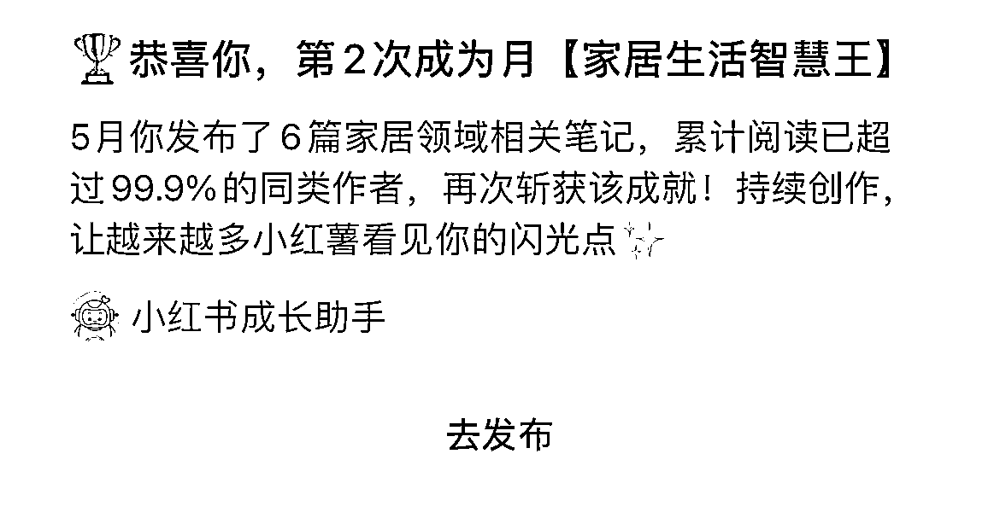
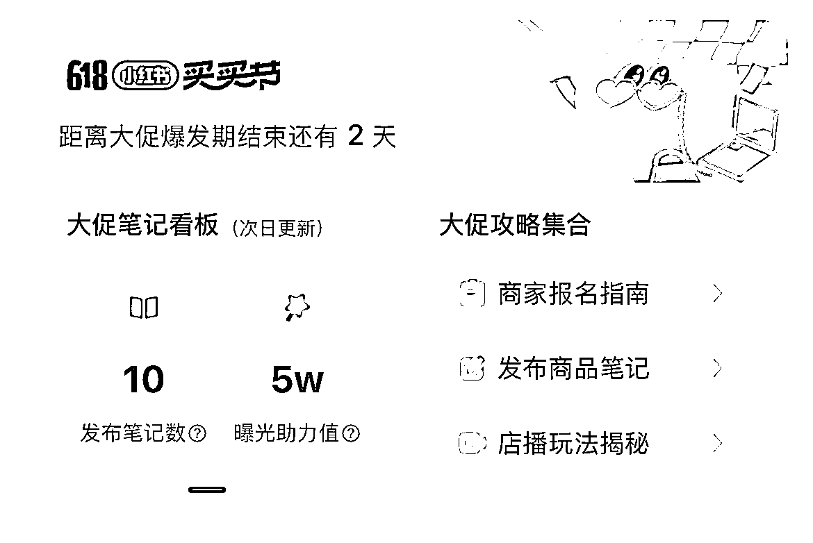
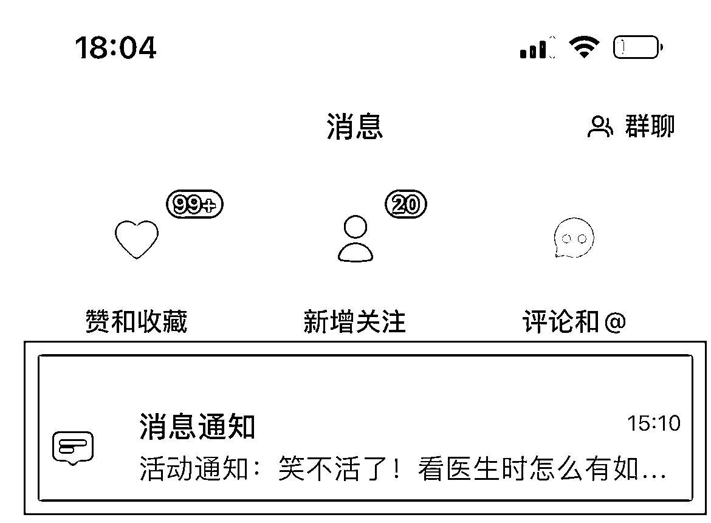
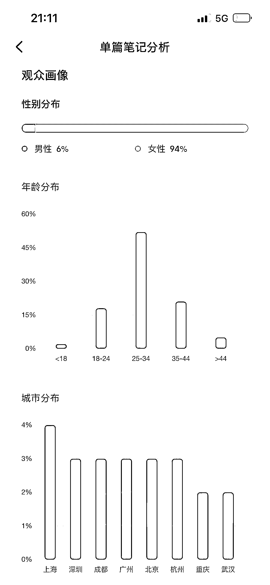

# 新人入局小红书店铺 GMV9W+ 的经验分享

> 原文：[`www.yuque.com/for_lazy/thfiu8/gm7vuxxrrg2q5x46`](https://www.yuque.com/for_lazy/thfiu8/gm7vuxxrrg2q5x46)

<ne-h2 id="6d686bae" data-lake-id="6d686bae"><ne-heading-ext><ne-heading-anchor></ne-heading-anchor><ne-heading-fold></ne-heading-fold></ne-heading-ext><ne-heading-content><ne-text id="ub0e9cebc">(58 赞)新人入局小红书店铺 GMV9W+ 的经验分享</ne-text></ne-heading-content></ne-h2> <ne-p id="ua6614d39" data-lake-id="ua6614d39"><ne-text id="ue2e75dfa">作者： 大树</ne-text></ne-p> <ne-p id="u2f2dd3cf" data-lake-id="u2f2dd3cf"><ne-text id="ua482cb59">日期：2023-07-10</ne-text></ne-p> <ne-p id="uc6a07555" data-lake-id="uc6a07555"><ne-text id="uea517019">大家好，我是大树，一个搞钱实战派</ne-text></ne-p> <ne-p id="u8a594ceb" data-lake-id="u8a594ceb"><ne-text id="ucdb97061">今年 4 月初，看到很多圈内朋友在做小红书电商，并且都取得了不错的成绩。</ne-text></ne-p> <ne-p id="u85b20822" data-lake-id="u85b20822"><ne-text id="u53cdd7f5">我是通过查看生财有术 2 月份的小红书店铺航海手册，开始下场实战！</ne-text></ne-p> <ne-p id="u20198077" data-lake-id="u20198077"><ne-text id="u1a590e01">从 4 月 11 日开始发了第一篇商品笔记，第二天出了第一单 19.9，截至到 6 月 6 日，50 多天累计 GMV 9.4w+，纯利润大概 5w 多。</ne-text><ne-card data-card-name="image" data-card-type="inline" id="ZItTy" data-event-boundary="card">  <ne-p id="u2679177d" data-lake-id="u2679177d"><ne-text id="u01483e09">在开始做小红书店铺的第七天，我靠着一篇笔记当日 GMV 做到了 13679.7 元</ne-text></ne-p> <ne-p id="ue1d9a1a4" data-lake-id="ue1d9a1a4"><ne-card data-card-name="image" data-card-type="inline" id="RaLV0" data-event-boundary="card">  <ne-p id="ua8106d81" data-lake-id="ua8106d81"><ne-text id="u4c0f8833">5 月份，在本次航海期间，我继续做一个单品，持续稳定出单，平均每日 GMV 1000+</ne-text></ne-p> <ne-p id="u261154db" data-lake-id="u261154db"><ne-card data-card-name="image" data-card-type="inline" id="yPNMQ" data-event-boundary="card">  <ne-p id="u425b2407" data-lake-id="u425b2407"><ne-text id="ud100b488">以上是我目前为止取得的成绩，下面来说说我做了哪些？</ne-text></ne-p> <ne-p id="u9526ff08" data-lake-id="u9526ff08"><ne-text id="u36d8fbda">大家一定要有平常心，不是每一篇笔记发了都能上热门的，但是只要持续发布，一旦有一篇笔记上了热门，就能持续出单很久。</ne-text></ne-p> <ne-p id="u5150aa4e" data-lake-id="u5150aa4e"><ne-text id="ua4db6970">所以大家一定要有信心，并且坚持持续输出商品笔记内容。</ne-text></ne-p> <ne-p id="u594b30bd" data-lake-id="u594b30bd"><ne-text id="ue334b29c">今天大树给大家分享一些我在小红书电商实战过程中的成长经验，希望可以给各位伙伴提供一些帮助。</ne-text></ne-p> <ne-p id="ue1de9432" data-lake-id="ue1de9432"><ne-text id="u5bf4a448">我也是从一个新人成长起来的，很了解新手期大家最关心的问题</ne-text></ne-p> <ne-p id="u840e3a11" data-lake-id="u840e3a11"><ne-text id="uf75619dd">无非就是选品，和提升笔记流量，进而持续不断的爆单！</ne-text></ne-p> <ne-p id="u344dd20d" data-lake-id="u344dd20d"><ne-text id="u35089d65">如果你也是想在这方面有所提升的伙伴可以轻轻的“拍一拍”我，继续来听听我的实战经验分享。</ne-text></ne-p> <ne-p id="u6a100a5a" data-lake-id="u6a100a5a"><ne-text id="ud41d1f58">开通小红书店铺，第一件事要做的就是确定要售卖的商品类目，那么具体怎样选择垂直的类目呢，我们来看一下视频演示！</ne-text></ne-p> <ne-p id="u10609cc5" data-lake-id="u10609cc5"><ne-text id="u5be34327">通过电商平台排行榜中反复出现且多个分类下排名靠前的商品皆是当下爆款，可以作为小红书的选品</ne-text></ne-p> <ne-p id="ufe39c734" data-lake-id="ufe39c734"><ne-text id="ua3cb3f1c">其他电商平台：淘宝、1688，抖店都适用同样的方法！</ne-text></ne-p> <ne-p id="u52a6c592" data-lake-id="u52a6c592"><ne-text id="u5687ded4">确定下来要卖的商品类目之后</ne-text> <ne-text id="ubc0f2bd9">通过小红书搜索我们要做的同领域的关键词</ne-text> <ne-text id="u662ff910">找到在小红书销量高的商品对应的账号作为我们学习的对标账号</ne-text></ne-p> <ne-p id="u8d8e33f1" data-lake-id="u8d8e33f1"><ne-text id="u030914b5">以上就是我在小红书店铺实战过程中的选品经验分享给大家</ne-text> <ne-text id="u3d350381">希望能够对选品纠结的朋友提供一些帮助</ne-text></ne-p> <ne-p id="u5f0c41bb" data-lake-id="u5f0c41bb"><ne-text id="u55c5e9ec">经常会听见新手朋友说发布商品笔记之后小眼睛少的可怜有没有？</ne-text></ne-p> <ne-p id="u820eff34" data-lake-id="u820eff34"><ne-text id="u7b04e538">那接下来大树分享给大家的是如何提升笔记流量的一些技巧</ne-text></ne-p> <ne-p id="ue190ec15" data-lake-id="ue190ec15"><ne-text id="u84592c66">有的伙伴问到：要不要发几篇普通笔记再发商品笔记？</ne-text></ne-p> <ne-p id="u0d93b96c" data-lake-id="u0d93b96c"><ne-text id="ufe655b7f">我的建议是：每篇都发商品笔记。</ne-text></ne-p> <ne-p id="u3b6b03da" data-lake-id="u3b6b03da"><ne-text id="uc5c0b42f">因为我们做的就是小红书电商，目的就是为了卖货赚钱，快速变现才是我们想要的。</ne-text></ne-p> <ne-p id="u95a92b3a" data-lake-id="u95a92b3a"><ne-card data-card-name="image" data-card-type="inline" id="kQfdF" data-event-boundary="card"></ne-card></ne-p> <ne-p id="u9120a6c7" data-lake-id="u9120a6c7"><ne-text id="u7a4874dc">从官方的通知可以看出，小红书平台很明确的鼓励我们持续创作，发布优质的商品笔记。</ne-text></ne-p> <ne-p id="u95f4756b" data-lake-id="u95f4756b"><ne-text id="u1f36babb">发布商品笔记、参加官方的活动、添加热门的活动标签，都可以获得平台的额外的流量奖励。</ne-text></ne-p> <ne-p id="u90659606" data-lake-id="u90659606"><ne-card data-card-name="image" data-card-type="inline" id="khBhA" data-event-boundary="card"></ne-card></ne-p> <ne-p id="u6736cbc2" data-lake-id="u6736cbc2"><ne-text id="ub28fa68f">完成开通店铺之后，会有新手成长任务，根据官方给的任务，按照要求去完成，可以获得薯条券，可以用薯条券投放薯条获得更高的曝光。</ne-text></ne-p> <ne-p id="u4913ddc7" data-lake-id="u4913ddc7"><ne-text id="ue2b02b55">在小红书【商家版后台】-【消息】-【成长】，可以找到任务入口。</ne-text><ne-card data-card-name="image" data-card-type="inline" id="oTts7" data-event-boundary="card"></ne-card></ne-p> <ne-p id="u4f3934c3" data-lake-id="u4f3934c3"><ne-card data-card-name="image" data-card-type="inline" id="xL8KX" data-event-boundary="card"></ne-card></ne-p> <ne-p id="u28477c8d" data-lake-id="u28477c8d"><ne-card data-card-name="image" data-card-type="inline" id="wKS55" data-event-boundary="card"></ne-card></ne-p> <ne-p id="u642868cb" data-lake-id="u642868cb"><ne-card data-card-name="image" data-card-type="inline" id="Cc8f6" data-event-boundary="card"></ne-card></ne-p> <ne-p id="ue6bd82f0" data-lake-id="ue6bd82f0"><ne-text id="u6f27513e">不同的时期小红书官方都会举办一些促销活动，比如最近的</ne-text></ne-p> <ne-p id="u324ccb3d" data-lake-id="u324ccb3d"><ne-card data-card-name="image" data-card-type="inline" id="WE0tn" data-event-boundary="card"></ne-card></ne-p> <ne-p id="u8feea85a" data-lake-id="u8feea85a"><ne-card data-card-name="image" data-card-type="inline" id="DPSwm" data-event-boundary="card"></ne-card></ne-p> <ne-p id="ucd1224f3" data-lake-id="ucd1224f3"><ne-card data-card-name="image" data-card-type="inline" id="q7OVs" data-event-boundary="card"></ne-card></ne-p> <ne-p id="uaf3230b5" data-lake-id="uaf3230b5"><ne-text id="u5bf40a9e">通过官方推荐的活动，发布相关商品笔记，可以有助于增加曝光，从而提升销售额。</ne-text> <ne-text id="u00b5f8ef">类似的活动还有数码大玩家、手作翻车现场等，官方都会定期私信推送给你。</ne-text> <ne-text id="u7202d55d">（在消息通知中可以看到推送，平时要留意查看）</ne-text><ne-card data-card-name="image" data-card-type="inline" id="SaYT7" data-event-boundary="card"></ne-card></ne-p> <ne-p id="ueec0bff2" data-lake-id="ueec0bff2"><ne-card data-card-name="image" data-card-type="inline" id="tllf7" data-event-boundary="card"></ne-card></ne-p> <ne-p id="ud4c5ca98" data-lake-id="ud4c5ca98"><ne-text id="ua4e9c97e">在小红书后台找到笔记灵感，路径：【我】-【三】-【创作中心】-【笔记灵感】。</ne-text></ne-p> <ne-p id="uefc97a5c" data-lake-id="uefc97a5c"><ne-card data-card-name="image" data-card-type="inline" id="f3NVG" data-event-boundary="card"></ne-card></ne-p> <ne-p id="uf6375153" data-lake-id="uf6375153"><ne-text id="u0d964b99">选择和自己账号发布内容相关的笔记灵感标签，去发布商品笔记，也可以获得官方的流量奖励</ne-text></ne-p> <ne-p id="u4419cb95" data-lake-id="u4419cb95"><ne-text id="uded13cd1">并且持续发布笔记灵感相关笔记，可以瓜分流量券，如果登上创作者榜单还会有额外的奖励。</ne-text></ne-p> <ne-p id="ub413b829" data-lake-id="ub413b829"><ne-text id="ua88a3389">所以建议大家一定要持续地发布优质的笔记！</ne-text></ne-p> <ne-p id="u0e60d525" data-lake-id="u0e60d525"><ne-card data-card-name="image" data-card-type="inline" id="K091X" data-event-boundary="card"></ne-card></ne-p> <ne-p id="u9220cb4d" data-lake-id="u9220cb4d"><ne-text id="uaecb29ed">争取拿到平台的流量扶持奖励，可以助我们一臂之力</ne-text></ne-p> <ne-p id="uacda4110" data-lake-id="uacda4110"><ne-text id="u6ac33446">当流量曝光提升上来，再加上适当的，订单自然就会蹭蹭上涨。图上这些都是引导的话术，建议用小号操作。</ne-text><ne-card data-card-name="image" data-card-type="inline" id="EeVfY" data-event-boundary="card"></ne-card></ne-p> <ne-p id="uc731c5da" data-lake-id="uc731c5da"><ne-card data-card-name="image" data-card-type="inline" id="NGzM1" data-event-boundary="card"></ne-card></ne-p> <ne-p id="ue2b8324e" data-lake-id="ue2b8324e"><ne-card data-card-name="image" data-card-type="inline" id="Vrvsy" data-event-boundary="card"></ne-card></ne-p> <ne-p id="u663b67f1" data-lake-id="u663b67f1"><ne-text id="u66ed3c0c">不同时期，小红书官方会根据搜索热度或平台缺少某种笔记的程度，来给出一些热搜词，比如：</ne-text></ne-p> <ne-p id="ud8bf99c1" data-lake-id="ud8bf99c1"><ne-card data-card-name="image" data-card-type="inline" id="lIfO9" data-event-boundary="card"></ne-card></ne-p> <ne-p id="u7387fe68" data-lake-id="u7387fe68"><ne-text id="ub7b1ee9d">在我们发布商品笔记的时候，可以先来看看这些热搜词，尝试挑选一些和我们的笔记内容有一定相关性的热搜词，植入到笔记内容中。</ne-text></ne-p> <ne-p id="uba8660fa" data-lake-id="uba8660fa"><ne-text id="uad2e76fb">包括封面、视频、标题、正文、话题中，都是可以植入热搜词的。</ne-text></ne-p> <ne-p id="u43d736a4" data-lake-id="u43d736a4"><ne-text id="u3a7da130">另外，我们的航海手册里，也有讲到如何使用第三方工具找到热搜词：</ne-text></ne-p> <ne-oli index-type="0"><ne-oli-i>1</ne-oli-i> <ne-oli-c class="ne-oli-content" id="uf61f8c26" data-lake-id="uf61f8c26"><ne-text id="u87cb0e30">优秀笔记植入热搜词：</ne-text> <ne-text id="u7ed4ffad">之前发过的商品笔记，如果有阅读/互动/转化量比较高的，可再挑选几个合适的热搜词，重新植入到笔记内容中；</ne-text></ne-oli-c></ne-oli> <ne-oli index-type="0"><ne-oli-i>2</ne-oli-i> <ne-oli-c class="ne-oli-content" id="ufe090fc4" data-lake-id="ufe090fc4"><ne-text id="uc5405741">普通笔记挂商品：</ne-text> <ne-text id="u34cf3d32">之前发布过的普通笔记，若有热搜词可匹配，也可以将笔记进行编辑修改，重新挂载商品；</ne-text> <ne-text id="u671a7912">(仅限首次发布在 30 天内的笔记）</ne-text></ne-oli-c></ne-oli> <ne-p id="uf0b3ef90" data-lake-id="uf0b3ef90"><ne-card data-card-name="image" data-card-type="inline" id="WEEcK" data-event-boundary="card"></ne-card></ne-p> <ne-p id="u821d803b" data-lake-id="u821d803b"><ne-card data-card-name="image" data-card-type="inline" id="kylpW" data-event-boundary="card"></ne-card></ne-p> <ne-p id="u0a4b6e12" data-lake-id="u0a4b6e12"><ne-card data-card-name="image" data-card-type="inline" id="FRHxD" data-event-boundary="card"></ne-card></ne-p> <ne-p id="u0cdf4d71" data-lake-id="u0cdf4d71"><ne-text id="uee39e7ba">通过笔记的基础数据和观看数据趋势，以及笔记诊断，可以</ne-text><ne-card data-card-name="image" data-card-type="inline" id="jWFRi" data-event-boundary="card"></ne-card></ne-p> <ne-p id="u4c2fb745" data-lake-id="u4c2fb745"><ne-card data-card-name="image" data-card-type="inline" id="l76cj" data-event-boundary="card"></ne-card></ne-p> <ne-p id="u73f83ae8" data-lake-id="u73f83ae8"><ne-text id="u5470d10f">比如：互动量不高，我们可以用本号或者小号发布引导性的评论</ne-text></ne-p> <ne-p id="u0a556d2a" data-lake-id="u0a556d2a"><ne-card data-card-name="image" data-card-type="inline" id="UQxvN" data-event-boundary="card"></ne-card></ne-p> <ne-p id="uebe9ab70" data-lake-id="uebe9ab70"><ne-text id="u5f232809">如果点击率不高，可以试着调整更有吸引力的封面</ne-text></ne-p> <ne-p id="u5f94cddb" data-lake-id="u5f94cddb"><ne-text id="u2b3bf6be">根据观众离开的趋势，可以看到观众从第几秒退出，从而针对去优化内容</ne-text></ne-p> <ne-p id="u22f4ab96" data-lake-id="u22f4ab96"><ne-card data-card-name="image" data-card-type="inline" id="qOpfx" data-event-boundary="card"></ne-card></ne-p> <ne-p id="ua496e285" data-lake-id="ua496e285"><ne-card data-card-name="image" data-card-type="inline" id="uisvv" data-event-boundary="card"></ne-card></ne-p> <ne-p id="u11078ce6" data-lake-id="u11078ce6"><ne-text id="ua6670c87">而通过观众画像分析，可以！</ne-text></ne-p> <ne-p id="ucd3afccd" data-lake-id="ucd3afccd"><ne-text id="udd6b71ab">比如这篇笔记的观众画像女性占比 94%，年龄 25-34 岁的占比最多，兴趣分布主要在娱乐、影视、美食、时尚等领域，我们在选品测品的时候就可以这对这部分人群，比如宝妈所需要的母婴用品，儿童玩具等</ne-text></ne-p> <ne-p id="u1ce8b90f" data-lake-id="u1ce8b90f"><ne-text id="u7f2b9a58">简单总结，做一个稳定出单的小红书店铺，无非就三点：</ne-text> <ne-text id="u862f4b80">1、选好品</ne-text> <ne-text id="u30824dbe">2、发好笔记</ne-text> <ne-text id="u3e472068">3、坚持大量发笔记</ne-text></ne-p> <ne-p id="u20dfbbbd" data-lake-id="u20dfbbbd"><ne-text id="u2359ad39">今天的分享先到这里，感谢生财伙伴们的观看！</ne-text></ne-p> <ne-p id="ucb022ce9" data-lake-id="ucb022ce9"><ne-text id="ubd3d0f1e">希望同在这条船的战友们</ne-text> <ne-text id="u9cd4e74e">都能通过小红书电商的风口赚到想要的收益！</ne-text></ne-p> <ne-p id="ue164a99d" data-lake-id="ue164a99d"><ne-text id="u7dc5582c">并且一起持续深耕这个红利期项目！</ne-text></ne-p> <ne-p id="ub5ab0273" data-lake-id="ub5ab0273"><ne-text id="ufaf334c8">接下来的实战过程中</ne-text></ne-p> <ne-hole id="u67df4749" data-lake-id="u67df4749"><ne-card data-card-name="hr" data-card-type="block" id="AS8oZ" data-event-boundary="card"><ne-p id="u7d196a29" data-lake-id="u7d196a29"><ne-text id="ubdc1e74a">评论区：</ne-text></ne-p> <ne-p id="ub3424cac" data-lake-id="ub3424cac"><ne-text id="u04f157ec">更绪 : 牛逼</ne-text> <ne-text id="ubdfbaea6">更绪 : 老哥，留个联系方式，给个好友位[抱拳]</ne-text> <ne-text id="u6fad905c">爱笑的眼睛 : 是全职做还是作为兼职在做呢</ne-text> <ne-text id="ub85f148d">大树 : 欢迎欢迎</ne-text> <ne-text id="u36f15e6b">大树 : 副业项目的其中一个</ne-text> <ne-text id="u5f343fce">花若惜 : 里面的视频演示打不开，老师</ne-text> <ne-text id="u13fa4f3d">张耑一 : 视频看不了，手册中的高手分享也是一样</ne-text> <ne-text id="u3e42bd12">大树 : 我这里点击可以直接打开，其他圈友再试下呢</ne-text></ne-p> <ne-p id="u6714c0fc" data-lake-id="u6714c0fc"><ne-card data-card-name="image" data-card-type="inline" id="uooKj" data-event-boundary="card"></ne-card></ne-p> <ne-hole id="u7b683aa5" data-lake-id="u7b683aa5"><ne-card data-card-name="hr" data-card-type="block" id="Uco8T" data-event-boundary="card"></ne-card></ne-hole></ne-card></ne-hole></ne-card></ne-p></ne-card></ne-p></ne-card></ne-p>