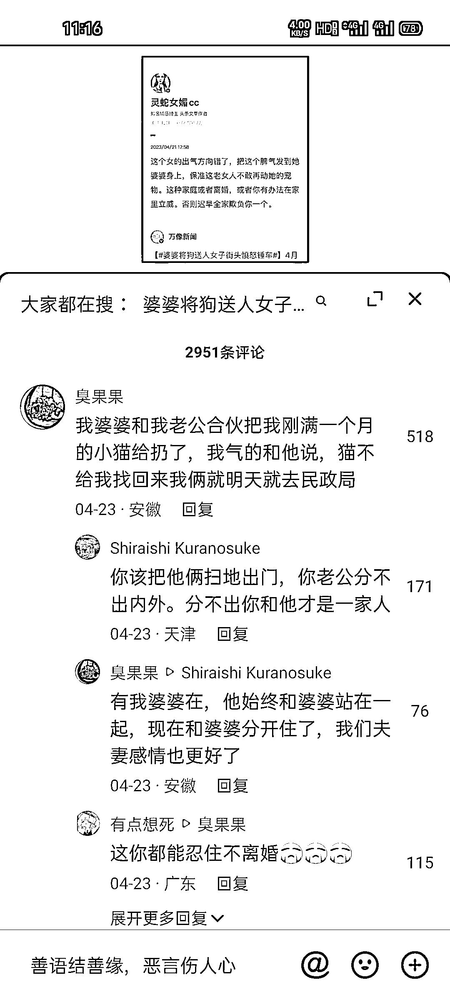
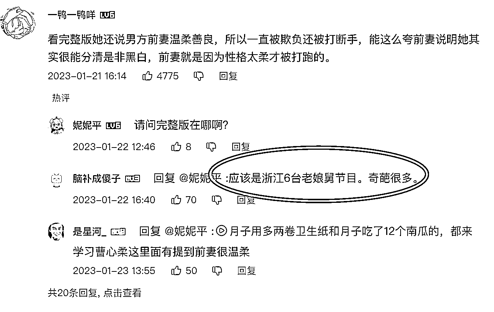

# 抖音平台挖掘情感素材，网友评论也能出爆文

> 原文：[`www.yuque.com/for_lazy/thfiu8/sonbxa991qe2b39x`](https://www.yuque.com/for_lazy/thfiu8/sonbxa991qe2b39x)

<ne-h2 id="68865d06" data-lake-id="68865d06"><ne-heading-ext><ne-heading-anchor></ne-heading-anchor><ne-heading-fold></ne-heading-fold></ne-heading-ext><ne-heading-content><ne-text id="u9e778ecc">(精华帖)(120 赞)抖音平台挖掘情感素材，网友评论也能出爆文</ne-text></ne-heading-content></ne-h2> <ne-p id="u5f375bfa" data-lake-id="u5f375bfa"><ne-text id="u1a71df49">作者： Ray-小萌子</ne-text></ne-p> <ne-p id="u126fdcee" data-lake-id="u126fdcee"><ne-text id="u2867a5f9">日期：2023-07-12</ne-text></ne-p> <ne-p id="u599aca8a" data-lake-id="u599aca8a"><ne-text id="u04411072">大家好，我是王萌，在今年 2 月份才开始做爆文写作，大概一个多星期账号才进入流量池，第一个月就拿到了 6000+ 的收益。到目前为止，公众号总共收益在 1 万块多点。</ne-text></ne-p> <ne-p id="u4c82de3b" data-lake-id="u4c82de3b"><ne-text id="u021f420b">关于情感文章的内容写作，航海的手册里面写的很完整，我就不讲是怎么写的，来给大家讲一下我自己的选素材方法。</ne-text></ne-p> <ne-p id="u312e9d7e" data-lake-id="u312e9d7e"><ne-text id="u33eb1ad5">最早的时候我是通过来找素材，但是里面的情感文章很多不是故事类型的，而且很多内容质量也不高。</ne-text></ne-p> <ne-p id="u2d785ffe" data-lake-id="u2d785ffe"><ne-text id="ucbe46957">大部分人找素材都是照抄同行，别人爆了一篇文章，立马模仿，我自己爆了一篇文章，第二天我就看到好几篇类似的文章，换皮不换肉。模仿的人越多，流量就越差。我也模仿过，效果不好。</ne-text></ne-p> <ne-p id="u090f6e68" data-lake-id="u090f6e68"><ne-text id="u060fd6b3">都说故事来源于生活，前段时间和亲戚吃饭，我发现我二姨很八卦，对村子里面的事情了解的很清楚。尤其是她说村子里面一位已婚妇女有两个孩子，为了生活去大城市打工，结果和别人好上了，还给人家生了个孩子，逢年过节都不回家。最后和原配离婚，两个孩子扔在家里让老人带着，孩子的爸妈都不管，很可怜。</ne-text></ne-p> <ne-p id="u7cd80f11" data-lake-id="u7cd80f11"><ne-text id="ua21888e9">如果不是亲戚说的，我听到这种故事基本不会信。一直以为这种狗血的情节电视剧或者小说里面才会有，或者出现在新闻，没想到离自己这么近。</ne-text></ne-p> <ne-p id="ud1fedd14" data-lake-id="ud1fedd14"><ne-text id="u1e017aeb">于是我突然想到每次看抖音的时候，一些情感纠纷的新闻下面，就会有网友评论，讲的是他们自己亲身经历或者身边的故事，我就想着说能不能将这些故事拿来用呢？</ne-text></ne-p> <ne-p id="u87755624" data-lake-id="u87755624"><ne-text id="u0de52dd8">这种方法的核心在于，通过关键词检索各平台的情感故事的同时，可以进一步关注故事的后续发展、评论区的引申故事等，从而丰富自己素材库。</ne-text></ne-p> <ne-p id="ua4240218" data-lake-id="ua4240218"><ne-text id="u2e1d1445">下面说一下我具体是怎么做的。</ne-text></ne-p> <ne-p id="ubc7e2fda" data-lake-id="ubc7e2fda"><ne-text id="u2bc37a2c">我在抖音里面搜索关键词，我感觉情感故事中婆媳关系的最多，那么搜索“婆婆”然后再加上一个情绪词或者动词，就会有很多相关视频。</ne-text><ne-card data-card-name="image" data-card-type="inline" id="HXtQW" data-event-boundary="card"></ne-card></ne-p> <ne-p id="ud15642bb" data-lake-id="ud15642bb"><ne-text id="uc26769d4">搜索之后还不能直接拿来使用，</ne-text></ne-p> <ne-p id="ufa3cc86e" data-lake-id="ufa3cc86e"><ne-text id="ua6e58a0d">，这种视频有个优点就是受众明显，而且已经验证过了，但是素材可能老旧，或者是其他平台的爆文然后改编的，如果直接用这种素材，阅读量不会很高。</ne-text></ne-p> <ne-p id="u2d265fd4" data-lake-id="u2d265fd4"><ne-text id="ub9e3369b">，现在媒体号经常会转发别人的视频，然后加个标题，和营销号的性质差不多，但是媒体号自带流量，评论区十分精彩。</ne-text><ne-card data-card-name="image" data-card-type="inline" id="pD6ji" data-event-boundary="card"></ne-card></ne-p> <ne-p id="u20438b64" data-lake-id="u20438b64"><ne-text id="u8e08f937">看这个大象新闻的视频，18 万的赞评论区有 32395 条内容，说明视频引起了共鸣，有些网友会把自己的亲身经历讲出来。</ne-text></ne-p> <ne-p id="uf6543be8" data-lake-id="uf6543be8"><ne-text id="u219e5b26">比如我图片里面圈出来的这个，虽然内容比较简单，但是我觉得这已经可以拿来当做一个素材使用。</ne-text></ne-p> <ne-p id="uc4facc60" data-lake-id="uc4facc60"><ne-text id="ue7fe20b6">于是我继续搜索，发现了前段时间的新闻。</ne-text><ne-card data-card-name="image" data-card-type="inline" id="UXPfe" data-event-boundary="card"></ne-card></ne-p> <ne-p id="uaa0647e3" data-lake-id="uaa0647e3"><ne-text id="u26c681dd">在搜索下拉框中，有一个 XXXX 事件后续，说明这个事情大家都很关心，都想知道最后怎么了。我也好奇搜了一下，但是没有后续。那么还是老规矩，打开评论区，还会有相关的评论。</ne-text><ne-card data-card-name="image" data-card-type="inline" id="STLwJ" data-event-boundary="card"></ne-card></ne-p> <ne-p id="u5ae1b5a6" data-lake-id="u5ae1b5a6"><ne-text id="ue8ca9873">这位网友的评论时间是最新的，我觉得这个素材也可以用。在搜索的时候，我发现很多人都提到了“曹心柔”，搜索之后内容很精彩。</ne-text><ne-card data-card-name="image" data-card-type="inline" id="wF6ma" data-event-boundary="card"></ne-card></ne-p> <ne-p id="ud93ea6c5" data-lake-id="ud93ea6c5"><ne-text id="u811b3475">这是一个情感调节的视频，内容主要讲了恶婆婆打断儿媳手臂，和两个女儿一起赶走儿媳，结果儿子娶的第二个儿媳十分厉害，给婆婆“灌大便”，把两个小姑子赶出家门。后面的就不说了，可以自己看一下。</ne-text></ne-p> <ne-p id="u6202c423" data-lake-id="u6202c423"><ne-text id="uf7b8c48e">视频下方的评论区虽然佩服的人很多，但是也有分享自己身边经历的。</ne-text><ne-card data-card-name="image" data-card-type="inline" id="N1pQU" data-event-boundary="card"></ne-card></ne-p> <ne-p id="uc225471e" data-lake-id="uc225471e"><ne-text id="u6420b5e3">这个评论还是我搜索的时候前 20 分钟刚发的，不过依然是需要自己改编。</ne-text></ne-p> <ne-p id="u96163e5c" data-lake-id="u96163e5c"><ne-text id="uf1e521f8">我在 B 站搜索关于曹心柔相关内容的时候，也看到了这个调解视频的来源，有很多故事素材，把这些新闻放到抖音里面搜索，然后看看这些视频下面是否有网友评论</ne-text><ne-card data-card-name="image" data-card-type="inline" id="O8MPn" data-event-boundary="card"></ne-card></ne-p> <ne-p id="u5e47cab9" data-lake-id="u5e47cab9"><ne-text id="u46f88d86">素材找到之后，就可以进行故事创作。</ne-text></ne-p> <ne-p id="u85ac7632" data-lake-id="u85ac7632"><ne-text id="u38f05dd6">接着我再说说改编的步骤。</ne-text></ne-p> <ne-p id="u8e0e5e5e" data-lake-id="u8e0e5e5e"><ne-text id="uf6d40188">经过我之前的测试，就拿过一个节目的新闻然后写成情感文章，但是效果很不好，经过搜索才发现人家节目组也有公众号。这里只是做一个演示，</ne-text></ne-p> <ne-p id="uc600fa14" data-lake-id="uc600fa14"><ne-text id="ua1e72412">在航海手册中，列出了容易爆的 8 个要素：有曲折、有情绪、有信息增量、有关于民生、明星名人、性、暴力、金钱。</ne-text></ne-p> <ne-p id="uf4fe3c2f" data-lake-id="uf4fe3c2f"><ne-text id="ud5909772">曹心柔的这个故事中，我觉得符合有曲折、情绪、关于民生、暴力、金钱这几个要素。</ne-text></ne-p> <ne-p id="uf37f5614" data-lake-id="uf37f5614"><ne-text id="u950d49f8">接着将素材里面都发生了什么写下来，然后筛选一下需要的：</ne-text> <ne-text id="u13578077">1、曹心柔刚结婚遭到婆婆和大姑子等人的殴打</ne-text> <ne-text id="u18fdaf9b">2、丈夫在家被姐姐殴打，后来打算跳粪坑自杀</ne-text> <ne-text id="u4e80668e">3、婆婆辱骂孙子、辱骂儿媳</ne-text> <ne-text id="u358a2912">4、婆婆曾将前儿媳胳膊打骨折</ne-text> <ne-text id="ua9d0c34c">5、前儿媳一个人照顾一家 8 口人，还被虐待</ne-text> <ne-text id="ue9d83f8b">6、曹心柔受不了后反抗，拿搅屎棍和马桶栓收拾婆婆和大姑子，并将大姑子赶出家门</ne-text> <ne-text id="ufdd0b3d6">7、婆婆见到儿媳就害怕，再也不敢找茬，想缓和关系，于是找调解员来调解</ne-text> <ne-text id="u8df459fa">8、婆婆和大姑子还说将来家里拆迁，不会给儿媳儿子和孙子任何好处</ne-text></ne-p> <ne-p id="u49fa9efa" data-lake-id="u49fa9efa"><ne-text id="u732bc129">大概就是这些，那么根据手册里面的故事公式，来进行创作。</ne-text></ne-p> <ne-p id="ud41f1fb3" data-lake-id="ud41f1fb3"><ne-text id="u23cf6eb5">我个人觉得儿媳、前儿媳、丈夫这几个都能当主人公，每个人的视角也都不一样，看你怎么选择。</ne-text></ne-p> <ne-p id="u267112ae" data-lake-id="u267112ae"><ne-text id="u2b571f89">这里我就选择以儿媳作为主人公。</ne-text></ne-p> <ne-p id="u8d191c0d" data-lake-id="u8d191c0d"><ne-text id="u5eada24f">手册里面讲了“开幕雷击”的 7 个要素：1）金钱、数字；2）性暗示；3）暴力；4）死亡；5）捷径；6）异常、悬念；7）民族主义。</ne-text></ne-p> <ne-p id="u27f41913" data-lake-id="u27f41913"><ne-text id="u62b28d09">那么我取的标题是这样的：我二婚遭恶婆婆百般刁难，婆婆意外瘫痪在床，我的一番举动，让婆婆浑身发抖！</ne-text></ne-p> <ne-p id="u5d5edeff" data-lake-id="u5d5edeff"><ne-text id="u79598c8d">取完标题之后按照手册里面的故事模板来设计整个文章的框架，，那么就需要我们自己加入反转的剧情，比如下文。</ne-text></ne-p> <ne-p id="ubba5fa95" data-lake-id="ubba5fa95"><ne-text id="ufbd3ca6f">小芳</ne-text> <ne-text id="u57eec292">拥有一个幸福的家庭，在城市里面买房</ne-text> <ne-text id="u15a71741">没想到碰到恶婆婆和作妖的小姑子，被婆婆告知村里面拆迁不会有丈夫孩子的份</ne-text> <ne-text id="u0fbdc7c3">婆婆一次意外瘫痪在床，小姑子根本不照顾反而恶语相向</ne-text> <ne-text id="u26c8d14d">我并没有落井下石，反而悉心照顾，婆婆激动的浑身发抖，还承诺拆迁的补偿都给我们</ne-text></ne-p> <ne-p id="udb0e78f0" data-lake-id="udb0e78f0"><ne-text id="u6fe63291">那么总结一下核心剧情就是：</ne-text> <ne-text id="u61173114">我叫小芳，今年 32 岁，二婚嫁到了农村，因为有过一段失败的婚姻，我非常想拥有一个幸福美满的家庭，将来能够在城市里面买房子。但是刚结婚没多久才发现遇到了恶婆婆和喜欢作妖的小姑子，我不甘示弱每天都在争吵，我很想结束这段婚姻，但看着 2 岁的孩子，还是咬牙忍一忍。一次意外婆婆瘫痪在床，小姑子不但不照顾，反而对她恶语相向，甚至离开了家里。我一开始也不愿意照顾，但看她也可怜，就勉强照顾一下。没想到婆婆被我的举动感动了，激动地浑身发抖，承诺说家里面房子拆迁补偿都给我们。</ne-text></ne-p> <ne-p id="u306ef938" data-lake-id="u306ef938"><ne-text id="ucd76b6b9">我的分享就是这些，只要严格按照航海手册学习执行，不要自己瞎写，另外在群里多交流，不会的问教练，赚到 100 块钱还是很容易的。</ne-text></ne-p> <ne-hole id="u5cf21513" data-lake-id="u5cf21513"><ne-card data-card-name="hr" data-card-type="block" id="rk7eC" data-event-boundary="card"><ne-p id="uac3a2d8e" data-lake-id="uac3a2d8e"><ne-text id="u4e0af7f2">评论区：</ne-text></ne-p> <ne-p id="ube62e113" data-lake-id="ube62e113"><ne-text id="ub3dfb2f6">白水 : 几个号在操作呢</ne-text> <ne-text id="u1968a05b">亦仁 : 感谢分享，已加精华。</ne-text> <ne-text id="u5d837d90">Ray-小萌子 : 2 个</ne-text> <ne-text id="u330fa23e">伟杰 : 大神，三年前闲置的公众号。拿来做流量主，是否需要删除三年前的文章呀，会影响权重么[偷笑]</ne-text> <ne-text id="ufdda36ba">Ray-小萌子 : 我觉得不用删除，直接发也是可以的</ne-text> <ne-text id="ua472b8a7">伟杰 : 😂谢谢，类目差距很大哦，哈哈 不影响是吧</ne-text></ne-p> <ne-p id="u6f9ad6f9" data-lake-id="u6f9ad6f9"><ne-card data-card-name="image" data-card-type="inline" id="I5ACx" data-event-boundary="card">  <ne-hole id="ue0291127" data-lake-id="ue0291127"><ne-card data-card-name="hr" data-card-type="block" id="cXguH" data-event-boundary="card"></ne-card></ne-hole></ne-card></ne-p></ne-card></ne-hole>