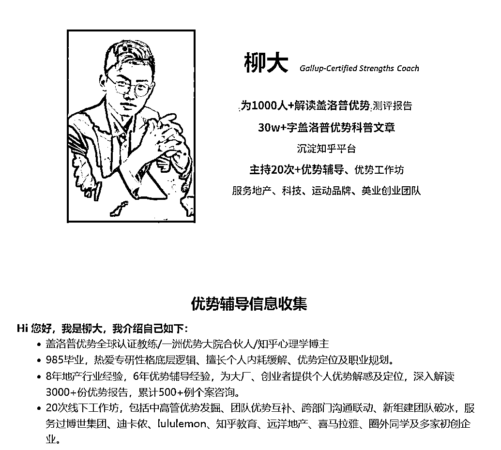

# 如何发觉负面情绪背后的优势？

> 原文：[`www.yuque.com/for_lazy/thfiu8/gfwow9gu2c00pfhy`](https://www.yuque.com/for_lazy/thfiu8/gfwow9gu2c00pfhy)

<ne-h2 id="2fa38edb" data-lake-id="2fa38edb"><ne-heading-ext><ne-heading-anchor></ne-heading-anchor><ne-heading-fold></ne-heading-fold></ne-heading-ext><ne-heading-content><ne-text id="u7068a303">(38 赞)如何发觉负面情绪背后的优势？</ne-text></ne-heading-content></ne-h2> <ne-p id="u96cbd65d" data-lake-id="u96cbd65d"><ne-text id="u5f9d3147">作者： 柳大-盖洛普教练</ne-text></ne-p> <ne-p id="u6882d188" data-lake-id="u6882d188"><ne-text id="ubc4e5a34">日期：2023-07-14</ne-text></ne-p> <ne-p id="u6dfceb0c" data-lake-id="u6dfceb0c"><ne-text id="u6db5e0e9">我是柳大，一名盖洛普优势教练，很荣幸被生财有术和醒醒邀请，作为第一期个人优势发掘航海的教练之一。</ne-text></ne-p> <ne-p id="ubfd8b610" data-lake-id="ubfd8b610"><ne-text id="uc9ef71a8">迄今，我深入解读过 3000+份报告，为企业做过 20 次工作坊，帮助创业公司人岗匹配，帮助很多大厂员工升职加薪，解决自身内耗和卡点，找到更清晰的定位、更热爱的状态。</ne-text></ne-p> <ne-p id="ue5024ccd" data-lake-id="ue5024ccd"><ne-text id="u90b06dc8">我相信，我自诩一名盖洛普优势骨灰粉，想安利给大家这个工具，提供应对难题的一种全新的解法。</ne-text><ne-card data-card-name="image" data-card-type="inline" id="KVkeJ" data-event-boundary="card"></ne-card></ne-p> <ne-p id="u6439a2fb" data-lake-id="u6439a2fb"><ne-text id="u50fb89c7">最近翻生财精华贴，七小的，让我爱惨了七小。</ne-text></ne-p> <ne-p id="u652f4352" data-lake-id="u652f4352"><ne-text id="uacabe947">重燃生财欲望、疗愈负面情绪，这可是盖洛普优势的主场之一。</ne-text></ne-p> <ne-p id="u77b8be63" data-lake-id="u77b8be63"><ne-text id="uab0a1417">荣格有言：</ne-text> <ne-text id="ue3a32f70">很多时候知道那么多道理，却依旧过不好这一生。</ne-text> <ne-text id="uef7d88c2">不就是我们对自己的冰山以下 90%的部分，都一无所知嘛？</ne-text> <ne-text id="ue2f6a072">而盖洛普优势，刚好可以成为那个解法。</ne-text></ne-p> <ne-p id="u2ca84bd6" data-lake-id="u2ca84bd6"><ne-card data-card-name="image" data-card-type="inline" id="Yw4YM" data-event-boundary="card"></ne-card></ne-p> <ne-p id="u34809a80" data-lake-id="u34809a80"><ne-text id="ubba74b49">大多数负面情绪都可以概括成两句话，</ne-text> <ne-text id="u0341d563">“我希望像别人一样，但我又做不到别人那样”，</ne-text> <ne-text id="u156b8a10">“我不希望自己这样，但确实我就是这样”。</ne-text></ne-p> <ne-p id="u114dd2dd" data-lake-id="u114dd2dd"><ne-text id="u3451c7ea">解决方案按理来说很简单，就是接纳自我，接纳自己真实的样子。就像</ne-text></ne-p> <ne-p id="u7c173cb2" data-lake-id="u7c173cb2"><ne-text id="u21fb93a1">但很多情绪就来自于“我不清楚手里的牌”，“为什么别人能打出来的王炸我打不出来”，“我不承认自己手里的牌是这样”，“大佬成功的方式我能复制吗”，以及“我跟大佬的牌感觉没差但到底差在哪里”。</ne-text></ne-p> <ne-p id="ud58323e5" data-lake-id="ud58323e5"><ne-text id="u111125ed">在生财这么且卷且优质的圈子，迷失自我的方向，实在再正常不过。</ne-text></ne-p> <ne-p id="u33e8b979" data-lake-id="u33e8b979"><ne-text id="u4b4340f6">就像，你骑马走天下，结果你今天觉得往东走最好，明天听圈友说往西走才对，后天线下听到南方艳阳天多美，大后天大佬又跟你说北方银装素裹是真天堂。</ne-text></ne-p> <ne-p id="u2424fbdf" data-lake-id="u2424fbdf"><ne-text id="u1d9d7f52">最后走了半个月，发现自己踏步百里，仍在原地。甚至自我 pua：“是我不行，是我能力太差，不然为什么我赚不到一分钱！”</ne-text></ne-p> <ne-p id="ue32239c0" data-lake-id="ue32239c0"><ne-text id="u22a1f6e1">普罗大众的人性，是情绪脑与理智脑拉锯的产物，是大象与骑象人的共舞。</ne-text></ne-p> <ne-p id="u56fea00a" data-lake-id="u56fea00a"><ne-text id="u8a4961be">情绪脑就是大象，主导着一个人不假思索、不由自主的本能反应和思维、行为、感受模式，是一个人的自动巡航系统，是一个人的“潜意识”。</ne-text></ne-p> <ne-p id="u003abdfd" data-lake-id="u003abdfd"><ne-text id="u49a73ab2">理智脑更像是骑象人，主导着一个人的逻辑思维、语言理解、学习记忆、推理计划，是一个人的“显意识”。</ne-text><ne-card data-card-name="image" data-card-type="inline" id="Tnoin" data-event-boundary="card"></ne-card></ne-p> <ne-p id="ue39c3d96" data-lake-id="ue39c3d96"><ne-text id="udeb7006b">比如白天已经很累，结果晚上躺床上往往不会睡，反而小视频一刷就是大半宿，就是大象在缺少理智约束下尽情撒欢所带来的。</ne-text></ne-p> <ne-p id="u4e41e46b" data-lake-id="u4e41e46b"><ne-text id="u3ef8f9c3">了解自己的优势，就是了解自己潜意识的过程。就是发掘自己的大象脾气的过程，让我们有机会去干预我们的潜意识，干预自动巡航系统。</ne-text></ne-p> <ne-p id="ua28c5c92" data-lake-id="ua28c5c92"><ne-text id="ue43c9c6d">而不是苦哈哈的用骑象人的意志力试图改变自己，结果十年不成。</ne-text></ne-p> <ne-p id="uf0981b53" data-lake-id="uf0981b53"><ne-text id="uf66b5d9b">晚年还要慨叹“要是当年在生财再努力点就好了，唉，啊”。</ne-text></ne-p> <ne-p id="ub54c08e4" data-lake-id="ub54c08e4"><ne-text id="u729577a9">不了解自己的优势，就等于不了解大象脾气的骑象人，是无法借助大象的力量达成自己的目标的。</ne-text></ne-p> <ne-p id="ue36df3c7" data-lake-id="ue36df3c7"><ne-text id="u9c1edffd">反而很容易被大象带偏，享受短暂的欢愉，错过既定的目标。甚至反过头来不断否定和指责自己。</ne-text> <ne-text id="u0c7ac187">这个过程也叫做“”，你的理智告诉你应该做，你的内心告诉你你想做。</ne-text> <ne-text id="uce4e62d5">“你应该”和“你想要”成天打架，逐渐自责、内耗、否定自我。</ne-text></ne-p> <ne-p id="ucdd2a6f1" data-lake-id="ucdd2a6f1"><ne-text id="u07c05a36">所以，盖洛普优势这个测评，他的价值在于，他提供了一套很好的 34 才干语言。</ne-text></ne-p> <ne-p id="ua44efaf6" data-lake-id="ua44efaf6"><ne-card data-card-name="image" data-card-type="inline" id="MbSRS" data-event-boundary="card"></ne-card></ne-p> <ne-p id="u2be8fe85" data-lake-id="u2be8fe85"><ne-text id="u13f7f774">还提供了一套优势测评工具，尽管价格很贵。</ne-text></ne-p> <ne-p id="uaf7947bc" data-lake-id="uaf7947bc"><ne-text id="u539a8a35">盖洛普优势能让你看到你到底是什么品种，你的同类在哪里？你的起手牌在哪里？你的天赋加成在哪里？你跟同类的区别又在哪里？</ne-text></ne-p> <ne-p id="u5fe1e333" data-lake-id="u5fe1e333"><ne-text id="u57616663">没有清晰的自我认知，你大概率会：</ne-text></ne-p> <ne-p id="u4526f485" data-lake-id="u4526f485"><ne-text id="u2cafd9e3">不借助工具了解自己，跟盲人摸象，盲人摸鲸一个水平。</ne-text> <ne-text id="u12b56f40">你觉得摸到了簸箕，其实是象耳。</ne-text> <ne-text id="u5bdd4450">你觉得摸到了绳子，其实是象尾。</ne-text> <ne-text id="u7272eae1">你觉得摸到了树干，其实是象腿 。</ne-text></ne-p> <ne-p id="ufbde2f04" data-lake-id="ufbde2f04"><ne-text id="u32a6f244">自己这个东西太复杂了。</ne-text> <ne-text id="u09ed875f">你空有片面的、短暂的、随机的对自己的感受。</ne-text> <ne-text id="u54b33f36">却没有全周期的、全过程的、全维度的看待过自己。</ne-text></ne-p> <ne-p id="u1929ca9d" data-lake-id="u1929ca9d"><ne-text id="u586f351a">无怪乎德尔菲神庙石柱上的箴言要刻：</ne-text> <ne-text id="ueb28e394">苏格拉底要声嘶力竭：</ne-text> <ne-text id="u0c40da0c">甚至山本耀司也说：</ne-text> <ne-text id="u056d2587">这些通通都是在告诉你，搞懂你手里的牌，很难但很重要。</ne-text></ne-p> <ne-p id="ufb7e2d43" data-lake-id="ufb7e2d43"><ne-text id="u283d4610">借助盖洛普优势测评，我也才第一次如此系统和全面的看到自己的“我行”与“我暂时不行”，“我是谁”与“我不是谁”。</ne-text></ne-p> <ne-p id="u9a85f8db" data-lake-id="u9a85f8db"><ne-text id="ucaba4e05">我首先专注我手里有的天赋才干，而且我的突出天赋才干恰恰是的事情。</ne-text></ne-p> <ne-p id="u1bd3ef4d" data-lake-id="u1bd3ef4d"><ne-text id="u620e877f">如此，我可以以我手里的这些天赋才干为基础，历练成自己的优势，历练的让自己具备可交换的市场价值，去兑换我所想要的。</ne-text></ne-p> <ne-p id="ufb728560" data-lake-id="ufb728560"><ne-text id="udd19cf4a">盖洛普优势更像一门特别神奇的性格语言，信度效度高、解释力强、落地性强。</ne-text></ne-p> <ne-p id="u4673c885" data-lake-id="u4673c885"><ne-text id="ua52cbcbc">如果说星座、MBTI、DISC 像医院诊断 CT，那盖洛普测评无疑就是 MRI 核磁共振。</ne-text></ne-p> <ne-p id="u497fe943" data-lake-id="u497fe943"><ne-text id="ue7eadcfc">缺少“牛顿三大力学”这套语言，人类无法理解万有引力、摩擦力、支持力、离心力，也破解不了鸟为什么能在天上飞，而苹果只能往下掉。 火箭上天，星际宇航，也将成为妄想。</ne-text></ne-p> <ne-p id="uf3b4dcb2" data-lake-id="uf3b4dcb2"><ne-text id="ud35d73a1">缺少“盖洛普优势才干”这套语言，人类无法清晰准确的说出。接纳自己，乐见他人，优势互补，无理由的充满自尊自爱自信，也将成为奢望。</ne-text></ne-p> <ne-p id="u91f4c7c6" data-lake-id="u91f4c7c6"><ne-text id="u50c19091">这个过程是相当相当重要，只有你在看清了自己的全貌以后，你对自己的评价才能足够客观，足够稳定。</ne-text></ne-p> <ne-p id="ubf348a5d" data-lake-id="ubf348a5d"><ne-text id="ua0622f3c">而不是自我攻击、自我消耗、自我怀疑。</ne-text></ne-p> <ne-p id="ud1423ef2" data-lake-id="ud1423ef2"><ne-text id="u8285f8c2">你就会知道：我能做哪些事，我不擅长做哪些事，而我不能做的那些事情，其实我也是有方法可以去借力和互补的。</ne-text></ne-p> <ne-p id="ue51e7f16" data-lake-id="ue51e7f16"><ne-text id="udfcd6919">而拥有一种稳定的自我确信感，才会有稳定持久的行动力。</ne-text></ne-p> <ne-p id="ubd3215e4" data-lake-id="ubd3215e4"><ne-text id="udab7ec1b">不够了解自己，接纳自己便无从谈起。</ne-text> <ne-text id="ud3395356">不够接纳自己，喜欢自己便无从谈起。</ne-text> <ne-text id="u207bc246">不够喜欢自己，立刻行动便无从谈起。</ne-text></ne-p> <ne-p id="u03449dd0" data-lake-id="u03449dd0"><ne-text id="u6e10265a">针对圈友可能出现的负面情绪，我总结了一些从盖洛普优势的视角。</ne-text></ne-p> <ne-p id="uc59be4fc" data-lake-id="uc59be4fc"><ne-text id="u2834484c">你的很多障碍问题、情绪内耗和实践卡点，其实很可能是你没意识到的突出才干在作祟。</ne-text></ne-p> <ne-p id="u80543631" data-lake-id="u80543631"><ne-text id="u593ff47b">喜恶同因，优劣同源。相信我，当我们能意识到，我们就能做出改变。</ne-text></ne-p> <ne-p id="u741d33c6" data-lake-id="u741d33c6"><ne-text id="uc883b437">希望助力大家在个人优势挖掘航海中，渔获而归。</ne-text></ne-p> <ne-p id="u687f502f" data-lake-id="u687f502f"><ne-text id="u6f5da4f6">战略才干未被满足，希望看到全局地图，才能启动</ne-text></ne-p> <ne-p id="u31cb88de" data-lake-id="u31cb88de"><ne-text id="u9e8fcf20">搜集才干靠后，对复杂信息天然惧怕，但或许你擅长线下沟通、链接达人</ne-text></ne-p> <ne-p id="u876d0b50" data-lake-id="u876d0b50"><ne-text id="u2ba8a883">搜集才干希望看完所有可能性，因此会希望至少把 4000 个精华帖都收入囊中</ne-text></ne-p> <ne-p id="u942d9803" data-lake-id="u942d9803"><ne-text id="ube779823">学习才干掉到知识海洋，拼命汲取到身体累、眼睛累</ne-text></ne-p> <ne-p id="ua7e43f24" data-lake-id="ua7e43f24"><ne-text id="u6f865a5b">思维才干靠后，反刍消化能力较弱，你更可能擅长与人直接沟通的吸收信息方式</ne-text></ne-p> <ne-p id="u5d540c95" data-lake-id="u5d540c95"><ne-text id="ue69b3068">思维才干靠后，反刍消化能力较弱；搜集才干囤积欲太重，感觉一切未来可能派的上用场的信息都要囤积起来</ne-text></ne-p> <ne-p id="u0984c275" data-lake-id="u0984c275"><ne-text id="uc8ecb31b">搜集、学习才干容易像海绵掉进了海洋，对知识的渴求胜过一切，超过自身时间精力的承载力</ne-text></ne-p> <ne-p id="u6f4e70d9" data-lake-id="u6f4e70d9"><ne-text id="ucd2d5bc4">适应才干总是临场发挥，经常 ddl 才爆发生产力；体谅才干容易沉浸在情绪和消化情绪的过程中，没法像机器一样迅速启动；各个才干也会有不同的时间管理难题</ne-text></ne-p> <ne-p id="u525a7543" data-lake-id="u525a7543"><ne-text id="u56c3540a">适应才干受环境影响很大，周边人都不太愿意主动表现，那么自己也就随大流选择了不做或拖延；学习才干满足于了解概念，对从已知到应用的过程，提不起来兴趣，所以拖延；完美才干会因为对自己提供的内容不满意，感觉还可以再好；体谅才干特别感性，特别能感受到他人的情绪和需求，总是不自觉的宽慰别人，结果成为了他人的树洞，经常不得不接受成吨的苦水，却不忍拒绝，有时候把自己正事耽搁，一拖再拖；思维才干大脑每时每刻都在进行思考和分析，大脑没有想明白事情的本质和底层逻辑，那么就一定不会行动，“如果无法理解，就无法应用”是他们的座右铭。</ne-text></ne-p> <ne-p id="u33de1c4b" data-lake-id="u33de1c4b"><ne-text id="u1df729aa">专注才干靠后，就容易对于目标离散，比如适应、排难、理念才干突出的人，会因为完全不同的原因而切换目标</ne-text></ne-p> <ne-p id="u98801786" data-lake-id="u98801786"><ne-text id="ue8cbbecc">排难、适应才干对于解决当下问题非常有成就感，因此被称为救火队长，也就容易不断变换自己的优先级</ne-text></ne-p> <ne-p id="u1aec2361" data-lake-id="u1aec2361"><ne-text id="u90375e5b">理念才干一个人头脑风暴、学习才干享受学习过程而非目的，积极才干对于开启一件事情的结果总是乐观预计，行动才干不加考虑就会开启一件事情，这 4 个才干都可能出现三分钟热度</ne-text></ne-p> <ne-p id="u07f894e2" data-lake-id="u07f894e2"><ne-text id="ua6bee2cd">完美才干靠前，总是希望找到专家，向专家靠近，也需要掌握一定链接方法；纪律才干总在追求 SOP 标准操作流程</ne-text></ne-p> <ne-p id="u42c3b2ff" data-lake-id="u42c3b2ff"><ne-text id="u241ecc06">关系建立象限在意他人对自己的看法，交往才干更喜欢一对一社交、陌生人社交，对于陌拜会感到束缚和紧张</ne-text></ne-p> <ne-p id="uaed7b200" data-lake-id="uaed7b200"><ne-text id="u5f93904a">和谐才干靠前，对大佬是敬仰态度，不敢造次，不敢问询，担心让大佬对自己是坏印象</ne-text></ne-p> <ne-p id="ue5e7a7b6" data-lake-id="ue5e7a7b6"><ne-text id="u366cc5ad">追求才干靠前，期待自己被认可被看见，是与众不同的那个，但是在生财圈友里太过渺小</ne-text></ne-p> <ne-p id="ue010ce9b" data-lake-id="ue010ce9b"><ne-text id="u8d7b86e7">适应才干对于环境的适应力极强，也就是说自驱力不强，对环境不加以选择的适应，遇强则强，遇弱则弱，缺少环境的感染，容易一个人躺平</ne-text></ne-p> <ne-p id="u398fb3c5" data-lake-id="u398fb3c5"><ne-text id="u254bb084">审慎才干因为担心风险，很少暴露自己公开象限，执行力象限关注做事而不关注展示</ne-text></ne-p> <ne-p id="u5b19fd6b" data-lake-id="u5b19fd6b"><ne-text id="ubbbe8bfd">学习才干三分钟热度，搜集才干囤积欲强烈，感觉有用之物都会囤积，如果家里人这些才干都靠后，会难以理解你</ne-text></ne-p> <ne-p id="uc4cd2bc3" data-lake-id="uc4cd2bc3"><ne-text id="u5b90924d">学习才干愿意为未知知识付费，积极才干容易轻信，都可能有过踩坑的经历，但不踩坑不成长，同时需要搭建自己的支持系统，比如第三方评价</ne-text></ne-p> <ne-p id="u4e4f102c" data-lake-id="u4e4f102c"><ne-text id="u2c9e6c4b">责任才干无法拒绝别人，和谐才干尽量避免一切冲突，体谅才干共情能力太强，总是把体察到他人的情绪置于自己的需求之上，非常容易有情绪压力，需要更加了解自己的模式，找到自己的情绪支持系统</ne-text></ne-p> <ne-p id="u9dae896c" data-lake-id="u9dae896c"><ne-text id="u750c29f8">排难，感觉哪里都是钉子，哪里都有问题，哪里都是缺陷，特别是问题悬而未决；</ne-text> <ne-text id="ucacd2a3b">审慎：风险大大的有，不敢迈出第一步；成就，没事做，太清闲的时候，无聊到抑郁；</ne-text> <ne-text id="uae98fc9a">交往，没有朋友的时候；</ne-text> <ne-text id="u77ece21a">体谅，不被理解感受的时候；</ne-text> <ne-text id="u372934dc">思维，没有独处的时候；</ne-text> <ne-text id="u31687f80">学习，没有上进机会的时候；</ne-text> <ne-text id="u2f536b56">积极，和谐，缺少一团和气的氛围；</ne-text> <ne-text id="u256dfc32">沟通，没人聊天；</ne-text> <ne-text id="u8c6c88c5">竞争，感觉别人比自己强；</ne-text> <ne-text id="u2018e8c3">取悦，不能认识新朋友；</ne-text> <ne-text id="u808af7ae">专注：工作中不断被打扰，傻逼公司总开会；</ne-text> <ne-text id="u42ce84be">公平：总有人走后门，溜须拍马；</ne-text> <ne-text id="u150086f4">行动：事情怎么还不开始；</ne-text> <ne-text id="u324b5e85">审慎：事情开始的太快；</ne-text> <ne-text id="ua20b3ad1">自信：总有人教我做事；</ne-text> <ne-text id="uc7818dd9">完美：老板盯着我的短板；</ne-text> <ne-text id="u4ff7d36d">统率：让我压制住别发火。</ne-text> <ne-text id="uee84e8ad">其中还有内耗四件套：审慎、和谐、体谅、排难。</ne-text></ne-p> <ne-p id="ua82e9092" data-lake-id="ua82e9092"><ne-text id="u242e36fb">这都是容易不开心的原因，当你不了解自己为什么不开心，你就没法对你的不开心做出哪怕一点的改善。</ne-text></ne-p> <ne-p id="ubdbf52db" data-lake-id="ubdbf52db"><ne-text id="ue5db98a4">审慎才干担心风险；完美才干担心不够好；战略才干担心路径不够好；分析才干担心数据有问题；各个才干都可能有自己的滤镜</ne-text></ne-p> <ne-p id="ua285a01d" data-lake-id="ua285a01d"><ne-text id="uff645790">竞争、追求才干评价自己，总是情不自禁的要与他人进行对标和比较，因此进入陌生环境，很容易拿自己的短板跟所有人的长板比较，很在意他人对自己的关注度，容易产生”自己哪哪都不行“的自卑情绪，但是这两个才干找到自己能赢的赛道，又会有特别明确的目标和冲劲</ne-text></ne-p> <ne-p id="u1a973662" data-lake-id="u1a973662"><ne-text id="u2faaa8ee">审慎才干总是考虑风险和最坏情况，包括自己赚不到钱的情况，即便身边都赚回票价，也不相信自己可以</ne-text></ne-p> <ne-p id="u7ab253a0" data-lake-id="u7ab253a0"><ne-text id="ue6408c9d">前瞻才干靠后，不怎么经常做白日梦；回顾才干靠前，只相信自己身上发生过的事情，成功才是成功他妈，先有赚到一块钱的经验</ne-text></ne-p> <ne-p id="ud2018f2e" data-lake-id="ud2018f2e"><ne-text id="u13290fc5">战略思维象限才干突出，想多做少，三分钟热度明显，一个人脑子想想就满足了</ne-text></ne-p> <ne-p id="u0b2616d1" data-lake-id="u0b2616d1"><ne-text id="ue2f552c8">思维才干靠前，总是希望看到别人总结出的真经和干货，也默认自己必须有干货才能分享，全然不过生动的踩坑和想法也很珍贵</ne-text></ne-p> <ne-p id="ucc388c13" data-lake-id="ucc388c13"><ne-text id="u5500e581">分析、思维觉得自己还没有充分的理解，无法理解就不能应用，往往在成为专家前都不会轻易说出自己看法，责任才干容易模糊责任的边界，总感觉自己可以应该能够给更多、给更好</ne-text></ne-p> <ne-p id="u0a63aa20" data-lake-id="u0a63aa20"><ne-text id="u25beba4d">前瞻才干会想的很长远，未雨绸缪，也会使得焦虑提前到来，难以活在当下</ne-text></ne-p> <ne-p id="u28cce52f" data-lake-id="u28cce52f"><ne-text id="u656400d2">行动才干享受从动到不动的过程，但是事情启动之后，维持一件事情，恰恰不是行动才干所享受的过程</ne-text></ne-p> <ne-p id="uabb45a7d" data-lake-id="uabb45a7d"><ne-text id="u313eec00">执行力象限对于产品的关注度大于对客户的发掘度；比如纪律才干总希望有 SOP 标准操作流程，容易路径依赖；专注才干总是需要具体的步骤的指点，而无法 get 战略才干的最优路径的思考模式</ne-text></ne-p> <ne-p id="u4ca88551" data-lake-id="u4ca88551"><ne-text id="u2b61b254">执行力象限埋头做事，忘记了抬头看天，以及扫视旁人</ne-text></ne-p> <ne-p id="u01877099" data-lake-id="u01877099"><ne-text id="uc4aaa35b">责任才干容易扩大自己的责任边界，关系建立象限感觉要对所有人的情绪和感受负责</ne-text></ne-p> <ne-p id="u4248c94f" data-lake-id="u4248c94f"><ne-text id="u87f18b5d">排难才干靠前，总是期待一个人动手解决问题，找人问询是最麻烦最难以启动的方案</ne-text></ne-p> <ne-p id="udd04b739" data-lake-id="udd04b739"><ne-text id="u77760c9d">执行力象限靠后，完美才干靠前，总是解决自己擅长且有优势的，不喜欢做太多事务性事情</ne-text></ne-p> <ne-p id="u609c2059" data-lake-id="u609c2059"><ne-text id="u78bb9da2">成就、战略、分析、审慎、信仰、公平、取悦、统率、交往才干强相关</ne-text></ne-p> <ne-p id="uc556acff" data-lake-id="uc556acff"><ne-text id="u46ce0093">见自己，见众生，以目标导向为核心，以终为始，借助盖洛普优势等工具找到可以有效互补的人</ne-text></ne-p> <ne-p id="u02ef352c" data-lake-id="u02ef352c"><ne-text id="u824b9256">追求才干是最喜欢被认可被看见被夸奖的才干，无法忍受被无视的感觉，所以感觉圈友闪耀是事实，但是你也拥有自己的独一无二的优势圈，他很好，你也不差，甚至未来你们可以合作互补</ne-text></ne-p> <ne-p id="u2ed45fc3" data-lake-id="u2ed45fc3"><ne-text id="uc80eb201">信仰才干靠前，过于黑白对立的看待世界，讨厌与自己三观不一致的人</ne-text></ne-p> <ne-p id="u68b67acd" data-lake-id="u68b67acd"><ne-text id="ue1a25b43">其他才干看取悦才干皆有如此感受，但纯取悦才干自身也有痛点，比如她们会感受到自己跟他人建立深度链接的能力很缺乏</ne-text></ne-p> <ne-p id="ub4090213" data-lake-id="ub4090213"><ne-text id="u7c594f25">情绪能量过低，潜意识犹如脱缰的野马，意志力全面溃败，做些让自己突出才干开心起来的事情，潜意识开心了，自己就会开心</ne-text></ne-p> <ne-p id="u5325dca7" data-lake-id="u5325dca7"><ne-text id="uee58f55b">焦虑的主因是失去了自己的罗盘和步点，失去了自己的定位，不相信自己有优势，要慢慢找到自己的情绪支持系统，当一个人沉浸在自己所爱的事情里面的时候，他所感受到的是心流，而不是焦虑</ne-text></ne-p> <ne-p id="u90e7f32d" data-lake-id="u90e7f32d"><ne-text id="u316d0b9d">分析才干审慎才干靠前，总是期待一眼看到底，而事实上真实的需求都是实践中涌现的</ne-text></ne-p> <ne-p id="ua7d581ca" data-lake-id="ua7d581ca"><ne-text id="ud57dadda">曾经有两个咨询者，同样是感觉自己太拖延，姑且命名为小 A 和小 C，但是他们拖延的原因截然不同。</ne-text></ne-p> <ne-p id="u0632aab8" data-lake-id="u0632aab8"><ne-text id="u6e5ee84c">我还记得我第一次被教练 coach 的感觉。本来是打算考考教练，看看这是不是玄学。</ne-text></ne-p> <ne-p id="u33bead9e" data-lake-id="u33bead9e"><ne-text id="u92652ed1">结果报应来得很迅速，解读的时候我就觉得被雷击中了。</ne-text></ne-p> <ne-p id="uaae0aa5d" data-lake-id="uaae0aa5d"><ne-text id="uabc33f91">我从未想过，过去的我，原来有这样一条隐线在提着我。</ne-text></ne-p> <ne-p id="u21de038e" data-lake-id="u21de038e"><ne-text id="u8a50bc73">我过去无法解释但我的确那样做了的种种行为，都被串了起来，准的像在算命。</ne-text></ne-p> <ne-p id="u097a1bb6" data-lake-id="u097a1bb6"><ne-text id="u80d13fec">但是我依然不服。我认为，这就是。</ne-text></ne-p> <ne-p id="u061e4396" data-lake-id="u061e4396"><ne-text id="uf003dd42">用模棱两可的话来让我感觉很准，类似“你是个坚强的人，但偶尔也会展现出脆弱”这样的话。</ne-text></ne-p> <ne-p id="u9c2cc4fc" data-lake-id="u9c2cc4fc"><ne-text id="u1fa48a0a">这份不服，让我对这个工具的信度、效度、准确度、颗粒度和权威性特别关注，意外让我上了盖洛普优势这艘贼船，竟然也是我成为全职盖洛普优势教练的起点。</ne-text></ne-p> <ne-p id="u36eef1cb" data-lake-id="u36eef1cb"><ne-text id="u39abc907">最后，我想说很多工具也都有参考价值，星座、塔罗，MBTI，PDP，DISC，九型人格，紫微斗数，子平八字，玛雅月亮历，人类图，凡此种种，其实都可以算作是自我认知的工具。</ne-text></ne-p> <ne-p id="ubb884fc0" data-lake-id="ubb884fc0"><ne-text id="u31fd365f">这些工具的不同，，你对某种工具研究足够深入后，</ne-text></ne-p> <ne-p id="u91261f4d" data-lake-id="u91261f4d"><ne-text id="ud4b718e8">当然还要说一句盖洛普优势 yyds，毕竟用过核磁共振，就回不去听诊器了。</ne-text></ne-p> <ne-p id="u834d8212" data-lake-id="u834d8212"><ne-text id="u8a747e0d">了解优势的目的，也绝不是进入这个殿堂就结束了，前方还有星辰大海。</ne-text></ne-p> <ne-p id="u7248663d" data-lake-id="u7248663d"><ne-text id="ud0d9ee20">你的笨功夫还是要花的，只是你开始聪明的下笨功夫。</ne-text></ne-p> <ne-p id="ue7f9ce22" data-lake-id="ue7f9ce22"><ne-text id="u4242b774">盖洛普优势不过是一门工具，帮助你了解自己、认知自己、接纳自己、发展自己。但不能保你成功。</ne-text></ne-p> <ne-p id="u76431bd8" data-lake-id="u76431bd8"><ne-text id="uba088419">祝各位船员认知有道、选择有法、生财有术。</ne-text> <ne-text id="u1c5c2b5c">我是能帮你探索自己的柳大。</ne-text></ne-p> <ne-p id="ub7a275fa" data-lake-id="ub7a275fa"><ne-card data-card-name="image" data-card-type="inline" id="dEgfp" data-event-boundary="card"></ne-card></ne-p> <ne-hole id="ud5074e73" data-lake-id="ud5074e73"><ne-card data-card-name="hr" data-card-type="block" id="Bfyus" data-event-boundary="card"><ne-p id="ufc7ecdaa" data-lake-id="ufc7ecdaa"><ne-text id="uca005d45">评论区：</ne-text></ne-p> <ne-p id="u300f22c3" data-lake-id="u300f22c3"><ne-text id="u0e4c8429">阿黎 : 谢谢柳大，今天赚到了，接连看到盖洛普贴!</ne-text> <ne-text id="u05af7b37">柳大-盖洛普教练 : 今天是疗愈赋能主题哈哈</ne-text> <ne-text id="u8cc6d384">阿黎 : 超赞!</ne-text> <ne-text id="udf0e29cc">胖大魔 : 为柳大疯狂打扣[呲牙]</ne-text> <ne-text id="uedadfadb">柳大-盖洛普教练 : 比心❤</ne-text></ne-p> <ne-p id="u326c01e4" data-lake-id="u326c01e4"><ne-card data-card-name="image" data-card-type="inline" id="MK2pG" data-event-boundary="card">  <ne-hole id="u397775df" data-lake-id="u397775df"><ne-card data-card-name="hr" data-card-type="block" id="D9RXe" data-event-boundary="card"></ne-card></ne-hole></ne-card></ne-p></ne-card></ne-hole>