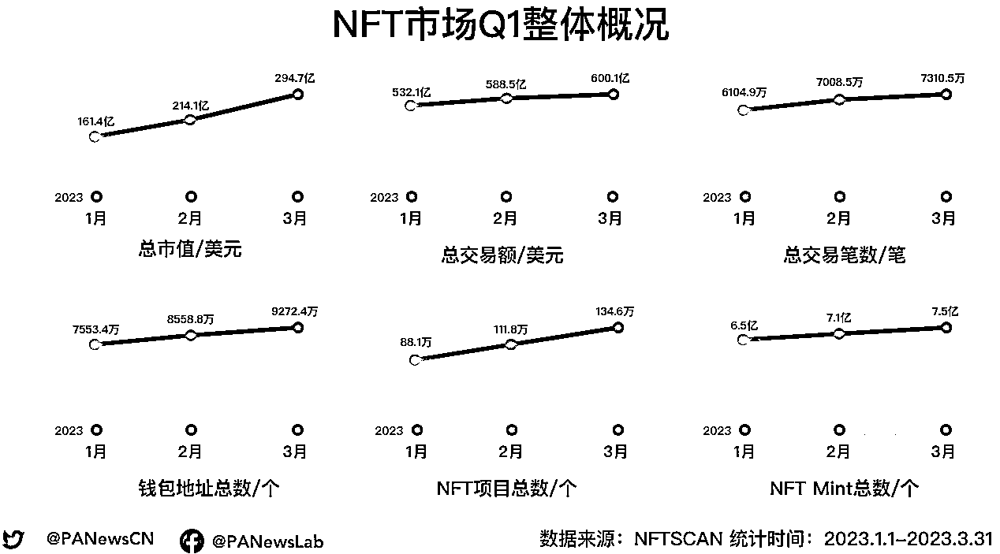
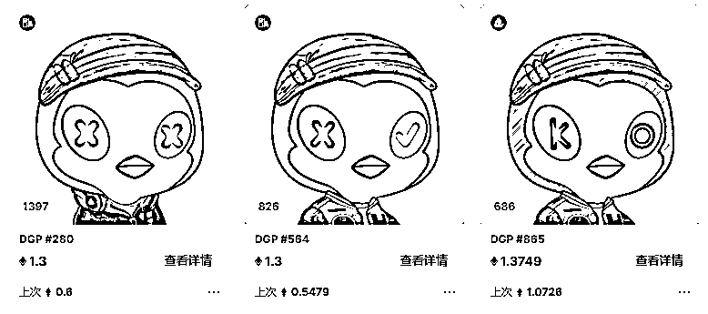
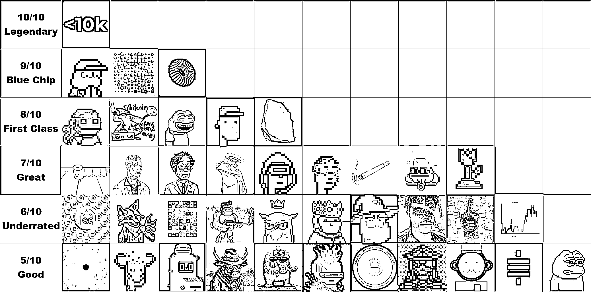
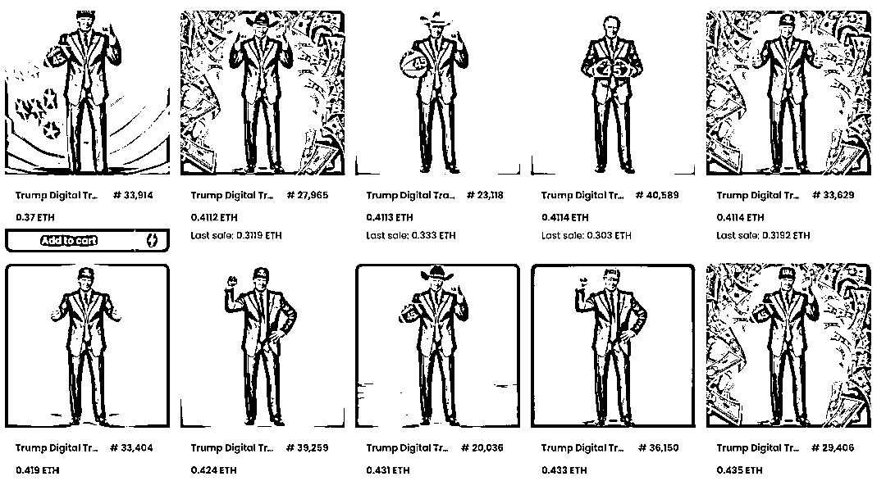

# NFT 市场：PFP 已死？新的范式和机会展望

> 原文：[`www.yuque.com/for_lazy/thfiu8/seknt6fs8mglnb1r`](https://www.yuque.com/for_lazy/thfiu8/seknt6fs8mglnb1r)

<ne-h2 id="6f5efd11" data-lake-id="6f5efd11"><ne-heading-ext><ne-heading-anchor></ne-heading-anchor><ne-heading-fold></ne-heading-fold></ne-heading-ext><ne-heading-content><ne-text id="ue625d2aa">(精华帖)(46 赞)NFT 市场：PFP 已死？新的范式和机会展望</ne-text></ne-heading-content></ne-h2> <ne-p id="ua3b26916" data-lake-id="ua3b26916"><ne-text id="ud9e2601e">作者： 焦波 | 水镜</ne-text></ne-p> <ne-p id="u0896fca5" data-lake-id="u0896fca5"><ne-text id="ubb8d21a0">日期：2023-07-10</ne-text></ne-p> <ne-p id="u5ba15e09" data-lake-id="u5ba15e09"><ne-text id="u8b7f850e">大家好，我是焦波，感谢生财有术 Web3 航海的邀请。很高兴今天能够有机会跟大家分享一些我个人在 NFT 市场的思考和观点，希望能够对大家有所帮助。</ne-text></ne-p> <ne-p id="u3c8cb0fc" data-lake-id="u3c8cb0fc"><ne-text id="u7f704c54">2023 年 Q1 的 NFT 市场情况，用数据说话：</ne-text><ne-card data-card-name="image" data-card-type="inline" id="O16oY" data-event-boundary="card"></ne-card></ne-p> <ne-p id="u45b34504" data-lake-id="u45b34504"><ne-text id="u57a07f9a">1、第一季度的 NFT 市场的总交易额已突破 600 亿美元，增长了约 67.9 亿美元。Ethereum 依旧是规模最大的 NFT 市场，以 583.8 亿美元的总交易额占据 96.7%的市场份额；从日均交易额来看，Ethereum 以超 648.6 万美元的日均交易额稳居首位，其次是 Solana 为 116.3 万美元，Polygon 则为 51.4 万美元，而 BNB Chain 仅为 43.3 万美元。</ne-text></ne-p> <ne-p id="uc4aeb87f" data-lake-id="uc4aeb87f"><ne-text id="u177aa795">2、NFT 市场共新增了超 46.4 万个项目，Polygon 的上新项目占总数的 74.5%。</ne-text></ne-p> <ne-p id="u8b3d5c86" data-lake-id="u8b3d5c86"><ne-text id="ucb736924">3、截至第一季度，NFT 市场共铸造了超 1 亿个 NFT 资产。其中，Polygon 和 BNB Chain 累计新铸造的 NFT 数量占总体的 76.7%，Ethereum 和 Solana 的日均新铸造量远低于平均值。</ne-text></ne-p> <ne-p id="ua8a0152d" data-lake-id="ua8a0152d"><ne-text id="u8a785a20">4、进入 Q1 以来，NFT 资产相关的交互钱包地址数超 9272.4 万个，BNB Chain 和 Polygon 的地址数分别以 31.8% 和 21.8% 的速度增长，两者总地址数占总体的 83.2%。</ne-text></ne-p> <ne-p id="udcbdfbea" data-lake-id="udcbdfbea"><ne-text id="uee221fea">5、蓝筹项目市值和均价双下跌，且出现明显分化，但仍受市场资金青睐，整体成交量平均涨幅达 14.7%。</ne-text></ne-p> <ne-p id="ueddf0409" data-lake-id="ueddf0409"><ne-text id="u77977543">6、无论是交易额、销售量还是用户规模增长，Blur 获得了爆发式增长，但在活跃用户量上 OpenSea 仍以绝对优势稳坐市场龙头，具备显著优势。</ne-text></ne-p> <ne-p id="u6e686729" data-lake-id="u6e686729"><ne-text id="uac530112">但是最近市场上出现了大量传播恐慌的声音。这主要是因为“蓝筹三宝”（Moonbirds、CloneX、Doodles）持续创新低，并且不断被做空。由于市场缺乏新的故事主线，赚钱效应极差，人们纷纷讨论 NFT 是否已走向末日，这样的消极观念此起彼伏。然而，抛开情绪化的看法，这些事件给我们带来了哪些思考？</ne-text></ne-p> <ne-p id="ue79a5c83" data-lake-id="ue79a5c83"><ne-text id="ucaef7b20">我们先来说说几个现象级的 PFP 蓝筹项目。</ne-text></ne-p> <ne-p id="uc1449f52" data-lake-id="uc1449f52"><ne-text id="uc74d3762">首先是 CryptoPunks，被称为 NFT 界的比特币，地位是不容置疑的。因为它是第一个使用区块链技术来代表独特资产所有权的项目。</ne-text></ne-p> <ne-p id="u8ea7c353" data-lake-id="u8ea7c353"><ne-card data-card-name="image" data-card-type="inline" id="RCmgE" data-event-boundary="card"></ne-card></ne-p> <ne-p id="u2da18110" data-lake-id="u2da18110"><ne-text id="uc2391de9">在巅峰时期来到了 100 以太的地板价格，其中最便宜的一个 NFT 头像，价值高达 40 万美元，也就是 200 多万人民币。成交价最高的为 CryptoPunk #3100，达到了 4200 以太，约合美元 1600 万左右，人民币接近亿级别的水准，令人咂舌。能买得起这个 NFT 的群体非富即贵。</ne-text></ne-p> <ne-p id="u87f5741d" data-lake-id="u87f5741d"><ne-text id="u6a4118bf">然后接下来就是 BAYC，也就是无聊猿。这个 NFT 更为出圈的原因就是，购买它的很多都是广为人知，具备一定影响力的明星。</ne-text><ne-card data-card-name="image" data-card-type="inline" id="XKHyu" data-event-boundary="card"></ne-card></ne-p> <ne-p id="ua78fe391" data-lake-id="ua78fe391"><ne-text id="u472af72d">例如，NBA 球星斯蒂芬·库里早些时候以 55 以太（约合 18 万美元）的价格购买了一个穿着粗花西装的无聊猿。著名的美国电视主持人吉米·法伦去年 11 月以近 22 万美元的价格购买了一只穿着条纹 T 恤和心形墨镜的无聊猿的形象。就在最近，获得奥斯卡奖的说唱歌手 Eminem 花了近 46 万美元买下了一只有点像他的猿猴。还有大家熟知的一些明星林俊杰、余文乐、陈柏霖、吴建豪等都是无聊猿的持有者。</ne-text></ne-p> <ne-p id="uc126634d" data-lake-id="uc126634d"><ne-card data-card-name="image" data-card-type="inline" id="I8F77" data-event-boundary="card"></ne-card></ne-p> <ne-p id="u62e98e64" data-lake-id="u62e98e64"><ne-card data-card-name="image" data-card-type="inline" id="ITGYv" data-event-boundary="card"></ne-card></ne-p> <ne-p id="u2f7e8f06" data-lake-id="u2f7e8f06"><ne-text id="u9b1ec7d5">BAYC 还和阿迪达斯联名发布了元宇宙入场券，探索各种类型新的媒体机会，包括电影、电视剧、音乐和游戏。环球音乐也成立了 Kingship 虚拟乐队，其中乐队就是由一个变异猿和三个无聊猿角色组成。而且在大部分新的 NFT 项目，持有 BAYC 可以直接获得白名单权益，凸显了这个 NFT 的价值。</ne-text></ne-p> <ne-p id="ueb3c83f1" data-lake-id="ueb3c83f1"><ne-text id="uea9bf881">之前主流公认的的蓝筹 NFT，除了以上两个，还有红豆 Azuki，MAYC（变异猿，是无聊猿衍生的系列），CLONEX（RTFKT 旗下的 3D NFT，被耐克收购），Doodles（卡通风格），Moonbirds（像素风格，俗称月鸟）等。我们这里的很多朋友应该也是这些蓝筹的持有者。</ne-text><ne-card data-card-name="image" data-card-type="inline" id="h2dFl" data-event-boundary="card"></ne-card></ne-p> <ne-p id="ua2a8b669" data-lake-id="ua2a8b669"><ne-card data-card-name="image" data-card-type="inline" id="YZuyI" data-event-boundary="card"></ne-card></ne-p> <ne-p id="u48185bff" data-lake-id="u48185bff"><ne-card data-card-name="image" data-card-type="inline" id="Kbkj6" data-event-boundary="card"></ne-card></ne-p> <ne-p id="u4b76d8f9" data-lake-id="u4b76d8f9"><ne-card data-card-name="image" data-card-type="inline" id="OCAqU" data-event-boundary="card"></ne-card></ne-p> <ne-p id="ued56050f" data-lake-id="ued56050f"><ne-card data-card-name="image" data-card-type="inline" id="r873x" data-event-boundary="card"></ne-card></ne-p> <ne-p id="ueb463edb" data-lake-id="ueb463edb"><ne-text id="u77171432">从以太坊上具有代表性的 Top 10 头部项目的第一季度表现来看，这些蓝筹项目的市值并未随着整体市场上升，反而缩水约 4.1 亿美元，整体平均跌幅达 18.72%。其中，Azuki 的表现坚挺，市值上涨了 17.5%，Bored Ape Yacht Club、CryptoPunks、Otherdeed、Bored Ape Kennel Club 和 Azuki 并未出现明显跌幅，平均下跌 4.4%，但 CloneX、Moonbirds、Doodles 和 Meebits 的市值则出现大幅下降，平均跌幅达 40.1%。</ne-text></ne-p> <ne-p id="ub91dce84" data-lake-id="ub91dce84"><ne-text id="u8c5ad37a">曾经的蓝筹三宝 CloneX、Moonbirds、Doodles 现在也被人戏称为“蓝筹三傻”。</ne-text><ne-card data-card-name="image" data-card-type="inline" id="zdcVD" data-event-boundary="card"></ne-card></ne-p> <ne-p id="ucefeac46" data-lake-id="ucefeac46"><ne-text id="ub674fd4d">为什么 PFP 项目的遇到了这样的瓶颈呢？我觉得主要有以下几点原因。</ne-text></ne-p> <ne-p id="ub99cf517" data-lake-id="ub99cf517"><ne-text id="uc3e0dbbe">1、目前想要进入到蓝筹 PFP 的行列，其地板都有一定的标准，所以这也就意味着这些 PFP 的定位是奢侈品。一方面还是需要有更大的用户基数，另外一方面最终能成为奢侈品定位的也只有一部分项目。</ne-text></ne-p> <ne-p id="uc4c8eb6f" data-lake-id="uc4c8eb6f"><ne-text id="ud4411248">2、其实很多项目短时间做出声量是不难的，懂得市场营销的逻辑，能营造热度是 OK 的。但是难度就是长期运作还能够保持社区的活跃度，大部分 NFT 项目的社区运营能力可以说几乎为 0。而 PFP 的长期价值体现又特别需要这个能力，这也就是为什么那么多项目出道即巅峰的原因。</ne-text></ne-p> <ne-p id="u7e5cb321" data-lake-id="u7e5cb321"><ne-text id="u8c518750">3、类似 Moonbirds 的 Kevin Rose 这样的项目主导人，原先大家会为 Moonbirds 买单，付出高额的溢价，就是认可创始人的影响力。后面 Moonbirds 宣布了 CC0，其实对于大部分人来说感受就是软 RUG 了。所以对于大部分项目，如果 90% 的成败都寄托在创始人上，这个风险点是很大的。相对来说，类似 Yuga Labs 他们集团化运作，即使是创始人退居二线，也不影响整个项目的发展，风险就会低不少。但是大部分的 PFP 项目顶多就是临时的草头班子，兼职成员在项目发售后就去下一个项目了，项目想要长期运作的难度也很高。</ne-text></ne-p> <ne-p id="u402310f8" data-lake-id="u402310f8"><ne-text id="ub9c9c4af">人人都想成为 PFP 的蓝筹项目，不过经历过这么多 PFP 项目之后，大家才会知道成为一个蓝筹的 PFP 项目的难度是多么的巨大，尤其是穿越牛熊的蓝筹项目。一将功成万骨枯，几万个 PFP 项目里才跑出了目前的几个蓝筹 PFP，大部分项目在经历了短暂的高点之后，回归原本的价值 -- 可能就是一张图片的价值。</ne-text></ne-p> <ne-p id="uf39b5512" data-lake-id="uf39b5512"><ne-text id="uaf37f471">当然，也不是说 PFP 就没有机会再出好项目，只是不能像当初那么 FOMO 说某个项目一定有机会成为蓝筹，而是比较理性的态度来看待，找好的项目，而且尽可能低的持仓成本，会让自己的心态变得更好。</ne-text></ne-p> <ne-p id="uc53ed82c" data-lake-id="uc53ed82c"><ne-text id="u9ac5894b">那么，NFT 市场新的增长点，还需要强有力的新的范式，除开 PFP 的叙事，那么有那些范式有机会跑出好的 NFT 项目呢？</ne-text></ne-p> <ne-p id="u2b6863a1" data-lake-id="u2b6863a1"><ne-text id="u261fb54d">特别是有发币预期的项目，有可能会把一部分的 Token 价值绑定到 NFT 上。另外如果号召力比较强的平台，也会吸引来很多合作者，提供权益，也就是最近炒的比较火的权益型 NFT。</ne-text></ne-p> <ne-p id="u799514e1" data-lake-id="u799514e1"><ne-text id="u211def0c">这种项目的逻辑，就是：</ne-text> <ne-text id="uccab3d32">1、更低的风险成本，有保底，因为平台需要长期运作，如果要进入下个阶段，不可能让自己的 NFT 项目地板太难看。跑路和软 RUG 风险也相对更低一些。</ne-text> <ne-text id="u93347bee">2、有稳定的团队和应用支撑 NFT 的基础价值。</ne-text> <ne-text id="u6ec6a402">3、发币预期。一般会联动 NFT 打造经济模型，发行治理代币。</ne-text></ne-p> <ne-p id="u6f562e2f" data-lake-id="u6f562e2f"><ne-text id="u41da60a0">不过是否能够跟项目长期恋爱，也还是要具体情况具体分析，不能过于上头太过迷信项目方的承诺。因为这里还是存在承诺没有兑现或者不及预期的可能性。另外由于平台竞争和市场情况的变迁，有可能部分项目存在短期高估的可能性。</ne-text></ne-p> <ne-p id="u05c59059" data-lake-id="u05c59059"><ne-text id="ub84592b7">举例：</ne-text></ne-p> <ne-p id="u2dbc2400" data-lake-id="u2dbc2400"><ne-text id="uc53644e2">DeBox 基于 DeBox App 发行了三期共计 4 个系列 8192 个 NFT。初代 Free Mint，突破了 1E 的价格，第三期 0.08E 的铸造价格，也稳定在 0.5E 的地板。因为创建 Club 需要质押对应的 NFT，另外持有 NFT 也可以每日领取社区的积分，以后 1:1 兑换成代币。</ne-text><ne-card data-card-name="image" data-card-type="inline" id="WoEdl" data-event-boundary="card"></ne-card></ne-p> <ne-p id="u8bfd4a33" data-lake-id="u8bfd4a33"><ne-text id="u7a09c564">与比特币一样，Inscriptions 也具备持久、不可改变、安全和去中心化的特征。铭文刻在 BTC 的最小单位 sats 上，给每个 sats 提供了独一无二的标记，让本如白纸的 sats 有了彩色皮肤或是有了新的意义，这是最有意思的点。未来人们将更倾向于将它视为“Digital Artifact”（数字文物）。这形成了一个全新的叙事，是对原有比特币功能和使用的挑战和探索。铭文成为了价值收藏的一种形式，比特币 OrdinalsNFT 的类型主要包括图片（image）、文本（text）、视频（video）和音频（audio）这四类。</ne-text></ne-p> <ne-p id="uab9496e1" data-lake-id="uab9496e1"><ne-text id="u638297c9">比特币的 Ordinals NFT 与传统的 NFT 发行具备显著的区别：</ne-text></ne-p> <ne-p id="u9d7df25a" data-lake-id="u9d7df25a"><ne-text id="u72807633">比特币的 Ordinals NFT 始终有链上内容，不会丢失。铭文创作者必须支付与内容大小成比例的费用。相比之下，以太坊 NFT 内容可以链下存储在 IPFS 等平台上，并且可能会丢失。</ne-text></ne-p> <ne-p id="u255566ee" data-lake-id="u255566ee"><ne-text id="uccf7b17d">铭文可以直接出售，无需第三方（例如交易所或市场）代表用户进行转让。</ne-text></ne-p> <ne-p id="u473d1390" data-lake-id="u473d1390"><ne-card data-card-name="image" data-card-type="inline" id="uoTc2" data-event-boundary="card"></ne-card></ne-p> <ne-p id="udd2360c2" data-lake-id="udd2360c2"><ne-text id="u62ef14a1">知名的 BTC NFT 系列</ne-text></ne-p> <ne-p id="uefe248f7" data-lake-id="uefe248f7"><ne-text id="u3ea29d28">Bitcoin Punks 是一个模仿以太坊上的 CryptoPunks 的 NFT 项目，共有 10000 个不同的 8 位像素风格的人物头像，每个都具有独特的属性和稀缺性。Bitcoin Punks 是第一个使用 Ordinals 将原始以太坊 CryptoPunks 成功上传到比特币区块链的项目，于 2023 年 2 月 9 日在 Ordinals 协议上完成铸造，并在 Opensea 等平台上进行交易。</ne-text></ne-p> <ne-p id="u7fcf6b9a" data-lake-id="u7fcf6b9a"><ne-card data-card-name="image" data-card-type="inline" id="vGO4r" data-event-boundary="card"></ne-card></ne-p> <ne-p id="u9d37c1ef" data-lake-id="u9d37c1ef"><ne-text id="u0eb7a1b4">TwelveFold 是 Yuga Labs 推出的一个比特币 NFT 项目，是一个由 300 件独特的生成艺术作品组成的系列。TwelveFold 于 2023 年 3 月 4 日开始拍卖， 24 小时内结束，共筹集了 1650 万美元。拍卖采用了盲拍（blind auction）的方式，拍卖结束后，前 288 名成功竞拍者将收到他们所购买的作品，最低出价为 2.25 BTC。</ne-text></ne-p> <ne-p id="u13e91f19" data-lake-id="u13e91f19"><ne-card data-card-name="image" data-card-type="inline" id="StTqu" data-event-boundary="card"></ne-card></ne-p> <ne-p id="uc2782b26" data-lake-id="uc2782b26"><ne-card data-card-name="image" data-card-type="inline" id="TQf1t" data-event-boundary="card"></ne-card></ne-p> <ne-p id="uc56264b7" data-lake-id="uc56264b7"><ne-text id="u07bc6ece">随着 BTC NFT 概念的发展，后面又延展出 BTC 域名和 BitcoinStamps 的玩法</ne-text></ne-p> <ne-p id="u29553daa" data-lake-id="u29553daa"><ne-text id="uc238cd76">Sats Names 是一个使用 Orinals 协议为比特币定义域名的标准。目标是为比特币建立一个域名的生态系统，由比特币的爱好者建立，并完全基于比特币网络进行开发。该项目主要有以下三大目标：</ne-text></ne-p> <ne-p id="u7a7b54f5" data-lake-id="u7a7b54f5"><ne-text id="ue16af029">比特币网络上的交易，是注册和更新 。sats 域名所需的全部内容。一个比特币节点即可包含域名状态所需的所有信息。无需任何其他数据库或去中心化存储服务，任何客户端都可以独立计算所有域名的真实状态。</ne-text></ne-p> <ne-p id="uada3ed58" data-lake-id="uada3ed58"><ne-text id="u513b9b65">保持绝对的去中心化，没有人可以关闭该协议或阻止其他人注册域名，没有智能合约或具有特权访问的前端，没有代币经济，没有提前预留，没有 gas token，没有治理，没有任何激励。</ne-text></ne-p> <ne-p id="udc10e085" data-lake-id="udc10e085"><ne-text id="ub19dcab6">例如，第一个铸造包含 "satoshi.sats "的 inscription 的用户拥有该域名和更新该域名的权利。该协议通过唯一性保证了第一个铸造人的权益。</ne-text></ne-p> <ne-p id="ufc0139b7" data-lake-id="ufc0139b7"><ne-text id="u4f69f831">BTC Stamps 的实现机制为将 base 64 格式的图像数据嵌入到比特币链上的交易输出之中，从而永久地在比特币链上保存相应的图片数据。BTC Stamps 相较于 Ordinals 最大的优势在于，其数据保存基于最简单的交易输出完成，因此比特币全节点们“别无选择”，只能选择去保存 BTC Stamps。 BTC Stamps 在其问世的头 20 天内，通过该方式所铸造的 NFT 数量要远远超过我们已较为熟悉的 Ordinals 起步时的数据。</ne-text><ne-card data-card-name="image" data-card-type="inline" id="gZYFK" data-event-boundary="card"></ne-card></ne-p> <ne-p id="udd0fd05d" data-lake-id="udd0fd05d"><ne-text id="u5e73cdc4">以上都是近三个月发展出来的 BTC NFT 生态的玩法。所以这个生态还很早期，创新力也是非常强的。据 Galaxy Digital 报告预测， 2025 年基于铭文和序数的比特币 NFT 市场规模将达到 45 亿美元。另外 Magic Eden 也专门推出了 BTC NFT 的交易市场。这方面建议有比较强钻研精神的朋友多关注最新动态，也可以多动手。</ne-text></ne-p> <ne-p id="uac2ec0cc" data-lake-id="uac2ec0cc"><ne-text id="u5deb70d1">2022 年 12 月，美国前总统特朗普以个人形象发行了 45000 个名为 “特朗普数字交易卡” 的 NFT，价格为每件 99 美元。每张 NFT 都有特朗普的个人形象插图，这些插图被重新设计成超级英雄、牛仔或宇航员等形象。如果购买 45 张数字交易卡，将获得一张与特朗普共进晚餐的门票。</ne-text></ne-p> <ne-p id="u7c6a5705" data-lake-id="u7c6a5705"><ne-text id="ud60cc09e">当一个 NFT 游戏玩家见到特朗普 NFT 时，第一感觉可能是，45000 个总量太多了吧，而且不是在以太链而是马蹄链？这是图狗项目吧？所以这个项目一度在发行价破发的状态，直到销售完成，才迎来了出圈的效应。地板一度冲击 1E，对于很多人来说都是非常不可思议的事情。</ne-text></ne-p> <ne-p id="ua061cc07" data-lake-id="ua061cc07"><ne-card data-card-name="image" data-card-type="inline" id="cm5oB" data-event-boundary="card"></ne-card></ne-p> <ne-p id="u16bf6f13" data-lake-id="u16bf6f13"><ne-text id="u5df078ae">近期特朗普被拘捕的事件，又让这个 NFT 系列重新吸引了公众的目光，在他出庭后的第一个小时内共售出 30 个，地板也来到了 0.4E。</ne-text></ne-p> <ne-p id="u535f77bb" data-lake-id="u535f77bb"><ne-text id="ue4f054bb">包括之前流行的哥布林，无路线图，无 Discord，无赋能。但“躺平”的情绪表达，在当时激活了市场，并且不断对外疯狂扩张的情绪蔓延开来。不论是嘟囔着奇怪哥布林语的推特 Space 还是二创，人们终于找到了一个方式向身边的人传递的同样的 MEME，最终让这个项目火爆出圈。</ne-text><ne-card data-card-name="image" data-card-type="inline" id="vxAaD" data-event-boundary="card"></ne-card></ne-p> <ne-p id="udbed6233" data-lake-id="udbed6233"><ne-text id="ube7b0cf2">所以这种 MEME 类 NFT 是很有话题性的，短时间能够成为流量密码，也给对应的 NFT 带来巨大的购买量。当然，因为 MEME 类 NFT 很吃情绪，所以也比较容易大起大落。但是如果能够分辨出这个项目本身具有出圈，并且持续吸引流量和关注力的机会，那么在初期投资的回报率是比较高的。</ne-text></ne-p> <ne-p id="u4ded1607" data-lake-id="u4ded1607"><ne-text id="u72974696">2022 年 9 月，星巴克通过 Polygon 网络推出忠诚度计划“奥德赛”。</ne-text> <ne-text id="u6467a8ae">2023 年 3 月，以每张 100 美元的价格向星巴克奥德赛会员推出高级 NFT “The Siren Collection Stamp”。铸造价格 100 美元，数量 2000，18 分钟内售罄。地板价一度突破 600 美元， 目前是 450 美元，已经是 4 倍涨幅。</ne-text></ne-p> <ne-p id="u2b164f12" data-lake-id="u2b164f12"><ne-card data-card-name="image" data-card-type="inline" id="pN9J1" data-event-boundary="card"></ne-card></ne-p> <ne-p id="udc018cae" data-lake-id="udc018cae"><ne-text id="u13557738">全球最大的社区之一 Reddit，在 Polygon 网络上推出了头像 NFT 收藏。它允许被列入白名单的创作者设计头像并以 NFT 的形式销售它们。自推出以来，在 Reddit 上创建了约 300 万个钱包，Reddit NFT 市值约为 1 亿美元，日交易量为 23 万美元。</ne-text><ne-card data-card-name="image" data-card-type="inline" id="qSNV7" data-event-boundary="card"></ne-card></ne-p> <ne-p id="ue59c9f48" data-lake-id="ue59c9f48"><ne-text id="u178c0382">这两个案例都是已经具备强大影响力的品牌，为什么还需要尝试 Web3.0 的方式来运作品牌呢？因为对年轻用户来说，品牌文化带来的身份感和归属感可能更为重要。在注意力经济下，消费者的眼球更稀缺，对忠诚度的看法已经发生了变化。</ne-text></ne-p> <ne-p id="ue4c9eb96" data-lake-id="ue4c9eb96"><ne-text id="u5e079dff">那么品牌需要做什么呢？通过内容来持续获得用户的注意力，以提高忠诚度。这也解释了星巴克为什么要打造一系列内容，这些内容帮助星巴克增加和会员互动的机会，保持忠诚度。同时在这些场景里可以增加更多的品类，提升其商业空间，升级为生活方式品牌。</ne-text></ne-p> <ne-p id="u0bc34e74" data-lake-id="u0bc34e74"><ne-text id="u03844267">来自斯坦福大学和谷歌的研究人员，为了真实可信地模拟人类行为，发起了一个名为 “Generative Agents” 的项目。创建了一个有 25 个角色的虚拟小镇，小镇居民每天早起刷牙、亲吻爱人、吃早饭，和家人、朋友、邻居社交。25 个角色实际上是 25 个 ChatGPT 实例：用指令设定人物角色，用“代理”给这些实例提出行动要求，ChatGPT 执行并给出结果。</ne-text><ne-card data-card-name="image" data-card-type="inline" id="LxkkI" data-event-boundary="card"></ne-card></ne-p> <ne-p id="u9410ab6d" data-lake-id="u9410ab6d"><ne-text id="u667e1a30">这个实验也引起了大众的关注度，因为电影《西部世界》里的真实场景，真的可能成为现实。</ne-text></ne-p> <ne-p id="ud5e9ce3f" data-lake-id="ud5e9ce3f"><ne-text id="ud4ef1b0a">设想这个项目的每个角色，都是一个 NFT，能够随着进程自我进化。购买某个 NFT，就能够以他的视角，来体验这个世界，甚至变更这个角色的 AI，来完成不一样的世界。如果有这样叙事的 NFT 项目，潜力是非常巨大的。</ne-text></ne-p> <ne-p id="u9ccf28d7" data-lake-id="u9ccf28d7"><ne-text id="u9c716adf">AI 也是近期的热点，所有跟 AI 结合的 NFT 项目，都可以多看一眼。</ne-text></ne-p> <ne-p id="u430b4eda" data-lake-id="u430b4eda"><ne-text id="u8b926299">最后说一个我自己最看好，也是最有可能爆发的品类，游戏 NFT。</ne-text></ne-p> <ne-p id="uf92efd30" data-lake-id="uf92efd30"><ne-text id="u3e19d4ed">大家或多或少都知道或者经历过 GameFi 1.0 的时代，大概在 2021 年 10～12 月爆发，东邪 RACA、西毒农民世界、南帝加密飞船、北丐赛博龙、中神通 Axie，如日中天。后面因为经济模型太暴利，不可持久，大部分项目在 1～2 个月迎来了生命的高点后螺旋下跌乃至归零。</ne-text></ne-p> <ne-p id="u7e4d5ae9" data-lake-id="u7e4d5ae9"><ne-text id="u98499dfc">2022 年又有重磅的出圈产品 STEPN 跑鞋项目，这款应该知道和参与的人更多，也造就了不少的财富神话。不过这个模型其实还是 GameFi 1.0 的优化版，指数级增长在新用户入场的资金量低于挖提卖的抛压时，也同样进入了死亡螺旋。至今一年多，都没有同样现象级的产品出现。</ne-text></ne-p> <ne-p id="uc7fc12e9" data-lake-id="uc7fc12e9"><ne-text id="u7ba68144">不过这次在香港大会，接触到很多 Web3 Game 的团队和项目，也了解到更多他们探索这个领域的思路和决心，感受到新一波的爆发可能在路上了。</ne-text></ne-p> <ne-p id="u4e504449" data-lake-id="u4e504449"><ne-text id="ue86231f3">1、传统大厂入局。类似网易、腾讯、世纪华通等国内一线大厂的 Web3 Game 产品，对比之前小工作室粗制滥造的产品来说，本身从品质和游戏性上，就有很大的超越。</ne-text> <ne-text id="u2878c54d">2、团队实力。很多团队成员已经是做过成功产品的知名团队，而且他们本身不仅仅在 Web2 有积累，核心成员也在 Web3 有所积累和沉淀。</ne-text> <ne-text id="u2adeb1cd">3、资本布局。更多资本的资金，投给了游戏领域的项目，不少都拿了比较大额的融资。</ne-text> <ne-text id="u3df4825d">4、项目模式。这一轮的项目不仅仅考虑 Fi 的问题，还考虑整体可持续性发展，包括更多经济系统的可能性。</ne-text> <ne-text id="u949b17dd">5、增量玩法。很多项目已经考虑好如何从 Web2 的用户中寻找增量，和做转化。</ne-text></ne-p> <ne-p id="uffbfd539" data-lake-id="uffbfd539"><ne-text id="u6a1e5b81">1、都会有 NFT 发售。至少第一波 NFT 成绩是要漂亮的 ，因为团队还需要打声量、后续讲故事发 Token 等，所以这波收益是能保证的。</ne-text> <ne-text id="u3292fc24">2、从中关注到一些好的项目，可以参与打金。</ne-text> <ne-text id="ub66e92b7">3、如果项目有机会爆发，Token 也是可以投资的一个点。</ne-text> <ne-text id="ufd81e316">4、特别关注在这个过程中有可能崛起的 Web3 Game 平台，可能有大机会。</ne-text></ne-p> <ne-p id="u316f1801" data-lake-id="u316f1801"><ne-text id="u409515b0">目前 Web3 Game 一般有以下几种主流的形式。</ne-text></ne-p> <ne-p id="u7afdcd51" data-lake-id="u7afdcd51"><ne-text id="u6bea63be">他们做用户增长的方式也是多种多样的，其中有主打 Web3 圈子的，通过 NFT 等形式吸引 Web3 玩家入场。也有主打 Web2 圈子的，从制作到运营到地推到买量，走传统互联网那套模式，先吸引 Web2 用户，再用中后期 Web3 的内容做转化。</ne-text></ne-p> <ne-p id="u142131f1" data-lake-id="u142131f1"><ne-text id="u7c1c5a10">Web3 Games 发展的四个阶段：</ne-text> <ne-text id="u850a0732">探索和内部小规模测试（例如 Ubisoft 的 Entrepreneurs Lab 加速器项目设立了 Web3 游戏工作室）。</ne-text></ne-p> <ne-p id="ud9fc45a3" data-lake-id="ud9fc45a3"><ne-text id="u7bc70b06">投资 Web3 游戏初创公司，以更深入地了解 Web3 如何增强 Web2 游戏玩法和底层技术（例如 Ubisoft 和 Take Two Interactive 对 Horizon 区块链游戏的投资）。</ne-text></ne-p> <ne-p id="u883bb89f" data-lake-id="u883bb89f"><ne-text id="u5faa1dd9">Web2 游戏工作室创建 Web3 游戏子公司，通常与加密原生公司和投资者合作。</ne-text></ne-p> <ne-p id="u9ed8de23" data-lake-id="u9ed8de23"><ne-text id="u25743660">成熟的 Web2 游戏发行商将 Web3 元素，特别是 NFT 和加密支付，直接融入其 Web2 游戏中。</ne-text></ne-p> <ne-p id="ud105c68d" data-lake-id="ud105c68d"><ne-text id="u820dfc0a">这些事件包括 CCP Games，科幻太空游戏《星战前夜》（EVE Online， 大型多人在线游戏）的开发商，宣布获得 Andreessen Horowitz 领投的 4,000 万美元投资，用于开发一款使用区块链技术和智能合约的新 3A 游戏。</ne-text></ne-p> <ne-p id="u4927bb95" data-lake-id="u4927bb95"><ne-text id="u1acf9d48">此外，韩国游戏公司拥抱区块链技术是最积极的。2021 年 8 月 26 日，Wemade 推出链改游戏传奇 4，一上线便受到追捧，在多个国家谷歌商店畅销榜稳居 TOP5，高峰时全球同时在线人数超过 140 万，月活一度达到 623 万人。也让 Wemade 那个年度的财报有了翻天覆地的飞跃。</ne-text></ne-p> <ne-p id="u1ed45e28" data-lake-id="u1ed45e28"><ne-text id="u4e9f2049">Netmarble 于 2022 年创办链游平台 MarbleX，并将推出 6 款 P2E 游戏；Com2uS 通过旗下区块链游戏平台 C2X 发布了 4 款链游，旗下爆款《魔灵召唤》是首款累计收入突破 1 兆韩元的韩国游戏。韩国游戏发行商巨头 Nexon 在 2023 年 3 月 22 日，宣布将与 Polygon Labs 合作，开发区块链基础设施和实用性 NFT，用于其新游戏 MapleStory Universe，也就是冒险岛的 Web3 版本。</ne-text></ne-p> <ne-p id="u2561657c" data-lake-id="u2561657c"><ne-text id="u9374bd17">所以有理由相信，随着 Web3.0 门槛的降低和基建的完善，Web3 Games 将作为一个最有可能爆发的叙事，在带来大量的用户增量的同时，也会诞生明星级的爆款项目。</ne-text></ne-p> <ne-p id="u4c316531" data-lake-id="u4c316531"><ne-text id="ue7086a79">现阶段小白用户使用钱包时会遇到一些痛点：使用钱包必须先有 Gas 费、需要寻找加密资产购买渠道、眼花缭乱的主网选择以及钱包安全问题。EIP-4337 实现了账户抽象的钱包技术方案，可以带来更多的应用场景：代付 Gas、非原生代币的 Gas 支付、聚合签名、隐私保护等。</ne-text></ne-p> <ne-p id="u68f4b9f5" data-lake-id="u68f4b9f5"><ne-text id="u1430306f">在不久的将来可以预见，账户抽象带来的更低门槛以及更多的自定义功能可能会引领钱包的一个新时代。</ne-text></ne-p> <ne-p id="uc9acc9e3" data-lake-id="uc9acc9e3"><ne-text id="u8c4152c2">以太坊扩容之路的第一步，在 EIP-4844 完全实施之后， Layer 2 Rollups 的交易费用将会降低一个数量级，甚至是降低至 0.001 美元以下，这对 Layer 2 Rollups 来说将迎来真正的爆发。到时候一定也会有很多新玩法出现，利好 NFT 生态特别是 Web3 Game 这种需要一定频率链上交互的项目。</ne-text></ne-p> <ne-p id="u6b805757" data-lake-id="u6b805757"><ne-text id="u7c0d29f4">还有很多有趣的子协议，例如可以实现 NFT 租赁的 EIP-4907 与 EIP-5006，包含时间属性的 EIP-5007，虚实整合应用的兑换协议 EIP-6672 等。</ne-text></ne-p> <ne-p id="u503b7969" data-lake-id="u503b7969"><ne-text id="ua4974b43">根据数据显示，在 2023 年以来，做市商在 NFT 市场的参与度呈上升趋势。随着做市商的加入，NFT 项目的流动性得到了一定程度的保障。这不仅有助于项目在市场竞争中站稳脚跟，还能抵御来自外部的恶意做空行为。未来，随着市场的成熟与发展，更多传统金融领域的角色有望进入 NFT 领域，为这个新兴市场注入活力。</ne-text></ne-p> <ne-p id="uf82b084d" data-lake-id="uf82b084d"><ne-text id="uea65b69e">除了综合型交易市场，例如 Blur 或者 Opensea 以外，NFT 市场未来发展的一个趋势是垂直细分平台的出现。这些平台将专注于特定类型的资产或市场，例如游戏 NFT、体育 NFT 或音乐 NFT。通过专注于特定市场，这些平台可以提供更多量身定制的服务并吸引相对应的用户群。</ne-text></ne-p> <ne-p id="u1fdda08c" data-lake-id="u1fdda08c"><ne-text id="u14b1b0c6">另一个趋势是新交易资产的出现。不仅仅是 PFP，随着 NFT 市场的不断发展和演变，新型资产将会出现并成为投资的对象。</ne-text></ne-p> <ne-p id="u43e70568" data-lake-id="u43e70568"><ne-text id="u594384f3">最后，由于以太坊区块链的网络效应和已建立的用户群，多链 NFT 和 L2 NFT 在与 ETH NFT 的竞争中可能面临挑战。然而，随着其他区块链继续发展并获得牵引力，可能会有跨链交易和互操作性的机会。</ne-text></ne-p> <ne-p id="u268200e9" data-lake-id="u268200e9"><ne-text id="u5d74050a">我这次的分享到此结束。感谢大家的聆听。</ne-text></ne-p> <ne-hole id="ua2e88b91" data-lake-id="ua2e88b91"><ne-card data-card-name="hr" data-card-type="block" id="F2wIp" data-event-boundary="card"><ne-p id="u605c0da2" data-lake-id="u605c0da2"><ne-text id="ud49f9799">评论区：</ne-text></ne-p> <ne-p id="u423b4a1b" data-lake-id="u423b4a1b"><ne-text id="u03a5df36">阿黎 : 太棒了!感谢焦波教练分享的思路和项目</ne-text> <ne-text id="ub0e79137">亦仁 : 感谢分享，已加精华。</ne-text> <ne-text id="u54ef8962">张老师 | 张导师 : 买了几个 btc 的 punk，跌了 60%多，欢迎来抄底</ne-text> <ne-text id="ub0ea3b52">焦波 | 水镜 : 感谢亦仁大大</ne-text> <ne-text id="u94efe765">Alex : 恭喜恭喜[强]</ne-text> <ne-text id="u1b28b2b3">Alex : [强]专业</ne-text></ne-p> <ne-p id="uc016333c" data-lake-id="uc016333c"><ne-card data-card-name="image" data-card-type="inline" id="u2rX8" data-event-boundary="card"></ne-card></ne-p> <ne-hole id="u9416cf02" data-lake-id="u9416cf02"><ne-card data-card-name="hr" data-card-type="block" id="uhX19" data-event-boundary="card"></ne-card></ne-hole></ne-card></ne-hole>