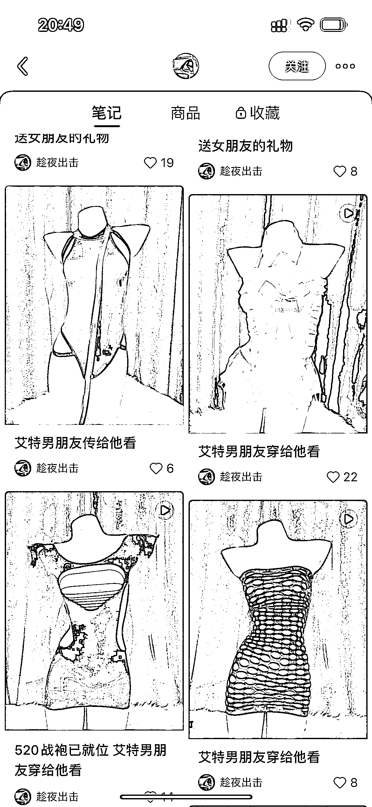
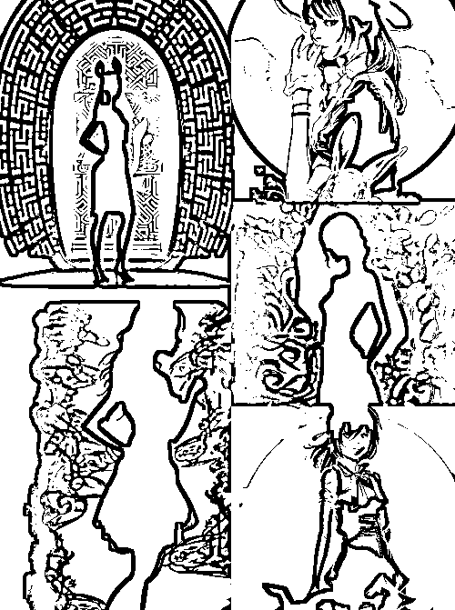

# 小红书店铺卖情趣内衣，直播+笔记打法月入 6000 保姆级教程

> 原文：[`www.yuque.com/for_lazy/thfiu8/lfh1au2nc9yt6vqo`](https://www.yuque.com/for_lazy/thfiu8/lfh1au2nc9yt6vqo)

## (64 赞)小红书店铺卖情趣内衣，直播+笔记打法月入 6000 保姆级教程 

作者： 书豪 

日期：2023-08-01 

##### 各位朋友好，我是在杭州的生财龙珠圈友书豪，一个连续创业四年的 95 后，目前连续四年都年入百万。 

#####   

##### 从三月份到八月份，我们团队总计在运营 30 家小红书店铺，目前一个月利润在 20 万左右，平均下来我们单店铺单月的利润在 6000 元左右。 

##### 

##### 今天给大家分享其中我们一家羞羞的内衣店铺的玩法。 

#### 主要围绕这几点内容去分享： 

#### 1\.  为什么会选择做情娶内衣（羞羞的内衣）？ 

#### 2\.  情娶内衣如何选品？ 

#### 3\.  如何做笔记？做标题？做视频？做封面？ 

#### 4.  小红书如何直播卖货，封面、标题、逼单话术和赠品全方位优化？ 

5.  如何避免违规呢？ 

一、那么为什么会选择做情娶内衣（羞羞的内衣）？ 

第一：在开始做之前，我们通过在抖音以及小红书都调查了一下，发现这个类目在市场上需求还是蛮大的，且竞争力也没那么大。 

第二：情娶内衣的款式变化会比较多，这方向的设计方向比较有趣，自己想把店铺做大，往原创品牌有货源的方向走。小红书店铺长期盈利肯定是有货源为主要支撑。 

第三：这个充斥着各种不确定的时代，促使人们产生更为复杂的多元化的情绪，譬如，孤独，焦虑，忧郁，暴躁，怜悯，希望等，会更加注重自己精神上的需求。对于 QQ 内衣这个东西，我不会觉得害羞，我觉得这是人类正常的一个欲望。并且，我觉得情娶内衣也是情侣之间的调和剂，我相信很多人也是如此。 

以上是我自己想做情娶内衣的原因，下面开始进入选品阶段。插个小插曲，在开始做这个之后，也会有圈友问，为什么做这个？不羞？ 

我说的是，饮食男女，食色性也，审视自己的内心，做小红书永远最重要的是用户的需求，市场的需求。比起做女装，QQ 内衣好做多了。 

二、如何选品？ 

在选品之前，我是先定位好我自己想走的一个服装风格，接着想好了我的品牌名以及设计好品牌 logo，再把小红书的简介想好，表面的门面弄好了，我就开始选品了。 

1.选品标准。 

（1）小红书找低粉爆款。（这个在小红书找不多） 

（2）抖音找销量高的款 

（3）1688 找销量 1000+以上的品，且发货时间在 24 小时内或 48 小时内，预售的不要选。 

（4）自己觉得好的款式。 

三、如何做笔记？做标题？做视频？做封面？ 

1.买样品，回来自己拍视频，在小红书找那些爆款标题，关键词，直接搬过来。 

我也是第一次做 QQ 内衣这类品，笔记视频自己实拍的比较多，同行是你最好的老师，实拍视频呈现方式参考做的比较好的同行就行。 

实拍视频参考账号：雪乃的试衣间（424511432）、羞羞秘密花园（6147070105）、头文字 D（3810173024）、趁夜出击（882989161） 

2.图文笔记内容把控 

（1）图片尺寸 1:1/4:3/3:4 

（2）文字直白易懂 

（3）评论区互动引导 

（4）封面和标题方向一致 

（5）有卖点 

（6）定位精准 

（7）色调/风格一致 

（8）有针对目标用户 

（9）没有太高饱和的颜色 

（10）不要过度修图，适当用 emoji 分离 

3.分享错误案例 

3.分享错误案例 

  

  

  

最主要的点，要想把图片拍好，一定要把景、灯光补好。（没有道具的去买） 

正确笔记分享（保持封面整洁干净） 

  

四、为什么我们在小红书直播卖货，如何做呢？ 

其实，我们这个情娶内衣店刚开始的那段时间笔记的效果并不好，于是，我们减少了发笔记的量，开始晚上直播（晚上 10 点-2 点），那是 2023 年 5 月 16 号开始播，基本每天都播，第一天播，才 20 多个人观看，但我们并没有放弃，我们第二天开始优化直播封面和标题，第二晚我们场观有 1000 人以上，当时我们很兴奋，虽然第二场没有出单。 

但我们发现直播封面跟标题很重要，于是我们第三天开始找更符合情趣内衣更吸引人的封面。以下是我们测过的封面 

  

在那之后，我们都会观察每一场的的点击率，也正是封面问题解决了，我们的观看量也是每天都在加，也开始稳定出单，最高场观达 1 万+，当晚成交率 24 单。 

  

最高场观数据截图 

  

但后面，我们又遇到一个问题，就是在 618 期间，我们直播的流量猛降，当时很着急，因为也没有违规，不明白为什么，就一直在寻找原因，然后也去看了其他同行的直播，发现他们的直播观看量也很少，但是没有我们店铺那么严重，尽管如此我们还是坚持播，2 天后吧，流量稍微也上 1000+了，也有出 1-2 单，但受到 618 那些大主播的影响，我们流量是没之前那么好了。在那之后，我们每晚播的成交量都只有 1-5 单左右。我们决定停播开始优化笔记。 

以下是停播后的转化数据 

  

  

直播逼单话术和套路 

分享一个我们在直播间常用的一个方法：送丝袜。 

提醒用户今晚在直播间下单就送丝袜，找几个托，回到直播间回复：已拍，记得送丝袜哦 

给大家说一下，在直播期间，我们测出一个规律，那就是每场开播时，小红书都会给到爆光扶持，这个时候你的场观会升的很快，但也就维持 30 分钟左右，之后的话，就没什么人进来了，正因为发现了这一点，我们实行多场次少时间的计划，也就是我们每一次开播只在 50 分钟或一个小时左右，反正只要没流量了，我们就下播，休息 10 分钟，再继续开播，但是现在小红书直播规则改了，平台需要你播上 3 个小时才给到 3000 的曝光率，因此，现在也很多同行也都没有在直播了。 

目前我们店铺停播后，就开始已发笔记为主，笔记的话是我们原创视频+混剪，混剪的话是在抖音找同款素材，一下就可以了，每天发 5-6 条。因为有粉丝的基础，再加上每天发上几条笔记，我们店铺每天也有稳定的出单量。 

最后再说一下，违规问题，因为这个类目也容易违规。 

违规点总结 

1.商品类目错放 

解决办法： 

（1）注册医疗器械的资格证书（这个大多数人不会去弄，太麻烦） 

（2）标题不要出现情趣字体，以及商品图不过审的就自己买回来用人台实拍上架（这个也不能说完全避免，有些还是会收到类目错放的问题，这个没有办法，你只能去申诉或则修改标题图片，还是不过审就不要这个款，直接下架） 

2.笔记违规 

笔记违规无非就是太漏，不良诱导。 

这种的话不要放真人模特穿的图就可以了，还有做的视频笔记，氛围不要弄得太欲，不然也容易违规。 

如何进一步优化笔记 

1.做原创视频，保持笔记的一个风格统一性。 

2.笔记标题，不要太低俗，要给到人一个共情（可参考杜蕾斯的广告） 

当然这个适合有一定粉丝基础的且想往品牌方向走的，如果刚开始做的话，就建议从抖音或小红书搬运素材混剪，标题参考爆文标题。 

关于抖音或小红书素材混剪方法 

1.直接拿视频，封面加一些文字，如，显瘦、聚拢等。 

2.将视频进行抽帧。 

3.将抖音实拍的商品图片下载下来做成视频 

直播方式 

最后说一下这个问题，如果想直播，建议不用特意请直播，因为这个类目的直播不同于普通的服装直播，因为情娶内衣这种款式，更多的是追求款式，按照你买衣服的逻辑是行不通的，分享一下自己的想法。 

1.可以情侣直播，主要以互动放松的形式，让人们在直播间停留于时间长一点。 

2.把直播间打造一个浪漫高级的感觉，给人们讲爱情，讲讲情话、情诗，引起大家的共鸣，让人觉得直播有价值，千万不要擦边、低俗，这样随时被举报。 

3.直播讲话时，声音要柔，要给到人一种氛围感，但不要嗲。 

情趣内衣赛道还是很推荐的，相比女装好做很多，竞争力也相对较少。 

以上，一起生财有术！欢迎各位圈友前来交流，微信  wshinvest1 

## 往期文章： 

### [如何矩阵化经营 30 个小红书店铺月利润过 20 万？](https://articles.zsxq.com/id_3qslvwfcmwn3.html) 

[人生的第一个 100 万，我是怎么赚到的？！](https://articles.zsxq.com/id_kek27cqo56wf.html) 

#### [组织生财有术福建厦门圈友聚会复盘！](https://articles.zsxq.com/id_7gqhllpk7tpk.html) 

### [小红书单店铺单月 6000+利润选品保姆级教程](https://articles.zsxq.com/id_xwveu3e0usfv.html) 

### [小红书无货源电商，单品 4w+利润，我做了什么？](https://articles.zsxq.com/id_8o3ptacdp6mj.html) 

### [抖音直播间月消耗过百万的千川投流经验分享](https://articles.zsxq.com/id_d3zembkeh2cw.html) 

### [2023 小红书幼教考编保姆级教程](https://articles.zsxq.com/id_cpdec6j4xtho.html) 

### [小红书爆款封面最新设计攻略！带你掌握流量密码](https://articles.zsxq.com/id_bbisxulzsup1.html) 

### [如何拆解一个小红书爆款视频](https://articles.zsxq.com/id_opo78sxacew9.html) 

### [小红书无货源电商做女装如何选品？](https://articles.zsxq.com/id_1wxixz3rofb3.html) 

### [小红书颜值测评变现保姆级教程](https://articles.zsxq.com/id_15njj2g5hxfr.html) 

### [小红书低粉爆款案例拆解教程](https://articles.zsxq.com/id_0nmnwdg6mb0l.html) 

### [小红书新人入局月入 100-1000 元保姆级教程](https://articles.zsxq.com/id_sbk8lqv5unca.html) 

###   

### [抖音单品短视频带货 1000 万 GMV，我是怎么做到的？！](https://articles.zsxq.com/id_qoak1w7ptnwf.html) 

### [抖音直播间月消耗过百万的千川投流经验分享](https://articles.zsxq.com/id_d3zembkeh2cw.html) 

评论区： 

坏孩（大学生） : 书豪哥牛 b sharge : 优秀的豪哥，真诚的分享 蓝子鱼 : 优秀，配合直播提升成交率 书豪 : 期待和坏孩喝一个! 书豪 : 谢谢 S 哥认可[呲牙][呲牙] 书豪 : 子鱼老师的文章我经常看 谢安生 : 这次还带有直播的经验，豪哥真是真诚分享，大赞！ 月起星九 : 豪哥团队是专业的[强] 

  