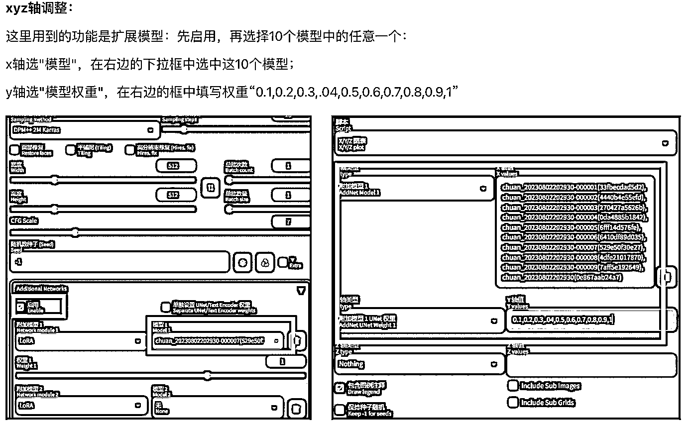

# MJ、SD 以及 lora 的换脸教程整合版

> 原文：[`www.yuque.com/for_lazy/thfiu8/ksngfbhg0i90byq6`](https://www.yuque.com/for_lazy/thfiu8/ksngfbhg0i90byq6)

## (58 赞)MJ、SD 以及 lora 的换脸教程整合版 

作者： 萧川川川 

日期：2023-08-07 

写真自由！终于实现用 lora 换脸啦～MJ、SD 以及 lora 的换脸教程整合版 

MJ 和 SD 的换脸我都用过，体验上是 SD 的局部重绘相似度会更高一点。但是从普通人做证件照的角度，还远远不够，我就直接给自己练了 lora 进行换脸，还蛮像的，感觉可以成为手动秒鸭相机了。 

这里把用 MJ、SD 和 lora 炼丹换脸的教程全部整合到一起了，如果想看炼丹直接到第四部分。 

强调一下，我是 mac 电脑，SD 和炼丹都是在云端完成的，mac 用户友好版。 一、图片准备 需要一张表情自然的正面照，可以参考下面吴彦祖、安妮的。 如果是想要换自己的脸，可以根据这几条去拍摄： 1、正脸照，光线好 2、五官清晰 3、微笑（表情尽量和要换脸的照片保持一致） 4、可以在美图秀秀里稍微美颜一下，加强优化下眉毛、眼睛和皮肤（mj 里是不改肤色的 t_t） 

二、MJ 换脸教程 （全文看飞书链接） 

三、SD 换脸教程-roop 插件 这里用的是 sd 中的 roop 插件换脸 ，我是 mac 电脑，所以只能用云端部署。但是查了一下 roop 云端部署也比较费劲，我直接在镜像中选择了一个有 roop 插件的。 选择的平台是 autoDL： 流程：注册>>租用新实例>>选内蒙 A 区+A40（之前试过太低的配置，roop 带不起来）>>选一个带 roop 的镜像>>创建成功>>跑 python 文件>> 成功后打开 SD 

四、lora 的安装与使用 因为头疼配置，直接选择青椒云，然后在选择朱尼酱大佬直接打包好的镜像。 青椒云链接： 1、素材准备 这里需要强调一下，训练集非常非常重要！ 这是模型的学习材料，直接关系你的 lora 能不能成功，泛化性好不好。 1）照片准备 a、20-30 张； b、高清晰度； c、多角度(尽量不要重复） 中景、近景、远景；上下左右，更多更充分、更丰富的数据； d、背景、妆容、服装尽量简单： 我第一次用了出去玩的写真，练了 4 个多小时都没出来； e、瑕疵处理： 有些比较明显的瑕疵且不想输入给模型的，比如肤色太暗、痘痘啥的可以微 p。 但是不要美颜过度，会影响模型效果。 

2）tag 打标 正确的、丰富的 tag 非常重要，把你的特征转成文字、数据并正确学习的重要一步！ 

可以按照这个模板进行打标： 主题（人物 1boy1girl、触发词）； 主要的人物特征（发色）； 动作、视角、光影效果、其他。 另外，想要保留的特征就不要放到 tag 里，比如你希望发色永远不变，是你自带的一个特征，就不需要标注。 

Tag 检验：原 tag 生成图片的时候越像 tag 打得越好。 

教程图比较多，为了阅读体验，还是看飞书文档吧[https://njmseq3llu.feishu.cn/wiki/KxYyw0xQaiBtZKkQDNtcFDvKnQf?from=from_copylink](https://njmseq3llu.feishu.cn/wiki/KxYyw0xQaiBtZKkQDNtcFDvKnQf?from=from_copylink)[https://www.autodl.com/console/instance/list](https://www.autodl.com/console/instance/list)[https://www.qingjiaocloud.com/](https://www.qingjiaocloud.com/)[https://njmseq3llu.feishu.cn/wiki/KxYyw0xQaiBtZKkQDNtcFDvKnQf?from=from_copylink](https://njmseq3llu.feishu.cn/wiki/KxYyw0xQaiBtZKkQDNtcFDvKnQf?from=from_copylink)  

 

  

评论区： 

萧川川川 : 萌新第一次发文，还请生财的老师、前辈们多多指导~ 小哈 : 太强了👍 萧川川川 : 目前实现层面我已经跑通，如果在商业化上有相关需求的大佬，求链接啦～（只知实现但不懂变现的前大厂产品经理[捂脸] 大炜 : 链接，有产品变现 萧川川川 : 您的知识号是微信吗，我加您了～ 

  