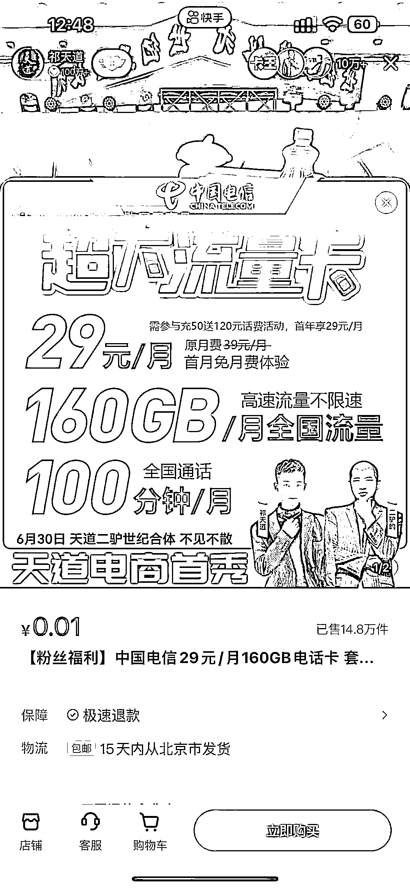

# 直播间售卖手机卡，实现年入百万

> 原文：[`www.yuque.com/for_lazy/thfiu8/gi33tk536t28ypze`](https://www.yuque.com/for_lazy/thfiu8/gi33tk536t28ypze)

## (37 赞)直播间售卖手机卡，实现年入百万 

作者： Ao 阳 

日期：2023-08-07 

大家好，我是阿阳，一个来自哈尔滨创业的 95 后，主业目前从事通信行业，在做手机号卡，已经有 2 年多的时间，虽然接触这个行业有点晚，但是也从中抓住了很多的机会，因为线上办理流量卡的资费要比线下办理的套餐优惠的很多，现在手机大家一般都是 2 个卡槽，一个作为主号常用，一个作为副卡，主要使用流量，这就衍生了很大的市场， 

剩下内容请大家移步飞书：[https://rad7nmnpd6.feishu.cn/docx/ZRUIdkOYyodJkfxdreJcrVQYnx7?from=from_copylink](https://rad7nmnpd6.feishu.cn/docx/ZRUIdkOYyodJkfxdreJcrVQYnx7?from=from_copylink) 

 

评论区： 

江 : 这最难的不就变成了获取资源么…没有渠道啊 Ao 阳 : 做什么不都是要融入圈子吗 然后渠道不就来了吗 江 : 老板，私信你了，可能有点渠道 看能不能开拓下 贾大钱 : 感觉之前在生财看到过这篇 Ao 阳 : 对的 之前有人发表过这个项目 梁 : 同行赞一个 Ao 阳 : [强][强] Blue : 还记得之前那篇吗？我记得好像连渠道都有 

  