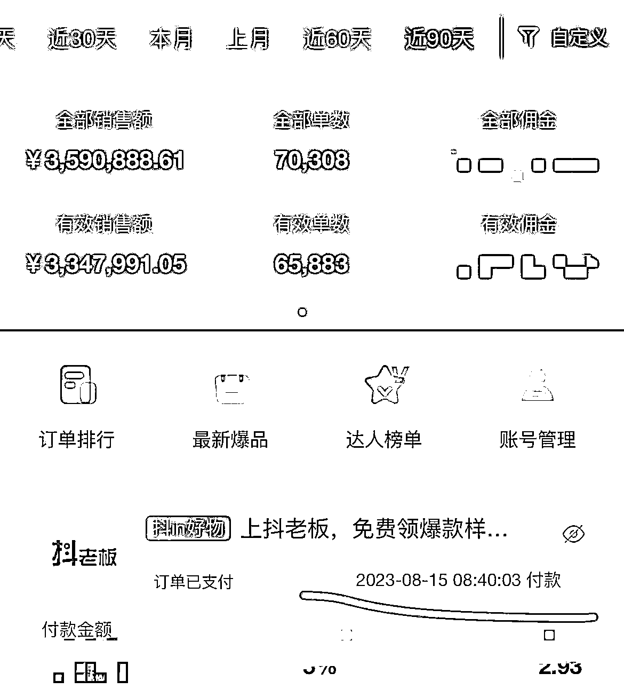
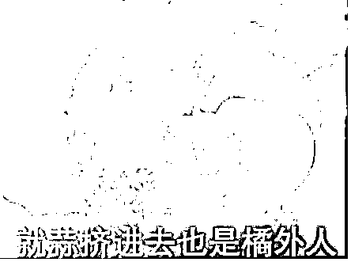
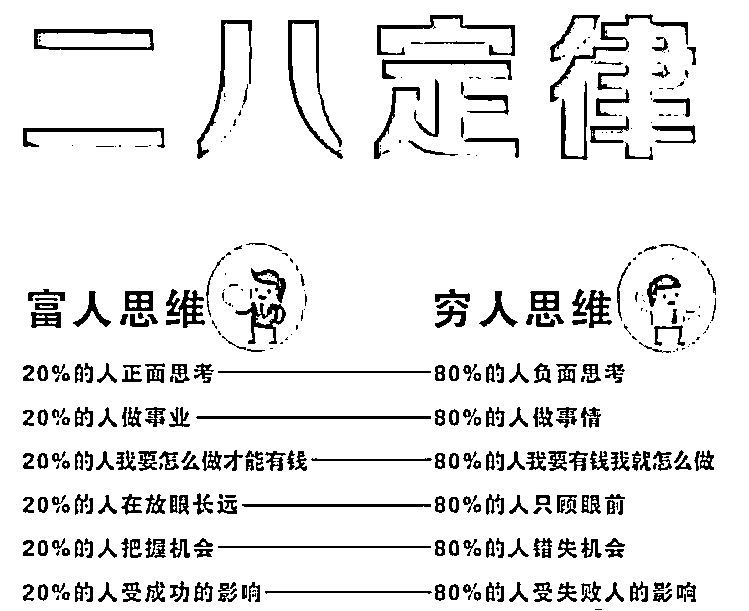

# 抖音-视频号-快手带货，新手攻克想要爆单需要攻克的 3 个问题

> 原文：[`www.yuque.com/for_lazy/thfiu8/hxqzwkgqup8py63k`](https://www.yuque.com/for_lazy/thfiu8/hxqzwkgqup8py63k)

## (169 赞)抖音-视频号-快手带货，新手攻克想要爆单需要攻克的 3 个问题 

作者： 猎音狮 

日期：2023-08-15 

生财的铁子们大家好，我是猎音狮，由于最近都忙着业务，好久没来分享了！ 

先说说没来的这段时间里，我的一个成绩。 

最近三个月，平均每个月抖音战绩 100w＋gmv： 

  

具体玩法，我之前分享过： 

这三篇帖子得到亦仁老师认可，得到了加精，感兴趣的可以复习一下！ 

[1、【抖音项目】图书类目短视频投流带货，我是如何月入 10W➕的？](https://t.zsxq.com/0e2QVMLub) 

[2、](https://t.zsxq.com/0e1k8vMdS)[普通人做抖音图书带货，从起号到投流，有哪些具体玩法？](https://t.zsxq.com/0e1k8vMdS) 

[3、#抖音【我层层优化这个文案，从“抄”到“超”，卖中高考押题作文，3 天转化 3000 单＋】](https://t.zsxq.com/0eUuHMVwk) 

很多铁子看了我的分享，有些会举一反三的，自己去跟着实操了，确确实实赚到了钱。 

有趣的是，有个铁子看了我分享的抖音创意中心榜单，想到把榜单上的视频搬运到小红书，赚了10w＋！ 

但是也有很多刚进入短视频领域的新人，经常问我一些普遍存在的问题，我总结成了这三个！ 

所以，今天不谈干货，来谈谈心态、谈谈生财认知！ 

第一、贪多图快 

  

论语曰：无欲速，无见小利。欲速则不达，见小利则大事不成。 

这句话，放到我们行业里来，我是这样理解的： 

不要贪多图块，也不要见到“小便宜”就上，比如看别人做啥赚了钱，都想掺和一脚，但是又做不精，导致啥也干不好！ 

所以，生财里面这么多项目，选一个适合自己的死磕，你终将做出成绩来！ 

并不是视频发的多你就可以爆，量是要建立在质的基础上，而不是越多越好。 

我看很多人动不动就“批量”啥都想批量，做一个视频花个一小时就没耐心了，爆单视频是需要打磨的。 

也不是不可以批量，很多小伙伴批量的时候忽略了质量，所以，我的观点是先抓质量，再放大！ 

记得我分享过，我一个11 秒的视频卖了 2.6 万单，可是 11 秒你知道我做了多久嘛，差不多就是一个白天，8 小时。 

当你静下心来做一个视频的时候，视频还没发，自己心中都会有满满成就感，潜意识里觉得会爆。 

当有这种自信的时候，即使你发了没爆，但是每次都是这种态度，不久你真的会爆单！ 

二、落不下地 

  

这一点主要针对新手！很多新手学习就是走马观花，不加以消化理解，就是说不知道从哪里做起！群加了很多，但是自己不去学习，群里聊天自己都插不上话，找不到存在感！活生生就像上面这幅图，要想融入圈子，自己就要变成圈子里的一员，不然，就“蒜”挤进去了，你也是个“橘”外人！ 

 

都说二八定律，要想成功，就要让自己变成 20%里的一员。 

那么，怎么才能冲进 20%行列！送你一张能量图！先让自己变成有能量的人，不然做啥项目都是满满的消极情绪与负能量，就很难做起来！ 

  

古人知道吾日三省吾身，这就是每日复盘，一天结束后，对照这张图，看看自己是不是充满乐观积极向上的能量，如果没有，那就要学会调整好心态！ 

客观看待这件事情，新手本来就很焦虑，希望沉下心，哪怕你每天走一步也是走，如果原地不动，或者整天飘在天上，那真没有人能帮得了你！ 

第三个问题、选品 

  

先一起来看看“满分带货公式” 

50 分（选品）+40 分（内容）+10 分（投流）=100 分（爆单） 

选品就占了半壁江山，所以学会选品很重要，不是每个品都能爆，爆不起来的品，就换一个！ 

最后，送新手朋友两句话： 

1、少做伸手党，学会自主学习，也不要总是想着借别人光环照亮自己，要学会自己发光，照亮更多的人！ 

2、最大的敌人，不是对手，也不是遇到的困难，而是你自己，加油！ 

共勉~ 

  

好了，这就是我今天对生财认知的分享，希望能给圈友们带来启发！ 

我是猎音狮，专注教辅赛道短视频带货。如果我的分享对你有所启发，就麻烦帮我点个赞，你们的认可与鼓励，将是我继续分享的动力！谢谢！ 

同行交流 VX：xxsnb6688 

评论区： 

沧海一粟 : 一如既往的好文章[强][强][强] 眼镜 : 跟豪叔做带货，太省心了，什么都安排的明明白白的，少走很多弯路[强] 猎音狮 : 感谢认可[抱拳] 猎音狮 : 感谢认可，祝老板天天爆单[咖啡] FC : 又学到了 猎音狮 : 哈哈，心态很重要 风尘 : 努力追上豪叔[奋斗] 汽车人阿伟 : 教辅赛道的一股清流😀 😀 

  