# 2023 小红书虚拟电商幼教考编赛道单账号月入 3000 保姆级教程

> 原文：[`www.yuque.com/for_lazy/thfiu8/gbkrkebfbds1o6bq`](https://www.yuque.com/for_lazy/thfiu8/gbkrkebfbds1o6bq)

## (63 赞)2023 小红书虚拟电商幼教考编赛道单账号月入 3000 保姆级教程 

作者： 书豪 

日期：2023-08-18 

大家好，我是在杭州的龙珠圈友书豪，一个连续创业四年的 95 后，目前连续四年都年入百万 

今天给大家继续拆解一下小红书的赛道，前面给大家分享了小红书这个赛道的前景和制作爆款标题、图片、文案等的方法。 

搬运，这个玩法在抖音、快手、视频号这些平台可能已经玩滥了，但小红书其实也是可以“搬运“的，为什么要加个引号，因为我们不是照抄，而是有技巧地模仿。 

而我们最近新做的一个「幼教赛道」账号，就是利用这些方法在一个月的时间内单账号能达到 4500+的收入，今天我就把做这个账号的全部经验和心得告诉你。 

一、在抖音上找对标账号 

1.  搜索幼师资料几个关键词 

2.  

3.  找到一周或小半个月对标的小爆款（点赞比较多的）图文视频 

4.  

5.  找对标一定要找目前在持续更新的对标账号，这样更容易去抄袭模仿 

6.  

7.  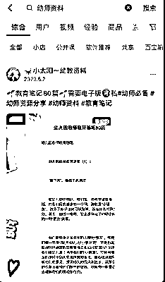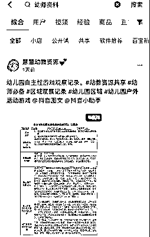 

二、 如何“搬运”对标账号作品： 

1、这里就随便拿个对标账号的作品进行搬运 

2、先复制对标作品链接然后再去下水印，这里我推荐轻抖小程序，使用起来比较方便 

3、图片下载之后在相册里进行编辑调色参数，这里对标账号我就不发出来了 还望多多理解，原作者的图片如下： 

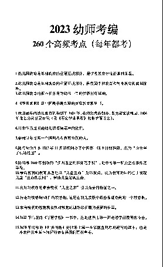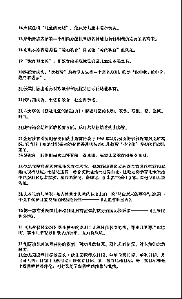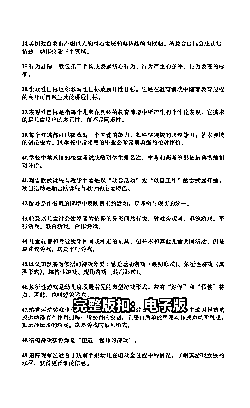 

以上三张是原作者的图片：下面三张是我伪原创的图片过程 

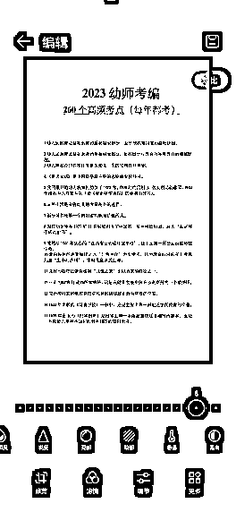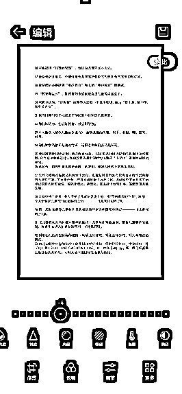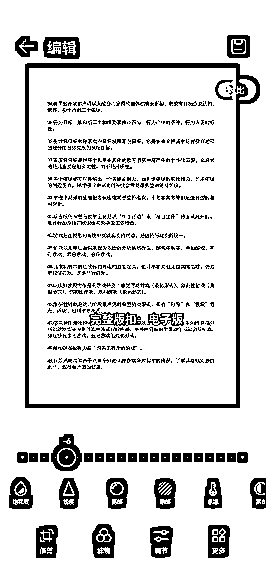 

1、下载好图片后，然后在相册中找到你下载的图片开始进行编辑， 

2、目前我用的是安卓手机，第一步先进行调节模式，这里调色根据大家的喜爱来 

3、然后进行第二步调整色温，进行图片的颜色修改，这里可以选装不同的颜色，黑色、蓝色、粉色、绿色、红色、棕色等等一系列颜色，可供大家选择 

4、在这编辑好之后大家可选择导出即可，以下几个是我做好的图片进行展示参考 

 

以上几张图片是根据我的喜爱和伪原创合成出来的图片，这样的基本操作直接过审，这些都是我亲自己测试使用得出来的，不好使用也不会跟大家分享出来。 

当然如果怕被系统识别，可以把这些文字复制出来到 word 文档中，自己进行二次编辑发布。 

三、资料怎么来？ 

从抖音把图文“搬运”到小红书后，静待流量的爆发，但是当流量起来了，怎么承接这部分用户呢？也就是说我出单了但是没有资料怎么办？ 

很简单，专业的资料交给专业的人去做，直接去找抖音对标账号的博主去买资料就好了，他们的资料绝对比我们自己去搜集来的资料完善。 

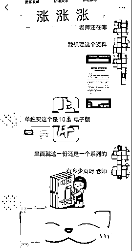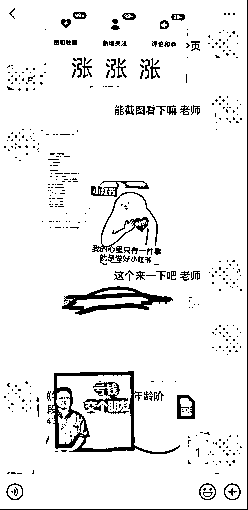 

以上是我在同行那边买的资料的过程，我的建议是在大家没有出单的时候不建议去买 

等你出单之后直接模拟用户直接去买就好了，只要把一份资料的钱收回来，后面就是纯利。 

四、定价 

我从抖音博主那边买的资料，有单份文件，也有打包卖的资料群 

因此你也可以对你的用户这样进行售卖，比如一份资料 9.9，进资料群 29.9 

大部分情况下用户都会选择 29.9，因为比 9.9 贵不了多少，还能多获得很多资料 

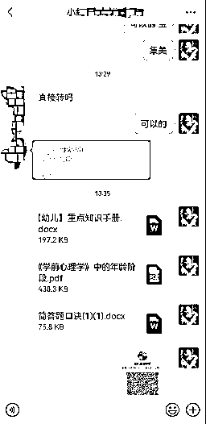 

五、如何转化 

流量有了，资料有了，下一步就是转化。 

但是转化也面临一个问题，自己本身并不是幼师，也没有相关经验，如果用户来问一些专业性较强的问题，回答不上来露馅了怎么办？ 

请放心，大多数已经倒流进微信的用户，他们的目的只有一个，就是拿资料，大多数人面对陌生人都是以自我为中心的，不会去管对方是谁，只要能满足自己的需求就行。 

所以你可以去抖音对标博主那，假装你是一个准备考幼师的用户，去把他的话术学过来就行。 

这里我采用的是以「女性」的身份去跟别人聊天，比如多用宝、集美、姐妹这些去打招呼，增加亲切感，对方的抵触心就没那么强，转化会大大提升，以下用几张图片代替： 

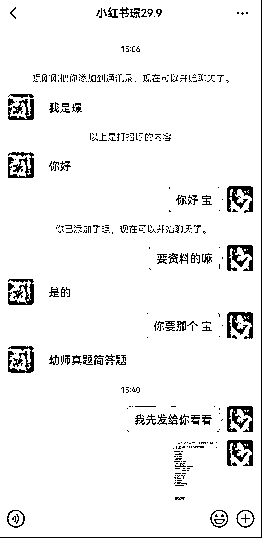 

上面这五步就是我们做这个账号的大致流程 

虽然我们做虚拟资料流量没有别人的大，但是流量足够精准，一般情况下，这个账号一个千浏览，大概能引流到微信 20-30 人，最终成交 10 人以上，转化率是蛮高的： 

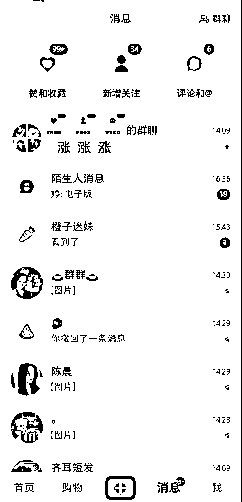 

以上都是一个账号的数据，原本我想一个账号跑通后，再多做几个账号去放大，但没想到的是，一个账号的消息你都回复不过来，因为全部都是精准用户，都是带着购买或者白嫖意愿的用户，成交自然就简单了，当然，也少不了一些白嫖怪，不过也不要紧，只要能引流到微信，后续就有转化的可能。 

最后让大家看一下我这个新账号的变现情况：不能说大富大贵，但起码每天能固定收入小几百，饭钱不就有了吗 

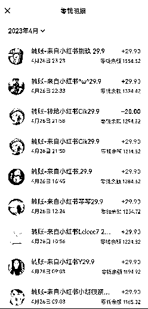 

以上，一起生财有术！欢迎各位圈友前来交流，微信  wshinvest1 

如果方向没有错的，那就死磕到底，接下来交给时间就好。 

评论区： 

谢安生 : 高产，赞赞赞！[强][强][强] 易生 : 书豪教练牛啊，这个小红书玩法真多，就看怎么用啊 剽悍的大春 : 书豪点赞👍，牛逼 雨烟 : 从抖音买的资料，里面会有原来的博主的水印吧，里面会有他自己的联系方式 书豪 : 感谢安生[呲牙][呲牙] 书豪 : 易生是餐饮大佬，赚大钱找易生加盟 书豪 : 谢谢春哥 书豪 : 去除水印不就好了 

 