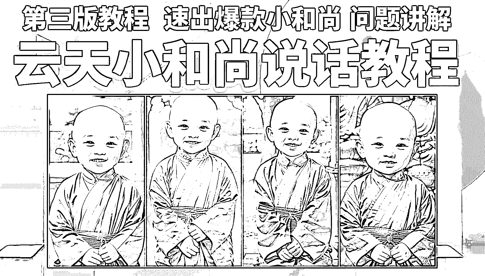
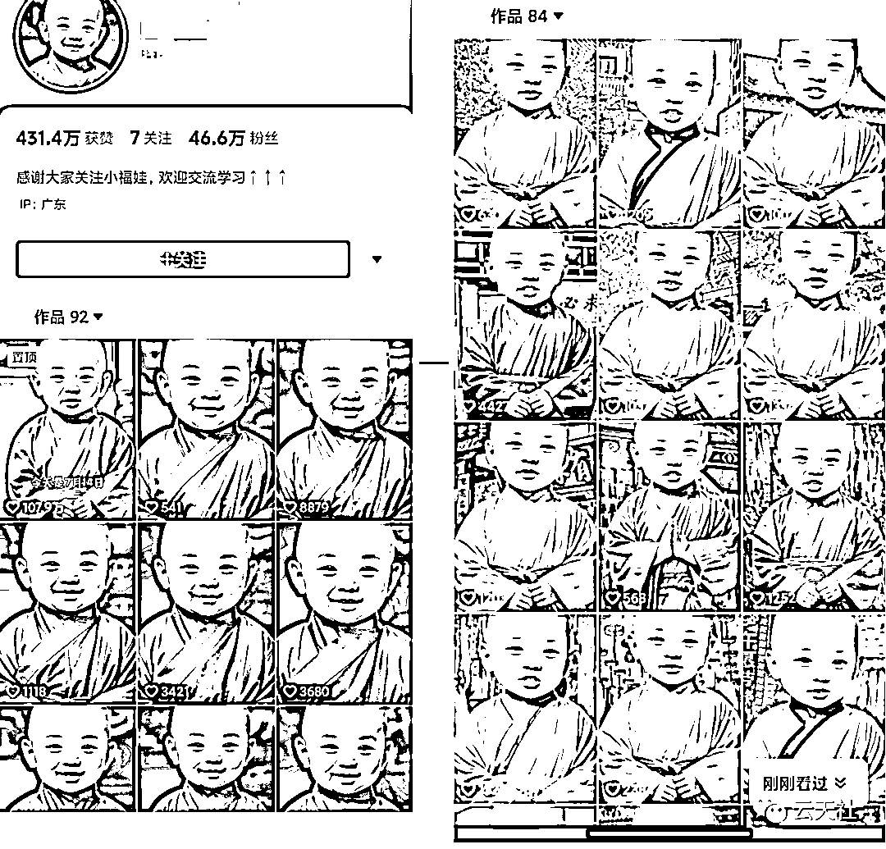

# 小和尚说话教程，7 天万粉（第 3 版教程）

> 原文：[`www.yuque.com/for_lazy/thfiu8/lwxmg17tdpydow3w`](https://www.yuque.com/for_lazy/thfiu8/lwxmg17tdpydow3w)

## (98 赞)小和尚说话教程，7 天万粉（第 3 版教程）

作者： 云天

日期：2023-08-21

大家好，我是云天， 一个网赚自媒体人，有爱的知识分享者。目前主要从事知识分享社群，钻研网络黑科技。

之前给圈友分享了老者思维和小和尚说话的教程，收到了很多圈友的喜欢，也有很多圈友私下交流，视频爆了，涨粉了，听到这些好消息，我也很开心。

然后也有很多圈友加来，问我，云天，像下面这种小和尚的图片怎么做？有没有咒语分享一下。

其实，云天还真没有什么咒语，但是在这里，云天教大家如何不用魔法就可以快速的做这类图片。

下面是**文字教程**，最后依然会奉上云天给大家录制的**视频教程**供大家学习。

因为星球受限，详情请大家移步飞书

[`ixy2s5ruvqf.feishu.cn/docx/OeyJde07Co30E7xZZiTcVKeAnK9?from=from_copylink`](https://ixy2s5ruvqf.feishu.cn/docx/OeyJde07Co30E7xZZiTcVKeAnK9?from=from_copylink)

* * *

评论区：

Mindy : 看了上一版教程，已经在实操了，非常感谢！
云天 : [玫瑰]
文少 : 大佬牛逼
阿法 : 真的太有想法了，牛
希平 : 真的很棒，通俗易懂
NickW : 请问如何实现让图片开口说话？
云天 : 点我头像，翻阅历史文章

* * *